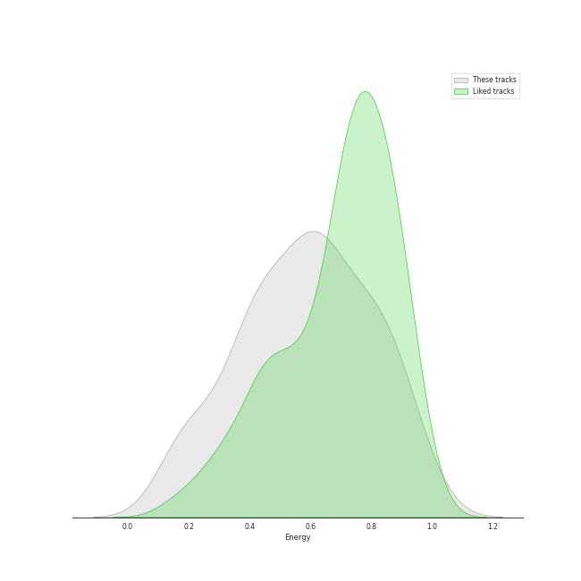
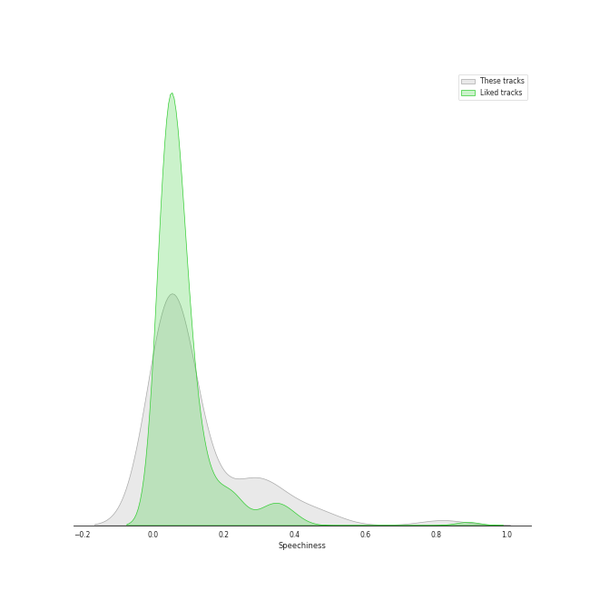
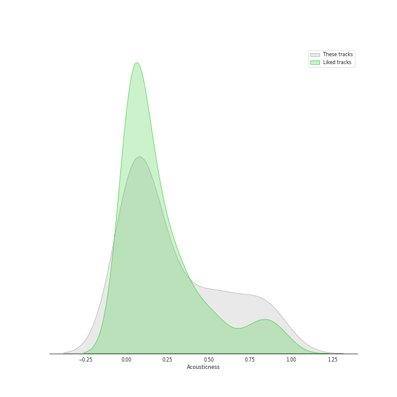
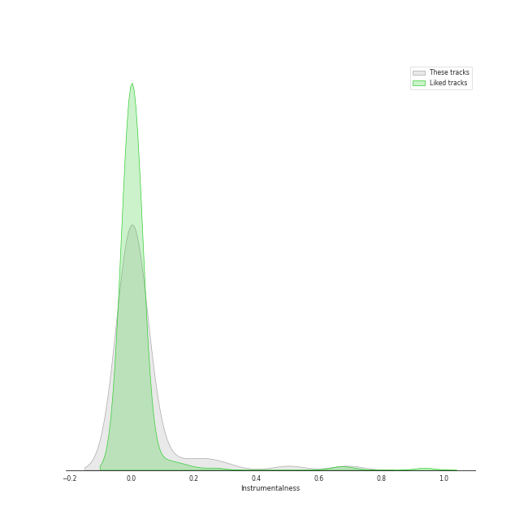
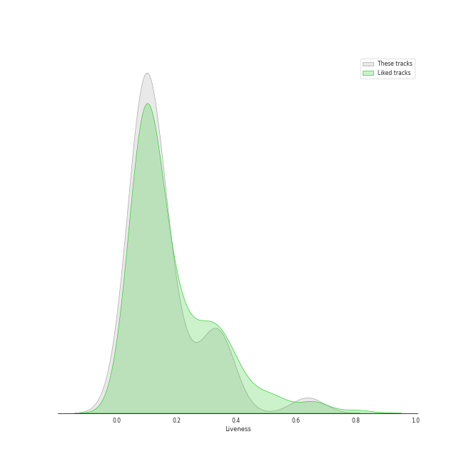
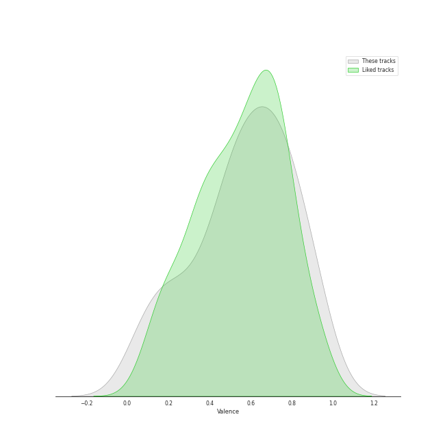
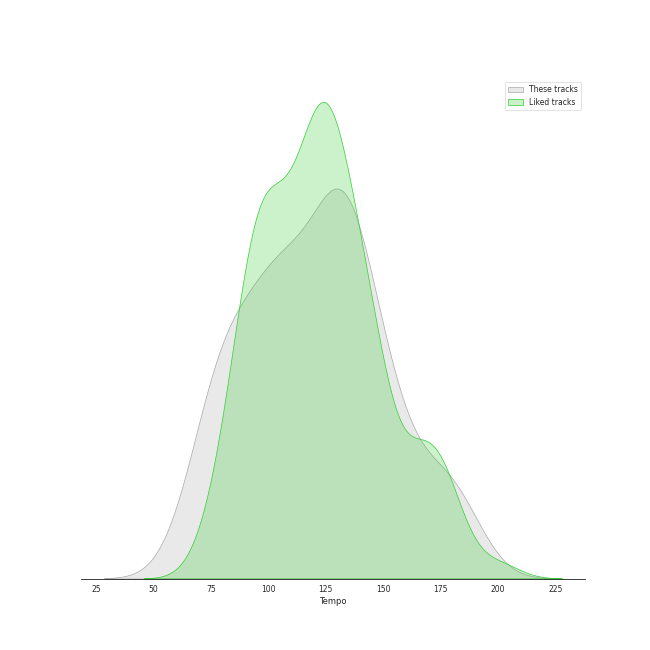

# Track Features for Atlantic Records

## Danceability

| ​ | 10 most Danceable tracks | ​​ | 10 least Danceable tracks |
|:---|:---|:---|:---|
|  | WAP (feat. Megan Thee Stallion) (0.935) |  | Stairway to Heaven - Remaster (0.338) |
|  | That's What I Like (0.853) |  | Jar of Hearts (0.349) |
|  | About Damn Time (0.836) |  | Black Dog - Remaster (0.437) |
|  | 777 (0.832) |  | One Last Time (0.449) |
|  | Area Codes (0.823) |  | Minefields (0.476) |
|  | 24K Magic (0.818) |  | It's Quiet Uptown (0.484) |
|  | At My Worst (0.813) |  | That Would Be Enough (0.499) |
|  | Rather Be (feat. Jess Glynne) (0.799) |  | Sucker for Pain (with Wiz Khalifa, Imagine Dragons, Logic & Ty Dolla $ign feat. X Ambassadors) (0.502) |
|  | Low Key (feat. Tyga) (0.79) |  | What Sarah Said (0.505) |
|  | Fly As Me (0.783) |  | I Will Follow You into the Dark (0.517) |

## Energy

| ​ | 10 most Energetic tracks | ​​ | 10 least Energetic tracks |
|:---|:---|:---|:---|
|  | Boss Bitch (0.955) |  | It's Quiet Uptown (0.187) |
|  | Wonderland (From “American Song Contest”) (0.935) |  | That Would Be Enough (0.2) |
|  | Immigrant Song - Remaster (0.932) |  | I Will Follow You into the Dark (0.206) |
|  | Black Dog - Remaster (0.864) |  | When I Was Your Man (0.28) |
|  | Finesse - Remix; feat. Cardi B (0.859) |  | The 12 Days of Christmas (0.293) |
|  | Dance The Night - From Barbie The Album (0.845) |  | Stairway to Heaven - Remaster (0.34) |
|  | Hot In It (feat. Charli XCX) (0.841) |  | Jar of Hearts (0.348) |
|  | Santa's Coming for Us (0.814) |  | Area Codes (0.388) |
|  | The Other Side (feat. CeeLo Green and B.o.B) (0.814) |  | Heathens (0.396) |
|  | 24K Magic (0.803) |  | Lucky (0.414) |

## Speechiness

| ​ | 10 most Speechy tracks | ​​ | 10 least Speechy tracks |
|:---|:---|:---|:---|
|  | Aaron Burr, Sir (0.818) |  | What Sarah Said (0.0268) |
|  | Area Codes (0.491) |  | Heathens (0.0286) |
|  | The Election of 1800 (0.462) |  | Good Ones (0.0293) |
|  | My Shot (0.415) |  | The Other Side (feat. CeeLo Green and B.o.B) (0.0303) |
|  | WAP (feat. Megan Thee Stallion) (0.375) |  | Love's Train (0.031) |
|  | One Last Time (0.356) |  | Jar of Hearts (0.0316) |
|  | Sucker for Pain (with Wiz Khalifa, Imagine Dragons, Logic & Ty Dolla $ign feat. X Ambassadors) (0.317) |  | Leave The Door Open (0.0324) |
|  | The 12 Days of Christmas (0.316) |  | Snowman (0.0331) |
|  | Light Switch (0.308) |  | Stairway to Heaven - Remaster (0.0339) |
|  | Say No to This (0.305) |  | At My Worst (0.0349) |

## Acousticness

| ​ | 10 most Acoustic tracks | ​​ | 10 least Acoustic tracks |
|:---|:---|:---|:---|
|  | When I Was Your Man (0.932) |  | 777 (0.00295) |
|  | I Will Follow You into the Dark (0.924) |  | Hot In It (feat. Charli XCX) (0.00445) |
|  | The 12 Days of Christmas (0.831) |  | Fly As Me (0.00756) |
|  | That Would Be Enough (0.819) |  | Finesse (0.00781) |
|  | What Sarah Said (0.801) |  | That's What I Like (0.013) |
|  | It's Quiet Uptown (0.796) |  | Immigrant Song - Remaster (0.013) |
|  | At My Worst (0.777) |  | Finesse - Remix; feat. Cardi B (0.0185) |
|  | Jar of Hearts (0.726) |  | Area Codes (0.0187) |
|  | One Last Time (0.631) |  | WAP (feat. Megan Thee Stallion) (0.0194) |
|  | Stairway to Heaven - Remaster (0.58) |  | Dance The Night - From Barbie The Album (0.0207) |

## Instrumentalness

| ​ | 10 most Instrumental tracks | ​​ | 10 least Instrumental tracks |
|:---|:---|:---|:---|
|  | Immigrant Song - Remaster (0.169) |  | Leave The Door Open (0.0) |
|  | Black Dog - Remaster (0.0314) |  | Jar of Hearts (0.0) |
|  | What Sarah Said (0.0217) |  | Lucky (0.0) |
|  | Stairway to Heaven - Remaster (0.0032) |  | One Last Time (0.0) |
|  | 777 (0.000763) |  | That's What I Like (0.0) |
|  | Light Switch (0.000321) |  | The Election of 1800 (0.0) |
|  | Heathens (3.58e-05) |  | Please Me (0.0) |
|  | Love's Train (2.29e-05) |  | When I Was Your Man (0.0) |
|  | Wait for It (4.04e-06) |  | At My Worst (0.0) |
|  | The Other Side (feat. CeeLo Green and B.o.B) (3.7e-06) |  | Minefields (0.0) |

## Liveness

| ​ | 10 most Live tracks | ​​ | 10 least Live tracks |
|:---|:---|:---|:---|
|  | Sucker for Pain (with Wiz Khalifa, Imagine Dragons, Logic & Ty Dolla $ign feat. X Ambassadors) (0.65) |  | Finesse - Remix; feat. Cardi B (0.0215) |
|  | The Schuyler Sisters (0.627) |  | Finesse (0.0232) |
|  | The 12 Days of Christmas (0.378) |  | Hot In It (feat. Charli XCX) (0.0413) |
|  | Smokin Out The Window (0.351) |  | Santa's Coming for Us (0.0475) |
|  | Immigrant Song - Remaster (0.349) |  | Fly As Me (0.0606) |
|  | 777 (0.337) |  | After Last Night (with Thundercat & Bootsy Collins) (0.0608) |
|  | About Damn Time (0.335) |  | See You Again (feat. Charlie Puth) (0.0649) |
|  | Dance The Night - From Barbie The Album (0.329) |  | It's Quiet Uptown (0.0785) |
|  | Locked out of Heaven (0.309) |  | One Last Time (0.0805) |
|  | The Election of 1800 (0.306) |  | Good Ones (0.0806) |

## Valence

| ​ | 10 most Happy tracks | ​​ | 10 least Happy tracks |
|:---|:---|:---|:---|
|  | Finesse (0.939) |  | What Sarah Said (0.0401) |
|  | Finesse - Remix; feat. Cardi B (0.926) |  | Jar of Hearts (0.0886) |
|  | 777 (0.909) |  | That Would Be Enough (0.185) |
|  | Light Switch (0.905) |  | Stairway to Heaven - Remaster (0.197) |
|  | Locked out of Heaven (0.867) |  | It's Quiet Uptown (0.227) |
|  | That's What I Like (0.86) |  | Minefields (0.243) |
|  | Smokin Out The Window (0.848) |  | Grenade (0.245) |
|  | Love's Train (0.807) |  | See You Again (feat. Charlie Puth) (0.283) |
|  | The Schuyler Sisters (0.792) |  | Snowman (0.326) |
|  | Good Ones (0.789) |  | WAP (feat. Megan Thee Stallion) (0.357) |

## Tempo

| ​ | 10 most Fast tracks | ​​ | 10 least Fast tracks |
|:---|:---|:---|:---|
|  | Light Switch (184.008) |  | The Election of 1800 (67.426) |
|  | My Shot (180.466) |  | When I Was Your Man (72.795) |
|  | One Last Time (176.989) |  | Jar of Hearts (74.541) |
|  | Sucker for Pain (with Wiz Khalifa, Imagine Dragons, Logic & Ty Dolla $ign feat. X Ambassadors) (169.021) |  | See You Again (feat. Charlie Puth) (80.025) |
|  | Aaron Burr, Sir (160.387) |  | I Will Follow You into the Dark (80.401) |
|  | Truth Hurts (158.087) |  | Say No to This (81.035) |
|  | Area Codes (154.569) |  | Black Dog - Remaster (81.394) |
|  | Minefields (152.617) |  | Smokin Out The Window (82.03) |
|  | I'm Yours (150.96) |  | Stairway to Heaven - Remaster (82.433) |
|  | Leave The Door Open (148.088) |  | Wait for It (86.534) |
