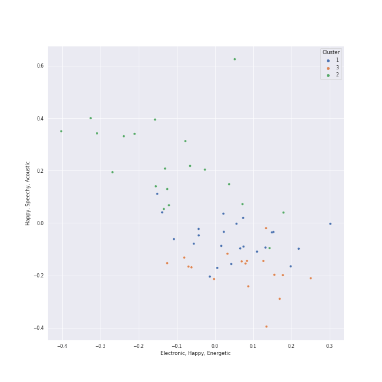

# Clusters in Atlantic Records

## Cluster #1

23 tracks

| Art | Track | Album | Artists | Label | Rank | 💚 | 🔗 |
|:---|:---|:---|:---|:---|---:|:---|:---|
|  | Fly As Me | An Evening With Silk Sonic | [Bruno Mars](../../../../artists/bruno_mars/overview.md), Anderson .Paak, Silk Sonic | [Aftermath Entertainment/Atlantic](../..) | nan | 💚 | [🔗](https://open.spotify.com/track/3a6FcTyvSf0ED3VXeH3PJ5) |
|  | 24K Magic | 24K Magic | [Bruno Mars](../../../../artists/bruno_mars/overview.md) | [Atlantic Records](../..) | nan | | [🔗](https://open.spotify.com/track/6b8Be6ljOzmkOmFslEb23P) |
|  | Love's Train | Love's Train | [Bruno Mars](../../../../artists/bruno_mars/overview.md), Anderson .Paak, Silk Sonic | [Aftermath Entertainment/Atlantic](../..) | nan | | [🔗](https://open.spotify.com/track/60gTdTwaNtGAzIxKfeGVfJ) |
|  | Wait for It | Hamilton (Original Broadway Cast Recording) | Leslie Odom Jr., Original Broadway Cast of Hamilton | [Atlantic Records](../..) | nan | 💚 | [🔗](https://open.spotify.com/track/7EqpEBPOohgk7NnKvBGFWo) |
|  | Please Me | Please Me | Cardi B, [Bruno Mars](../../../../artists/bruno_mars/overview.md) | [Atlantic/KSR](../..) | nan | 💚 | [🔗](https://open.spotify.com/track/0PG9fbaaHFHfre2gUVo7AN) |
|  | Rather Be (feat. Jess Glynne) | New Eyes | [Clean Bandit](../../../../artists/clean_bandit/overview.md), Jess Glynne | [Big Beat Records/Atlantic](../..) | nan | 💚 | [🔗](https://open.spotify.com/track/0am001WwFBVGDGLwRh3ixi) |
|  | Good Ones | CRASH | Charli XCX | [Atlantic Records](../..) | nan | 💚 | [🔗](https://open.spotify.com/track/2grSOc6HNTXQQXNoRKt9UM) |
|  | Running Out Of Time | This Is Why | Paramore | [Atlantic Records](../..) | nan | | [🔗](https://open.spotify.com/track/5NRtdsFFlmyE8qDMgS08PE) |
|  | About Damn Time | About Damn Time | Lizzo | [Nice Life/Atlantic](../..) | nan | 💚 | [🔗](https://open.spotify.com/track/1PckUlxKqWQs3RlWXVBLw3) |
|  | Sweet but Psycho | Heaven & Hell | Ava Max | [Atlantic Records](../..) | nan | 💚 | [🔗](https://open.spotify.com/track/7DnAm9FOTWE3cUvso43HhI) |
## Cluster #2

20 tracks

| Art | Track | Album | Artists | Label | Rank | 💚 | 🔗 |
|:---|:---|:---|:---|:---|---:|:---|:---|
|  | When I Was Your Man | Unorthodox Jukebox | [Bruno Mars](../../../../artists/bruno_mars/overview.md) | [Atlantic Records](../..) | 700 | 💚 | [🔗](https://open.spotify.com/track/0nJW01T7XtvILxQgC5J7Wh) |
|  | jar of hearts | lovestrong. | Christina Perri | [Atlantic Records](../..) | nan | | [🔗](https://open.spotify.com/track/0HZhYMZOcUzZKSFwPOti6m) |
|  | One Last Time | Hamilton (Original Broadway Cast Recording) | Christopher Jackson, Lin-Manuel Miranda, Original Broadway Cast of Hamilton | [Atlantic Records](../..) | nan | | [🔗](https://open.spotify.com/track/0Iys022UwQ8xBfxE1g4nWZ) |
|  | It's Quiet Uptown | Hamilton (Original Broadway Cast Recording) | Renée Elise Goldsberry, Lin-Manuel Miranda, Phillipa Soo, Original Broadway Cast of Hamilton | [Atlantic Records](../..) | nan | | [🔗](https://open.spotify.com/track/40LYL1Z6xgCn5cBybo5K0D) |
|  | That Would Be Enough | Hamilton (Original Broadway Cast Recording) | Phillipa Soo, Lin-Manuel Miranda | [Atlantic Records](../..) | nan | | [🔗](https://open.spotify.com/track/6oF8ueLn5hIl4PRp17sxW6) |
|  | The Knight Bus | Harry Potter and the Prisoner of Azkaban / Original Motion Picture Soundtrack | John Williams | [Warner Sunset/Nonesuch/Atlantic](../..) | nan | | [🔗](https://open.spotify.com/track/2owMaKos8aeNx0usmPCVmy) |
|  | Snowman | Everyday Is Christmas (Deluxe Edition) | [Sia](../../../../artists/sia/overview.md) | [Monkey Puzzle/Atlantic](../..) | nan | | [🔗](https://open.spotify.com/track/7uoFMmxln0GPXQ0AcCBXRq) |
|  | See You Again (feat. Charlie Puth) | See You Again (feat. Charlie Puth) | Wiz Khalifa, Charlie Puth | [Atlantic Records](../..) | nan | | [🔗](https://open.spotify.com/track/2JzZzZUQj3Qff7wapcbKjc) |
|  | Stairway to Heaven - Remaster | Led Zeppelin IV (Deluxe Edition) | Led Zeppelin | [Atlantic Records](../..) | nan | | [🔗](https://open.spotify.com/track/5CQ30WqJwcep0pYcV4AMNc) |
|  | The 12 Days of Christmas | Christmas Cheers (Deluxe) | Straight No Chaser | [Atco/Atlantic](../..) | nan | | [🔗](https://open.spotify.com/track/5f5wlkRHWhYxOdp1hOUsTb) |
## Cluster #3

17 tracks

| Art | Track | Album | Artists | Label | Rank | 💚 | 🔗 |
|:---|:---|:---|:---|:---|---:|:---|:---|
|  | After Last Night (with Thundercat & Bootsy Collins) | An Evening With Silk Sonic | [Bruno Mars](../../../../artists/bruno_mars/overview.md), Anderson .Paak, Silk Sonic, Thundercat, Bootsy Collins | [Aftermath Entertainment/Atlantic](../..) | nan | | [🔗](https://open.spotify.com/track/3jiKUMXqwEodB7gVv1RMZU) |
|  | Finesse - Remix; feat. Cardi B | Finesse (Remix) [feat. Cardi B] | [Bruno Mars](../../../../artists/bruno_mars/overview.md), Cardi B | [Atlantic Records](../..) | nan | 💚 | [🔗](https://open.spotify.com/track/3Vo4wInECJQuz9BIBMOu8i) |
|  | My Shot | Hamilton (Original Broadway Cast Recording) | Lin-Manuel Miranda, Daveed Diggs, Okieriete Onaodowan, Leslie Odom Jr., Original Broadway Cast of Hamilton, Anthony Ramos | [Atlantic Records](../..) | nan | | [🔗](https://open.spotify.com/track/4cxvludVmQxryrnx1m9FqL) |
|  | Boss Bitch | Boss Bitch | [Doja Cat](../../../../artists/doja_cat/overview.md) | [Atlantic Records](../..) | nan | 💚 | [🔗](https://open.spotify.com/track/78qd8dvwea0Gosb6Fe6j3k) |
|  | Wonderland (From “American Song Contest”) | Wonderland (From “American Song Contest”) | AleXa, American Song Contest | [Atlantic Records](../..) | nan | | [🔗](https://open.spotify.com/track/12gIiC7uS9fvSVTvu66YDO) |
|  | Dance The Night - From Barbie The Album | Dance The Night (From Barbie The Album) | [Dua Lipa](../../../../artists/dua_lipa/overview.md) | [Atlantic Records](../..) | nan | 💚 | [🔗](https://open.spotify.com/track/1vYXt7VSjH9JIM5oRRo7vA) |
|  | Santa's Coming for Us | Everyday Is Christmas (Deluxe Edition) | [Sia](../../../../artists/sia/overview.md) | [Monkey Puzzle/Atlantic](../..) | 361 | | [🔗](https://open.spotify.com/track/1N1ZpYUJc9fwrqk53FGgWv) |
|  | Light Switch | CHARLIE | Charlie Puth | [Atlantic Records](../..) | nan | 💚 | [🔗](https://open.spotify.com/track/1jEBSDN5vYViJQr78W7jr2) |
|  | Hot In It (feat. Charli XCX) | Hot In It | Tiësto, Charli XCX | [Atlantic Records](../..) | nan | | [🔗](https://open.spotify.com/track/3Z7CaxQkqbIs1rewKi6v4W) |
|  | Sucker for Pain (with Wiz Khalifa, Imagine Dragons, Logic & Ty Dolla $ign feat. X Ambassadors) | Sucker for Pain (with Logic & Ty Dolla $ign feat. X Ambassadors) | Lil Wayne, Wiz Khalifa, Imagine Dragons, X Ambassadors, Logic, Ty Dolla $ign | [Atlantic Records](../..) | nan | | [🔗](https://open.spotify.com/track/4dASQiO1Eoo3RJvt74FtXB) |