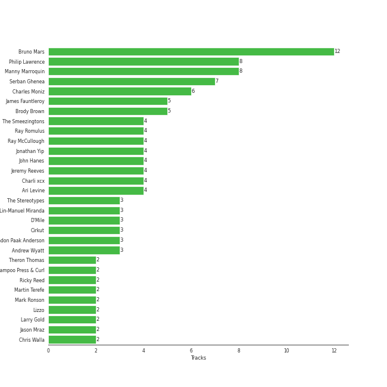

# Atlantic Records

61 songs

[See Track Features](audio_features.md)

[See Clusters](clusters/overview.md)

Appears as:
- Atlantic Records (41 tracks)
- Aftermath Entertainment/Atlantic (6 tracks)
- Monkey Puzzle/Atlantic (3 tracks)
- Atlantic Records/ATG (2 tracks)
- Atlantic/KSR (2 tracks)
- Nice Life/Atlantic (2 tracks)
- Warner Sunset/Nonesuch/Atlantic (2 tracks)
- Atco/Atlantic (1 tracks)
- Big Beat Records/Atlantic (1 tracks)
- Latium/Atlantic (1 tracks)

## Top Artists

| Art | Tracks | 💚 | Artist | 🔗 |
|:---|---:|---:|:---|:---|
|  | 15 | 11 | [Bruno Mars](../../artists/bruno_mars/overview.md) | [🔗](https://open.spotify.com/artist/0du5cEVh5yTK9QJze8zA0C) |
|  | 8 | 3 | Original Broadway Cast of Hamilton | [🔗](https://open.spotify.com/artist/3UUJfRbrA2nTbcg4i0MOwu) |
|  | 7 | 3 | Leslie Odom Jr. | [🔗](https://open.spotify.com/artist/3cR4rhS2hBWqI7rJEBacvN) |
|  | 6 | 3 | Silk Sonic | [🔗](https://open.spotify.com/artist/6PvvGcCY2XtUcSRld1Wilr) |
|  | 6 | 3 | Anderson .Paak | [🔗](https://open.spotify.com/artist/3jK9MiCrA42lLAdMGUZpwa) |
|  | 3 | 3 | Cardi B | [🔗](https://open.spotify.com/artist/4kYSro6naA4h99UJvo89HB) |
|  | 8 | 2 | Lin-Manuel Miranda | [🔗](https://open.spotify.com/artist/4aXXDj9aZnlshx7mzj3W1N) |
|  | 3 | 2 | Charli xcx | [🔗](https://open.spotify.com/artist/25uiPmTg16RbhZWAqwLBy5) |
|  | 2 | 2 | Lizzo | [🔗](https://open.spotify.com/artist/56oDRnqbIiwx4mymNEv7dS) |
|  | 2 | 2 | Jason Mraz | [🔗](https://open.spotify.com/artist/4phGZZrJZRo4ElhRtViYdl) |

See all 54 artists

| Art | Tracks | 💚 | Artist | 🔗 |
|:---|---:|---:|:---|:---|
|  | 2 | 2 | Death Cab for Cutie | [🔗](https://open.spotify.com/artist/0YrtvWJMgSdVrk3SfNjTbx) |
| | 4 | 1 | Okieriete Onaodowan | [🔗](https://open.spotify.com/artist/6G3sPhnj4JBCsBVBGvZnkk) |
|  | 4 | 1 | Daveed Diggs | [🔗](https://open.spotify.com/artist/3twuAojvYNrlWZpMkxLm3P) |
|  | 4 | 1 | Phillipa Soo | [🔗](https://open.spotify.com/artist/2OEGI2wrCVmvavKEOMlccy) |
|  | 3 | 1 | Anthony Ramos | [🔗](https://open.spotify.com/artist/660YptcR0hNHJ8iEr1qcse) |
|  | 3 | 1 | [Sia](../../artists/sia/overview.md) | [🔗](https://open.spotify.com/artist/5WUlDfRSoLAfcVSX1WnrxN) |
|  | 2 | 1 | Christopher Jackson | [🔗](https://open.spotify.com/artist/6sLwRSXSUF5JTUnQaFenyj) |
|  | 2 | 1 | Charlie Puth | [🔗](https://open.spotify.com/artist/6VuMaDnrHyPL1p4EHjYLi7) |
|  | 2 | 1 | Faouzia | [🔗](https://open.spotify.com/artist/5NhgsV7qPWHZqYEMKzbYvo) |
|  | 2 | 1 | Jasmine Cephas-Jones | [🔗](https://open.spotify.com/artist/4H3e5t5utgPvj6Nsuda5QF) |
|  | 1 | 1 | Colbie Caillat | [🔗](https://open.spotify.com/artist/6aZyMrc4doVtZyKNilOmwu) |
|  | 1 | 1 | Ally Brooke | [🔗](https://open.spotify.com/artist/6TXM1kV4L8DsDAkAfbOPYk) |
|  | 1 | 1 | [Clean Bandit](../../artists/clean_bandit/overview.md) | [🔗](https://open.spotify.com/artist/6MDME20pz9RveH9rEXvrOM) |
|  | 1 | 1 | [Dua Lipa](../../artists/dua_lipa/overview.md) | [🔗](https://open.spotify.com/artist/6M2wZ9GZgrQXHCFfjv46we) |
|  | 1 | 1 | B.o.B | [🔗](https://open.spotify.com/artist/5ndkK3dpZLKtBklKjxNQwT) |
|  | 1 | 1 | CeeLo Green | [🔗](https://open.spotify.com/artist/5nLYd9ST4Cnwy6NHaCxbj8) |
|  | 1 | 1 | [Doja Cat](../../artists/doja_cat/overview.md) | [🔗](https://open.spotify.com/artist/5cj0lLjcoR7YOSnhnX0Po5) |
|  | 1 | 1 | Tyga | [🔗](https://open.spotify.com/artist/5LHRHt1k9lMyONurDHEdrp) |
|  | 1 | 1 | Ava Max | [🔗](https://open.spotify.com/artist/4npEfmQ6YuiwW1GpUmaq3F) |
|  | 1 | 1 | Jess Glynne | [🔗](https://open.spotify.com/artist/4ScCswdRlyA23odg9thgIO) |
|  | 1 | 1 | Sydney James Harcourt | [🔗](https://open.spotify.com/artist/2fHcpUAFhqmfloo2HkBN3e) |
|  | 1 | 1 | Rina Sawayama | [🔗](https://open.spotify.com/artist/2KEqzdPS7M5YwGmiuPTdr5) |
|  | 1 | 1 | Pink Sweat$ | [🔗](https://open.spotify.com/artist/1W7FNibLa0O0b572tB2w7t) |
|  | 1 | 1 | Megan Thee Stallion | [🔗](https://open.spotify.com/artist/181bsRPaVXVlUKXrxwZfHK) |
|  | 3 | 0 | John Williams | [🔗](https://open.spotify.com/artist/3dRfiJ2650SZu6GbydcHNb) |
|  | 3 | 0 | Led Zeppelin | [🔗](https://open.spotify.com/artist/36QJpDe2go2KgaRleHCDTp) |
|  | 2 | 0 | Renée Elise Goldsberry | [🔗](https://open.spotify.com/artist/5VJN4jB6PqqEg4kJiAj6Eu) |
|  | 2 | 0 | Wiz Khalifa | [🔗](https://open.spotify.com/artist/137W8MRPWKqSmrBGDBFSop) |
|  | 1 | 0 | Ty Dolla $ign | [🔗](https://open.spotify.com/artist/7c0XG5cIJTrrAgEC3ULPiq) |
|  | 1 | 0 | Christina Perri | [🔗](https://open.spotify.com/artist/7H55rcKCfwqkyDFH9wpKM6) |
|  | 1 | 0 | Paramore | [🔗](https://open.spotify.com/artist/74XFHRwlV6OrjEM0A2NCMF) |
|  | 1 | 0 | John Legend | [🔗](https://open.spotify.com/artist/5y2Xq6xcjJb2jVM54GHK3t) |
|  | 1 | 0 | Bootsy Collins | [🔗](https://open.spotify.com/artist/5K0rbdBrs2tNXe5LeWMATT) |
|  | 1 | 0 | Lil Wayne | [🔗](https://open.spotify.com/artist/55Aa2cqylxrFIXC767Z865) |
|  | 1 | 0 | Imagine Dragons | [🔗](https://open.spotify.com/artist/53XhwfbYqKCa1cC15pYq2q) |
|  | 1 | 0 | Logic | [🔗](https://open.spotify.com/artist/4xRYI6VqpkE3UwrDrAZL8L) |
|  | 1 | 0 | AleXa | [🔗](https://open.spotify.com/artist/4jCGRzuZkwo8CxboiANMEU) |
|  | 1 | 0 | Thundercat | [🔗](https://open.spotify.com/artist/4frXpPxQQZwbCu3eTGnZEw) |
|  | 1 | 0 | American Song Contest | [🔗](https://open.spotify.com/artist/3pPClIZCqgahG8bguvacGh) |
|  | 1 | 0 | Twenty One Pilots | [🔗](https://open.spotify.com/artist/3YQKmKGau1PzlVlkL1iodx) |
|  | 1 | 0 | X Ambassadors | [🔗](https://open.spotify.com/artist/3NPpFNZtSTHheNBaWC82rB) |
|  | 1 | 0 | Tiësto | [🔗](https://open.spotify.com/artist/2o5jDhtHVPhrJdv3cEQ99Z) |
|  | 1 | 0 | Straight No Chaser | [🔗](https://open.spotify.com/artist/1yQ8S4xdGOGbUcpaPR6hCM) |
|  | 1 | 0 | Kaliii | [🔗](https://open.spotify.com/artist/1YRqgFNXqRyMDRr8ClS1NL) |

## Top Albums

| Art | Tracks | 💚 | Album | Release Date | 🔗 |
|:---|---:|---:|:---|:---|:---|
|  | 10 | 3 | Hamilton (Original Broadway Cast Recording) | 2015-09-25 | [🔗](https://open.spotify.com/album/1kCHru7uhxBUdzkm4gzRQc) |
|  | 5 | 3 | An Evening With Silk Sonic | 2021-11-11 | [🔗](https://open.spotify.com/album/1YgekJJTEueWDaMr7BYqPk) |
|  | 3 | 2 | 24K Magic | 2016-11-17 | [🔗](https://open.spotify.com/album/4PgleR09JVnm3zY1fW3XBA) |
|  | 2 | 2 | We Sing. We Dance. We Steal Things. | 2008-05-12 | [🔗](https://open.spotify.com/album/04G0YylSjvDQZrjOfE5jA5) |
|  | 2 | 2 | Unorthodox Jukebox | 2012-12-07 | [🔗](https://open.spotify.com/album/58ufpQsJ1DS5kq4hhzQDiI) |
|  | 2 | 2 | Plans | 2005-08-29 | [🔗](https://open.spotify.com/album/1NFGnxmeIEBakre4DvLaJq) |
|  | 2 | 2 | Doo-Wops & Hooligans | 2010-05-11 | [🔗](https://open.spotify.com/album/1uyf3l2d4XYwiEqAb7t7fX) |
|  | 2 | 2 | CRASH | 2022-03-18 | [🔗](https://open.spotify.com/album/1QqipMXWzJhr6yfcNKTp8B) |
|  | 2 | 1 | CITIZENS | 2022-05-19 | [🔗](https://open.spotify.com/album/3nh4uK04eRkHyrxIDWEfkp) |
|  | 2 | 0 | Led Zeppelin IV (Deluxe Edition) | 1971-11-08 | [🔗](https://open.spotify.com/album/44Ig8dzqOkvkGDzaUof9lK) |

See all 37 albums

| Art | Tracks | 💚 | Album | Release Date | 🔗 |
|:---|---:|---:|:---|:---|:---|
|  | 2 | 0 | Harry Potter and the Prisoner of Azkaban / Original Motion Picture Soundtrack | 2004-05-25 | [🔗](https://open.spotify.com/album/7DDls7RWrCLvZgTVCJgfcq) |
|  | 2 | 0 | Everyday Is Christmas (Deluxe Edition) | 2018-11-01 | [🔗](https://open.spotify.com/album/2vcGYJcPfXUmCdcXXqqukg) |
|  | 1 | 1 | WAP (feat. Megan Thee Stallion) | 2020-08-07 | [🔗](https://open.spotify.com/album/2ogiazbrNEx0kQHGl5ZBTQ) |
|  | 1 | 1 | The Prelude | 2020-07-17 | [🔗](https://open.spotify.com/album/3Qj2vsFzmaB8jcH6Q60WIG) |
|  | 1 | 1 | Please Me | 2019-02-15 | [🔗](https://open.spotify.com/album/5a4sJJ3qjn6hqRsvm0Veso) |
|  | 1 | 1 | New Eyes | 2014-06-02 | [🔗](https://open.spotify.com/album/4a6DxkhmMvvEdPXxm4ergN) |
|  | 1 | 1 | Low Key (feat. Tyga) | 2019-01-31 | [🔗](https://open.spotify.com/album/5Wba3IvT61Jz2kZDVKbrxH) |
|  | 1 | 1 | I Forgive You | 2024-04-12 | [🔗](https://open.spotify.com/album/3RPlxsjui6dOA6qMDBH70E) |
|  | 1 | 1 | Heaven & Hell | 2020-09-18 | [🔗](https://open.spotify.com/album/26c7MmQ4w8EAvVLb4jilaM) |
|  | 1 | 1 | Finesse (Remix) [feat. Cardi B] | 2017-12-20 | [🔗](https://open.spotify.com/album/3mumK2ar9b4JPhVOZR0V2p) |
|  | 1 | 1 | Dance The Night (From Barbie The Album) | 2023-05-25 | [🔗](https://open.spotify.com/album/5cH7FqB7JD5q1tJXJ7FHYu) |
|  | 1 | 1 | Cuz I Love You (Deluxe) | 2019-05-03 | [🔗](https://open.spotify.com/album/74gSdSHe71q7urGWMMn3qB) |
|  | 1 | 1 | CHARLIE | 2022-10-06 | [🔗](https://open.spotify.com/album/5Jk4Eg7pxYhDrWJCVVzmMt) |
|  | 1 | 1 | Boss Bitch | 2020-01-23 | [🔗](https://open.spotify.com/album/4pmyFpGicLLIgNPc1TQXKc) |
|  | 1 | 1 | About Damn Time | 2022-04-14 | [🔗](https://open.spotify.com/album/4JApkbiesQxv5drdEZRlZC) |
|  | 1 | 0 | lovestrong. | 2011-05-10 | [🔗](https://open.spotify.com/album/3XNK8vPk3O1rjhDZyOMJ6n) |
|  | 1 | 0 | Wonderland (From “American Song Contest”) | 2022-03-21 | [🔗](https://open.spotify.com/album/1KxiHSk6DOOL1C24ijw9m0) |
|  | 1 | 0 | This Is Why | 2023-02-10 | [🔗](https://open.spotify.com/album/6tG8sCK4htJOLjlWwb7gZB) |
|  | 1 | 0 | Sucker for Pain (with Logic & Ty Dolla $ign feat. X Ambassadors) | 2016-06-24 | [🔗](https://open.spotify.com/album/704GHNtZhEe9TBgleCNNGv) |
|  | 1 | 0 | See You Again (feat. Charlie Puth) | 2015 | [🔗](https://open.spotify.com/album/5FXIqS1XqbpfOKNoi5VUwS) |
|  | 1 | 0 | Love's Train | 2022-02-14 | [🔗](https://open.spotify.com/album/6QKXGIgwWmWBMmIktMOchR) |
|  | 1 | 0 | Led Zeppelin III (Remaster) | 1970 | [🔗](https://open.spotify.com/album/6P5QHz4XtxOmS5EuiGIPut) |
|  | 1 | 0 | Hot In It | 2022-06-30 | [🔗](https://open.spotify.com/album/6R7Yy0sY9N8PNUhseegr2Q) |
|  | 1 | 0 | Heathens | 2016-06-16 | [🔗](https://open.spotify.com/album/3J8W9AOjQhnBLCX33m3atT) |
|  | 1 | 0 | Harry Potter and The Sorcerer's Stone Original Motion Picture Soundtrack | 2001-10-30 | [🔗](https://open.spotify.com/album/6zeHM5CV0CjcS0K8ouWE4N) |
|  | 1 | 0 | Christmas Cheers (Deluxe) | 2009-11-02 | [🔗](https://open.spotify.com/album/2M5NEqQVs7kIit8QbtXrRs) |
|  | 1 | 0 | Area Codes | 2023-03-17 | [🔗](https://open.spotify.com/album/6uk3hBYbrMsSzufADPjv9K) |

## Genres

| Tracks | 💚 | Genre |
|---:|---:|:---|
| 33 | 24 | [pop](../../genres/pop/overview.md) |
| 18 | 14 | [dance pop](../../genres/dance_pop/overview.md) |
| 10 | 3 | [show tunes](../../genres/show_tunes/overview.md) |
| 3 | 3 | [uk pop](../../genres/uk_pop/overview.md) |
| 7 | 2 | [broadway](../../genres/broadway/overview.md) |
| 5 | 2 | [rap](../../genres/rap/overview.md) |
| 4 | 2 | [modern rock](../../genres/modern_rock/overview.md) |
| 3 | 2 | candy pop |
| 2 | 2 | washington indie |
| 2 | 2 | [vocal jazz](../../genres/vocal_jazz/overview.md) |

See all 61 genres

| Tracks | 💚 | Genre |
|---:|---:|:---|
| 2 | 2 | trap queen |
| 2 | 2 | seattle indie |
| 2 | 2 | [neo mellow](../../genres/neo_mellow/overview.md) |
| 2 | 2 | minnesota hip hop |
| 2 | 2 | metropopolis |
| 2 | 2 | indietronica |
| 2 | 2 | indie rock |
| 2 | 2 | escape room |
| 2 | 2 | chamber pop |
| 2 | 2 | canadian indie |
| 2 | 2 | [art pop](../../genres/art_pop/overview.md) |
| 2 | 2 | [alternative rock](../../genres/alternative_rock/overview.md) |
| 2 | 2 | [acoustic pop](../../genres/acoustic_pop/overview.md) |
| 3 | 1 | australian pop |
| 3 | 1 | australian dance |
| 2 | 1 | [canadian pop](../../genres/canadian_pop/overview.md) |
| 2 | 1 | alt z |
| 1 | 1 | [viral pop](../../genres/viral_pop/overview.md) |
| 1 | 1 | uk funky |
| 1 | 1 | uk dance |
| 1 | 1 | [post-teen pop](../../genres/post-teen_pop/overview.md) |
| 1 | 1 | bedroom soul |
| 5 | 0 | [rock](../../genres/rock/overview.md) |
| 3 | 0 | [soundtrack](../../genres/soundtrack/overview.md) |
| 3 | 0 | orchestral soundtrack |
| 3 | 0 | [hard rock](../../genres/hard_rock/overview.md) |
| 3 | 0 | [classic rock](../../genres/classic_rock/overview.md) |
| 3 | 0 | [album rock](../../genres/album_rock/overview.md) |
| 2 | 0 | trap |
| 2 | 0 | pop rap |
| 2 | 0 | [hip hop](../../genres/hip_hop/overview.md) |
| 1 | 0 | viral rap |
| 1 | 0 | trance |
| 1 | 0 | southern hip hop |
| 1 | 0 | slap house |
| 1 | 0 | progressive electro house |
| 1 | 0 | pov: indie |
| 1 | 0 | pop punk |
| 1 | 0 | pop emo |
| 1 | 0 | pop dance |
| 1 | 0 | pixie |
| 1 | 0 | pittsburgh rap |
| 1 | 0 | new orleans rap |
| 1 | 0 | [k-pop](../../genres/k-pop/overview.md) |
| 1 | 0 | house |
| 1 | 0 | edm |
| 1 | 0 | dutch edm |
| 1 | 0 | brostep |
| 1 | 0 | big room |
| 1 | 0 | alternative hip hop |
| 1 | 0 | [a cappella](../../genres/a_cappella/overview.md) |

## Top Producers

| Art | Producer | Tracks | Credit Types |
|:---|:---|---:|:---|
|  | [Bruno Mars](../../artists/bruno_mars/overview.md) | 11 | Songwriter, Producer |
| | [Manny Marroquin](../../producers/manny_marroquin/overview.md) | 8 | Producer |
| | [Serban Ghenea](../../producers/serban_ghenea/overview.md) | 7 | Producer |
| | Philip Lawrence | 7 | Songwriter |
| | Charles Moniz | 6 | Producer |
| | James Fauntleroy | 5 | Songwriter |
| | Ray Romulus | 4 | Songwriter |
| | [John Hanes](../../producers/john_hanes/overview.md) | 4 | Producer |
| | Ari Levine | 4 | Producer, Songwriter |
| | Jeremy Reeves | 4 | Songwriter |

View all

| Art | Producer | Tracks | Credit Types |
|:---|:---|---:|:---|
| | Ray McCullough | 4 | Songwriter |
| | Brody Brown | 4 | Songwriter |
| | The Smeezingtons | 4 | Producer |
| | Jonathan Yip | 4 | Songwriter |
| | Andrew Wyatt | 3 | Songwriter, Producer |
| | D'Mile | 3 | Producer, Songwriter |
| | Brandon Paak Anderson | 3 | Songwriter |
| | The Stereotypes | 3 | Producer |
|  | Lin-Manuel Miranda | 3 | Lyricist, Songwriter |
| | Chris Galland | 2 | Producer |
| | [Ricky Reed](../../producers/ricky_reed/overview.md) | 2 | Arranger, Producer, Songwriter |
|  | Mark Ronson | 2 | Producer, Songwriter |
| | Caroline Ailin | 2 | Songwriter |
| | Chris Walla | 2 | Producer |
| | Martin Terefe | 2 | Producer |
|  | Jason Mraz | 2 | Lyricist, Songwriter, Producer |
|  | Chris Brown | 2 | Songwriter |
| | Boo Mitchell | 2 | Producer |
| | Shampoo Press & Curl | 2 | Producer |
|  | Lizzo | 2 | Songwriter |
| | Benjamin Gibbard | 2 | Lyricist, Songwriter |
|  | Alex Lacamoire | 2 | Arranger |
|  | Charli xcx | 2 | Songwriter |
| | Larry Gold | 2 | Arranger |
|  | Cardi B | 2 | Songwriter |
| | Beau Sorenson | 2 | Producer |
| | Anoo Bhagavan | 1 | Songwriter |
| | Cermyth Williams | 1 | Songwriter |
| | Jesse Saint John | 1 | Songwriter |
|  | Ally Brooke | 1 | Songwriter |
| | Lionel Crasta | 1 | Producer |
| | Noonie Bao | 1 | Songwriter |
| | Jeff Bhasker | 1 | Producer |
| | Teddy Geiger | 1 | Producer, Songwriter |
| | Jens Jungkurth | 1 | Producer |
|  | Ava Max | 1 | Songwriter |
| | Digital Farm Animals | 1 | Producer, Songwriter |
|  | B.o.B | 1 | Songwriter |
| | Ethan Shumaker | 1 | Producer |
| | Cook | 1 | Songwriter |
| | Big Sean | 1 | Songwriter |
| | Julian Bunetta | 1 | Songwriter |
| | Imad Royal | 1 | Producer, Songwriter |
| | Mike Caren | 1 | Songwriter |
| | Madison Love | 1 | Songwriter |
| | Joshua Lopez | 1 | Songwriter |
| | Thomas Warren | 1 | Producer |
| | Malcolm McLaren | 1 | Songwriter |
| | Oscar Holter | 1 | Producer, Songwriter |
| | Larry Price | 1 | Songwriter |
| | Patrick Kehrier | 1 | Producer |
|  | Colbie Caillat | 1 | Songwriter |
| | Jacob Kasher | 1 | Songwriter |
| | Alexander Soifer | 1 | Producer, Songwriter |
| | Ayo the Producer | 1 | Producer, Songwriter |
| | Frank Ski | 1 | Songwriter |
|  | Tyga | 1 | Songwriter |
| | Ben Hogarth | 1 | Producer |
| | Wayne Gordon | 1 | Producer |
| | Ronald Larkins | 1 | Songwriter |
| | Emile Haynie | 1 | Producer |
| | Jimmy Napes | 1 | Songwriter |
|  | Megan Thee Stallion | 1 | Songwriter |
| | Leslie Brathwaite | 1 | Producer |
| | TIX | 1 | Songwriter |
| | Bill Malina | 1 | Producer |
| | Antonio Tucci Jr. | 1 | Producer |
| | Evan LaRay | 1 | Producer |
| | Robin Fredriksson | 1 | Songwriter |
| | Terrace Martin | 1 | Producer |
| | Picard Brothers | 1 | Producer |
| | Jack Patterson | 1 | Producer, Songwriter |
| | Jonas von der Burg | 1 | Songwriter |
| | Tele | 1 | Producer |
| | Jeff Chestek | 1 | Producer |
| | Nick Harmer | 1 | Songwriter |
| | Jordan Thorpe | 1 | Songwriter |
| | Brett Shaw | 1 | Producer |
| | Claude Kelly | 1 | Songwriter |
| | SORANA | 1 | Songwriter |
| | Sky Adams | 1 | Producer, Songwriter |
| | James Foye III | 1 | Songwriter |
| | Brandon Bost | 1 | Producer |
| | Kaveh Rastegar | 1 | Songwriter |
| | Jeremy Ruzumna | 1 | Songwriter |
| | Roland Spreckley | 1 | Songwriter |
| | Liam Nolan | 1 | Producer |
| | Timothy Fagan | 1 | Songwriter |
| | Iain Hill | 1 | Producer |
| | Niclas von der Burg | 1 | Songwriter |

## Tracks released under Atlantic Records

| Art | Track | Album | Artists | Label | Rank | 💚 | 🔗 |
|:---|:---|:---|:---|:---|---:|:---|:---|
|  | Santa's Coming for Us | Everyday Is Christmas (Deluxe Edition) | [Sia](../../artists/sia/overview.md) | [Atlantic Records](.), [Monkey Puzzle](../monkey_puzzle) | 434 | | [🔗](https://open.spotify.com/track/1N1ZpYUJc9fwrqk53FGgWv) |
|  | When I Was Your Man | Unorthodox Jukebox | [Bruno Mars](../../artists/bruno_mars/overview.md) | [Atlantic Records](.) | 646 | 💚 | [🔗](https://open.spotify.com/track/0nJW01T7XtvILxQgC5J7Wh) |
|  | Lucky | We Sing. We Dance. We Steal Things. | Jason Mraz, Colbie Caillat | [Atlantic Records/ATG](.) | 722 | 💚 | [🔗](https://open.spotify.com/track/0IktbUcnAGrvD03AWnz3Q8) |
|  | Immigrant Song - Remaster | Led Zeppelin III (Remaster) | Led Zeppelin | [Atlantic Records](.) | 861 | | [🔗](https://open.spotify.com/track/78lgmZwycJ3nzsdgmPPGNx) |
|  | Black Dog - Remaster | Led Zeppelin IV (Deluxe Edition) | Led Zeppelin | [Atlantic Records](.) | 861 | | [🔗](https://open.spotify.com/track/3qT4bUD1MaWpGrTwcvguhb) |
|  | Stairway to Heaven - Remaster | Led Zeppelin IV (Deluxe Edition) | Led Zeppelin | [Atlantic Records](.) | 861 | | [🔗](https://open.spotify.com/track/5CQ30WqJwcep0pYcV4AMNc) |
|  | Hedwig's Theme | Harry Potter and The Sorcerer's Stone Original Motion Picture Soundtrack | John Williams | [Atlantic Records](.) | 861 | | [🔗](https://open.spotify.com/track/1n8NKQRg8LVHy7oUhUgbFF) |
|  | Mischief Managed! | Harry Potter and the Prisoner of Azkaban / Original Motion Picture Soundtrack | John Williams | [Warner Sunset/Nonesuch/Atlantic](.) | 861 | | [🔗](https://open.spotify.com/track/3NrAMPb3hlWCmw9kepqBmM) |
|  | The Knight Bus | Harry Potter and the Prisoner of Azkaban / Original Motion Picture Soundtrack | John Williams | [Warner Sunset/Nonesuch/Atlantic](.) | 861 | | [🔗](https://open.spotify.com/track/2owMaKos8aeNx0usmPCVmy) |
|  | I Will Follow You into the Dark | Plans | Death Cab for Cutie | [Atlantic Records](.) | 861 | 💚 | [🔗](https://open.spotify.com/track/3kZC0ZmFWrEHdUCmUqlvgZ) |

See all tracks

| Art | Track | Album | Artists | Label | Rank | 💚 | 🔗 |
|:---|:---|:---|:---|:---|---:|:---|:---|
|  | What Sarah Said | Plans | Death Cab for Cutie | [Atlantic Records](.) | 861 | 💚 | [🔗](https://open.spotify.com/track/2JFrlsJBH4IDt3Suot97dP) |
|  | I'm Yours | We Sing. We Dance. We Steal Things. | Jason Mraz | [Atlantic Records/ATG](.) | 861 | 💚 | [🔗](https://open.spotify.com/track/1EzrEOXmMH3G43AXT1y7pA) |
|  | The 12 Days of Christmas | Christmas Cheers (Deluxe) | Straight No Chaser | [Atco/Atlantic](.) | 861 | | [🔗](https://open.spotify.com/track/5f5wlkRHWhYxOdp1hOUsTb) |
|  | Grenade | Doo-Wops & Hooligans | [Bruno Mars](../../artists/bruno_mars/overview.md) | [Atlantic Records](.) | 861 | 💚 | [🔗](https://open.spotify.com/track/2tJulUYLDKOg9XrtVkMgcJ) |
|  | The Other Side (feat. CeeLo Green and B.o.B) | Doo-Wops & Hooligans | [Bruno Mars](../../artists/bruno_mars/overview.md), B.o.B, CeeLo Green | [Atlantic Records](.) | 861 | 💚 | [🔗](https://open.spotify.com/track/0HasfWMrNxTjycDy9TkRtA) |
|  | jar of hearts | lovestrong. | Christina Perri | [Atlantic Records](.) | 861 | | [🔗](https://open.spotify.com/track/0HZhYMZOcUzZKSFwPOti6m) |
|  | Locked out of Heaven | Unorthodox Jukebox | [Bruno Mars](../../artists/bruno_mars/overview.md) | [Atlantic Records](.) | 861 | 💚 | [🔗](https://open.spotify.com/track/3w3y8KPTfNeOKPiqUTakBh) |
|  | Rather Be (feat. Jess Glynne) | New Eyes | [Clean Bandit](../../artists/clean_bandit/overview.md), Jess Glynne | [Big Beat Records/Atlantic](.) | 861 | 💚 | [🔗](https://open.spotify.com/track/0am001WwFBVGDGLwRh3ixi) |
|  | See You Again (feat. Charlie Puth) | See You Again (feat. Charlie Puth) | Wiz Khalifa, Charlie Puth | [Atlantic Records](.) | 861 | | [🔗](https://open.spotify.com/track/2JzZzZUQj3Qff7wapcbKjc) |
|  | Aaron Burr, Sir | Hamilton (Original Broadway Cast Recording) | Lin-Manuel Miranda, Leslie Odom Jr., Daveed Diggs, Okieriete Onaodowan, Anthony Ramos | [Atlantic Records](.) | 861 | | [🔗](https://open.spotify.com/track/6dr7ekfhlbquvsVY8D7gyk) |
|  | Alexander Hamilton | Hamilton (Original Broadway Cast Recording) | Leslie Odom Jr., Daveed Diggs, Okieriete Onaodowan, Lin-Manuel Miranda, Phillipa Soo, Christopher Jackson, Original Broadway Cast of Hamilton, Anthony Ramos | [Atlantic Records](.) | 861 | 💚 | [🔗](https://open.spotify.com/track/4TTV7EcfroSLWzXRY6gLv6) |
|  | It's Quiet Uptown | Hamilton (Original Broadway Cast Recording) | Renée Elise Goldsberry, Lin-Manuel Miranda, Phillipa Soo, Original Broadway Cast of Hamilton | [Atlantic Records](.) | 861 | | [🔗](https://open.spotify.com/track/40LYL1Z6xgCn5cBybo5K0D) |
|  | My Shot | Hamilton (Original Broadway Cast Recording) | Lin-Manuel Miranda, Daveed Diggs, Okieriete Onaodowan, Leslie Odom Jr., Original Broadway Cast of Hamilton, Anthony Ramos | [Atlantic Records](.) | 861 | | [🔗](https://open.spotify.com/track/4cxvludVmQxryrnx1m9FqL) |
|  | One Last Time | Hamilton (Original Broadway Cast Recording) | Christopher Jackson, Lin-Manuel Miranda, Original Broadway Cast of Hamilton | [Atlantic Records](.) | 861 | | [🔗](https://open.spotify.com/track/0Iys022UwQ8xBfxE1g4nWZ) |
|  | Say No to This | Hamilton (Original Broadway Cast Recording) | Jasmine Cephas-Jones, Leslie Odom Jr., Lin-Manuel Miranda, Sydney James Harcourt, Original Broadway Cast of Hamilton | [Atlantic Records](.) | 861 | 💚 | [🔗](https://open.spotify.com/track/3s9itRgJYcKhem01P17865) |
|  | That Would Be Enough | Hamilton (Original Broadway Cast Recording) | Phillipa Soo, Lin-Manuel Miranda | [Atlantic Records](.) | 861 | | [🔗](https://open.spotify.com/track/6oF8ueLn5hIl4PRp17sxW6) |
|  | The Election of 1800 | Hamilton (Original Broadway Cast Recording) | Daveed Diggs, Okieriete Onaodowan, Leslie Odom Jr., Lin-Manuel Miranda, Original Broadway Cast of Hamilton | [Atlantic Records](.) | 861 | | [🔗](https://open.spotify.com/track/0LpHC9mhPAQC98IjXZIrif) |
|  | The Schuyler Sisters | Hamilton (Original Broadway Cast Recording) | Renée Elise Goldsberry, Phillipa Soo, Jasmine Cephas-Jones, Leslie Odom Jr., Original Broadway Cast of Hamilton | [Atlantic Records](.) | 861 | | [🔗](https://open.spotify.com/track/71X7bPDljJHrmEGYCe7kQ8) |
|  | Wait for It | Hamilton (Original Broadway Cast Recording) | Leslie Odom Jr., Original Broadway Cast of Hamilton | [Atlantic Records](.) | 861 | 💚 | [🔗](https://open.spotify.com/track/7EqpEBPOohgk7NnKvBGFWo) |
|  | Heathens | Heathens | Twenty One Pilots | [Atlantic Records](.) | 861 | | [🔗](https://open.spotify.com/track/6i0V12jOa3mr6uu4WYhUBr) |
|  | Sucker for Pain (with Wiz Khalifa, Imagine Dragons, Logic & Ty Dolla $ign feat. X Ambassadors) | Sucker for Pain (with Logic & Ty Dolla $ign feat. X Ambassadors) | Lil Wayne, Wiz Khalifa, Imagine Dragons, X Ambassadors, Logic, Ty Dolla $ign | [Atlantic Records](.) | 861 | | [🔗](https://open.spotify.com/track/4dASQiO1Eoo3RJvt74FtXB) |
|  | 24K Magic | 24K Magic | [Bruno Mars](../../artists/bruno_mars/overview.md) | [Atlantic Records](.) | 861 | | [🔗](https://open.spotify.com/track/6b8Be6ljOzmkOmFslEb23P) |
|  | Finesse | 24K Magic | [Bruno Mars](../../artists/bruno_mars/overview.md) | [Atlantic Records](.) | 861 | 💚 | [🔗](https://open.spotify.com/track/5XMkENs3GfeRza8MfVAhjK) |
|  | That's What I Like | 24K Magic | [Bruno Mars](../../artists/bruno_mars/overview.md) | [Atlantic Records](.) | 861 | 💚 | [🔗](https://open.spotify.com/track/0KKkJNfGyhkQ5aFogxQAPU) |
|  | Finesse - Remix; feat. Cardi B | Finesse (Remix) [feat. Cardi B] | [Bruno Mars](../../artists/bruno_mars/overview.md), Cardi B | [Atlantic Records](.) | 861 | 💚 | [🔗](https://open.spotify.com/track/3Vo4wInECJQuz9BIBMOu8i) |
|  | Snowman | Everyday Is Christmas (Deluxe Edition) | [Sia](../../artists/sia/overview.md) | [Atlantic Records](.), [Monkey Puzzle](../monkey_puzzle) | 861 | | [🔗](https://open.spotify.com/track/7uoFMmxln0GPXQ0AcCBXRq) |
|  | Low Key (feat. Tyga) | Low Key (feat. Tyga) | Ally Brooke, Tyga | [Latium/Atlantic](.) | 861 | 💚 | [🔗](https://open.spotify.com/track/7xhvCzIguRfyfQyGrnWuVn) |
|  | Please Me | Please Me | Cardi B, [Bruno Mars](../../artists/bruno_mars/overview.md) | [Atlantic/KSR](.) | 861 | 💚 | [🔗](https://open.spotify.com/track/0PG9fbaaHFHfre2gUVo7AN) |
|  | Truth Hurts | Cuz I Love You (Deluxe) | Lizzo | [Nice Life/Atlantic](.) | 861 | 💚 | [🔗](https://open.spotify.com/track/5qmq61DAAOUaW8AUo8xKhh) |
|  | Boss Bitch | Boss Bitch | [Doja Cat](../../artists/doja_cat/overview.md) | [Atlantic Records](.) | 861 | 💚 | [🔗](https://open.spotify.com/track/78qd8dvwea0Gosb6Fe6j3k) |
|  | At My Worst | The Prelude | Pink Sweat$ | [Atlantic Records](.) | 861 | 💚 | [🔗](https://open.spotify.com/track/0ri0Han4IRJhzvERHOZTMr) |
|  | WAP (feat. Megan Thee Stallion) | WAP (feat. Megan Thee Stallion) | Cardi B, Megan Thee Stallion | [Atlantic/KSR](.) | 861 | 💚 | [🔗](https://open.spotify.com/track/4Oun2ylbjFKMPTiaSbbCih) |
|  | Sweet but Psycho | Heaven & Hell | Ava Max | [Atlantic Records](.) | 861 | 💚 | [🔗](https://open.spotify.com/track/7DnAm9FOTWE3cUvso43HhI) |
|  | 777 | An Evening With Silk Sonic | [Bruno Mars](../../artists/bruno_mars/overview.md), Anderson .Paak, Silk Sonic | [Aftermath Entertainment/Atlantic](.) | 861 | | [🔗](https://open.spotify.com/track/67BOjO8BESXYNU5E6qDcUv) |
|  | After Last Night (with Thundercat & Bootsy Collins) | An Evening With Silk Sonic | [Bruno Mars](../../artists/bruno_mars/overview.md), Anderson .Paak, Silk Sonic, Thundercat, Bootsy Collins | [Aftermath Entertainment/Atlantic](.) | 861 | | [🔗](https://open.spotify.com/track/3jiKUMXqwEodB7gVv1RMZU) |
|  | Fly As Me | An Evening With Silk Sonic | [Bruno Mars](../../artists/bruno_mars/overview.md), Anderson .Paak, Silk Sonic | [Aftermath Entertainment/Atlantic](.) | 861 | 💚 | [🔗](https://open.spotify.com/track/3a6FcTyvSf0ED3VXeH3PJ5) |
|  | Leave The Door Open | An Evening With Silk Sonic | [Bruno Mars](../../artists/bruno_mars/overview.md), Anderson .Paak, Silk Sonic | [Aftermath Entertainment/Atlantic](.) | 861 | 💚 | [🔗](https://open.spotify.com/track/02VBYrHfVwfEWXk5DXyf0T) |
|  | Smokin Out The Window | An Evening With Silk Sonic | [Bruno Mars](../../artists/bruno_mars/overview.md), Anderson .Paak, Silk Sonic | [Aftermath Entertainment/Atlantic](.) | 861 | 💚 | [🔗](https://open.spotify.com/track/3xVZYkcuWalGudeKl861wb) |
|  | Love's Train | Love's Train | [Bruno Mars](../../artists/bruno_mars/overview.md), Anderson .Paak, Silk Sonic | [Aftermath Entertainment/Atlantic](.) | 861 | | [🔗](https://open.spotify.com/track/60gTdTwaNtGAzIxKfeGVfJ) |
|  | Beg for You (feat. Rina Sawayama) | CRASH | Charli xcx, Rina Sawayama | [Atlantic Records](.) | 861 | 💚 | [🔗](https://open.spotify.com/track/11M8c9SHQYpd8DOrmcu25k) |
|  | Good Ones | CRASH | Charli xcx | [Atlantic Records](.) | 861 | 💚 | [🔗](https://open.spotify.com/track/2grSOc6HNTXQQXNoRKt9UM) |
|  | Wonderland (From “American Song Contest”) | Wonderland (From “American Song Contest”) | AleXa, American Song Contest | [Atlantic Records](.) | 861 | | [🔗](https://open.spotify.com/track/12gIiC7uS9fvSVTvu66YDO) |
|  | About Damn Time | About Damn Time | Lizzo | [Nice Life/Atlantic](.) | 861 | 💚 | [🔗](https://open.spotify.com/track/1PckUlxKqWQs3RlWXVBLw3) |
|  | Minefields | CITIZENS | Faouzia, John Legend | [Atlantic Records](.) | 861 | | [🔗](https://open.spotify.com/track/0vH52Icuf6LzOFrkHE8mZG) |
|  | RIP, Love | CITIZENS | Faouzia | [Atlantic Records](.) | 861 | 💚 | [🔗](https://open.spotify.com/track/4pDenOoD01LCPgkzJgu437) |
|  | Hot In It (feat. Charli XCX) | Hot In It | Tiësto, Charli xcx | [Atlantic Records](.) | 861 | | [🔗](https://open.spotify.com/track/3Z7CaxQkqbIs1rewKi6v4W) |
|  | Light Switch | CHARLIE | Charlie Puth | [Atlantic Records](.) | 861 | 💚 | [🔗](https://open.spotify.com/track/1jEBSDN5vYViJQr78W7jr2) |
|  | Running Out Of Time | This Is Why | Paramore | [Atlantic Records](.) | 861 | | [🔗](https://open.spotify.com/track/5NRtdsFFlmyE8qDMgS08PE) |
|  | Area Codes | Area Codes | Kaliii | [Atlantic Records](.) | 861 | | [🔗](https://open.spotify.com/track/7sliFe6W30tPBPh6dvZsIH) |
|  | Dance The Night - From Barbie The Album | Dance The Night (From Barbie The Album) | [Dua Lipa](../../artists/dua_lipa/overview.md) | [Atlantic Records](.) | 861 | 💚 | [🔗](https://open.spotify.com/track/1vYXt7VSjH9JIM5oRRo7vA) |
|  | I Forgive You | I Forgive You | [Sia](../../artists/sia/overview.md) | [Atlantic Records](.), [Monkey Puzzle](../monkey_puzzle) | 861 | 💚 | [🔗](https://open.spotify.com/track/2jh0kJheW38ljJucWMoaG6) |

