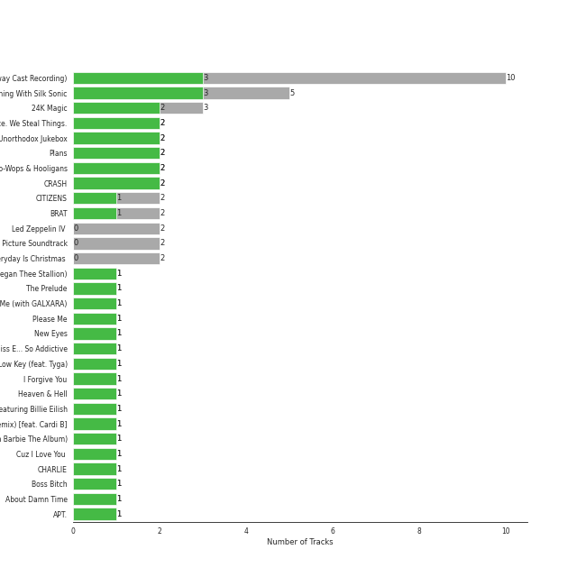

# Atlantic Records

80 songs

[See Audio Features](audio_features.md)

Appears as:
- Atlantic Records (69 tracks)
- Aftermath Entertainment/Atlantic (2 tracks)
- Atlantic Records/ATG (2 tracks)
- Atlantic/KSR (2 tracks)
- Nice Life/Atlantic (2 tracks)
- Atco/Atlantic (1 tracks)
- Big Beat Records/Atlantic (1 tracks)
- Latium/Atlantic (1 tracks)

## Top Artists

| Art | Tracks | 💚 | Artist | 🔗 |
|:---|---:|---:|:---|:---|
|  | 11 | 9 | [Bruno Mars](../../artists/bruno_mars/overview.md) | [🔗](https://open.spotify.com/artist/0du5cEVh5yTK9QJze8zA0C) |
|  | 33 | 3 | [Original Broadway Cast of Hamilton](../../artists/original_broadway_cast_of_hamilton/overview.md) | [🔗](https://open.spotify.com/artist/3UUJfRbrA2nTbcg4i0MOwu) |
|  | 22 | 3 | [Leslie Odom Jr.](../../artists/leslie_odom_jr_/overview.md) | [🔗](https://open.spotify.com/artist/3cR4rhS2hBWqI7rJEBacvN) |
|  | 3 | 3 | Cardi B | [🔗](https://open.spotify.com/artist/4kYSro6naA4h99UJvo89HB) |
|  | 30 | 2 | [Lin-Manuel Miranda](../../artists/lin_manuel_miranda/overview.md) | [🔗](https://open.spotify.com/artist/4aXXDj9aZnlshx7mzj3W1N) |
|  | 2 | 2 | Lizzo | [🔗](https://open.spotify.com/artist/56oDRnqbIiwx4mymNEv7dS) |
|  | 2 | 2 | Jason Mraz | [🔗](https://open.spotify.com/artist/4phGZZrJZRo4ElhRtViYdl) |
|  | 2 | 2 | Death Cab for Cutie | [🔗](https://open.spotify.com/artist/0YrtvWJMgSdVrk3SfNjTbx) |
|  | 13 | 1 | [Daveed Diggs](../../artists/daveed_diggs/overview.md) | [🔗](https://open.spotify.com/artist/3twuAojvYNrlWZpMkxLm3P) |
|  | 12 | 1 | [Okieriete Onaodowan](../../artists/okieriete_onaodowan/overview.md) | [🔗](https://open.spotify.com/artist/6G3sPhnj4JBCsBVBGvZnkk) |

See all 49 artists

| Art | Tracks | 💚 | Artist | 🔗 |
|:---|---:|---:|:---|:---|
|  | 11 | 1 | [Anthony Ramos](../../artists/anthony_ramos/overview.md) | [🔗](https://open.spotify.com/artist/660YptcR0hNHJ8iEr1qcse) |
|  | 11 | 1 | [Phillipa Soo](../../artists/phillipa_soo/overview.md) | [🔗](https://open.spotify.com/artist/2OEGI2wrCVmvavKEOMlccy) |
|  | 7 | 1 | Christopher Jackson | [🔗](https://open.spotify.com/artist/6sLwRSXSUF5JTUnQaFenyj) |
|  | 2 | 1 | Charlie Puth | [🔗](https://open.spotify.com/artist/6VuMaDnrHyPL1p4EHjYLi7) |
|  | 2 | 1 | Silk Sonic | [🔗](https://open.spotify.com/artist/6PvvGcCY2XtUcSRld1Wilr) |
|  | 2 | 1 | Jasmine Cephas-Jones | [🔗](https://open.spotify.com/artist/4H3e5t5utgPvj6Nsuda5QF) |
|  | 2 | 1 | Anderson .Paak | [🔗](https://open.spotify.com/artist/3jK9MiCrA42lLAdMGUZpwa) |
|  | 2 | 1 | Charli XCX | [🔗](https://open.spotify.com/artist/25uiPmTg16RbhZWAqwLBy5) |
|  | 2 | 1 | Straight No Chaser | [🔗](https://open.spotify.com/artist/1yQ8S4xdGOGbUcpaPR6hCM) |
|  | 1 | 1 | Colbie Caillat | [🔗](https://open.spotify.com/artist/6aZyMrc4doVtZyKNilOmwu) |
|  | 1 | 1 | Ally Brooke | [🔗](https://open.spotify.com/artist/6TXM1kV4L8DsDAkAfbOPYk) |
|  | 1 | 1 | Clean Bandit | [🔗](https://open.spotify.com/artist/6MDME20pz9RveH9rEXvrOM) |
|  | 1 | 1 | B.o.B | [🔗](https://open.spotify.com/artist/5ndkK3dpZLKtBklKjxNQwT) |
|  | 1 | 1 | CeeLo Green | [🔗](https://open.spotify.com/artist/5nLYd9ST4Cnwy6NHaCxbj8) |
|  | 1 | 1 | Doja Cat | [🔗](https://open.spotify.com/artist/5cj0lLjcoR7YOSnhnX0Po5) |
|  | 1 | 1 | Tyga | [🔗](https://open.spotify.com/artist/5LHRHt1k9lMyONurDHEdrp) |
|  | 1 | 1 | Jess Glynne | [🔗](https://open.spotify.com/artist/4ScCswdRlyA23odg9thgIO) |
|  | 1 | 1 | Sydney James Harcourt | [🔗](https://open.spotify.com/artist/2fHcpUAFhqmfloo2HkBN3e) |
|  | 1 | 1 | [Sara Bareilles](../../artists/sara_bareilles/overview.md) | [🔗](https://open.spotify.com/artist/2Sqr0DXoaYABbjBo9HaMkM) |
|  | 1 | 1 | Pink Sweat$ | [🔗](https://open.spotify.com/artist/1W7FNibLa0O0b572tB2w7t) |
|  | 1 | 1 | Megan Thee Stallion | [🔗](https://open.spotify.com/artist/181bsRPaVXVlUKXrxwZfHK) |
|  | 5 | 0 | Renée Elise Goldsberry | [🔗](https://open.spotify.com/artist/5VJN4jB6PqqEg4kJiAj6Eu) |
|  | 3 | 0 | Jonathan Groff | [🔗](https://open.spotify.com/artist/7KkqUt65v6LMtR369OQ6FB) |
|  | 3 | 0 | Led Zeppelin | [🔗](https://open.spotify.com/artist/36QJpDe2go2KgaRleHCDTp) |
|  | 2 | 0 | Wiz Khalifa | [🔗](https://open.spotify.com/artist/137W8MRPWKqSmrBGDBFSop) |
|  | 1 | 0 | Ty Dolla $ign | [🔗](https://open.spotify.com/artist/7c0XG5cIJTrrAgEC3ULPiq) |
|  | 1 | 0 | Christina Perri | [🔗](https://open.spotify.com/artist/7H55rcKCfwqkyDFH9wpKM6) |
|  | 1 | 0 | Jon Rua | [🔗](https://open.spotify.com/artist/69NsP4MC1JbfvKMwpx2oy8) |
|  | 1 | 0 | Lil Wayne | [🔗](https://open.spotify.com/artist/55Aa2cqylxrFIXC767Z865) |
|  | 1 | 0 | Imagine Dragons | [🔗](https://open.spotify.com/artist/53XhwfbYqKCa1cC15pYq2q) |
|  | 1 | 0 | Logic | [🔗](https://open.spotify.com/artist/4xRYI6VqpkE3UwrDrAZL8L) |
|  | 1 | 0 | Thayne Jasperson | [🔗](https://open.spotify.com/artist/4lSm9vkdpKSs1O8nKflRaB) |
|  | 1 | 0 | AleXa | [🔗](https://open.spotify.com/artist/4jCGRzuZkwo8CxboiANMEU) |
|  | 1 | 0 | American Song Contest | [🔗](https://open.spotify.com/artist/3pPClIZCqgahG8bguvacGh) |
|  | 1 | 0 | Ephraim Sykes | [🔗](https://open.spotify.com/artist/3brilvMAN6ILRUMvaqJWdG) |
|  | 1 | 0 | X Ambassadors | [🔗](https://open.spotify.com/artist/3NPpFNZtSTHheNBaWC82rB) |
|  | 1 | 0 | Tiësto | [🔗](https://open.spotify.com/artist/2o5jDhtHVPhrJdv3cEQ99Z) |
|  | 1 | 0 | Ariana DeBose | [🔗](https://open.spotify.com/artist/1Np9GsrPO7dlczjvdehBxs) |
|  | 1 | 0 | Sasha Hutchings | [🔗](https://open.spotify.com/artist/0Pg2rEmiZEnmxw4eQwtvsR) |

## Top Albums

| Art | Tracks | 💚 | Album | Release Date | 🔗 |
|:---|---:|---:|:---|:---|:---|
|  | 46 | 3 | Hamilton (Original Broadway Cast Recording) | 2015-09-25 | [🔗](https://open.spotify.com/album/1kCHru7uhxBUdzkm4gzRQc) |
|  | 3 | 2 | 24K Magic | 2016-11-17 | [🔗](https://open.spotify.com/album/4PgleR09JVnm3zY1fW3XBA) |
|  | 2 | 2 | We Sing. We Dance. We Steal Things. | 2008-05-12 | [🔗](https://open.spotify.com/album/04G0YylSjvDQZrjOfE5jA5) |
|  | 2 | 2 | Unorthodox Jukebox | 2012-12-07 | [🔗](https://open.spotify.com/album/58ufpQsJ1DS5kq4hhzQDiI) |
|  | 2 | 2 | Plans | 2005-08-29 | [🔗](https://open.spotify.com/album/1NFGnxmeIEBakre4DvLaJq) |
|  | 2 | 2 | Doo-Wops & Hooligans | 2010-10-05 | [🔗](https://open.spotify.com/album/1uyf3l2d4XYwiEqAb7t7fX) |
|  | 2 | 0 | Led Zeppelin IV (Deluxe Edition) | 1971-11-08 | [🔗](https://open.spotify.com/album/44Ig8dzqOkvkGDzaUof9lK) |
|  | 1 | 1 | WAP (feat. Megan Thee Stallion) | 2020-08-07 | [🔗](https://open.spotify.com/album/2ogiazbrNEx0kQHGl5ZBTQ) |
|  | 1 | 1 | Under the Influence (Ultimate Edition) | 2013-05-07 | [🔗](https://open.spotify.com/album/2jeIoe6RbirPCprvXQnqqn) |
|  | 1 | 1 | The Prelude | 2020-07-17 | [🔗](https://open.spotify.com/album/3Qj2vsFzmaB8jcH6Q60WIG) |

See all 28 albums

| Art | Tracks | 💚 | Album | Release Date | 🔗 |
|:---|---:|---:|:---|:---|:---|
|  | 1 | 1 | Please Me | 2019-02-15 | [🔗](https://open.spotify.com/album/5a4sJJ3qjn6hqRsvm0Veso) |
|  | 1 | 1 | New Eyes | 2014-06-02 | [🔗](https://open.spotify.com/album/4a6DxkhmMvvEdPXxm4ergN) |
|  | 1 | 1 | Low Key (feat. Tyga) | 2019-01-31 | [🔗](https://open.spotify.com/album/5Wba3IvT61Jz2kZDVKbrxH) |
|  | 1 | 1 | Finesse (Remix) [feat. Cardi B] | 2017-12-20 | [🔗](https://open.spotify.com/album/3mumK2ar9b4JPhVOZR0V2p) |
|  | 1 | 1 | Cuz I Love You (Deluxe) | 2019-05-03 | [🔗](https://open.spotify.com/album/74gSdSHe71q7urGWMMn3qB) |
|  | 1 | 1 | CRASH | 2022-03-18 | [🔗](https://open.spotify.com/album/1QqipMXWzJhr6yfcNKTp8B) |
|  | 1 | 1 | CHARLIE | 2022-10-06 | [🔗](https://open.spotify.com/album/5Jk4Eg7pxYhDrWJCVVzmMt) |
|  | 1 | 1 | Boss Bitch | 2020-01-23 | [🔗](https://open.spotify.com/album/4pmyFpGicLLIgNPc1TQXKc) |
|  | 1 | 1 | An Evening With Silk Sonic | 2021-11-11 | [🔗](https://open.spotify.com/album/1YgekJJTEueWDaMr7BYqPk) |
|  | 1 | 1 | About Damn Time | 2022-04-14 | [🔗](https://open.spotify.com/album/4JApkbiesQxv5drdEZRlZC) |
|  | 1 | 0 | lovestrong. | 2011-05-10 | [🔗](https://open.spotify.com/album/3XNK8vPk3O1rjhDZyOMJ6n) |
|  | 1 | 0 | Wonderland (From “American Song Contest”) | 2022-03-21 | [🔗](https://open.spotify.com/album/1KxiHSk6DOOL1C24ijw9m0) |
|  | 1 | 0 | Sucker for Pain (with Logic & Ty Dolla $ign feat. X Ambassadors) | 2016-06-24 | [🔗](https://open.spotify.com/album/704GHNtZhEe9TBgleCNNGv) |
|  | 1 | 0 | See You Again (feat. Charlie Puth) | 2015 | [🔗](https://open.spotify.com/album/5FXIqS1XqbpfOKNoi5VUwS) |
|  | 1 | 0 | Love's Train | 2022-02-14 | [🔗](https://open.spotify.com/album/6QKXGIgwWmWBMmIktMOchR) |
|  | 1 | 0 | Led Zeppelin III (Remaster) | 1970 | [🔗](https://open.spotify.com/album/6P5QHz4XtxOmS5EuiGIPut) |
|  | 1 | 0 | Hot In It | 2022-06-30 | [🔗](https://open.spotify.com/album/6R7Yy0sY9N8PNUhseegr2Q) |
|  | 1 | 0 | Christmas Cheers (Deluxe) | 2009-11-02 | [🔗](https://open.spotify.com/album/2M5NEqQVs7kIit8QbtXrRs) |

## Genres

| Tracks | 💚 | Genre |
|---:|---:|:---|
| 21 | 18 | [pop](../../genres/pop/overview.md) |
| 13 | 11 | [dance pop](../../genres/dance_pop/overview.md) |
| 46 | 3 | [show tunes](../../genres/show_tunes/overview.md) |
| 41 | 2 | [broadway](../../genres/broadway/overview.md) |
| 10 | 2 | vocal jazz |
| 4 | 2 | [rap](../../genres/rap/overview.md) |
| 2 | 2 | washington indie |
| 2 | 2 | trap queen |
| 2 | 2 | seattle indie |
| 2 | 2 | [neo mellow](../../genres/neo_mellow/overview.md) |

See all 50 genres

| Tracks | 💚 | Genre |
|---:|---:|:---|
| 2 | 2 | [modern rock](../../genres/modern_rock/overview.md) |
| 2 | 2 | minnesota hip hop |
| 2 | 2 | indietronica |
| 2 | 2 | indie rock |
| 2 | 2 | escape room |
| 2 | 2 | chamber pop |
| 2 | 2 | alternative rock |
| 2 | 2 | [acoustic pop](../../genres/acoustic_pop/overview.md) |
| 2 | 1 | [a cappella](../../genres/a_cappella/overview.md) |
| 1 | 1 | [viral pop](../../genres/viral_pop/overview.md) |
| 1 | 1 | uk pop |
| 1 | 1 | uk funky |
| 1 | 1 | uk dance |
| 1 | 1 | [post-teen pop](../../genres/post_teen_pop/overview.md) |
| 1 | 1 | metropopolis |
| 1 | 1 | candy pop |
| 1 | 1 | bedroom soul |
| 1 | 1 | [art pop](../../genres/art_pop/overview.md) |
| 7 | 0 | movie tunes |
| 3 | 0 | [rock](../../genres/rock/overview.md) |
| 3 | 0 | hollywood |
| 3 | 0 | hard rock |
| 3 | 0 | [classic rock](../../genres/classic_rock/overview.md) |
| 3 | 0 | [album rock](../../genres/album_rock/overview.md) |
| 2 | 0 | trap |
| 2 | 0 | pop rap |
| 2 | 0 | hip hop |
| 2 | 0 | alternative hip hop |
| 1 | 0 | trance |
| 1 | 0 | southern hip hop |
| 1 | 0 | slap house |
| 1 | 0 | pop dance |
| 1 | 0 | pittsburgh rap |
| 1 | 0 | new orleans rap |
| 1 | 0 | [k-pop](../../genres/k_pop/overview.md) |
| 1 | 0 | house |
| 1 | 0 | edm |
| 1 | 0 | dutch edm |
| 1 | 0 | brostep |
| 1 | 0 | big room |

## Tracks released under Atlantic Records

| Art | Track | Album | Artists | Label | 💚 | 🔗 |
|:---|:---|:---|:---|:---|:---|:---|
|  | Wonderland (From “American Song Contest”) | Wonderland (From “American Song Contest”) | AleXa, American Song Contest | [Atlantic Records](.) | | [🔗](https://open.spotify.com/track/12gIiC7uS9fvSVTvu66YDO) |
|  | Low Key (feat. Tyga) | Low Key (feat. Tyga) | Ally Brooke, Tyga | [Latium/Atlantic](.) | 💚 | [🔗](https://open.spotify.com/track/7xhvCzIguRfyfQyGrnWuVn) |
|  | Blow Us All Away | Hamilton (Original Broadway Cast Recording) | Ariana DeBose, Sasha Hutchings, Ephraim Sykes, [Lin-Manuel Miranda](../../artists/lin_manuel_miranda/overview.md), [Original Broadway Cast of Hamilton](../../artists/original_broadway_cast_of_hamilton/overview.md), [Anthony Ramos](../../artists/anthony_ramos/overview.md) | [Atlantic Records](.) | | [🔗](https://open.spotify.com/track/6lsFGDo1IEEPFKh94c9kFe) |
|  | Grenade | Doo-Wops & Hooligans | [Bruno Mars](../../artists/bruno_mars/overview.md) | [Atlantic Records](.) | 💚 | [🔗](https://open.spotify.com/track/2tJulUYLDKOg9XrtVkMgcJ) |
|  | The Other Side (feat. CeeLo Green and B.o.B) | Doo-Wops & Hooligans | [Bruno Mars](../../artists/bruno_mars/overview.md), B.o.B, CeeLo Green | [Atlantic Records](.) | 💚 | [🔗](https://open.spotify.com/track/0HasfWMrNxTjycDy9TkRtA) |
|  | Locked out of Heaven | Unorthodox Jukebox | [Bruno Mars](../../artists/bruno_mars/overview.md) | [Atlantic Records](.) | 💚 | [🔗](https://open.spotify.com/track/3w3y8KPTfNeOKPiqUTakBh) |
|  | When I Was Your Man | Unorthodox Jukebox | [Bruno Mars](../../artists/bruno_mars/overview.md) | [Atlantic Records](.) | 💚 | [🔗](https://open.spotify.com/track/0nJW01T7XtvILxQgC5J7Wh) |
|  | 24K Magic | 24K Magic | [Bruno Mars](../../artists/bruno_mars/overview.md) | [Atlantic Records](.) | | [🔗](https://open.spotify.com/track/6b8Be6ljOzmkOmFslEb23P) |
|  | Finesse | 24K Magic | [Bruno Mars](../../artists/bruno_mars/overview.md) | [Atlantic Records](.) | 💚 | [🔗](https://open.spotify.com/track/5XMkENs3GfeRza8MfVAhjK) |
|  | That's What I Like | 24K Magic | [Bruno Mars](../../artists/bruno_mars/overview.md) | [Atlantic Records](.) | 💚 | [🔗](https://open.spotify.com/track/0KKkJNfGyhkQ5aFogxQAPU) |

See all tracks

| Art | Track | Album | Artists | Label | 💚 | 🔗 |
|:---|:---|:---|:---|:---|:---|:---|
|  | Finesse - Remix; feat. Cardi B | Finesse (Remix) [feat. Cardi B] | [Bruno Mars](../../artists/bruno_mars/overview.md), Cardi B | [Atlantic Records](.) | 💚 | [🔗](https://open.spotify.com/track/3Vo4wInECJQuz9BIBMOu8i) |
|  | Leave The Door Open | An Evening With Silk Sonic | [Bruno Mars](../../artists/bruno_mars/overview.md), Anderson .Paak, Silk Sonic | [Aftermath Entertainment/Atlantic](.) | 💚 | [🔗](https://open.spotify.com/track/02VBYrHfVwfEWXk5DXyf0T) |
|  | Love's Train | Love's Train | [Bruno Mars](../../artists/bruno_mars/overview.md), Anderson .Paak, Silk Sonic | [Aftermath Entertainment/Atlantic](.) | | [🔗](https://open.spotify.com/track/60gTdTwaNtGAzIxKfeGVfJ) |
|  | Please Me | Please Me | Cardi B, [Bruno Mars](../../artists/bruno_mars/overview.md) | [Atlantic/KSR](.) | 💚 | [🔗](https://open.spotify.com/track/0PG9fbaaHFHfre2gUVo7AN) |
|  | WAP (feat. Megan Thee Stallion) | WAP (feat. Megan Thee Stallion) | Cardi B, Megan Thee Stallion | [Atlantic/KSR](.) | 💚 | [🔗](https://open.spotify.com/track/4Oun2ylbjFKMPTiaSbbCih) |
|  | Good Ones | CRASH | Charli XCX | [Atlantic Records](.) | 💚 | [🔗](https://open.spotify.com/track/2grSOc6HNTXQQXNoRKt9UM) |
|  | Light Switch | CHARLIE | Charlie Puth | [Atlantic Records](.) | 💚 | [🔗](https://open.spotify.com/track/1jEBSDN5vYViJQr78W7jr2) |
|  | Jar of Hearts | lovestrong. | Christina Perri | [Atlantic Records](.) | | [🔗](https://open.spotify.com/track/0HZhYMZOcUzZKSFwPOti6m) |
|  | Cabinet Battle #1 | Hamilton (Original Broadway Cast Recording) | Christopher Jackson, [Daveed Diggs](../../artists/daveed_diggs/overview.md), [Lin-Manuel Miranda](../../artists/lin_manuel_miranda/overview.md), [Okieriete Onaodowan](../../artists/okieriete_onaodowan/overview.md) | [Atlantic Records](.) | | [🔗](https://open.spotify.com/track/3TfKt8mPpdXfQTMfRjHzyz) |
|  | Cabinet Battle #2 | Hamilton (Original Broadway Cast Recording) | Christopher Jackson, [Daveed Diggs](../../artists/daveed_diggs/overview.md), [Lin-Manuel Miranda](../../artists/lin_manuel_miranda/overview.md), [Okieriete Onaodowan](../../artists/okieriete_onaodowan/overview.md) | [Atlantic Records](.) | | [🔗](https://open.spotify.com/track/6KRHMYPIWRgFWlXPgqO2Fp) |
|  | History Has Its Eyes on You | Hamilton (Original Broadway Cast Recording) | Christopher Jackson, [Lin-Manuel Miranda](../../artists/lin_manuel_miranda/overview.md), [Original Broadway Cast of Hamilton](../../artists/original_broadway_cast_of_hamilton/overview.md) | [Atlantic Records](.) | | [🔗](https://open.spotify.com/track/1mGO8rwCE9zk7H06OxcU5m) |
|  | One Last Time | Hamilton (Original Broadway Cast Recording) | Christopher Jackson, [Lin-Manuel Miranda](../../artists/lin_manuel_miranda/overview.md), [Original Broadway Cast of Hamilton](../../artists/original_broadway_cast_of_hamilton/overview.md) | [Atlantic Records](.) | | [🔗](https://open.spotify.com/track/0Iys022UwQ8xBfxE1g4nWZ) |
|  | Rather Be (feat. Jess Glynne) | New Eyes | Clean Bandit, Jess Glynne | [Big Beat Records/Atlantic](.) | 💚 | [🔗](https://open.spotify.com/track/0am001WwFBVGDGLwRh3ixi) |
|  | The Election of 1800 | Hamilton (Original Broadway Cast Recording) | [Daveed Diggs](../../artists/daveed_diggs/overview.md), [Okieriete Onaodowan](../../artists/okieriete_onaodowan/overview.md), [Leslie Odom Jr.](../../artists/leslie_odom_jr_/overview.md), [Lin-Manuel Miranda](../../artists/lin_manuel_miranda/overview.md), [Original Broadway Cast of Hamilton](../../artists/original_broadway_cast_of_hamilton/overview.md) | [Atlantic Records](.) | | [🔗](https://open.spotify.com/track/0LpHC9mhPAQC98IjXZIrif) |
|  | What'd I Miss | Hamilton (Original Broadway Cast Recording) | [Daveed Diggs](../../artists/daveed_diggs/overview.md), [Leslie Odom Jr.](../../artists/leslie_odom_jr_/overview.md), [Okieriete Onaodowan](../../artists/okieriete_onaodowan/overview.md), [Original Broadway Cast of Hamilton](../../artists/original_broadway_cast_of_hamilton/overview.md) | [Atlantic Records](.) | | [🔗](https://open.spotify.com/track/2W9u3whoCkQYOUbmnSrHi1) |
|  | I Will Follow You into the Dark | Plans | Death Cab for Cutie | [Atlantic Records](.) | 💚 | [🔗](https://open.spotify.com/track/3kZC0ZmFWrEHdUCmUqlvgZ) |
|  | What Sarah Said | Plans | Death Cab for Cutie | [Atlantic Records](.) | 💚 | [🔗](https://open.spotify.com/track/2JFrlsJBH4IDt3Suot97dP) |
|  | Boss Bitch | Boss Bitch | Doja Cat | [Atlantic Records](.) | 💚 | [🔗](https://open.spotify.com/track/78qd8dvwea0Gosb6Fe6j3k) |
|  | Say No to This | Hamilton (Original Broadway Cast Recording) | Jasmine Cephas-Jones, [Leslie Odom Jr.](../../artists/leslie_odom_jr_/overview.md), [Lin-Manuel Miranda](../../artists/lin_manuel_miranda/overview.md), Sydney James Harcourt, [Original Broadway Cast of Hamilton](../../artists/original_broadway_cast_of_hamilton/overview.md) | [Atlantic Records](.) | 💚 | [🔗](https://open.spotify.com/track/3s9itRgJYcKhem01P17865) |
|  | I'm Yours | We Sing. We Dance. We Steal Things. | Jason Mraz | [Atlantic Records/ATG](.) | 💚 | [🔗](https://open.spotify.com/track/1EzrEOXmMH3G43AXT1y7pA) |
|  | Lucky | We Sing. We Dance. We Steal Things. | Jason Mraz, Colbie Caillat | [Atlantic Records/ATG](.) | 💚 | [🔗](https://open.spotify.com/track/0IktbUcnAGrvD03AWnz3Q8) |
|  | I Know Him | Hamilton (Original Broadway Cast Recording) | Jonathan Groff | [Atlantic Records](.) | | [🔗](https://open.spotify.com/track/4eeN8erNIbW2osT0knz5vT) |
|  | What Comes Next? | Hamilton (Original Broadway Cast Recording) | Jonathan Groff | [Atlantic Records](.) | | [🔗](https://open.spotify.com/track/3D4J0o9w44QKFrBrYrSVJY) |
|  | You'll Be Back | Hamilton (Original Broadway Cast Recording) | Jonathan Groff, [Original Broadway Cast of Hamilton](../../artists/original_broadway_cast_of_hamilton/overview.md) | [Atlantic Records](.) | | [🔗](https://open.spotify.com/track/6OG1S805gIrH5nAQbEOPY3) |
|  | Immigrant Song - Remaster | Led Zeppelin III (Remaster) | Led Zeppelin | [Atlantic Records](.) | | [🔗](https://open.spotify.com/track/78lgmZwycJ3nzsdgmPPGNx) |
|  | Black Dog - Remaster | Led Zeppelin IV (Deluxe Edition) | Led Zeppelin | [Atlantic Records](.) | | [🔗](https://open.spotify.com/track/3qT4bUD1MaWpGrTwcvguhb) |
|  | Stairway to Heaven - Remaster | Led Zeppelin IV (Deluxe Edition) | Led Zeppelin | [Atlantic Records](.) | | [🔗](https://open.spotify.com/track/5CQ30WqJwcep0pYcV4AMNc) |
|  | A Winter's Ball | Hamilton (Original Broadway Cast Recording) | [Leslie Odom Jr.](../../artists/leslie_odom_jr_/overview.md), [Lin-Manuel Miranda](../../artists/lin_manuel_miranda/overview.md), [Original Broadway Cast of Hamilton](../../artists/original_broadway_cast_of_hamilton/overview.md) | [Atlantic Records](.) | | [🔗](https://open.spotify.com/track/2yBMVrq96wb9OHbMdBs0lF) |
|  | Alexander Hamilton | Hamilton (Original Broadway Cast Recording) | [Leslie Odom Jr.](../../artists/leslie_odom_jr_/overview.md), [Daveed Diggs](../../artists/daveed_diggs/overview.md), [Okieriete Onaodowan](../../artists/okieriete_onaodowan/overview.md), [Lin-Manuel Miranda](../../artists/lin_manuel_miranda/overview.md), [Phillipa Soo](../../artists/phillipa_soo/overview.md), Christopher Jackson, [Original Broadway Cast of Hamilton](../../artists/original_broadway_cast_of_hamilton/overview.md), [Anthony Ramos](../../artists/anthony_ramos/overview.md) | [Atlantic Records](.) | 💚 | [🔗](https://open.spotify.com/track/4TTV7EcfroSLWzXRY6gLv6) |
|  | Dear Theodosia | Hamilton (Original Broadway Cast Recording) | [Leslie Odom Jr.](../../artists/leslie_odom_jr_/overview.md), [Lin-Manuel Miranda](../../artists/lin_manuel_miranda/overview.md) | [Atlantic Records](.) | | [🔗](https://open.spotify.com/track/2sEq2rC3ynYsT49x7utWnd) |
|  | Guns and Ships | Hamilton (Original Broadway Cast Recording) | [Leslie Odom Jr.](../../artists/leslie_odom_jr_/overview.md), [Daveed Diggs](../../artists/daveed_diggs/overview.md), [Original Broadway Cast of Hamilton](../../artists/original_broadway_cast_of_hamilton/overview.md) | [Atlantic Records](.) | | [🔗](https://open.spotify.com/track/7m9XR7FquXLP1FewdAcNS9) |
|  | Non-Stop | Hamilton (Original Broadway Cast Recording) | [Leslie Odom Jr.](../../artists/leslie_odom_jr_/overview.md), [Lin-Manuel Miranda](../../artists/lin_manuel_miranda/overview.md), Renée Elise Goldsberry, [Phillipa Soo](../../artists/phillipa_soo/overview.md), Christopher Jackson, [Original Broadway Cast of Hamilton](../../artists/original_broadway_cast_of_hamilton/overview.md) | [Atlantic Records](.) | | [🔗](https://open.spotify.com/track/7qfoq1JFKBUEIvhqOHzuqX) |
|  | The Room Where It Happens | Hamilton (Original Broadway Cast Recording) | [Leslie Odom Jr.](../../artists/leslie_odom_jr_/overview.md), [Lin-Manuel Miranda](../../artists/lin_manuel_miranda/overview.md), [Daveed Diggs](../../artists/daveed_diggs/overview.md), [Okieriete Onaodowan](../../artists/okieriete_onaodowan/overview.md), [Original Broadway Cast of Hamilton](../../artists/original_broadway_cast_of_hamilton/overview.md) | [Atlantic Records](.) | | [🔗](https://open.spotify.com/track/2TK2KSrzXD6W01qjXVjNGh) |
|  | The World Was Wide Enough | Hamilton (Original Broadway Cast Recording) | [Leslie Odom Jr.](../../artists/leslie_odom_jr_/overview.md), [Lin-Manuel Miranda](../../artists/lin_manuel_miranda/overview.md), [Original Broadway Cast of Hamilton](../../artists/original_broadway_cast_of_hamilton/overview.md) | [Atlantic Records](.) | | [🔗](https://open.spotify.com/track/0P09TBGSKiQwfUsEh1UafT) |
|  | Wait for It | Hamilton (Original Broadway Cast Recording) | [Leslie Odom Jr.](../../artists/leslie_odom_jr_/overview.md), [Original Broadway Cast of Hamilton](../../artists/original_broadway_cast_of_hamilton/overview.md) | [Atlantic Records](.) | 💚 | [🔗](https://open.spotify.com/track/7EqpEBPOohgk7NnKvBGFWo) |
|  | Washington on Your Side | Hamilton (Original Broadway Cast Recording) | [Leslie Odom Jr.](../../artists/leslie_odom_jr_/overview.md), [Daveed Diggs](../../artists/daveed_diggs/overview.md), [Okieriete Onaodowan](../../artists/okieriete_onaodowan/overview.md), [Original Broadway Cast of Hamilton](../../artists/original_broadway_cast_of_hamilton/overview.md) | [Atlantic Records](.) | | [🔗](https://open.spotify.com/track/1WHNqqRWhJVZIdCScFKtl5) |
|  | Your Obedient Servant | Hamilton (Original Broadway Cast Recording) | [Leslie Odom Jr.](../../artists/leslie_odom_jr_/overview.md), [Lin-Manuel Miranda](../../artists/lin_manuel_miranda/overview.md), [Original Broadway Cast of Hamilton](../../artists/original_broadway_cast_of_hamilton/overview.md) | [Atlantic Records](.) | | [🔗](https://open.spotify.com/track/6SHI6STEW51cQkAXBRpLNj) |
|  | Sucker for Pain (with Wiz Khalifa, Imagine Dragons, Logic & Ty Dolla $ign feat. X Ambassadors) | Sucker for Pain (with Logic & Ty Dolla $ign feat. X Ambassadors) | Lil Wayne, Wiz Khalifa, Imagine Dragons, X Ambassadors, Logic, Ty Dolla $ign | [Atlantic Records](.) | | [🔗](https://open.spotify.com/track/4dASQiO1Eoo3RJvt74FtXB) |
|  | Aaron Burr, Sir | Hamilton (Original Broadway Cast Recording) | [Lin-Manuel Miranda](../../artists/lin_manuel_miranda/overview.md), [Leslie Odom Jr.](../../artists/leslie_odom_jr_/overview.md), [Daveed Diggs](../../artists/daveed_diggs/overview.md), [Okieriete Onaodowan](../../artists/okieriete_onaodowan/overview.md), [Anthony Ramos](../../artists/anthony_ramos/overview.md) | [Atlantic Records](.) | | [🔗](https://open.spotify.com/track/6dr7ekfhlbquvsVY8D7gyk) |
|  | Hurricane | Hamilton (Original Broadway Cast Recording) | [Lin-Manuel Miranda](../../artists/lin_manuel_miranda/overview.md), [Original Broadway Cast of Hamilton](../../artists/original_broadway_cast_of_hamilton/overview.md) | [Atlantic Records](.) | | [🔗](https://open.spotify.com/track/16sNPUamj4vnA7uQLozRpU) |
|  | Meet Me Inside | Hamilton (Original Broadway Cast Recording) | [Lin-Manuel Miranda](../../artists/lin_manuel_miranda/overview.md), [Leslie Odom Jr.](../../artists/leslie_odom_jr_/overview.md), Christopher Jackson, [Original Broadway Cast of Hamilton](../../artists/original_broadway_cast_of_hamilton/overview.md), [Anthony Ramos](../../artists/anthony_ramos/overview.md) | [Atlantic Records](.) | | [🔗](https://open.spotify.com/track/6p7jXaTJdpzGWnOJoK2jYr) |
|  | My Shot | Hamilton (Original Broadway Cast Recording) | [Lin-Manuel Miranda](../../artists/lin_manuel_miranda/overview.md), [Daveed Diggs](../../artists/daveed_diggs/overview.md), [Okieriete Onaodowan](../../artists/okieriete_onaodowan/overview.md), [Leslie Odom Jr.](../../artists/leslie_odom_jr_/overview.md), [Original Broadway Cast of Hamilton](../../artists/original_broadway_cast_of_hamilton/overview.md), [Anthony Ramos](../../artists/anthony_ramos/overview.md) | [Atlantic Records](.) | | [🔗](https://open.spotify.com/track/4cxvludVmQxryrnx1m9FqL) |
|  | Right Hand Man | Hamilton (Original Broadway Cast Recording) | [Lin-Manuel Miranda](../../artists/lin_manuel_miranda/overview.md), [Leslie Odom Jr.](../../artists/leslie_odom_jr_/overview.md), [Original Broadway Cast of Hamilton](../../artists/original_broadway_cast_of_hamilton/overview.md) | [Atlantic Records](.) | | [🔗](https://open.spotify.com/track/3nJYcY9yvKP8Oi2Ml8brXt) |
|  | Stay Alive - Reprise | Hamilton (Original Broadway Cast Recording) | [Lin-Manuel Miranda](../../artists/lin_manuel_miranda/overview.md), [Phillipa Soo](../../artists/phillipa_soo/overview.md), [Original Broadway Cast of Hamilton](../../artists/original_broadway_cast_of_hamilton/overview.md), [Anthony Ramos](../../artists/anthony_ramos/overview.md) | [Atlantic Records](.) | | [🔗](https://open.spotify.com/track/2ydKgIVZAQXeYLWtxU8DFS) |
|  | Ten Duel Commandments | Hamilton (Original Broadway Cast Recording) | [Lin-Manuel Miranda](../../artists/lin_manuel_miranda/overview.md), Jon Rua, [Leslie Odom Jr.](../../artists/leslie_odom_jr_/overview.md), [Original Broadway Cast of Hamilton](../../artists/original_broadway_cast_of_hamilton/overview.md), [Anthony Ramos](../../artists/anthony_ramos/overview.md) | [Atlantic Records](.) | | [🔗](https://open.spotify.com/track/3lXyAQ0kekAvY5LodpWmUs) |
|  | The Story of Tonight | Hamilton (Original Broadway Cast Recording) | [Lin-Manuel Miranda](../../artists/lin_manuel_miranda/overview.md), [Okieriete Onaodowan](../../artists/okieriete_onaodowan/overview.md), [Daveed Diggs](../../artists/daveed_diggs/overview.md), [Original Broadway Cast of Hamilton](../../artists/original_broadway_cast_of_hamilton/overview.md), [Anthony Ramos](../../artists/anthony_ramos/overview.md) | [Atlantic Records](.) | | [🔗](https://open.spotify.com/track/0NJWhm3hUwIZSy5s0TGJ8q) |
|  | We Know | Hamilton (Original Broadway Cast Recording) | [Lin-Manuel Miranda](../../artists/lin_manuel_miranda/overview.md), [Daveed Diggs](../../artists/daveed_diggs/overview.md), [Leslie Odom Jr.](../../artists/leslie_odom_jr_/overview.md), [Okieriete Onaodowan](../../artists/okieriete_onaodowan/overview.md) | [Atlantic Records](.) | | [🔗](https://open.spotify.com/track/1DLfR4MOfLYbV6v3xrmWa8) |
|  | Truth Hurts | Cuz I Love You (Deluxe) | Lizzo | [Nice Life/Atlantic](.) | 💚 | [🔗](https://open.spotify.com/track/5qmq61DAAOUaW8AUo8xKhh) |
|  | About Damn Time | About Damn Time | Lizzo | [Nice Life/Atlantic](.) | 💚 | [🔗](https://open.spotify.com/track/1PckUlxKqWQs3RlWXVBLw3) |
|  | The Story of Tonight - Reprise | Hamilton (Original Broadway Cast Recording) | [Okieriete Onaodowan](../../artists/okieriete_onaodowan/overview.md), [Daveed Diggs](../../artists/daveed_diggs/overview.md), [Lin-Manuel Miranda](../../artists/lin_manuel_miranda/overview.md), [Leslie Odom Jr.](../../artists/leslie_odom_jr_/overview.md), [Anthony Ramos](../../artists/anthony_ramos/overview.md) | [Atlantic Records](.) | | [🔗](https://open.spotify.com/track/1CzeuSrm71wHP9qsjg7p3F) |
|  | Stay Alive | Hamilton (Original Broadway Cast Recording) | [Original Broadway Cast of Hamilton](../../artists/original_broadway_cast_of_hamilton/overview.md) | [Atlantic Records](.) | | [🔗](https://open.spotify.com/track/27MB0qHaYAZiTlwg25js1Y) |
|  | The Adams Administration | Hamilton (Original Broadway Cast Recording) | [Original Broadway Cast of Hamilton](../../artists/original_broadway_cast_of_hamilton/overview.md) | [Atlantic Records](.) | | [🔗](https://open.spotify.com/track/68Ijc4fPmT3P5BN6Vrl2s2) |
|  | The Reynolds Pamphlet | Hamilton (Original Broadway Cast Recording) | [Original Broadway Cast of Hamilton](../../artists/original_broadway_cast_of_hamilton/overview.md) | [Atlantic Records](.) | | [🔗](https://open.spotify.com/track/7D1Lf7N7AtCuEq5PGJtIPz) |
|  | Who Lives, Who Dies, Who Tells Your Story | Hamilton (Original Broadway Cast Recording) | [Original Broadway Cast of Hamilton](../../artists/original_broadway_cast_of_hamilton/overview.md) | [Atlantic Records](.) | | [🔗](https://open.spotify.com/track/7EsSVPxaYoAZjQwhspJBs2) |
|  | Yorktown (The World Turned Upside Down) | Hamilton (Original Broadway Cast Recording) | [Original Broadway Cast of Hamilton](../../artists/original_broadway_cast_of_hamilton/overview.md) | [Atlantic Records](.) | | [🔗](https://open.spotify.com/track/733tju3KUeatsbjcTRQ04i) |
|  | Best of Wives and Best of Women | Hamilton (Original Broadway Cast Recording) | [Phillipa Soo](../../artists/phillipa_soo/overview.md), [Lin-Manuel Miranda](../../artists/lin_manuel_miranda/overview.md) | [Atlantic Records](.) | | [🔗](https://open.spotify.com/track/1dZutYKh4BtPlxbC81wV34) |
|  | Burn | Hamilton (Original Broadway Cast Recording) | [Phillipa Soo](../../artists/phillipa_soo/overview.md) | [Atlantic Records](.) | | [🔗](https://open.spotify.com/track/4B3qvzOMzLQXLeYgPsG3KA) |
|  | Helpless | Hamilton (Original Broadway Cast Recording) | [Phillipa Soo](../../artists/phillipa_soo/overview.md), [Original Broadway Cast of Hamilton](../../artists/original_broadway_cast_of_hamilton/overview.md) | [Atlantic Records](.) | | [🔗](https://open.spotify.com/track/54Sc7mZQ1RM03STpk4SfaA) |
|  | Schuyler Defeated | Hamilton (Original Broadway Cast Recording) | [Phillipa Soo](../../artists/phillipa_soo/overview.md), [Lin-Manuel Miranda](../../artists/lin_manuel_miranda/overview.md), [Leslie Odom Jr.](../../artists/leslie_odom_jr_/overview.md), [Anthony Ramos](../../artists/anthony_ramos/overview.md) | [Atlantic Records](.) | | [🔗](https://open.spotify.com/track/05bhmaAD1urZnQMWNd6p3S) |
|  | Take a Break | Hamilton (Original Broadway Cast Recording) | [Phillipa Soo](../../artists/phillipa_soo/overview.md), [Lin-Manuel Miranda](../../artists/lin_manuel_miranda/overview.md), Renée Elise Goldsberry, [Anthony Ramos](../../artists/anthony_ramos/overview.md) | [Atlantic Records](.) | | [🔗](https://open.spotify.com/track/2qFIJT5hjqaNFA1GKwl9me) |
|  | That Would Be Enough | Hamilton (Original Broadway Cast Recording) | [Phillipa Soo](../../artists/phillipa_soo/overview.md), [Lin-Manuel Miranda](../../artists/lin_manuel_miranda/overview.md) | [Atlantic Records](.) | | [🔗](https://open.spotify.com/track/6oF8ueLn5hIl4PRp17sxW6) |
|  | At My Worst | The Prelude | Pink Sweat$ | [Atlantic Records](.) | 💚 | [🔗](https://open.spotify.com/track/0ri0Han4IRJhzvERHOZTMr) |
|  | It's Quiet Uptown | Hamilton (Original Broadway Cast Recording) | Renée Elise Goldsberry, [Lin-Manuel Miranda](../../artists/lin_manuel_miranda/overview.md), [Phillipa Soo](../../artists/phillipa_soo/overview.md), [Original Broadway Cast of Hamilton](../../artists/original_broadway_cast_of_hamilton/overview.md) | [Atlantic Records](.) | | [🔗](https://open.spotify.com/track/40LYL1Z6xgCn5cBybo5K0D) |
|  | Satisfied | Hamilton (Original Broadway Cast Recording) | Renée Elise Goldsberry, [Original Broadway Cast of Hamilton](../../artists/original_broadway_cast_of_hamilton/overview.md) | [Atlantic Records](.) | | [🔗](https://open.spotify.com/track/3dP0pLbg9OfVwssDjp9aT0) |
|  | The Schuyler Sisters | Hamilton (Original Broadway Cast Recording) | Renée Elise Goldsberry, [Phillipa Soo](../../artists/phillipa_soo/overview.md), Jasmine Cephas-Jones, [Leslie Odom Jr.](../../artists/leslie_odom_jr_/overview.md), [Original Broadway Cast of Hamilton](../../artists/original_broadway_cast_of_hamilton/overview.md) | [Atlantic Records](.) | | [🔗](https://open.spotify.com/track/71X7bPDljJHrmEGYCe7kQ8) |
|  | The 12 Days of Christmas | Christmas Cheers (Deluxe) | Straight No Chaser | [Atco/Atlantic](.) | | [🔗](https://open.spotify.com/track/5f5wlkRHWhYxOdp1hOUsTb) |
|  | I Want You Back (feat. Sara Bareilles) | Under the Influence (Ultimate Edition) | Straight No Chaser, [Sara Bareilles](../../artists/sara_bareilles/overview.md) | [Atlantic Records](.) | 💚 | [🔗](https://open.spotify.com/track/5teF3el9gP5j2cf7Dvkbm0) |
|  | Farmer Refuted | Hamilton (Original Broadway Cast Recording) | Thayne Jasperson, [Lin-Manuel Miranda](../../artists/lin_manuel_miranda/overview.md), [Original Broadway Cast of Hamilton](../../artists/original_broadway_cast_of_hamilton/overview.md) | [Atlantic Records](.) | | [🔗](https://open.spotify.com/track/2G9lekfCh83S0lt2yfffBz) |
|  | Hot In It | Hot In It | Tiësto, Charli XCX | [Atlantic Records](.) | | [🔗](https://open.spotify.com/track/3Z7CaxQkqbIs1rewKi6v4W) |
|  | See You Again (feat. Charlie Puth) | See You Again (feat. Charlie Puth) | Wiz Khalifa, Charlie Puth | [Atlantic Records](.) | | [🔗](https://open.spotify.com/track/2JzZzZUQj3Qff7wapcbKjc) |

