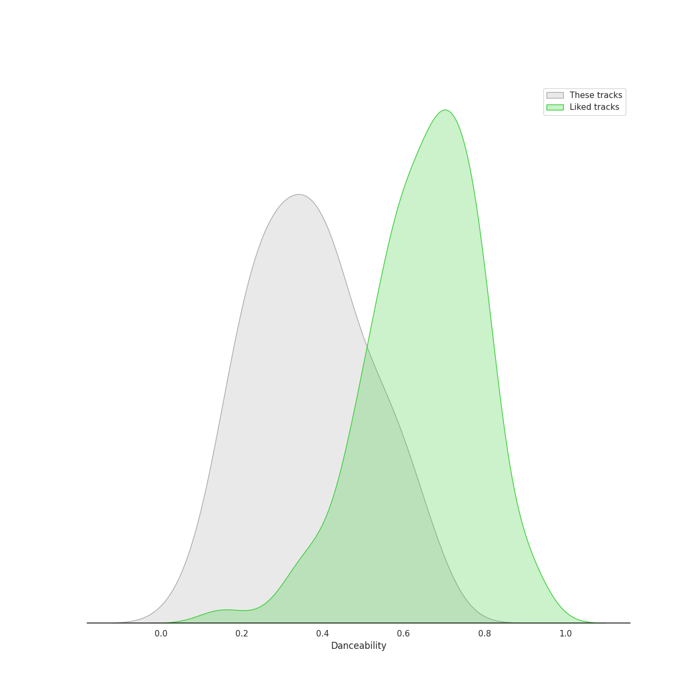
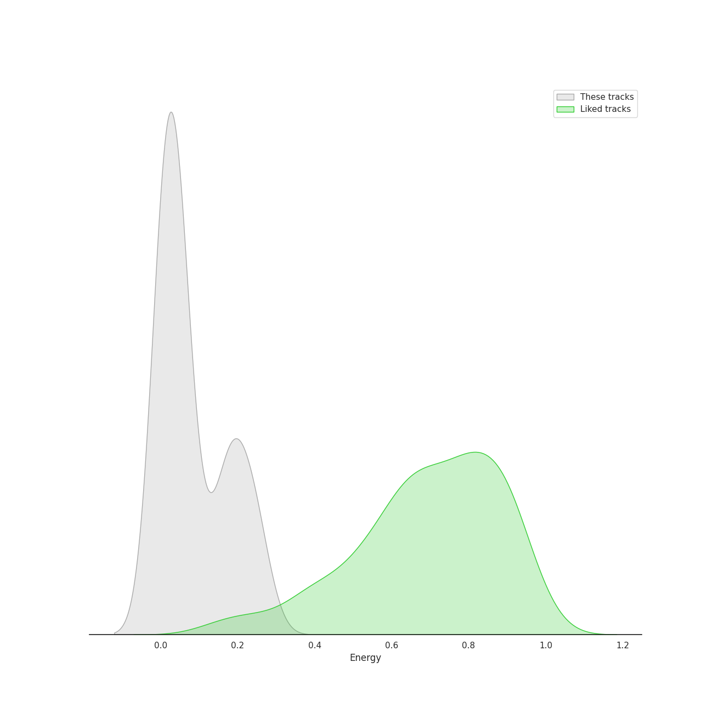
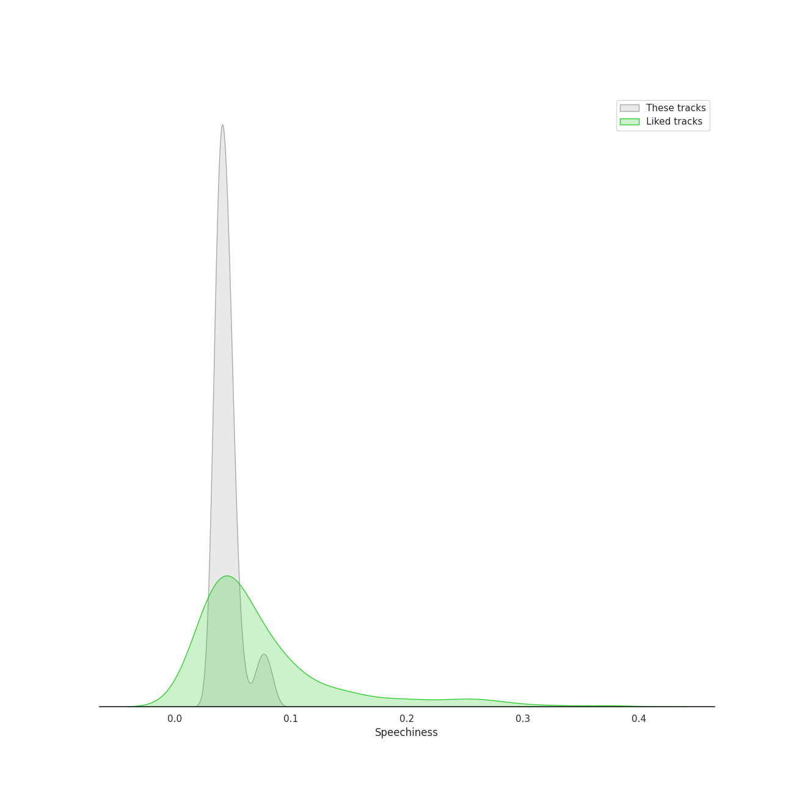
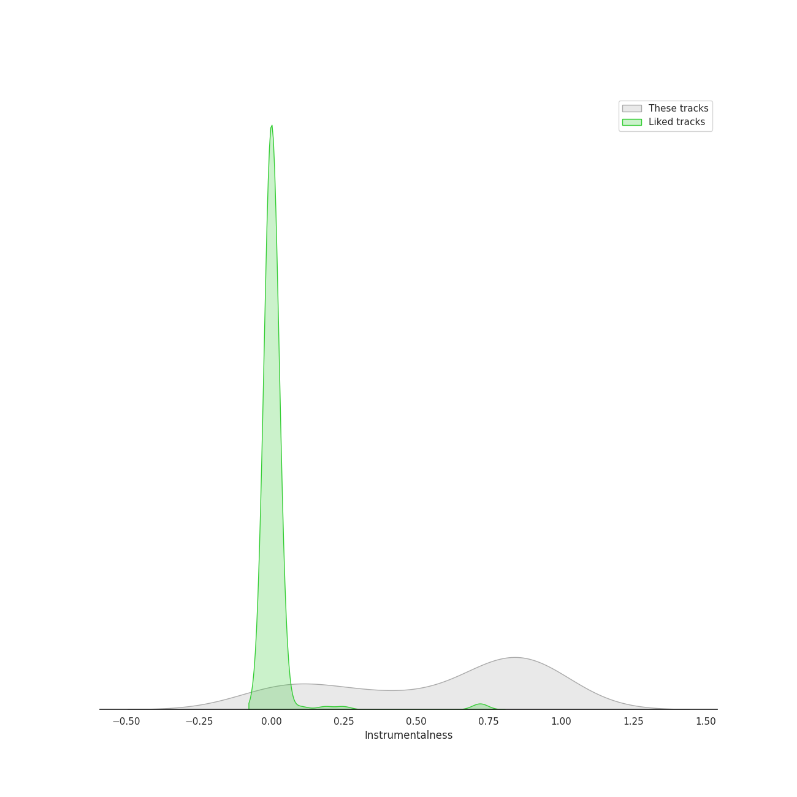
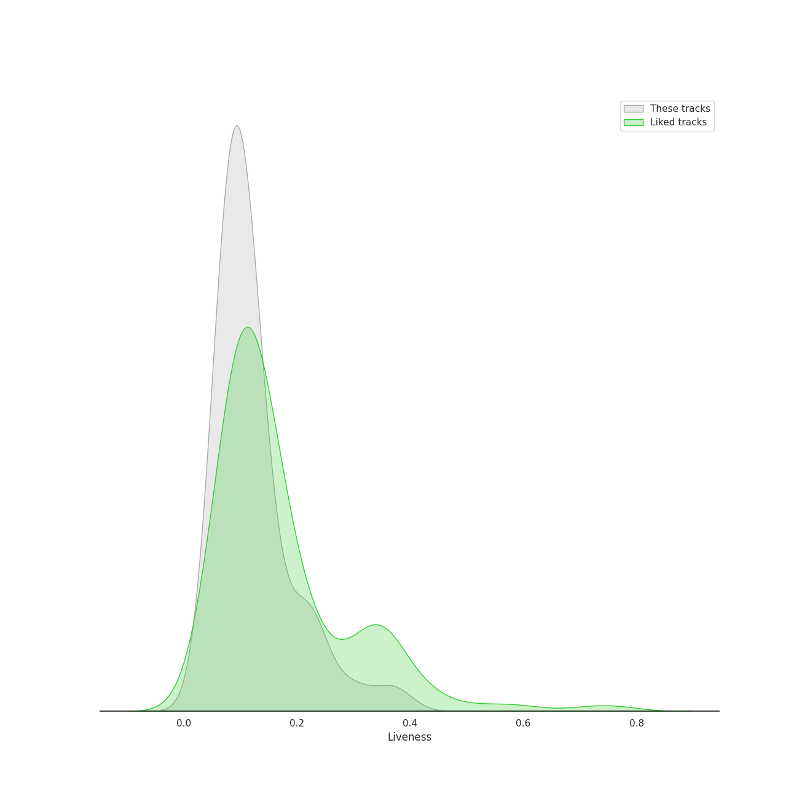
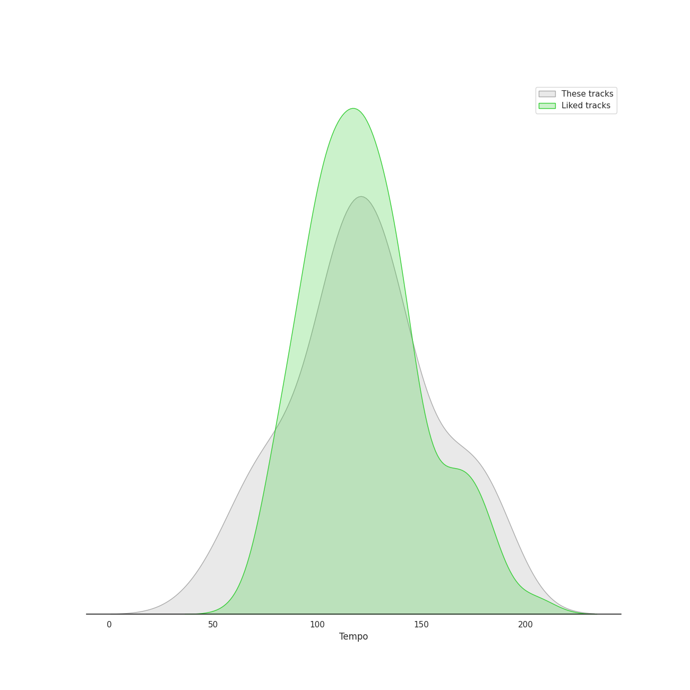

# Track Features for Australian Broadcasting Corp (ABC)

## Danceability

| ​ | 10 most Danceable tracks | ​​ | 10 least Danceable tracks |
|:---|:---|:---|:---|
|  | Coppélia / Tableau 2: No. 16 Boléro - Alternative Version (0.661) |  | Coppélia / Tableau 3: No. 20 Fête de la cloche: VII. La paix (0.0877) |
|  | Coppélia / Tableau 2: No. 11a Musique des automates (0.648) |  | Coppélia / Tableau 3: No. 20 Fête de la cloche: III. La prière (0.155) |
|  | Coppélia / Tableau 2: No. 17 Gigue (0.604) |  | Coppélia / Tableau 1: No. 5 Ballade (0.184) |
|  | Coppélia / Tableau 3: No. 20 Fête de la cloche: IV. Le travail (La fileuse) (0.568) |  | Coppélia / Tableau 2: No. 9 Scène (0.19) |
|  | Coppélia / Tableau 3: No. 20 Fête de la cloche: V. L'hymen (Noce villageoise) (0.551) |  | Coppélia / Tableau 2: No. 13 Chanson à boire et Scène (0.19) |
|  | Coppélia / Tableau 3: No. 20 Fête de la cloche: VI. La discorde et la guerre - Alternative Version (0.55) |  | Coppélia / Tableau 3: No. 20 Fête de la cloche: I. Valse des heures (0.202) |
|  | Coppélia / Tableau 3: No. 20 Fête de la cloche: VIII. Danse de fête (0.542) |  | Coppélia / Tableau 1: Prélude - Mazurka (0.207) |
|  | Coppélia / Tableau 3: No. 20 Fête de la cloche: VIII. Danse de fête - Alternative Version (0.537) |  | Coppélia / Tableau 1: No. 1 Valse (0.221) |
|  | Coppélia / Tableau 3: No. 20 Fête de la cloche: IX. Galop final - Alternative Version (0.468) |  | Coppélia / Tableau 3: No. 20 Fête de la cloche: II. L'aurore (0.232) |
|  | Coppélia / Tableau 3: No. 20 Fête de la cloche: IX. Galop final (0.466) |  | Coppélia / Tableau 2: Entr'acte (0.271) |

## Energy

| ​ | 10 most Energetic tracks | ​​ | 10 least Energetic tracks |
|:---|:---|:---|:---|
|  | Coppélia / Tableau 1: No. 3 Mazurka (0.259) |  | Coppélia / Tableau 2: No. 9 Scène (0.00262) |
|  | Coppélia / Tableau 3: No. 20 Fête de la cloche: IX. Galop final (0.248) |  | Coppélia / Tableau 3: No. 20 Fête de la cloche: VII. La paix (0.0039) |
|  | Coppélia / Tableau 3: No. 20 Fête de la cloche: IX. Galop final - Alternative Version (0.243) |  | Coppélia / Tableau 1: No. 5 Ballade (0.00661) |
|  | Coppélia / Tableau 3: No. 20 Fête de la cloche: VI. La discorde et la guerre (0.236) |  | Coppélia / Tableau 2: No. 14a Scène (0.00699) |
|  | Coppélia / Tableau 1: No. 7a Sortie (0.213) |  | Coppélia / Tableau 3: No. 20 Fête de la cloche: I. Valse des heures (0.0122) |
|  | Coppélia / Tableau 2: No. 16 Boléro (0.204) |  | Coppélia / Tableau 1: No. 8 Final (0.0133) |
|  | Coppélia / Tableau 2: No. 15 Scène - Alternative Version (0.187) |  | Coppélia / Tableau 2: No. 10 Scène (0.0135) |
|  | Coppélia / Tableau 2: No. 18 Scène (Final) (0.184) |  | Coppélia / Tableau 3: No. 20 Fête de la cloche: III. La prière (0.0135) |
|  | Coppélia / Tableau 1: No. 7 Czárdás (0.173) |  | Coppélia / Tableau 3: No. 20 Fête de la cloche: IV. Le travail (La fileuse) (0.014) |
|  | Coppélia / Tableau 2: No. 11a Musique des automates (0.172) |  | Coppélia / Tableau 3: No. 20 Fête de la cloche: II. L'aurore (0.0157) |

## Speechiness

| ​ | 10 most Speechy tracks | ​​ | 10 least Speechy tracks |
|:---|:---|:---|:---|
|  | Coppélia / Tableau 3: No. 20 Fête de la cloche: VIII. Danse de fête (0.0818) |  | Coppélia / Tableau 3: No. 20 Fête de la cloche: IV. Le travail (La fileuse) (0.0342) |
|  | Coppélia / Tableau 1: No. 4 Scène (0.0766) |  | Coppélia / Tableau 3: No. 20 Fête de la cloche: IX. Galop final (0.0357) |
|  | Coppélia / Tableau 3: No. 20 Fête de la cloche: VIII. Danse de fête - Alternative Version (0.0716) |  | Coppélia / Tableau 2: No. 15 Scène - Alternative Version (0.0357) |
|  | Coppélia / Tableau 2: No. 16 Boléro - Alternative Version (0.0579) |  | Coppélia / Tableau 3: No. 19 Marche de la cloche (0.0359) |
|  | Coppélia / Tableau 2: No. 14a Scène (0.0501) |  | Coppélia / Tableau 2: No. 16 Boléro (0.036) |
|  | Coppélia / Tableau 2: No. 10 Scène (0.05) |  | Coppélia / Tableau 3: No. 20 Fête de la cloche: VI. La discorde et la guerre - Alternative Version (0.0363) |
|  | Coppélia / Tableau 2: No. 17 Gigue (0.05) |  | Coppélia / Tableau 2: No. 13 Chanson à boire et Scène (0.0364) |
|  | Coppélia / Tableau 1: No. 7a Sortie (0.0499) |  | Coppélia / Tableau 1: No. 7 Czárdás (0.0365) |
|  | Coppélia / Tableau 2: No. 11a Musique des automates (0.0492) |  | Coppélia / Tableau 2: No. 15 Scène (0.0373) |
|  | La Source / Act 2: No. 22 Mazurka (0.0478) |  | Coppélia / Tableau 3: No. 20 Fête de la cloche: VI. La discorde et la guerre (0.038) |

## Acousticness

| ​ | 10 most Acoustic tracks | ​​ | 10 least Acoustic tracks |
|:---|:---|:---|:---|
|  | Coppélia / Tableau 3: No. 20 Fête de la cloche: IV. Le travail (La fileuse) (0.99) |  | Coppélia / Tableau 2: No. 11a Musique des automates (0.817) |
|  | Coppélia / Tableau 3: No. 20 Fête de la cloche: V. L'hymen (Noce villageoise) (0.987) |  | Coppélia / Tableau 3: No. 20 Fête de la cloche: VIII. Danse de fête - Alternative Version (0.874) |
|  | Coppélia / Tableau 2: Entr'acte (0.986) |  | Coppélia / Tableau 3: No. 20 Fête de la cloche: VIII. Danse de fête (0.885) |
|  | Coppélia / Tableau 2: No. 12 Scène (0.985) |  | Coppélia / Tableau 2: No. 16 Boléro (0.913) |
|  | La Source / Act 2: No. 22 Mazurka (0.984) |  | Coppélia / Tableau 2: No. 16 Boléro - Alternative Version (0.922) |
|  | Coppélia / Tableau 1: No. 2 Scène (0.983) |  | Coppélia / Tableau 2: No. 17 Gigue (0.936) |
|  | Coppélia / Tableau 1: No. 7 Czárdás (0.982) |  | Coppélia / Tableau 2: No. 15 Scène - Alternative Version (0.937) |
|  | Coppélia / Tableau 2: No. 10 Scène (0.982) |  | Coppélia / Tableau 2: No. 14a Scène (0.948) |
|  | Sylvia / Act 2: No. 12 Chant bachique (0.981) |  | Coppélia / Tableau 2: No. 18 Scène (Final) (0.951) |
|  | Coppélia / Tableau 1: No. 4 Scène (0.979) |  | Coppélia / Tableau 1: No. 3 Mazurka (0.961) |

## Instrumentalness

| ​ | 10 most Instrumental tracks | ​​ | 10 least Instrumental tracks |
|:---|:---|:---|:---|
|  | Coppélia / Tableau 1: No. 7a Sortie (0.942) |  | Coppélia / Tableau 2: No. 14a Scène (0.00519) |
|  | Coppélia / Tableau 3: No. 20 Fête de la cloche: V. L'hymen (Noce villageoise) (0.937) |  | Coppélia / Tableau 3: No. 20 Fête de la cloche: II. L'aurore (0.0197) |
|  | Coppélia / Tableau 1: No. 2 Scène (0.908) |  | Coppélia / Tableau 2: No. 17 Gigue (0.0246) |
|  | Coppélia / Tableau 2: No. 15 Scène - Alternative Version (0.906) |  | Coppélia / Tableau 3: No. 20 Fête de la cloche: VIII. Danse de fête - Alternative Version (0.039) |
|  | Coppélia / Tableau 3: No. 20 Fête de la cloche: VI. La discorde et la guerre - Alternative Version (0.903) |  | Coppélia / Tableau 3: No. 20 Fête de la cloche: VIII. Danse de fête (0.0474) |
|  | Coppélia / Tableau 1: No. 3 Mazurka (0.901) |  | Coppélia / Tableau 3: No. 20 Fête de la cloche: VII. La paix (0.0544) |
|  | Coppélia / Tableau 3: No. 20 Fête de la cloche: IX. Galop final - Alternative Version (0.899) |  | Coppélia / Tableau 2: No. 16 Boléro - Alternative Version (0.0694) |
|  | Coppélia / Tableau 3: No. 19 Marche de la cloche (0.896) |  | Coppélia / Tableau 2: No. 10 Scène (0.079) |
|  | Coppélia / Tableau 2: Entr'acte (0.888) |  | Coppélia / Tableau 2: No. 9 Scène (0.14) |
|  | Coppélia / Tableau 3: No. 20 Fête de la cloche: IX. Galop final (0.876) |  | Coppélia / Tableau 2: No. 12 Scène (0.268) |

## Liveness

| ​ | 10 most Live tracks | ​​ | 10 least Live tracks |
|:---|:---|:---|:---|
|  | Coppélia / Tableau 2: No. 18 Scène (Final) (0.37) |  | Coppélia / Tableau 2: No. 14a Scène (0.0555) |
|  | Coppélia / Tableau 3: No. 20 Fête de la cloche: VI. La discorde et la guerre (0.298) |  | Coppélia / Tableau 1: No. 5 Ballade (0.0601) |
|  | Coppélia / Tableau 2: No. 11b Scène (0.229) |  | Coppélia / Tableau 3: No. 19 Marche de la cloche (0.0678) |
|  | Coppélia / Tableau 2: No. 11a Musique des automates (0.223) |  | Coppélia / Tableau 3: No. 20 Fête de la cloche: VIII. Danse de fête - Alternative Version (0.0694) |
|  | Coppélia / Tableau 3: No. 20 Fête de la cloche: I. Valse des heures (0.221) |  | Coppélia / Tableau 2: No. 9 Scène (0.0701) |
|  | Coppélia / Tableau 1: No. 3 Mazurka (0.215) |  | Coppélia / Tableau 2: Entr'acte (0.0729) |
|  | Coppélia / Tableau 2: No. 10 Scène (0.167) |  | Coppélia / Tableau 3: No. 20 Fête de la cloche: VII. La paix (0.073) |
|  | Coppélia / Tableau 3: No. 20 Fête de la cloche: VI. La discorde et la guerre - Alternative Version (0.163) |  | Coppélia / Tableau 1: No. 7 Czárdás (0.0736) |
|  | Coppélia / Tableau 2: No. 17 Gigue (0.136) |  | Coppélia / Tableau 1: No. 6 Thème slave varié (0.0748) |
|  | Coppélia / Tableau 1: No. 4 Scène (0.136) |  | Coppélia / Tableau 3: No. 20 Fête de la cloche: VIII. Danse de fête (0.0757) |

## Valence

| ​ | 10 most Happy tracks | ​​ | 10 least Happy tracks |
|:---|:---|:---|:---|
|  | Coppélia / Tableau 2: No. 11a Musique des automates (0.728) |  | Coppélia / Tableau 3: No. 20 Fête de la cloche: III. La prière (0.0386) |
|  | Coppélia / Tableau 2: No. 16 Boléro - Alternative Version (0.615) |  | Coppélia / Tableau 3: No. 20 Fête de la cloche: VII. La paix (0.0387) |
|  | Coppélia / Tableau 3: No. 20 Fête de la cloche: V. L'hymen (Noce villageoise) (0.598) |  | Coppélia / Tableau 1: No. 5 Ballade (0.0389) |
|  | Coppélia / Tableau 2: No. 17 Gigue (0.597) |  | Coppélia / Tableau 2: No. 13 Chanson à boire et Scène (0.0395) |
|  | Coppélia / Tableau 3: No. 20 Fête de la cloche: IX. Galop final (0.456) |  | Coppélia / Tableau 1: Prélude - Mazurka (0.0503) |
|  | Coppélia / Tableau 3: No. 20 Fête de la cloche: VIII. Danse de fête - Alternative Version (0.447) |  | Coppélia / Tableau 2: No. 15 Scène (0.053) |
|  | Coppélia / Tableau 3: No. 20 Fête de la cloche: VIII. Danse de fête (0.447) |  | Coppélia / Tableau 2: No. 10 Scène (0.074) |
|  | Coppélia / Tableau 1: No. 7 Czárdás (0.433) |  | Coppélia / Tableau 3: No. 20 Fête de la cloche: VI. La discorde et la guerre - Alternative Version (0.0767) |
|  | Coppélia / Tableau 1: No. 3 Mazurka (0.425) |  | Coppélia / Tableau 3: No. 20 Fête de la cloche: I. Valse des heures (0.0785) |
|  | Coppélia / Tableau 3: No. 20 Fête de la cloche: IX. Galop final - Alternative Version (0.41) |  | Sylvia / Act 2: No. 12 Chant bachique (0.0861) |

## Tempo

| ​ | 10 most Fast tracks | ​​ | 10 least Fast tracks |
|:---|:---|:---|:---|
|  | Coppélia / Tableau 1: Prélude - Mazurka (184.094) |  | Coppélia / Tableau 2: No. 9 Scène (49.526) |
|  | Coppélia / Tableau 3: No. 20 Fête de la cloche: II. L'aurore (182.171) |  | Coppélia / Tableau 2: Entr'acte (65.728) |
|  | Coppélia / Tableau 2: No. 16 Boléro (179.617) |  | Coppélia / Tableau 1: No. 5 Ballade (70.161) |
|  | Coppélia / Tableau 1: No. 7a Sortie (175.841) |  | Coppélia / Tableau 2: No. 13 Chanson à boire et Scène (71.714) |
|  | Coppélia / Tableau 1: No. 4 Scène (173.625) |  | Coppélia / Tableau 3: No. 20 Fête de la cloche: VI. La discorde et la guerre (74.789) |
|  | Coppélia / Tableau 1: No. 1 Valse (167.485) |  | Coppélia / Tableau 3: No. 20 Fête de la cloche: VII. La paix (79.949) |
|  | Coppélia / Tableau 2: No. 15 Scène - Alternative Version (160.462) |  | Coppélia / Tableau 2: No. 15 Scène (83.745) |
|  | Coppélia / Tableau 3: No. 20 Fête de la cloche: IV. Le travail (La fileuse) (146.75) |  | Coppélia / Tableau 1: No. 3 Mazurka (92.585) |
|  | Coppélia / Tableau 3: No. 20 Fête de la cloche: IX. Galop final (142.317) |  | Coppélia / Tableau 3: No. 20 Fête de la cloche: V. L'hymen (Noce villageoise) (105.366) |
|  | Coppélia / Tableau 3: No. 20 Fête de la cloche: IX. Galop final - Alternative Version (142.164) |  | Coppélia / Tableau 3: No. 20 Fête de la cloche: III. La prière (106.217) |
