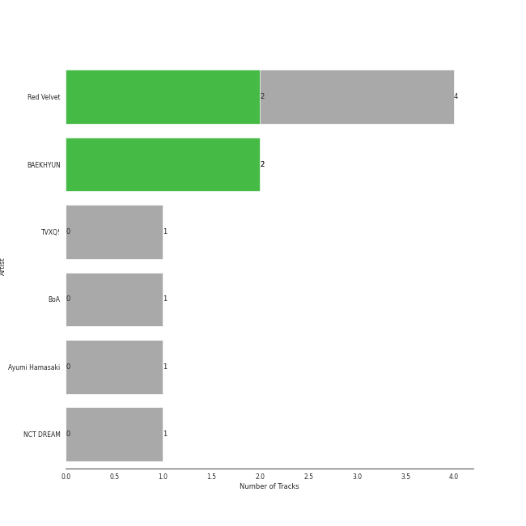
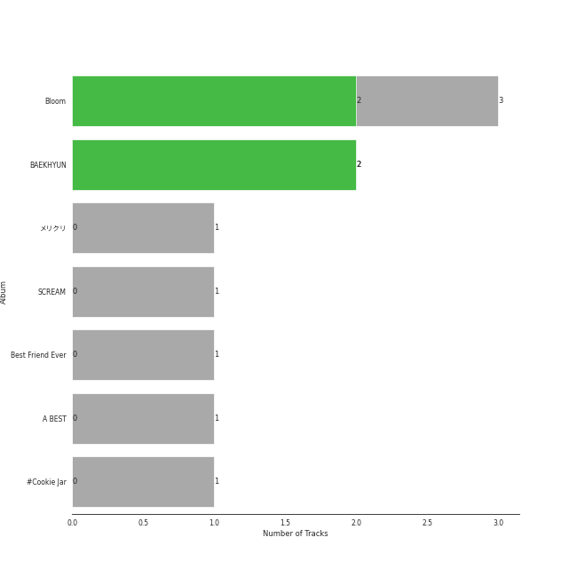
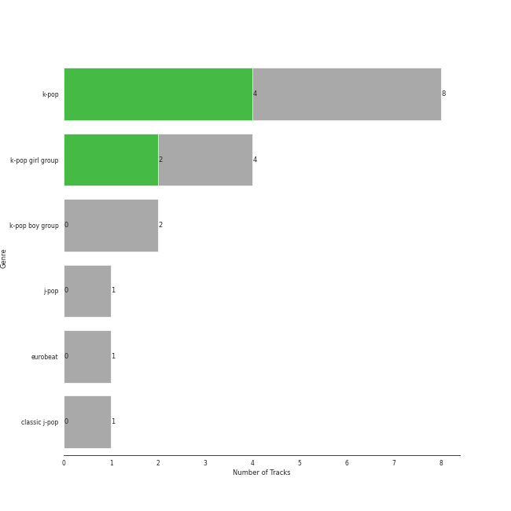

# avex trax

10 songs

Appears as:
- avex trax (10 tracks)

## Top Artists

| Art | Tracks | 💚 | Artist | 🔗 |
|:---|---:|---:|:---|:---|
|  | 2 | 2 | [BAEKHYUN](../../artists/baekhyun/overview.md) | [🔗](https://open.spotify.com/artist/4ufh0WuMZh6y4Dmdnklvdl) |
|  | 4 | 1 | [Red Velvet](../../artists/red_velvet/overview.md) | [🔗](https://open.spotify.com/artist/1z4g3DjTBBZKhvAroFlhOM) |
|  | 2 | 0 | [BoA](../../artists/boa/overview.md) | [🔗](https://open.spotify.com/artist/4muJrGMndyYWqZtfk8OWy4) |
|  | 1 | 0 | Ayumi Hamasaki | [🔗](https://open.spotify.com/artist/3Mvc8kRgr8LRYYgvFmlZqn) |
|  | 1 | 0 | [NCT DREAM](../../artists/nct_dream/overview.md) | [🔗](https://open.spotify.com/artist/1gBUSTR3TyDdTVFIaQnc02) |

## Top Albums

| Art | Tracks | 💚 | Album | Release Date | 🔗 |
|:---|---:|---:|:---|:---|:---|
|  | 3 | 1 | Bloom | 2022-04-06 | [🔗](https://open.spotify.com/album/4ualu7nMAcmoAqp47YaA95) |
|  | 2 | 2 | BAEKHYUN | 2021-01-20 | [🔗](https://open.spotify.com/album/1jV1UooTpZ7c90umcENmOC) |
|  | 1 | 0 | メリクリ | 2004-12-01 | [🔗](https://open.spotify.com/album/082g95CJ0YhcNAjxf2MMgT) |
|  | 1 | 0 | LISTEN TO MY HEART | 2002-03-13 | [🔗](https://open.spotify.com/album/7MbckmjrDXeNy4k1caTgbM) |
|  | 1 | 0 | Best Friend Ever | 2023-02-08 | [🔗](https://open.spotify.com/album/4cT6f8tGzBtybpBNYPEQoX) |
|  | 1 | 0 | A BEST | 2001-03-28 | [🔗](https://open.spotify.com/album/2B7L6R25vI22f1sIgV9k2F) |
|  | 1 | 0 | #Cookie Jar | 2018-07-04 | [🔗](https://open.spotify.com/album/4W6K0DP1YlZ48JlvdKCkZh) |

## Genres

| Tracks | 💚 | Genre |
|---:|---:|:---|
| 9 | 3 | [k-pop](../../genres/k_pop/overview.md) |
| 4 | 1 | [k-pop girl group](../../genres/k_pop_girl_group/overview.md) |
| 1 | 0 | [k-pop boy group](../../genres/k_pop_boy_group/overview.md) |
| 1 | 0 | [j-pop](../../genres/j_pop/overview.md) |
| 1 | 0 | eurobeat |
| 1 | 0 | classic j-pop |

## Tracks released under avex trax

| Art | Track | Album | Artists | Label | 💚 | 🔗 |
|:---|:---|:---|:---|:---|:---|:---|
|  | Boys & Girls | A BEST | Ayumi Hamasaki | [avex trax](.) | | [🔗](https://open.spotify.com/track/0QcVKhVp9iHGZ1pj04yTbO) |
|  | Get You Alone | BAEKHYUN | [BAEKHYUN](../../artists/baekhyun/overview.md) | [avex trax](.) | 💚 | [🔗](https://open.spotify.com/track/3K1hH4PSGXbzczwtdBvMNW) |
|  | Stars | BAEKHYUN | [BAEKHYUN](../../artists/baekhyun/overview.md) | [avex trax](.) | 💚 | [🔗](https://open.spotify.com/track/1Gxrej5rBiUbB9QqwmIbDp) |
|  | Every Heart-ミンナノキモチ- | LISTEN TO MY HEART | [BoA](../../artists/boa/overview.md) | [avex trax](.) | | [🔗](https://open.spotify.com/track/13BsjsiCIKWOiFZzT0GZ7K) |
|  | THE CHRISTMAS SONG | メリクリ | [BoA](../../artists/boa/overview.md) | [avex trax](.) | | [🔗](https://open.spotify.com/track/5K7s4e0uakvrNmBxclGhDZ) |
|  | Best Friend Ever | Best Friend Ever | [NCT DREAM](../../artists/nct_dream/overview.md) | [avex trax](.) | | [🔗](https://open.spotify.com/track/1Z5Dmg7Dvu0X4oSdqLZ3Lu) |
|  | #Cookie Jar | #Cookie Jar | [Red Velvet](../../artists/red_velvet/overview.md) | [avex trax](.) | | [🔗](https://open.spotify.com/track/3UgPJrKvOaTFgZ185X80Dx) |
|  | Marionette | Bloom | [Red Velvet](../../artists/red_velvet/overview.md) | [avex trax](.) | | [🔗](https://open.spotify.com/track/3KvMgB5V1FvQTCvvHz5aiO) |
|  | Sayonara | Bloom | [Red Velvet](../../artists/red_velvet/overview.md) | [avex trax](.) | | [🔗](https://open.spotify.com/track/382Mbj7rOJuqLQnsiV8fdp) |
|  | WILDSIDE | Bloom | [Red Velvet](../../artists/red_velvet/overview.md) | [avex trax](.) | 💚 | [🔗](https://open.spotify.com/track/4RmEqYXrb89Mlwzm2p6Wyd) |
