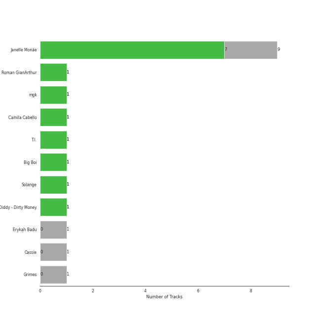
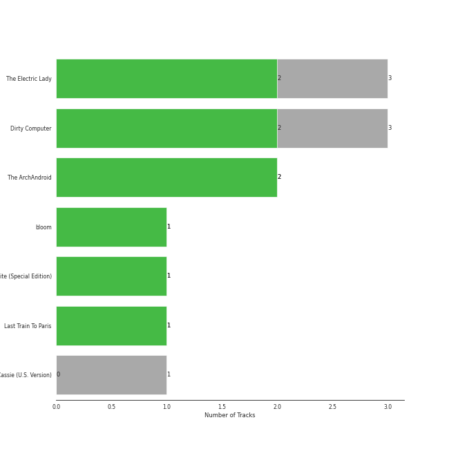
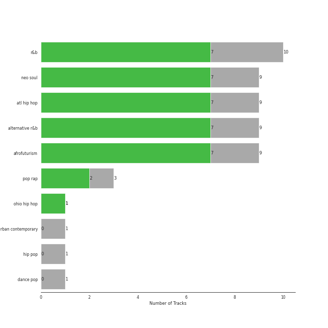
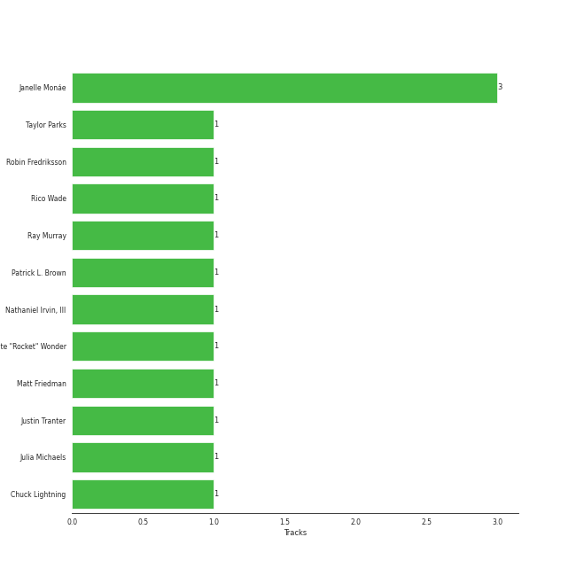

# Bad Boy

12 songs

[See Track Features](audio_features.md)

[See Clusters](clusters/overview.md)

Appears as:
- Bad Boy Records (5 tracks)
- Bad Boy/Wondaland (5 tracks)
- Bad Boy / Interscope (2 tracks)

## Top Artists

| Art | Rank | Tracks | 💚 | Artist | 🔗 |
|:---|---:|---:|---:|:---|:---|
|  | 107 | 9 | 7 | [Janelle Monáe](../../artists/janelle_monáe/overview.md) | [🔗](https://open.spotify.com/artist/6ueGR6SWhUJfvEhqkvMsVs) |
|  | 431 | 1 | 1 | Roman GianArthur | [🔗](https://open.spotify.com/artist/7hgRzsQGjlm1zifNoigyB9) |
|  | 431 | 1 | 1 | mgk | [🔗](https://open.spotify.com/artist/6TIYQ3jFPwQSRmorSezPxX) |
|  | 260 | 1 | 1 | [Camila Cabello](../../artists/camila_cabello/overview.md) | [🔗](https://open.spotify.com/artist/4nDoRrQiYLoBzwC5BhVJzF) |
|  | 431 | 1 | 1 | T.I. | [🔗](https://open.spotify.com/artist/4OBJLual30L7gRl5UkeRcT) |
|  | 431 | 1 | 1 | Big Boi | [🔗](https://open.spotify.com/artist/2ht3wxeT69CzyKFChNnNAB) |
|  | 431 | 1 | 1 | Solange | [🔗](https://open.spotify.com/artist/2auiVi8sUZo17dLy1HwrTU) |
|  | 431 | 1 | 1 | Diddy - Dirty Money | [🔗](https://open.spotify.com/artist/2QYEvpsWUOjqaYuxDPTCmV) |
|  | 431 | 1 | 0 | Erykah Badu | [🔗](https://open.spotify.com/artist/7IfculRW2WXyzNQ8djX8WX) |
|  | 431 | 1 | 0 | Cassie | [🔗](https://open.spotify.com/artist/27FGXRNruFoOdf1vP8dqcH) |

See all 11 artists

| Art | Rank | Tracks | 💚 | Artist | 🔗 |
|:---|---:|---:|---:|:---|:---|
|  | 431 | 1 | 0 | Grimes | [🔗](https://open.spotify.com/artist/053q0ukIDRgzwTr4vNSwab) |

## Top Albums

| Art | Rank | Tracks | 💚 | Album | Release Date | 🔗 |
|:---|---:|---:|---:|:---|:---|:---|
|  | 644 | 3 | 2 | The Electric Lady | 2013-09-06 | [🔗](https://open.spotify.com/album/3bnHtSmmsgJiG82hGCmsq9) |
|  | 644 | 3 | 2 | Dirty Computer | 2018-04-27 | [🔗](https://open.spotify.com/album/2PjlaxlMunGOUvcRzlTbtE) |
|  | 644 | 2 | 2 | The ArchAndroid | 2010-05-17 | [🔗](https://open.spotify.com/album/7MvSB0JTdtl1pSwZcgvYQX) |
|  | 644 | 1 | 1 | bloom | 2017-05-12 | [🔗](https://open.spotify.com/album/3yWRq9Dd2UO5xyqxTjLDmp) |
|  | 477 | 1 | 1 | Metropolis: The Chase Suite (Special Edition) | 2008-08-12 | [🔗](https://open.spotify.com/album/3T3bJi3cvwR5U7ihwgEwF1) |
|  | 644 | 1 | 1 | Last Train To Paris | 2010-01-01 | [🔗](https://open.spotify.com/album/2psjRixnoePs8ZqE8cuU5Z) |
|  | 644 | 1 | 0 | Cassie (U.S. Version) | 2006-08-07 | [🔗](https://open.spotify.com/album/0j1qzjaJmsF1FkcICf3hRu) |

## Genres

| Tracks | 💚 | Genre |
|---:|---:|:---|
| 10 | 7 | [r&b](../../genres/r_b/overview.md) |
| 9 | 7 | [neo soul](../../genres/neo_soul/overview.md) |
| 9 | 7 | atl hip hop |
| 9 | 7 | alternative r&b |
| 9 | 7 | afrofuturism |
| 3 | 2 | pop rap |
| 1 | 1 | ohio hip hop |
| 1 | 0 | [urban contemporary](../../genres/urban_contemporary/overview.md) |
| 1 | 0 | hip pop |
| 1 | 0 | [dance pop](../../genres/dance_pop/overview.md) |

## Top Producers

| Art | Producer | Tracks | Credit Types |
|:---|:---|---:|:---|
|  | [Janelle Monáe](../../artists/janelle_monáe/overview.md) | 3 | Songwriter, Producer |
| | Rico Wade | 1 | Songwriter |
| | Chuck Lightning | 1 | Producer |
| | Taylor Parks | 1 | Songwriter |
| | Nate "Rocket" Wonder | 1 | Producer |
| | Robin Fredriksson | 1 | Songwriter |
| | Justin Tranter | 1 | Songwriter |
| | Julia Michaels | 1 | Songwriter |
| | Nathaniel Irvin, III | 1 | Songwriter |
| | Ray Murray | 1 | Songwriter |

View all

| Art | Producer | Tracks | Credit Types |
|:---|:---|---:|:---|
| | Matt Friedman | 1 | Songwriter |
| | Patrick L. Brown | 1 | Songwriter |

## Tracks released under Bad Boy

| Art | Track | Album | Artists | Label | Rank | 💚 | 🔗 |
|:---|:---|:---|:---|:---|---:|:---|:---|
|  | Sincerely, Jane | Metropolis: The Chase Suite (Special Edition) | [Janelle Monáe](../../artists/janelle_monáe/overview.md) | [Bad Boy Records](.) | 711 | 💚 | [🔗](https://open.spotify.com/track/06I6iDFVtZDGcRu9BgHraA) |
|  | Me & U | Cassie (U.S. Version) | Cassie | [Bad Boy Records](.) | 976 | | [🔗](https://open.spotify.com/track/7k6IzwMGpxnRghE7YosnXT) |
|  | Hello Good Morning | Last Train To Paris | Diddy - Dirty Money, T.I. | [Bad Boy](.), [Interscope Records](../interscope_records) | 976 | 💚 | [🔗](https://open.spotify.com/track/7yzSijmAyOMBcHrK6Tfsoe) |
|  | Say You'll Go | The ArchAndroid | [Janelle Monáe](../../artists/janelle_monáe/overview.md) | [Bad Boy/Wondaland](.) | 976 | 💚 | [🔗](https://open.spotify.com/track/6wbEygoouLHwgy4J6uQIb1) |
|  | Tightrope (feat. Big Boi) - Big Boi Vocal Edit | The ArchAndroid | [Janelle Monáe](../../artists/janelle_monáe/overview.md), Big Boi | [Bad Boy/Wondaland](.) | 976 | 💚 | [🔗](https://open.spotify.com/track/1ljzHUgt2SU2ADkhfa9eBC) |
|  | Dance Apocalyptic | The Electric Lady | [Janelle Monáe](../../artists/janelle_monáe/overview.md) | [Bad Boy/Wondaland](.) | 976 | 💚 | [🔗](https://open.spotify.com/track/3dUMuxNadGxCE3qXuhCwqa) |
|  | Electric Lady (feat. Solange) | The Electric Lady | [Janelle Monáe](../../artists/janelle_monáe/overview.md), Roman GianArthur, Solange | [Bad Boy/Wondaland](.) | 976 | 💚 | [🔗](https://open.spotify.com/track/69vzkewKl2LPquyEiqD8BB) |
|  | Q.U.E.E.N. (feat. Erykah Badu) | The Electric Lady | [Janelle Monáe](../../artists/janelle_monáe/overview.md), Erykah Badu | [Bad Boy/Wondaland](.) | 976 | | [🔗](https://open.spotify.com/track/3HW030T8eqPs8wpsgZqCGM) |
|  | Bad Things (with Camila Cabello) | bloom | mgk, [Camila Cabello](../../artists/camila_cabello/overview.md) | [Bad Boy](.), [Interscope Records](../interscope_records) | 976 | 💚 | [🔗](https://open.spotify.com/track/1PSBzsahR2AKwLJgx8ehBj) |
|  | I Like That | Dirty Computer | [Janelle Monáe](../../artists/janelle_monáe/overview.md) | [Bad Boy Records](.) | 976 | 💚 | [🔗](https://open.spotify.com/track/2EznBGrlmx9wBeYgyDojsA) |

See all tracks

| Art | Track | Album | Artists | Label | Rank | 💚 | 🔗 |
|:---|:---|:---|:---|:---|---:|:---|:---|
|  | Make Me Feel | Dirty Computer | [Janelle Monáe](../../artists/janelle_monáe/overview.md) | [Bad Boy Records](.) | 976 | 💚 | [🔗](https://open.spotify.com/track/5gW5dSy3vXJxgzma4rQuzH) |
|  | Pynk (feat. Grimes) | Dirty Computer | [Janelle Monáe](../../artists/janelle_monáe/overview.md), Grimes | [Bad Boy Records](.) | 976 | | [🔗](https://open.spotify.com/track/5OpiyfqaQLdtwHd3SfembH) |

