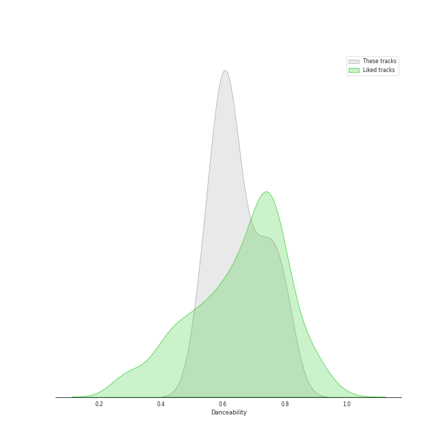
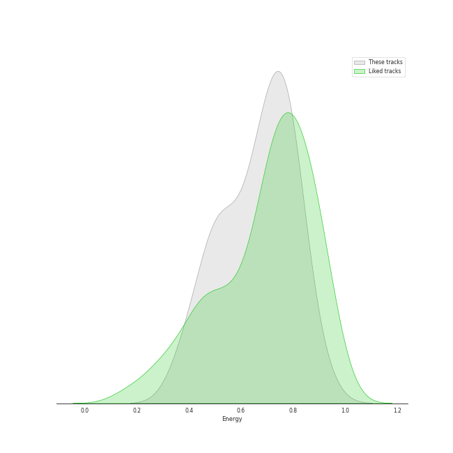
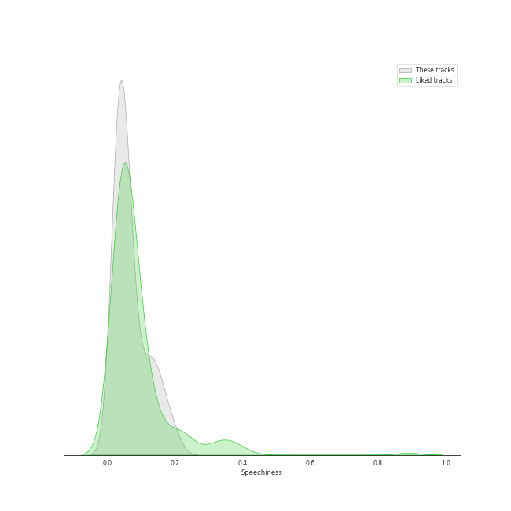
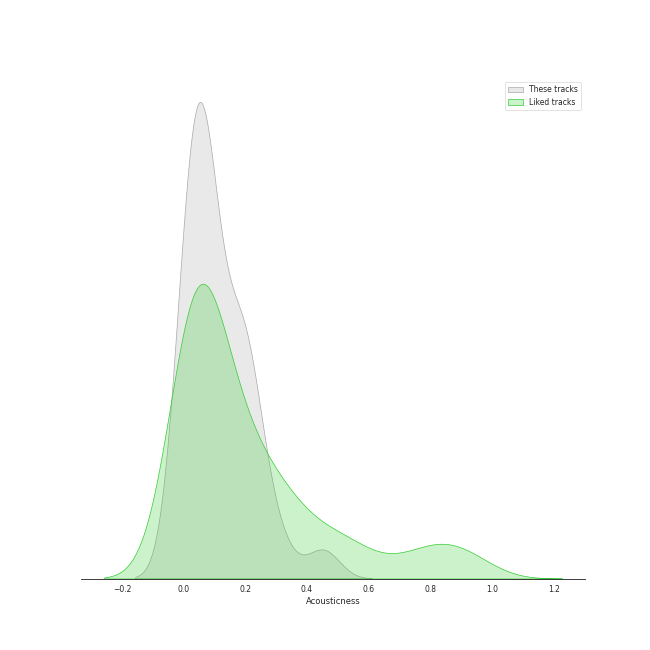
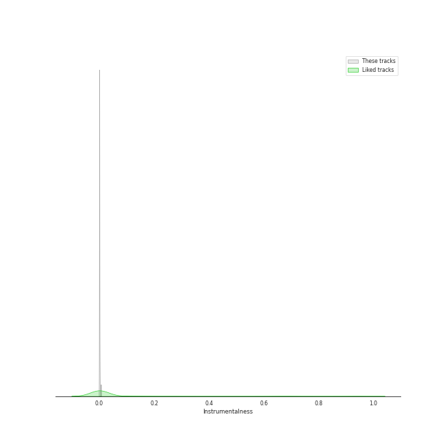
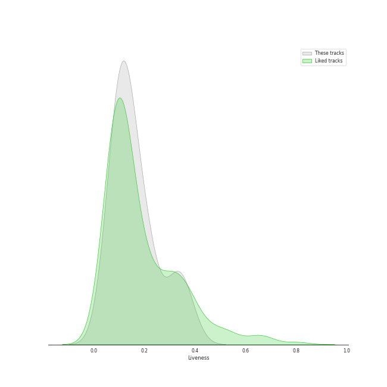
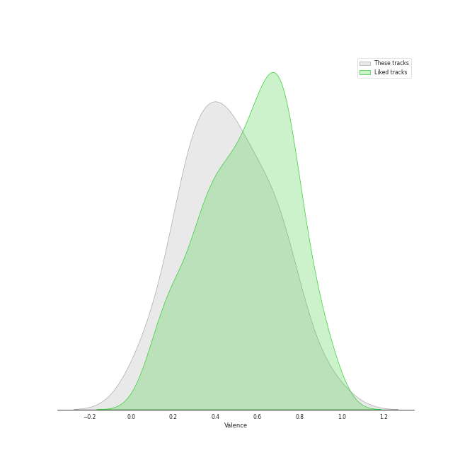
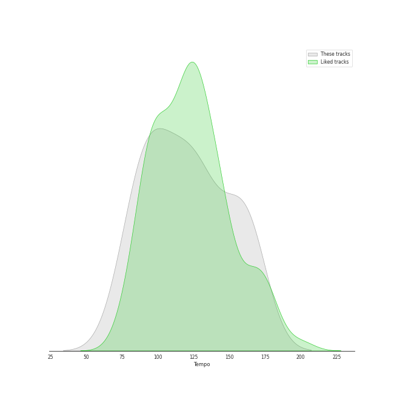

# Audio Features for Big Machine Records

## Danceability

| ​ | 10 most Danceable tracks | ​​ | 10 least Danceable tracks |
|:---|:---|:---|:---|
|  | Clean (0.81) |  | Back To December (0.529) |
|  | Gorgeous (0.8) |  | Begin Again (0.53) |
|  | Welcome To New York (0.793) |  | Out Of The Woods (0.552) |
|  | Look What You Made Me Do (0.766) |  | Wildest Dreams (0.554) |
|  | Santa Baby (0.759) |  | This Is Why We Can't Have Nice Things (0.567) |
|  | Blank Space (0.753) |  | Mean (0.568) |
|  | Delicate (0.75) |  | I Know Places (0.596) |
|  | Dress (0.719) |  | Call It What You Want (0.598) |
|  | Last Christmas (0.702) |  | Style (0.598) |
|  | I Did Something Bad (0.696) |  | Red (0.602) |

## Energy

| ​ | 10 most Energetic tracks | ​​ | 10 least Energetic tracks |
|:---|:---|:---|:---|
|  | Red (0.896) |  | Clean (0.379) |
|  | Out Of The Woods (0.842) |  | Delicate (0.404) |
|  | Forever & Always (0.821) |  | Dress (0.469) |
|  | This Is Why We Can't Have Nice Things (0.789) |  | I Knew You Were Trouble. (0.469) |
|  | Style (0.786) |  | Call It What You Want (0.504) |
|  | Shake It Off (0.785) |  | Santa Baby (0.509) |
|  | You Belong With Me (0.783) |  | Begin Again (0.526) |
|  | Last Christmas (0.77) |  | Don’t Blame Me (0.534) |
|  | ...Ready For It? (0.764) |  | Gorgeous (0.535) |
|  | I Know Places (0.763) |  | I Did Something Bad (0.602) |

## Speechiness

| ​ | 10 most Speechy tracks | ​​ | 10 least Speechy tracks |
|:---|:---|:---|:---|
|  | Dancing With Our Hands Tied (0.196) |  | All Too Well (0.0243) |
|  | Shake It Off (0.165) |  | Begin Again (0.0263) |
|  | I Did Something Bad (0.159) |  | Santa Baby (0.0271) |
|  | ...Ready For It? (0.136) |  | Our Song (0.0303) |
|  | Gorgeous (0.135) |  | Back To December (0.0303) |
|  | Look What You Made Me Do (0.123) |  | Love Story (0.031) |
|  | This Is Why We Can't Have Nice Things (0.115) |  | Welcome To New York (0.0324) |
|  | We Are Never Ever Getting Back Together (0.0916) |  | Clean (0.0349) |
|  | Wildest Dreams (0.0747) |  | I Knew You Were Trouble. (0.0363) |
|  | Call It What You Want (0.0731) |  | Last Christmas (0.0372) |

## Acousticness

| ​ | 10 most Acoustic tracks | ​​ | 10 least Acoustic tracks |
|:---|:---|:---|:---|
|  | Mean (0.452) |  | Out Of The Woods (0.00103) |
|  | Last Christmas (0.31) |  | Style (0.00253) |
|  | Clean (0.241) |  | I Knew You Were Trouble. (0.00454) |
|  | I Know Places (0.231) |  | We Are Never Ever Getting Back Together (0.00957) |
|  | Delicate (0.216) |  | This Is Why We Can't Have Nice Things (0.0156) |
|  | Look What You Made Me Do (0.204) |  | Dress (0.0329) |
|  | Begin Again (0.199) |  | Welcome To New York (0.038) |
|  | Call It What You Want (0.186) |  | All Too Well (0.0382) |
|  | Love Story (0.17) |  | ...Ready For It? (0.0527) |
|  | You Belong With Me (0.162) |  | Shake It Off (0.0561) |

## Instrumentalness

| ​ | 10 most Instrumental tracks | ​​ | 10 least Instrumental tracks |
|:---|:---|:---|:---|
|  | Wildest Dreams (0.00593) |  | Clean (0.0) |
|  | Style (0.0016) |  | This Is Why We Can't Have Nice Things (0.0) |
|  | Delicate (0.000357) |  | Our Song (0.0) |
|  | Call It What You Want (0.000221) |  | Love Story (0.0) |
|  | All Too Well (0.0002) |  | Last Christmas (0.0) |
|  | Red (8.87e-05) |  | ...Ready For It? (0.0) |
|  | We Are Never Ever Getting Back Together (2.65e-05) |  | Back To December (0.0) |
|  | I Did Something Bad (2.11e-05) |  | I Know Places (0.0) |
|  | Don’t Blame Me (1.76e-05) |  | Forever & Always (0.0) |
|  | Look What You Made Me Do (1.41e-05) |  | Shake It Off (0.0) |

## Liveness

| ​ | 10 most Live tracks | ​​ | 10 least Live tracks |
|:---|:---|:---|:---|
|  | This Is Why We Can't Have Nice Things (0.382) |  | I Knew You Were Trouble. (0.0398) |
|  | Call It What You Want (0.34) |  | Don’t Blame Me (0.0607) |
|  | Out Of The Woods (0.337) |  | I Did Something Bad (0.0696) |
|  | Back To December (0.334) |  | Love Story (0.0822) |
|  | Our Song (0.329) |  | Red (0.091) |
|  | Welcome To New York (0.304) |  | Delicate (0.0911) |
|  | Begin Again (0.232) |  | We Are Never Ever Getting Back Together (0.102) |
|  | Mean (0.217) |  | Wildest Dreams (0.106) |
|  | Gorgeous (0.213) |  | Forever & Always (0.11) |
|  | I Know Places (0.2) |  | Clean (0.113) |

## Valence

| ​ | 10 most Happy tracks | ​​ | 10 least Happy tracks |
|:---|:---|:---|:---|
|  | Shake It Off (0.943) |  | Delicate (0.0499) |
|  | Mean (0.789) |  | Dress (0.0851) |
|  | We Are Never Ever Getting Back Together (0.75) |  | Don’t Blame Me (0.193) |
|  | Santa Baby (0.75) |  | Clean (0.22) |
|  | Last Christmas (0.685) |  | Call It What You Want (0.252) |
|  | I Knew You Were Trouble. (0.679) |  | Dancing With Our Hands Tied (0.284) |
|  | Red (0.641) |  | Back To December (0.286) |
|  | Welcome To New York (0.615) |  | Love Story (0.296) |
|  | Blank Space (0.583) |  | I Did Something Bad (0.305) |
|  | Forever & Always (0.544) |  | Begin Again (0.323) |

## Tempo

| ​ | 10 most Fast tracks | ​​ | 10 least Fast tracks |
|:---|:---|:---|:---|
|  | Mean (163.974) |  | I Knew You Were Trouble. (77.019) |
|  | This Is Why We Can't Have Nice Things (163.96) |  | Begin Again (79.025) |
|  | Call It What You Want (163.954) |  | I Did Something Bad (82.989) |
|  | Dancing With Our Hands Tied (160.024) |  | We Are Never Ever Getting Back Together (85.984) |
|  | Shake It Off (160.015) |  | Our Song (89.011) |
|  | ...Ready For It? (160.015) |  | Out Of The Woods (91.991) |
|  | I Know Places (159.958) |  | Gorgeous (92.027) |
|  | Back To December (141.893) |  | All Too Well (93.06) |
|  | Wildest Dreams (140.056) |  | Style (95.019) |
|  | Don’t Blame Me (135.917) |  | Delicate (95.045) |
