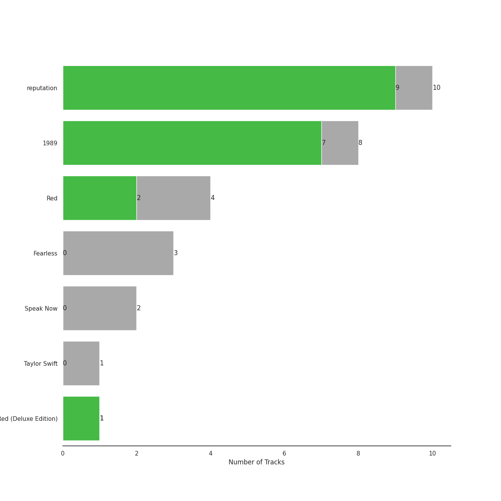
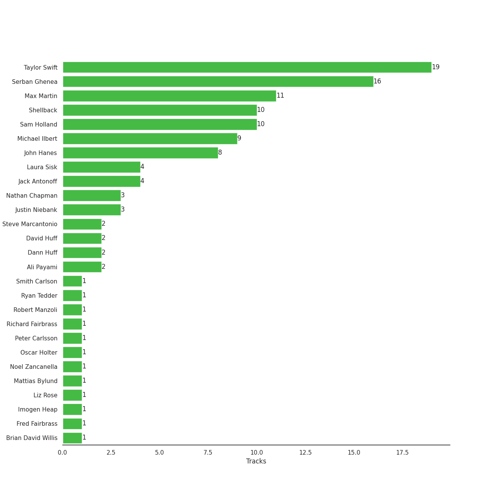

# Big Machine Records

31 songs

[See Track Features](audio_features.md)

[See Clusters](clusters/overview.md)

Appears as:
- Big Machine Records, LLC (31 tracks)

## Top Artists

| Art | Rank | Tracks | 💚 | Artist | 🔗 |
|:---|---:|---:|---:|:---|:---|
|  | 18 | 31 | 19 | [Taylor Swift](../../artists/taylor_swift/overview.md) | [🔗](https://open.spotify.com/artist/06HL4z0CvFAxyc27GXpf02) |

## Top Albums

| Art | Rank | Tracks | 💚 | Album | Release Date | 🔗 |
|:---|---:|---:|---:|:---|:---|:---|
|  | 319 | 10 | 9 | reputation | 2017-11-10 | [🔗](https://open.spotify.com/album/6DEjYFkNZh67HP7R9PSZvv) |
|  | 637 | 8 | 7 | 1989 | 2014-10-27 | [🔗](https://open.spotify.com/album/2QJmrSgbdM35R67eoGQo4j) |
|  | 603 | 6 | 3 | Red | 2012-10-22 | [🔗](https://open.spotify.com/album/1EoDsNmgTLtmwe1BDAVxV5) |
|  | 637 | 3 | 0 | Fearless | 2008-11-11 | [🔗](https://open.spotify.com/album/2dqn5yOQWdyGwOpOIi9O4x) |
|  | 269 | 2 | 0 | The Taylor Swift Holiday Collection | 2008-12-02 | [🔗](https://open.spotify.com/album/7vzYp7FrKnTRoktBYsx9SF) |
|  | 637 | 2 | 0 | Speak Now | 2010-10-25 | [🔗](https://open.spotify.com/album/5MfAxS5zz8MlfROjGQVXhy) |

## Genres

| Tracks | 💚 | Genre |
|---:|---:|:---|
| 31 | 19 | [pop](../../genres/pop/overview.md) |

## Top Producers

| Art | Producer | Tracks | Credit Types |
|:---|:---|---:|:---|
|  | [Taylor Swift](../../artists/taylor_swift/overview.md) | 19 | Songwriter, Lyricist, Producer |
| | [Serban Ghenea](../../producers/serban_ghenea/overview.md) | 16 | Producer |
| | [Max Martin](../../producers/max_martin/overview.md) | 11 | Producer, Songwriter, Lyricist |
| | [Sam Holland](../../producers/sam_holland/overview.md) | 10 | Producer |
| | [Shellback](../../producers/shellback/overview.md) | 10 | Producer, Songwriter, Lyricist |
| | Michael Ilbert | 9 | Producer |
| | [John Hanes](../../producers/john_hanes/overview.md) | 8 | Producer |
| | [Jack Antonoff](../../producers/jack_antonoff/overview.md) | 4 | Producer, Songwriter |
| | [Laura Sisk](../../producers/laura_sisk/overview.md) | 4 | Producer |
| | Justin Niebank | 3 | Producer |

View all

| Art | Producer | Tracks | Credit Types |
|:---|:---|---:|:---|
| | Nathan Chapman | 3 | Producer |
| | Steve Marcantonio | 2 | Producer |
| | David Huff | 2 | Producer |
| | Ali Payami | 2 | Lyricist, Producer, Songwriter |
| | Dann Huff | 2 | Producer |
| | Liz Rose | 1 | Songwriter |
| | Robert Manzoli | 1 | Songwriter |
| | [Ryan Tedder](../../producers/ryan_tedder/overview.md) | 1 | Producer, Songwriter |
| | Noel Zancanella | 1 | Producer |
| | Peter Carlsson | 1 | Producer |
| | Richard Fairbrass | 1 | Songwriter |
|  | [Imogen Heap](../../artists/imogen_heap/overview.md) | 1 | Producer, Songwriter |
| | Oscar Holter | 1 | Producer, Songwriter |
| | Mattias Bylund | 1 | Arranger, Producer |
| | Brian David Willis | 1 | Producer |
| | Fred Fairbrass | 1 | Songwriter |
| | Smith Carlson | 1 | Producer |

## Tracks released under Big Machine Records

| Art | Track | Album | Artists | Label | Rank | 💚 | 🔗 |
|:---|:---|:---|:---|:---|---:|:---|:---|
|  | Santa Baby | The Taylor Swift Holiday Collection | [Taylor Swift](../../artists/taylor_swift/overview.md) | [Big Machine Records, LLC](.) | 383 | | [🔗](https://open.spotify.com/track/71IScwIe7bcIlpnlkbKVQw) |
|  | ...Ready For It? | reputation | [Taylor Swift](../../artists/taylor_swift/overview.md) | [Big Machine Records, LLC](.) | 476 | 💚 | [🔗](https://open.spotify.com/track/2yLa0QULdQr0qAIvVwN6B5) |
|  | Don’t Blame Me | reputation | [Taylor Swift](../../artists/taylor_swift/overview.md) | [Big Machine Records, LLC](.) | 859 | 💚 | [🔗](https://open.spotify.com/track/1R0a2iXumgCiFb7HEZ7gUE) |
|  | Begin Again | Red | [Taylor Swift](../../artists/taylor_swift/overview.md) | [Big Machine Records, LLC](.) | 913 | 💚 | [🔗](https://open.spotify.com/track/0L4YCNRfXAoTvdpWeH2RGj) |
|  | Forever & Always | Fearless | [Taylor Swift](../../artists/taylor_swift/overview.md) | [Big Machine Records, LLC](.) | 964 | | [🔗](https://open.spotify.com/track/47HtKpfzpAt8rQjjXWotFj) |
|  | Love Story | Fearless | [Taylor Swift](../../artists/taylor_swift/overview.md) | [Big Machine Records, LLC](.) | 964 | | [🔗](https://open.spotify.com/track/1vrd6UOGamcKNGnSHJQlSt) |
|  | You Belong With Me | Fearless | [Taylor Swift](../../artists/taylor_swift/overview.md) | [Big Machine Records, LLC](.) | 964 | | [🔗](https://open.spotify.com/track/3GCL1PydwsLodcpv0Ll1ch) |
|  | Last Christmas | The Taylor Swift Holiday Collection | [Taylor Swift](../../artists/taylor_swift/overview.md) | [Big Machine Records, LLC](.) | 964 | | [🔗](https://open.spotify.com/track/2IprIjGNRlj3TfqUWCAo0C) |
|  | Back To December | Speak Now | [Taylor Swift](../../artists/taylor_swift/overview.md) | [Big Machine Records, LLC](.) | 964 | | [🔗](https://open.spotify.com/track/3DrjZArsPsoqbLzUZZV1Id) |
|  | Mean | Speak Now | [Taylor Swift](../../artists/taylor_swift/overview.md) | [Big Machine Records, LLC](.) | 964 | | [🔗](https://open.spotify.com/track/5yEPktRqvIhko5QFF3aBhQ) |

See all tracks

| Art | Track | Album | Artists | Label | Rank | 💚 | 🔗 |
|:---|:---|:---|:---|:---|---:|:---|:---|
|  | 22 | Red | [Taylor Swift](../../artists/taylor_swift/overview.md) | [Big Machine Records, LLC](.) | 964 | | [🔗](https://open.spotify.com/track/2ULNeSomDxVNmdDy8VxEBU) |
|  | All Too Well | Red | [Taylor Swift](../../artists/taylor_swift/overview.md) | [Big Machine Records, LLC](.) | 964 | 💚 | [🔗](https://open.spotify.com/track/4XMP3zVxrnr58T0tjIHvpR) |
|  | I Knew You Were Trouble. | Red | [Taylor Swift](../../artists/taylor_swift/overview.md) | [Big Machine Records, LLC](.) | 964 | | [🔗](https://open.spotify.com/track/72jCZdH0Lhg93z6Z4hBjgj) |
|  | Red | Red | [Taylor Swift](../../artists/taylor_swift/overview.md) | [Big Machine Records, LLC](.) | 964 | 💚 | [🔗](https://open.spotify.com/track/0cITLOYn1Sv4q27zZPqlNK) |
|  | We Are Never Ever Getting Back Together | Red | [Taylor Swift](../../artists/taylor_swift/overview.md) | [Big Machine Records, LLC](.) | 964 | | [🔗](https://open.spotify.com/track/7AEAGTc8cReDqcbPoY9gwo) |
|  | Blank Space | 1989 | [Taylor Swift](../../artists/taylor_swift/overview.md) | [Big Machine Records, LLC](.) | 964 | 💚 | [🔗](https://open.spotify.com/track/1p80LdxRV74UKvL8gnD7ky) |
|  | Clean | 1989 | [Taylor Swift](../../artists/taylor_swift/overview.md) | [Big Machine Records, LLC](.) | 964 | 💚 | [🔗](https://open.spotify.com/track/06WgOCf0LV2h4keYXDRnuh) |
|  | I Know Places | 1989 | [Taylor Swift](../../artists/taylor_swift/overview.md) | [Big Machine Records, LLC](.) | 964 | 💚 | [🔗](https://open.spotify.com/track/3jBMHD19RZdAqG9iFQh7xc) |
|  | Out Of The Woods | 1989 | [Taylor Swift](../../artists/taylor_swift/overview.md) | [Big Machine Records, LLC](.) | 964 | 💚 | [🔗](https://open.spotify.com/track/5OndtwLGA9O6XHFcGm2H7r) |
|  | Shake It Off | 1989 | [Taylor Swift](../../artists/taylor_swift/overview.md) | [Big Machine Records, LLC](.) | 964 | 💚 | [🔗](https://open.spotify.com/track/5xTtaWoae3wi06K5WfVUUH) |
|  | Style | 1989 | [Taylor Swift](../../artists/taylor_swift/overview.md) | [Big Machine Records, LLC](.) | 964 | 💚 | [🔗](https://open.spotify.com/track/4lIxdJw6W3Fg4vUIYCB0S5) |
|  | Welcome To New York | 1989 | [Taylor Swift](../../artists/taylor_swift/overview.md) | [Big Machine Records, LLC](.) | 964 | | [🔗](https://open.spotify.com/track/6qnM0XXPZOINWA778uNqQ9) |
|  | Wildest Dreams | 1989 | [Taylor Swift](../../artists/taylor_swift/overview.md) | [Big Machine Records, LLC](.) | 964 | 💚 | [🔗](https://open.spotify.com/track/59HjlYCeBsxdI0fcm3zglw) |
|  | Call It What You Want | reputation | [Taylor Swift](../../artists/taylor_swift/overview.md) | [Big Machine Records, LLC](.) | 964 | 💚 | [🔗](https://open.spotify.com/track/1GwMQaZz6Au3QLDbjbMdme) |
|  | Dancing With Our Hands Tied | reputation | [Taylor Swift](../../artists/taylor_swift/overview.md) | [Big Machine Records, LLC](.) | 964 | 💚 | [🔗](https://open.spotify.com/track/7I7JbDv63ZJJsSi24DyJrz) |
|  | Delicate | reputation | [Taylor Swift](../../artists/taylor_swift/overview.md) | [Big Machine Records, LLC](.) | 964 | 💚 | [🔗](https://open.spotify.com/track/6NFyWDv5CjfwuzoCkw47Xf) |
|  | Dress | reputation | [Taylor Swift](../../artists/taylor_swift/overview.md) | [Big Machine Records, LLC](.) | 964 | 💚 | [🔗](https://open.spotify.com/track/6oVxXO5oQ4pTpO8RSnkzvv) |
|  | Gorgeous | reputation | [Taylor Swift](../../artists/taylor_swift/overview.md) | [Big Machine Records, LLC](.) | 964 | 💚 | [🔗](https://open.spotify.com/track/1ZY1PqizIl78geGM4xWlEA) |
|  | I Did Something Bad | reputation | [Taylor Swift](../../artists/taylor_swift/overview.md) | [Big Machine Records, LLC](.) | 964 | 💚 | [🔗](https://open.spotify.com/track/4svZDCRz4cJoneBpjpx8DJ) |
|  | Look What You Made Me Do | reputation | [Taylor Swift](../../artists/taylor_swift/overview.md) | [Big Machine Records, LLC](.) | 964 | 💚 | [🔗](https://open.spotify.com/track/1P17dC1amhFzptugyAO7Il) |
|  | This Is Why We Can't Have Nice Things | reputation | [Taylor Swift](../../artists/taylor_swift/overview.md) | [Big Machine Records, LLC](.) | 964 | | [🔗](https://open.spotify.com/track/07NxDD1iKCHbAldceD7QLP) |

