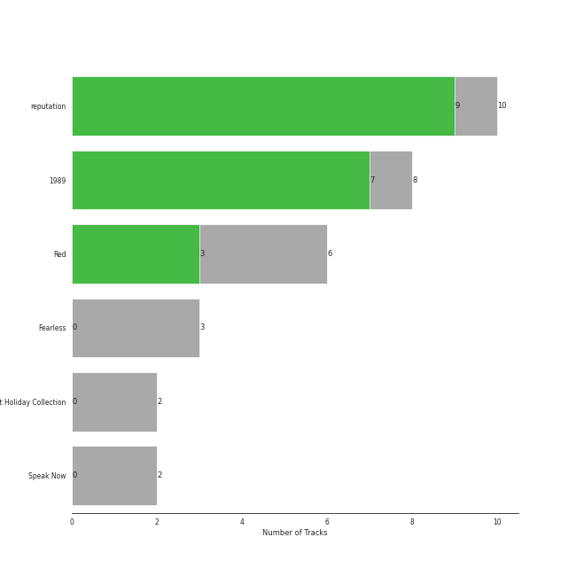

# Big Machine Records

31 songs

[See Audio Features](audio_features.md)

Appears as:
- Big Machine Records, LLC (31 tracks)

## Top Artists

| Art | Tracks | 💚 | Artist | 🔗 |
|:---|---:|---:|:---|:---|
|  | 31 | 19 | [Taylor Swift](../../artists/taylor_swift/overview.md) | [🔗](https://open.spotify.com/artist/06HL4z0CvFAxyc27GXpf02) |

## Top Albums

| Art | Tracks | 💚 | Album | Release Date | 🔗 |
|:---|---:|---:|:---|:---|:---|
|  | 10 | 9 | reputation | 2017-11-10 | [🔗](https://open.spotify.com/album/6DEjYFkNZh67HP7R9PSZvv) |
|  | 8 | 7 | 1989 | 2014-10-27 | [🔗](https://open.spotify.com/album/2QJmrSgbdM35R67eoGQo4j) |
|  | 4 | 2 | Red | 2012-10-22 | [🔗](https://open.spotify.com/album/1EoDsNmgTLtmwe1BDAVxV5) |
|  | 3 | 0 | Fearless | 2008-11-11 | [🔗](https://open.spotify.com/album/2dqn5yOQWdyGwOpOIi9O4x) |
|  | 2 | 0 | The Taylor Swift Holiday Collection | 2008-12-02 | [🔗](https://open.spotify.com/album/7vzYp7FrKnTRoktBYsx9SF) |
|  | 2 | 0 | Speak Now | 2010-10-25 | [🔗](https://open.spotify.com/album/5MfAxS5zz8MlfROjGQVXhy) |
|  | 1 | 1 | Red (Deluxe Edition) | 2012-10-22 | [🔗](https://open.spotify.com/album/1KlU96Hw9nlvqpBPlSqcTV) |
|  | 1 | 0 | Taylor Swift | 2006-10-24 | [🔗](https://open.spotify.com/album/7mzrIsaAjnXihW3InKjlC3) |

## Genres

| Tracks | 💚 | Genre |
|---:|---:|:---|
| 31 | 19 | [pop](../../genres/pop/overview.md) |

## Tracks released under Big Machine Records

| Art | Track | Album | Artists | Label | 💚 | 🔗 |
|:---|:---|:---|:---|:---|:---|:---|
|  | Our Song | Taylor Swift | [Taylor Swift](../../artists/taylor_swift/overview.md) | [Big Machine Records, LLC](.) | | [🔗](https://open.spotify.com/track/15DeqWWQB4dcEWzJg15VrN) |
|  | Forever & Always | Fearless | [Taylor Swift](../../artists/taylor_swift/overview.md) | [Big Machine Records, LLC](.) | | [🔗](https://open.spotify.com/track/47HtKpfzpAt8rQjjXWotFj) |
|  | Love Story | Fearless | [Taylor Swift](../../artists/taylor_swift/overview.md) | [Big Machine Records, LLC](.) | | [🔗](https://open.spotify.com/track/1vrd6UOGamcKNGnSHJQlSt) |
|  | You Belong With Me | Fearless | [Taylor Swift](../../artists/taylor_swift/overview.md) | [Big Machine Records, LLC](.) | | [🔗](https://open.spotify.com/track/3GCL1PydwsLodcpv0Ll1ch) |
|  | Last Christmas | The Taylor Swift Holiday Collection | [Taylor Swift](../../artists/taylor_swift/overview.md) | [Big Machine Records, LLC](.) | | [🔗](https://open.spotify.com/track/2IprIjGNRlj3TfqUWCAo0C) |
|  | Santa Baby | The Taylor Swift Holiday Collection | [Taylor Swift](../../artists/taylor_swift/overview.md) | [Big Machine Records, LLC](.) | | [🔗](https://open.spotify.com/track/71IScwIe7bcIlpnlkbKVQw) |
|  | Back To December | Speak Now | [Taylor Swift](../../artists/taylor_swift/overview.md) | [Big Machine Records, LLC](.) | | [🔗](https://open.spotify.com/track/3DrjZArsPsoqbLzUZZV1Id) |
|  | Mean | Speak Now | [Taylor Swift](../../artists/taylor_swift/overview.md) | [Big Machine Records, LLC](.) | | [🔗](https://open.spotify.com/track/5yEPktRqvIhko5QFF3aBhQ) |
|  | Begin Again | Red | [Taylor Swift](../../artists/taylor_swift/overview.md) | [Big Machine Records, LLC](.) | 💚 | [🔗](https://open.spotify.com/track/0L4YCNRfXAoTvdpWeH2RGj) |
|  | I Knew You Were Trouble. | Red | [Taylor Swift](../../artists/taylor_swift/overview.md) | [Big Machine Records, LLC](.) | | [🔗](https://open.spotify.com/track/72jCZdH0Lhg93z6Z4hBjgj) |

See all tracks

| Art | Track | Album | Artists | Label | 💚 | 🔗 |
|:---|:---|:---|:---|:---|:---|:---|
|  | Red | Red | [Taylor Swift](../../artists/taylor_swift/overview.md) | [Big Machine Records, LLC](.) | 💚 | [🔗](https://open.spotify.com/track/0cITLOYn1Sv4q27zZPqlNK) |
|  | We Are Never Ever Getting Back Together | Red | [Taylor Swift](../../artists/taylor_swift/overview.md) | [Big Machine Records, LLC](.) | | [🔗](https://open.spotify.com/track/7AEAGTc8cReDqcbPoY9gwo) |
|  | All Too Well | Red (Deluxe Edition) | [Taylor Swift](../../artists/taylor_swift/overview.md) | [Big Machine Records, LLC](.) | 💚 | [🔗](https://open.spotify.com/track/1q3RiD1tIWUpGsNFADMlvl) |
|  | Blank Space | 1989 | [Taylor Swift](../../artists/taylor_swift/overview.md) | [Big Machine Records, LLC](.) | 💚 | [🔗](https://open.spotify.com/track/1p80LdxRV74UKvL8gnD7ky) |
|  | Clean | 1989 | [Taylor Swift](../../artists/taylor_swift/overview.md) | [Big Machine Records, LLC](.) | 💚 | [🔗](https://open.spotify.com/track/06WgOCf0LV2h4keYXDRnuh) |
|  | I Know Places | 1989 | [Taylor Swift](../../artists/taylor_swift/overview.md) | [Big Machine Records, LLC](.) | 💚 | [🔗](https://open.spotify.com/track/3jBMHD19RZdAqG9iFQh7xc) |
|  | Out Of The Woods | 1989 | [Taylor Swift](../../artists/taylor_swift/overview.md) | [Big Machine Records, LLC](.) | 💚 | [🔗](https://open.spotify.com/track/5OndtwLGA9O6XHFcGm2H7r) |
|  | Shake It Off | 1989 | [Taylor Swift](../../artists/taylor_swift/overview.md) | [Big Machine Records, LLC](.) | 💚 | [🔗](https://open.spotify.com/track/5xTtaWoae3wi06K5WfVUUH) |
|  | Style | 1989 | [Taylor Swift](../../artists/taylor_swift/overview.md) | [Big Machine Records, LLC](.) | 💚 | [🔗](https://open.spotify.com/track/4lIxdJw6W3Fg4vUIYCB0S5) |
|  | Welcome To New York | 1989 | [Taylor Swift](../../artists/taylor_swift/overview.md) | [Big Machine Records, LLC](.) | | [🔗](https://open.spotify.com/track/6qnM0XXPZOINWA778uNqQ9) |
|  | Wildest Dreams | 1989 | [Taylor Swift](../../artists/taylor_swift/overview.md) | [Big Machine Records, LLC](.) | 💚 | [🔗](https://open.spotify.com/track/59HjlYCeBsxdI0fcm3zglw) |
|  | ...Ready For It? | reputation | [Taylor Swift](../../artists/taylor_swift/overview.md) | [Big Machine Records, LLC](.) | 💚 | [🔗](https://open.spotify.com/track/2yLa0QULdQr0qAIvVwN6B5) |
|  | Call It What You Want | reputation | [Taylor Swift](../../artists/taylor_swift/overview.md) | [Big Machine Records, LLC](.) | 💚 | [🔗](https://open.spotify.com/track/1GwMQaZz6Au3QLDbjbMdme) |
|  | Dancing With Our Hands Tied | reputation | [Taylor Swift](../../artists/taylor_swift/overview.md) | [Big Machine Records, LLC](.) | 💚 | [🔗](https://open.spotify.com/track/7I7JbDv63ZJJsSi24DyJrz) |
|  | Delicate | reputation | [Taylor Swift](../../artists/taylor_swift/overview.md) | [Big Machine Records, LLC](.) | 💚 | [🔗](https://open.spotify.com/track/6NFyWDv5CjfwuzoCkw47Xf) |
|  | Don’t Blame Me | reputation | [Taylor Swift](../../artists/taylor_swift/overview.md) | [Big Machine Records, LLC](.) | 💚 | [🔗](https://open.spotify.com/track/1R0a2iXumgCiFb7HEZ7gUE) |
|  | Dress | reputation | [Taylor Swift](../../artists/taylor_swift/overview.md) | [Big Machine Records, LLC](.) | 💚 | [🔗](https://open.spotify.com/track/6oVxXO5oQ4pTpO8RSnkzvv) |
|  | Gorgeous | reputation | [Taylor Swift](../../artists/taylor_swift/overview.md) | [Big Machine Records, LLC](.) | 💚 | [🔗](https://open.spotify.com/track/1ZY1PqizIl78geGM4xWlEA) |
|  | I Did Something Bad | reputation | [Taylor Swift](../../artists/taylor_swift/overview.md) | [Big Machine Records, LLC](.) | 💚 | [🔗](https://open.spotify.com/track/4svZDCRz4cJoneBpjpx8DJ) |
|  | Look What You Made Me Do | reputation | [Taylor Swift](../../artists/taylor_swift/overview.md) | [Big Machine Records, LLC](.) | 💚 | [🔗](https://open.spotify.com/track/1P17dC1amhFzptugyAO7Il) |
|  | This Is Why We Can't Have Nice Things | reputation | [Taylor Swift](../../artists/taylor_swift/overview.md) | [Big Machine Records, LLC](.) | | [🔗](https://open.spotify.com/track/07NxDD1iKCHbAldceD7QLP) |

