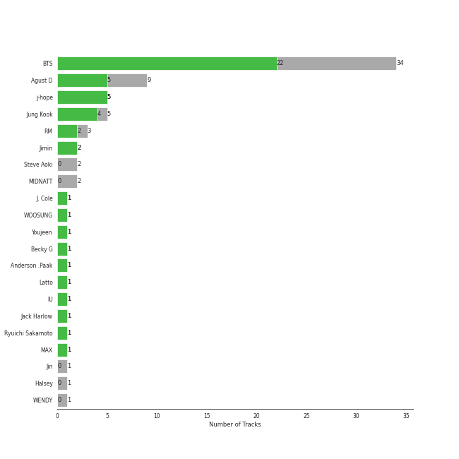
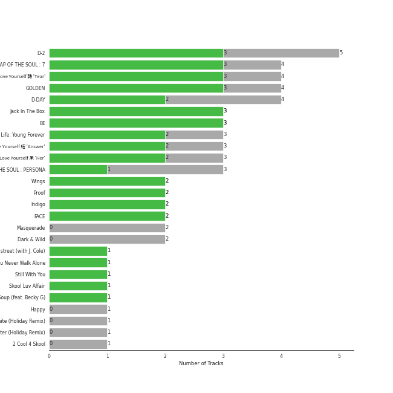
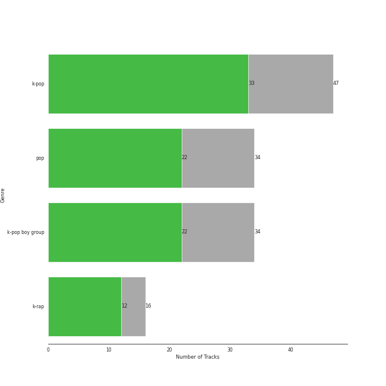

# BIGHIT MUSIC

43 songs

Appears as:
- BIGHIT MUSIC (27 tracks)
- BIGHIT MUSIC / HYBE (16 tracks)

## Top Artists

See all 9 artists

| Number of Tracks | Art | Artist | 🔗 |
|---:|:---|:---|:---|
| 32 |  | [BTS](../artists/bts.md) | [🔗](https://open.spotify.com/artist/3Nrfpe0tUJi4K4DXYWgMUX) |
| 6 |  | Agust D | [🔗](https://open.spotify.com/artist/5RmQ8k4l3HZ8JoPb4mNsML) |
| 5 |  | j-hope | [🔗](https://open.spotify.com/artist/0b1sIQumIAsNbqAoIClSpy) |
| 2 |  | Steve Aoki | [🔗](https://open.spotify.com/artist/77AiFEVeAVj2ORpC85QVJs) |
| 1 |  | J. Cole | [🔗](https://open.spotify.com/artist/6l3HvQ5sa6mXTsMTB19rO5) |
| 1 |  | Becky G | [🔗](https://open.spotify.com/artist/4obzFoKoKRHIphyHzJ35G3) |
| 1 |  | RM | [🔗](https://open.spotify.com/artist/2auC28zjQyVTsiZKNgPRGs) |
| 1 |  | Halsey | [🔗](https://open.spotify.com/artist/26VFTg2z8YR0cCuwLzESi2) |
| 1 |  | MAX | [🔗](https://open.spotify.com/artist/1bqxdqvUtPWZri43cKHac8) |

## Top Albums

See all 20 albums

| Number of Tracks | Art | Album | Release Date | 🔗 |
|---:|:---|:---|:---|:---|
| 5 |  | D-2 | 2020-05-22 | [🔗](https://open.spotify.com/album/0zhGddZ83RpCgnelKWa2qS) |
| 4 |  | Love Yourself 轉 'Tear' | 2018-05-18 | [🔗](https://open.spotify.com/album/4NIqCxqP9o8Tp6tGLBqd8O) |
| 3 |  | MAP OF THE SOUL : PERSONA | 2019-04-12 | [🔗](https://open.spotify.com/album/2KqlAl1Kl5fZvbFgJ0qFB6) |
| 3 |  | MAP OF THE SOUL : 7 | 2020-02-21 | [🔗](https://open.spotify.com/album/5W1XY5ucNATjTULERvXx9j) |
| 3 |  | Love Yourself 結 'Answer' | 2018-08-24 | [🔗](https://open.spotify.com/album/43wFM1HquliY3iwKWzPN4y) |
| 3 |  | Love Yourself 承 'Her' | 2017-09-18 | [🔗](https://open.spotify.com/album/2FTS6a6DLXMNp8flyA0HGO) |
| 3 |  | Jack In The Box | 2022-07-15 | [🔗](https://open.spotify.com/album/0FrC9lzgVhziJenigsrXdl) |
| 3 |  | BE | 2020-11-20 | [🔗](https://open.spotify.com/album/6nYfHQnvkvOTNHnOhDT3sr) |
| 2 |  | Wings | 2016-10-10 | [🔗](https://open.spotify.com/album/1vhNGBTFoaSTLbHjPGFIlF) |
| 2 |  | The Most Beautiful Moment in Life: Young Forever | 2016-05-02 | [🔗](https://open.spotify.com/album/1k5bJ8l5oL5xxVBVHjil09) |
| 2 |  | Dark & Wild | 2014-08-20 | [🔗](https://open.spotify.com/album/7FxxU3EP37uMsZf8FilkDR) |
| 2 |  | 2 Cool 4 Skool | 2013-06-12 | [🔗](https://open.spotify.com/album/26z5WolFltYgVMuuJ3c0Am) |
| 1 |  | on the street (with J. Cole) | 2023-03-03 | [🔗](https://open.spotify.com/album/70xdtgH5XuYTqBNdNbUwGO) |
| 1 |  | You Never Walk Alone | 2017-02-13 | [🔗](https://open.spotify.com/album/7LF4N7lvyDhrPBuCJ1rplJ) |
| 1 |  | The Most Beautiful Moment in Life Pt.2 | 2015-11-30 | [🔗](https://open.spotify.com/album/4frjaGAtuBmm8CPuYPY4oG) |
| 1 |  | Skool Luv Affair | 2014-02-12 | [🔗](https://open.spotify.com/album/5r35iS0uSSoQBKzQj0IeI3) |
| 1 |  | Proof | 2022-06-10 | [🔗](https://open.spotify.com/album/6al2VdKbb6FIz9d7lU7WRB) |
| 1 |  | D-2 | 2020-05-22 | [🔗](https://open.spotify.com/album/1Pp8t7yn2E3rz3R7ZqPn1O) |
| 1 |  | Chicken Noodle Soup (feat. Becky G) | 2019-09-27 | [🔗](https://open.spotify.com/album/76IRLp7YzBVLKsat6Ro9ae) |
| 1 |  | Butter | 2021-05-21 | [🔗](https://open.spotify.com/album/2BDhPi2XCYujYxU6VM0QaD) |

## Genres

See all 3 genres

| Number of Tracks | Genre |
|---:|:---|
| 37 | [k-pop](../genres/k_pop.md) |
| 32 | [k-pop boy group](../genres/k_pop_boy_group.md) |
| 11 | k-rap |

## Tracks released under BIGHIT MUSIC

| Art | Track | Album | Artists | Label | 💚 | 🔗 |
|:---|:---|:---|:---|:---|:---|:---|
|  | Burn It | D-2 | Agust D, MAX | [BIGHIT MUSIC](bighit_music.md), [HYBE](hybe.md) | | [🔗](https://open.spotify.com/track/0x25VdiFOIBl1epNer9L3w) |
|  | Daechwita | D-2 | Agust D | [BIGHIT MUSIC](bighit_music.md), [HYBE](hybe.md) | 💚 | [🔗](https://open.spotify.com/track/0H4ugk6rhnXmTl47ayy9O5) |
|  | Moonlight | D-2 | Agust D | [BIGHIT MUSIC](bighit_music.md), [HYBE](hybe.md) | 💚 | [🔗](https://open.spotify.com/track/5uHrWZqndnheP1qtYr6xGC) |
|  | People | D-2 | Agust D | [BIGHIT MUSIC](bighit_music.md), [HYBE](hybe.md) | 💚 | [🔗](https://open.spotify.com/track/0SJ7vFES0Lj6pnumh3DhCe) |
|  | People | D-2 | Agust D | [BIGHIT MUSIC](bighit_music.md) | | [🔗](https://open.spotify.com/track/4wDSEE082RPcnhXzPzFhCp) |
|  | Strange | D-2 | Agust D, RM | [BIGHIT MUSIC](bighit_music.md), [HYBE](hybe.md) | | [🔗](https://open.spotify.com/track/4KjASaPtCvRJ4YArYpz6je) |
|  | Like | 2 Cool 4 Skool | [BTS](../artists/bts.md) | [BIGHIT MUSIC](bighit_music.md), [HYBE](hybe.md) | | [🔗](https://open.spotify.com/track/1HQHuPpr2s2z3VIBTLtUmv) |
|  | No More Dream | 2 Cool 4 Skool | [BTS](../artists/bts.md) | [BIGHIT MUSIC](bighit_music.md), [HYBE](hybe.md) | | [🔗](https://open.spotify.com/track/4frlkLwlnm58ejpNwWjxyl) |
|  | Boy in Luv | Skool Luv Affair | [BTS](../artists/bts.md) | [BIGHIT MUSIC](bighit_music.md) | 💚 | [🔗](https://open.spotify.com/track/3FnDv33WrrMtuEr7hNR3ev) |
|  | Danger | Dark & Wild | [BTS](../artists/bts.md) | [BIGHIT MUSIC](bighit_music.md), [HYBE](hybe.md) | 💚 | [🔗](https://open.spotify.com/track/6njl4FfPUwVmoIR1RKLq05) |
|  | War of Hormone | Dark & Wild | [BTS](../artists/bts.md) | [BIGHIT MUSIC](bighit_music.md), [HYBE](hybe.md) | | [🔗](https://open.spotify.com/track/3D26URfsMlCNaa51mj9jOt) |
|  | Butterfly | The Most Beautiful Moment in Life Pt.2 | [BTS](../artists/bts.md) | [BIGHIT MUSIC](bighit_music.md), [HYBE](hybe.md) | 💚 | [🔗](https://open.spotify.com/track/6kX452oUUNojKWNNuc1nqx) |
|  | Dope | The Most Beautiful Moment in Life: Young Forever | [BTS](../artists/bts.md) | [BIGHIT MUSIC](bighit_music.md) | 💚 | [🔗](https://open.spotify.com/track/4o3Ao6wY5fbJR32fQKabfQ) |
|  | Save Me | The Most Beautiful Moment in Life: Young Forever | [BTS](../artists/bts.md) | [BIGHIT MUSIC](bighit_music.md) | | [🔗](https://open.spotify.com/track/7bxGcILuAjkZzaveU28ZJS) |
|  | Blood Sweat & Tears | Wings | [BTS](../artists/bts.md) | [BIGHIT MUSIC](bighit_music.md) | 💚 | [🔗](https://open.spotify.com/track/2u54HNQamwFuOMLSuhSRom) |
|  | Lie | Wings | [BTS](../artists/bts.md) | [BIGHIT MUSIC](bighit_music.md) | 💚 | [🔗](https://open.spotify.com/track/1nWB8isqs2tviWk20G5pow) |
|  | Spring Day | You Never Walk Alone | [BTS](../artists/bts.md) | [BIGHIT MUSIC](bighit_music.md), [HYBE](hybe.md) | 💚 | [🔗](https://open.spotify.com/track/0WNGsQ1oAuHzNTk8jivBKW) |
|  | DNA | Love Yourself 承 'Her' | [BTS](../artists/bts.md) | [BIGHIT MUSIC](bighit_music.md), [HYBE](hybe.md) | 💚 | [🔗](https://open.spotify.com/track/5SE57ljOIUJ1ybL9U6CuBH) |
|  | MIC Drop | Love Yourself 承 'Her' | [BTS](../artists/bts.md) | [BIGHIT MUSIC](bighit_music.md), [HYBE](hybe.md) | 💚 | [🔗](https://open.spotify.com/track/2SYa5Lx1uoCvyDIW4oee9b) |
|  | dimple | Love Yourself 承 'Her' | [BTS](../artists/bts.md) | [BIGHIT MUSIC](bighit_music.md), [HYBE](hybe.md) | | [🔗](https://open.spotify.com/track/3ryjLm3oupIjJFGc39naNi) |
|  | Airplane pt.2 | Love Yourself 轉 'Tear' | [BTS](../artists/bts.md) | [BIGHIT MUSIC](bighit_music.md) | 💚 | [🔗](https://open.spotify.com/track/4lAE47gj539h8R1yxPhhGG) |
|  | Anpanman | Love Yourself 轉 'Tear' | [BTS](../artists/bts.md) | [BIGHIT MUSIC](bighit_music.md) | 💚 | [🔗](https://open.spotify.com/track/34OSqW5ULWxmCEMjJ1ZgVW) |
|  | FAKE LOVE | Love Yourself 轉 'Tear' | [BTS](../artists/bts.md) | [BIGHIT MUSIC](bighit_music.md) | 💚 | [🔗](https://open.spotify.com/track/6m1TWFMeon7ai9XLOzdbiR) |
|  | The Truth Untold (feat. Steve Aoki) | Love Yourself 轉 'Tear' | [BTS](../artists/bts.md), Steve Aoki | [BIGHIT MUSIC](bighit_music.md) | | [🔗](https://open.spotify.com/track/7DEKa5Z7Cl8s3Y7imb88OM) |
|  | IDOL | Love Yourself 結 'Answer' | [BTS](../artists/bts.md) | [BIGHIT MUSIC](bighit_music.md) | 💚 | [🔗](https://open.spotify.com/track/1e8J3XClxZbFmvIHLI8CE4) |
|  | MIC Drop (Steve Aoki Remix) - Full Length Edition | Love Yourself 結 'Answer' | [BTS](../artists/bts.md), Steve Aoki | [BIGHIT MUSIC](bighit_music.md) | | [🔗](https://open.spotify.com/track/01380RE6UfsPSdiUIwrCoH) |
|  | Singularity | Love Yourself 結 'Answer' | [BTS](../artists/bts.md) | [BIGHIT MUSIC](bighit_music.md) | 💚 | [🔗](https://open.spotify.com/track/2ApfJvLr7RbhJl6NOVhEu6) |
|  | Boy With Luv (feat. Halsey) | MAP OF THE SOUL : PERSONA | [BTS](../artists/bts.md), Halsey | [BIGHIT MUSIC](bighit_music.md) | | [🔗](https://open.spotify.com/track/4a9tbd947vo9K8Vti9JwcI) |
|  | HOME | MAP OF THE SOUL : PERSONA | [BTS](../artists/bts.md) | [BIGHIT MUSIC](bighit_music.md) | | [🔗](https://open.spotify.com/track/6Yc3tjFCVR2bfAQFRTZBef) |
|  | Mikrokosmos | MAP OF THE SOUL : PERSONA | [BTS](../artists/bts.md) | [BIGHIT MUSIC](bighit_music.md) | 💚 | [🔗](https://open.spotify.com/track/0jSccBRnhNU4KtACMQPvco) |
|  | Black Swan | MAP OF THE SOUL : 7 | [BTS](../artists/bts.md) | [BIGHIT MUSIC](bighit_music.md) | | [🔗](https://open.spotify.com/track/2EmcTFQ1rM11wp2ztsXTHa) |
|  | Filter | MAP OF THE SOUL : 7 | [BTS](../artists/bts.md) | [BIGHIT MUSIC](bighit_music.md) | 💚 | [🔗](https://open.spotify.com/track/4bZZVcgWWMWPBwzTTp642w) |
|  | ON | MAP OF THE SOUL : 7 | [BTS](../artists/bts.md) | [BIGHIT MUSIC](bighit_music.md) | 💚 | [🔗](https://open.spotify.com/track/0fZRNhPJ4AGmwY7rkpdbqK) |
|  | Dynamite | BE | [BTS](../artists/bts.md) | [BIGHIT MUSIC](bighit_music.md) | 💚 | [🔗](https://open.spotify.com/track/5QDLhrAOJJdNAmCTJ8xMyW) |
|  | Life Goes On | BE | [BTS](../artists/bts.md) | [BIGHIT MUSIC](bighit_music.md) | 💚 | [🔗](https://open.spotify.com/track/5FVbvttjEvQ8r2BgUcJgNg) |
|  | Telepathy | BE | [BTS](../artists/bts.md) | [BIGHIT MUSIC](bighit_music.md) | 💚 | [🔗](https://open.spotify.com/track/6Fnvi5QnVkTskSzeRvvQds) |
|  | Butter | Butter | [BTS](../artists/bts.md) | [BIGHIT MUSIC](bighit_music.md), [HYBE](hybe.md) | 💚 | [🔗](https://open.spotify.com/track/3VqeTFIvhxu3DIe4eZVzGq) |
|  | Run BTS | Proof | [BTS](../artists/bts.md) | [BIGHIT MUSIC](bighit_music.md) | 💚 | [🔗](https://open.spotify.com/track/69xohKu8C1fsflYAiSNbwM) |
|  | Chicken Noodle Soup (feat. Becky G) | Chicken Noodle Soup (feat. Becky G) | j-hope, Becky G | [BIGHIT MUSIC](bighit_music.md), [HYBE](hybe.md) | 💚 | [🔗](https://open.spotify.com/track/6wyr4ReB05D9sJB1Rsmcqo) |
|  | = (Equal Sign) | Jack In The Box | j-hope | [BIGHIT MUSIC](bighit_music.md) | 💚 | [🔗](https://open.spotify.com/track/70XnKsO3UnIT4FnEwChQXx) |
|  | MORE | Jack In The Box | j-hope | [BIGHIT MUSIC](bighit_music.md) | 💚 | [🔗](https://open.spotify.com/track/7GARzfC1mwhDuk4t9WOACq) |
|  | Pandora's Box | Jack In The Box | j-hope | [BIGHIT MUSIC](bighit_music.md) | 💚 | [🔗](https://open.spotify.com/track/2On611HXKQAbaYkuc4NQAm) |
|  | on the street (with J. Cole) | on the street (with J. Cole) | j-hope, J. Cole | [BIGHIT MUSIC](bighit_music.md) | | [🔗](https://open.spotify.com/track/5wxYxygyHpbgv0EXZuqb9V) |
