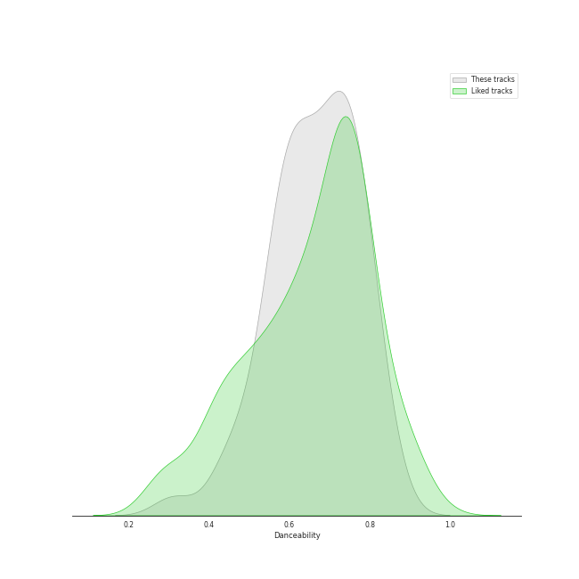
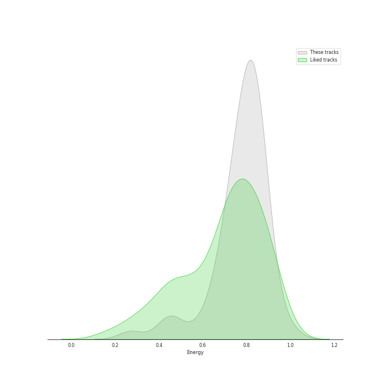
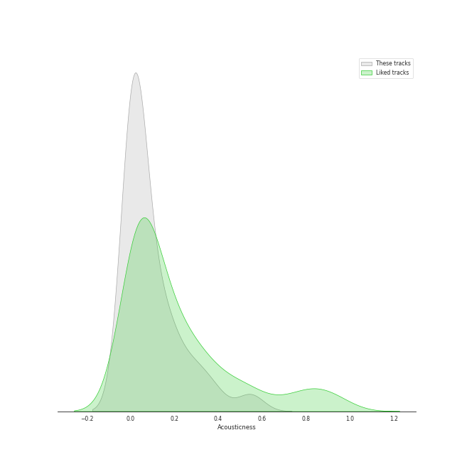
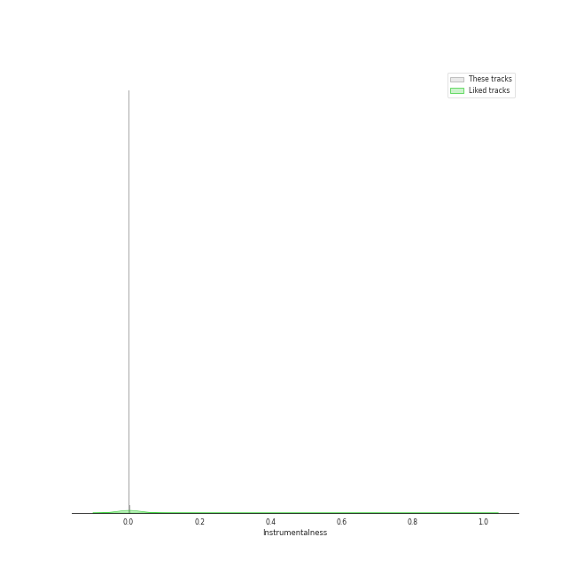
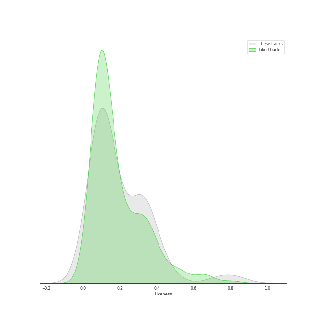
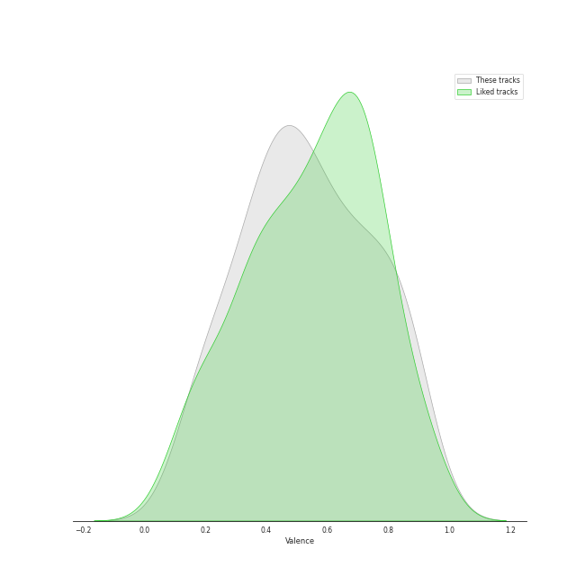
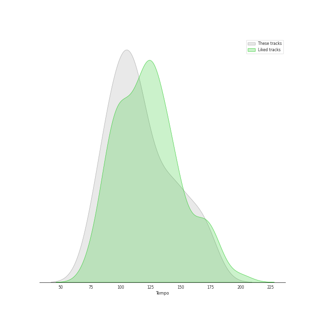

# Track Features for BIGHIT MUSIC

## Danceability

| ​ | 10 most Danceable tracks | ​​ | 10 least Danceable tracks |
|:---|:---|:---|:---|
|  | 3D (feat. Jack Harlow) (0.853) |  | AMYGDALA (0.311) |
|  | Still Life (with Anderson .Paak) (0.831) |  | No More Dream (0.436) |
|  | Chicken Noodle Soup (feat. Becky G) (0.826) |  | Butterfly (0.439) |
|  | Anpanman (0.813) |  | Wild Flower (with youjeen) (0.486) |
|  | Seven (feat. Latto) (Explicit Ver.) (0.79) |  | Boy in Luv (0.491) |
|  | Telepathy (0.787) |  | Still With You (0.529) |
|  | Pandora's Box (0.785) |  | Spring Day (0.539) |
|  | MORE (0.783) |  | Lie (0.541) |
|  | Filter (0.779) |  | FAKE LOVE (0.557) |
|  | Singularity (0.775) |  | Life Goes On (0.566) |

## Energy

| ​ | 10 most Energetic tracks | ​​ | 10 least Energetic tracks |
|:---|:---|:---|:---|
|  | War of Hormone (0.993) |  | Singularity (0.272) |
|  | Boy in Luv (0.947) |  | The Truth Untold (feat. Steve Aoki) (0.422) |
|  | Dope (0.896) |  | Butter (0.459) |
|  | MIC Drop (0.889) |  | Still With You (0.469) |
|  | Blood Sweat & Tears (0.885) |  | People Pt.2 (feat. IU) (0.574) |
|  | Anpanman (0.876) |  | Masquerade (Korean Ver.) (0.63) |
|  | Dynamite - Holiday Remix (0.873) |  | Strange (feat. RM) (0.662) |
|  | No More Dream (0.869) |  | Telepathy (0.669) |
|  | Danger (0.868) |  | Masquerade (English Ver.) (0.679) |
|  | Boy With Luv (feat. Halsey) (0.862) |  | People (0.682) |

## Speechiness

| ​ | 10 most Speechy tracks | ​​ | 10 least Speechy tracks |
|:---|:---|:---|:---|
|  | No More Dream (0.472) |  | Lie (0.033) |
|  | Boy in Luv (0.306) |  | Airplane pt.2 (0.0339) |
|  | Haegeum (0.304) |  | Spring Day (0.0354) |
|  | War of Hormone (0.24) |  | MORE (0.0357) |
|  | Dope (0.225) |  | Still With You (0.0358) |
|  | Moonlight (0.225) |  | People (0.0371) |
|  | Strange (feat. RM) (0.203) |  | FAKE LOVE (0.0371) |
|  | MIC Drop (Steve Aoki Remix) - Full Length Edition (0.183) |  | Like Crazy (0.0419) |
|  | Pandora's Box (0.178) |  | The Truth Untold (feat. Steve Aoki) (0.0422) |
|  | Run BTS (0.168) |  | Life Goes On (0.0424) |

## Acousticness

| ​ | 10 most Acoustic tracks | ​​ | 10 least Acoustic tracks |
|:---|:---|:---|:---|
|  | Singularity (0.56) |  | Danger (0.000907) |
|  | on the street (with J. Cole) (0.532) |  | Butter (Holiday Remix) (0.00188) |
|  | People Pt.2 (feat. IU) (0.391) |  | Strange (feat. RM) (0.00236) |
|  | The Truth Untold (feat. Steve Aoki) (0.374) |  | Like Crazy (0.0025) |
|  | Haegeum (0.313) |  | Boy in Luv (0.00261) |
|  | Seven (feat. Latto) (Explicit Ver.) (0.312) |  | FAKE LOVE (0.00267) |
|  | Still Life (with Anderson .Paak) (0.277) |  | Butter (0.00323) |
|  | Moonlight (0.273) |  | Lie (0.00338) |
|  | Like (0.271) |  | IDOL (0.00481) |
|  | AMYGDALA (0.226) |  | Chicken Noodle Soup (feat. Becky G) (0.00502) |

## Instrumentalness

| ​ | 10 most Instrumental tracks | ​​ | 10 least Instrumental tracks |
|:---|:---|:---|:---|
|  | Singularity (0.00278) |  | Moonlight (0.0) |
|  | MORE (0.00209) |  | ON (0.0) |
|  | on the street (with J. Cole) (0.00111) |  | Mikrokosmos (0.0) |
|  | Danger (0.000215) |  | Wild Flower (with youjeen) (0.0) |
|  | Airplane pt.2 (0.000103) |  | Like (0.0) |
|  | Still With You (1.53e-05) |  | Daechwita (0.0) |
|  | Chicken Noodle Soup (feat. Becky G) (1.09e-05) |  | IDOL (0.0) |
|  | = (Equal Sign) (5.44e-06) |  | Set Me Free Pt.2 (0.0) |
|  | Burn It (feat. MAX) (2.1e-06) |  | Lie (0.0) |
|  | Spring Day (1.71e-06) |  | Black Swan (0.0) |

## Liveness

| ​ | 10 most Live tracks | ​​ | 10 least Live tracks |
|:---|:---|:---|:---|
|  | Still With You (0.831) |  | Run BTS (0.0358) |
|  | No More Dream (0.494) |  | Still Life (with Anderson .Paak) (0.0403) |
|  | Haegeum (0.471) |  | Mikrokosmos (0.0502) |
|  | Life Goes On (0.37) |  | UGH! (0.0509) |
|  | Like Crazy (0.357) |  | Dynamite - Holiday Remix (0.0526) |
|  | Blood Sweat & Tears (0.357) |  | Moonlight (0.059) |
|  | Dope (0.352) |  | DNA (0.0677) |
|  | = (Equal Sign) (0.348) |  | Yes or No (0.0748) |
|  | Boy in Luv (0.34) |  | Snooze (feat. Ryuichi Sakamoto, WOOSUNG of The Rose) (0.0771) |
|  | Standing Next to You (0.339) |  | Save Me (0.0783) |

## Valence

| ​ | 10 most Happy tracks | ​​ | 10 least Happy tracks |
|:---|:---|:---|:---|
|  | 3D (feat. Jack Harlow) (0.888) |  | AMYGDALA (0.16) |
|  | Yes or No (0.882) |  | Chicken Noodle Soup (feat. Becky G) (0.168) |
|  | Seven (feat. Latto) (Explicit Ver.) (0.872) |  | The Truth Untold (feat. Steve Aoki) (0.169) |
|  | Butter (Holiday Remix) (0.87) |  | Singularity (0.198) |
|  | Airplane pt.2 (0.866) |  | Strange (feat. RM) (0.207) |
|  | Filter (0.859) |  | Daechwita (0.223) |
|  | Haegeum (0.831) |  | Pandora's Box (0.228) |
|  | Standing Next to You (0.816) |  | Butterfly (0.275) |
|  | on the street (with J. Cole) (0.813) |  | MORE (0.306) |
|  | Boy With Luv (feat. Halsey) (0.803) |  | UGH! (0.333) |

## Tempo

| ​ | 10 most Fast tracks | ​​ | 10 least Fast tracks |
|:---|:---|:---|:---|
|  | Mikrokosmos (174.043) |  | Run BTS (77.004) |
|  | MIC Drop (Steve Aoki Remix) - Full Length Edition (170.01) |  | FAKE LOVE (77.502) |
|  | MIC Drop (169.959) |  | AMYGDALA (78.265) |
|  | No More Dream (167.766) |  | Life Goes On (81.068) |
|  | Boy in Luv (166.236) |  | Yes or No (83.845) |
|  | UGH! (165.996) |  | Haegeum (85.097) |
|  | Wild Flower (with youjeen) (154.992) |  | Still With You (87.864) |
|  | Dope (153.991) |  | People Pt.2 (feat. IU) (88.94) |
|  | Butterfly (149.786) |  | Snooze (feat. Ryuichi Sakamoto, WOOSUNG of The Rose) (89.959) |
|  | Black Swan (147.024) |  | Strange (feat. RM) (90.008) |
