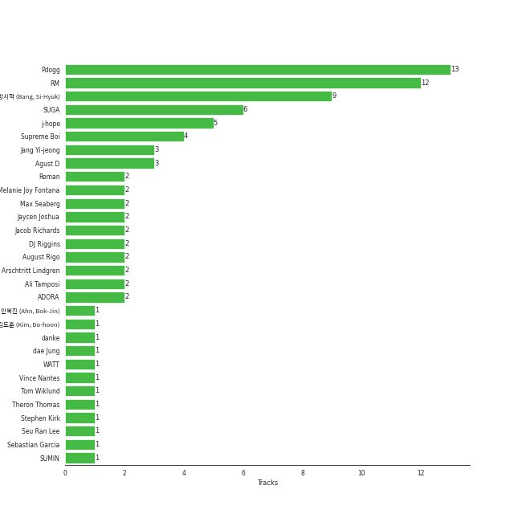

# BIGHIT MUSIC

59 songs

[See Track Features](audio_features.md)

[See Clusters](clusters/overview.md)

Appears as:
- BIGHIT MUSIC (57 tracks)
- BIGHIT MUSIC / HYBE (2 tracks)

## Top Artists

| Art | Rank | Tracks | 💚 | Artist | 🔗 |
|:---|---:|---:|---:|:---|:---|
|  | 25 | 34 | 22 | [BTS](../../artists/bts/overview.md) | [🔗](https://open.spotify.com/artist/3Nrfpe0tUJi4K4DXYWgMUX) |
|  | 83 | 9 | 5 | [Agust D](../../artists/agust_d/overview.md) | [🔗](https://open.spotify.com/artist/5RmQ8k4l3HZ8JoPb4mNsML) |
|  | 400 | 5 | 5 | [j-hope](../../artists/j-hope/overview.md) | [🔗](https://open.spotify.com/artist/0b1sIQumIAsNbqAoIClSpy) |
|  | 133 | 5 | 4 | Jung Kook | [🔗](https://open.spotify.com/artist/6HaGTQPmzraVmaVxvz6EUc) |
|  | 400 | 3 | 2 | RM | [🔗](https://open.spotify.com/artist/2auC28zjQyVTsiZKNgPRGs) |
|  | 176 | 2 | 2 | Jimin | [🔗](https://open.spotify.com/artist/1oSPZhvZMIrWW5I41kPkkY) |
|  | 400 | 1 | 1 | J. Cole | [🔗](https://open.spotify.com/artist/6l3HvQ5sa6mXTsMTB19rO5) |
|  | 349 | 1 | 1 | WOOSUNG | [🔗](https://open.spotify.com/artist/5LHu1iF8m0XtRBEJbbwSoo) |
|  | 400 | 1 | 1 | Youjeen | [🔗](https://open.spotify.com/artist/4wVcCedmr7FHtUlFnIeJIG) |
|  | 400 | 1 | 1 | Becky G | [🔗](https://open.spotify.com/artist/4obzFoKoKRHIphyHzJ35G3) |

See all 19 artists

| Art | Rank | Tracks | 💚 | Artist | 🔗 |
|:---|---:|---:|---:|:---|:---|
|  | 400 | 1 | 1 | Anderson .Paak | [🔗](https://open.spotify.com/artist/3jK9MiCrA42lLAdMGUZpwa) |
|  | 400 | 1 | 1 | Latto | [🔗](https://open.spotify.com/artist/3MdXrJWsbVzdn6fe5JYkSQ) |
|  | 4 | 1 | 1 | [IU](../../artists/iu/overview.md) | [🔗](https://open.spotify.com/artist/3HqSLMAZ3g3d5poNaI7GOU) |
|  | 400 | 1 | 1 | Jack Harlow | [🔗](https://open.spotify.com/artist/2LIk90788K0zvyj2JJVwkJ) |
|  | 348 | 1 | 1 | Ryuichi Sakamoto | [🔗](https://open.spotify.com/artist/1tcgfoMTT1szjUeaikxRjA) |
|  | 400 | 1 | 1 | MAX | [🔗](https://open.spotify.com/artist/1bqxdqvUtPWZri43cKHac8) |
|  | 400 | 2 | 0 | Steve Aoki | [🔗](https://open.spotify.com/artist/77AiFEVeAVj2ORpC85QVJs) |
|  | 319 | 2 | 0 | MIDNATT | [🔗](https://open.spotify.com/artist/1gfsloydrPP6CvkltAHUTd) |
|  | 310 | 1 | 0 | Halsey | [🔗](https://open.spotify.com/artist/26VFTg2z8YR0cCuwLzESi2) |

## Top Albums

| Art | Rank | Tracks | 💚 | Album | Release Date | 🔗 |
|:---|---:|---:|---:|:---|:---|:---|
|  | 581 | 5 | 3 | D-2 | 2020-05-22 | [🔗](https://open.spotify.com/album/1Pp8t7yn2E3rz3R7ZqPn1O) |
|  | 581 | 4 | 3 | MAP OF THE SOUL : 7 | 2020-02-21 | [🔗](https://open.spotify.com/album/5W1XY5ucNATjTULERvXx9j) |
|  | 581 | 4 | 3 | Love Yourself 轉 'Tear' | 2018-05-18 | [🔗](https://open.spotify.com/album/4NIqCxqP9o8Tp6tGLBqd8O) |
|  | 380 | 4 | 3 | GOLDEN | 2023-11-03 | [🔗](https://open.spotify.com/album/5pSk3c3wVwnb2arb6ohCPU) |
|  | 261 | 4 | 2 | D-DAY | 2023-04-21 | [🔗](https://open.spotify.com/album/446ROKmKfpEwkbi2SjELVX) |
|  | 581 | 3 | 3 | Jack In The Box | 2022-07-15 | [🔗](https://open.spotify.com/album/0FrC9lzgVhziJenigsrXdl) |
|  | 581 | 3 | 3 | BE | 2020-11-20 | [🔗](https://open.spotify.com/album/6nYfHQnvkvOTNHnOhDT3sr) |
|  | 581 | 3 | 2 | The Most Beautiful Moment in Life: Young Forever | 2016-05-02 | [🔗](https://open.spotify.com/album/1k5bJ8l5oL5xxVBVHjil09) |
|  | 486 | 3 | 2 | Love Yourself 結 'Answer' | 2018-08-24 | [🔗](https://open.spotify.com/album/43wFM1HquliY3iwKWzPN4y) |
|  | 376 | 3 | 2 | Love Yourself 承 'Her' | 2017-09-18 | [🔗](https://open.spotify.com/album/07Rq17GzCnIdWJcyVHb57G) |

See all 25 albums

| Art | Rank | Tracks | 💚 | Album | Release Date | 🔗 |
|:---|---:|---:|---:|:---|:---|:---|
|  | 581 | 3 | 1 | MAP OF THE SOUL : PERSONA | 2019-04-12 | [🔗](https://open.spotify.com/album/2KqlAl1Kl5fZvbFgJ0qFB6) |
|  | 581 | 2 | 2 | Wings | 2016-10-10 | [🔗](https://open.spotify.com/album/1vhNGBTFoaSTLbHjPGFIlF) |
|  | 446 | 2 | 2 | Proof | 2022-06-10 | [🔗](https://open.spotify.com/album/6al2VdKbb6FIz9d7lU7WRB) |
|  | 581 | 2 | 2 | Indigo | 2022-12-02 | [🔗](https://open.spotify.com/album/2wGinO7YWLHN2sULIr4a7v) |
|  | 370 | 2 | 2 | FACE | 2023-03-24 | [🔗](https://open.spotify.com/album/4xc3Lc9yASZgEJGH7acWMB) |
|  | 400 | 2 | 0 | Masquerade | 2023-05-15 | [🔗](https://open.spotify.com/album/65eQsZ1Wq51wjJk2DNH4nm) |
|  | 581 | 2 | 0 | Dark & Wild | 2014-08-20 | [🔗](https://open.spotify.com/album/35voVqYGkotyJ945O9egDY) |
|  | 581 | 1 | 1 | on the street (with J. Cole) | 2023-03-03 | [🔗](https://open.spotify.com/album/70xdtgH5XuYTqBNdNbUwGO) |
|  | 581 | 1 | 1 | You Never Walk Alone | 2017-02-13 | [🔗](https://open.spotify.com/album/6THpewjqJ15ORBJkh5CEYb) |
|  | 581 | 1 | 1 | Still With You | 2020-06-05 | [🔗](https://open.spotify.com/album/0i3baFZqWSrjjgTWrhKunB) |
|  | 581 | 1 | 1 | Skool Luv Affair | 2014-02-12 | [🔗](https://open.spotify.com/album/5r35iS0uSSoQBKzQj0IeI3) |
|  | 581 | 1 | 1 | Chicken Noodle Soup (feat. Becky G) | 2019-09-27 | [🔗](https://open.spotify.com/album/76IRLp7YzBVLKsat6Ro9ae) |
|  | 581 | 1 | 0 | Dynamite (Holiday Remix) | 2020-12-11 | [🔗](https://open.spotify.com/album/3HVNK5OxW9qfkySXjHWehH) |
|  | 285 | 1 | 0 | Butter (Holiday Remix) | 2021-12-03 | [🔗](https://open.spotify.com/album/4cmHvSMDrSRe2sLodew8sV) |
|  | 581 | 1 | 0 | 2 Cool 4 Skool | 2013-06-12 | [🔗](https://open.spotify.com/album/6egaEe9JaULuUCkihSnYlH) |

## Genres

| Tracks | 💚 | Genre |
|---:|---:|:---|
| 46 | 33 | [k-pop](../../genres/k-pop/overview.md) |
| 34 | 22 | [pop](../../genres/pop/overview.md) |
| 34 | 22 | [k-pop boy group](../../genres/k-pop_boy_group/overview.md) |
| 16 | 12 | [k-rap](../../genres/k-rap/overview.md) |

## Top Producers

| Art | Producer | Tracks | Credit Types |
|:---|:---|---:|:---|
|  | RM | 11 | Songwriter, Arranger, Producer, Lyricist |
| | [Pdogg](../../producers/pdogg/overview.md) | 11 | Producer, Songwriter, Arranger |
| | [방시혁 (Bang, Si-Hyuk)](../../producers/방시혁_(bang,_si-hyuk)/overview.md) | 8 | Songwriter |
|  | SUGA | 6 | Songwriter |
|  | [j-hope](../../artists/j-hope/overview.md) | 4 | Songwriter |
| | [Supreme Boi](../../producers/supreme_boi/overview.md) | 3 | Songwriter |
| | Ali Tamposi | 2 | Songwriter |
| | Melanie Joy Fontana | 2 | Songwriter |
| | Jaycen Joshua | 2 | Producer |
| | Max Seaberg | 2 | Producer |

View all

| Art | Producer | Tracks | Credit Types |
|:---|:---|---:|:---|
| | Jang Yi-jeong | 2 | Producer |
| | DJ Riggins | 2 | Producer |
| | [Arschtritt Lindgren](../../producers/arschtritt_lindgren/overview.md) | 2 | Songwriter |
|  | ADORA | 2 | Producer |
| | Jacob Richards | 2 | Producer |
| | Roman | 2 | Songwriter |
| | August Rigo | 2 | Songwriter |
| | Jenna Andrews | 1 | Songwriter |
| | Arcades | 1 | Producer |
| | Frants | 1 | Producer |
| | Charlie J. Perry | 1 | Producer, Songwriter |
| | Julia Ross | 1 | Songwriter |
| | WATT | 1 | Lyricist, Producer, Songwriter |
| | Krysta Youngs | 1 | Songwriter |
| | Camilla Anne Stewart | 1 | Songwriter |
| | Erik Reichers | 1 | Producer |
| | Hiss noise | 1 | Producer |
|  | Jimin | 1 | Songwriter |
| | Hilda Stenmalm | 1 | Songwriter |
| | Ryan Lawrie | 1 | Songwriter |
| | DJ Swivel | 1 | Producer, Songwriter |
|  | SUMIN | 1 | Songwriter |
| | Lutra | 1 | Songwriter |
| | [Phil Tan](../../producers/phil_tan/overview.md) | 1 | Producer |
| | Antonina Armato | 1 | Songwriter |
| | Clyde Kelly | 1 | Songwriter |
| | Matt Thomson | 1 | Songwriter |
| | dae Jung | 1 | Songwriter |
| | Kass | 1 | Songwriter |
| | DOCSKIM | 1 | Songwriter |
| | Marcus McCoan | 1 | Producer, Songwriter |
| | Max Graham | 1 | Songwriter |
| | Jessica Agombar | 1 | Songwriter |
| | Alex Bilowitz | 1 | Songwriter |
| | Sebastian Garcia | 1 | Songwriter |
| | [danke](../../producers/danke/overview.md) | 1 | Songwriter |
| | Alex Williams | 1 | Producer |
| | Candace Sosa | 1 | Songwriter |
| | David Stewart | 1 | Songwriter |
| | Fallin' Dild | 1 | Songwriter |
| | Vince Nantes | 1 | Songwriter |
|  | Latto | 1 | Lyricist, Songwriter |
| | [김도훈 (Kim, Do-hoon)](../../producers/김도훈_(kim,_do-hoon)/overview.md) | 1 | Songwriter |
| | Jon Bellion | 1 | Lyricist, Songwriter |
| | Neon Boy | 1 | Songwriter |
| | Liza Owen | 1 | Songwriter |
| | Stephen Kirk | 1 | Songwriter |
| | Jinbo | 1 | Songwriter |
| | [Cirkut](../../producers/cirkut/overview.md) | 1 | Lyricist, Producer, Songwriter |
| | 안복진 (Ahn, Bok-Jin) | 1 | Songwriter |
| | Tom Wiklund | 1 | Producer, Songwriter |
| | Theron Thomas | 1 | Lyricist, Songwriter |
| | Bill Zimmerman | 1 | Producer |
| | Ron Perry | 1 | Songwriter |
| | Rob Grimaldi | 1 | Songwriter |
| | Seu Ran Lee | 1 | Songwriter |

## Tracks released under BIGHIT MUSIC

| Art | Track | Album | Artists | Label | Rank | 💚 | 🔗 |
|:---|:---|:---|:---|:---|---:|:---|:---|
|  | Butter (Holiday Remix) | Butter (Holiday Remix) | [BTS](../../artists/bts/overview.md) | [BIGHIT MUSIC](.) | 387 | | [🔗](https://open.spotify.com/track/3IA9LkBEVhJDOxOnh1nf8a) |
|  | AMYGDALA | D-DAY | [Agust D](../../artists/agust_d/overview.md) | [BIGHIT MUSIC](.) | 420 | | [🔗](https://open.spotify.com/track/5fj32MKLHkut2Vod1UodcU) |
|  | Set Me Free Pt.2 | FACE | Jimin | [BIGHIT MUSIC](.) | 543 | 💚 | [🔗](https://open.spotify.com/track/1fpj1CJPxY3YvN3AMAEYvt) |
|  | DNA | Love Yourself 承 'Her' | [BTS](../../artists/bts/overview.md) | [BIGHIT MUSIC](.) | 556 | 💚 | [🔗](https://open.spotify.com/track/3uRLwBjI2TahxslcMTvpFs) |
|  | Standing Next to You | GOLDEN | Jung Kook | [BIGHIT MUSIC](.) | 562 | 💚 | [🔗](https://open.spotify.com/track/2KslE17cAJNHTsI2MI0jb2) |
|  | Masquerade (English Ver.) | Masquerade | MIDNATT | [BIGHIT MUSIC](.) | 590 | | [🔗](https://open.spotify.com/track/3Fqa3X4hbk54twe1ccbt1l) |
|  | Run BTS | Proof | [BTS](../../artists/bts/overview.md) | [BIGHIT MUSIC](.) | 660 | 💚 | [🔗](https://open.spotify.com/track/69xohKu8C1fsflYAiSNbwM) |
|  | People Pt.2 (feat. IU) | D-DAY | [Agust D](../../artists/agust_d/overview.md), [IU](../../artists/iu/overview.md) | [BIGHIT MUSIC](.) | 668 | 💚 | [🔗](https://open.spotify.com/track/41JPN7pZMTp1sumBOHOzHd) |
|  | Snooze (feat. Ryuichi Sakamoto, WOOSUNG of The Rose) | D-DAY | [Agust D](../../artists/agust_d/overview.md), Ryuichi Sakamoto, WOOSUNG | [BIGHIT MUSIC](.) | 719 | 💚 | [🔗](https://open.spotify.com/track/4j3M8NrbGSXdMPwEVsnfHE) |
|  | Singularity | Love Yourself 結 'Answer' | [BTS](../../artists/bts/overview.md) | [BIGHIT MUSIC](.) | 723 | 💚 | [🔗](https://open.spotify.com/track/2ApfJvLr7RbhJl6NOVhEu6) |

See all tracks

| Art | Track | Album | Artists | Label | Rank | 💚 | 🔗 |
|:---|:---|:---|:---|:---|---:|:---|:---|
|  | No More Dream | 2 Cool 4 Skool | [BTS](../../artists/bts/overview.md) | [BIGHIT MUSIC](.) | 868 | | [🔗](https://open.spotify.com/track/089PFeXotzDLNQz9NCk6pF) |
|  | Boy in Luv | Skool Luv Affair | [BTS](../../artists/bts/overview.md) | [BIGHIT MUSIC](.) | 868 | 💚 | [🔗](https://open.spotify.com/track/3FnDv33WrrMtuEr7hNR3ev) |
|  | Danger | Dark & Wild | [BTS](../../artists/bts/overview.md) | [BIGHIT MUSIC](.) | 868 | | [🔗](https://open.spotify.com/track/0zzRxtfO5FGxKdqq4OKmlw) |
|  | War of Hormone | Dark & Wild | [BTS](../../artists/bts/overview.md) | [BIGHIT MUSIC](.) | 868 | | [🔗](https://open.spotify.com/track/29SjtKzBoJDgyIBusHylIS) |
|  | Butterfly | The Most Beautiful Moment in Life: Young Forever | [BTS](../../artists/bts/overview.md) | [BIGHIT MUSIC](.) | 868 | 💚 | [🔗](https://open.spotify.com/track/2QP1vvLPtAVOVAFabpqypA) |
|  | Dope | The Most Beautiful Moment in Life: Young Forever | [BTS](../../artists/bts/overview.md) | [BIGHIT MUSIC](.) | 868 | 💚 | [🔗](https://open.spotify.com/track/4o3Ao6wY5fbJR32fQKabfQ) |
|  | Save Me | The Most Beautiful Moment in Life: Young Forever | [BTS](../../artists/bts/overview.md) | [BIGHIT MUSIC](.) | 868 | | [🔗](https://open.spotify.com/track/7bxGcILuAjkZzaveU28ZJS) |
|  | Blood Sweat & Tears | Wings | [BTS](../../artists/bts/overview.md) | [BIGHIT MUSIC](.) | 868 | 💚 | [🔗](https://open.spotify.com/track/2u54HNQamwFuOMLSuhSRom) |
|  | Lie | Wings | [BTS](../../artists/bts/overview.md) | [BIGHIT MUSIC](.) | 868 | 💚 | [🔗](https://open.spotify.com/track/1nWB8isqs2tviWk20G5pow) |
|  | Spring Day | You Never Walk Alone | [BTS](../../artists/bts/overview.md) | [BIGHIT MUSIC](.) | 868 | 💚 | [🔗](https://open.spotify.com/track/2j1fFjWHCI9KJSwcuYAOyF) |
|  | MIC Drop | Love Yourself 承 'Her' | [BTS](../../artists/bts/overview.md) | [BIGHIT MUSIC](.) | 868 | 💚 | [🔗](https://open.spotify.com/track/4gZGAVECoiutzp64KSHNjE) |
|  | dimple | Love Yourself 承 'Her' | [BTS](../../artists/bts/overview.md) | [BIGHIT MUSIC](.) | 868 | | [🔗](https://open.spotify.com/track/6pp6xf9zS55GD4nr318XUH) |
|  | Airplane pt.2 | Love Yourself 轉 'Tear' | [BTS](../../artists/bts/overview.md) | [BIGHIT MUSIC](.) | 868 | 💚 | [🔗](https://open.spotify.com/track/4lAE47gj539h8R1yxPhhGG) |
|  | Anpanman | Love Yourself 轉 'Tear' | [BTS](../../artists/bts/overview.md) | [BIGHIT MUSIC](.) | 868 | 💚 | [🔗](https://open.spotify.com/track/34OSqW5ULWxmCEMjJ1ZgVW) |
|  | FAKE LOVE | Love Yourself 轉 'Tear' | [BTS](../../artists/bts/overview.md) | [BIGHIT MUSIC](.) | 868 | 💚 | [🔗](https://open.spotify.com/track/6m1TWFMeon7ai9XLOzdbiR) |
|  | The Truth Untold (feat. Steve Aoki) | Love Yourself 轉 'Tear' | [BTS](../../artists/bts/overview.md), Steve Aoki | [BIGHIT MUSIC](.) | 868 | | [🔗](https://open.spotify.com/track/7DEKa5Z7Cl8s3Y7imb88OM) |
|  | IDOL | Love Yourself 結 'Answer' | [BTS](../../artists/bts/overview.md) | [BIGHIT MUSIC](.) | 868 | 💚 | [🔗](https://open.spotify.com/track/1e8J3XClxZbFmvIHLI8CE4) |
|  | MIC Drop (Steve Aoki Remix) (Full Length Edition) | Love Yourself 結 'Answer' | [BTS](../../artists/bts/overview.md), Steve Aoki | [BIGHIT MUSIC](.) | 868 | | [🔗](https://open.spotify.com/track/01380RE6UfsPSdiUIwrCoH) |
|  | Boy With Luv (feat. Halsey) | MAP OF THE SOUL : PERSONA | [BTS](../../artists/bts/overview.md), Halsey | [BIGHIT MUSIC](.) | 868 | | [🔗](https://open.spotify.com/track/4a9tbd947vo9K8Vti9JwcI) |
|  | HOME | MAP OF THE SOUL : PERSONA | [BTS](../../artists/bts/overview.md) | [BIGHIT MUSIC](.) | 868 | | [🔗](https://open.spotify.com/track/6Yc3tjFCVR2bfAQFRTZBef) |
|  | Mikrokosmos | MAP OF THE SOUL : PERSONA | [BTS](../../artists/bts/overview.md) | [BIGHIT MUSIC](.) | 868 | 💚 | [🔗](https://open.spotify.com/track/0jSccBRnhNU4KtACMQPvco) |
|  | Chicken Noodle Soup (feat. Becky G) | Chicken Noodle Soup (feat. Becky G) | [j-hope](../../artists/j-hope/overview.md), Becky G | [BIGHIT MUSIC / HYBE](.) | 868 | 💚 | [🔗](https://open.spotify.com/track/6wyr4ReB05D9sJB1Rsmcqo) |
|  | Black Swan | MAP OF THE SOUL : 7 | [BTS](../../artists/bts/overview.md) | [BIGHIT MUSIC](.) | 868 | 💚 | [🔗](https://open.spotify.com/track/2EmcTFQ1rM11wp2ztsXTHa) |
|  | Filter | MAP OF THE SOUL : 7 | [BTS](../../artists/bts/overview.md) | [BIGHIT MUSIC](.) | 868 | 💚 | [🔗](https://open.spotify.com/track/4bZZVcgWWMWPBwzTTp642w) |
|  | ON | MAP OF THE SOUL : 7 | [BTS](../../artists/bts/overview.md) | [BIGHIT MUSIC](.) | 868 | 💚 | [🔗](https://open.spotify.com/track/0fZRNhPJ4AGmwY7rkpdbqK) |
|  | UGH! | MAP OF THE SOUL : 7 | [BTS](../../artists/bts/overview.md) | [BIGHIT MUSIC](.) | 868 | | [🔗](https://open.spotify.com/track/2QZe2H1f03t5PJWEMg2Mbe) |
|  | Burn It (feat. MAX) | D-2 | [Agust D](../../artists/agust_d/overview.md), MAX | [BIGHIT MUSIC](.) | 868 | 💚 | [🔗](https://open.spotify.com/track/38iufYNK4hUzS649Oe2kZy) |
|  | Daechwita | D-2 | [Agust D](../../artists/agust_d/overview.md) | [BIGHIT MUSIC](.) | 868 | 💚 | [🔗](https://open.spotify.com/track/1Y7AZ3akqDipAyo6mmOQTy) |
|  | Moonlight | D-2 | [Agust D](../../artists/agust_d/overview.md) | [BIGHIT MUSIC](.) | 868 | | [🔗](https://open.spotify.com/track/057xGYST5exVyNevufrioZ) |
|  | People | D-2 | [Agust D](../../artists/agust_d/overview.md) | [BIGHIT MUSIC](.) | 868 | 💚 | [🔗](https://open.spotify.com/track/4wDSEE082RPcnhXzPzFhCp) |
|  | Strange (feat. RM) | D-2 | [Agust D](../../artists/agust_d/overview.md), RM | [BIGHIT MUSIC](.) | 868 | | [🔗](https://open.spotify.com/track/6x2arhzc99oGlqM82V0mnd) |
|  | Still With You | Still With You | Jung Kook | [BIGHIT MUSIC](.) | 868 | 💚 | [🔗](https://open.spotify.com/track/0eFMbKCRw8KByXyWBw8WO7) |
|  | Dynamite | BE | [BTS](../../artists/bts/overview.md) | [BIGHIT MUSIC](.) | 868 | 💚 | [🔗](https://open.spotify.com/track/5QDLhrAOJJdNAmCTJ8xMyW) |
|  | Life Goes On | BE | [BTS](../../artists/bts/overview.md) | [BIGHIT MUSIC](.) | 868 | 💚 | [🔗](https://open.spotify.com/track/5FVbvttjEvQ8r2BgUcJgNg) |
|  | Telepathy | BE | [BTS](../../artists/bts/overview.md) | [BIGHIT MUSIC](.) | 868 | 💚 | [🔗](https://open.spotify.com/track/6Fnvi5QnVkTskSzeRvvQds) |
|  | Dynamite - Holiday Remix | Dynamite (Holiday Remix) | [BTS](../../artists/bts/overview.md) | [BIGHIT MUSIC / HYBE](.) | 868 | | [🔗](https://open.spotify.com/track/6SM3TJaWkmT8Iq8l9J0BIS) |
|  | Butter | Proof | [BTS](../../artists/bts/overview.md) | [BIGHIT MUSIC](.) | 868 | 💚 | [🔗](https://open.spotify.com/track/6jjYDGxVJsWS0a5wlVF5vS) |
|  | = (Equal Sign) | Jack In The Box | [j-hope](../../artists/j-hope/overview.md) | [BIGHIT MUSIC](.) | 868 | 💚 | [🔗](https://open.spotify.com/track/70XnKsO3UnIT4FnEwChQXx) |
|  | MORE | Jack In The Box | [j-hope](../../artists/j-hope/overview.md) | [BIGHIT MUSIC](.) | 868 | 💚 | [🔗](https://open.spotify.com/track/7GARzfC1mwhDuk4t9WOACq) |
|  | Pandora's Box | Jack In The Box | [j-hope](../../artists/j-hope/overview.md) | [BIGHIT MUSIC](.) | 868 | 💚 | [🔗](https://open.spotify.com/track/2On611HXKQAbaYkuc4NQAm) |
|  | Still Life (with Anderson .Paak) | Indigo | RM, Anderson .Paak | [BIGHIT MUSIC](.) | 868 | 💚 | [🔗](https://open.spotify.com/track/3p4N6mBFv42M8dI8SUoPre) |
|  | Wild Flower (with youjeen) | Indigo | RM, Youjeen | [BIGHIT MUSIC](.) | 868 | 💚 | [🔗](https://open.spotify.com/track/1AZjCZSGEjlxUufFQwSszF) |
|  | on the street (with J. Cole) | on the street (with J. Cole) | [j-hope](../../artists/j-hope/overview.md), J. Cole | [BIGHIT MUSIC](.) | 868 | 💚 | [🔗](https://open.spotify.com/track/5wxYxygyHpbgv0EXZuqb9V) |
|  | Like Crazy | FACE | Jimin | [BIGHIT MUSIC](.) | 868 | 💚 | [🔗](https://open.spotify.com/track/3Ua0m0YmEjrMi9XErKcNiR) |
|  | Haegeum | D-DAY | [Agust D](../../artists/agust_d/overview.md) | [BIGHIT MUSIC](.) | 868 | | [🔗](https://open.spotify.com/track/4bjN59DRXFRxBE1g5ne6B1) |
|  | Masquerade (Korean Ver.) | Masquerade | MIDNATT | [BIGHIT MUSIC](.) | 868 | | [🔗](https://open.spotify.com/track/5PZA7uiIdIvRMTPftv0LF9) |
|  | 3D (feat. Jack Harlow) | GOLDEN | Jung Kook, Jack Harlow | [BIGHIT MUSIC](.) | 868 | 💚 | [🔗](https://open.spotify.com/track/6xGr4tVzpTX99p9Cf0hRRL) |
|  | Seven (feat. Latto) (Explicit Ver.) | GOLDEN | Jung Kook, Latto | [BIGHIT MUSIC](.) | 868 | 💚 | [🔗](https://open.spotify.com/track/2HRgqmZQC0MC7GeNuDIXHN) |
|  | Yes or No | GOLDEN | Jung Kook | [BIGHIT MUSIC](.) | 868 | | [🔗](https://open.spotify.com/track/2gkVEnpahpE3bQuvGuCpAV) |

