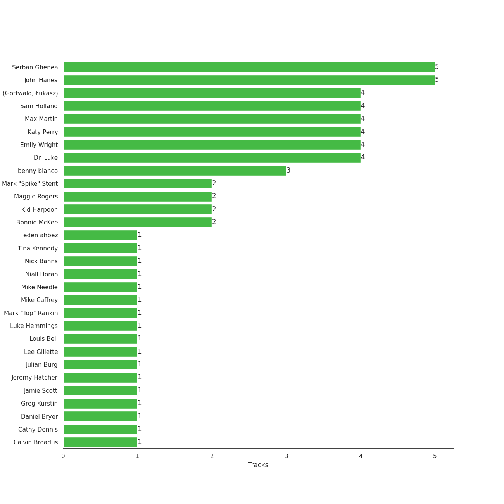

# Capitol Records

25 songs

[See Track Features](audio_features.md)

[See Clusters](clusters/overview.md)

Appears as:
- Capitol Records (22 tracks)
- SM Entertainment/Capitol Records (2 tracks)
- Capitol (1 tracks)

## Top Artists

| Art | Rank | Tracks | 💚 | Artist | 🔗 |
|:---|---:|---:|---:|:---|:---|
|  | 431 | 6 | 4 | Katy Perry | [🔗](https://open.spotify.com/artist/6jJ0s89eD6GaHleKKya26X) |
|  | 257 | 2 | 2 | SuperM | [🔗](https://open.spotify.com/artist/5BHFSMEjfLVx1JwRWjAOsE) |
|  | 431 | 2 | 2 | Maggie Rogers | [🔗](https://open.spotify.com/artist/4NZvixzsSefsNiIqXn0NDe) |
|  | 431 | 3 | 1 | Aslyn | [🔗](https://open.spotify.com/artist/6seR0G84QQq1NIW844E7Qq) |
|  | 342 | 2 | 1 | Halsey | [🔗](https://open.spotify.com/artist/26VFTg2z8YR0cCuwLzESi2) |
|  | 248 | 1 | 1 | Nat King Cole | [🔗](https://open.spotify.com/artist/7v4imS0moSyGdXyLgVTIV7) |
|  | 431 | 1 | 1 | Snoop Dogg | [🔗](https://open.spotify.com/artist/7hJcb9fa4alzcOq3EaNPoG) |
|  | 431 | 1 | 1 | 5 Seconds of Summer | [🔗](https://open.spotify.com/artist/5Rl15oVamLq7FbSb0NNBNy) |
|  | 27 | 1 | 1 | [BTS](../../artists/bts/overview.md) | [🔗](https://open.spotify.com/artist/3Nrfpe0tUJi4K4DXYWgMUX) |
|  | 431 | 1 | 1 | Niall Horan | [🔗](https://open.spotify.com/artist/1Hsdzj7Dlq2I7tHP7501T4) |

See all 16 artists

| Art | Rank | Tracks | 💚 | Artist | 🔗 |
|:---|---:|---:|---:|:---|:---|
|  | 339 | 1 | 1 | SUGA | [🔗](https://open.spotify.com/artist/0ebNdVaOfp6N0oZ1guIxM8) |
|  | 414 | 2 | 0 | Dean Martin | [🔗](https://open.spotify.com/artist/49e4v89VmlDcFCMyDv9wQ9) |
|  | 355 | 2 | 0 | [Frank Sinatra](../../artists/frank_sinatra/overview.md) | [🔗](https://open.spotify.com/artist/1Mxqyy3pSjf8kZZL4QVxS0) |
|  | 431 | 1 | 0 | Bonnie Raitt | [🔗](https://open.spotify.com/artist/4KDyYWR7IpxZ7xrdYbKrqY) |
|  | 431 | 1 | 0 | The Beach Boys | [🔗](https://open.spotify.com/artist/3oDbviiivRWhXwIE8hxkVV) |
|  | 431 | 1 | 0 | Katrina & The Waves | [🔗](https://open.spotify.com/artist/2TzHIUhVpeeDxyJPpQfnV3) |

## Top Albums

| Art | Rank | Tracks | 💚 | Album | Release Date | 🔗 |
|:---|---:|---:|---:|:---|:---|:---|
|  | 651 | 4 | 3 | Teenage Dream | 2010-01-01 | [🔗](https://open.spotify.com/album/3BoUxfC7YhxNq3TpOfnRif) |
|  | 651 | 3 | 1 | Lemon Love | 2005-01-01 | [🔗](https://open.spotify.com/album/5YToJrWwzdA6W2NxxDoteE) |
|  | 624 | 2 | 0 | A Winter Romance | 1959-01-01 | [🔗](https://open.spotify.com/album/5I48ENiZiaZZSOpec6PdS5) |
|  | 651 | 1 | 1 | Youngblood (Deluxe) | 2018-06-15 | [🔗](https://open.spotify.com/album/2D0Hi3Jj6RFnpWDcSa0Otu) |
|  | 651 | 1 | 1 | The Nat King Cole Story | 1961-09-25 | [🔗](https://open.spotify.com/album/3NoP1ifIejWkGSDsO9T2xH) |
|  | 651 | 1 | 1 | Surrender | 2022-07-29 | [🔗](https://open.spotify.com/album/2VeOtQQAJxR8VyvmoXqIbI) |
|  | 358 | 1 | 1 | SuperM - The 1st Mini Album | 2019-10-04 | [🔗](https://open.spotify.com/album/1C1qYeSC9RdgbrKXpZCTSJ) |
|  | 519 | 1 | 1 | Super One -The 1st Album | 2020-09-25 | [🔗](https://open.spotify.com/album/10fdwvVIpa0raPkZUTILAt) |
|  | 450 | 1 | 1 | SUGA's Interlude | 2019-12-06 | [🔗](https://open.spotify.com/album/0JfaSjTaej3QB27ofjnbQV) |
|  | 651 | 1 | 1 | Put A Little Love On Me | 2019-12-06 | [🔗](https://open.spotify.com/album/7dUgmUMDNnQAejhNLeIQWz) |

See all 19 albums

| Art | Rank | Tracks | 💚 | Album | Release Date | 🔗 |
|:---|---:|---:|---:|:---|:---|:---|
|  | 651 | 1 | 1 | One Of The Boys | 2008-06-17 | [🔗](https://open.spotify.com/album/5c6MKfLcLB17DlJlFtVmyc) |
|  | 651 | 1 | 1 | Heard It In A Past Life | 2019-01-18 | [🔗](https://open.spotify.com/album/5AHWNPo3gllDmixgAoFru4) |
|  | 651 | 1 | 0 | Teenage Dream: The Complete Confection | 2012-03-12 | [🔗](https://open.spotify.com/album/5BvgP623rtvlc0HDcpzquz) |
|  | 651 | 1 | 0 | Songs For Swingin' Lovers! (Remastered) | 1956-03 | [🔗](https://open.spotify.com/album/4kca7vXd1Wo5GE2DMafvMc) |
|  | 651 | 1 | 0 | Manic | 2020-01-17 | [🔗](https://open.spotify.com/album/68enXe5XcJdciSDAZr0Alr) |
|  | 651 | 1 | 0 | Luck Of The Draw | 1991-01-01 | [🔗](https://open.spotify.com/album/6blrkOZ0VmkhYPjfoD7eqf) |
|  | 651 | 1 | 0 | Katrina & The Waves | 1985 | [🔗](https://open.spotify.com/album/1UQG78YJjaBySRMh0A8Uw7) |
|  | 651 | 1 | 0 | Come Fly With Me (Expanded Edition) | 1958 | [🔗](https://open.spotify.com/album/66v9QmjAj0Wwhh2OpbU4BE) |
|  | 651 | 1 | 0 | 50 Big Ones: Greatest Hits | 2012-01-01 | [🔗](https://open.spotify.com/album/6cSZPNsr3tMEHo5QrMjk1F) |

## Genres

| Tracks | 💚 | Genre |
|---:|---:|:---|
| 10 | 7 | [pop](../../genres/pop/overview.md) |
| 2 | 2 | [k-pop](../../genres/k-pop/overview.md) |
| 2 | 2 | indie pop |
| 5 | 1 | [lounge](../../genres/lounge/overview.md) |
| 5 | 1 | easy listening |
| 5 | 1 | [adult standards](../../genres/adult_standards/overview.md) |
| 3 | 1 | [vocal jazz](../../genres/vocal_jazz/overview.md) |
| 3 | 1 | [acoustic pop](../../genres/acoustic_pop/overview.md) |
| 2 | 1 | indie poptimism |
| 2 | 1 | etherpop |

See all 27 genres

| Tracks | 💚 | Genre |
|---:|---:|:---|
| 2 | 1 | electropop |
| 1 | 1 | swing |
| 1 | 1 | [soul](../../genres/soul/overview.md) |
| 1 | 1 | boy band |
| 2 | 0 | [singer-songwriter](../../genres/singer-songwriter/overview.md) |
| 2 | 0 | [mellow gold](../../genres/mellow_gold/overview.md) |
| 2 | 0 | folk rock |
| 1 | 0 | sunshine pop |
| 1 | 0 | [soft rock](../../genres/soft_rock/overview.md) |
| 1 | 0 | [rock](../../genres/rock/overview.md) |
| 1 | 0 | [psychedelic rock](../../genres/psychedelic_rock/overview.md) |
| 1 | 0 | new wave pop |
| 1 | 0 | [folk](../../genres/folk/overview.md) |
| 1 | 0 | electric blues |
| 1 | 0 | country rock |
| 1 | 0 | [classic rock](../../genres/classic_rock/overview.md) |
| 1 | 0 | baroque pop |

## Top Producers

| Art | Producer | Tracks | Credit Types |
|:---|:---|---:|:---|
| | [John Hanes](../../producers/john_hanes/overview.md) | 5 | Producer |
| | [Serban Ghenea](../../producers/serban_ghenea/overview.md) | 5 | Producer |
| | Dr. Luke | 4 | Producer |
| | [Łukasz Gottwald (Gottwald, Łukasz)](../../producers/łukasz_gottwald_(gottwald,_łukasz)/overview.md) | 4 | Songwriter |
| | [Max Martin](../../producers/max_martin/overview.md) | 4 | Songwriter, Producer |
| | [Sam Holland](../../producers/sam_holland/overview.md) | 4 | Producer |
| | Emily Wright | 4 | Producer |
|  | Katy Perry | 4 | Songwriter |
|  | benny blanco | 3 | Producer, Songwriter |
| | [Mark "Spike" Stent](../../producers/mark__spike__stent/overview.md) | 2 | Producer |

View all

| Art | Producer | Tracks | Credit Types |
|:---|:---|---:|:---|
|  | Maggie Rogers | 2 | Lyricist, Producer, Songwriter |
| | Bonnie McKee | 2 | Songwriter |
| | [Kid Harpoon](../../producers/kid_harpoon/overview.md) | 2 | Lyricist, Producer, Songwriter |
| | [Greg Kurstin](../../producers/greg_kurstin/overview.md) | 1 | Producer |
| | Aniela Gottwald | 1 | Producer |
| | Calvin Broadus | 1 | Songwriter |
| | Jamie Scott | 1 | Songwriter |
| | Louis Bell | 1 | Songwriter |
| | Jeremy Hatcher | 1 | Producer |
| | Cathy Dennis | 1 | Songwriter |
| | Julian Burg | 1 | Producer |
| | Ammo | 1 | Producer, Songwriter |
| | Andrew Watt | 1 | Songwriter |
| | Nick Banns | 1 | Producer |
| | Lee Gillette | 1 | Producer |
| | Mark "Top" Rankin | 1 | Producer |
| | Mike Caffrey | 1 | Producer |
| | Tina Kennedy | 1 | Producer |
| | Calum Hood | 1 | Songwriter |
|  | Niall Horan | 1 | Songwriter |
| | Ashton Irwin | 1 | Songwriter |
| | Alex Pasco | 1 | Producer |
| | Luke Hemmings | 1 | Songwriter |
| | Mike Needle | 1 | Songwriter |
| | eden ahbez | 1 | Lyricist, Songwriter |
| | Ali Tamposi | 1 | Songwriter |
| | Daniel Bryer | 1 | Songwriter |

## Tracks released under Capitol Records

| Art | Track | Album | Artists | Label | Rank | 💚 | 🔗 |
|:---|:---|:---|:---|:---|---:|:---|:---|
|  | Jopping | SuperM - The 1st Mini Album | SuperM | [Capitol Records](.), [SM Entertainment](../sm_entertainment) | 514 | 💚 | [🔗](https://open.spotify.com/track/5WrEilrRI5cIW0DxMvQYPZ) |
|  | SUGA's Interlude | SUGA's Interlude | Halsey, SUGA, [BTS](../../artists/bts/overview.md) | [Capitol Records](.) | 675 | 💚 | [🔗](https://open.spotify.com/track/5a0nHa7F4S9hb0Zi0zLS8w) |
|  | Tiger Inside | Super One -The 1st Album | SuperM | [Capitol Records](.), [SM Entertainment](../sm_entertainment) | 780 | 💚 | [🔗](https://open.spotify.com/track/1ADlTU9mFc3oDdD9Vla2Yw) |
|  | Let It Snow! Let It Snow! Let It Snow! | A Winter Romance | Dean Martin | [Capitol Records](.) | 950 | | [🔗](https://open.spotify.com/track/2uFaJJtFpPDc5Pa95XzTvg) |
|  | I've Got You Under My Skin - Remastered 1998 | Songs For Swingin' Lovers! (Remastered) | [Frank Sinatra](../../artists/frank_sinatra/overview.md) | [Capitol Records](.) | 994 | | [🔗](https://open.spotify.com/track/3aEJMh1cXKEjgh52claxQp) |
|  | Come Fly With Me - Remastered 1998 | Come Fly With Me (Expanded Edition) | [Frank Sinatra](../../artists/frank_sinatra/overview.md) | [Capitol Records](.) | 994 | | [🔗](https://open.spotify.com/track/4hHbeIIKO5Y5uLyIEbY9Gn) |
|  | Baby, It's Cold Outside | A Winter Romance | Dean Martin | [Capitol Records](.) | 994 | | [🔗](https://open.spotify.com/track/4MrfQL4TYQXJBlZYpAHTuE) |
|  | Nature Boy | The Nat King Cole Story | Nat King Cole | [Capitol Records](.) | 994 | 💚 | [🔗](https://open.spotify.com/track/2WMyu5IYgxEuCd6xgFgJrl) |
|  | Walking On Sunshine | Katrina & The Waves | Katrina & The Waves | [Capitol Records](.) | 994 | | [🔗](https://open.spotify.com/track/05wIrZSwuaVWhcv5FfqeH0) |
|  | I Can't Make You Love Me | Luck Of The Draw | Bonnie Raitt | [Capitol Records](.) | 994 | | [🔗](https://open.spotify.com/track/69uJi5QsBtqlYkGURTBli8) |

See all tracks

| Art | Track | Album | Artists | Label | Rank | 💚 | 🔗 |
|:---|:---|:---|:---|:---|---:|:---|:---|
|  | Gotta Get Over You | Lemon Love | Aslyn | [Capitol Records](.) | 994 | | [🔗](https://open.spotify.com/track/3dBfe2WcNSt3IeJLolbhhm) |
|  | Lemon Love | Lemon Love | Aslyn | [Capitol Records](.) | 994 | | [🔗](https://open.spotify.com/track/4SQ5SNqVPo00s7aVRoMYjN) |
|  | Wally | Lemon Love | Aslyn | [Capitol Records](.) | 994 | 💚 | [🔗](https://open.spotify.com/track/1JuNI0UJR2qDFlbZi1kO6p) |
|  | I Kissed A Girl | One Of The Boys | Katy Perry | [Capitol Records](.) | 994 | 💚 | [🔗](https://open.spotify.com/track/5NFiJqwS8iMtJwGOgTKa2v) |
|  | California Gurls | Teenage Dream | Katy Perry, Snoop Dogg | [Capitol Records](.) | 994 | 💚 | [🔗](https://open.spotify.com/track/3yCzLH2lQ8KknpvsqNCo35) |
|  | E.T. | Teenage Dream | Katy Perry | [Capitol Records](.) | 994 | 💚 | [🔗](https://open.spotify.com/track/6dmv1m6sHSvPkEQdz67c12) |
|  | Peacock | Teenage Dream | Katy Perry | [Capitol Records](.) | 994 | | [🔗](https://open.spotify.com/track/0kMLFbhrbo29nEx5M0A7km) |
|  | Teenage Dream | Teenage Dream | Katy Perry | [Capitol Records](.) | 994 | 💚 | [🔗](https://open.spotify.com/track/6AOdKVvWB8Ulb3lGCnyPBY) |
|  | Surfin' U.S.A. | 50 Big Ones: Greatest Hits | The Beach Boys | [Capitol Records](.) | 994 | | [🔗](https://open.spotify.com/track/2EPr9Wx7e1cpGEbNAtuN7x) |
|  | Wide Awake | Teenage Dream: The Complete Confection | Katy Perry | [Capitol Records](.) | 994 | | [🔗](https://open.spotify.com/track/5JLv62qFIS1DR3zGEcApRt) |
|  | Youngblood | Youngblood (Deluxe) | 5 Seconds of Summer | [Capitol](.) | 994 | 💚 | [🔗](https://open.spotify.com/track/2iUXsYOEPhVqEBwsqP70rE) |
|  | Light On | Heard It In A Past Life | Maggie Rogers | [Capitol Records](.) | 994 | 💚 | [🔗](https://open.spotify.com/track/6UnCGAEmrbGIOSmGRZQ1M2) |
|  | Put A Little Love On Me | Put A Little Love On Me | Niall Horan | [Capitol Records](.) | 994 | 💚 | [🔗](https://open.spotify.com/track/1hCTxutVVYvggAQcUUUZAT) |
|  | Without Me | Manic | Halsey | [Capitol Records](.) | 994 | | [🔗](https://open.spotify.com/track/6FZDfxM3a3UCqtzo5pxSLZ) |
|  | That's Where I Am | Surrender | Maggie Rogers | [Capitol Records](.) | 994 | 💚 | [🔗](https://open.spotify.com/track/49EXOlUTFBGdI098L6SXDh) |

