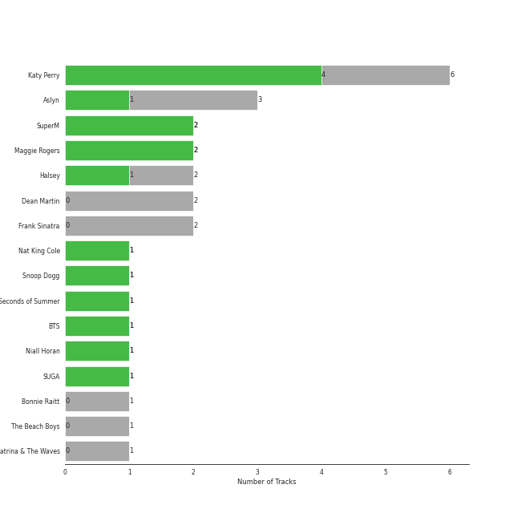
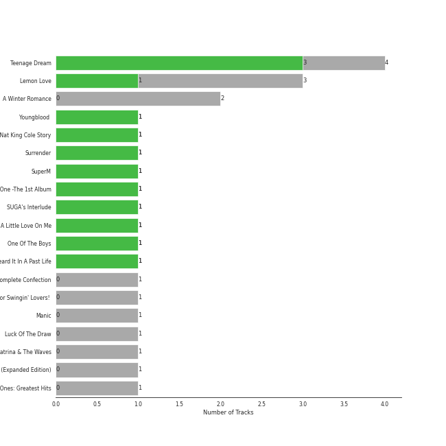

# Capitol Records

23 songs

Appears as:
- Capitol Records (20 tracks)
- Capitol (2 tracks)
- SM Entertainment/Capitol Records (1 tracks)

## Top Artists

| Art | Tracks | 💚 | Artist | 🔗 |
|:---|---:|---:|:---|:---|
|  | 6 | 5 | Katy Perry | [🔗](https://open.spotify.com/artist/6jJ0s89eD6GaHleKKya26X) |
|  | 2 | 2 | Maggie Rogers | [🔗](https://open.spotify.com/artist/4NZvixzsSefsNiIqXn0NDe) |
|  | 3 | 1 | Aslyn | [🔗](https://open.spotify.com/artist/6seR0G84QQq1NIW844E7Qq) |
|  | 2 | 1 | Halsey | [🔗](https://open.spotify.com/artist/26VFTg2z8YR0cCuwLzESi2) |
|  | 1 | 1 | Nat King Cole | [🔗](https://open.spotify.com/artist/7v4imS0moSyGdXyLgVTIV7) |
|  | 1 | 1 | Snoop Dogg | [🔗](https://open.spotify.com/artist/7hJcb9fa4alzcOq3EaNPoG) |
|  | 1 | 1 | 5 Seconds of Summer | [🔗](https://open.spotify.com/artist/5Rl15oVamLq7FbSb0NNBNy) |
|  | 1 | 1 | SuperM | [🔗](https://open.spotify.com/artist/5BHFSMEjfLVx1JwRWjAOsE) |
|  | 1 | 1 | [BTS](../../artists/bts/overview.md) | [🔗](https://open.spotify.com/artist/3Nrfpe0tUJi4K4DXYWgMUX) |
|  | 1 | 1 | Niall Horan | [🔗](https://open.spotify.com/artist/1Hsdzj7Dlq2I7tHP7501T4) |

See all 15 artists

| Art | Tracks | 💚 | Artist | 🔗 |
|:---|---:|---:|:---|:---|
|  | 1 | 1 | SUGA | [🔗](https://open.spotify.com/artist/0ebNdVaOfp6N0oZ1guIxM8) |
|  | 2 | 0 | Dean Martin | [🔗](https://open.spotify.com/artist/49e4v89VmlDcFCMyDv9wQ9) |
|  | 2 | 0 | [Frank Sinatra](../../artists/frank_sinatra/overview.md) | [🔗](https://open.spotify.com/artist/1Mxqyy3pSjf8kZZL4QVxS0) |
|  | 1 | 0 | Bonnie Raitt | [🔗](https://open.spotify.com/artist/4KDyYWR7IpxZ7xrdYbKrqY) |
|  | 1 | 0 | Sam Smith | [🔗](https://open.spotify.com/artist/2wY79sveU1sp5g7SokKOiI) |

## Top Albums

| Art | Tracks | 💚 | Album | Release Date | 🔗 |
|:---|---:|---:|:---|:---|:---|
|  | 4 | 3 | Teenage Dream | 2010-01-01 | [🔗](https://open.spotify.com/album/3BoUxfC7YhxNq3TpOfnRif) |
|  | 3 | 1 | Lemon Love | 2005-01-01 | [🔗](https://open.spotify.com/album/5YToJrWwzdA6W2NxxDoteE) |
|  | 2 | 0 | A Winter Romance | 1959-01-01 | [🔗](https://open.spotify.com/album/5I48ENiZiaZZSOpec6PdS5) |
|  | 1 | 1 | Youngblood (Deluxe) | 2018-06-15 | [🔗](https://open.spotify.com/album/2D0Hi3Jj6RFnpWDcSa0Otu) |
|  | 1 | 1 | The Nat King Cole Story | 1991-01-01 | [🔗](https://open.spotify.com/album/3NoP1ifIejWkGSDsO9T2xH) |
|  | 1 | 1 | Teenage Dream: The Complete Confection | 2012-03-12 | [🔗](https://open.spotify.com/album/5BvgP623rtvlc0HDcpzquz) |
|  | 1 | 1 | Surrender | 2022-07-29 | [🔗](https://open.spotify.com/album/2VeOtQQAJxR8VyvmoXqIbI) |
|  | 1 | 1 | Super One -The 1st Album | 2020-09-25 | [🔗](https://open.spotify.com/album/10fdwvVIpa0raPkZUTILAt) |
|  | 1 | 1 | SUGA's Interlude | 2019-12-06 | [🔗](https://open.spotify.com/album/0JfaSjTaej3QB27ofjnbQV) |
|  | 1 | 1 | Put A Little Love On Me | 2019-12-06 | [🔗](https://open.spotify.com/album/7dUgmUMDNnQAejhNLeIQWz) |

See all 17 albums

| Art | Tracks | 💚 | Album | Release Date | 🔗 |
|:---|---:|---:|:---|:---|:---|
|  | 1 | 1 | One Of The Boys | 2008-06-17 | [🔗](https://open.spotify.com/album/5c6MKfLcLB17DlJlFtVmyc) |
|  | 1 | 1 | Heard It In A Past Life | 2019-01-18 | [🔗](https://open.spotify.com/album/5AHWNPo3gllDmixgAoFru4) |
|  | 1 | 0 | Songs For Swingin' Lovers! (Remastered) | 1956-03 | [🔗](https://open.spotify.com/album/4kca7vXd1Wo5GE2DMafvMc) |
|  | 1 | 0 | Manic | 2020-01-17 | [🔗](https://open.spotify.com/album/68enXe5XcJdciSDAZr0Alr) |
|  | 1 | 0 | Luck Of The Draw | 1991-01-01 | [🔗](https://open.spotify.com/album/6blrkOZ0VmkhYPjfoD7eqf) |
|  | 1 | 0 | Have Yourself A Merry Little Christmas | 2014-12-05 | [🔗](https://open.spotify.com/album/3nCpXy6LlyXWuFR08tMycK) |
|  | 1 | 0 | Come Fly With Me (Remastered) | 1958 | [🔗](https://open.spotify.com/album/66v9QmjAj0Wwhh2OpbU4BE) |

## Genres

| Tracks | 💚 | Genre |
|---:|---:|:---|
| 11 | 8 | [pop](../../genres/pop/overview.md) |
| 2 | 2 | indie pop |
| 5 | 1 | lounge |
| 5 | 1 | [adult standards](../../genres/adult_standards/overview.md) |
| 3 | 1 | vocal jazz |
| 3 | 1 | [acoustic pop](../../genres/acoustic_pop/overview.md) |
| 2 | 1 | indie poptimism |
| 2 | 1 | etherpop |
| 2 | 1 | electropop |
| 1 | 1 | swing |

See all 22 genres

| Tracks | 💚 | Genre |
|---:|---:|:---|
| 1 | 1 | soul |
| 1 | 1 | [k-pop](../../genres/k_pop/overview.md) |
| 1 | 1 | boy band |
| 4 | 0 | easy listening |
| 1 | 0 | uk pop |
| 1 | 0 | [singer-songwriter](../../genres/singer_songwriter/overview.md) |
| 1 | 0 | [mellow gold](../../genres/mellow_gold/overview.md) |
| 1 | 0 | heartland rock |
| 1 | 0 | folk rock |
| 1 | 0 | folk |
| 1 | 0 | electric blues |
| 1 | 0 | country rock |

## Tracks released under Capitol Records

| Art | Track | Album | Artists | Label | 💚 | 🔗 |
|:---|:---|:---|:---|:---|:---|:---|
|  | Youngblood | Youngblood (Deluxe) | 5 Seconds of Summer | [Capitol](.) | 💚 | [🔗](https://open.spotify.com/track/2iUXsYOEPhVqEBwsqP70rE) |
|  | Gotta Get Over You | Lemon Love | Aslyn | [Capitol Records](.) | | [🔗](https://open.spotify.com/track/3dBfe2WcNSt3IeJLolbhhm) |
|  | Lemon Love | Lemon Love | Aslyn | [Capitol Records](.) | | [🔗](https://open.spotify.com/track/4SQ5SNqVPo00s7aVRoMYjN) |
|  | Wally | Lemon Love | Aslyn | [Capitol Records](.) | 💚 | [🔗](https://open.spotify.com/track/1JuNI0UJR2qDFlbZi1kO6p) |
|  | I Can't Make You Love Me | Luck Of The Draw | Bonnie Raitt | [Capitol Records](.) | | [🔗](https://open.spotify.com/track/69uJi5QsBtqlYkGURTBli8) |
|  | Baby, It's Cold Outside | A Winter Romance | Dean Martin | [Capitol Records](.) | | [🔗](https://open.spotify.com/track/4MrfQL4TYQXJBlZYpAHTuE) |
|  | Let It Snow! Let It Snow! Let It Snow! | A Winter Romance | Dean Martin | [Capitol Records](.) | | [🔗](https://open.spotify.com/track/2uFaJJtFpPDc5Pa95XzTvg) |
|  | I've Got You Under My Skin - Remastered 1998 | Songs For Swingin' Lovers! (Remastered) | [Frank Sinatra](../../artists/frank_sinatra/overview.md) | [Capitol Records](.) | | [🔗](https://open.spotify.com/track/3aEJMh1cXKEjgh52claxQp) |
|  | Come Fly With Me - Remastered 1998 | Come Fly With Me (Remastered) | [Frank Sinatra](../../artists/frank_sinatra/overview.md) | [Capitol Records](.) | | [🔗](https://open.spotify.com/track/4hHbeIIKO5Y5uLyIEbY9Gn) |
|  | SUGA's Interlude | SUGA's Interlude | Halsey, SUGA, [BTS](../../artists/bts/overview.md) | [Capitol Records](.) | 💚 | [🔗](https://open.spotify.com/track/5a0nHa7F4S9hb0Zi0zLS8w) |

See all tracks

| Art | Track | Album | Artists | Label | 💚 | 🔗 |
|:---|:---|:---|:---|:---|:---|:---|
|  | Without Me | Manic | Halsey | [Capitol Records](.) | | [🔗](https://open.spotify.com/track/6FZDfxM3a3UCqtzo5pxSLZ) |
|  | I Kissed A Girl | One Of The Boys | Katy Perry | [Capitol Records](.) | 💚 | [🔗](https://open.spotify.com/track/5NFiJqwS8iMtJwGOgTKa2v) |
|  | California Gurls | Teenage Dream | Katy Perry, Snoop Dogg | [Capitol Records](.) | 💚 | [🔗](https://open.spotify.com/track/3yCzLH2lQ8KknpvsqNCo35) |
|  | E.T. | Teenage Dream | Katy Perry | [Capitol Records](.) | 💚 | [🔗](https://open.spotify.com/track/6dmv1m6sHSvPkEQdz67c12) |
|  | Peacock | Teenage Dream | Katy Perry | [Capitol Records](.) | | [🔗](https://open.spotify.com/track/0kMLFbhrbo29nEx5M0A7km) |
|  | Teenage Dream | Teenage Dream | Katy Perry | [Capitol Records](.) | 💚 | [🔗](https://open.spotify.com/track/6AOdKVvWB8Ulb3lGCnyPBY) |
|  | Wide Awake | Teenage Dream: The Complete Confection | Katy Perry | [Capitol Records](.) | 💚 | [🔗](https://open.spotify.com/track/5JLv62qFIS1DR3zGEcApRt) |
|  | Light On | Heard It In A Past Life | Maggie Rogers | [Capitol Records](.) | 💚 | [🔗](https://open.spotify.com/track/6UnCGAEmrbGIOSmGRZQ1M2) |
|  | That's Where I Am | Surrender | Maggie Rogers | [Capitol Records](.) | 💚 | [🔗](https://open.spotify.com/track/49EXOlUTFBGdI098L6SXDh) |
|  | Nature Boy | The Nat King Cole Story | Nat King Cole | [Capitol Records](.) | 💚 | [🔗](https://open.spotify.com/track/2WMyu5IYgxEuCd6xgFgJrl) |
|  | Put A Little Love On Me | Put A Little Love On Me | Niall Horan | [Capitol Records](.) | 💚 | [🔗](https://open.spotify.com/track/1hCTxutVVYvggAQcUUUZAT) |
|  | Have Yourself A Merry Little Christmas | Have Yourself A Merry Little Christmas | Sam Smith | [Capitol](.) | | [🔗](https://open.spotify.com/track/1Qi2wh8fFgDV7tl4Sj3f2K) |
|  | Tiger Inside | Super One -The 1st Album | SuperM | [Capitol Records](.), [SM Entertainment](../sm_entertainment) | 💚 | [🔗](https://open.spotify.com/track/1ADlTU9mFc3oDdD9Vla2Yw) |

