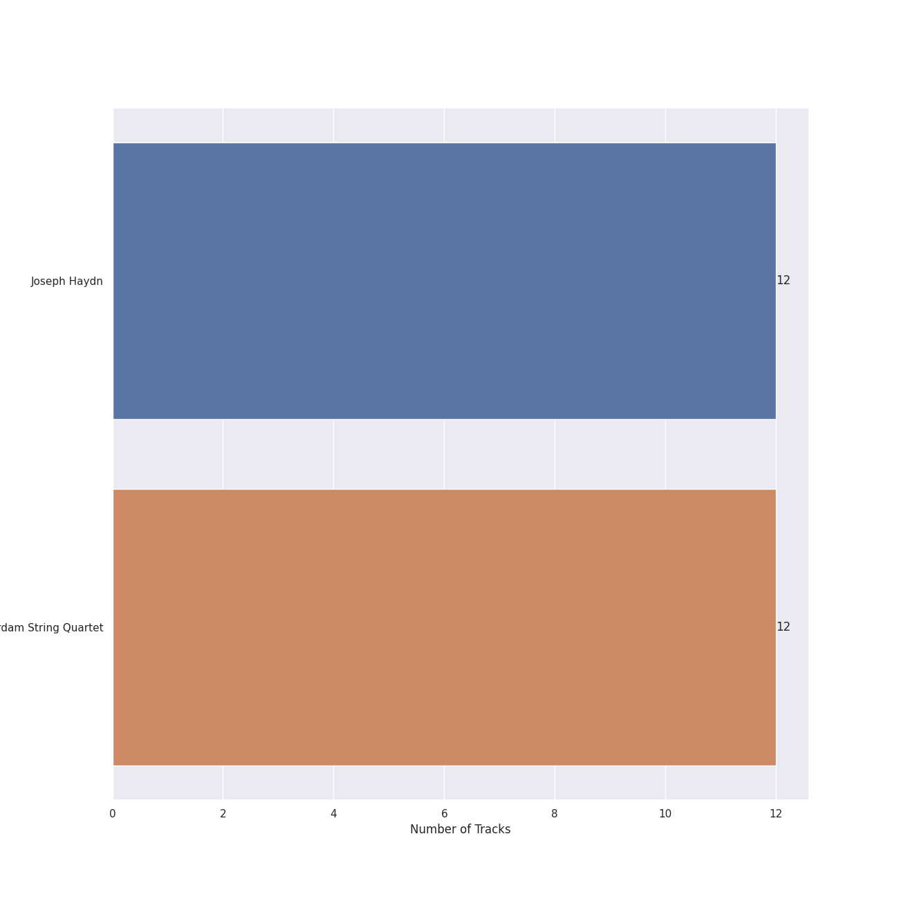
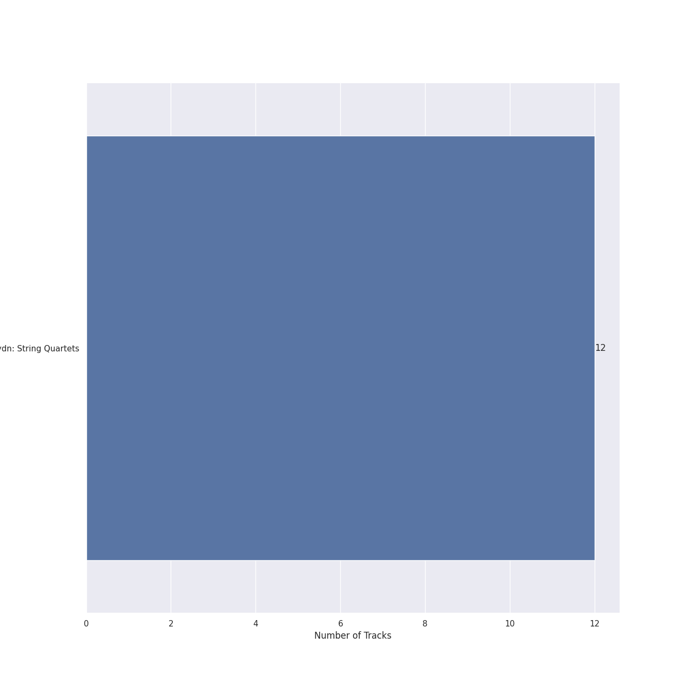
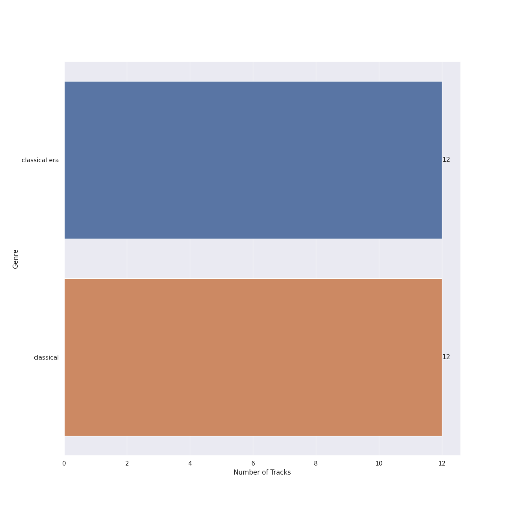

# Channel Classics Records

12 songs

Appears as:
- Channel Classics Records (12 tracks)

## Top Artists

See all 2 artists

| Number of Tracks | Art | Artist | 🔗 |
|---:|:---|:---|:---|
| 12 |  | [Joseph Haydn](../artists/joseph_haydn.md) | [🔗](https://open.spotify.com/artist/656RXuyw7CE0dtjdPgjJV6) |
| 12 |  | [The Amsterdam String Quartet](../artists/the_amsterdam_string_quartet.md) | [🔗](https://open.spotify.com/artist/0kbgyaL9g2Eba79p2jiYlN) |

## Top Albums

See all 1 albums

| Number of Tracks | Art | Album | Release Date | 🔗 |
|---:|:---|:---|:---|:---|
| 12 |  | Haydn: String Quartets | 2008-01-01 | [🔗](https://open.spotify.com/album/1rNGG2I3AKJy9FWqUiitkc) |

## Genres

See all 2 genres

| Number of Tracks | Genre |
|---:|:---|
| 12 | [classical era](../genres/classical_era.md) |
| 12 | [classical](../genres/classical.md) |

## Tracks released under Channel Classics Records

| Art | Track | Album | Artists | Label | 💚 | 🔗 |
|:---|:---|:---|:---|:---|:---|:---|
|  | String Quartet in C Major, Op. 74, No. 1: I. Allegro Moderato | Haydn: String Quartets | [Joseph Haydn](../artists/joseph_haydn.md), [The Amsterdam String Quartet](../artists/the_amsterdam_string_quartet.md) | [Channel Classics Records](channel_classics_records.md) | | [🔗](https://open.spotify.com/track/5Egl36369QjTDpEgcYjSDS) |
|  | String Quartet in C Major, Op. 74, No. 1: II. Andantino grazioso | Haydn: String Quartets | [Joseph Haydn](../artists/joseph_haydn.md), [The Amsterdam String Quartet](../artists/the_amsterdam_string_quartet.md) | [Channel Classics Records](channel_classics_records.md) | | [🔗](https://open.spotify.com/track/1gWSpDDfAWSiPDb76OxLSa) |
|  | String Quartet in C Major, Op. 74, No. 1: III. Menuetto, Allegretto | Haydn: String Quartets | [Joseph Haydn](../artists/joseph_haydn.md), [The Amsterdam String Quartet](../artists/the_amsterdam_string_quartet.md) | [Channel Classics Records](channel_classics_records.md) | | [🔗](https://open.spotify.com/track/0EspVDVsYSaURv8yiilNxJ) |
|  | String Quartet in C Major, Op. 74, No. 1: IV. Finale, Vivace | Haydn: String Quartets | [Joseph Haydn](../artists/joseph_haydn.md), [The Amsterdam String Quartet](../artists/the_amsterdam_string_quartet.md) | [Channel Classics Records](channel_classics_records.md) | | [🔗](https://open.spotify.com/track/5Ri7Kzxhy2jW6xt73Z0gFx) |
|  | String Quartet in G Major, Op. 76, No. 1: I. Allegro con spirito | Haydn: String Quartets | [Joseph Haydn](../artists/joseph_haydn.md), [The Amsterdam String Quartet](../artists/the_amsterdam_string_quartet.md) | [Channel Classics Records](channel_classics_records.md) | | [🔗](https://open.spotify.com/track/68FYdALZRL4d7pafnGyL3C) |
|  | String Quartet in G Major, Op. 76, No. 1: II. Adagio sostenuto | Haydn: String Quartets | [Joseph Haydn](../artists/joseph_haydn.md), [The Amsterdam String Quartet](../artists/the_amsterdam_string_quartet.md) | [Channel Classics Records](channel_classics_records.md) | | [🔗](https://open.spotify.com/track/1h6YkonaCnwFdUV5QgflvF) |
|  | String Quartet in G Major, Op. 76, No. 1: III. Menuetto, Presto | Haydn: String Quartets | [Joseph Haydn](../artists/joseph_haydn.md), [The Amsterdam String Quartet](../artists/the_amsterdam_string_quartet.md) | [Channel Classics Records](channel_classics_records.md) | | [🔗](https://open.spotify.com/track/6AAur5TYgKbNMv4MnkyG8b) |
|  | String Quartet in G Major, Op. 76, No. 1: IV. Allegro ma non troppo | Haydn: String Quartets | [Joseph Haydn](../artists/joseph_haydn.md), [The Amsterdam String Quartet](../artists/the_amsterdam_string_quartet.md) | [Channel Classics Records](channel_classics_records.md) | | [🔗](https://open.spotify.com/track/1ry7wBdzduwImFcrHsmkAS) |
|  | String Quartet in G Minor, Op. 20, No. 3: I. Allegro con spirito | Haydn: String Quartets | [Joseph Haydn](../artists/joseph_haydn.md), [The Amsterdam String Quartet](../artists/the_amsterdam_string_quartet.md) | [Channel Classics Records](channel_classics_records.md) | | [🔗](https://open.spotify.com/track/4Yj05JzIiAV17ExCLpq5tf) |
|  | String Quartet in G Minor, Op. 20, No. 3: II. Menuetto, Allegretto | Haydn: String Quartets | [Joseph Haydn](../artists/joseph_haydn.md), [The Amsterdam String Quartet](../artists/the_amsterdam_string_quartet.md) | [Channel Classics Records](channel_classics_records.md) | | [🔗](https://open.spotify.com/track/32ACoavut7gU8eXtXcWj9E) |
|  | String Quartet in G Minor, Op. 20, No. 3: III. Poco Adagio | Haydn: String Quartets | [Joseph Haydn](../artists/joseph_haydn.md), [The Amsterdam String Quartet](../artists/the_amsterdam_string_quartet.md) | [Channel Classics Records](channel_classics_records.md) | | [🔗](https://open.spotify.com/track/4fslTfB5Sk50kC4YfFcor0) |
|  | String Quartet in G Minor, Op. 20, No. 3: IV. Finale, Allegro molto | Haydn: String Quartets | [Joseph Haydn](../artists/joseph_haydn.md), [The Amsterdam String Quartet](../artists/the_amsterdam_string_quartet.md) | [Channel Classics Records](channel_classics_records.md) | | [🔗](https://open.spotify.com/track/7KR0NMt4Y4EsGIL168lRFb) |
