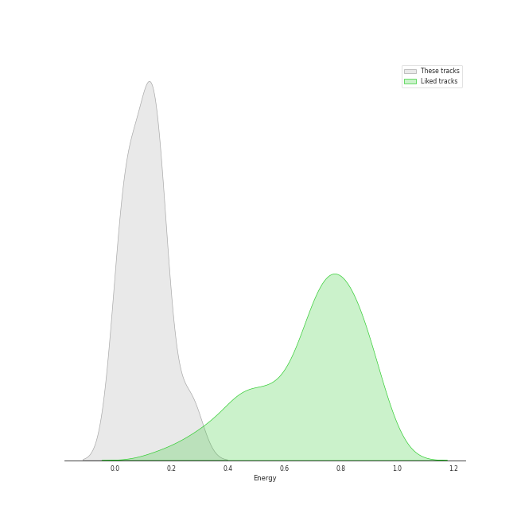
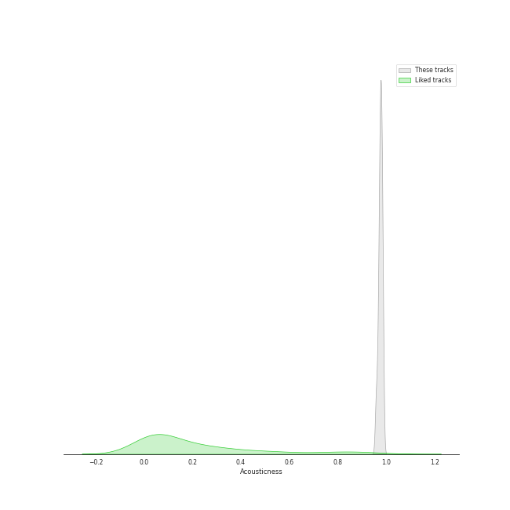
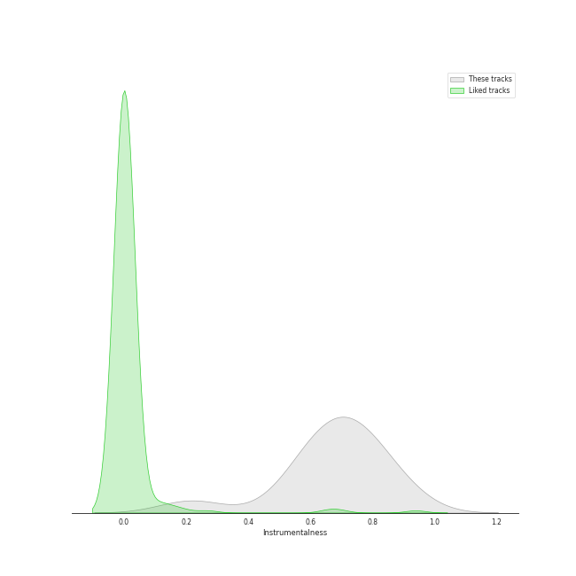
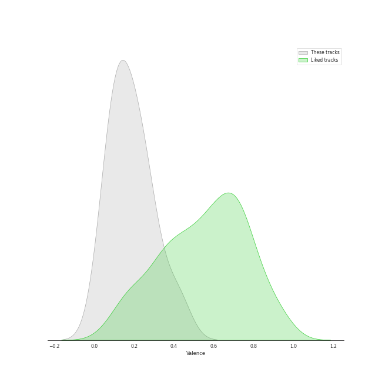

# Audio Features for Channel Classics Records

## Danceability

| 10 most Danceable tracks | 10 least Danceable tracks |
|:---|:---|
| String Quartet in G Major, Op. 76, No. 1: III. Menuetto, Presto (0.458) | String Quartet in G Minor, Op. 20, No. 3: II. Menuetto, Allegretto (0.148) |
| String Quartet in C Major, Op. 74, No. 1: IV. Finale, Vivace (0.433) | String Quartet in G Minor, Op. 20, No. 3: III. Poco Adagio (0.185) |
| String Quartet in G Minor, Op. 20, No. 3: I. Allegro con spirito (0.379) | String Quartet in G Major, Op. 76, No. 1: II. Adagio sostenuto (0.226) |
| String Quartet in G Minor, Op. 20, No. 3: IV. Finale, Allegro molto (0.373) | String Quartet in C Major, Op. 74, No. 1: III. Menuetto, Allegretto (0.277) |
| String Quartet in G Major, Op. 76, No. 1: I. Allegro con spirito (0.354) | String Quartet in G Major, Op. 76, No. 1: IV. Allegro ma non troppo (0.315) |
| String Quartet in C Major, Op. 74, No. 1: II. Andantino grazioso (0.34) | String Quartet in C Major, Op. 74, No. 1: I. Allegro Moderato (0.334) |
| String Quartet in C Major, Op. 74, No. 1: I. Allegro Moderato (0.334) | String Quartet in C Major, Op. 74, No. 1: II. Andantino grazioso (0.34) |
| String Quartet in G Major, Op. 76, No. 1: IV. Allegro ma non troppo (0.315) | String Quartet in G Major, Op. 76, No. 1: I. Allegro con spirito (0.354) |
| String Quartet in C Major, Op. 74, No. 1: III. Menuetto, Allegretto (0.277) | String Quartet in G Minor, Op. 20, No. 3: IV. Finale, Allegro molto (0.373) |
| String Quartet in G Major, Op. 76, No. 1: II. Adagio sostenuto (0.226) | String Quartet in G Minor, Op. 20, No. 3: I. Allegro con spirito (0.379) |

## Energy

| 10 most Energetic tracks | 10 least Energetic tracks |
|:---|:---|
| String Quartet in C Major, Op. 74, No. 1: IV. Finale, Vivace (0.268) | String Quartet in G Major, Op. 76, No. 1: II. Adagio sostenuto (0.0181) |
| String Quartet in G Major, Op. 76, No. 1: I. Allegro con spirito (0.17) | String Quartet in G Minor, Op. 20, No. 3: II. Menuetto, Allegretto (0.0298) |
| String Quartet in G Minor, Op. 20, No. 3: IV. Finale, Allegro molto (0.153) | String Quartet in C Major, Op. 74, No. 1: II. Andantino grazioso (0.0376) |
| String Quartet in G Major, Op. 76, No. 1: III. Menuetto, Presto (0.142) | String Quartet in G Minor, Op. 20, No. 3: III. Poco Adagio (0.05) |
| String Quartet in G Major, Op. 76, No. 1: IV. Allegro ma non troppo (0.141) | String Quartet in C Major, Op. 74, No. 1: III. Menuetto, Allegretto (0.0879) |
| String Quartet in C Major, Op. 74, No. 1: I. Allegro Moderato (0.121) | String Quartet in G Minor, Op. 20, No. 3: I. Allegro con spirito (0.109) |
| String Quartet in G Minor, Op. 20, No. 3: I. Allegro con spirito (0.109) | String Quartet in C Major, Op. 74, No. 1: I. Allegro Moderato (0.121) |
| String Quartet in C Major, Op. 74, No. 1: III. Menuetto, Allegretto (0.0879) | String Quartet in G Major, Op. 76, No. 1: IV. Allegro ma non troppo (0.141) |
| String Quartet in G Minor, Op. 20, No. 3: III. Poco Adagio (0.05) | String Quartet in G Major, Op. 76, No. 1: III. Menuetto, Presto (0.142) |
| String Quartet in C Major, Op. 74, No. 1: II. Andantino grazioso (0.0376) | String Quartet in G Minor, Op. 20, No. 3: IV. Finale, Allegro molto (0.153) |

## Speechiness

| 10 most Speechy tracks | 10 least Speechy tracks |
|:---|:---|
| String Quartet in G Major, Op. 76, No. 1: III. Menuetto, Presto (0.0679) | String Quartet in C Major, Op. 74, No. 1: III. Menuetto, Allegretto (0.0339) |
| String Quartet in G Minor, Op. 20, No. 3: I. Allegro con spirito (0.0458) | String Quartet in G Major, Op. 76, No. 1: II. Adagio sostenuto (0.0352) |
| String Quartet in G Major, Op. 76, No. 1: I. Allegro con spirito (0.0404) | String Quartet in G Major, Op. 76, No. 1: IV. Allegro ma non troppo (0.0352) |
| String Quartet in C Major, Op. 74, No. 1: IV. Finale, Vivace (0.0404) | String Quartet in C Major, Op. 74, No. 1: I. Allegro Moderato (0.0377) |
| String Quartet in G Minor, Op. 20, No. 3: III. Poco Adagio (0.0398) | String Quartet in G Minor, Op. 20, No. 3: II. Menuetto, Allegretto (0.0392) |
| String Quartet in C Major, Op. 74, No. 1: II. Andantino grazioso (0.0395) | String Quartet in G Minor, Op. 20, No. 3: IV. Finale, Allegro molto (0.0392) |
| String Quartet in G Minor, Op. 20, No. 3: IV. Finale, Allegro molto (0.0392) | String Quartet in C Major, Op. 74, No. 1: II. Andantino grazioso (0.0395) |
| String Quartet in G Minor, Op. 20, No. 3: II. Menuetto, Allegretto (0.0392) | String Quartet in G Minor, Op. 20, No. 3: III. Poco Adagio (0.0398) |
| String Quartet in C Major, Op. 74, No. 1: I. Allegro Moderato (0.0377) | String Quartet in C Major, Op. 74, No. 1: IV. Finale, Vivace (0.0404) |
| String Quartet in G Major, Op. 76, No. 1: IV. Allegro ma non troppo (0.0352) | String Quartet in G Major, Op. 76, No. 1: I. Allegro con spirito (0.0404) |

## Acousticness

| 10 most Acoustic tracks | 10 least Acoustic tracks |
|:---|:---|
| String Quartet in C Major, Op. 74, No. 1: III. Menuetto, Allegretto (0.986) | String Quartet in G Major, Op. 76, No. 1: II. Adagio sostenuto (0.959) |
| String Quartet in G Minor, Op. 20, No. 3: II. Menuetto, Allegretto (0.985) | String Quartet in G Minor, Op. 20, No. 3: III. Poco Adagio (0.968) |
| String Quartet in G Minor, Op. 20, No. 3: IV. Finale, Allegro molto (0.983) | String Quartet in G Major, Op. 76, No. 1: III. Menuetto, Presto (0.97) |
| String Quartet in C Major, Op. 74, No. 1: I. Allegro Moderato (0.98) | String Quartet in G Minor, Op. 20, No. 3: I. Allegro con spirito (0.974) |
| String Quartet in G Major, Op. 76, No. 1: IV. Allegro ma non troppo (0.979) | String Quartet in C Major, Op. 74, No. 1: II. Andantino grazioso (0.975) |
| String Quartet in G Major, Op. 76, No. 1: I. Allegro con spirito (0.978) | String Quartet in C Major, Op. 74, No. 1: IV. Finale, Vivace (0.976) |
| String Quartet in C Major, Op. 74, No. 1: IV. Finale, Vivace (0.976) | String Quartet in G Major, Op. 76, No. 1: I. Allegro con spirito (0.978) |
| String Quartet in C Major, Op. 74, No. 1: II. Andantino grazioso (0.975) | String Quartet in G Major, Op. 76, No. 1: IV. Allegro ma non troppo (0.979) |
| String Quartet in G Minor, Op. 20, No. 3: I. Allegro con spirito (0.974) | String Quartet in C Major, Op. 74, No. 1: I. Allegro Moderato (0.98) |
| String Quartet in G Major, Op. 76, No. 1: III. Menuetto, Presto (0.97) | String Quartet in G Minor, Op. 20, No. 3: IV. Finale, Allegro molto (0.983) |

## Instrumentalness

| 10 most Instrumental tracks | 10 least Instrumental tracks |
|:---|:---|
| String Quartet in C Major, Op. 74, No. 1: IV. Finale, Vivace (0.891) | String Quartet in G Major, Op. 76, No. 1: II. Adagio sostenuto (0.218) |
| String Quartet in G Major, Op. 76, No. 1: I. Allegro con spirito (0.835) | String Quartet in G Minor, Op. 20, No. 3: I. Allegro con spirito (0.568) |
| String Quartet in C Major, Op. 74, No. 1: II. Andantino grazioso (0.783) | String Quartet in C Major, Op. 74, No. 1: III. Menuetto, Allegretto (0.598) |
| String Quartet in G Major, Op. 76, No. 1: IV. Allegro ma non troppo (0.737) | String Quartet in G Minor, Op. 20, No. 3: IV. Finale, Allegro molto (0.599) |
| String Quartet in G Minor, Op. 20, No. 3: II. Menuetto, Allegretto (0.736) | String Quartet in G Minor, Op. 20, No. 3: III. Poco Adagio (0.675) |
| String Quartet in G Major, Op. 76, No. 1: III. Menuetto, Presto (0.707) | String Quartet in C Major, Op. 74, No. 1: I. Allegro Moderato (0.7) |
| String Quartet in C Major, Op. 74, No. 1: I. Allegro Moderato (0.7) | String Quartet in G Major, Op. 76, No. 1: III. Menuetto, Presto (0.707) |
| String Quartet in G Minor, Op. 20, No. 3: III. Poco Adagio (0.675) | String Quartet in G Minor, Op. 20, No. 3: II. Menuetto, Allegretto (0.736) |
| String Quartet in G Minor, Op. 20, No. 3: IV. Finale, Allegro molto (0.599) | String Quartet in G Major, Op. 76, No. 1: IV. Allegro ma non troppo (0.737) |
| String Quartet in C Major, Op. 74, No. 1: III. Menuetto, Allegretto (0.598) | String Quartet in C Major, Op. 74, No. 1: II. Andantino grazioso (0.783) |

## Liveness

| 10 most Live tracks | 10 least Live tracks |
|:---|:---|
| String Quartet in C Major, Op. 74, No. 1: III. Menuetto, Allegretto (0.208) | String Quartet in G Major, Op. 76, No. 1: I. Allegro con spirito (0.064) |
| String Quartet in G Major, Op. 76, No. 1: III. Menuetto, Presto (0.169) | String Quartet in C Major, Op. 74, No. 1: IV. Finale, Vivace (0.0882) |
| String Quartet in G Minor, Op. 20, No. 3: IV. Finale, Allegro molto (0.143) | String Quartet in C Major, Op. 74, No. 1: I. Allegro Moderato (0.0908) |
| String Quartet in G Minor, Op. 20, No. 3: III. Poco Adagio (0.119) | String Quartet in G Major, Op. 76, No. 1: IV. Allegro ma non troppo (0.101) |
| String Quartet in C Major, Op. 74, No. 1: II. Andantino grazioso (0.117) | String Quartet in G Minor, Op. 20, No. 3: II. Menuetto, Allegretto (0.103) |
| String Quartet in G Minor, Op. 20, No. 3: I. Allegro con spirito (0.112) | String Quartet in G Major, Op. 76, No. 1: II. Adagio sostenuto (0.109) |
| String Quartet in G Major, Op. 76, No. 1: II. Adagio sostenuto (0.109) | String Quartet in G Minor, Op. 20, No. 3: I. Allegro con spirito (0.112) |
| String Quartet in G Minor, Op. 20, No. 3: II. Menuetto, Allegretto (0.103) | String Quartet in C Major, Op. 74, No. 1: II. Andantino grazioso (0.117) |
| String Quartet in G Major, Op. 76, No. 1: IV. Allegro ma non troppo (0.101) | String Quartet in G Minor, Op. 20, No. 3: III. Poco Adagio (0.119) |
| String Quartet in C Major, Op. 74, No. 1: I. Allegro Moderato (0.0908) | String Quartet in G Minor, Op. 20, No. 3: IV. Finale, Allegro molto (0.143) |

## Valence

| 10 most Happy tracks | 10 least Happy tracks |
|:---|:---|
| String Quartet in G Major, Op. 76, No. 1: III. Menuetto, Presto (0.419) | String Quartet in G Major, Op. 76, No. 1: II. Adagio sostenuto (0.0379) |
| String Quartet in C Major, Op. 74, No. 1: IV. Finale, Vivace (0.306) | String Quartet in C Major, Op. 74, No. 1: II. Andantino grazioso (0.0891) |
| String Quartet in G Minor, Op. 20, No. 3: IV. Finale, Allegro molto (0.263) | String Quartet in G Minor, Op. 20, No. 3: III. Poco Adagio (0.0894) |
| String Quartet in G Major, Op. 76, No. 1: I. Allegro con spirito (0.242) | String Quartet in G Minor, Op. 20, No. 3: II. Menuetto, Allegretto (0.111) |
| String Quartet in G Major, Op. 76, No. 1: IV. Allegro ma non troppo (0.192) | String Quartet in C Major, Op. 74, No. 1: I. Allegro Moderato (0.118) |
| String Quartet in C Major, Op. 74, No. 1: III. Menuetto, Allegretto (0.186) | String Quartet in G Minor, Op. 20, No. 3: I. Allegro con spirito (0.169) |
| String Quartet in G Minor, Op. 20, No. 3: I. Allegro con spirito (0.169) | String Quartet in C Major, Op. 74, No. 1: III. Menuetto, Allegretto (0.186) |
| String Quartet in C Major, Op. 74, No. 1: I. Allegro Moderato (0.118) | String Quartet in G Major, Op. 76, No. 1: IV. Allegro ma non troppo (0.192) |
| String Quartet in G Minor, Op. 20, No. 3: II. Menuetto, Allegretto (0.111) | String Quartet in G Major, Op. 76, No. 1: I. Allegro con spirito (0.242) |
| String Quartet in G Minor, Op. 20, No. 3: III. Poco Adagio (0.0894) | String Quartet in G Minor, Op. 20, No. 3: IV. Finale, Allegro molto (0.263) |

## Tempo

| 10 most Fast tracks | 10 least Fast tracks |
|:---|:---|
| String Quartet in C Major, Op. 74, No. 1: IV. Finale, Vivace (146.248) | String Quartet in G Minor, Op. 20, No. 3: III. Poco Adagio (60.931) |
| String Quartet in G Major, Op. 76, No. 1: III. Menuetto, Presto (143.991) | String Quartet in G Minor, Op. 20, No. 3: II. Menuetto, Allegretto (74.109) |
| String Quartet in G Minor, Op. 20, No. 3: I. Allegro con spirito (137.336) | String Quartet in G Minor, Op. 20, No. 3: IV. Finale, Allegro molto (75.719) |
| String Quartet in C Major, Op. 74, No. 1: II. Andantino grazioso (132.321) | String Quartet in G Major, Op. 76, No. 1: IV. Allegro ma non troppo (91.956) |
| String Quartet in G Major, Op. 76, No. 1: II. Adagio sostenuto (129.933) | String Quartet in C Major, Op. 74, No. 1: III. Menuetto, Allegretto (99.146) |
| String Quartet in C Major, Op. 74, No. 1: I. Allegro Moderato (125.564) | String Quartet in G Major, Op. 76, No. 1: I. Allegro con spirito (112.09) |
| String Quartet in G Major, Op. 76, No. 1: I. Allegro con spirito (112.09) | String Quartet in C Major, Op. 74, No. 1: I. Allegro Moderato (125.564) |
| String Quartet in C Major, Op. 74, No. 1: III. Menuetto, Allegretto (99.146) | String Quartet in G Major, Op. 76, No. 1: II. Adagio sostenuto (129.933) |
| String Quartet in G Major, Op. 76, No. 1: IV. Allegro ma non troppo (91.956) | String Quartet in C Major, Op. 74, No. 1: II. Andantino grazioso (132.321) |
| String Quartet in G Minor, Op. 20, No. 3: IV. Finale, Allegro molto (75.719) | String Quartet in G Minor, Op. 20, No. 3: I. Allegro con spirito (137.336) |
