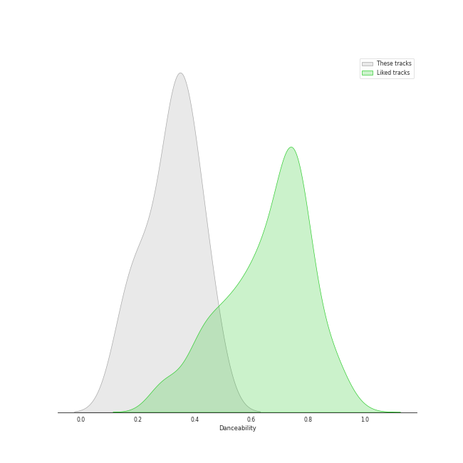
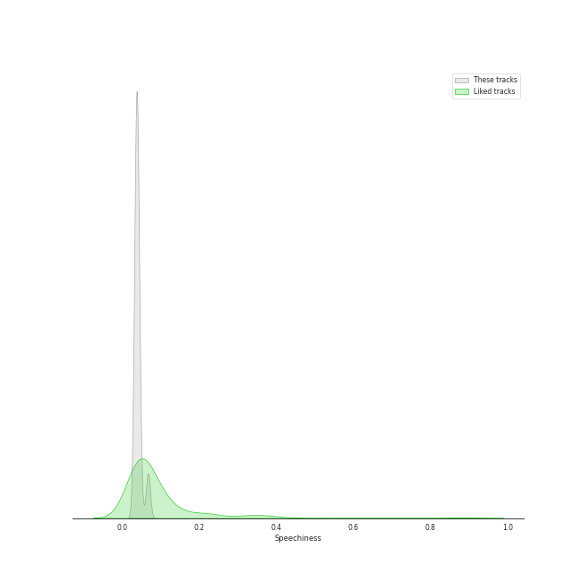
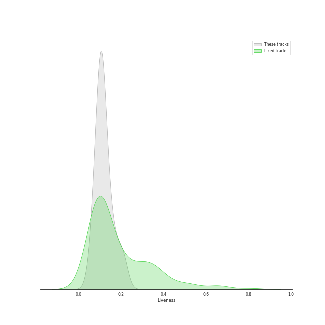
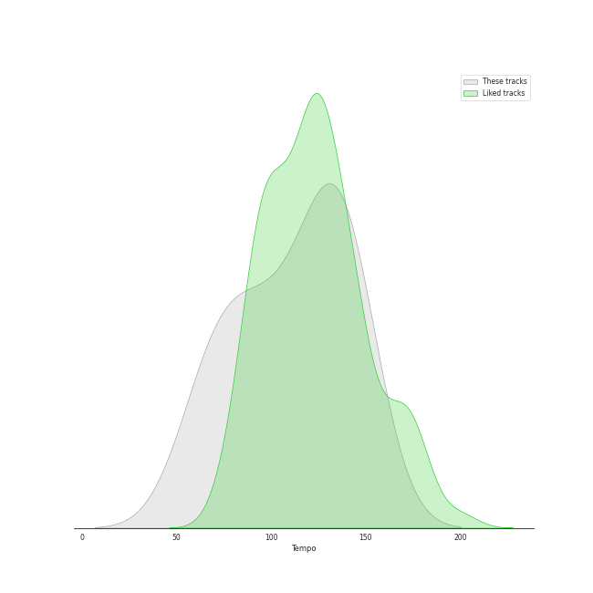

# Audio Features for Channel Classics Records

## Danceability

| ​ | 10 most Danceable tracks | ​​ | 10 least Danceable tracks |
|:---|:---|:---|:---|
|  | String Quartet in G Major, Op. 76, No. 1: III. Menuetto, Presto (0.458) |  | String Quartet in G Minor, Op. 20, No. 3: II. Menuetto, Allegretto (0.148) |
|  | String Quartet in C Major, Op. 74, No. 1: IV. Finale, Vivace (0.433) |  | String Quartet in G Minor, Op. 20, No. 3: III. Poco Adagio (0.185) |
|  | String Quartet in G Minor, Op. 20, No. 3: I. Allegro con spirito (0.379) |  | String Quartet in G Major, Op. 76, No. 1: II. Adagio sostenuto (0.226) |
|  | String Quartet in G Minor, Op. 20, No. 3: IV. Finale, Allegro molto (0.373) |  | String Quartet in C Major, Op. 74, No. 1: III. Menuetto, Allegretto (0.277) |
|  | String Quartet in G Major, Op. 76, No. 1: I. Allegro con spirito (0.354) |  | String Quartet in G Major, Op. 76, No. 1: IV. Allegro ma non troppo (0.315) |
|  | String Quartet in C Major, Op. 74, No. 1: II. Andantino grazioso (0.34) |  | String Quartet in C Major, Op. 74, No. 1: I. Allegro Moderato (0.334) |
|  | String Quartet in C Major, Op. 74, No. 1: I. Allegro Moderato (0.334) |  | String Quartet in C Major, Op. 74, No. 1: II. Andantino grazioso (0.34) |
|  | String Quartet in G Major, Op. 76, No. 1: IV. Allegro ma non troppo (0.315) |  | String Quartet in G Major, Op. 76, No. 1: I. Allegro con spirito (0.354) |
|  | String Quartet in C Major, Op. 74, No. 1: III. Menuetto, Allegretto (0.277) |  | String Quartet in G Minor, Op. 20, No. 3: IV. Finale, Allegro molto (0.373) |
|  | String Quartet in G Major, Op. 76, No. 1: II. Adagio sostenuto (0.226) |  | String Quartet in G Minor, Op. 20, No. 3: I. Allegro con spirito (0.379) |

## Energy

| ​ | 10 most Energetic tracks | ​​ | 10 least Energetic tracks |
|:---|:---|:---|:---|
|  | String Quartet in C Major, Op. 74, No. 1: IV. Finale, Vivace (0.268) |  | String Quartet in G Major, Op. 76, No. 1: II. Adagio sostenuto (0.0181) |
|  | String Quartet in G Major, Op. 76, No. 1: I. Allegro con spirito (0.17) |  | String Quartet in G Minor, Op. 20, No. 3: II. Menuetto, Allegretto (0.0298) |
|  | String Quartet in G Minor, Op. 20, No. 3: IV. Finale, Allegro molto (0.153) |  | String Quartet in C Major, Op. 74, No. 1: II. Andantino grazioso (0.0376) |
|  | String Quartet in G Major, Op. 76, No. 1: III. Menuetto, Presto (0.142) |  | String Quartet in G Minor, Op. 20, No. 3: III. Poco Adagio (0.05) |
|  | String Quartet in G Major, Op. 76, No. 1: IV. Allegro ma non troppo (0.141) |  | String Quartet in C Major, Op. 74, No. 1: III. Menuetto, Allegretto (0.0879) |
|  | String Quartet in C Major, Op. 74, No. 1: I. Allegro Moderato (0.121) |  | String Quartet in G Minor, Op. 20, No. 3: I. Allegro con spirito (0.109) |
|  | String Quartet in G Minor, Op. 20, No. 3: I. Allegro con spirito (0.109) |  | String Quartet in C Major, Op. 74, No. 1: I. Allegro Moderato (0.121) |
|  | String Quartet in C Major, Op. 74, No. 1: III. Menuetto, Allegretto (0.0879) |  | String Quartet in G Major, Op. 76, No. 1: IV. Allegro ma non troppo (0.141) |
|  | String Quartet in G Minor, Op. 20, No. 3: III. Poco Adagio (0.05) |  | String Quartet in G Major, Op. 76, No. 1: III. Menuetto, Presto (0.142) |
|  | String Quartet in C Major, Op. 74, No. 1: II. Andantino grazioso (0.0376) |  | String Quartet in G Minor, Op. 20, No. 3: IV. Finale, Allegro molto (0.153) |

## Speechiness

| ​ | 10 most Speechy tracks | ​​ | 10 least Speechy tracks |
|:---|:---|:---|:---|
|  | String Quartet in G Major, Op. 76, No. 1: III. Menuetto, Presto (0.0679) |  | String Quartet in C Major, Op. 74, No. 1: III. Menuetto, Allegretto (0.0339) |
|  | String Quartet in G Minor, Op. 20, No. 3: I. Allegro con spirito (0.0458) |  | String Quartet in G Major, Op. 76, No. 1: II. Adagio sostenuto (0.0352) |
|  | String Quartet in G Major, Op. 76, No. 1: I. Allegro con spirito (0.0404) |  | String Quartet in G Major, Op. 76, No. 1: IV. Allegro ma non troppo (0.0352) |
|  | String Quartet in C Major, Op. 74, No. 1: IV. Finale, Vivace (0.0404) |  | String Quartet in C Major, Op. 74, No. 1: I. Allegro Moderato (0.0377) |
|  | String Quartet in G Minor, Op. 20, No. 3: III. Poco Adagio (0.0398) |  | String Quartet in G Minor, Op. 20, No. 3: II. Menuetto, Allegretto (0.0392) |
|  | String Quartet in C Major, Op. 74, No. 1: II. Andantino grazioso (0.0395) |  | String Quartet in G Minor, Op. 20, No. 3: IV. Finale, Allegro molto (0.0392) |
|  | String Quartet in G Minor, Op. 20, No. 3: IV. Finale, Allegro molto (0.0392) |  | String Quartet in C Major, Op. 74, No. 1: II. Andantino grazioso (0.0395) |
|  | String Quartet in G Minor, Op. 20, No. 3: II. Menuetto, Allegretto (0.0392) |  | String Quartet in G Minor, Op. 20, No. 3: III. Poco Adagio (0.0398) |
|  | String Quartet in C Major, Op. 74, No. 1: I. Allegro Moderato (0.0377) |  | String Quartet in C Major, Op. 74, No. 1: IV. Finale, Vivace (0.0404) |
|  | String Quartet in G Major, Op. 76, No. 1: IV. Allegro ma non troppo (0.0352) |  | String Quartet in G Major, Op. 76, No. 1: I. Allegro con spirito (0.0404) |

## Acousticness

| ​ | 10 most Acoustic tracks | ​​ | 10 least Acoustic tracks |
|:---|:---|:---|:---|
|  | String Quartet in C Major, Op. 74, No. 1: III. Menuetto, Allegretto (0.986) |  | String Quartet in G Major, Op. 76, No. 1: II. Adagio sostenuto (0.959) |
|  | String Quartet in G Minor, Op. 20, No. 3: II. Menuetto, Allegretto (0.985) |  | String Quartet in G Minor, Op. 20, No. 3: III. Poco Adagio (0.968) |
|  | String Quartet in G Minor, Op. 20, No. 3: IV. Finale, Allegro molto (0.983) |  | String Quartet in G Major, Op. 76, No. 1: III. Menuetto, Presto (0.97) |
|  | String Quartet in C Major, Op. 74, No. 1: I. Allegro Moderato (0.98) |  | String Quartet in G Minor, Op. 20, No. 3: I. Allegro con spirito (0.974) |
|  | String Quartet in G Major, Op. 76, No. 1: IV. Allegro ma non troppo (0.979) |  | String Quartet in C Major, Op. 74, No. 1: II. Andantino grazioso (0.975) |
|  | String Quartet in G Major, Op. 76, No. 1: I. Allegro con spirito (0.978) |  | String Quartet in C Major, Op. 74, No. 1: IV. Finale, Vivace (0.976) |
|  | String Quartet in C Major, Op. 74, No. 1: IV. Finale, Vivace (0.976) |  | String Quartet in G Major, Op. 76, No. 1: I. Allegro con spirito (0.978) |
|  | String Quartet in C Major, Op. 74, No. 1: II. Andantino grazioso (0.975) |  | String Quartet in G Major, Op. 76, No. 1: IV. Allegro ma non troppo (0.979) |
|  | String Quartet in G Minor, Op. 20, No. 3: I. Allegro con spirito (0.974) |  | String Quartet in C Major, Op. 74, No. 1: I. Allegro Moderato (0.98) |
|  | String Quartet in G Major, Op. 76, No. 1: III. Menuetto, Presto (0.97) |  | String Quartet in G Minor, Op. 20, No. 3: IV. Finale, Allegro molto (0.983) |

## Instrumentalness

| ​ | 10 most Instrumental tracks | ​​ | 10 least Instrumental tracks |
|:---|:---|:---|:---|
|  | String Quartet in C Major, Op. 74, No. 1: IV. Finale, Vivace (0.891) |  | String Quartet in G Major, Op. 76, No. 1: II. Adagio sostenuto (0.218) |
|  | String Quartet in G Major, Op. 76, No. 1: I. Allegro con spirito (0.835) |  | String Quartet in G Minor, Op. 20, No. 3: I. Allegro con spirito (0.568) |
|  | String Quartet in C Major, Op. 74, No. 1: II. Andantino grazioso (0.783) |  | String Quartet in C Major, Op. 74, No. 1: III. Menuetto, Allegretto (0.598) |
|  | String Quartet in G Major, Op. 76, No. 1: IV. Allegro ma non troppo (0.737) |  | String Quartet in G Minor, Op. 20, No. 3: IV. Finale, Allegro molto (0.599) |
|  | String Quartet in G Minor, Op. 20, No. 3: II. Menuetto, Allegretto (0.736) |  | String Quartet in G Minor, Op. 20, No. 3: III. Poco Adagio (0.675) |
|  | String Quartet in G Major, Op. 76, No. 1: III. Menuetto, Presto (0.707) |  | String Quartet in C Major, Op. 74, No. 1: I. Allegro Moderato (0.7) |
|  | String Quartet in C Major, Op. 74, No. 1: I. Allegro Moderato (0.7) |  | String Quartet in G Major, Op. 76, No. 1: III. Menuetto, Presto (0.707) |
|  | String Quartet in G Minor, Op. 20, No. 3: III. Poco Adagio (0.675) |  | String Quartet in G Minor, Op. 20, No. 3: II. Menuetto, Allegretto (0.736) |
|  | String Quartet in G Minor, Op. 20, No. 3: IV. Finale, Allegro molto (0.599) |  | String Quartet in G Major, Op. 76, No. 1: IV. Allegro ma non troppo (0.737) |
|  | String Quartet in C Major, Op. 74, No. 1: III. Menuetto, Allegretto (0.598) |  | String Quartet in C Major, Op. 74, No. 1: II. Andantino grazioso (0.783) |

## Liveness

| ​ | 10 most Live tracks | ​​ | 10 least Live tracks |
|:---|:---|:---|:---|
|  | String Quartet in C Major, Op. 74, No. 1: III. Menuetto, Allegretto (0.208) |  | String Quartet in G Major, Op. 76, No. 1: I. Allegro con spirito (0.064) |
|  | String Quartet in G Major, Op. 76, No. 1: III. Menuetto, Presto (0.169) |  | String Quartet in C Major, Op. 74, No. 1: IV. Finale, Vivace (0.0882) |
|  | String Quartet in G Minor, Op. 20, No. 3: IV. Finale, Allegro molto (0.143) |  | String Quartet in C Major, Op. 74, No. 1: I. Allegro Moderato (0.0908) |
|  | String Quartet in G Minor, Op. 20, No. 3: III. Poco Adagio (0.119) |  | String Quartet in G Major, Op. 76, No. 1: IV. Allegro ma non troppo (0.101) |
|  | String Quartet in C Major, Op. 74, No. 1: II. Andantino grazioso (0.117) |  | String Quartet in G Minor, Op. 20, No. 3: II. Menuetto, Allegretto (0.103) |
|  | String Quartet in G Minor, Op. 20, No. 3: I. Allegro con spirito (0.112) |  | String Quartet in G Major, Op. 76, No. 1: II. Adagio sostenuto (0.109) |
|  | String Quartet in G Major, Op. 76, No. 1: II. Adagio sostenuto (0.109) |  | String Quartet in G Minor, Op. 20, No. 3: I. Allegro con spirito (0.112) |
|  | String Quartet in G Minor, Op. 20, No. 3: II. Menuetto, Allegretto (0.103) |  | String Quartet in C Major, Op. 74, No. 1: II. Andantino grazioso (0.117) |
|  | String Quartet in G Major, Op. 76, No. 1: IV. Allegro ma non troppo (0.101) |  | String Quartet in G Minor, Op. 20, No. 3: III. Poco Adagio (0.119) |
|  | String Quartet in C Major, Op. 74, No. 1: I. Allegro Moderato (0.0908) |  | String Quartet in G Minor, Op. 20, No. 3: IV. Finale, Allegro molto (0.143) |

## Valence

| ​ | 10 most Happy tracks | ​​ | 10 least Happy tracks |
|:---|:---|:---|:---|
|  | String Quartet in G Major, Op. 76, No. 1: III. Menuetto, Presto (0.419) |  | String Quartet in G Major, Op. 76, No. 1: II. Adagio sostenuto (0.0379) |
|  | String Quartet in C Major, Op. 74, No. 1: IV. Finale, Vivace (0.306) |  | String Quartet in C Major, Op. 74, No. 1: II. Andantino grazioso (0.0891) |
|  | String Quartet in G Minor, Op. 20, No. 3: IV. Finale, Allegro molto (0.263) |  | String Quartet in G Minor, Op. 20, No. 3: III. Poco Adagio (0.0894) |
|  | String Quartet in G Major, Op. 76, No. 1: I. Allegro con spirito (0.242) |  | String Quartet in G Minor, Op. 20, No. 3: II. Menuetto, Allegretto (0.111) |
|  | String Quartet in G Major, Op. 76, No. 1: IV. Allegro ma non troppo (0.192) |  | String Quartet in C Major, Op. 74, No. 1: I. Allegro Moderato (0.118) |
|  | String Quartet in C Major, Op. 74, No. 1: III. Menuetto, Allegretto (0.186) |  | String Quartet in G Minor, Op. 20, No. 3: I. Allegro con spirito (0.169) |
|  | String Quartet in G Minor, Op. 20, No. 3: I. Allegro con spirito (0.169) |  | String Quartet in C Major, Op. 74, No. 1: III. Menuetto, Allegretto (0.186) |
|  | String Quartet in C Major, Op. 74, No. 1: I. Allegro Moderato (0.118) |  | String Quartet in G Major, Op. 76, No. 1: IV. Allegro ma non troppo (0.192) |
|  | String Quartet in G Minor, Op. 20, No. 3: II. Menuetto, Allegretto (0.111) |  | String Quartet in G Major, Op. 76, No. 1: I. Allegro con spirito (0.242) |
|  | String Quartet in G Minor, Op. 20, No. 3: III. Poco Adagio (0.0894) |  | String Quartet in G Minor, Op. 20, No. 3: IV. Finale, Allegro molto (0.263) |

## Tempo

| ​ | 10 most Fast tracks | ​​ | 10 least Fast tracks |
|:---|:---|:---|:---|
|  | String Quartet in C Major, Op. 74, No. 1: IV. Finale, Vivace (146.248) |  | String Quartet in G Minor, Op. 20, No. 3: III. Poco Adagio (60.931) |
|  | String Quartet in G Major, Op. 76, No. 1: III. Menuetto, Presto (143.991) |  | String Quartet in G Minor, Op. 20, No. 3: II. Menuetto, Allegretto (74.109) |
|  | String Quartet in G Minor, Op. 20, No. 3: I. Allegro con spirito (137.336) |  | String Quartet in G Minor, Op. 20, No. 3: IV. Finale, Allegro molto (75.719) |
|  | String Quartet in C Major, Op. 74, No. 1: II. Andantino grazioso (132.321) |  | String Quartet in G Major, Op. 76, No. 1: IV. Allegro ma non troppo (91.956) |
|  | String Quartet in G Major, Op. 76, No. 1: II. Adagio sostenuto (129.933) |  | String Quartet in C Major, Op. 74, No. 1: III. Menuetto, Allegretto (99.146) |
|  | String Quartet in C Major, Op. 74, No. 1: I. Allegro Moderato (125.564) |  | String Quartet in G Major, Op. 76, No. 1: I. Allegro con spirito (112.09) |
|  | String Quartet in G Major, Op. 76, No. 1: I. Allegro con spirito (112.09) |  | String Quartet in C Major, Op. 74, No. 1: I. Allegro Moderato (125.564) |
|  | String Quartet in C Major, Op. 74, No. 1: III. Menuetto, Allegretto (99.146) |  | String Quartet in G Major, Op. 76, No. 1: II. Adagio sostenuto (129.933) |
|  | String Quartet in G Major, Op. 76, No. 1: IV. Allegro ma non troppo (91.956) |  | String Quartet in C Major, Op. 74, No. 1: II. Andantino grazioso (132.321) |
|  | String Quartet in G Minor, Op. 20, No. 3: IV. Finale, Allegro molto (75.719) |  | String Quartet in G Minor, Op. 20, No. 3: I. Allegro con spirito (137.336) |
