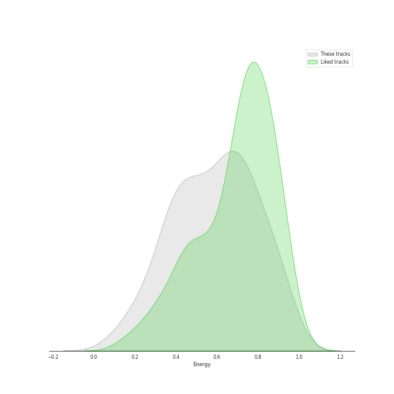
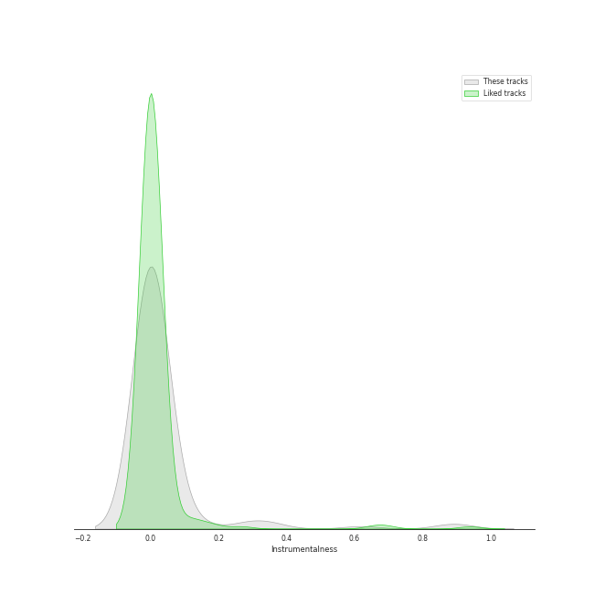
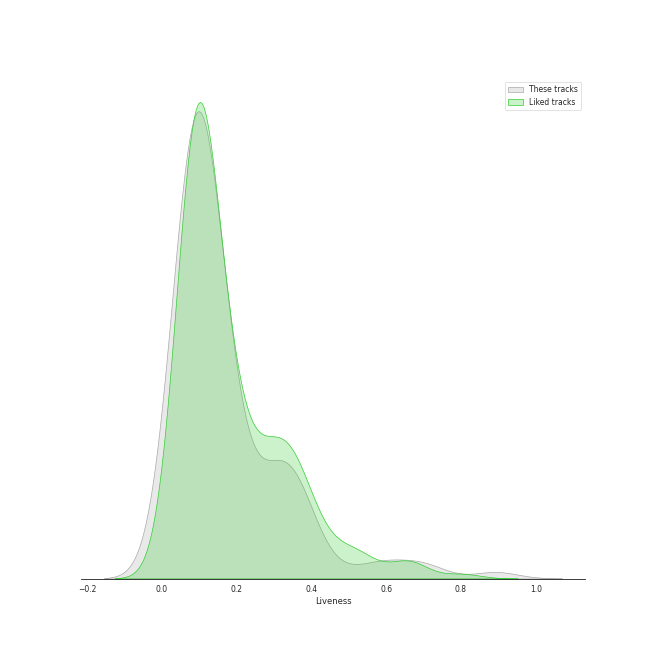
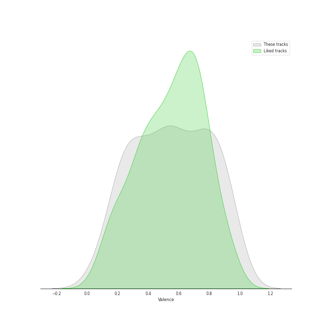

# Track Features for Columbia

## Danceability

| ​ | 10 most Danceable tracks | ​​ | 10 least Danceable tracks |
|:---|:---|:---|:---|
|  | MALAMENTE - Cap.1: Augurio (0.893) |  | Bridge Over Troubled Water (0.149) |
|  | Old Town Road - Remix (0.878) |  | Lights (0.193) |
|  | Uptown Funk (feat. Bruno Mars) (0.856) |  | She's Always a Woman (0.292) |
|  | Bootylicious (0.835) |  | Dream On (0.307) |
|  | Here Comes Santa Claus (Right Down Santa Claus Lane) - 1947 Version (0.834) |  | Back In Black (0.31) |
|  | Wrap Me In Plastic (0.821) |  | I'd Rather Go Blind (0.326) |
|  | Turn Down for What (0.818) |  | Piano Man (0.334) |
|  | Get Lucky (feat. Pharrell Williams and Nile Rodgers) (0.81) |  | All I Want for Christmas Is You (0.336) |
|  | Let's Hear It for the Boy - From "Footloose" Original Soundtrack (0.808) |  | Skyfall (0.346) |
|  | JA ARA E (0.79) |  | Ave Maria (0.35) |

## Energy

| ​ | 10 most Energetic tracks | ​​ | 10 least Energetic tracks |
|:---|:---|:---|:---|
|  | We Didn't Start the Fire (0.967) |  | And So It Goes (0.0871) |
|  | Uptown Girl (0.944) |  | She's Got a Way (0.142) |
|  | Any Way You Want It (0.932) |  | Lullabye (Goodnight, My Angel) (0.157) |
|  | Scenes from an Italian Restaurant (0.931) |  | Bridge Over Troubled Water (0.206) |
|  | This Is What You Came For (0.927) |  | The Sound of Silence - Acoustic Version (0.216) |
|  | Hey, Soul Sister (0.886) |  | Baby, It's Cold Outside (with Dorothy Kirsten) (0.239) |
|  | Green Light (feat. André 3000) (0.882) |  | Let It Snow! Let It Snow! Let It Snow! (with The B. Swanson Quartet) (0.259) |
|  | Movin' Out (Anthony's Song) (0.88) |  | Take Five (0.26) |
|  | The Stranger (0.878) |  | All of Me (0.264) |
|  | Cecilia (0.876) |  | Falling (0.267) |

## Speechiness

| ​ | 10 most Speechy tracks | ​​ | 10 least Speechy tracks |
|:---|:---|:---|:---|
|  | Hold Up (0.405) |  | 情非得已 (0.0241) |
|  | Irreplaceable (0.382) |  | The Longest Time (0.0262) |
|  | Bootylicious (0.284) |  | Turn the Lights Back On (0.0264) |
|  | Partition (0.283) |  | Travelin' Soldier (0.0265) |
|  | Crazy In Love (feat. Jay-Z) (0.226) |  | A Matter of Trust (0.0268) |
|  | Daddy Lessons (0.216) |  | Instant Crush (feat. Julian Casablancas) (0.0271) |
|  | Naughty Girl (0.161) |  | Piano Man (0.0276) |
|  | Only the Good Die Young (0.159) |  | Ave Maria (0.0279) |
|  | Turn Down for What (0.156) |  | Landslide (0.0279) |
|  | MONTERO (Call Me By Your Name) (0.152) |  | Easy On Me (0.0282) |

## Acousticness

| ​ | 10 most Acoustic tracks | ​​ | 10 least Acoustic tracks |
|:---|:---|:---|:---|
|  | She's Got a Way (0.97) |  | Turn Down for What (0.00107) |
|  | I'm Confessin' (That I Love You) (0.965) |  | Bootylicious (0.00247) |
|  | Baby, It's Cold Outside (with Dorothy Kirsten) (0.963) |  | Crazy In Love (feat. Jay-Z) (0.00249) |
|  | Lullabye (Goodnight, My Angel) (0.948) |  | Any Way You Want It (0.00251) |
|  | All of Me (0.922) |  | Uptown Funk (feat. Bruno Mars) (0.00801) |
|  | And So It Goes (0.91) |  | Nothing Breaks Like a Heart (feat. Miley Cyrus) (0.00987) |
|  | Let It Snow! Let It Snow! Let It Snow! (with The B. Swanson Quartet) (0.903) |  | Back In Black (0.011) |
|  | Blue Rondo à la Turk (0.851) |  | Walk This Way (0.0114) |
|  | Falling (0.839) |  | The Wire (0.0127) |
|  | The Sound of Silence - Acoustic Version (0.837) |  | Pressure (0.0148) |

## Instrumentalness

| ​ | 10 most Instrumental tracks | ​​ | 10 least Instrumental tracks |
|:---|:---|:---|:---|
|  | I'm Confessin' (That I Love You) (0.905) |  | Travelin' Soldier (0.0) |
|  | Unsquare Dance (0.88) |  | BONA BONA (0.0) |
|  | Instant Crush (feat. Julian Casablancas) (0.619) |  | Mack the Knife (0.0) |
|  | Blue Rondo à la Turk (0.352) |  | All I Want for Christmas Is You (0.0) |
|  | Straight, No Chaser (0.279) |  | Easy On Me (0.0) |
|  | Turn Down for What (0.128) |  | Hold Up (0.0) |
|  | This Is What You Came For (0.119) |  | Take Me to Church (0.0) |
|  | Watermelon Man (0.111) |  | Turn the Lights Back On (0.0) |
|  | Partition (0.0707) |  | Ave Maria (0.0) |
|  | JA ARA E (0.0267) |  | Love On Top (0.0) |

## Liveness

| ​ | 10 most Live tracks | ​​ | 10 least Live tracks |
|:---|:---|:---|:---|
|  | Folsom Prison Blues - Live at Folsom State Prison, Folsom, CA - January 1968 (0.893) |  | Flowers (0.0232) |
|  | Baby, It's Cold Outside (with Dorothy Kirsten) (0.706) |  | Oh My God (0.0264) |
|  | death bed (coffee for your head) (0.696) |  | Uptown Funk (feat. Bruno Mars) (0.0344) |
|  | Love On Top (0.604) |  | INDUSTRY BABY (feat. Jack Harlow) (0.0476) |
|  | Uptown Girl (0.601) |  | Let's Hear It for the Boy - From "Footloose" Original Soundtrack (0.0477) |
|  | Hold Up (0.521) |  | Africa (0.0481) |
|  | Brown Eyed Girl (0.406) |  | My Life (0.0555) |
|  | Nothing Breaks Like a Heart (feat. Miley Cyrus) (0.388) |  | Halo (0.0563) |
|  | MONTERO (Call Me By Your Name) (0.384) |  | Turn Down for What (0.057) |
|  | Captain Jack (0.374) |  | The Wire (0.0585) |

## Valence

| ​ | 10 most Happy tracks | ​​ | 10 least Happy tracks |
|:---|:---|:---|:---|
|  | Here Comes Santa Claus (Right Down Santa Claus Lane) - 1947 Version (0.976) |  | Falling (0.0592) |
|  | Cecilia (0.954) |  | Skyfall (0.0789) |
|  | Uptown Funk (feat. Bruno Mars) (0.928) |  | Turn Down for What (0.0815) |
|  | Brown Eyed Girl (0.908) |  | Easy On Me (0.13) |
|  | Movin' Out (Anthony's Song) (0.895) |  | Partition (0.172) |
|  | We Didn't Start the Fire (0.895) |  | Listen (From the Motion Picture "Dreamgirls") (0.187) |
|  | Walk This Way (0.894) |  | Light As the Breeze (0.19) |
|  | INDUSTRY BABY (feat. Jack Harlow) (0.892) |  | New York State of Mind (0.194) |
|  | Folsom Prison Blues - Live at Folsom State Prison, Folsom, CA - January 1968 (0.889) |  | She's Got a Way (0.196) |
|  | A Matter of Trust (0.88) |  | Ave Maria (0.201) |

## Tempo

| ​ | 10 most Fast tracks | ​​ | 10 least Fast tracks |
|:---|:---|:---|:---|
|  | Lights (205.422) |  | She's Got a Way (75.859) |
|  | Naughty Girl (200.053) |  | Skyfall (75.881) |
|  | Caroline (199.225) |  | Only the Good Die Young (76.214) |
|  | Back In Black (188.386) |  | Lullabye (Goodnight, My Angel) (76.48) |
|  | Wrap Me In Plastic (179.932) |  | Green Light (feat. André 3000) (77.506) |
|  | Piano Man (179.239) |  | Bridge Over Troubled Water (79.764) |
|  | MONTERO (Call Me By Your Name) (178.818) |  | Halo (79.983) |
|  | She's Always a Woman (176.631) |  | Hold Up (80.744) |
|  | Partition (175.928) |  | Turn the Lights Back On (83.123) |
|  | Irreplaceable (175.868) |  | Not Ready to Make Nice (83.917) |
