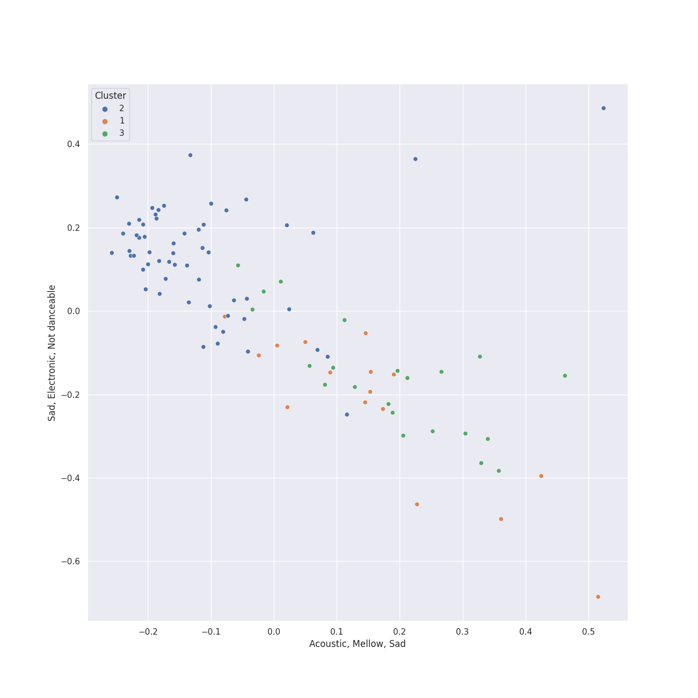

# Clusters in Columbia

## Cluster #1

41 tracks

| Art | Track | Album | Artists | Label | Rank | 💚 | 🔗 |
|:---|:---|:---|:---|:---|---:|:---|:---|
|  | Only the Good Die Young | The Stranger | [Billy Joel](../../../../artists/billy_joel/overview.md) | [Columbia](../..) | nan | 💚 | [🔗](https://open.spotify.com/track/2xabqm0YNQCTcPteQjJ22K) |
|  | My Life | 52nd Street | [Billy Joel](../../../../artists/billy_joel/overview.md) | [Columbia](../..) | nan | 💚 | [🔗](https://open.spotify.com/track/4ZoBC5MhSEzuknIgAkBaoT) |
|  | Don't Ask Me Why | Glass Houses | [Billy Joel](../../../../artists/billy_joel/overview.md) | [Columbia](../..) | nan | 💚 | [🔗](https://open.spotify.com/track/6g4vHtdGqD5eEgpf7nKISk) |
|  | Get Lucky (feat. Pharrell Williams and Nile Rodgers) | Random Access Memories | [Daft Punk](../../../../artists/daft_punk/overview.md), Pharrell Williams, Nile Rodgers | [Columbia](../..) | 349 | 💚 | [🔗](https://open.spotify.com/track/69kOkLUCkxIZYexIgSG8rq) |
|  | Sweet Dreams | I AM...SASHA FIERCE | [Beyoncé](../../../../artists/beyoncé/overview.md) | [Music World Music/Columbia](../..) | nan | | [🔗](https://open.spotify.com/track/1FKxKGONukVFXWVJxAKmlz) |
|  | Countdown | 4 | [Beyoncé](../../../../artists/beyoncé/overview.md) | [Parkwood Entertainment/Columbia](../..) | nan | 💚 | [🔗](https://open.spotify.com/track/3axkNosdVQLZiq1HakuGhc) |
|  | Green Light (feat. André 3000) | Evolver | John Legend, André 3000 | [G.O.O.D. Music/Columbia](../..) | nan | 💚 | [🔗](https://open.spotify.com/track/72by3Re4C3eVEBXvsUo0zV) |
|  | Flowers | Endless Summer Vacation | Miley Cyrus | [Columbia](../..) | nan | 💚 | [🔗](https://open.spotify.com/track/7DSAEUvxU8FajXtRloy8M0) |
|  | Hey, Soul Sister | Save Me, San Francisco (Golden Gate Edition) | Train | [Columbia](../..) | nan | | [🔗](https://open.spotify.com/track/4HlFJV71xXKIGcU3kRyttv) |
|  | JA ARA E | The Lion King: The Gift | Burna Boy | [Parkwood Entertainment/Columbia](../..) | nan | 💚 | [🔗](https://open.spotify.com/track/6pdip6qgVJOI5JxqgbAlu6) |
## Cluster #2

37 tracks

| Art | Track | Album | Artists | Label | Rank | 💚 | 🔗 |
|:---|:---|:---|:---|:---|---:|:---|:---|
|  | Just the Way You Are | The Stranger | [Billy Joel](../../../../artists/billy_joel/overview.md) | [Columbia](../..) | 743 | 💚 | [🔗](https://open.spotify.com/track/06RdYCp0UxsBtWsonHfSZz) |
|  | Vienna | The Stranger | [Billy Joel](../../../../artists/billy_joel/overview.md) | [Columbia](../..) | nan | 💚 | [🔗](https://open.spotify.com/track/7gREIuHognJFspylIDJ94p) |
|  | Turn the Lights Back On | Turn the Lights Back On | [Billy Joel](../../../../artists/billy_joel/overview.md) | [Columbia](../..) | nan | 💚 | [🔗](https://open.spotify.com/track/1KTemUlHzS0SvVtTjY1NTw) |
|  | Travelin' Soldier | Home | The Chicks | [Open Wide/Monument/Columbia](../..) | nan | 💚 | [🔗](https://open.spotify.com/track/0AkZjWYCMJ8wWiNex7LmkY) |
|  | Landslide | Home | The Chicks | [Open Wide/Monument/Columbia](../..) | nan | 💚 | [🔗](https://open.spotify.com/track/5hviCr3lgg6LY6noG6DPKs) |
|  | That Wasn't Me | Bear Creek | Brandi Carlile | [Columbia](../..) | nan | 💚 | [🔗](https://open.spotify.com/track/6iqAJh3X8bf94eo4reme5L) |
|  | The Sound of Silence - Acoustic Version | Wednesday Morning, 3 A.M. | [Simon & Garfunkel](../../../../artists/simon___garfunkel/overview.md) | [Columbia](../..) | nan | 💚 | [🔗](https://open.spotify.com/track/5y788ya4NvwhBznoDIcXwK) |
|  | Take Me to Church | Hozier (Expanded Edition) | Hozier | [Columbia](../..) | nan | 💚 | [🔗](https://open.spotify.com/track/1CS7Sd1u5tWkstBhpssyjP) |
|  | Work Song | Hozier (Expanded Edition) | Hozier | [Columbia](../..) | nan | 💚 | [🔗](https://open.spotify.com/track/5TgEJ62DOzBpGxZ7WRsrqb) |
|  | Baby, It's Cold Outside (feat. Kelly Clarkson) | A Legendary Christmas: Deluxe Edition | John Legend, Kelly Clarkson | [Columbia](../..) | nan | | [🔗](https://open.spotify.com/track/54q6WgqyTXjwOSrevVR8z9) |
## Cluster #3

28 tracks

| Art | Track | Album | Artists | Label | Rank | 💚 | 🔗 |
|:---|:---|:---|:---|:---|---:|:---|:---|
|  | The Stranger | The Stranger | [Billy Joel](../../../../artists/billy_joel/overview.md) | [Columbia](../..) | nan | 💚 | [🔗](https://open.spotify.com/track/6ByRaaLxtbMFyIzQob2nDT) |
|  | The River of Dreams | River Of Dreams | [Billy Joel](../../../../artists/billy_joel/overview.md) | [Columbia](../..) | nan | | [🔗](https://open.spotify.com/track/30qVCFYKBtAENjTIBA8FPZ) |
|  | Not Ready to Make Nice | Taking The Long Way | The Chicks | [Open Wide/Columbia](../..) | nan | 💚 | [🔗](https://open.spotify.com/track/6LCEyZZHFF4ebF1Mike1s5) |
|  | Halo | I AM...SASHA FIERCE | [Beyoncé](../../../../artists/beyoncé/overview.md) | [Music World Music/Columbia](../..) | nan | 💚 | [🔗](https://open.spotify.com/track/3ERa3mEeOnrh2Mc47qM6T1) |
|  | Best Thing I Never Had | 4 | [Beyoncé](../../../../artists/beyoncé/overview.md) | [Parkwood Entertainment/Columbia](../..) | nan | | [🔗](https://open.spotify.com/track/3lBRNqXjPp2j3JMTCXDTNO) |
|  | I'd Rather Go Blind | Music From The Motion Picture Cadillac Records | [Beyoncé](../../../../artists/beyoncé/overview.md) | [Music World Music/Columbia](../..) | nan | 💚 | [🔗](https://open.spotify.com/track/45eZSR0jA15KPI2HXVSifw) |
|  | Sign of the Times | Harry Styles | Harry Styles | [Columbia](../..) | nan | 💚 | [🔗](https://open.spotify.com/track/5Ohxk2dO5COHF1krpoPigN) |
|  | Preach | Preach | John Legend | [Columbia](../..) | nan | | [🔗](https://open.spotify.com/track/2AaF78iCWISMWYog5RnSi5) |
|  | Sweater Weather | I Love You. | The Neighbourhood | [Columbia](../..) | nan | 💚 | [🔗](https://open.spotify.com/track/2QjOHCTQ1Jl3zawyYOpxh6) |
|  | Don't Stop Believin' (2022 Remaster) | Escape (2022 Remaster) | Journey | [Columbia](../..), [Legacy](../../../legacy) | nan | | [🔗](https://open.spotify.com/track/5RKQ5NdjSh2QzD4MaunT91) |