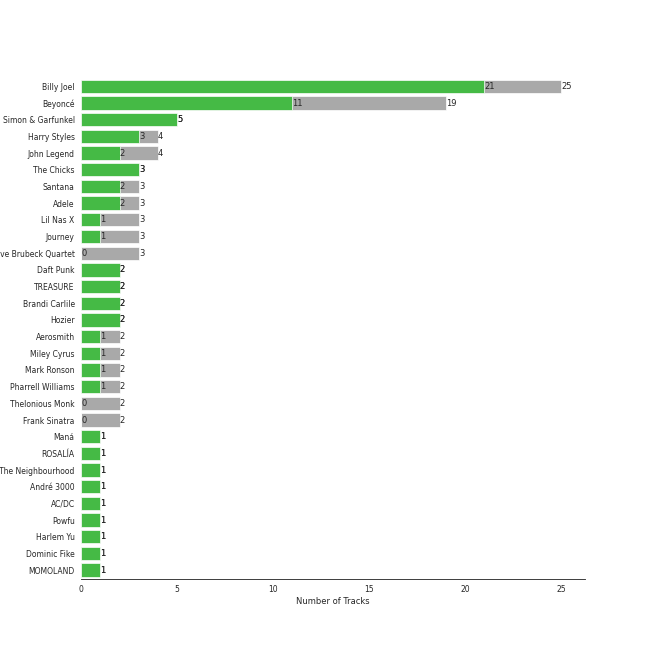
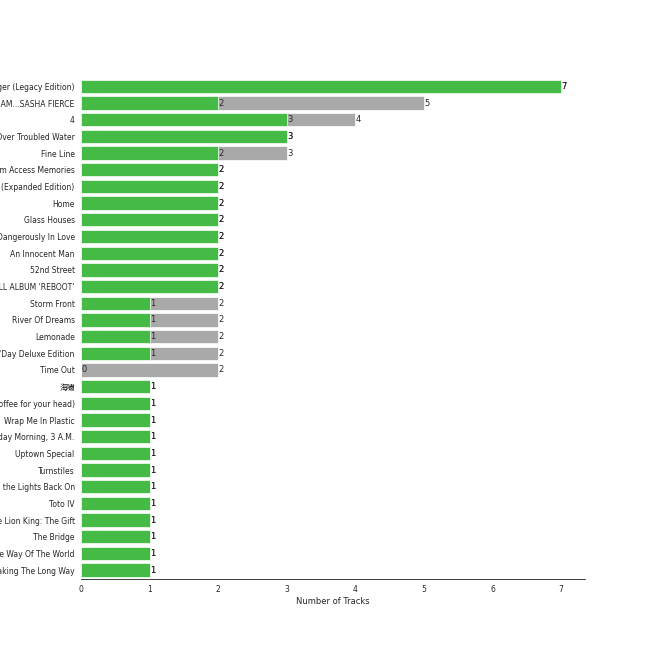
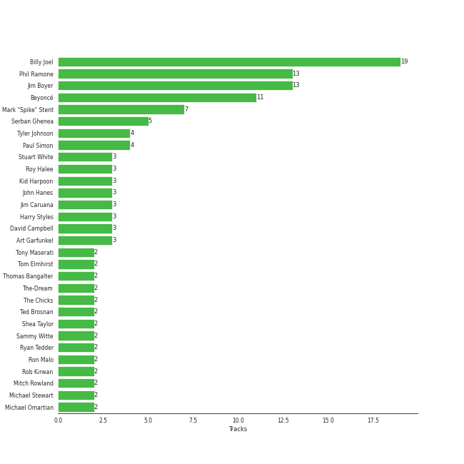

# Columbia

103 songs

[See Track Features](audio_features.md)

[See Clusters](clusters/overview.md)

Appears as:
- Columbia (65 tracks)
- Columbia/Legacy (14 tracks)
- Parkwood Entertainment/Columbia (8 tracks)
- Music World Music/Columbia (5 tracks)
- G.O.O.D. Music/Columbia (2 tracks)
- Open Wide/Monument/Columbia (2 tracks)
- YG Entertainment/Columbia Records (2 tracks)
- Columbia/B1 Recordings (1 tracks)
- Disruptor Records/Columbia (1 tracks)
- Legacy/Columbia (1 tracks)
- Open Wide/Columbia (1 tracks)
- XL Recordings/Columbia (1 tracks)

## Top Artists

| Art | Tracks | 💚 | Artist | 🔗 |
|:---|---:|---:|:---|:---|
|  | 24 | 17 | [Billy Joel](../../artists/billy_joel/overview.md) | [🔗](https://open.spotify.com/artist/6zFYqv1mOsgBRQbae3JJ9e) |
|  | 16 | 8 | [Beyoncé](../../artists/beyoncé/overview.md) | [🔗](https://open.spotify.com/artist/6vWDO969PvNqNYHIOW5v0m) |
|  | 5 | 5 | [Simon & Garfunkel](../../artists/simon___garfunkel/overview.md) | [🔗](https://open.spotify.com/artist/70cRZdQywnSFp9pnc2WTCE) |
|  | 4 | 3 | Harry Styles | [🔗](https://open.spotify.com/artist/6KImCVD70vtIoJWnq6nGn3) |
|  | 3 | 3 | The Chicks | [🔗](https://open.spotify.com/artist/25IG9fa7cbdmCIy3OnuH57) |
|  | 4 | 2 | John Legend | [🔗](https://open.spotify.com/artist/5y2Xq6xcjJb2jVM54GHK3t) |
|  | 3 | 2 | Adele | [🔗](https://open.spotify.com/artist/4dpARuHxo51G3z768sgnrY) |
|  | 2 | 2 | [Daft Punk](../../artists/daft_punk/overview.md) | [🔗](https://open.spotify.com/artist/4tZwfgrHOc3mvqYlEYSvVi) |
|  | 2 | 2 | [TREASURE](../../artists/treasure/overview.md) | [🔗](https://open.spotify.com/artist/3KonOYiLsU53m4yT7gNotP) |
|  | 2 | 2 | Hozier | [🔗](https://open.spotify.com/artist/2FXC3k01G6Gw61bmprjgqS) |

See all 59 artists

| Art | Tracks | 💚 | Artist | 🔗 |
|:---|---:|---:|:---|:---|
|  | 3 | 1 | Lil Nas X | [🔗](https://open.spotify.com/artist/7jVv8c5Fj3E9VhNjxT4snq) |
|  | 3 | 1 | Journey | [🔗](https://open.spotify.com/artist/0rvjqX7ttXeg3mTy8Xscbt) |
|  | 2 | 1 | Aerosmith | [🔗](https://open.spotify.com/artist/7Ey4PD4MYsKc5I2dolUwbH) |
|  | 2 | 1 | Miley Cyrus | [🔗](https://open.spotify.com/artist/5YGY8feqx7naU7z4HrwZM6) |
|  | 2 | 1 | Mark Ronson | [🔗](https://open.spotify.com/artist/3hv9jJF3adDNsBSIQDqcjp) |
|  | 2 | 1 | Brandi Carlile | [🔗](https://open.spotify.com/artist/2sG4zTOLvjKG1PSoOyf5Ej) |
|  | 1 | 1 | ROSALÍA | [🔗](https://open.spotify.com/artist/7ltDVBr6mKbRvohxheJ9h1) |
|  | 1 | 1 | The Neighbourhood | [🔗](https://open.spotify.com/artist/77SW9BnxLY8rJ0RciFqkHh) |
|  | 1 | 1 | André 3000 | [🔗](https://open.spotify.com/artist/74V3dE1a51skRkdII8y2C6) |
|  | 1 | 1 | AC/DC | [🔗](https://open.spotify.com/artist/711MCceyCBcFnzjGY4Q7Un) |
|  | 1 | 1 | Harlem Yu | [🔗](https://open.spotify.com/artist/6VbRanWSU3pdDhJnhSfGmY) |
|  | 1 | 1 | The Chainsmokers | [🔗](https://open.spotify.com/artist/69GGBxA162lTqCwzJG5jLp) |
|  | 1 | 1 | [MOMOLAND](../../artists/momoland/overview.md) | [🔗](https://open.spotify.com/artist/5RR0MLwcjc87wjSw2JYdwx) |
|  | 1 | 1 | Van Morrison | [🔗](https://open.spotify.com/artist/44NX2ffIYHr6D4n7RaZF7A) |
|  | 1 | 1 | Nile Rodgers | [🔗](https://open.spotify.com/artist/3yDIp0kaq9EFKe07X1X2rz) |
|  | 1 | 1 | Burna Boy | [🔗](https://open.spotify.com/artist/3wcj11K77LjEY1PkEazffa) |
|  | 1 | 1 | Pharrell Williams | [🔗](https://open.spotify.com/artist/2RdwBSPQiwcmiDo9kixcl8) |
|  | 1 | 1 | Halsey | [🔗](https://open.spotify.com/artist/26VFTg2z8YR0cCuwLzESi2) |
|  | 1 | 1 | Julian Casablancas | [🔗](https://open.spotify.com/artist/1rAv1GhTQ2rmG94p9lU3rB) |
|  | 1 | 1 | CHROMANCE | [🔗](https://open.spotify.com/artist/0fEj1fYIQwWj1bzzAto9rp) |
|  | 1 | 1 | [Bruno Mars](../../artists/bruno_mars/overview.md) | [🔗](https://open.spotify.com/artist/0du5cEVh5yTK9QJze8zA0C) |
|  | 3 | 0 | The Dave Brubeck Quartet | [🔗](https://open.spotify.com/artist/4iRZAbYvBqnxrbs6K25aJ7) |
|  | 2 | 0 | Thelonious Monk | [🔗](https://open.spotify.com/artist/4PDpGtF16XpqvXxsrFwQnN) |
|  | 2 | 0 | [Frank Sinatra](../../artists/frank_sinatra/overview.md) | [🔗](https://open.spotify.com/artist/1Mxqyy3pSjf8kZZL4QVxS0) |
|  | 1 | 0 | Lil Jon | [🔗](https://open.spotify.com/artist/7sfl4Xt5KmfyDs2T3SVSMK) |
|  | 1 | 0 | Calvin Harris | [🔗](https://open.spotify.com/artist/7CajNmpbOovFoOoasH2HaY) |
|  | 1 | 0 | Johnny Cash | [🔗](https://open.spotify.com/artist/6kACVPfCOnqzgfEF5ryl0x) |
|  | 1 | 0 | Billy Ray Cyrus | [🔗](https://open.spotify.com/artist/60rpJ9SgigSd16DOAG7GSa) |
|  | 1 | 0 | Cannonball Adderley | [🔗](https://open.spotify.com/artist/5v74mT11KGJqadf9sLw4dA) |
|  | 1 | 0 | [Rihanna](../../artists/rihanna/overview.md) | [🔗](https://open.spotify.com/artist/5pKCCKE2ajJHZ9KAiaK11H) |
|  | 1 | 0 | Gene Autry | [🔗](https://open.spotify.com/artist/5ixB75BQR3ADoWQkcHQJTs) |
|  | 1 | 0 | Jawsh 685 | [🔗](https://open.spotify.com/artist/56mfhUDKa1vec6rSLZV5Eg) |
|  | 1 | 0 | DJ Snake | [🔗](https://open.spotify.com/artist/540vIaP2JwjQb9dm3aArA4) |
|  | 1 | 0 | Mariah Carey | [🔗](https://open.spotify.com/artist/4iHNK0tOyZPYnBU7nGAgpQ) |
|  | 1 | 0 | Philly Joe Jones | [🔗](https://open.spotify.com/artist/4WhH68K75YKSAwHAqWFpi1) |
|  | 1 | 0 | JAY-Z | [🔗](https://open.spotify.com/artist/3nFkdlSjzX9mRTtwJOzDYB) |
|  | 1 | 0 | Dorothy Kirsten | [🔗](https://open.spotify.com/artist/3mMDsLh0ODpEuwpvn9sitk) |
|  | 1 | 0 | [BTS](../../artists/bts/overview.md) | [🔗](https://open.spotify.com/artist/3Nrfpe0tUJi4K4DXYWgMUX) |
|  | 1 | 0 | Kelly Clarkson | [🔗](https://open.spotify.com/artist/3BmGtnKgCSGYIUhmivXKWX) |
|  | 1 | 0 | Red Garland | [🔗](https://open.spotify.com/artist/35iymrFS4VnsKn35ebHKX9) |
|  | 1 | 0 | John Coltrane | [🔗](https://open.spotify.com/artist/2hGh5VOeeqimQFxqXvfCUf) |
|  | 1 | 0 | Herbie Hancock | [🔗](https://open.spotify.com/artist/2ZvrvbQNrHKwjT7qfGFFUW) |
|  | 1 | 0 | Jack Harlow | [🔗](https://open.spotify.com/artist/2LIk90788K0zvyj2JJVwkJ) |
|  | 1 | 0 | Destiny's Child | [🔗](https://open.spotify.com/artist/1Y8cdNmUJH7yBTd9yOvr5i) |
|  | 1 | 0 | Louis Armstrong | [🔗](https://open.spotify.com/artist/19eLuQmk9aCobbVDHc6eek) |
|  | 1 | 0 | Miles Davis | [🔗](https://open.spotify.com/artist/0kbYTNQb4Pb1rPbbaF0pT4) |
|  | 1 | 0 | Paul Chambers | [🔗](https://open.spotify.com/artist/0M1UOBJZ9tcKJbrbnVlHZG) |
| | 1 | 0 | B. Swanson Quartet | [🔗](https://open.spotify.com/artist/0JXiS2FrAg3wQYJHcmZdrc) |
|  | 1 | 0 | [Jason Derulo](../../artists/jason_derulo/overview.md) | [🔗](https://open.spotify.com/artist/07YZf4WDAMNwqr4jfgOZ8y) |

## Top Albums

| Art | Tracks | 💚 | Album | Release Date | 🔗 |
|:---|---:|---:|:---|:---|:---|
|  | 7 | 6 | The Stranger | 1977-09-29 | [🔗](https://open.spotify.com/album/3IILMjMMnoN2sKzgesX8KV) |
|  | 4 | 3 | 4 | 2011-06-24 | [🔗](https://open.spotify.com/album/1gIC63gC3B7o7FfpPACZQJ) |
|  | 4 | 2 | I AM...SASHA FIERCE | 2008-11-14 | [🔗](https://open.spotify.com/album/23Y5wdyP5byMFktZf8AcWU) |
|  | 3 | 3 | Bridge Over Troubled Water | 1970-01-26 | [🔗](https://open.spotify.com/album/0JwHz5SSvpYWuuCNbtYZoV) |
|  | 3 | 2 | Fine Line | 2019-12-13 | [🔗](https://open.spotify.com/album/7xV2TzoaVc0ycW7fwBwAml) |
|  | 2 | 2 | Random Access Memories | 2013-05-20 | [🔗](https://open.spotify.com/album/4m2880jivSbbyEGAKfITCa) |
|  | 2 | 2 | Piano Man | 1973-11-09 | [🔗](https://open.spotify.com/album/77ErLrVvYETIlQJHAwhfIH) |
|  | 2 | 2 | Hozier (Expanded Edition) | 2014-09-19 | [🔗](https://open.spotify.com/album/4Pv7m8D82A1Xun7xNCKZjJ) |
|  | 2 | 2 | Home | 2002-08-27 | [🔗](https://open.spotify.com/album/1zgQkZFMRqx1Lz9GVXghLt) |
|  | 2 | 2 | An Innocent Man | 1983-08-08 | [🔗](https://open.spotify.com/album/3R3x4zIabsvpD3yxqLaUpc) |

See all 74 albums

| Art | Tracks | 💚 | Album | Release Date | 🔗 |
|:---|---:|---:|:---|:---|:---|
|  | 2 | 2 | 2ND FULL ALBUM 'REBOOT' | 2023-07-28 | [🔗](https://open.spotify.com/album/4gQx8IC4zESV506dgNs0vR) |
|  | 2 | 1 | Storm Front | 1989-10-17 | [🔗](https://open.spotify.com/album/1Vw2uoVkLAJFVViJ1QyK1D) |
|  | 2 | 1 | River Of Dreams | 1993-08-10 | [🔗](https://open.spotify.com/album/4HPnwQJAEvTY910q4RNeOu) |
|  | 2 | 1 | Lemonade | 2016-04-23 | [🔗](https://open.spotify.com/album/7dK54iZuOxXFarGhXwEXfF) |
|  | 2 | 1 | B'Day Deluxe Edition | 2007-05-29 | [🔗](https://open.spotify.com/album/0Zd10MKN5j9KwUST0TdBBB) |
|  | 2 | 1 | 52nd Street | 1978-10-13 | [🔗](https://open.spotify.com/album/1HmCO8VK98AU6EXPOjGYyI) |
|  | 2 | 0 | Time Out | 1959-12-14 | [🔗](https://open.spotify.com/album/0nTTEAhCZsbbeplyDMIFuA) |
|  | 2 | 0 | Dangerously In Love | 2003-06-24 | [🔗](https://open.spotify.com/album/6oxVabMIqCMJRYN1GqR3Vf) |
|  | 1 | 1 | 海嘯 | 2001-05-10 | [🔗](https://open.spotify.com/album/06yEqpc6KFxUZ5BxE7V7TN) |
|  | 1 | 1 | Wrap Me In Plastic | 2021-02-05 | [🔗](https://open.spotify.com/album/58VYPx8GBYTf3Sz2RyPApB) |
|  | 1 | 1 | Wednesday Morning, 3 A.M. | 1964-10-19 | [🔗](https://open.spotify.com/album/5pnJrocLlZ3FWEbcr2PTz0) |
|  | 1 | 1 | Uptown Special | 2015-01-12 | [🔗](https://open.spotify.com/album/3vLaOYCNCzngDf8QdBg2V1) |
|  | 1 | 1 | Turnstiles | 1976-05-19 | [🔗](https://open.spotify.com/album/7GiLfxL1su3MSqz7pmKMZi) |
|  | 1 | 1 | Turn the Lights Back On | 2024-02-01 | [🔗](https://open.spotify.com/album/4csPGLYTb7kt85U377UCuC) |
|  | 1 | 1 | The Lion King: The Gift | 2019-07-19 | [🔗](https://open.spotify.com/album/552zi1M53PQAX5OH4FIdTx) |
|  | 1 | 1 | The Bridge | 1986-07-28 | [🔗](https://open.spotify.com/album/2fRxSC6FtiAkhEDVZr2seH) |
|  | 1 | 1 | Taking The Long Way | 2006-05-23 | [🔗](https://open.spotify.com/album/2NeJdEWras0uSuzLPlJZk5) |
|  | 1 | 1 | Skyfall | 2012-10-04 | [🔗](https://open.spotify.com/album/6TwN6Lq9glwnG8kNp6chHY) |
|  | 1 | 1 | Music From The Motion Picture Cadillac Records | 2008-11-28 | [🔗](https://open.spotify.com/album/4b2zuwf7CPesdiTg1kFDjU) |
|  | 1 | 1 | MONTERO (Call Me By Your Name) | 2021-03-31 | [🔗](https://open.spotify.com/album/2Hjcfw8zHN4dJDZJGOzLd6) |
|  | 1 | 1 | Love In The Future (Expanded Edition) | 2013-08-30 | [🔗](https://open.spotify.com/album/4OTAx9un4e6NfoHuVRiOrC) |
|  | 1 | 1 | Infinity | 1978 | [🔗](https://open.spotify.com/album/7K4Nk5fHkCuzNm5A6mdo2U) |
|  | 1 | 1 | I Love You. | 2013-04-19 | [🔗](https://open.spotify.com/album/4xkM0BwLM9H2IUcbYzpcBI) |
|  | 1 | 1 | Harry Styles | 2017-05-12 | [🔗](https://open.spotify.com/album/1FZKIm3JVDCxTchXDo5jOV) |
|  | 1 | 1 | Greatest Hits Vol. III | 1997-06-13 | [🔗](https://open.spotify.com/album/3cJ6ZymbUcNGe1T8YZtGyE) |
|  | 1 | 1 | Give Up The Ghost | 2009-10-05 | [🔗](https://open.spotify.com/album/1NhFksWs1Nsz6wQI8ysTkv) |
|  | 1 | 1 | Flowers | 2023-01-13 | [🔗](https://open.spotify.com/album/7I0tjwFtxUwBC1vgyeMAax) |
|  | 1 | 1 | Evolver | 2008-10-27 | [🔗](https://open.spotify.com/album/11sKu4dBGvmEZTuVw9EC9A) |
|  | 1 | 1 | El Mal Querer | 2018-11-02 | [🔗](https://open.spotify.com/album/355bjCHzRJztCzaG5Za4gq) |
|  | 1 | 1 | Easy On Me | 2021-10-14 | [🔗](https://open.spotify.com/album/224jZ4sUX7OhAuMwaxp86S) |
|  | 1 | 1 | Closer | 2016-07-29 | [🔗](https://open.spotify.com/album/0rSLgV8p5FzfnqlEk4GzxE) |
|  | 1 | 1 | Bookends | 1968-04-03 | [🔗](https://open.spotify.com/album/3bzgbgiytguTDnwzflAZr2) |
|  | 1 | 1 | Blowin' Your Mind! | 1967-09 | [🔗](https://open.spotify.com/album/7dsWupQRlFuhG8FGiQAUjC) |
|  | 1 | 1 | Back In Black | 1980-07-25 | [🔗](https://open.spotify.com/album/6mUdeDZCsExyJLMdAfDuwh) |
|  | 1 | 1 | Aerosmith | 1973-01-05 | [🔗](https://open.spotify.com/album/19lEZSnCCbVEkKchoPQWDZ) |
|  | 1 | 0 | Turn Down for What | 2013-12-18 | [🔗](https://open.spotify.com/album/3zo0Hxh9rjJsdw2JAKReE3) |
|  | 1 | 0 | Toys In The Attic | 1975-04-08 | [🔗](https://open.spotify.com/album/36IxIOGEBAXVozDSiVs09B) |
|  | 1 | 0 | Time Further Out | 1961 | [🔗](https://open.spotify.com/album/0eMXd1VtCXCkuGWn9JjRDT) |
|  | 1 | 0 | This Is What You Came For | 2016-04-29 | [🔗](https://open.spotify.com/album/3pEgGUv379EDinvg1TN7Kt) |
|  | 1 | 0 | The Nylon Curtain | 1982-06-23 | [🔗](https://open.spotify.com/album/50bajZpetfL5T0iRCOR74J) |
|  | 1 | 0 | The Great American Songbook | 1929 | [🔗](https://open.spotify.com/album/3AiEMTv9oFDRaDjqv93mOU) |
|  | 1 | 0 | The Classic Christmas Album | 1945 | [🔗](https://open.spotify.com/album/2B9FcHKqz3PWJlh0yGnmM7) |
|  | 1 | 0 | Survivor | 2001-05-01 | [🔗](https://open.spotify.com/album/480AZOo2VQ1kf3GedAiKV9) |
|  | 1 | 0 | Straight, No Chaser | 1967 | [🔗](https://open.spotify.com/album/1BHwJqnHhuIryphXMZ0PMQ) |
|  | 1 | 0 | Solo Monk (Expanded Edition) | 1964 | [🔗](https://open.spotify.com/album/4Bxg4OFb2wA6IjoeuWilRF) |
|  | 1 | 0 | Savage Love (Laxed - Siren Beat) [BTS Remix] | 2020-10-02 | [🔗](https://open.spotify.com/album/5O6izFQ2veRaZOcQSyOi4o) |
|  | 1 | 0 | Rudolph The Red Nosed Reindeer And Other Christmas Classics | 1947 | [🔗](https://open.spotify.com/album/3BPDSjoJlho8oiUPUNrShM) |
|  | 1 | 0 | Preach | 2019-02-15 | [🔗](https://open.spotify.com/album/32r4o1R9a1lK5DoVXGEC7E) |
|  | 1 | 0 | Nothing Breaks Like a Heart (feat. Miley Cyrus) | 2018-11-30 | [🔗](https://open.spotify.com/album/2hBfao8GWZwHlUGDB8HVQO) |
|  | 1 | 0 | Milestones | 1958-04 | [🔗](https://open.spotify.com/album/56I4vUYWQ4aXLiyfo8XuZv) |
|  | 1 | 0 | Merry Christmas | 1994-10-28 | [🔗](https://open.spotify.com/album/61ulfFSmmxMhc2wCdmdMkN) |
|  | 1 | 0 | MONTERO | 2021-09-17 | [🔗](https://open.spotify.com/album/6pOiDiuDQqrmo5DbG0ZubR) |
|  | 1 | 0 | Head Hunters | 1973-10-26 | [🔗](https://open.spotify.com/album/5fmIolILp5NAtNYiRPjhzA) |
|  | 1 | 0 | Glass Houses | 1980-03-12 | [🔗](https://open.spotify.com/album/5sztejERqpktXEdemlUvU5) |
|  | 1 | 0 | Escape (Bonus Track Version) | 1981 | [🔗](https://open.spotify.com/album/43wpzak9OmQfrjyksuGwp0) |
|  | 1 | 0 | Departure | 1980 | [🔗](https://open.spotify.com/album/2OyVtIEp7O7a6o82DF4Ba5) |
|  | 1 | 0 | Cold Spring Harbor | 1971-11-01 | [🔗](https://open.spotify.com/album/274rMlKrr22086ohmwAJZA) |
|  | 1 | 0 | Christmas Songs by Sinatra | 1994-11-08 | [🔗](https://open.spotify.com/album/4XbPmVHP7EYBMoE7ZVjKCU) |
|  | 1 | 0 | Bear Creek | 2012-06-04 | [🔗](https://open.spotify.com/album/5b8YTIrc88vdnfRguZqvVE) |
|  | 1 | 0 | BEYONCÉ [Platinum Edition] | 2014-11-24 | [🔗](https://open.spotify.com/album/2UJwKSBUz6rtW4QLK74kQu) |
|  | 1 | 0 | At Folsom Prison | 1968-05-01 | [🔗](https://open.spotify.com/album/4TJIdlY9hGSSTO1kUs1neh) |
|  | 1 | 0 | A Legendary Christmas: Deluxe Edition | 2019-11-08 | [🔗](https://open.spotify.com/album/3wanKGZXsWXr6ZKdQrDtGu) |
|  | 1 | 0 | 7 EP | 2019-06-21 | [🔗](https://open.spotify.com/album/4IRiXE5NROxknUSAUSjMoO) |
|  | 1 | 0 | 30 | 2021-11-19 | [🔗](https://open.spotify.com/album/21jF5jlMtzo94wbxmJ18aa) |

## Genres

| Tracks | 💚 | Genre |
|---:|---:|:---|
| 39 | 28 | [rock](../../genres/rock/overview.md) |
| 35 | 25 | [classic rock](../../genres/classic_rock/overview.md) |
| 33 | 24 | [soft rock](../../genres/soft_rock/overview.md) |
| 33 | 24 | [mellow gold](../../genres/mellow_gold/overview.md) |
| 35 | 19 | [pop](../../genres/pop/overview.md) |
| 29 | 19 | [album rock](../../genres/album_rock/overview.md) |
| 28 | 19 | [heartland rock](../../genres/heartland_rock/overview.md) |
| 25 | 18 | [singer-songwriter](../../genres/singer-songwriter/overview.md) |
| 24 | 17 | [piano rock](../../genres/piano_rock/overview.md) |
| 17 | 8 | [r&b](../../genres/r_b/overview.md) |

See all 85 genres

| Tracks | 💚 | Genre |
|---:|---:|:---|
| 8 | 7 | [folk](../../genres/folk/overview.md) |
| 6 | 6 | folk rock |
| 9 | 5 | pop soul |
| 5 | 5 | melancholia |
| 6 | 3 | [hard rock](../../genres/hard_rock/overview.md) |
| 3 | 3 | [modern rock](../../genres/modern_rock/overview.md) |
| 3 | 3 | country dawn |
| 3 | 3 | country |
| 3 | 3 | contemporary country |
| 6 | 2 | [urban contemporary](../../genres/urban_contemporary/overview.md) |
| 4 | 2 | neo soul |
| 3 | 2 | [uk pop](../../genres/uk_pop/overview.md) |
| 3 | 2 | british soul |
| 2 | 2 | pov: indie |
| 2 | 2 | [k-pop boy group](../../genres/k-pop_boy_group/overview.md) |
| 2 | 2 | irish singer-songwriter |
| 2 | 2 | filter house |
| 2 | 2 | electro |
| 3 | 1 | lgbtq+ hip hop |
| 2 | 1 | new americana |
| 2 | 1 | modern folk rock |
| 2 | 1 | [lilith](../../genres/lilith/overview.md) |
| 2 | 1 | indie folk |
| 2 | 1 | [ectofolk](../../genres/ectofolk/overview.md) |
| 2 | 1 | [acoustic pop](../../genres/acoustic_pop/overview.md) |
| 1 | 1 | r&b en espanol |
| 1 | 1 | nigerian pop |
| 1 | 1 | nigerian hip hop |
| 1 | 1 | modern alternative rock |
| 1 | 1 | mandopop |
| 1 | 1 | [k-pop girl group](../../genres/k-pop_girl_group/overview.md) |
| 1 | 1 | [k-pop](../../genres/k-pop/overview.md) |
| 1 | 1 | dancehall |
| 1 | 1 | classic mandopop |
| 1 | 1 | azontobeats |
| 1 | 1 | australian rock |
| 1 | 1 | afrobeats |
| 7 | 0 | jazz |
| 5 | 0 | bebop |
| 4 | 0 | [adult standards](../../genres/adult_standards/overview.md) |
| 3 | 0 | jazz quartet |
| 3 | 0 | jazz piano |
| 3 | 0 | [dance pop](../../genres/dance_pop/overview.md) |
| 3 | 0 | contemporary post-bop |
| 2 | 0 | [vocal jazz](../../genres/vocal_jazz/overview.md) |
| 2 | 0 | [soul](../../genres/soul/overview.md) |
| 2 | 0 | pop dance |
| 2 | 0 | [lounge](../../genres/lounge/overview.md) |
| 2 | 0 | jazz trumpet |
| 2 | 0 | jazz trio |
| 2 | 0 | jazz fusion |
| 2 | 0 | edm |
| 2 | 0 | easy listening |
| 1 | 0 | yodeling |
| 1 | 0 | western swing |
| 1 | 0 | uk dance |
| 1 | 0 | traditional country |
| 1 | 0 | swing |
| 1 | 0 | progressive house |
| 1 | 0 | outlaw country |
| 1 | 0 | nz pop |
| 1 | 0 | new orleans jazz |
| 1 | 0 | jazz funk |
| 1 | 0 | instrumental funk |
| 1 | 0 | house |
| 1 | 0 | harlem renaissance |
| 1 | 0 | hard bop |
| 1 | 0 | girl group |
| 1 | 0 | electronic trap |
| 1 | 0 | electro house |
| 1 | 0 | dixieland |
| 1 | 0 | cowboy western |
| 1 | 0 | cool jazz |
| 1 | 0 | classic oklahoma country |
| 1 | 0 | arkansas country |

## Top Producers

| Art | Producer | Tracks | Credit Types |
|:---|:---|---:|:---|
|  | [Billy Joel](../../artists/billy_joel/overview.md) | 15 | Lyricist, Producer, Songwriter, Arranger |
| | Jim Boyer | 9 | Producer |
| | Phil Ramone | 9 | Producer |
|  | [Beyoncé](../../artists/beyoncé/overview.md) | 8 | Producer, Songwriter |
| | Mark "Spike" Stent | 6 | Producer |
| | Serban Ghenea | 5 | Producer |
|  | Paul Simon | 4 | Lyricist, Producer, Songwriter |
| | Tyler Johnson | 4 | Producer, Songwriter |
| | Roy Halee | 3 | Producer |
|  | Harry Styles | 3 | Songwriter |

View all

| Art | Producer | Tracks | Credit Types |
|:---|:---|---:|:---|
| | David Campbell | 3 | Arranger |
| | John Hanes | 3 | Producer |
| | DJ Swivel | 3 | Producer |
| | Kid Harpoon | 3 | Producer, Songwriter |
| | Art Garfunkel | 3 | Producer |
| | Jeff Bhasker | 2 | Producer, Songwriter |
| | Shea Taylor | 2 | Producer, Songwriter |
| | Guy-Manuel de Homem-Christo | 2 | Producer, Songwriter |
|  | The Chicks | 2 | Producer |
| | Rob Kirwan | 2 | Producer |
| | Ryan Tedder | 2 | Arranger, Producer, Songwriter |
|  | Adele | 2 | Songwriter |
| | Thomas Bangalter | 2 | Producer, Songwriter |
| | Michael Omartian | 2 | Arranger |
| | Ted Brosnan | 2 | Producer |
| | Stuart White | 2 | Producer |
| | Gary Paczosa | 2 | Producer |
| | Tom Elmhirst | 2 | Producer |
|  | Hozier | 2 | Arranger, Lyricist, Producer, Songwriter |
| | The-Dream | 2 | Songwriter |
| | Jim Caruana | 2 | Producer |
| | Ron Malo | 2 | Producer |
| | Eric Bickel | 2 | Producer |
| | Sammy Witte | 2 | Producer |
| | Michael Stewart | 2 | Producer |
| | Lloyd Maines | 2 | Producer |
| | Derek Dixie | 2 | Producer |
| | Mitch Rowland | 2 | Songwriter |
| | David Biral | 1 | Producer, Songwriter |
| | Kuk Harrell | 1 | Producer |
|  | [Bruno Mars](../../artists/bruno_mars/overview.md) | 1 | Producer, Songwriter |
| | Diana Gordon | 1 | Songwriter |
| | Jesse | 1 | Lyricist, Songwriter |
| | Bruce Robison | 1 | Lyricist, Songwriter |
| | Matthew Stevens | 1 | Producer |
| | Jim Horn | 1 | Arranger |
| | Steve Perry | 1 | Songwriter |
| | Ray Colcord | 1 | Producer |
| | Inaam Haq | 1 | Producer |
| | Robert Wilson | 1 | Songwriter |
| | Julian Burg | 1 | Producer |
| | Dan Wilson | 1 | Lyricist, Songwriter |
| | Richard "P2J" Isong | 1 | Producer, Songwriter |
| | Fred Tenny | 1 | Producer |
| | Justin Niebank | 1 | Producer |
| | Anne Preven | 1 | Songwriter |
|  | Van Morrison | 1 | Lyricist, Songwriter |
| | Scott Cutler | 1 | Songwriter |
| | Liberty DeVitto | 1 | Arranger |
| | Angus Young | 1 | Songwriter |
| | Jolie Levine | 1 | Arranger |
| | Riccardo Damian | 1 | Producer |
| | Charlie Wilson | 1 | Songwriter |
| | Zachary Abels | 1 | Songwriter |
| | Kevin Cossom | 1 | Songwriter |
| | Tony Platt | 1 | Producer |
| | Emily Robison | 1 | Lyricist, Songwriter |
| | Brad Samuelsohn | 1 | Producer |
| | Steve Churchyard | 1 | Producer |
| | Malcolm Young | 1 | Songwriter |
| | Jaycen Joshua | 1 | Producer |
| | Andrew Scheps | 1 | Producer |
| | Steve Lindsey | 1 | Arranger, Producer |
| | Greg Kurstin | 1 | Producer, Songwriter |
| | Matthew Scatchell | 1 | Producer |
| | Alex Salibian | 1 | Producer, Songwriter |
| | Bruce Botnick | 1 | Producer |
| | Caryl Weinstock | 1 | Producer |
| | Devin Nakao | 1 | Producer |
| | Aynsley Dunbar | 1 | Producer |
| | Cainon Lamb | 1 | Songwriter |
| | BC Jean | 1 | Songwriter |
| | Tony Brown | 1 | Producer |
| | Toby Gad | 1 | Arranger, Producer, Songwriter |
| | Cecil Bernardy | 1 | Producer |
| | Wayne Gordon | 1 | Producer |
| | John Hendrickson | 1 | Producer |
| | Stevie Nicks | 1 | Lyricist, Songwriter |
| | Michael Bivins | 1 | Songwriter |
| | Leanne Ungar | 1 | Producer |
|  | Mark Ronson | 1 | Producer, Songwriter |
|  | Julian Casablancas | 1 | Producer, Songwriter |
| | Isaac Slade | 1 | Songwriter |
|  | Nile Rodgers | 1 | Songwriter |
| | Omer Fedi | 1 | Producer, Songwriter |
| | Denzel Baptiste | 1 | Producer, Songwriter |
| | Lonnie Simmons | 1 | Songwriter |
| | Brent Kutzle | 1 | Producer |
| | E. Kidd Bogart | 1 | Songwriter |
| | Doug Stegmeyer | 1 | Arranger |

## Tracks released under Columbia

| Art | Track | Album | Artists | Label | 💚 | 🔗 |
|:---|:---|:---|:---|:---|:---|:---|
|  | Back In Black | Back In Black | AC/DC | [Columbia](.) | 💚 | [🔗](https://open.spotify.com/track/08mG3Y1vljYA6bvDt4Wqkj) |
|  | Skyfall | Skyfall | Adele | [Columbia](.), [XL Recordings](../xl_recordings) | 💚 | [🔗](https://open.spotify.com/track/6VObnIkLVruX4UVyxWhlqm) |
|  | Easy On Me | Easy On Me | Adele | [Columbia](.) | 💚 | [🔗](https://open.spotify.com/track/0gplL1WMoJ6iYaPgMCL0gX) |
|  | Oh My God | 30 | Adele | [Columbia](.) | | [🔗](https://open.spotify.com/track/3Kkjo3cT83cw09VJyrLNwX) |
|  | Dream On | Aerosmith | Aerosmith | [Columbia](.) | 💚 | [🔗](https://open.spotify.com/track/5MxNLUsfh7uzROypsoO5qe) |
|  | Walk This Way | Toys In The Attic | Aerosmith | [Columbia](.) | | [🔗](https://open.spotify.com/track/5SZ6zX4rOrEQferfFC2MfP) |
|  | Crazy In Love (feat. Jay-Z) | Dangerously In Love | [Beyoncé](../../artists/beyoncé/overview.md), JAY-Z | [Columbia](.) | | [🔗](https://open.spotify.com/track/5IVuqXILoxVWvWEPm82Jxr) |
|  | Naughty Girl | Dangerously In Love | [Beyoncé](../../artists/beyoncé/overview.md) | [Columbia](.) | | [🔗](https://open.spotify.com/track/0YGQ3hZcRLC5YX7o0hdmHg) |
|  | Irreplaceable | B'Day Deluxe Edition | [Beyoncé](../../artists/beyoncé/overview.md) | [Columbia](.) | | [🔗](https://open.spotify.com/track/6RX5iL93VZ5fKmyvNXvF1r) |
|  | Listen (From the Motion Picture "Dreamgirls") | B'Day Deluxe Edition | [Beyoncé](../../artists/beyoncé/overview.md) | [Columbia](.) | 💚 | [🔗](https://open.spotify.com/track/4z7Ja0RNran3XpIvc1PIQz) |

See all tracks

| Art | Track | Album | Artists | Label | 💚 | 🔗 |
|:---|:---|:---|:---|:---|:---|:---|
|  | Ave Maria | I AM...SASHA FIERCE | [Beyoncé](../../artists/beyoncé/overview.md) | [Music World Music/Columbia](.) | | [🔗](https://open.spotify.com/track/1j9HwUMSkRUeVFRWlHcFsy) |
|  | Halo | I AM...SASHA FIERCE | [Beyoncé](../../artists/beyoncé/overview.md) | [Music World Music/Columbia](.) | 💚 | [🔗](https://open.spotify.com/track/3ERa3mEeOnrh2Mc47qM6T1) |
|  | If I Were a Boy | I AM...SASHA FIERCE | [Beyoncé](../../artists/beyoncé/overview.md) | [Music World Music/Columbia](.) | 💚 | [🔗](https://open.spotify.com/track/26NX1wPt1TRCH536yocd6i) |
|  | Sweet Dreams | I AM...SASHA FIERCE | [Beyoncé](../../artists/beyoncé/overview.md) | [Music World Music/Columbia](.) | | [🔗](https://open.spotify.com/track/1FKxKGONukVFXWVJxAKmlz) |
|  | I'd Rather Go Blind | Music From The Motion Picture Cadillac Records | [Beyoncé](../../artists/beyoncé/overview.md) | [Music World Music/Columbia](.) | 💚 | [🔗](https://open.spotify.com/track/45eZSR0jA15KPI2HXVSifw) |
|  | Best Thing I Never Had | 4 | [Beyoncé](../../artists/beyoncé/overview.md) | [Parkwood Entertainment/Columbia](.) | | [🔗](https://open.spotify.com/track/3lBRNqXjPp2j3JMTCXDTNO) |
|  | Countdown | 4 | [Beyoncé](../../artists/beyoncé/overview.md) | [Parkwood Entertainment/Columbia](.) | 💚 | [🔗](https://open.spotify.com/track/3axkNosdVQLZiq1HakuGhc) |
|  | I Was Here | 4 | [Beyoncé](../../artists/beyoncé/overview.md) | [Parkwood Entertainment/Columbia](.) | 💚 | [🔗](https://open.spotify.com/track/64Tp4KN5U5rtqrasP5a7FH) |
|  | Love On Top | 4 | [Beyoncé](../../artists/beyoncé/overview.md) | [Parkwood Entertainment/Columbia](.) | 💚 | [🔗](https://open.spotify.com/track/1z6WtY7X4HQJvzxC4UgkSf) |
|  | Partition | BEYONCÉ [Platinum Edition] | [Beyoncé](../../artists/beyoncé/overview.md) | [Parkwood Entertainment/Columbia](.) | | [🔗](https://open.spotify.com/track/5hgnY0mVcVetszbb85qeDg) |
|  | Daddy Lessons | Lemonade | [Beyoncé](../../artists/beyoncé/overview.md) | [Parkwood Entertainment/Columbia](.) | 💚 | [🔗](https://open.spotify.com/track/71OvX5NNLrmz7rpq1ANTQn) |
|  | Hold Up | Lemonade | [Beyoncé](../../artists/beyoncé/overview.md) | [Parkwood Entertainment/Columbia](.) | | [🔗](https://open.spotify.com/track/0rzNMzZsubFcXSEh7dnem7) |
|  | She's Got a Way | Cold Spring Harbor | [Billy Joel](../../artists/billy_joel/overview.md) | [Columbia](.) | | [🔗](https://open.spotify.com/track/3Ie2eLOIj2IhKnzPwXrLbJ) |
|  | Captain Jack | Piano Man | [Billy Joel](../../artists/billy_joel/overview.md) | [Columbia](.) | 💚 | [🔗](https://open.spotify.com/track/3igkLltDaiFiMl83IdDBfm) |
|  | Piano Man | Piano Man | [Billy Joel](../../artists/billy_joel/overview.md) | [Columbia](.) | 💚 | [🔗](https://open.spotify.com/track/78WVLOP9pN0G3gRLFy1rAa) |
|  | New York State of Mind | Turnstiles | [Billy Joel](../../artists/billy_joel/overview.md) | [Columbia](.) | 💚 | [🔗](https://open.spotify.com/track/6yjKlmm7vOszkXEUku1EM1) |
|  | Just the Way You Are | The Stranger | [Billy Joel](../../artists/billy_joel/overview.md) | [Columbia](.) | 💚 | [🔗](https://open.spotify.com/track/06RdYCp0UxsBtWsonHfSZz) |
|  | Movin' Out (Anthony's Song) | The Stranger | [Billy Joel](../../artists/billy_joel/overview.md) | [Columbia](.) | 💚 | [🔗](https://open.spotify.com/track/4cG3ovmC8Hnp9ZsmSZI2O4) |
|  | Only the Good Die Young | The Stranger | [Billy Joel](../../artists/billy_joel/overview.md) | [Columbia](.) | 💚 | [🔗](https://open.spotify.com/track/2xabqm0YNQCTcPteQjJ22K) |
|  | Scenes from an Italian Restaurant | The Stranger | [Billy Joel](../../artists/billy_joel/overview.md) | [Columbia](.) | 💚 | [🔗](https://open.spotify.com/track/2rhFaau65TFMv4mACtE9it) |
|  | She's Always a Woman | The Stranger | [Billy Joel](../../artists/billy_joel/overview.md) | [Columbia](.) | | [🔗](https://open.spotify.com/track/3ILLSvTYvFjjEdbxvQumOb) |
|  | The Stranger | The Stranger | [Billy Joel](../../artists/billy_joel/overview.md) | [Columbia](.) | 💚 | [🔗](https://open.spotify.com/track/6ByRaaLxtbMFyIzQob2nDT) |
|  | Vienna | The Stranger | [Billy Joel](../../artists/billy_joel/overview.md) | [Columbia](.) | 💚 | [🔗](https://open.spotify.com/track/7gREIuHognJFspylIDJ94p) |
|  | Big Shot | 52nd Street | [Billy Joel](../../artists/billy_joel/overview.md) | [Columbia](.) | | [🔗](https://open.spotify.com/track/22wxe2Yc9JzihICXYLGAQ7) |
|  | My Life | 52nd Street | [Billy Joel](../../artists/billy_joel/overview.md) | [Columbia](.) | 💚 | [🔗](https://open.spotify.com/track/4ZoBC5MhSEzuknIgAkBaoT) |
|  | Don't Ask Me Why | Glass Houses | [Billy Joel](../../artists/billy_joel/overview.md) | [Columbia](.) | | [🔗](https://open.spotify.com/track/6g4vHtdGqD5eEgpf7nKISk) |
|  | Pressure | The Nylon Curtain | [Billy Joel](../../artists/billy_joel/overview.md) | [Columbia](.) | | [🔗](https://open.spotify.com/track/3LqvmDtXWXjF7fg8mh8iZh) |
|  | The Longest Time | An Innocent Man | [Billy Joel](../../artists/billy_joel/overview.md) | [Columbia](.) | 💚 | [🔗](https://open.spotify.com/track/5DH7nDryMhpixm4G4B7RP9) |
|  | Uptown Girl | An Innocent Man | [Billy Joel](../../artists/billy_joel/overview.md) | [Columbia](.) | 💚 | [🔗](https://open.spotify.com/track/5zA8vzDGqPl2AzZkEYQGKh) |
|  | A Matter of Trust | The Bridge | [Billy Joel](../../artists/billy_joel/overview.md) | [Columbia](.) | 💚 | [🔗](https://open.spotify.com/track/6J212smZzpeOCYQ9DITMSC) |
|  | And So It Goes | Storm Front | [Billy Joel](../../artists/billy_joel/overview.md) | [Columbia](.) | 💚 | [🔗](https://open.spotify.com/track/1u7kQUb3lQcpHaYRfia13A) |
|  | We Didn't Start the Fire | Storm Front | [Billy Joel](../../artists/billy_joel/overview.md) | [Columbia](.) | | [🔗](https://open.spotify.com/track/3Cx4yrFaX8CeHwBMReOWXI) |
|  | Lullabye (Goodnight, My Angel) | River Of Dreams | [Billy Joel](../../artists/billy_joel/overview.md) | [Columbia](.) | 💚 | [🔗](https://open.spotify.com/track/4cURHmiuYii52BVbhrGbv0) |
|  | The River of Dreams | River Of Dreams | [Billy Joel](../../artists/billy_joel/overview.md) | [Columbia](.) | | [🔗](https://open.spotify.com/track/30qVCFYKBtAENjTIBA8FPZ) |
|  | Light As the Breeze | Greatest Hits Vol. III | [Billy Joel](../../artists/billy_joel/overview.md) | [Columbia](.) | 💚 | [🔗](https://open.spotify.com/track/1irDnW4t5Ph52hR2xuNtmF) |
|  | Turn the Lights Back On | Turn the Lights Back On | [Billy Joel](../../artists/billy_joel/overview.md) | [Columbia](.) | 💚 | [🔗](https://open.spotify.com/track/1KTemUlHzS0SvVtTjY1NTw) |
|  | Caroline | Give Up The Ghost | Brandi Carlile | [Columbia](.) | 💚 | [🔗](https://open.spotify.com/track/4DVgaZDTvz72q3jAepAAbe) |
|  | That Wasn't Me | Bear Creek | Brandi Carlile | [Columbia](.) | | [🔗](https://open.spotify.com/track/6iqAJh3X8bf94eo4reme5L) |
|  | JA ARA E | The Lion King: The Gift | Burna Boy | [Parkwood Entertainment/Columbia](.) | 💚 | [🔗](https://open.spotify.com/track/6pdip6qgVJOI5JxqgbAlu6) |
|  | This Is What You Came For | This Is What You Came For | Calvin Harris, [Rihanna](../../artists/rihanna/overview.md) | [Columbia](.) | | [🔗](https://open.spotify.com/track/0azC730Exh71aQlOt9Zj3y) |
|  | Turn Down for What | Turn Down for What | DJ Snake, Lil Jon | [Columbia](.) | | [🔗](https://open.spotify.com/track/67awxiNHNyjMXhVgsHuIrs) |
|  | Get Lucky (feat. Pharrell Williams and Nile Rodgers) | Random Access Memories | [Daft Punk](../../artists/daft_punk/overview.md), Pharrell Williams, Nile Rodgers | [Columbia](.) | 💚 | [🔗](https://open.spotify.com/track/69kOkLUCkxIZYexIgSG8rq) |
|  | Instant Crush (feat. Julian Casablancas) | Random Access Memories | [Daft Punk](../../artists/daft_punk/overview.md), Julian Casablancas | [Columbia](.) | 💚 | [🔗](https://open.spotify.com/track/2cGxRwrMyEAp8dEbuZaVv6) |
|  | Bootylicious | Survivor | Destiny's Child | [Columbia](.) | | [🔗](https://open.spotify.com/track/31CsLSgn0HdZEVC8Bnnmvr) |
|  | Baby, It's Cold Outside (with Dorothy Kirsten) | The Classic Christmas Album | [Frank Sinatra](../../artists/frank_sinatra/overview.md), Dorothy Kirsten | [Columbia](.), [Legacy](../legacy) | | [🔗](https://open.spotify.com/track/3wvG6oGSZ6c7oskNDsI1CY) |
|  | Let It Snow! Let It Snow! Let It Snow! (with The B. Swanson Quartet) | Christmas Songs by Sinatra | [Frank Sinatra](../../artists/frank_sinatra/overview.md), B. Swanson Quartet | [Columbia](.), [Legacy](../legacy) | | [🔗](https://open.spotify.com/track/4kKdvXD0ez7jp1296JmAts) |
|  | Here Comes Santa Claus (Right Down Santa Claus Lane) - 1947 Version | Rudolph The Red Nosed Reindeer And Other Christmas Classics | Gene Autry | [Columbia](.), [Legacy](../legacy) | | [🔗](https://open.spotify.com/track/25leEEaz1gIpp7o21Fqyjo) |
|  | 情非得已 | 海嘯 | Harlem Yu | [Columbia](.) | 💚 | [🔗](https://open.spotify.com/track/4KBegMBVyHsfC7fPOztTzV) |
|  | Sign of the Times | Harry Styles | Harry Styles | [Columbia](.) | 💚 | [🔗](https://open.spotify.com/track/5Ohxk2dO5COHF1krpoPigN) |
|  | Adore You | Fine Line | Harry Styles | [Columbia](.) | | [🔗](https://open.spotify.com/track/3jjujdWJ72nww5eGnfs2E7) |
|  | Falling | Fine Line | Harry Styles | [Columbia](.) | 💚 | [🔗](https://open.spotify.com/track/1ZMiCix7XSAbfAJlEZWMCp) |
|  | Watermelon Sugar | Fine Line | Harry Styles | [Columbia](.) | 💚 | [🔗](https://open.spotify.com/track/6UelLqGlWMcVH1E5c4H7lY) |
|  | Watermelon Man | Head Hunters | Herbie Hancock | [Columbia](.), [Legacy](../legacy) | | [🔗](https://open.spotify.com/track/2zQl59dZMzwhrmeSBEgiXY) |
|  | Take Me to Church | Hozier (Expanded Edition) | Hozier | [Columbia](.) | 💚 | [🔗](https://open.spotify.com/track/1CS7Sd1u5tWkstBhpssyjP) |
|  | Work Song | Hozier (Expanded Edition) | Hozier | [Columbia](.) | 💚 | [🔗](https://open.spotify.com/track/5TgEJ62DOzBpGxZ7WRsrqb) |
|  | Savage Love (Laxed – Siren Beat) [BTS Remix] | Savage Love (Laxed - Siren Beat) [BTS Remix] | Jawsh 685, [Jason Derulo](../../artists/jason_derulo/overview.md), [BTS](../../artists/bts/overview.md) | [Columbia](.) | | [🔗](https://open.spotify.com/track/4TgxFMOn5yoESW6zCidCXL) |
|  | Green Light (feat. André 3000) | Evolver | John Legend, André 3000 | [G.O.O.D. Music/Columbia](.) | 💚 | [🔗](https://open.spotify.com/track/72by3Re4C3eVEBXvsUo0zV) |
|  | All of Me | Love In The Future (Expanded Edition) | John Legend | [G.O.O.D. Music/Columbia](.) | 💚 | [🔗](https://open.spotify.com/track/3U4isOIWM3VvDubwSI3y7a) |
|  | Preach | Preach | John Legend | [Columbia](.) | | [🔗](https://open.spotify.com/track/2AaF78iCWISMWYog5RnSi5) |
|  | Baby, It's Cold Outside (feat. Kelly Clarkson) | A Legendary Christmas: Deluxe Edition | John Legend, Kelly Clarkson | [Columbia](.) | | [🔗](https://open.spotify.com/track/54q6WgqyTXjwOSrevVR8z9) |
|  | Folsom Prison Blues - Live at Folsom State Prison, Folsom, CA - January 1968 | At Folsom Prison | Johnny Cash | [Columbia](.), [Legacy](../legacy) | | [🔗](https://open.spotify.com/track/2fDHuS1PTkHBbCWWZF1ph9) |
|  | Lights | Infinity | Journey | [Columbia](.), [Legacy](../legacy) | 💚 | [🔗](https://open.spotify.com/track/7EHmKkyAr6MZv5Y2FdZbXw) |
|  | Any Way You Want It | Departure | Journey | [Columbia](.), [Legacy](../legacy) | | [🔗](https://open.spotify.com/track/71SvEDmsOwIWw1IozsZoMA) |
|  | Don't Stop Believin' | Escape (Bonus Track Version) | Journey | [Columbia](.) | | [🔗](https://open.spotify.com/track/4bHsxqR3GMrXTxEPLuK5ue) |
|  | Old Town Road - Remix | 7 EP | Lil Nas X, Billy Ray Cyrus | [Columbia](.) | | [🔗](https://open.spotify.com/track/2YpeDb67231RjR0MgVLzsG) |
|  | MONTERO (Call Me By Your Name) | MONTERO (Call Me By Your Name) | Lil Nas X | [Columbia](.) | 💚 | [🔗](https://open.spotify.com/track/67BtfxlNbhBmCDR2L2l8qd) |
|  | INDUSTRY BABY (feat. Jack Harlow) | MONTERO | Lil Nas X, Jack Harlow | [Columbia](.) | | [🔗](https://open.spotify.com/track/5Z9KJZvQzH6PFmb8SNkxuk) |
|  | Mack the Knife | The Great American Songbook | Louis Armstrong | [Columbia](.), [Legacy](../legacy) | | [🔗](https://open.spotify.com/track/0RNxWy0PC3AyH4ThH3aGK6) |
|  | Wrap Me In Plastic | Wrap Me In Plastic | [MOMOLAND](../../artists/momoland/overview.md), CHROMANCE | [Columbia/B1 Recordings](.) | 💚 | [🔗](https://open.spotify.com/track/5mpWGq83n0sIgGRopGk5QZ) |
|  | All I Want for Christmas Is You | Merry Christmas | Mariah Carey | [Columbia](.) | | [🔗](https://open.spotify.com/track/0bYg9bo50gSsH3LtXe2SQn) |
|  | Uptown Funk (feat. Bruno Mars) | Uptown Special | Mark Ronson, [Bruno Mars](../../artists/bruno_mars/overview.md) | [Columbia](.) | 💚 | [🔗](https://open.spotify.com/track/32OlwWuMpZ6b0aN2RZOeMS) |
|  | Nothing Breaks Like a Heart (feat. Miley Cyrus) | Nothing Breaks Like a Heart (feat. Miley Cyrus) | Mark Ronson, Miley Cyrus | [Columbia](.) | | [🔗](https://open.spotify.com/track/27rdGxbavYJeBphck5MZAF) |
|  | Milestones (feat. John Coltrane, Cannonball Adderley, Red Garland, Paul Chambers & Philly Joe Jones) | Milestones | Miles Davis, John Coltrane, Cannonball Adderley, Red Garland, Paul Chambers, Philly Joe Jones | [Columbia](.), [Legacy](../legacy) | | [🔗](https://open.spotify.com/track/1xicvSO4CJ2ymqYgpk7DFh) |
|  | Flowers | Flowers | Miley Cyrus | [Columbia](.) | 💚 | [🔗](https://open.spotify.com/track/0yLdNVWF3Srea0uzk55zFn) |
|  | MALAMENTE - Cap.1: Augurio | El Mal Querer | ROSALÍA | [Columbia](.) | 💚 | [🔗](https://open.spotify.com/track/1B0BQaSRHxhI0AUlItY3LK) |
|  | The Sound of Silence - Acoustic Version | Wednesday Morning, 3 A.M. | [Simon & Garfunkel](../../artists/simon___garfunkel/overview.md) | [Columbia](.) | 💚 | [🔗](https://open.spotify.com/track/5y788ya4NvwhBznoDIcXwK) |
|  | Mrs. Robinson - From "The Graduate" Soundtrack | Bookends | [Simon & Garfunkel](../../artists/simon___garfunkel/overview.md) | [Columbia](.) | 💚 | [🔗](https://open.spotify.com/track/0iOZM63lendWRTTeKhZBSC) |
|  | Bridge Over Troubled Water | Bridge Over Troubled Water | [Simon & Garfunkel](../../artists/simon___garfunkel/overview.md) | [Columbia](.) | 💚 | [🔗](https://open.spotify.com/track/6l8EbYRtQMgKOyc1gcDHF9) |
|  | Cecilia | Bridge Over Troubled Water | [Simon & Garfunkel](../../artists/simon___garfunkel/overview.md) | [Columbia](.) | 💚 | [🔗](https://open.spotify.com/track/6QhXQOpyYvbpdbyjgAqKdY) |
|  | The Boxer | Bridge Over Troubled Water | [Simon & Garfunkel](../../artists/simon___garfunkel/overview.md) | [Columbia](.) | 💚 | [🔗](https://open.spotify.com/track/76TZCvJ8GitQ2FA1q5dKu0) |
|  | BONA BONA | 2ND FULL ALBUM 'REBOOT' | [TREASURE](../../artists/treasure/overview.md) | [Columbia](.), [YG Entertainment](../yg_entertainment) | 💚 | [🔗](https://open.spotify.com/track/0IkWksfw3Qxob96bjFKhyF) |
|  | MOVE (T5) | 2ND FULL ALBUM 'REBOOT' | [TREASURE](../../artists/treasure/overview.md) | [Columbia](.), [YG Entertainment](../yg_entertainment) | 💚 | [🔗](https://open.spotify.com/track/6ce3rQ3j3vfRics2YiHWbW) |
|  | Closer | Closer | The Chainsmokers, Halsey | [Disruptor Records/Columbia](.) | 💚 | [🔗](https://open.spotify.com/track/7BKLCZ1jbUBVqRi2FVlTVw) |
|  | Landslide | Home | The Chicks | [Open Wide/Monument/Columbia](.) | 💚 | [🔗](https://open.spotify.com/track/5hviCr3lgg6LY6noG6DPKs) |
|  | Travelin' Soldier | Home | The Chicks | [Open Wide/Monument/Columbia](.) | 💚 | [🔗](https://open.spotify.com/track/0AkZjWYCMJ8wWiNex7LmkY) |
|  | Not Ready to Make Nice | Taking The Long Way | The Chicks | [Open Wide/Columbia](.) | 💚 | [🔗](https://open.spotify.com/track/6LCEyZZHFF4ebF1Mike1s5) |
|  | Blue Rondo à la Turk | Time Out | The Dave Brubeck Quartet | [Columbia](.), [Legacy](../legacy) | | [🔗](https://open.spotify.com/track/7CrNF9zL7tIQ2269DVxzST) |
|  | Take Five | Time Out | The Dave Brubeck Quartet | [Columbia](.), [Legacy](../legacy) | | [🔗](https://open.spotify.com/track/1YQWosTIljIvxAgHWTp7KP) |
|  | Unsquare Dance | Time Further Out | The Dave Brubeck Quartet | [Columbia](.), [Legacy](../legacy) | | [🔗](https://open.spotify.com/track/2VUo8O3ymKRYNgj97ZG2kM) |
|  | Sweater Weather | I Love You. | The Neighbourhood | [Columbia](.) | 💚 | [🔗](https://open.spotify.com/track/2QjOHCTQ1Jl3zawyYOpxh6) |
|  | I'm Confessin' (That I Love You) | Solo Monk (Expanded Edition) | Thelonious Monk | [Columbia](.), [Legacy](../legacy) | | [🔗](https://open.spotify.com/track/6kLp24Op7cOu8iQkU46sBv) |
|  | Straight, No Chaser | Straight, No Chaser | Thelonious Monk | [Columbia](.), [Legacy](../legacy) | | [🔗](https://open.spotify.com/track/6YYu8qFzcY1ZyzzsJIQM12) |
|  | Brown Eyed Girl | Blowin' Your Mind! | Van Morrison | [Columbia](.), [Legacy](../legacy) | 💚 | [🔗](https://open.spotify.com/track/3yrSvpt2l1xhsV9Em88Pul) |

