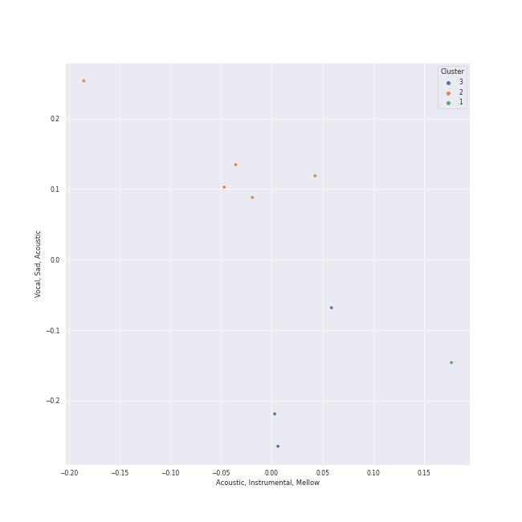

# Clusters in Craft Recordings

## Cluster #1

1 tracks

| Art | Track | Album | Artists | Label | Rank | 💚 | 🔗 |
|:---|:---|:---|:---|:---|---:|:---|:---|
|  | Unforgettable | Unforgettable: With Love | Natalie Cole, Nat King Cole | [Craft Recordings](../..) | nan | | [🔗](https://open.spotify.com/track/2MVQbDuhVs2muWFURtIdNb) |
## Cluster #2

5 tracks

| Art | Track | Album | Artists | Label | Rank | 💚 | 🔗 |
|:---|:---|:---|:---|:---|---:|:---|:---|
|  | Have You Ever Seen The Rain | Pendulum (Expanded Edition) | Creedence Clearwater Revival | [Craft Recordings](../..) | nan | | [🔗](https://open.spotify.com/track/2LawezPeJhN4AWuSB0GtAU) |
|  | Fortunate Son | Willy And The Poor Boys (Expanded Edition) | Creedence Clearwater Revival | [Craft Recordings](../..) | nan | | [🔗](https://open.spotify.com/track/4BP3uh0hFLFRb5cjsgLqDh) |
|  | Proud Mary | Bayou Country (Expanded Edition) | Creedence Clearwater Revival | [Craft Recordings](../..) | nan | | [🔗](https://open.spotify.com/track/6pxWv6GV35VGmcPf5dh6CH) |
|  | Skating | A Charlie Brown Christmas [2012 Remastered & Expanded Edition] | Vince Guaraldi Trio | [Craft Recordings](../..) | nan | | [🔗](https://open.spotify.com/track/4Gu4Z1RQ68h8fQnSDQxfKr) |
|  | Linus And Lucy | A Charlie Brown Christmas [2012 Remastered & Expanded Edition] | Vince Guaraldi Trio | [Craft Recordings](../..) | nan | | [🔗](https://open.spotify.com/track/5N96qwzTDhbf2y6FWAVz4c) |
## Cluster #3

3 tracks

| Art | Track | Album | Artists | Label | Rank | 💚 | 🔗 |
|:---|:---|:---|:---|:---|---:|:---|:---|
|  | Maybe They're Magic | Into The Woods (2022 Broadway Cast Recording) | [Sara Bareilles](../../../../artists/sara_bareilles/overview.md), Brian D'Arcy James | [Craft Recordings](../..) | nan | | [🔗](https://open.spotify.com/track/6Aj19aOQntdfSpHDl9DxOw) |
|  | Giants In The Sky | Into The Woods (2022 Broadway Cast Recording) | Cole Thompson | [Craft Recordings](../..) | 289 | | [🔗](https://open.spotify.com/track/3RDesmUopi3TgcFJdPAZnN) |
|  | L-O-V-E | Unforgettable: With Love | Natalie Cole | [Craft Recordings](../..) | nan | | [🔗](https://open.spotify.com/track/637xWjdmJY7CAQJsnsT7Fs) |