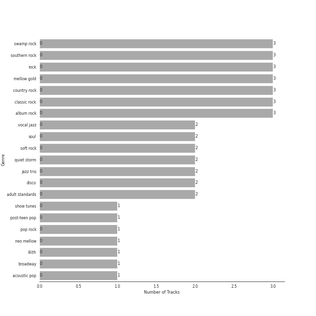

# Craft Recordings

11 songs

[See Track Features](audio_features.md)

[See Clusters](clusters/overview.md)

Appears as:
- Craft Recordings (11 tracks)

## Top Artists

| Art | Rank | Tracks | 💚 | Artist | 🔗 |
|:---|---:|---:|---:|:---|:---|
|  | 410 | 3 | 0 | Creedence Clearwater Revival | [🔗](https://open.spotify.com/artist/3IYUhFvPQItj6xySrBmZkd) |
|  | 410 | 2 | 0 | Natalie Cole | [🔗](https://open.spotify.com/artist/5tTsrGPwQRWUsHR2Xf7Ke9) |
|  | 410 | 2 | 0 | Vince Guaraldi Trio | [🔗](https://open.spotify.com/artist/4ytkhMSAnrDP8XzRNlw9FS) |
|  | 237 | 1 | 0 | Nat King Cole | [🔗](https://open.spotify.com/artist/7v4imS0moSyGdXyLgVTIV7) |
|  | 410 | 1 | 0 | Brian D'Arcy James | [🔗](https://open.spotify.com/artist/3oYQrBzEQNpxnjWXP54B4n) |
|  | 228 | 1 | 0 | Cole Thompson | [🔗](https://open.spotify.com/artist/2t5453S7ue4vkqbt0An4F8) |
|  | 25 | 1 | 0 | [Sara Bareilles](../../artists/sara_bareilles/overview.md) | [🔗](https://open.spotify.com/artist/2Sqr0DXoaYABbjBo9HaMkM) |
| | 410 | 1 | 0 | Patina Miller | [🔗](https://open.spotify.com/artist/1V5Hq88OkI5tpsh1EKxStp) |
|  | 410 | 1 | 0 | ‘Into The Woods’ 2022 Broadway Cast | [🔗](https://open.spotify.com/artist/080apEI56n6y4wL1epxCDo) |

## Top Albums

| Art | Rank | Tracks | 💚 | Album | Release Date | 🔗 |
|:---|---:|---:|---:|:---|:---|:---|
|  | 260 | 4 | 0 | Into The Woods (2022 Broadway Cast Recording) | 2022-09-30 | [🔗](https://open.spotify.com/album/5z6BFXI711HbSAXDjgOAHE) |
|  | 603 | 2 | 0 | Unforgettable: With Love | 1991-06-11 | [🔗](https://open.spotify.com/album/4ilUfGGQXin7hr1srDDXF0) |
|  | 603 | 2 | 0 | A Charlie Brown Christmas [2012 Remastered & Expanded Edition] | 2012-01-01 | [🔗](https://open.spotify.com/album/2XnNY3GEkbWHor5kyvXLu4) |
|  | 603 | 1 | 0 | Willy And The Poor Boys (Expanded Edition) | 1969-11-02 | [🔗](https://open.spotify.com/album/31q47gQszFt0CddSyMksgO) |
|  | 603 | 1 | 0 | Pendulum (Expanded Edition) | 1970-12-07 | [🔗](https://open.spotify.com/album/372cMadhAGlNuDnc8TssqF) |
|  | 603 | 1 | 0 | Bayou Country (Expanded Edition) | 1969-01-05 | [🔗](https://open.spotify.com/album/5pCRW9AT4BgoMOS52pRoJq) |

## Genres

| Tracks | 💚 | Genre |
|---:|---:|:---|
| 3 | 0 | swamp rock |
| 3 | 0 | southern rock |
| 3 | 0 | [rock](../../genres/rock/overview.md) |
| 3 | 0 | [mellow gold](../../genres/mellow_gold/overview.md) |
| 3 | 0 | country rock |
| 3 | 0 | [classic rock](../../genres/classic_rock/overview.md) |
| 3 | 0 | [album rock](../../genres/album_rock/overview.md) |
| 2 | 0 | [vocal jazz](../../genres/vocal_jazz/overview.md) |
| 2 | 0 | [soul](../../genres/soul/overview.md) |
| 2 | 0 | [soft rock](../../genres/soft_rock/overview.md) |

See all 22 genres

| Tracks | 💚 | Genre |
|---:|---:|:---|
| 2 | 0 | quiet storm |
| 2 | 0 | jazz trio |
| 2 | 0 | disco |
| 2 | 0 | [adult standards](../../genres/adult_standards/overview.md) |
| 1 | 0 | [show tunes](../../genres/show_tunes/overview.md) |
| 1 | 0 | [post-teen pop](../../genres/post-teen_pop/overview.md) |
| 1 | 0 | [pop rock](../../genres/pop_rock/overview.md) |
| 1 | 0 | [neo mellow](../../genres/neo_mellow/overview.md) |
| 1 | 0 | [lilith](../../genres/lilith/overview.md) |
| 1 | 0 | [ectofolk](../../genres/ectofolk/overview.md) |
| 1 | 0 | [broadway](../../genres/broadway/overview.md) |
| 1 | 0 | [acoustic pop](../../genres/acoustic_pop/overview.md) |

## Tracks released under Craft Recordings

| Art | Track | Album | Artists | Label | Rank | 💚 | 🔗 |
|:---|:---|:---|:---|:---|---:|:---|:---|
|  | Giants In The Sky | Into The Woods (2022 Broadway Cast Recording) | Cole Thompson | [Craft Recordings](.) | 358 | | [🔗](https://open.spotify.com/track/3RDesmUopi3TgcFJdPAZnN) |
|  | Proud Mary | Bayou Country (Expanded Edition) | Creedence Clearwater Revival | [Craft Recordings](.) | 900 | | [🔗](https://open.spotify.com/track/6pxWv6GV35VGmcPf5dh6CH) |
|  | Fortunate Son | Willy And The Poor Boys (Expanded Edition) | Creedence Clearwater Revival | [Craft Recordings](.) | 900 | | [🔗](https://open.spotify.com/track/4BP3uh0hFLFRb5cjsgLqDh) |
|  | Have You Ever Seen The Rain | Pendulum (Expanded Edition) | Creedence Clearwater Revival | [Craft Recordings](.) | 900 | | [🔗](https://open.spotify.com/track/2LawezPeJhN4AWuSB0GtAU) |
|  | L-O-V-E | Unforgettable: With Love | Natalie Cole | [Craft Recordings](.) | 900 | | [🔗](https://open.spotify.com/track/637xWjdmJY7CAQJsnsT7Fs) |
|  | Unforgettable | Unforgettable: With Love | Natalie Cole, Nat King Cole | [Craft Recordings](.) | 900 | | [🔗](https://open.spotify.com/track/2MVQbDuhVs2muWFURtIdNb) |
|  | Linus And Lucy | A Charlie Brown Christmas [2012 Remastered & Expanded Edition] | Vince Guaraldi Trio | [Craft Recordings](.) | 900 | | [🔗](https://open.spotify.com/track/5N96qwzTDhbf2y6FWAVz4c) |
|  | Skating | A Charlie Brown Christmas [2012 Remastered & Expanded Edition] | Vince Guaraldi Trio | [Craft Recordings](.) | 900 | | [🔗](https://open.spotify.com/track/4Gu4Z1RQ68h8fQnSDQxfKr) |
|  | Last Midnight | Into The Woods (2022 Broadway Cast Recording) | Patina Miller | [Craft Recordings](.) | 900 | | [🔗](https://open.spotify.com/track/190CwRKLa5UIuTwv42AZfj) |
|  | Maybe They're Magic | Into The Woods (2022 Broadway Cast Recording) | [Sara Bareilles](../../artists/sara_bareilles/overview.md), Brian D'Arcy James | [Craft Recordings](.) | 900 | | [🔗](https://open.spotify.com/track/6Aj19aOQntdfSpHDl9DxOw) |

See all tracks

| Art | Track | Album | Artists | Label | Rank | 💚 | 🔗 |
|:---|:---|:---|:---|:---|---:|:---|:---|
|  | Prologue: Into The Woods | Into The Woods (2022 Broadway Cast Recording) | ‘Into The Woods’ 2022 Broadway Cast | [Craft Recordings](.) | 900 | | [🔗](https://open.spotify.com/track/5mJcu6XoLf0uiYMjpVL3hs) |

