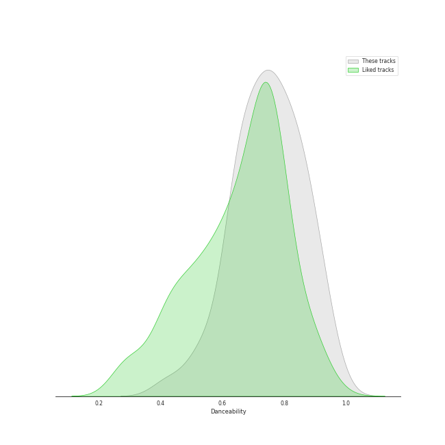
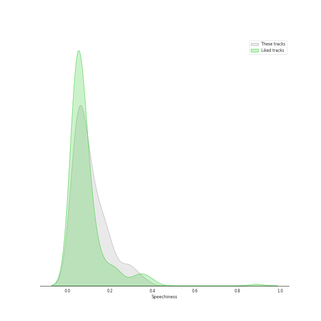
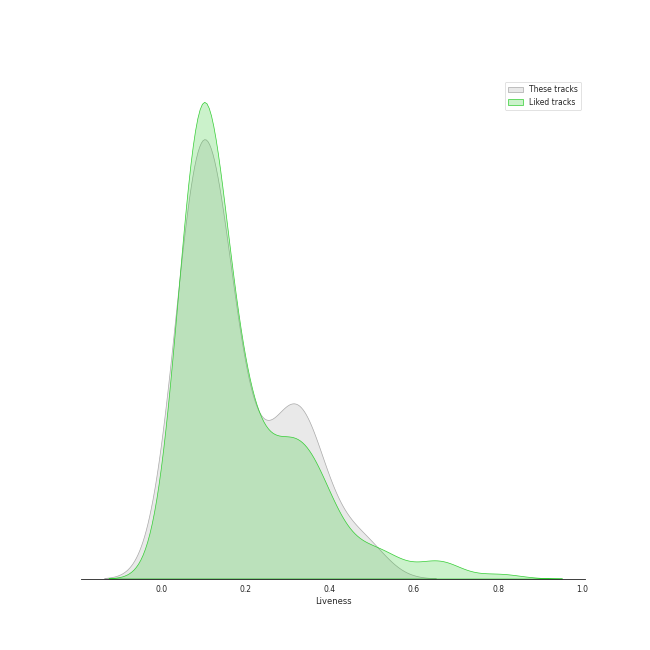
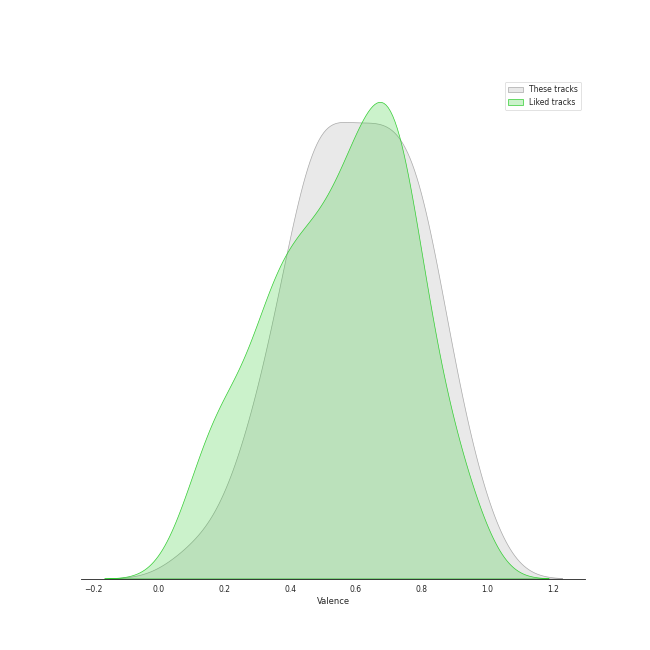

# Audio Features for CUBE ENTERTAINMENT

## Danceability

| ​ | 10 most Danceable tracks | ​​ | 10 least Danceable tracks |
|:---|:---|:---|:---|
|  | Idle song (0.933) |  | Sparkling Night (0.422) |
|  | Jelly (0.921) |  | LIAR (0.511) |
|  | Pepe (0.879) |  | Crazy (0.54) |
|  | Feelin' Like (0.868) |  | Allergy (0.591) |
|  | LOVE (0.853) |  | ESCAPE (0.619) |
|  | Bubble Pop! (0.84) |  | Hobgoblin (0.621) |
|  | MY BAG (0.838) |  | Missing You (0.633) |
|  | Trouble Maker (0.838) |  | DARK (X-file) (0.638) |
|  | Queencard (0.815) |  | Like It (0.648) |
|  | All Night (0.809) |  | Sculpture (0.65) |

## Energy

| ​ | 10 most Energetic tracks | ​​ | 10 least Energetic tracks |
|:---|:---|:---|:---|
|  | Sparkling Night (0.935) |  | Idle song (0.615) |
|  | Crazy (0.929) |  | Sculpture (0.629) |
|  | $$$ (0.926) |  | Feelin' Like (0.682) |
|  | Allergy (0.92) |  | Jelly (0.692) |
|  | Never Stop Me (0.914) |  | Because It's Christmas (0.695) |
|  | Nxde (0.91) |  | ESCAPE (0.717) |
|  | Hate (0.902) |  | HANN (Alone) (0.718) |
|  | LIAR (0.893) |  | No (0.722) |
|  | Hobgoblin (0.873) |  | Missing You (0.736) |
|  | Bubble Pop! (0.871) |  | VILLAIN DIES (0.743) |

## Speechiness

| ​ | 10 most Speechy tracks | ​​ | 10 least Speechy tracks |
|:---|:---|:---|:---|
|  | Feelin' Like (0.353) |  | ESCAPE (0.0295) |
|  | Sparkling Night (0.299) |  | HANN (Alone) (0.0312) |
|  | LIAR (0.289) |  | Because It's Christmas (0.0345) |
|  | Crazy (0.279) |  | MAZE (0.0358) |
|  | LATATA (0.224) |  | Senorita (0.0362) |
|  | Allergy (0.185) |  | Pepe (0.0375) |
|  | Nxde (0.179) |  | All Night (0.0392) |
|  | ALREADY (0.174) |  | BLACK DRESS (0.0419) |
|  | MY BAG (0.164) |  | Like It (0.043) |
|  | Hate (0.163) |  | Queencard (0.0475) |

## Acousticness

| ​ | 10 most Acoustic tracks | ​​ | 10 least Acoustic tracks |
|:---|:---|:---|:---|
|  | Missing You (0.65) |  | Lip & Hip (0.00117) |
|  | ALREADY (0.571) |  | Like It (0.00228) |
|  | Idle song (0.489) |  | LATATA (0.00427) |
|  | Jelly (0.466) |  | Crazy (0.00584) |
|  | Because It's Christmas (0.419) |  | No (0.00785) |
|  | Shine (0.411) |  | TOMBOY (0.00988) |
|  | ESCAPE (0.251) |  | All Night (0.0145) |
|  | VILLAIN DIES (0.247) |  | Senorita (0.0159) |
|  | Fiction (0.223) |  | Hobgoblin (0.0194) |
|  | Sparkling Night (0.197) |  | BLACK DRESS (0.0307) |

## Instrumentalness

| ​ | 10 most Instrumental tracks | ​​ | 10 least Instrumental tracks |
|:---|:---|:---|:---|
|  | Bubble Pop! (0.00392) |  | TOMBOY (0.0) |
|  | No (0.000326) |  | Never Stop Me (0.0) |
|  | Queencard (0.000268) |  | Idle song (0.0) |
|  | MY BAG (7.12e-05) |  | All Night (0.0) |
|  | Senorita (4.33e-05) |  | Hobgoblin (0.0) |
|  | Jelly (2.4e-05) |  | Pepe (0.0) |
|  | Lip & Hip (8.49e-06) |  | Missing You (0.0) |
|  | ALREADY (7.84e-06) |  | Allergy (0.0) |
|  | Nxde (7.81e-06) |  | LIAR (0.0) |
|  | Crazy (4.11e-06) |  | ESCAPE (0.0) |

## Liveness

| ​ | 10 most Live tracks | ​​ | 10 least Live tracks |
|:---|:---|:---|:---|
|  | Hobgoblin (0.488) |  | DARK (X-file) (0.0372) |
|  | Nxde (0.479) |  | BLACK DRESS (0.0386) |
|  | Crazy (0.424) |  | Allergy (0.0467) |
|  | Fiction (0.373) |  | Shine (0.0578) |
|  | Never Stop Me (0.337) |  | All Night (0.0625) |
|  | LIAR (0.332) |  | $$$ (0.0664) |
|  | Senorita (0.331) |  | Feelin' Like (0.0665) |
|  | VILLAIN DIES (0.3) |  | Trouble Maker (0.0778) |
|  | Bubble Pop! (0.285) |  | Pepe (0.0797) |
|  | LATATA (0.283) |  | ESCAPE (0.0809) |

## Valence

| ​ | 10 most Happy tracks | ​​ | 10 least Happy tracks |
|:---|:---|:---|:---|
|  | Pepe (0.966) |  | HANN (Alone) (0.24) |
|  | Trouble Maker (0.952) |  | Sculpture (0.261) |
|  | $$$ (0.882) |  | ESCAPE (0.309) |
|  | Feelin' Like (0.861) |  | Change (0.313) |
|  | BLACK DRESS (0.816) |  | VILLAIN DIES (0.353) |
|  | Shine (0.791) |  | LOVE (0.374) |
|  | Bubble Pop! (0.767) |  | DARK (X-file) (0.393) |
|  | MY BAG (0.759) |  | Hobgoblin (0.401) |
|  | Jelly (0.729) |  | Senorita (0.42) |
|  | Queencard (0.692) |  | Because It's Christmas (0.452) |

## Tempo

| ​ | 10 most Fast tracks | ​​ | 10 least Fast tracks |
|:---|:---|:---|:---|
|  | Crazy (176.019) |  | VILLAIN DIES (77.008) |
|  | LIAR (173.73) |  | ALREADY (91.832) |
|  | Hobgoblin (169.91) |  | MY BAG (94.024) |
|  | Sparkling Night (169.883) |  | Like It (97.021) |
|  | Missing You (168.05) |  | LATATA (98.1) |
|  | DARK (X-file) (165.924) |  | MAZE (99.99) |
|  | Allergy (165.087) |  | HANN (Alone) (104.971) |
|  | $$$ (151.115) |  | LOVE (104.99) |
|  | Shine (150.013) |  | All Night (107.025) |
|  | Hate (149.96) |  | BLACK DRESS (108.001) |
