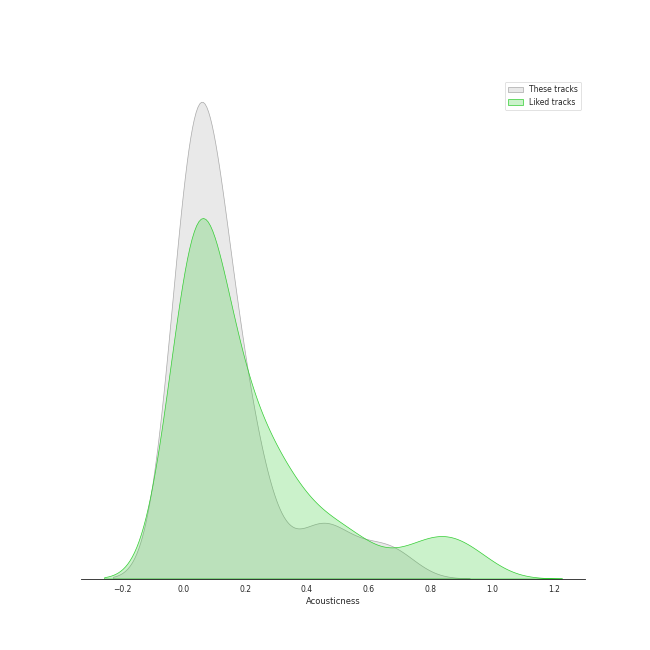
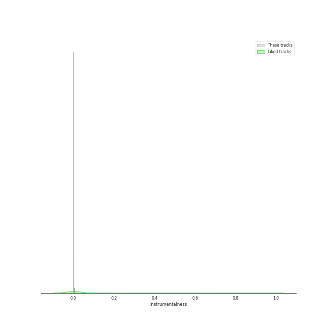
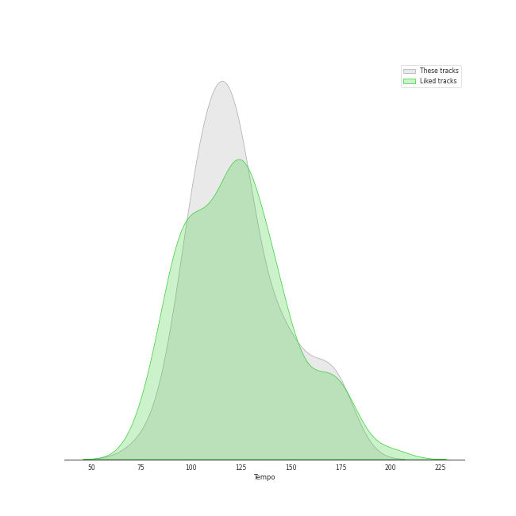

# Audio Features for CUBE ENTERTAINMENT

## Danceability

| 10 most Danceable tracks | 10 least Danceable tracks |
|:---|:---|
| Idle song (0.933) | Sparkling Night (0.422) |
| Jelly (0.921) | LIAR (0.511) |
| Pepe (0.879) | Crazy (0.54) |
| Feelin' Like (0.868) | ESCAPE (0.619) |
| LOVE (0.853) | Hobgoblin (0.621) |
| Bubble Pop! (0.84) | Missing You (0.633) |
| MY BAG (0.838) | DARK (X-file) (0.638) |
| Trouble Maker (0.838) | Like It (0.648) |
| Senorita (0.782) | Sculpture (0.65) |
| LATATA (0.774) | ALREADY (0.663) |

## Energy

| 10 most Energetic tracks | 10 least Energetic tracks |
|:---|:---|
| Sparkling Night (0.935) | Idle song (0.615) |
| Crazy (0.929) | Sculpture (0.629) |
| $$$ (0.926) | Feelin' Like (0.682) |
| Never Stop Me (0.914) | Jelly (0.692) |
| Nxde (0.91) | Because It's Christmas (0.695) |
| Hate (0.902) | ESCAPE (0.717) |
| LIAR (0.893) | HANN (Alone) (0.718) |
| Hobgoblin (0.873) | No (0.722) |
| Bubble Pop! (0.871) | Missing You (0.736) |
| TOMBOY (0.87) | VILLAIN DIES (0.743) |

## Speechiness

| 10 most Speechy tracks | 10 least Speechy tracks |
|:---|:---|
| Feelin' Like (0.353) | ESCAPE (0.0295) |
| Sparkling Night (0.299) | HANN (Alone) (0.0312) |
| LIAR (0.289) | Because It's Christmas (0.0345) |
| Crazy (0.279) | MAZE (0.0358) |
| LATATA (0.224) | Senorita (0.0362) |
| Nxde (0.179) | Pepe (0.0375) |
| ALREADY (0.174) | BLACK DRESS (0.0419) |
| MY BAG (0.164) | Like It (0.043) |
| Hate (0.163) | Change (0.0484) |
| Sculpture (0.16) | Trouble Maker (0.0541) |

## Acousticness

| 10 most Acoustic tracks | 10 least Acoustic tracks |
|:---|:---|
| Missing You (0.65) | Like It (0.00228) |
| ALREADY (0.571) | LATATA (0.00427) |
| Idle song (0.489) | Crazy (0.00584) |
| Jelly (0.466) | No (0.00785) |
| Because It's Christmas (0.419) | TOMBOY (0.00988) |
| Shine (0.411) | Senorita (0.0159) |
| ESCAPE (0.251) | Hobgoblin (0.0194) |
| VILLAIN DIES (0.247) | BLACK DRESS (0.0307) |
| Fiction (0.223) | Never Stop Me (0.0364) |
| Sparkling Night (0.197) | Nxde (0.0413) |

## Instrumentalness

| 10 most Instrumental tracks | 10 least Instrumental tracks |
|:---|:---|
| Bubble Pop! (0.00392) | TOMBOY (0.0) |
| No (0.000326) | Never Stop Me (0.0) |
| MY BAG (7.12e-05) | Idle song (0.0) |
| Senorita (4.33e-05) | Hobgoblin (0.0) |
| Jelly (2.4e-05) | Pepe (0.0) |
| ALREADY (7.84e-06) | Missing You (0.0) |
| Nxde (7.81e-06) | LIAR (0.0) |
| Crazy (4.11e-06) | ESCAPE (0.0) |
| Trouble Maker (3.77e-06) | BLACK DRESS (0.0) |
| Like It (1.43e-06) | Because It's Christmas (0.0) |

## Liveness

| 10 most Live tracks | 10 least Live tracks |
|:---|:---|
| Hobgoblin (0.488) | DARK (X-file) (0.0372) |
| Nxde (0.479) | BLACK DRESS (0.0386) |
| Crazy (0.424) | Shine (0.0578) |
| Fiction (0.373) | $$$ (0.0664) |
| Never Stop Me (0.337) | Feelin' Like (0.0665) |
| LIAR (0.332) | Trouble Maker (0.0778) |
| Senorita (0.331) | Pepe (0.0797) |
| VILLAIN DIES (0.3) | ESCAPE (0.0809) |
| Bubble Pop! (0.285) | Sparkling Night (0.0851) |
| LATATA (0.283) | TOMBOY (0.0917) |

## Valence

| 10 most Happy tracks | 10 least Happy tracks |
|:---|:---|
| Pepe (0.966) | HANN (Alone) (0.24) |
| Trouble Maker (0.952) | Sculpture (0.261) |
| $$$ (0.882) | ESCAPE (0.309) |
| Feelin' Like (0.861) | Change (0.313) |
| BLACK DRESS (0.816) | VILLAIN DIES (0.353) |
| Shine (0.791) | LOVE (0.374) |
| Bubble Pop! (0.767) | DARK (X-file) (0.393) |
| MY BAG (0.759) | Hobgoblin (0.401) |
| Jelly (0.729) | Senorita (0.42) |
| No (0.687) | Because It's Christmas (0.452) |

## Tempo

| 10 most Fast tracks | 10 least Fast tracks |
|:---|:---|
| Crazy (176.019) | VILLAIN DIES (77.008) |
| LIAR (173.73) | ALREADY (91.832) |
| Hobgoblin (169.91) | MY BAG (94.024) |
| Sparkling Night (169.883) | Like It (97.021) |
| Missing You (168.05) | LATATA (98.1) |
| DARK (X-file) (165.924) | MAZE (99.99) |
| $$$ (151.115) | HANN (Alone) (104.971) |
| Shine (150.013) | LOVE (104.99) |
| Hate (149.96) | BLACK DRESS (108.001) |
| Never Stop Me (149.939) | Change (109.997) |
