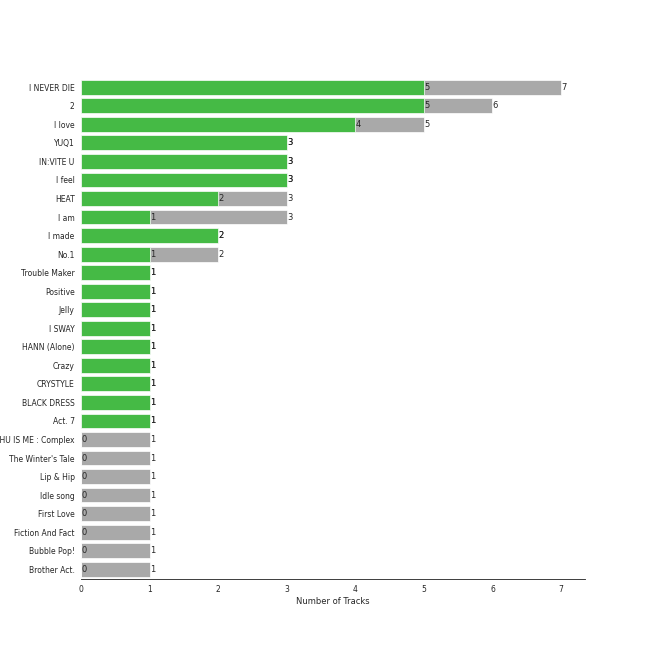
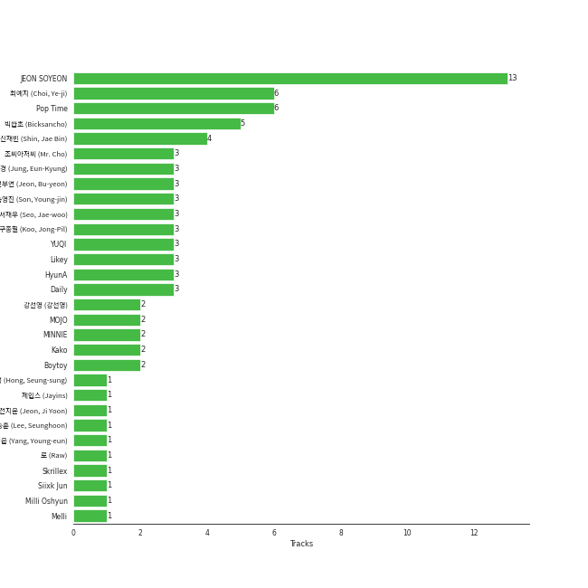

# CUBE ENTERTAINMENT

44 songs

[See Track Features](audio_features.md)

[See Clusters](clusters/overview.md)

Appears as:
- CUBE ENTERTAINMENT (21 tracks)
- Cube Entertainment (19 tracks)
- CUBE ENTERTAINMENT INC./88rising Music (3 tracks)
- CUBE Entertainment (1 tracks)

## Top Artists

| Art | Tracks | 💚 | Artist | 🔗 |
|:---|---:|---:|:---|:---|
|  | 24 | 18 | [(G)I-DLE](../../artists/(g)i-dle/overview.md) | [🔗](https://open.spotify.com/artist/2AfmfGFbe0A0WsTYm0SDTx) |
|  | 4 | 4 | [PENTAGON](../../artists/pentagon/overview.md) | [🔗](https://open.spotify.com/artist/1wKpMkucynaTfG8lyPprYV) |
|  | 5 | 3 | [CLC](../../artists/clc/overview.md) | [🔗](https://open.spotify.com/artist/6QyO41KctzGc70mVaVnXQO) |
|  | 2 | 2 | 4Minute | [🔗](https://open.spotify.com/artist/6cdC1cwqh3eJAXaxXJt2jv) |
|  | 2 | 1 | [JEON SOYEON](../../artists/jeon_soyeon/overview.md) | [🔗](https://open.spotify.com/artist/6Xg22wJOAcnvPUfk5WvODH) |
|  | 1 | 1 | Trouble Maker | [🔗](https://open.spotify.com/artist/0ztjVBmFk6OuHq6XBBwMI9) |
|  | 2 | 0 | HyunA | [🔗](https://open.spotify.com/artist/3UwlejyX2b458azZ7eCnHb) |
|  | 2 | 0 | BTOB | [🔗](https://open.spotify.com/artist/2hcsKca6hCfFMwwdbFvenJ) |
|  | 1 | 0 | Hui | [🔗](https://open.spotify.com/artist/4R0tSGcVRQ8ZXPzttU8mHy) |
|  | 1 | 0 | Beast | [🔗](https://open.spotify.com/artist/1Pr9gT0veB2tgcisQeIGoC) |

## Top Albums

| Art | Tracks | 💚 | Album | Release Date | 🔗 |
|:---|---:|---:|:---|:---|:---|
|  | 7 | 5 | I NEVER DIE | 2022-03-14 | [🔗](https://open.spotify.com/album/1T2W9vDajFreUuycPDjUXk) |
|  | 5 | 4 | I love | 2022-10-17 | [🔗](https://open.spotify.com/album/2Hyuin3i1cSZ1FlQFeCPZH) |
|  | 3 | 3 | IN:VITE U | 2022-01-24 | [🔗](https://open.spotify.com/album/5vxZM8rFJiNvjtAThYnwek) |
|  | 3 | 3 | I feel | 2023-05-15 | [🔗](https://open.spotify.com/album/3PQZnr5gf699uYEaGH93uG) |
|  | 3 | 1 | I am | 2018-05-02 | [🔗](https://open.spotify.com/album/1GtPnOiHxCnoZPCiLcKj22) |
|  | 2 | 2 | I made | 2019-02-26 | [🔗](https://open.spotify.com/album/479xGDGrqMXN8YLmJMEoTG) |
|  | 2 | 2 | HEAT | 2023-10-04 | [🔗](https://open.spotify.com/album/5CZQfva4He8sG3DcU8eP5m) |
|  | 2 | 1 | No.1 | 2019-01-30 | [🔗](https://open.spotify.com/album/6xSUUpa9LBZYwJFMJOr8M6) |
|  | 1 | 1 | Trouble Maker | 2011-12-01 | [🔗](https://open.spotify.com/album/130MEXfaPjOmSkE18F9rJm) |
|  | 1 | 1 | Positive | 2018-04-02 | [🔗](https://open.spotify.com/album/1ZRmLzZWvOkSqWePzFeekO) |

See all 25 albums

| Art | Tracks | 💚 | Album | Release Date | 🔗 |
|:---|---:|---:|:---|:---|:---|
|  | 1 | 1 | Jelly | 2017-11-05 | [🔗](https://open.spotify.com/album/7iTA4T8A4tDU77Dt6y3f9m) |
|  | 1 | 1 | HANN (Alone) | 2018-08-14 | [🔗](https://open.spotify.com/album/4VLR1cDqRIeS86GYSJvlmZ) |
|  | 1 | 1 | Crazy | 2015-02-09 | [🔗](https://open.spotify.com/album/5ooERKclQluBVu00PIH9Xm) |
|  | 1 | 1 | CRYSTYLE | 2017-01-17 | [🔗](https://open.spotify.com/album/74VP5VvY2CISEqfEkH9Wuc) |
|  | 1 | 1 | BLACK DRESS | 2018-02-22 | [🔗](https://open.spotify.com/album/3I3c4rkP6v5LtjMrgbD6d0) |
|  | 1 | 1 | Act. 7 | 2016-02-01 | [🔗](https://open.spotify.com/album/2QGDdrZDuxK7VBmcJZxi1B) |
|  | 1 | 0 | WHU IS ME : Complex | 2024-01-16 | [🔗](https://open.spotify.com/album/3wyyezKZopI2uO3hDZP9So) |
|  | 1 | 0 | The Winter's Tale | 2014-12-22 | [🔗](https://open.spotify.com/album/1WrPy47aE3pCJvrHYjJ33v) |
|  | 1 | 0 | Lip & Hip | 2017-12-04 | [🔗](https://open.spotify.com/album/01Dv8rPO2AvHogy6uDkb1t) |
|  | 1 | 0 | Idle song | 2018-02-28 | [🔗](https://open.spotify.com/album/6RasD9dt49odO6D3VkhD1z) |
|  | 1 | 0 | HEAT | 2023-10-05 | [🔗](https://open.spotify.com/album/20iyYKtw1KjMRsMZWMPpVY) |
|  | 1 | 0 | First Love | 2015-03-19 | [🔗](https://open.spotify.com/album/1s0NkdUXMRPJvgWV1kEEbP) |
|  | 1 | 0 | Fiction And Fact | 2011-05-17 | [🔗](https://open.spotify.com/album/7bmaIj97ZBuFyDewh5lY4s) |
|  | 1 | 0 | Bubble Pop! | 2011-07-05 | [🔗](https://open.spotify.com/album/3ejtzmi1xzQMl8JtJruZPp) |
|  | 1 | 0 | Brother Act. | 2017-10-16 | [🔗](https://open.spotify.com/album/3oXEVu3gwToJRkE2xAW44a) |

## Genres

| Tracks | 💚 | Genre |
|---:|---:|:---|
| 31 | 23 | [k-pop girl group](../../genres/k-pop_girl_group/overview.md) |
| 19 | 11 | [k-pop](../../genres/k-pop/overview.md) |
| 7 | 4 | [k-pop boy group](../../genres/k-pop_boy_group/overview.md) |
| 5 | 3 | korean city pop |
| 1 | 0 | [korean pop](../../genres/korean_pop/overview.md) |

## Top Producers

| Art | Producer | Tracks | Credit Types |
|:---|:---|---:|:---|
|  | [JEON SOYEON](../../artists/jeon_soyeon/overview.md) | 9 | Lyricist, Songwriter, Arranger |
| | 최예지 (Choi, Ye-ji) | 5 | Producer |
| | 빅싼초 (Bicksancho) | 4 | Songwriter, Arranger, Lyricist |
| | 신재빈 (Shin, Jae Bin) | 3 | Producer |
| | 서재우 (Seo, Jae-woo) | 2 | Arranger, Lyricist, Songwriter |
| | 구종필 (Koo, Jong-Pil) | 2 | Producer |
| | 전부연 (Jeon, Bu-yeon) | 2 | Producer |
| | 정은경 (Jung, Eun-Kyung) | 2 | Producer |
| | 손영진 (Son, Young-jin) | 2 | Arranger, Lyricist, Songwriter |
|  | HyunA | 2 | Lyricist |

View all

| Art | Producer | Tracks | Credit Types |
|:---|:---|---:|:---|
| | 조씨아저씨 (Mr. Cho) | 2 | Producer |
| | Pop Time | 2 | Arranger, Songwriter |
| | MINNIE | 2 | Lyricist, Songwriter |
| | Kako | 1 | Arranger, Songwriter |
|  | YUQI | 1 | Songwriter |
| | DRK | 1 | Producer |
| | FCM 후디니 (FCM Houdini) | 1 | Arranger, Lyricist, Songwriter |
| | 홍승성 (Hong, Seung-sung) | 1 | Producer |
| | BreadBeat | 1 | Arranger, Songwriter |
| | HouDini | 1 | Arranger |
| | 로 (Raw) | 1 | Arranger |
| | 양영은 (Yang, Young-eun) | 1 | Producer |
| | 전지윤 (Jeon, Ji Yoon) | 1 | Lyricist |
| | JENCI | 1 | Arranger, Songwriter |
| | Siixk Jun | 1 | Arranger, Songwriter |
| | 강선영 (강선영) | 1 | Producer |
|  | Skrillex | 1 | Arranger, Songwriter |

## Tracks released under CUBE ENTERTAINMENT

| Art | Track | Album | Artists | Label | 💚 | 🔗 |
|:---|:---|:---|:---|:---|:---|:---|
|  | $$$ | I am | [(G)I-DLE](../../artists/(g)i-dle/overview.md) | [CUBE ENTERTAINMENT](.) | | [🔗](https://open.spotify.com/track/68yUIRmUq0cZN19DnbgKSX) |
|  | LATATA | I am | [(G)I-DLE](../../artists/(g)i-dle/overview.md) | [CUBE ENTERTAINMENT](.) | 💚 | [🔗](https://open.spotify.com/track/2ezKXygNO30pXyDQXkm6oD) |
|  | MAZE | I am | [(G)I-DLE](../../artists/(g)i-dle/overview.md) | [CUBE ENTERTAINMENT](.) | | [🔗](https://open.spotify.com/track/5xptVEzEqCXv0oIJmyDYOJ) |
|  | HANN (Alone) | HANN (Alone) | [(G)I-DLE](../../artists/(g)i-dle/overview.md) | [CUBE ENTERTAINMENT](.) | 💚 | [🔗](https://open.spotify.com/track/7gr57cYekMWriyJYbT7oZ4) |
|  | Put It Straight | I made | [(G)I-DLE](../../artists/(g)i-dle/overview.md) | [CUBE ENTERTAINMENT](.) | 💚 | [🔗](https://open.spotify.com/track/2G0wbwTsTN0HJeQp3BDc4D) |
|  | Senorita | I made | [(G)I-DLE](../../artists/(g)i-dle/overview.md) | [CUBE ENTERTAINMENT](.) | 💚 | [🔗](https://open.spotify.com/track/0q6boCcLaWYPIy2vOsksFg) |
|  | ALREADY | I NEVER DIE | [(G)I-DLE](../../artists/(g)i-dle/overview.md) | [Cube Entertainment](.) | 💚 | [🔗](https://open.spotify.com/track/1hQtfLmNABXQMSjjYRXqAX) |
|  | ESCAPE | I NEVER DIE | [(G)I-DLE](../../artists/(g)i-dle/overview.md) | [Cube Entertainment](.) | | [🔗](https://open.spotify.com/track/4O7tVdjaOQARI1rS6E6CCx) |
|  | LIAR | I NEVER DIE | [(G)I-DLE](../../artists/(g)i-dle/overview.md) | [Cube Entertainment](.) | | [🔗](https://open.spotify.com/track/4NrmxVJURTgzMH0QKyYy1a) |
|  | MY BAG | I NEVER DIE | [(G)I-DLE](../../artists/(g)i-dle/overview.md) | [Cube Entertainment](.) | 💚 | [🔗](https://open.spotify.com/track/1t8sqIScEIP0B4bQzBuI2P) |

See all tracks

| Art | Track | Album | Artists | Label | 💚 | 🔗 |
|:---|:---|:---|:---|:---|:---|:---|
|  | Never Stop Me | I NEVER DIE | [(G)I-DLE](../../artists/(g)i-dle/overview.md) | [Cube Entertainment](.) | 💚 | [🔗](https://open.spotify.com/track/0ckILmtBH2r5UFOtTf2cN0) |
|  | TOMBOY | I NEVER DIE | [(G)I-DLE](../../artists/(g)i-dle/overview.md) | [Cube Entertainment](.) | 💚 | [🔗](https://open.spotify.com/track/0IGUXY4JbK18bu9oD4mPIm) |
|  | VILLAIN DIES | I NEVER DIE | [(G)I-DLE](../../artists/(g)i-dle/overview.md) | [Cube Entertainment](.) | 💚 | [🔗](https://open.spotify.com/track/6adPuBjUw3Zh6wK27d8Rgv) |
|  | Change | I love | [(G)I-DLE](../../artists/(g)i-dle/overview.md) | [Cube Entertainment](.) | 💚 | [🔗](https://open.spotify.com/track/6wXYyw7TBQlJ0qh3RNP8MD) |
|  | DARK (X-file) | I love | [(G)I-DLE](../../artists/(g)i-dle/overview.md) | [Cube Entertainment](.) | 💚 | [🔗](https://open.spotify.com/track/4xc3JpkI8kxLwk1SJafjzh) |
|  | LOVE | I love | [(G)I-DLE](../../artists/(g)i-dle/overview.md) | [Cube Entertainment](.) | | [🔗](https://open.spotify.com/track/6dmMXI9tVrDgFmxpjttZmF) |
|  | Nxde | I love | [(G)I-DLE](../../artists/(g)i-dle/overview.md) | [Cube Entertainment](.) | 💚 | [🔗](https://open.spotify.com/track/6NnCWIWV740gP7DQ8kqdIE) |
|  | Sculpture | I love | [(G)I-DLE](../../artists/(g)i-dle/overview.md) | [Cube Entertainment](.) | 💚 | [🔗](https://open.spotify.com/track/7f9Nbqm1ds2kxGHioJtdf3) |
|  | All Night | I feel | [(G)I-DLE](../../artists/(g)i-dle/overview.md) | [Cube Entertainment](.) | 💚 | [🔗](https://open.spotify.com/track/1abAIeSQCbdPcxWgiwDOmL) |
|  | Lucid | I feel | [(G)I-DLE](../../artists/(g)i-dle/overview.md) | [Cube Entertainment](.) | 💚 | [🔗](https://open.spotify.com/track/4fg42mtrSFuKQ9NYBboiiN) |
|  | Queencard | I feel | [(G)I-DLE](../../artists/(g)i-dle/overview.md) | [Cube Entertainment](.) | 💚 | [🔗](https://open.spotify.com/track/4uOBL4DDWWVx4RhYKlPbPC) |
|  | I DO | HEAT | [(G)I-DLE](../../artists/(g)i-dle/overview.md) | [88rising Music](../88rising_music), [CUBE ENTERTAINMENT](.) | 💚 | [🔗](https://open.spotify.com/track/4SKwDW8Gg8CJxw2ElMhSTp) |
|  | I Want That | HEAT | [(G)I-DLE](../../artists/(g)i-dle/overview.md) | [88rising Music](../88rising_music), [CUBE ENTERTAINMENT](.) | 💚 | [🔗](https://open.spotify.com/track/3F2BLyGt6zYLrHYpbdTw5L) |
|  | Eyes Roll | HEAT | [(G)I-DLE](../../artists/(g)i-dle/overview.md) | [88rising Music](../88rising_music), [CUBE ENTERTAINMENT](.) | | [🔗](https://open.spotify.com/track/79yymC6QQaZ81jR2UYcPfy) |
|  | Crazy | Crazy | 4Minute | [CUBE ENTERTAINMENT](.) | 💚 | [🔗](https://open.spotify.com/track/5DZdCgnX9xAj59X6X7cQBs) |
|  | Hate | Act. 7 | 4Minute | [CUBE ENTERTAINMENT](.) | 💚 | [🔗](https://open.spotify.com/track/3Hd6zm1J4bVeu4VXwaDQL3) |
|  | Because It's Christmas | The Winter's Tale | BTOB | [CUBE ENTERTAINMENT](.) | | [🔗](https://open.spotify.com/track/4hqJ7ikAK2dXTeptTi58Di) |
|  | Missing You | Brother Act. | BTOB | [CUBE ENTERTAINMENT](.) | | [🔗](https://open.spotify.com/track/2zlgwqw8BLX2JGB76LIFeF) |
|  | Fiction | Fiction And Fact | Beast | [CUBE ENTERTAINMENT](.) | | [🔗](https://open.spotify.com/track/69QlYqNJeZG14R4an2aoJv) |
|  | Pepe | First Love | [CLC](../../artists/clc/overview.md) | [CUBE ENTERTAINMENT](.) | | [🔗](https://open.spotify.com/track/2rO1OMbLrfKIkqrqcATv3u) |
|  | Hobgoblin | CRYSTYLE | [CLC](../../artists/clc/overview.md) | [CUBE ENTERTAINMENT](.) | 💚 | [🔗](https://open.spotify.com/track/2pSOUHBQXkN3fS2TAJHhfR) |
|  | BLACK DRESS | BLACK DRESS | [CLC](../../artists/clc/overview.md) | [CUBE ENTERTAINMENT](.) | 💚 | [🔗](https://open.spotify.com/track/4g73tmQQc6pSfe4NMXKrZD) |
|  | Like It | No.1 | [CLC](../../artists/clc/overview.md) | [CUBE ENTERTAINMENT](.) | 💚 | [🔗](https://open.spotify.com/track/6ioP0snRYjhfWKNMMLKOde) |
|  | No | No.1 | [CLC](../../artists/clc/overview.md) | [CUBE ENTERTAINMENT](.) | | [🔗](https://open.spotify.com/track/3sygLAUhHsJsQ0cBk6fxRd) |
|  | Hmm BOP | WHU IS ME : Complex | Hui | [Cube Entertainment](.) | | [🔗](https://open.spotify.com/track/02b8ldrByRJbFE5M71q34w) |
|  | Bubble Pop! | Bubble Pop! | HyunA | [CUBE Entertainment](.) | | [🔗](https://open.spotify.com/track/59JkwCdGIMTZYb0j75vebU) |
|  | Lip & Hip | Lip & Hip | HyunA | [CUBE ENTERTAINMENT](.) | | [🔗](https://open.spotify.com/track/5C2d3tz8WACjmw7T6TthQ2) |
|  | Jelly | Jelly | [JEON SOYEON](../../artists/jeon_soyeon/overview.md) | [CUBE ENTERTAINMENT](.) | 💚 | [🔗](https://open.spotify.com/track/0MsE73sXgfqOpgzCATa0Wt) |
|  | Idle song | Idle song | [JEON SOYEON](../../artists/jeon_soyeon/overview.md) | [CUBE ENTERTAINMENT](.) | | [🔗](https://open.spotify.com/track/1P7zwuGNeGWehpKVavukRe) |
|  | Shine | Positive | [PENTAGON](../../artists/pentagon/overview.md) | [CUBE ENTERTAINMENT](.) | 💚 | [🔗](https://open.spotify.com/track/7nkp1uuSbKkoxMvEs8cSw0) |
|  | Feelin' Like | IN:VITE U | [PENTAGON](../../artists/pentagon/overview.md) | [Cube Entertainment](.) | 💚 | [🔗](https://open.spotify.com/track/5Wll1i0Y8GGjyePcP83L3x) |
|  | Sparkling Night | IN:VITE U | [PENTAGON](../../artists/pentagon/overview.md) | [Cube Entertainment](.) | 💚 | [🔗](https://open.spotify.com/track/5muXLxcyjv5RY2sGwl68TL) |
|  | The Game | IN:VITE U | [PENTAGON](../../artists/pentagon/overview.md) | [Cube Entertainment](.) | 💚 | [🔗](https://open.spotify.com/track/4uqfxy4VCvlbSfALhRQedJ) |
|  | Trouble Maker | Trouble Maker | Trouble Maker | [CUBE ENTERTAINMENT](.) | 💚 | [🔗](https://open.spotify.com/track/0RP3Qjp1QhIjhtG7gYoBqn) |

