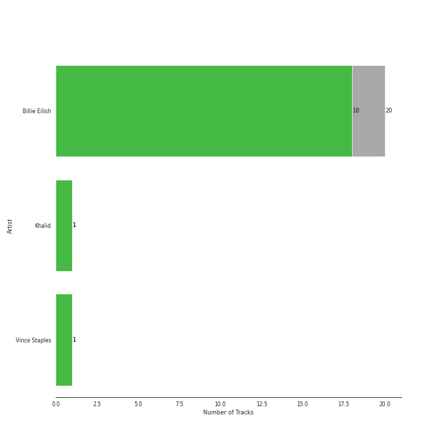

# Darkroom

10 songs

## Top Artists

See all 2 artists

|   Number of Tracks | Art                                                                                              | Artist                                       | 🔗                                                           |
|-------------------:|:-------------------------------------------------------------------------------------------------|:---------------------------------------------|:------------------------------------------------------------|
|                 10 |  | [Billie Eilish](../artists/billie_eilish.md) | [🔗](https://open.spotify.com/artist/6qqNVTkY8uBg9cP3Jd7DAH) |
|                  1 |  | Khalid                                       | [🔗](https://open.spotify.com/artist/6LuN9FCkKOj5PcnpouEgny) |

## Top Albums

See all 6 albums

|   Number of Tracks | Art                                                                                              | Album                                    | 🔗                                                          |
|-------------------:|:-------------------------------------------------------------------------------------------------|:-----------------------------------------|:-----------------------------------------------------------|
|                  5 |  | WHEN WE ALL FALL ASLEEP, WHERE DO WE GO? | [🔗](https://open.spotify.com/album/0S0KGZnfBGSIssfF54WSJh) |
|                  1 |  | lovely (with Khalid)                     | [🔗](https://open.spotify.com/album/2sBB17RXTamvj7Ncps15AK) |
|                  1 |  | everything i wanted                      | [🔗](https://open.spotify.com/album/4i3rAwPw7Ln2YrKDusaWyT) |
|                  1 |  | dont smile at me                         | [🔗](https://open.spotify.com/album/7fRrTyKvE4Skh93v97gtcU) |
|                  1 |  | No Time To Die                           | [🔗](https://open.spotify.com/album/5sXSHscDjBez8VF20cSyad) |
|                  1 |  | Happier Than Ever                        | [🔗](https://open.spotify.com/album/0JGOiO34nwfUdDrD612dOp) |

## Tracks released under Darkroom

| Art                                                                                              | Track                        | Album                                    | Artists                                              | Label                       | 💚   | 🔗                                                          |
|:-------------------------------------------------------------------------------------------------|:-----------------------------|:-----------------------------------------|:-----------------------------------------------------|:----------------------------|:----|:-----------------------------------------------------------|
|  | ocean eyes                   | dont smile at me                         | [Billie Eilish](../artists/billie_eilish.md)         | Darkroom                    | 💚   | [🔗](https://open.spotify.com/track/7hDVYcQq6MxkdJGweuCtl9) |
|  | lovely (with Khalid)         | lovely (with Khalid)                     | [Billie Eilish](../artists/billie_eilish.md), Khalid | Darkroom                    | 💚   | [🔗](https://open.spotify.com/track/0u2P5u6lvoDfwTYjAADbn4) |
|  | bad guy                      | WHEN WE ALL FALL ASLEEP, WHERE DO WE GO? | [Billie Eilish](../artists/billie_eilish.md)         | Darkroom/Interscope Records | 💚   | [🔗](https://open.spotify.com/track/2Fxmhks0bxGSBdJ92vM42m) |
|  | bury a friend                | WHEN WE ALL FALL ASLEEP, WHERE DO WE GO? | [Billie Eilish](../artists/billie_eilish.md)         | Darkroom/Interscope Records | 💚   | [🔗](https://open.spotify.com/track/4SSnFejRGlZikf02HLewEF) |
|  | when the party's over        | WHEN WE ALL FALL ASLEEP, WHERE DO WE GO? | [Billie Eilish](../artists/billie_eilish.md)         | Darkroom/Interscope Records | 💚   | [🔗](https://open.spotify.com/track/43zdsphuZLzwA9k4DJhU0I) |
|  | xanny                        | WHEN WE ALL FALL ASLEEP, WHERE DO WE GO? | [Billie Eilish](../artists/billie_eilish.md)         | Darkroom/Interscope Records | 💚   | [🔗](https://open.spotify.com/track/4QIo4oxwzzafcBWkKjDpXY) |
|  | you should see me in a crown | WHEN WE ALL FALL ASLEEP, WHERE DO WE GO? | [Billie Eilish](../artists/billie_eilish.md)         | Darkroom/Interscope Records | 💚   | [🔗](https://open.spotify.com/track/3XF5xLJHOQQRbWya6hBp7d) |
|  | everything i wanted          | everything i wanted                      | [Billie Eilish](../artists/billie_eilish.md)         | Darkroom/Interscope Records | 💚   | [🔗](https://open.spotify.com/track/3ZCTVFBt2Brf31RLEnCkWJ) |
|  | No Time To Die               | No Time To Die                           | [Billie Eilish](../artists/billie_eilish.md)         | Darkroom/Interscope Records | 💚   | [🔗](https://open.spotify.com/track/73SpzrcaHk0RQPFP73vqVR) |
|  | Therefore I Am               | Happier Than Ever                        | [Billie Eilish](../artists/billie_eilish.md)         | Darkroom/Interscope Records | 💚   | [🔗](https://open.spotify.com/track/20R4HfKloPKgXDqU7UKk3x) |
