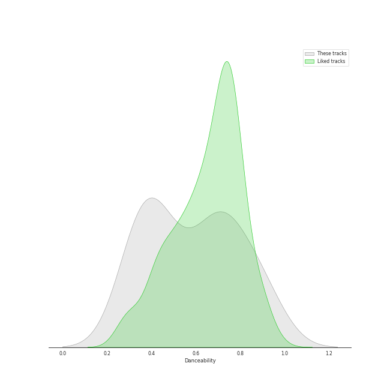
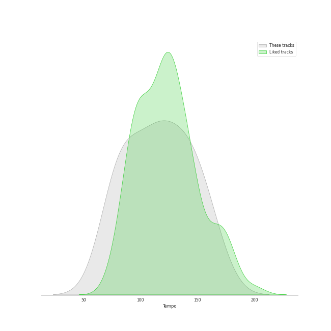

# Audio Features for Darkroom

## Danceability

| 10 most Danceable tracks | 10 least Danceable tracks |
|:---|:---|
| bury a friend (0.905) | Happier Than Ever (0.332) |
| Therefore I Am (0.879) | lovely (with Khalid) (0.351) |
| everything i wanted (0.704) | when the party's over (0.367) |
| bad guy (0.701) | No Time To Die (0.38) |
| you should see me in a crown (0.678) | TV (0.412) |
| GOLDWING (0.654) | ocean eyes (0.511) |
| xanny (0.521) | xanny (0.521) |
| ocean eyes (0.511) | GOLDWING (0.654) |
| TV (0.412) | you should see me in a crown (0.678) |
| No Time To Die (0.38) | bad guy (0.701) |

## Energy

| 10 most Energetic tracks | 10 least Energetic tracks |
|:---|:---|
| you should see me in a crown (0.533) | when the party's over (0.111) |
| bad guy (0.425) | xanny (0.125) |
| bury a friend (0.389) | No Time To Die (0.219) |
| Therefore I Am (0.365) | everything i wanted (0.225) |
| ocean eyes (0.363) | Happier Than Ever (0.225) |
| GOLDWING (0.303) | TV (0.236) |
| lovely (with Khalid) (0.296) | lovely (with Khalid) (0.296) |
| TV (0.236) | GOLDWING (0.303) |
| Happier Than Ever (0.225) | ocean eyes (0.363) |
| everything i wanted (0.225) | Therefore I Am (0.365) |

## Speechiness

| 10 most Speechy tracks | 10 least Speechy tracks |
|:---|:---|
| bad guy (0.375) | lovely (with Khalid) (0.0333) |
| bury a friend (0.332) | Happier Than Ever (0.0348) |
| xanny (0.239) | No Time To Die (0.0358) |
| you should see me in a crown (0.186) | TV (0.0379) |
| GOLDWING (0.126) | ocean eyes (0.041) |
| everything i wanted (0.0994) | Therefore I Am (0.0924) |
| when the party's over (0.0972) | when the party's over (0.0972) |
| Therefore I Am (0.0924) | everything i wanted (0.0994) |
| ocean eyes (0.041) | GOLDWING (0.126) |
| TV (0.0379) | you should see me in a crown (0.186) |

## Acousticness

| 10 most Acoustic tracks | 10 least Acoustic tracks |
|:---|:---|
| when the party's over (0.978) | Therefore I Am (0.227) |
| lovely (with Khalid) (0.934) | bad guy (0.328) |
| No Time To Die (0.917) | you should see me in a crown (0.462) |
| everything i wanted (0.902) | bury a friend (0.74) |
| TV (0.83) | xanny (0.751) |
| ocean eyes (0.816) | GOLDWING (0.755) |
| Happier Than Ever (0.767) | Happier Than Ever (0.767) |
| GOLDWING (0.755) | ocean eyes (0.816) |
| xanny (0.751) | TV (0.83) |
| bury a friend (0.74) | everything i wanted (0.902) |

## Instrumentalness

| 10 most Instrumental tracks | 10 least Instrumental tracks |
|:---|:---|
| everything i wanted (0.657) | lovely (with Khalid) (0.0) |
| you should see me in a crown (0.219) | when the party's over (3.97e-05) |
| bury a friend (0.162) | xanny (0.00207) |
| GOLDWING (0.159) | Happier Than Ever (0.00349) |
| Therefore I Am (0.135) | TV (0.00653) |
| bad guy (0.13) | No Time To Die (0.0104) |
| ocean eyes (0.0317) | ocean eyes (0.0317) |
| No Time To Die (0.0104) | bad guy (0.13) |
| TV (0.00653) | Therefore I Am (0.135) |
| Happier Than Ever (0.00349) | GOLDWING (0.159) |

## Liveness

| 10 most Live tracks | 10 least Live tracks |
|:---|:---|
| xanny (0.265) | Therefore I Am (0.0583) |
| TV (0.147) | No Time To Die (0.0827) |
| you should see me in a crown (0.139) | ocean eyes (0.084) |
| Happier Than Ever (0.128) | when the party's over (0.0897) |
| bury a friend (0.106) | lovely (with Khalid) (0.095) |
| everything i wanted (0.106) | GOLDWING (0.0957) |
| bad guy (0.1) | bad guy (0.1) |
| GOLDWING (0.0957) | everything i wanted (0.106) |
| lovely (with Khalid) (0.095) | bury a friend (0.106) |
| when the party's over (0.0897) | Happier Than Ever (0.128) |

## Valence

| 10 most Happy tracks | 10 least Happy tracks |
|:---|:---|
| Therefore I Am (0.663) | No Time To Die (0.0517) |
| bad guy (0.562) | xanny (0.0528) |
| you should see me in a crown (0.323) | TV (0.119) |
| Happier Than Ever (0.297) | lovely (with Khalid) (0.12) |
| everything i wanted (0.243) | GOLDWING (0.168) |
| when the party's over (0.198) | ocean eyes (0.169) |
| bury a friend (0.196) | bury a friend (0.196) |
| ocean eyes (0.169) | when the party's over (0.198) |
| GOLDWING (0.168) | everything i wanted (0.243) |
| lovely (with Khalid) (0.12) | Happier Than Ever (0.297) |

## Tempo

| 10 most Fast tracks | 10 least Fast tracks |
|:---|:---|
| GOLDWING (160.095) | No Time To Die (73.537) |
| you should see me in a crown (150.455) | Happier Than Ever (81.055) |
| ocean eyes (144.892) | when the party's over (82.642) |
| TV (140.214) | Therefore I Am (94.016) |
| bad guy (135.128) | xanny (111.554) |
| bury a friend (120.046) | lovely (with Khalid) (115.284) |
| everything i wanted (120.006) | everything i wanted (120.006) |
| lovely (with Khalid) (115.284) | bury a friend (120.046) |
| xanny (111.554) | bad guy (135.128) |
| Therefore I Am (94.016) | TV (140.214) |
