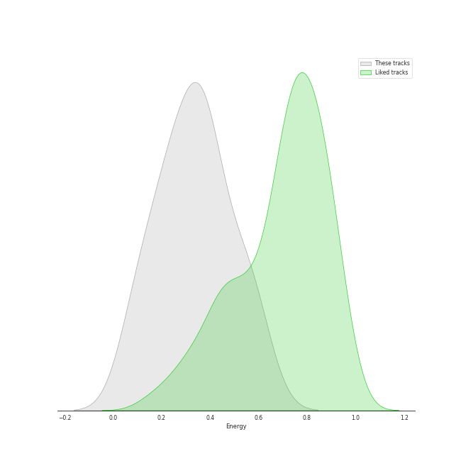
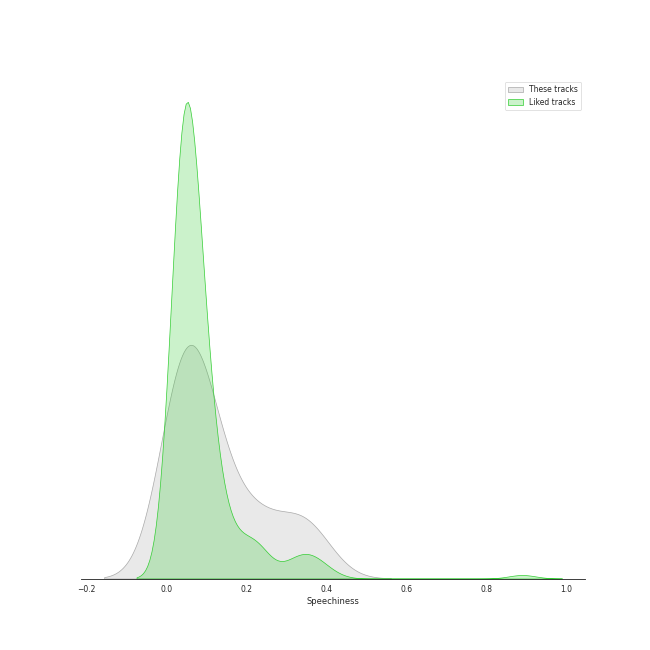
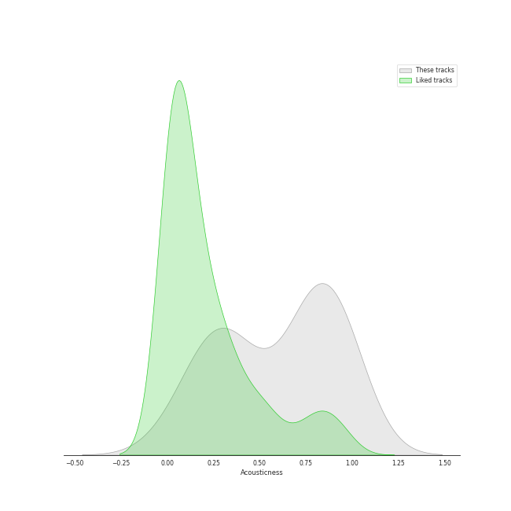
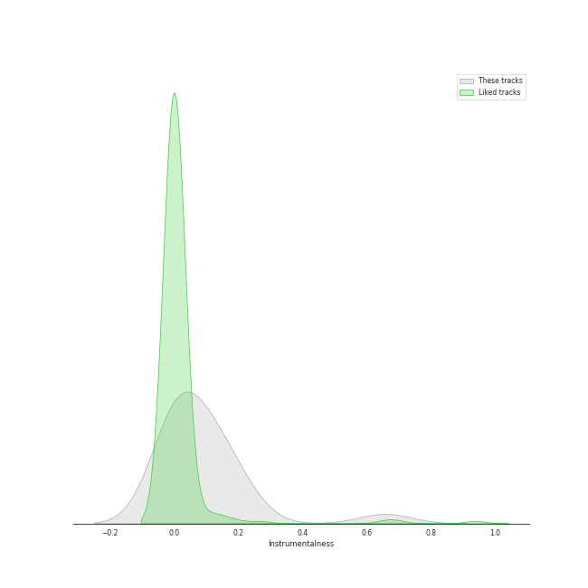
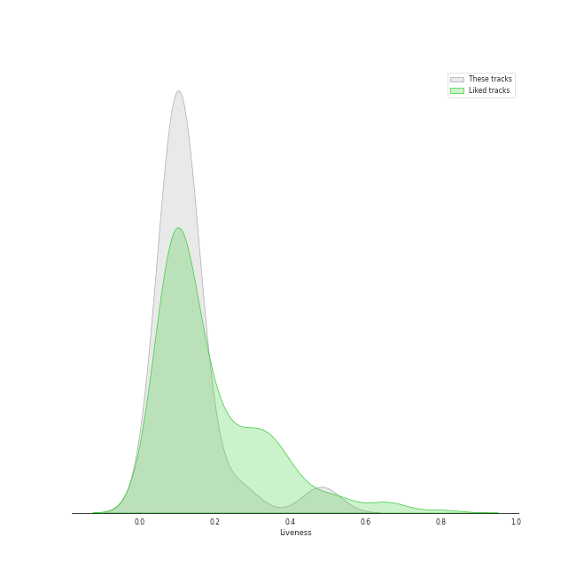
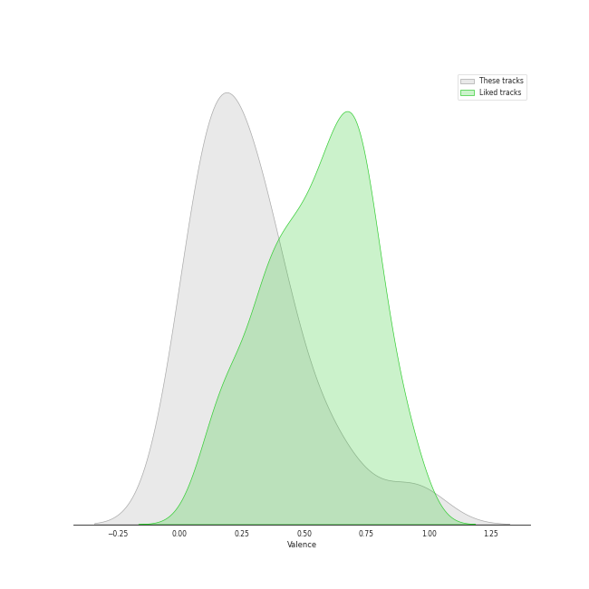

# Audio Features for Darkroom

## Danceability

| ​ | 10 most Danceable tracks | ​​ | 10 least Danceable tracks |
|:---|:---|:---|:---|
|  | bury a friend (0.905) |  | Happier Than Ever (0.332) |
|  | Therefore I Am (0.879) |  | lovely (with Khalid) (0.351) |
|  | everything i wanted (0.704) |  | when the party's over (0.367) |
|  | bad guy (0.701) |  | No Time To Die (0.38) |
|  | you should see me in a crown (0.678) |  | TV (0.412) |
|  | GOLDWING (0.654) |  | ocean eyes (0.511) |
|  | xanny (0.521) |  | xanny (0.521) |
|  | ocean eyes (0.511) |  | GOLDWING (0.654) |
|  | TV (0.412) |  | you should see me in a crown (0.678) |
|  | No Time To Die (0.38) |  | bad guy (0.701) |

## Energy

| ​ | 10 most Energetic tracks | ​​ | 10 least Energetic tracks |
|:---|:---|:---|:---|
|  | you should see me in a crown (0.533) |  | when the party's over (0.111) |
|  | bad guy (0.425) |  | xanny (0.125) |
|  | bury a friend (0.389) |  | No Time To Die (0.219) |
|  | Therefore I Am (0.365) |  | everything i wanted (0.225) |
|  | ocean eyes (0.363) |  | Happier Than Ever (0.225) |
|  | GOLDWING (0.303) |  | TV (0.236) |
|  | lovely (with Khalid) (0.296) |  | lovely (with Khalid) (0.296) |
|  | TV (0.236) |  | GOLDWING (0.303) |
|  | Happier Than Ever (0.225) |  | ocean eyes (0.363) |
|  | everything i wanted (0.225) |  | Therefore I Am (0.365) |

## Speechiness

| ​ | 10 most Speechy tracks | ​​ | 10 least Speechy tracks |
|:---|:---|:---|:---|
|  | bad guy (0.375) |  | lovely (with Khalid) (0.0333) |
|  | bury a friend (0.332) |  | Happier Than Ever (0.0348) |
|  | xanny (0.239) |  | No Time To Die (0.0358) |
|  | you should see me in a crown (0.186) |  | TV (0.0379) |
|  | GOLDWING (0.126) |  | ocean eyes (0.041) |
|  | everything i wanted (0.0994) |  | Therefore I Am (0.0924) |
|  | when the party's over (0.0972) |  | when the party's over (0.0972) |
|  | Therefore I Am (0.0924) |  | everything i wanted (0.0994) |
|  | ocean eyes (0.041) |  | GOLDWING (0.126) |
|  | TV (0.0379) |  | you should see me in a crown (0.186) |

## Acousticness

| ​ | 10 most Acoustic tracks | ​​ | 10 least Acoustic tracks |
|:---|:---|:---|:---|
|  | when the party's over (0.978) |  | Therefore I Am (0.227) |
|  | lovely (with Khalid) (0.934) |  | bad guy (0.328) |
|  | No Time To Die (0.917) |  | you should see me in a crown (0.462) |
|  | everything i wanted (0.902) |  | bury a friend (0.74) |
|  | TV (0.83) |  | xanny (0.751) |
|  | ocean eyes (0.816) |  | GOLDWING (0.755) |
|  | Happier Than Ever (0.767) |  | Happier Than Ever (0.767) |
|  | GOLDWING (0.755) |  | ocean eyes (0.816) |
|  | xanny (0.751) |  | TV (0.83) |
|  | bury a friend (0.74) |  | everything i wanted (0.902) |

## Instrumentalness

| ​ | 10 most Instrumental tracks | ​​ | 10 least Instrumental tracks |
|:---|:---|:---|:---|
|  | everything i wanted (0.657) |  | lovely (with Khalid) (0.0) |
|  | you should see me in a crown (0.219) |  | when the party's over (3.97e-05) |
|  | bury a friend (0.162) |  | xanny (0.00207) |
|  | GOLDWING (0.159) |  | Happier Than Ever (0.00349) |
|  | Therefore I Am (0.135) |  | TV (0.00653) |
|  | bad guy (0.13) |  | No Time To Die (0.0104) |
|  | ocean eyes (0.0317) |  | ocean eyes (0.0317) |
|  | No Time To Die (0.0104) |  | bad guy (0.13) |
|  | TV (0.00653) |  | Therefore I Am (0.135) |
|  | Happier Than Ever (0.00349) |  | GOLDWING (0.159) |

## Liveness

| ​ | 10 most Live tracks | ​​ | 10 least Live tracks |
|:---|:---|:---|:---|
|  | xanny (0.265) |  | Therefore I Am (0.0583) |
|  | TV (0.147) |  | No Time To Die (0.0827) |
|  | you should see me in a crown (0.139) |  | ocean eyes (0.084) |
|  | Happier Than Ever (0.128) |  | when the party's over (0.0897) |
|  | bury a friend (0.106) |  | lovely (with Khalid) (0.095) |
|  | everything i wanted (0.106) |  | GOLDWING (0.0957) |
|  | bad guy (0.1) |  | bad guy (0.1) |
|  | GOLDWING (0.0957) |  | everything i wanted (0.106) |
|  | lovely (with Khalid) (0.095) |  | bury a friend (0.106) |
|  | when the party's over (0.0897) |  | Happier Than Ever (0.128) |

## Valence

| ​ | 10 most Happy tracks | ​​ | 10 least Happy tracks |
|:---|:---|:---|:---|
|  | Therefore I Am (0.663) |  | No Time To Die (0.0517) |
|  | bad guy (0.562) |  | xanny (0.0528) |
|  | you should see me in a crown (0.323) |  | TV (0.119) |
|  | Happier Than Ever (0.297) |  | lovely (with Khalid) (0.12) |
|  | everything i wanted (0.243) |  | GOLDWING (0.168) |
|  | when the party's over (0.198) |  | ocean eyes (0.169) |
|  | bury a friend (0.196) |  | bury a friend (0.196) |
|  | ocean eyes (0.169) |  | when the party's over (0.198) |
|  | GOLDWING (0.168) |  | everything i wanted (0.243) |
|  | lovely (with Khalid) (0.12) |  | Happier Than Ever (0.297) |

## Tempo

| ​ | 10 most Fast tracks | ​​ | 10 least Fast tracks |
|:---|:---|:---|:---|
|  | GOLDWING (160.095) |  | No Time To Die (73.537) |
|  | you should see me in a crown (150.455) |  | Happier Than Ever (81.055) |
|  | ocean eyes (144.892) |  | when the party's over (82.642) |
|  | TV (140.214) |  | Therefore I Am (94.016) |
|  | bad guy (135.128) |  | xanny (111.554) |
|  | bury a friend (120.046) |  | lovely (with Khalid) (115.284) |
|  | everything i wanted (120.006) |  | everything i wanted (120.006) |
|  | lovely (with Khalid) (115.284) |  | bury a friend (120.046) |
|  | xanny (111.554) |  | bad guy (135.128) |
|  | Therefore I Am (94.016) |  | TV (140.214) |
