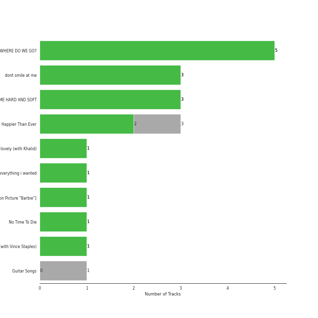

# Darkroom

20 songs

[See Track Features](audio_features.md)

[See Clusters](clusters/overview.md)

Appears as:
- Darkroom/Interscope Records (15 tracks)
- Darkroom (5 tracks)

## Top Artists

| Art | Rank | Tracks | 💚 | Artist | 🔗 |
|:---|---:|---:|---:|:---|:---|
|  | 44 | 20 | 17 | [Billie Eilish](../../artists/billie_eilish/overview.md) | [🔗](https://open.spotify.com/artist/6qqNVTkY8uBg9cP3Jd7DAH) |
|  | 427 | 1 | 1 | Khalid | [🔗](https://open.spotify.com/artist/6LuN9FCkKOj5PcnpouEgny) |
|  | 427 | 1 | 1 | Vince Staples | [🔗](https://open.spotify.com/artist/68kEuyFKyqrdQQLLsmiatm) |

## Top Albums

| Art | Rank | Tracks | 💚 | Album | Release Date | 🔗 |
|:---|---:|---:|---:|:---|:---|:---|
|  | 211 | 5 | 5 | WHEN WE ALL FALL ASLEEP, WHERE DO WE GO? | 2019-03-29 | [🔗](https://open.spotify.com/album/0S0KGZnfBGSIssfF54WSJh) |
|  | 631 | 3 | 3 | dont smile at me | 2017-12-22 | [🔗](https://open.spotify.com/album/7fRrTyKvE4Skh93v97gtcU) |
|  | 511 | 3 | 2 | Happier Than Ever | 2021-07-30 | [🔗](https://open.spotify.com/album/0JGOiO34nwfUdDrD612dOp) |
|  | 631 | 3 | 2 | HIT ME HARD AND SOFT | 2024-05-17 | [🔗](https://open.spotify.com/album/7aJuG4TFXa2hmE4z1yxc3n) |
|  | 631 | 1 | 1 | lovely (with Khalid) | 2018-04-19 | [🔗](https://open.spotify.com/album/2sBB17RXTamvj7Ncps15AK) |
|  | 631 | 1 | 1 | everything i wanted | 2019-11-13 | [🔗](https://open.spotify.com/album/4i3rAwPw7Ln2YrKDusaWyT) |
|  | 631 | 1 | 1 | What Was I Made For? [From The Motion Picture "Barbie"] | 2023-07-13 | [🔗](https://open.spotify.com/album/3AafSrFIbJPH6BJHiJm1Cd) |
|  | 253 | 1 | 1 | No Time To Die | 2020-02-13 | [🔗](https://open.spotify.com/album/5sXSHscDjBez8VF20cSyad) |
|  | 631 | 1 | 1 | &burn (with Vince Staples) | 2017-12-15 | [🔗](https://open.spotify.com/album/6eQpKhYCtvD0TwXQVHsgC2) |
|  | 631 | 1 | 0 | Guitar Songs | 2022-07-21 | [🔗](https://open.spotify.com/album/1YPWxMpQEC8kcOuefgXbhj) |

## Genres

| Tracks | 💚 | Genre |
|---:|---:|:---|
| 20 | 17 | [pop](../../genres/pop/overview.md) |
| 20 | 17 | [art pop](../../genres/art_pop/overview.md) |

## Top Producers

| Art | Producer | Tracks | Credit Types |
|:---|:---|---:|:---|
| | [FINNEAS](../../producers/finneas/overview.md) | 17 | Lyricist, Producer, Songwriter, Arranger |
|  | [Billie Eilish](../../artists/billie_eilish/overview.md) | 13 | Lyricist, Songwriter, Producer |
| | [Rob Kinelski](../../producers/rob_kinelski/overview.md) | 12 | Producer |
| | Chaz Sexton | 2 | Producer |
| | Jon Castelli | 2 | Producer |
| | Brad Lauchert | 2 | Producer |
| | Aron Forbes | 2 | Producer |
| | Andrew Wyatt | 1 | Arranger, Producer |
|  | Vince Staples | 1 | Songwriter |
| | Stephen Lipson | 1 | Producer |

View all

| Art | Producer | Tracks | Credit Types |
|:---|:---|---:|:---|
| | Thom Beemer | 1 | Producer |
| | Casey Cuayo | 1 | Producer |
| | David Campbell | 1 | Arranger |
| | Matt Dunkley | 1 | Arranger |
| | Eli Heisler | 1 | Producer |
| | Hans Zimmer | 1 | Arranger |
|  | Khalid | 1 | Lyricist, Songwriter |
|  | Mark Ronson | 1 | Arranger, Producer |

## Tracks released under Darkroom

| Art | Track | Album | Artists | Label | Rank | 💚 | 🔗 |
|:---|:---|:---|:---|:---|---:|:---|:---|
|  | you should see me in a crown | WHEN WE ALL FALL ASLEEP, WHERE DO WE GO? | [Billie Eilish](../../artists/billie_eilish/overview.md) | [Darkroom](.), [Interscope Records](../interscope_records) | 332 | 💚 | [🔗](https://open.spotify.com/track/3XF5xLJHOQQRbWya6hBp7d) |
|  | No Time To Die | No Time To Die | [Billie Eilish](../../artists/billie_eilish/overview.md) | [Darkroom](.), [Interscope Records](../interscope_records) | 357 | 💚 | [🔗](https://open.spotify.com/track/73SpzrcaHk0RQPFP73vqVR) |
|  | bury a friend | WHEN WE ALL FALL ASLEEP, WHERE DO WE GO? | [Billie Eilish](../../artists/billie_eilish/overview.md) | [Darkroom](.), [Interscope Records](../interscope_records) | 524 | 💚 | [🔗](https://open.spotify.com/track/4SSnFejRGlZikf02HLewEF) |
|  | GOLDWING | Happier Than Ever | [Billie Eilish](../../artists/billie_eilish/overview.md) | [Darkroom](.), [Interscope Records](../interscope_records) | 766 | 💚 | [🔗](https://open.spotify.com/track/0FfqyjhB6Kspvit1oOo7ax) |
|  | xanny | WHEN WE ALL FALL ASLEEP, WHERE DO WE GO? | [Billie Eilish](../../artists/billie_eilish/overview.md) | [Darkroom](.), [Interscope Records](../interscope_records) | 952 | 💚 | [🔗](https://open.spotify.com/track/4QIo4oxwzzafcBWkKjDpXY) |
|  | &burn (with Vince Staples) | &burn (with Vince Staples) | [Billie Eilish](../../artists/billie_eilish/overview.md), Vince Staples | [Darkroom](.) | 954 | 💚 | [🔗](https://open.spotify.com/track/7uX3gufAoBVqKVoD3dBLLD) |
|  | bellyache | dont smile at me | [Billie Eilish](../../artists/billie_eilish/overview.md) | [Darkroom](.) | 954 | 💚 | [🔗](https://open.spotify.com/track/1ni8ZTAY1GHXEFOGHl7fdg) |
|  | ocean eyes | dont smile at me | [Billie Eilish](../../artists/billie_eilish/overview.md) | [Darkroom](.) | 954 | 💚 | [🔗](https://open.spotify.com/track/7hDVYcQq6MxkdJGweuCtl9) |
|  | watch | dont smile at me | [Billie Eilish](../../artists/billie_eilish/overview.md) | [Darkroom](.) | 954 | 💚 | [🔗](https://open.spotify.com/track/7eB1V5LvAdxCc7brfGhRRo) |
|  | lovely (with Khalid) | lovely (with Khalid) | [Billie Eilish](../../artists/billie_eilish/overview.md), Khalid | [Darkroom](.) | 954 | 💚 | [🔗](https://open.spotify.com/track/0u2P5u6lvoDfwTYjAADbn4) |

See all tracks

| Art | Track | Album | Artists | Label | Rank | 💚 | 🔗 |
|:---|:---|:---|:---|:---|---:|:---|:---|
|  | bad guy | WHEN WE ALL FALL ASLEEP, WHERE DO WE GO? | [Billie Eilish](../../artists/billie_eilish/overview.md) | [Darkroom](.), [Interscope Records](../interscope_records) | 954 | 💚 | [🔗](https://open.spotify.com/track/2Fxmhks0bxGSBdJ92vM42m) |
|  | when the party's over | WHEN WE ALL FALL ASLEEP, WHERE DO WE GO? | [Billie Eilish](../../artists/billie_eilish/overview.md) | [Darkroom](.), [Interscope Records](../interscope_records) | 954 | 💚 | [🔗](https://open.spotify.com/track/43zdsphuZLzwA9k4DJhU0I) |
|  | everything i wanted | everything i wanted | [Billie Eilish](../../artists/billie_eilish/overview.md) | [Darkroom](.), [Interscope Records](../interscope_records) | 954 | 💚 | [🔗](https://open.spotify.com/track/3ZCTVFBt2Brf31RLEnCkWJ) |
|  | Happier Than Ever | Happier Than Ever | [Billie Eilish](../../artists/billie_eilish/overview.md) | [Darkroom](.), [Interscope Records](../interscope_records) | 954 | | [🔗](https://open.spotify.com/track/4RVwu0g32PAqgUiJoXsdF8) |
|  | Therefore I Am | Happier Than Ever | [Billie Eilish](../../artists/billie_eilish/overview.md) | [Darkroom](.), [Interscope Records](../interscope_records) | 954 | 💚 | [🔗](https://open.spotify.com/track/20R4HfKloPKgXDqU7UKk3x) |
|  | TV | Guitar Songs | [Billie Eilish](../../artists/billie_eilish/overview.md) | [Darkroom](.), [Interscope Records](../interscope_records) | 954 | | [🔗](https://open.spotify.com/track/3GYlZ7tbxLOxe6ewMNVTkw) |
|  | What Was I Made For? [From The Motion Picture "Barbie"] | What Was I Made For? [From The Motion Picture "Barbie"] | [Billie Eilish](../../artists/billie_eilish/overview.md) | [Darkroom](.), [Interscope Records](../interscope_records) | 954 | 💚 | [🔗](https://open.spotify.com/track/6wf7Yu7cxBSPrRlWeSeK0Q) |
|  | BIRDS OF A FEATHER | HIT ME HARD AND SOFT | [Billie Eilish](../../artists/billie_eilish/overview.md) | [Darkroom](.), [Interscope Records](../interscope_records) | 954 | | [🔗](https://open.spotify.com/track/6dOtVTDdiauQNBQEDOtlAB) |
|  | BLUE | HIT ME HARD AND SOFT | [Billie Eilish](../../artists/billie_eilish/overview.md) | [Darkroom](.), [Interscope Records](../interscope_records) | 954 | 💚 | [🔗](https://open.spotify.com/track/2prqm9sPLj10B4Wg0wE5x9) |
|  | LUNCH | HIT ME HARD AND SOFT | [Billie Eilish](../../artists/billie_eilish/overview.md) | [Darkroom](.), [Interscope Records](../interscope_records) | 954 | 💚 | [🔗](https://open.spotify.com/track/629DixmZGHc7ILtEntuiWE) |

