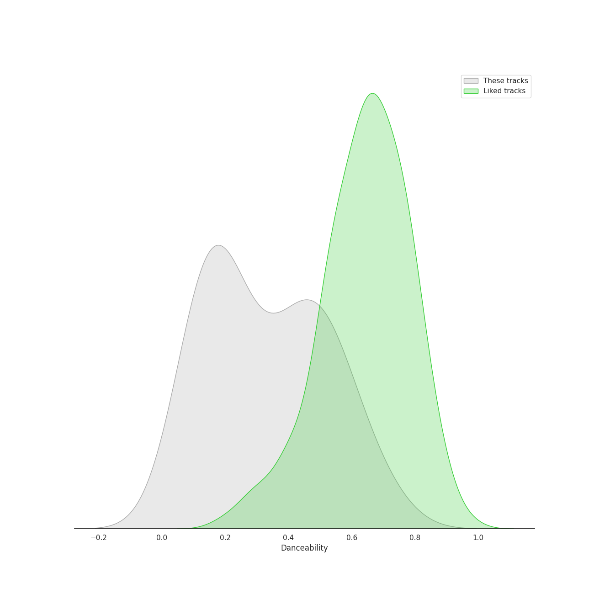
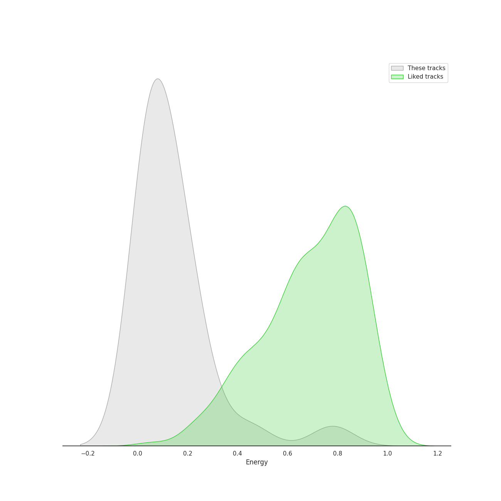
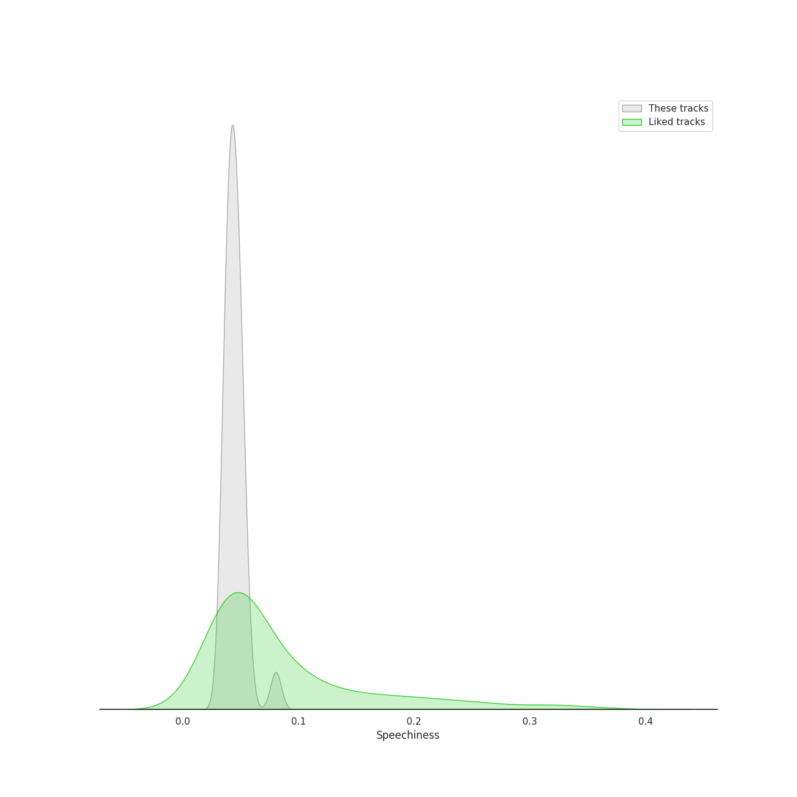
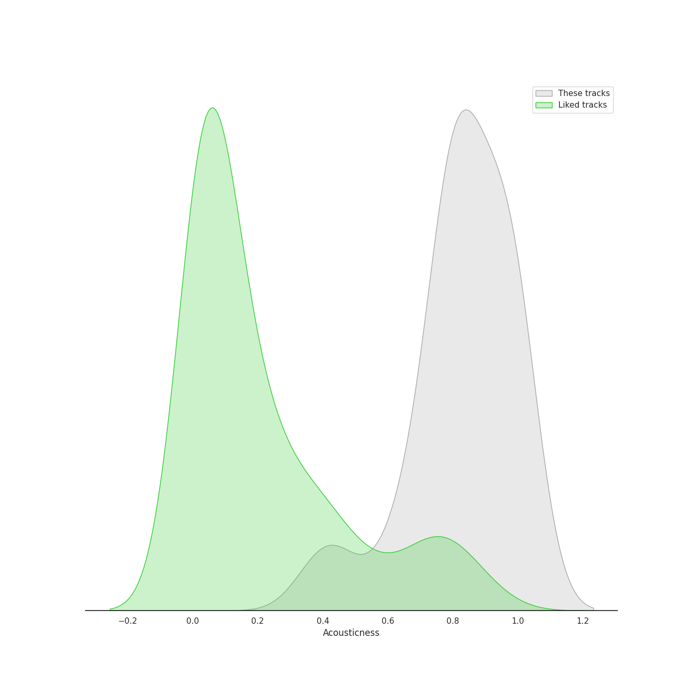
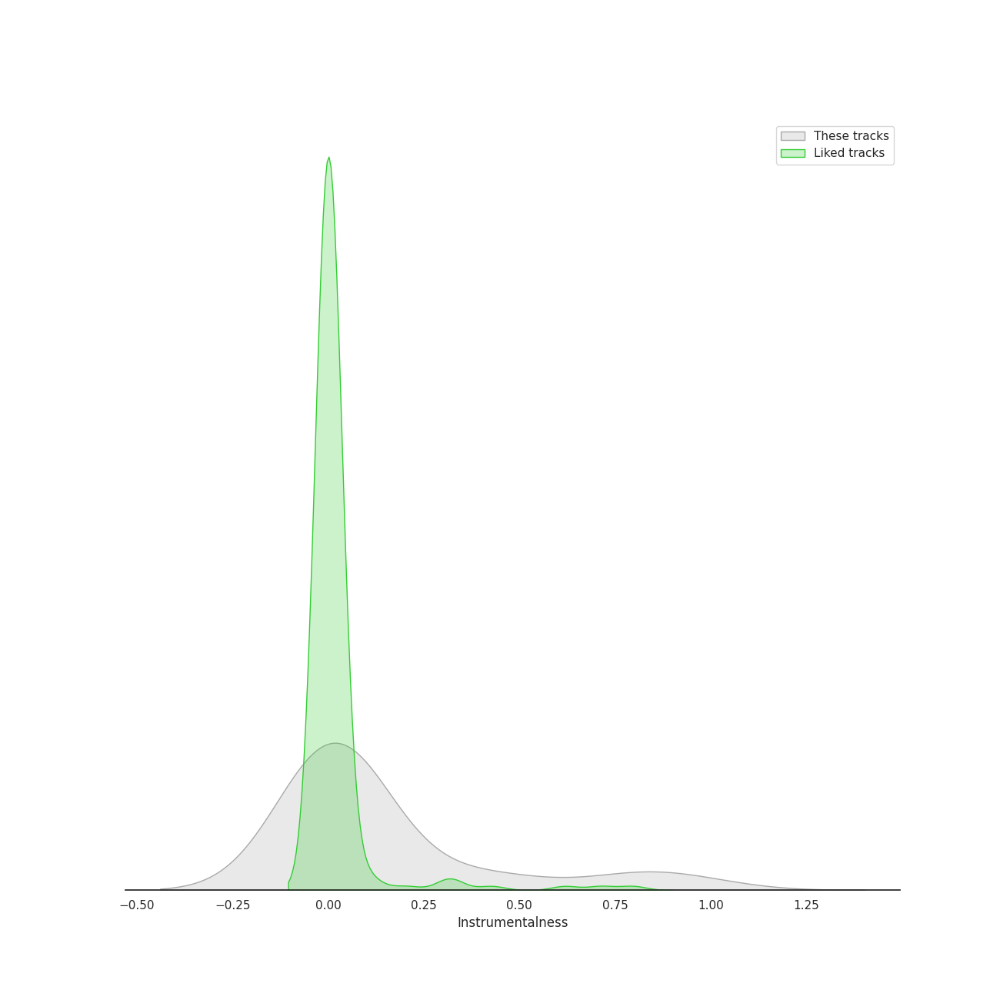
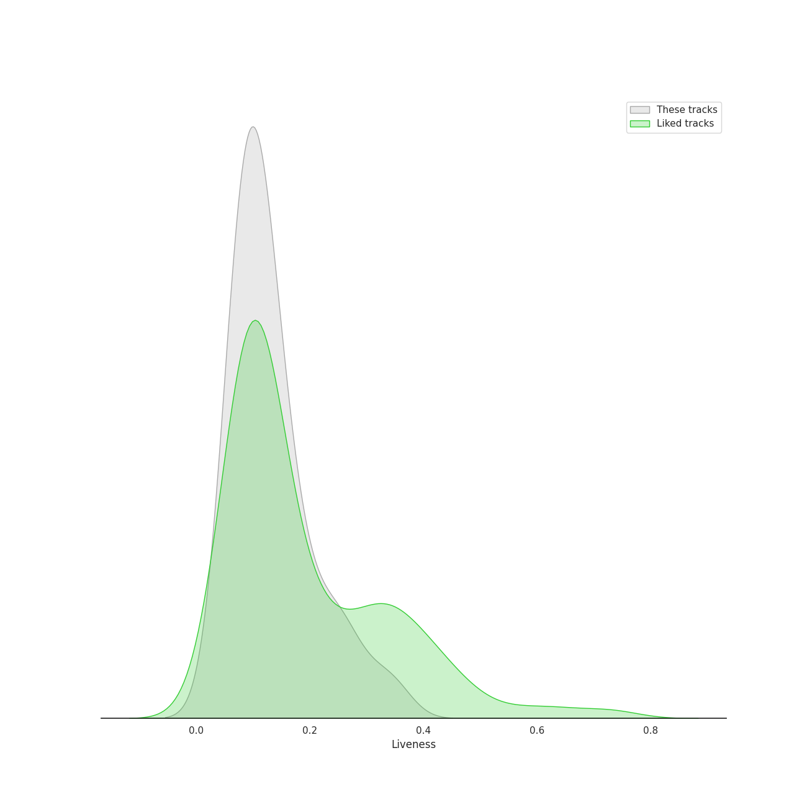
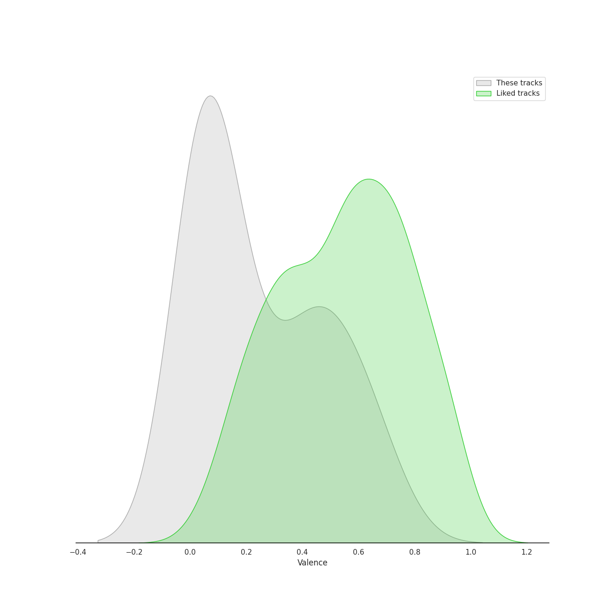
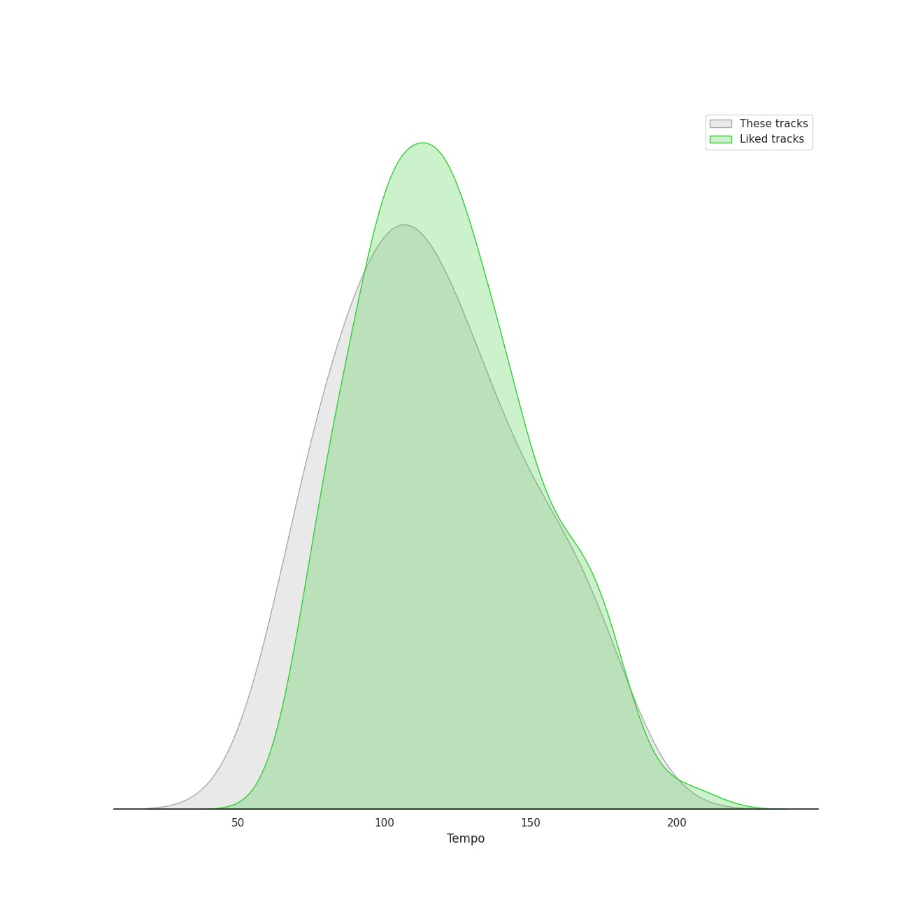

# Audio Features for Decca (UMO)

## Danceability

| ​ | 10 most Danceable tracks | ​​ | 10 least Danceable tracks |
|:---|:---|:---|:---|
|  | Geronimo (0.705) |  | Three Songs Of Faith: Hope Faith Life Love (0.0771) |
|  | Concerto for Oboe, Violin, Strings and Continuo in B Flat Major, RV 548: I. (Allegro) (0.603) |  | Lux Aurumque (0.0783) |
|  | Concerto for Oboe, Violin, Strings and Continuo in B Flat Major, RV 548: III. Allegro (0.602) |  | Concerto for Violin and Strings in E Major, Op. 8, No. 1, RV 269 "La Primavera": II. Largo (0.11) |
|  | Violin Concerto in E Major, Op. 8, No. 1, RV 269 "La Primavera": I. Allegro (0.557) |  | Water Night (0.115) |
|  | Concerto for 2 Violins, Strings and Continuo in G Major, RV 516: III. Allegro (0.518) |  | Leonardo Dreams Of His Flying Machine (0.135) |
|  | Violin Concerto in F Major, Op. 8, No. 3, RV 293 "L'autunno": I. Allegro (Ballo, e canto de' villanelli) (0.496) |  | Concerto for Violin and Strings in G Minor, Op. 8, No. 2, RV 315 "L'estate": II. Adagio - Presto - Adagio (0.161) |
|  | Concerto for 2 Violins, Strings and Continuo in G Major, RV 516: I. Allegro molto (0.49) |  | Sleep (0.169) |
|  | Violin Concerto in F Major, Op. 8, No. 3, RV 293 "L'autunno": III. Allegro (La caccia) (0.489) |  | Three Songs Of Faith: I Thank You God For Most This Amazing Day (0.171) |
|  | Violin Concerto in F Minor, Op. 8, No. 4, RV 297 "L'inverno": I. Allegro non molto (0.444) |  | Concerto for Oboe, Violin, Strings and Continuo in B Flat Major, RV 548: II. Largo (0.181) |
|  | Violin Concerto in F Minor, Op. 8, No. 4, RV 297 "L'inverno": III. Allegro (0.44) |  | Concerto for Violin and Strings in F Major, Op. 8, No. 3, RV 293 "L'autunno": II. Adagio molto (Ubriachi dormienti) (0.197) |

## Energy

| ​ | 10 most Energetic tracks | ​​ | 10 least Energetic tracks |
|:---|:---|:---|:---|
|  | Geronimo (0.78) |  | Concerto for Violin and Strings in F Major, Op. 8, No. 3, RV 293 "L'autunno": II. Adagio molto (Ubriachi dormienti) (0.0216) |
|  | Violin Concerto in G Minor, Op. 8, No. 2, RV 315 "L'estate": III. Presto (Tempo impetuoso d'estate) (0.449) |  | The Seal Lullaby (0.0217) |
|  | Violin Concerto in F Minor, Op. 8, No. 4, RV 297 "L'inverno": I. Allegro non molto (0.282) |  | Lux Aurumque (0.0262) |
|  | Concerto for Violin and Strings in G Minor, Op. 8, No. 2, RV 315 "L'estate": I. Allegro non molto - Allegro (0.243) |  | Concerto for Oboe, Violin, Strings and Continuo in B Flat Major, RV 548: II. Largo (0.027) |
|  | Violin Concerto in F Minor, Op. 8, No. 4, RV 297 "L'inverno": III. Allegro (0.202) |  | Concerto for 2 Violins, Strings and Continuo in G Major, RV 516: II. Andante (molto) (0.0306) |
|  | Violin Concerto in F Major, Op. 8, No. 3, RV 293 "L'autunno": III. Allegro (La caccia) (0.193) |  | Water Night (0.0352) |
|  | Concerto for 2 Violins, Strings and Continuo in G Major, RV 516: III. Allegro (0.186) |  | Sleep (0.0378) |
|  | Concerto for 2 Violins, Strings and Continuo in G Major, RV 516: I. Allegro molto (0.181) |  | Violin Concerto in F Minor, Op. 8, No. 4, RV 297 "L'inverno": II. Largo (0.0459) |
|  | Concerto for Oboe, Violin, Strings and Continuo in B Flat Major, RV 548: I. (Allegro) (0.156) |  | Concerto for Violin and Strings in G Minor, Op. 8, No. 2, RV 315 "L'estate": II. Adagio - Presto - Adagio (0.048) |
|  | Violin Concerto in F Major, Op. 8, No. 3, RV 293 "L'autunno": I. Allegro (Ballo, e canto de' villanelli) (0.154) |  | Concerto for Violin and Strings in E Major, Op. 8, No. 1, RV 269 "La Primavera": II. Largo (0.054) |

## Speechiness

| ​ | 10 most Speechy tracks | ​​ | 10 least Speechy tracks |
|:---|:---|:---|:---|
|  | Geronimo (0.0805) |  | Violin Concerto in G Minor, Op. 8, No. 2, RV 315 "L'estate": III. Presto (Tempo impetuoso d'estate) (0.0336) |
|  | Concerto for 2 Violins, Strings and Continuo in G Major, RV 516: I. Allegro molto (0.0557) |  | Concerto for Oboe, Violin, Strings and Continuo in B Flat Major, RV 548: III. Allegro (0.0353) |
|  | Violin Concerto in F Minor, Op. 8, No. 4, RV 297 "L'inverno": III. Allegro (0.053) |  | Violin Concerto in E Major, Op. 8, No. 1, RV 269 "La Primavera": I. Allegro (0.036) |
|  | Violin Concerto in F Minor, Op. 8, No. 4, RV 297 "L'inverno": II. Largo (0.0516) |  | Concerto for Violin and Strings in F Major, Op. 8, No. 3, RV 293 "L'autunno": II. Adagio molto (Ubriachi dormienti) (0.0374) |
|  | Violin Concerto in F Major, Op. 8, No. 3, RV 293 "L'autunno": III. Allegro (La caccia) (0.0503) |  | Concerto for Violin and Strings in E Major, Op. 8, No. 1, RV 269 "La Primavera": III. Allegro (Danza pastorale) (0.0375) |
|  | Violin Concerto in F Major, Op. 8, No. 3, RV 293 "L'autunno": I. Allegro (Ballo, e canto de' villanelli) (0.0503) |  | Concerto for Oboe, Violin, Strings and Continuo in B Flat Major, RV 548: I. (Allegro) (0.0376) |
|  | Lux Aurumque (0.0489) |  | Water Night (0.0386) |
|  | Concerto for 2 Violins, Strings and Continuo in G Major, RV 516: II. Andante (molto) (0.0477) |  | Concerto for 2 Violins, Strings and Continuo in G Major, RV 516: III. Allegro (0.0402) |
|  | Concerto for Violin and Strings in E Major, Op. 8, No. 1, RV 269 "La Primavera": II. Largo (0.0467) |  | The Seal Lullaby (0.0413) |
|  | Concerto for Violin and Strings in G Minor, Op. 8, No. 2, RV 315 "L'estate": I. Allegro non molto - Allegro (0.0466) |  | Three Songs Of Faith: Hope Faith Life Love (0.0414) |

## Acousticness

| ​ | 10 most Acoustic tracks | ​​ | 10 least Acoustic tracks |
|:---|:---|:---|:---|
|  | Three Songs Of Faith: Hope Faith Life Love (0.99) |  | Concerto for Violin and Strings in F Major, Op. 8, No. 3, RV 293 "L'autunno": II. Adagio molto (Ubriachi dormienti) (0.386) |
|  | Three Songs Of Faith: I Will Wade Out (0.988) |  | Geronimo (0.456) |
|  | The Seal Lullaby (0.988) |  | Concerto for Violin and Strings in E Major, Op. 8, No. 1, RV 269 "La Primavera": III. Allegro (Danza pastorale) (0.644) |
|  | Sleep (0.987) |  | Violin Concerto in F Minor, Op. 8, No. 4, RV 297 "L'inverno": II. Largo (0.65) |
|  | Three Songs Of Faith: I Thank You God For Most This Amazing Day (0.987) |  | Concerto for Violin and Strings in G Minor, Op. 8, No. 2, RV 315 "L'estate": I. Allegro non molto - Allegro (0.762) |
|  | Water Night (0.986) |  | Concerto for Oboe, Violin, Strings and Continuo in B Flat Major, RV 548: II. Largo (0.763) |
|  | Lux Aurumque (0.986) |  | Concerto for Violin and Strings in G Minor, Op. 8, No. 2, RV 315 "L'estate": II. Adagio - Presto - Adagio (0.78) |
|  | Leonardo Dreams Of His Flying Machine (0.98) |  | Violin Concerto in E Major, Op. 8, No. 1, RV 269 "La Primavera": I. Allegro (0.785) |
|  | Concerto for Violin and Strings in E Major, Op. 8, No. 1, RV 269 "La Primavera": II. Largo (0.902) |  | Concerto for Oboe, Violin, Strings and Continuo in B Flat Major, RV 548: III. Allegro (0.79) |
|  | Concerto for 2 Violins, Strings and Continuo in G Major, RV 516: II. Andante (molto) (0.896) |  | Concerto for 2 Violins, Strings and Continuo in G Major, RV 516: III. Allegro (0.794) |

## Instrumentalness

| ​ | 10 most Instrumental tracks | ​​ | 10 least Instrumental tracks |
|:---|:---|:---|:---|
|  | Lux Aurumque (0.964) |  | Violin Concerto in F Minor, Op. 8, No. 4, RV 297 "L'inverno": II. Largo (0.0) |
|  | The Seal Lullaby (0.819) |  | Concerto for Violin and Strings in F Major, Op. 8, No. 3, RV 293 "L'autunno": II. Adagio molto (Ubriachi dormienti) (2.04e-06) |
|  | Violin Concerto in G Minor, Op. 8, No. 2, RV 315 "L'estate": III. Presto (Tempo impetuoso d'estate) (0.789) |  | Concerto for 2 Violins, Strings and Continuo in G Major, RV 516: II. Andante (molto) (1.26e-05) |
|  | Three Songs Of Faith: Hope Faith Life Love (0.445) |  | Concerto for Violin and Strings in E Major, Op. 8, No. 1, RV 269 "La Primavera": III. Allegro (Danza pastorale) (1.42e-05) |
|  | Violin Concerto in F Major, Op. 8, No. 3, RV 293 "L'autunno": III. Allegro (La caccia) (0.416) |  | Concerto for 2 Violins, Strings and Continuo in G Major, RV 516: I. Allegro molto (5.38e-05) |
|  | Three Songs Of Faith: I Thank You God For Most This Amazing Day (0.232) |  | Concerto for 2 Violins, Strings and Continuo in G Major, RV 516: III. Allegro (0.000132) |
|  | Water Night (0.0648) |  | Violin Concerto in F Minor, Op. 8, No. 4, RV 297 "L'inverno": III. Allegro (0.000243) |
|  | Sleep (0.0524) |  | Concerto for Violin and Strings in G Minor, Op. 8, No. 2, RV 315 "L'estate": I. Allegro non molto - Allegro (0.000308) |
|  | Concerto for Oboe, Violin, Strings and Continuo in B Flat Major, RV 548: II. Largo (0.0406) |  | Concerto for Violin and Strings in G Minor, Op. 8, No. 2, RV 315 "L'estate": II. Adagio - Presto - Adagio (0.000318) |
|  | Violin Concerto in F Major, Op. 8, No. 3, RV 293 "L'autunno": I. Allegro (Ballo, e canto de' villanelli) (0.0279) |  | Geronimo (0.00152) |

## Liveness

| ​ | 10 most Live tracks | ​​ | 10 least Live tracks |
|:---|:---|:---|:---|
|  | Concerto for Oboe, Violin, Strings and Continuo in B Flat Major, RV 548: I. (Allegro) (0.341) |  | Concerto for Violin and Strings in F Major, Op. 8, No. 3, RV 293 "L'autunno": II. Adagio molto (Ubriachi dormienti) (0.0551) |
|  | Violin Concerto in G Minor, Op. 8, No. 2, RV 315 "L'estate": III. Presto (Tempo impetuoso d'estate) (0.279) |  | Concerto for Violin and Strings in E Major, Op. 8, No. 1, RV 269 "La Primavera": III. Allegro (Danza pastorale) (0.0639) |
|  | Concerto for Violin and Strings in G Minor, Op. 8, No. 2, RV 315 "L'estate": II. Adagio - Presto - Adagio (0.239) |  | Concerto for Violin and Strings in E Major, Op. 8, No. 1, RV 269 "La Primavera": II. Largo (0.0715) |
|  | Leonardo Dreams Of His Flying Machine (0.239) |  | Violin Concerto in F Major, Op. 8, No. 3, RV 293 "L'autunno": I. Allegro (Ballo, e canto de' villanelli) (0.0717) |
|  | Concerto for 2 Violins, Strings and Continuo in G Major, RV 516: II. Andante (molto) (0.183) |  | Concerto for 2 Violins, Strings and Continuo in G Major, RV 516: III. Allegro (0.0731) |
|  | Sleep (0.175) |  | Violin Concerto in F Minor, Op. 8, No. 4, RV 297 "L'inverno": I. Allegro non molto (0.0771) |
|  | Three Songs Of Faith: I Will Wade Out (0.174) |  | Concerto for 2 Violins, Strings and Continuo in G Major, RV 516: I. Allegro molto (0.0827) |
|  | Concerto for Oboe, Violin, Strings and Continuo in B Flat Major, RV 548: II. Largo (0.145) |  | The Seal Lullaby (0.0836) |
|  | Violin Concerto in F Minor, Op. 8, No. 4, RV 297 "L'inverno": III. Allegro (0.139) |  | Violin Concerto in E Major, Op. 8, No. 1, RV 269 "La Primavera": I. Allegro (0.0903) |
|  | Water Night (0.128) |  | Violin Concerto in F Minor, Op. 8, No. 4, RV 297 "L'inverno": II. Largo (0.0907) |

## Valence

| ​ | 10 most Happy tracks | ​​ | 10 least Happy tracks |
|:---|:---|:---|:---|
|  | Violin Concerto in G Minor, Op. 8, No. 2, RV 315 "L'estate": III. Presto (Tempo impetuoso d'estate) (0.688) |  | Lux Aurumque (0.0241) |
|  | Concerto for Oboe, Violin, Strings and Continuo in B Flat Major, RV 548: III. Allegro (0.655) |  | Three Songs Of Faith: Hope Faith Life Love (0.0285) |
|  | Concerto for 2 Violins, Strings and Continuo in G Major, RV 516: III. Allegro (0.597) |  | Sleep (0.0311) |
|  | Concerto for Oboe, Violin, Strings and Continuo in B Flat Major, RV 548: I. (Allegro) (0.558) |  | Three Songs Of Faith: I Thank You God For Most This Amazing Day (0.0315) |
|  | Violin Concerto in F Major, Op. 8, No. 3, RV 293 "L'autunno": III. Allegro (La caccia) (0.487) |  | Water Night (0.0321) |
|  | Violin Concerto in F Minor, Op. 8, No. 4, RV 297 "L'inverno": I. Allegro non molto (0.476) |  | Leonardo Dreams Of His Flying Machine (0.0354) |
|  | Concerto for 2 Violins, Strings and Continuo in G Major, RV 516: I. Allegro molto (0.474) |  | Concerto for Violin and Strings in F Major, Op. 8, No. 3, RV 293 "L'autunno": II. Adagio molto (Ubriachi dormienti) (0.0357) |
|  | Geronimo (0.457) |  | Three Songs Of Faith: I Will Wade Out (0.0364) |
|  | Violin Concerto in F Minor, Op. 8, No. 4, RV 297 "L'inverno": III. Allegro (0.355) |  | Concerto for Violin and Strings in E Major, Op. 8, No. 1, RV 269 "La Primavera": II. Largo (0.056) |
|  | Concerto for Violin and Strings in E Major, Op. 8, No. 1, RV 269 "La Primavera": III. Allegro (Danza pastorale) (0.349) |  | Concerto for 2 Violins, Strings and Continuo in G Major, RV 516: II. Andante (molto) (0.0571) |

## Tempo

| ​ | 10 most Fast tracks | ​​ | 10 least Fast tracks |
|:---|:---|:---|:---|
|  | Three Songs Of Faith: Hope Faith Life Love (177.027) |  | The Seal Lullaby (66.349) |
|  | Concerto for Violin and Strings in G Minor, Op. 8, No. 2, RV 315 "L'estate": II. Adagio - Presto - Adagio (169.019) |  | Lux Aurumque (71.984) |
|  | Violin Concerto in F Major, Op. 8, No. 3, RV 293 "L'autunno": III. Allegro (La caccia) (163.261) |  | Leonardo Dreams Of His Flying Machine (78.661) |
|  | Violin Concerto in F Minor, Op. 8, No. 4, RV 297 "L'inverno": I. Allegro non molto (160.272) |  | Violin Concerto in F Minor, Op. 8, No. 4, RV 297 "L'inverno": II. Largo (78.889) |
|  | Violin Concerto in G Minor, Op. 8, No. 2, RV 315 "L'estate": III. Presto (Tempo impetuoso d'estate) (148.655) |  | Three Songs Of Faith: I Will Wade Out (80.473) |
|  | Geronimo (142.028) |  | Concerto for Violin and Strings in E Major, Op. 8, No. 1, RV 269 "La Primavera": II. Largo (83.291) |
|  | Concerto for Violin and Strings in G Minor, Op. 8, No. 2, RV 315 "L'estate": I. Allegro non molto - Allegro (140.775) |  | Water Night (94.101) |
|  | Concerto for 2 Violins, Strings and Continuo in G Major, RV 516: III. Allegro (133.726) |  | Concerto for Oboe, Violin, Strings and Continuo in B Flat Major, RV 548: III. Allegro (99.139) |
|  | Sleep (126.634) |  | Concerto for Violin and Strings in E Major, Op. 8, No. 1, RV 269 "La Primavera": III. Allegro (Danza pastorale) (99.661) |
|  | Three Songs Of Faith: I Thank You God For Most This Amazing Day (126.033) |  | Concerto for Oboe, Violin, Strings and Continuo in B Flat Major, RV 548: II. Largo (100.326) |
