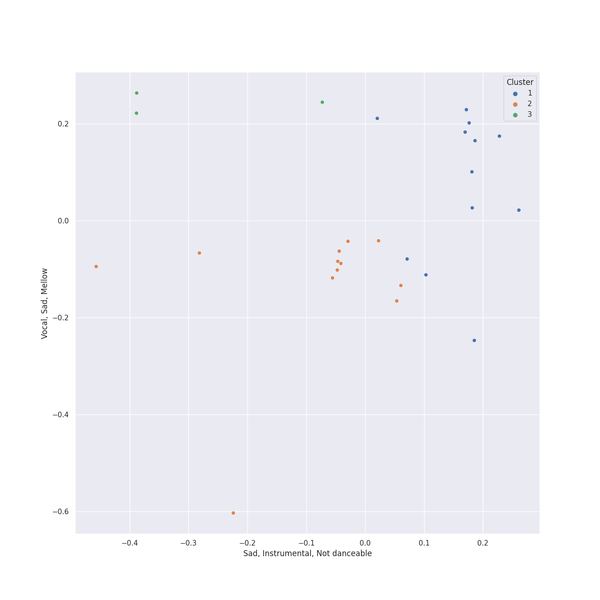

# Clusters in Decca (UMO)

## Cluster #1

12 tracks

| Art | Track | Album | Artists | Label | 💚 | 🔗 |
|:---|:---|:---|:---|:---|:---|:---|
|  | Concerto for 2 Violins, Strings and Continuo in G Major, RV 516: II. Andante (molto) | Vivaldi: Four Seasons | Antonio Vivaldi, Simon Standage, Elizabeth Wilcock, The English Concert, Trevor Pinnock | [Decca (UMO)](../..) | | [🔗](https://open.spotify.com/track/4QlEleNkTjc5gQ91bp36zu) |
|  | Concerto for Oboe, Violin, Strings and Continuo in B Flat Major, RV 548: II. Largo | Vivaldi: Four Seasons | Antonio Vivaldi, David Reichenberg, Simon Standage, The English Concert, Trevor Pinnock | [Decca (UMO)](../..) | | [🔗](https://open.spotify.com/track/3B3QTyekgd312pKThlsJFz) |
|  | Concerto for Violin and Strings in E Major, Op. 8, No. 1, RV 269 "La Primavera": II. Largo | Vivaldi: Four Seasons | Antonio Vivaldi, Simon Standage, The English Concert, Trevor Pinnock | [Decca (UMO)](../..) | | [🔗](https://open.spotify.com/track/2zqo3j2nf3JyLydxdFkps5) |
|  | Concerto for Violin and Strings in G Minor, Op. 8, No. 2, RV 315 "L'estate": I. Allegro non molto - Allegro | Vivaldi: Four Seasons | Antonio Vivaldi, Simon Standage, The English Concert, Trevor Pinnock | [Decca (UMO)](../..) | | [🔗](https://open.spotify.com/track/2l4thc8hzFRHlFPZgvAXeF) |
|  | Concerto for Violin and Strings in G Minor, Op. 8, No. 2, RV 315 "L'estate": II. Adagio - Presto - Adagio | Vivaldi: Four Seasons | Antonio Vivaldi, Simon Standage, The English Concert, Trevor Pinnock | [Decca (UMO)](../..) | | [🔗](https://open.spotify.com/track/2tpUWGibf9sV6OZy6XNvBf) |
|  | Whitacre: Leonardo Dreams Of His Flying Machine | Light & Gold | Eric Whitacre, Eric Whitacre Singers | [Decca (UMO)](../..) | | [🔗](https://open.spotify.com/track/2GuDgGY2TmwVo3uMlp1iW3) |
|  | Whitacre: Sleep | Light & Gold | Eric Whitacre, Eric Whitacre Singers | [Decca (UMO)](../..) | | [🔗](https://open.spotify.com/track/78BLTUqTCCHuptFEGejEoS) |
|  | Whitacre: Three Songs Of Faith: I Thank You God For Most This Amazing Day | Light & Gold | Eric Whitacre, Eric Whitacre Singers | [Decca (UMO)](../..) | | [🔗](https://open.spotify.com/track/6ryPjtGVmAk6v2rKNBKBc6) |
|  | Whitacre: Three Songs Of Faith: I Will Wade Out | Light & Gold | Eric Whitacre, Eric Whitacre Singers | [Decca (UMO)](../..) | | [🔗](https://open.spotify.com/track/3bMGaK0AfpU3J321Mlm553) |
|  | Whitacre: Water Night | Light & Gold | Eric Whitacre, Eric Whitacre Singers | [Decca (UMO)](../..) | | [🔗](https://open.spotify.com/track/5w0L0SdyLv7BK8hXctiHhm) |
## Cluster #2

12 tracks

| Art | Track | Album | Artists | Label | 💚 | 🔗 |
|:---|:---|:---|:---|:---|:---|:---|
|  | Concerto for 2 Violins, Strings and Continuo in G Major, RV 516: I. Allegro molto | Vivaldi: Four Seasons | Antonio Vivaldi, Simon Standage, Elizabeth Wilcock, The English Concert, Trevor Pinnock | [Decca (UMO)](../..) | | [🔗](https://open.spotify.com/track/6y3VNh7JmGHIlk2zDXX6Wr) |
|  | Concerto for 2 Violins, Strings and Continuo in G Major, RV 516: III. Allegro | Vivaldi: Four Seasons | Antonio Vivaldi, Simon Standage, Elizabeth Wilcock, The English Concert, Trevor Pinnock | [Decca (UMO)](../..) | | [🔗](https://open.spotify.com/track/2R1otrP1Kuu2LY3ho9127T) |
|  | Concerto for Oboe, Violin, Strings and Continuo in B Flat Major, RV 548: I. (Allegro) | Vivaldi: Four Seasons | Antonio Vivaldi, David Reichenberg, Simon Standage, The English Concert, Trevor Pinnock | [Decca (UMO)](../..) | | [🔗](https://open.spotify.com/track/1Vie0eEAyPHCrEK5AkkXqD) |
|  | Concerto for Oboe, Violin, Strings and Continuo in B Flat Major, RV 548: III. Allegro | Vivaldi: Four Seasons | Antonio Vivaldi, David Reichenberg, Simon Standage, The English Concert, Trevor Pinnock | [Decca (UMO)](../..) | | [🔗](https://open.spotify.com/track/3gnVf7jAZjmV9QhkhLQcOO) |
|  | Concerto for Violin and Strings in E Major, Op. 8, No. 1, RV 269 "La Primavera": III. Allegro (Danza pastorale) | Vivaldi: Four Seasons | Antonio Vivaldi, Simon Standage, The English Concert, Trevor Pinnock | [Decca (UMO)](../..) | | [🔗](https://open.spotify.com/track/25WOKott6eYT4t9WesF3F7) |
|  | Violin Concerto in E Major, Op. 8, No. 1, RV 269 "La Primavera": I. Allegro | Vivaldi: Four Seasons | Antonio Vivaldi, Simon Standage, The English Concert, Trevor Pinnock | [Decca (UMO)](../..) | | [🔗](https://open.spotify.com/track/2xApS0qLehnWIBuHPP2gBp) |
|  | Violin Concerto in F Major, Op. 8, No. 3, RV 293 "L'autunno": I. Allegro (Ballo, e canto de' villanelli) | Vivaldi: Four Seasons | Antonio Vivaldi, Simon Standage, The English Concert, Trevor Pinnock | [Decca (UMO)](../..) | | [🔗](https://open.spotify.com/track/5or01FkVmY6aAg0YEIySg8) |
|  | Violin Concerto in F Major, Op. 8, No. 3, RV 293 "L'autunno": III. Allegro (La caccia) | Vivaldi: Four Seasons | Antonio Vivaldi, Simon Standage, The English Concert, Trevor Pinnock | [Decca (UMO)](../..) | | [🔗](https://open.spotify.com/track/6KqX73AWh9AFbPQsNvrAnL) |
|  | Violin Concerto in F Minor, Op. 8, No. 4, RV 297 "L'inverno": I. Allegro non molto | Vivaldi: Four Seasons | Antonio Vivaldi, Simon Standage, The English Concert, Trevor Pinnock | [Decca (UMO)](../..) | | [🔗](https://open.spotify.com/track/1jkMzOnb3APNXYKJ1Uzijb) |
|  | Violin Concerto in F Minor, Op. 8, No. 4, RV 297 "L'inverno": III. Allegro | Vivaldi: Four Seasons | Antonio Vivaldi, Simon Standage, The English Concert, Trevor Pinnock | [Decca (UMO)](../..) | | [🔗](https://open.spotify.com/track/1s6z69thm3lJw9DHmTGmjc) |
## Cluster #3

3 tracks

| Art | Track | Album | Artists | Label | 💚 | 🔗 |
|:---|:---|:---|:---|:---|:---|:---|
|  | Whitacre: Lux Aurumque | Light & Gold | Eric Whitacre, Eric Whitacre Singers | [Decca (UMO)](../..) | | [🔗](https://open.spotify.com/track/5bUdtdODnRPeQpmMoqhvVY) |
|  | Whitacre: The Seal Lullaby | Light & Gold | Eric Whitacre, Eric Whitacre Singers | [Decca (UMO)](../..) | | [🔗](https://open.spotify.com/track/1ZqzUiCQICQmjtpbFZYwnt) |
|  | Whitacre: Three Songs Of Faith: Hope Faith Life Love | Light & Gold | Eric Whitacre, Eric Whitacre Singers | [Decca (UMO)](../..) | | [🔗](https://open.spotify.com/track/2U9ygpUiA0gk9KSPoqQlJG) |