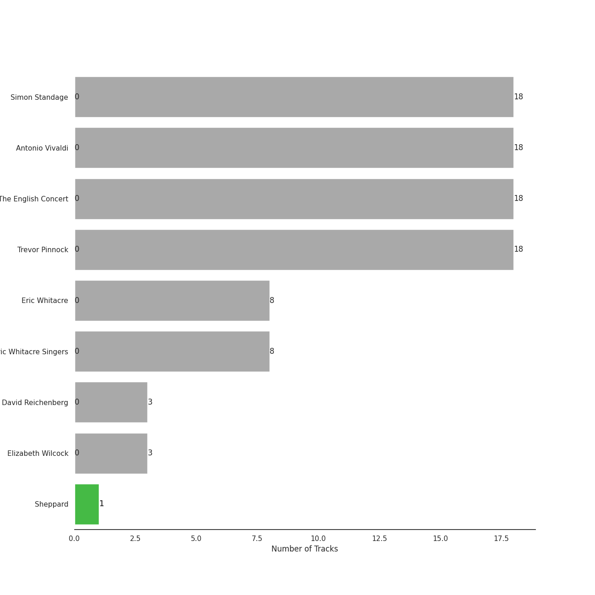
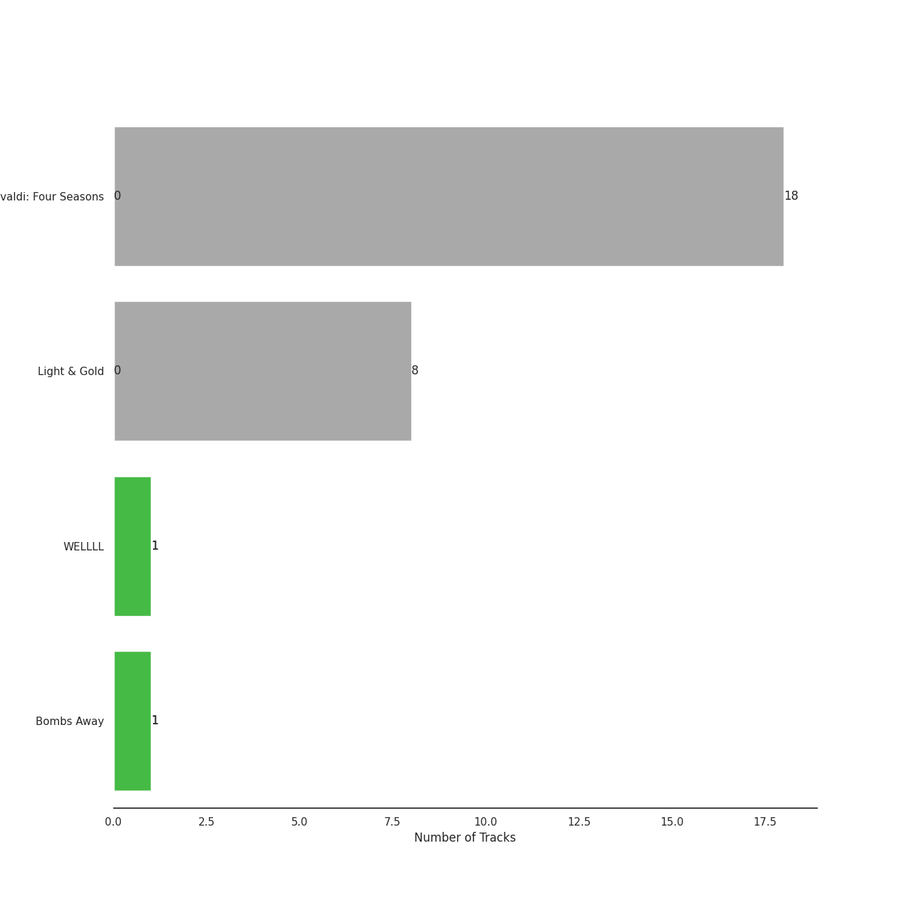
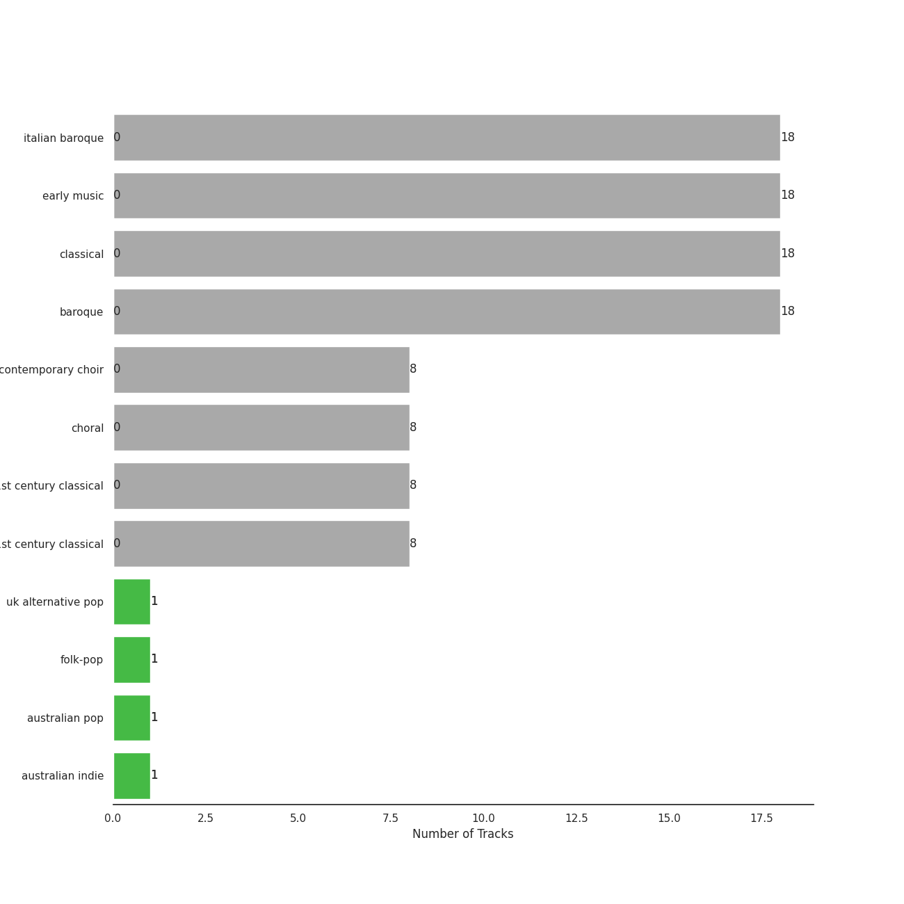

# Decca (UMO)

27 songs

Appears as:
- Decca (UMO) (27 tracks)

## Top Artists

| Art | Tracks | 💚 | Artist | 🔗 |
|:---|---:|---:|:---|:---|
|  | 1 | 1 | Sheppard | [🔗](https://open.spotify.com/artist/6VxCmtR7S3yz4vnzsJqhSV) |
|  | 18 | 0 | Simon Standage | [🔗](https://open.spotify.com/artist/2jIBkRzVUboTbp05rJnKeT) |
|  | 18 | 0 | Antonio Vivaldi | [🔗](https://open.spotify.com/artist/2QOIawHpSlOwXDvSqQ9YJR) |
|  | 18 | 0 | The English Concert | [🔗](https://open.spotify.com/artist/2Oz3z7PPQUMU2KNYgcO1sA) |
|  | 18 | 0 | Trevor Pinnock | [🔗](https://open.spotify.com/artist/25mbgceDJKxXGP8c5FmC83) |
|  | 8 | 0 | Eric Whitacre | [🔗](https://open.spotify.com/artist/5TWpCLIhvGlbJmLK1zNpiL) |
|  | 8 | 0 | Eric Whitacre Singers | [🔗](https://open.spotify.com/artist/2tPhboxrWrQ4LxOhWlXAeN) |
|  | 3 | 0 | David Reichenberg | [🔗](https://open.spotify.com/artist/5xA5sW0D3BUAyL02XcDkYv) |
|  | 3 | 0 | Elizabeth Wilcock | [🔗](https://open.spotify.com/artist/1OfYCRcS14pyRVrO0qTCbs) |

## Top Albums

| Art | Tracks | 💚 | Album | Release Date | 🔗 |
|:---|---:|---:|:---|:---|:---|
|  | 18 | 0 | Vivaldi: Four Seasons | 2008-01-01 | [🔗](https://open.spotify.com/album/4Uc1Cus3I9LjkI2XwtQnfc) |
|  | 8 | 0 | Light & Gold | 2010-01-01 | [🔗](https://open.spotify.com/album/2hnquPCPDsr3Srk64rdeVS) |
|  | 1 | 1 | Bombs Away | 2015-03-10 | [🔗](https://open.spotify.com/album/2Yi29VOccHCwktsZNqtxbt) |

## Genres

| Tracks | 💚 | Genre |
|---:|---:|:---|
| 1 | 1 | folk-pop |
| 1 | 1 | australian indie |
| 18 | 0 | italian baroque |
| 18 | 0 | early music |
| 18 | 0 | classical |
| 18 | 0 | baroque |
| 8 | 0 | contemporary choir |
| 8 | 0 | choral |
| 8 | 0 | american 21st century classical |
| 8 | 0 | 21st century classical |

## Tracks released under Decca (UMO)

| Art | Track | Album | Artists | Label | 💚 | 🔗 |
|:---|:---|:---|:---|:---|:---|:---|
|  | Concerto for 2 Violins, Strings and Continuo in G Major, RV 516: I. Allegro molto | Vivaldi: Four Seasons | Antonio Vivaldi, Simon Standage, Elizabeth Wilcock, The English Concert, Trevor Pinnock | [Decca (UMO)](.) | | [🔗](https://open.spotify.com/track/6y3VNh7JmGHIlk2zDXX6Wr) |
|  | Concerto for 2 Violins, Strings and Continuo in G Major, RV 516: II. Andante (molto) | Vivaldi: Four Seasons | Antonio Vivaldi, Simon Standage, Elizabeth Wilcock, The English Concert, Trevor Pinnock | [Decca (UMO)](.) | | [🔗](https://open.spotify.com/track/4QlEleNkTjc5gQ91bp36zu) |
|  | Concerto for 2 Violins, Strings and Continuo in G Major, RV 516: III. Allegro | Vivaldi: Four Seasons | Antonio Vivaldi, Simon Standage, Elizabeth Wilcock, The English Concert, Trevor Pinnock | [Decca (UMO)](.) | | [🔗](https://open.spotify.com/track/2R1otrP1Kuu2LY3ho9127T) |
|  | Concerto for Oboe, Violin, Strings and Continuo in B Flat Major, RV 548: I. (Allegro) | Vivaldi: Four Seasons | Antonio Vivaldi, David Reichenberg, Simon Standage, The English Concert, Trevor Pinnock | [Decca (UMO)](.) | | [🔗](https://open.spotify.com/track/1Vie0eEAyPHCrEK5AkkXqD) |
|  | Concerto for Oboe, Violin, Strings and Continuo in B Flat Major, RV 548: II. Largo | Vivaldi: Four Seasons | Antonio Vivaldi, David Reichenberg, Simon Standage, The English Concert, Trevor Pinnock | [Decca (UMO)](.) | | [🔗](https://open.spotify.com/track/3B3QTyekgd312pKThlsJFz) |
|  | Concerto for Oboe, Violin, Strings and Continuo in B Flat Major, RV 548: III. Allegro | Vivaldi: Four Seasons | Antonio Vivaldi, David Reichenberg, Simon Standage, The English Concert, Trevor Pinnock | [Decca (UMO)](.) | | [🔗](https://open.spotify.com/track/3gnVf7jAZjmV9QhkhLQcOO) |
|  | Concerto for Violin and Strings in E Major, Op. 8, No. 1, RV 269 "La Primavera": II. Largo | Vivaldi: Four Seasons | Antonio Vivaldi, Simon Standage, The English Concert, Trevor Pinnock | [Decca (UMO)](.) | | [🔗](https://open.spotify.com/track/2zqo3j2nf3JyLydxdFkps5) |
|  | Concerto for Violin and Strings in E Major, Op. 8, No. 1, RV 269 "La Primavera": III. Allegro (Danza pastorale) | Vivaldi: Four Seasons | Antonio Vivaldi, Simon Standage, The English Concert, Trevor Pinnock | [Decca (UMO)](.) | | [🔗](https://open.spotify.com/track/25WOKott6eYT4t9WesF3F7) |
|  | Concerto for Violin and Strings in F Major, Op. 8, No. 3, RV 293 "L'autunno": II. Adagio molto (Ubriachi dormienti) | Vivaldi: Four Seasons | Antonio Vivaldi, Simon Standage, The English Concert, Trevor Pinnock | [Decca (UMO)](.) | | [🔗](https://open.spotify.com/track/00rr9bcpswlDp38RmgNWws) |
|  | Concerto for Violin and Strings in G Minor, Op. 8, No. 2, RV 315 "L'estate": I. Allegro non molto - Allegro | Vivaldi: Four Seasons | Antonio Vivaldi, Simon Standage, The English Concert, Trevor Pinnock | [Decca (UMO)](.) | | [🔗](https://open.spotify.com/track/2l4thc8hzFRHlFPZgvAXeF) |

See all tracks

| Art | Track | Album | Artists | Label | 💚 | 🔗 |
|:---|:---|:---|:---|:---|:---|:---|
|  | Concerto for Violin and Strings in G Minor, Op. 8, No. 2, RV 315 "L'estate": II. Adagio - Presto - Adagio | Vivaldi: Four Seasons | Antonio Vivaldi, Simon Standage, The English Concert, Trevor Pinnock | [Decca (UMO)](.) | | [🔗](https://open.spotify.com/track/2tpUWGibf9sV6OZy6XNvBf) |
|  | Violin Concerto in E Major, Op. 8, No. 1, RV 269 "La Primavera": I. Allegro | Vivaldi: Four Seasons | Antonio Vivaldi, Simon Standage, The English Concert, Trevor Pinnock | [Decca (UMO)](.) | | [🔗](https://open.spotify.com/track/2xApS0qLehnWIBuHPP2gBp) |
|  | Violin Concerto in F Major, Op. 8, No. 3, RV 293 "L'autunno": I. Allegro (Ballo, e canto de' villanelli) | Vivaldi: Four Seasons | Antonio Vivaldi, Simon Standage, The English Concert, Trevor Pinnock | [Decca (UMO)](.) | | [🔗](https://open.spotify.com/track/5or01FkVmY6aAg0YEIySg8) |
|  | Violin Concerto in F Major, Op. 8, No. 3, RV 293 "L'autunno": III. Allegro (La caccia) | Vivaldi: Four Seasons | Antonio Vivaldi, Simon Standage, The English Concert, Trevor Pinnock | [Decca (UMO)](.) | | [🔗](https://open.spotify.com/track/6KqX73AWh9AFbPQsNvrAnL) |
|  | Violin Concerto in F Minor, Op. 8, No. 4, RV 297 "L'inverno": I. Allegro non molto | Vivaldi: Four Seasons | Antonio Vivaldi, Simon Standage, The English Concert, Trevor Pinnock | [Decca (UMO)](.) | | [🔗](https://open.spotify.com/track/1jkMzOnb3APNXYKJ1Uzijb) |
|  | Violin Concerto in F Minor, Op. 8, No. 4, RV 297 "L'inverno": II. Largo | Vivaldi: Four Seasons | Antonio Vivaldi, Simon Standage, The English Concert, Trevor Pinnock | [Decca (UMO)](.) | | [🔗](https://open.spotify.com/track/0UjUHRGw8V3nNRZT0wO4DE) |
|  | Violin Concerto in F Minor, Op. 8, No. 4, RV 297 "L'inverno": III. Allegro | Vivaldi: Four Seasons | Antonio Vivaldi, Simon Standage, The English Concert, Trevor Pinnock | [Decca (UMO)](.) | | [🔗](https://open.spotify.com/track/1s6z69thm3lJw9DHmTGmjc) |
|  | Violin Concerto in G Minor, Op. 8, No. 2, RV 315 "L'estate": III. Presto (Tempo impetuoso d'estate) | Vivaldi: Four Seasons | Antonio Vivaldi, Simon Standage, The English Concert, Trevor Pinnock | [Decca (UMO)](.) | | [🔗](https://open.spotify.com/track/29rpwYq7c3YzWfAzsEenUu) |
|  | Leonardo Dreams Of His Flying Machine | Light & Gold | Eric Whitacre, Eric Whitacre Singers | [Decca (UMO)](.) | | [🔗](https://open.spotify.com/track/2GuDgGY2TmwVo3uMlp1iW3) |
|  | Lux Aurumque | Light & Gold | Eric Whitacre, Eric Whitacre Singers | [Decca (UMO)](.) | | [🔗](https://open.spotify.com/track/5bUdtdODnRPeQpmMoqhvVY) |
|  | Sleep | Light & Gold | Eric Whitacre, Eric Whitacre Singers | [Decca (UMO)](.) | | [🔗](https://open.spotify.com/track/78BLTUqTCCHuptFEGejEoS) |
|  | The Seal Lullaby | Light & Gold | Eric Whitacre, Eric Whitacre Singers | [Decca (UMO)](.) | | [🔗](https://open.spotify.com/track/1ZqzUiCQICQmjtpbFZYwnt) |
|  | Three Songs Of Faith: Hope Faith Life Love | Light & Gold | Eric Whitacre, Eric Whitacre Singers | [Decca (UMO)](.) | | [🔗](https://open.spotify.com/track/2U9ygpUiA0gk9KSPoqQlJG) |
|  | Three Songs Of Faith: I Thank You God For Most This Amazing Day | Light & Gold | Eric Whitacre, Eric Whitacre Singers | [Decca (UMO)](.) | | [🔗](https://open.spotify.com/track/6ryPjtGVmAk6v2rKNBKBc6) |
|  | Three Songs Of Faith: I Will Wade Out | Light & Gold | Eric Whitacre, Eric Whitacre Singers | [Decca (UMO)](.) | | [🔗](https://open.spotify.com/track/3bMGaK0AfpU3J321Mlm553) |
|  | Water Night | Light & Gold | Eric Whitacre, Eric Whitacre Singers | [Decca (UMO)](.) | | [🔗](https://open.spotify.com/track/5w0L0SdyLv7BK8hXctiHhm) |
|  | Geronimo | Bombs Away | Sheppard | [Decca (UMO)](.) | 💚 | [🔗](https://open.spotify.com/track/19cL3SOKpwnwoKkII7U3Wh) |

