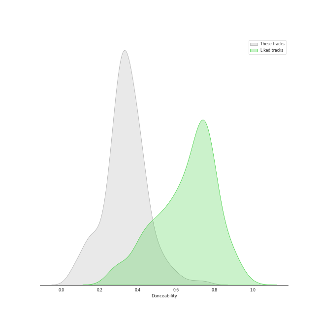
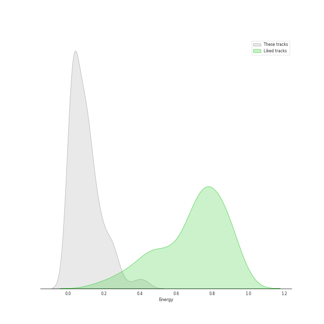
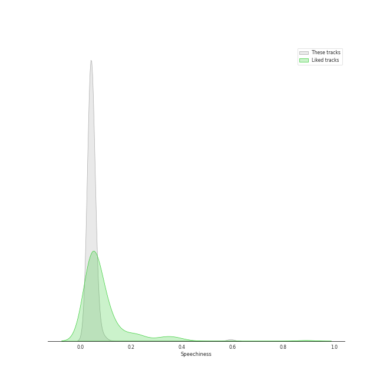
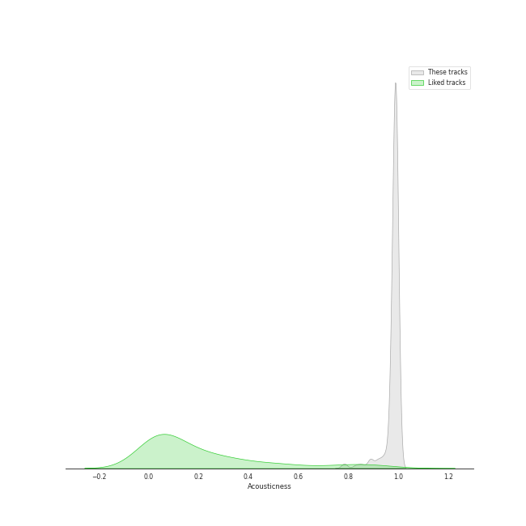
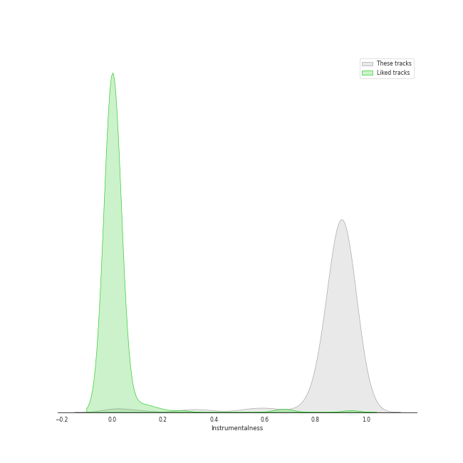
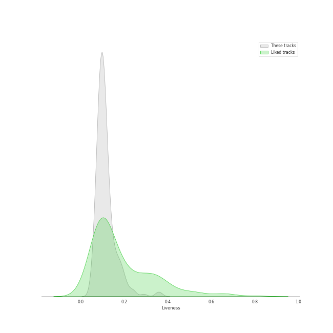
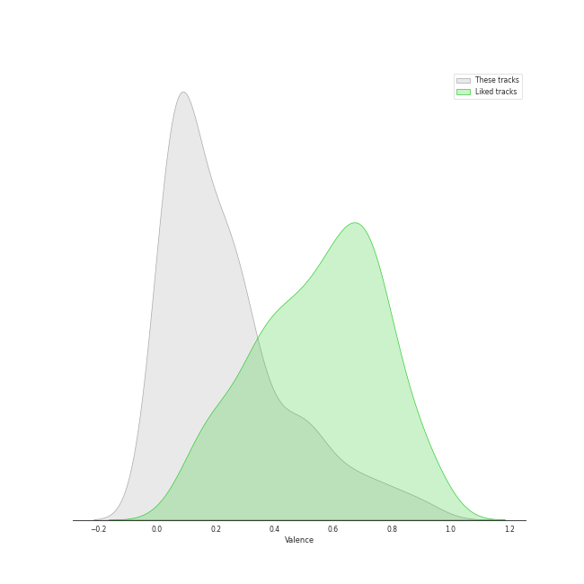
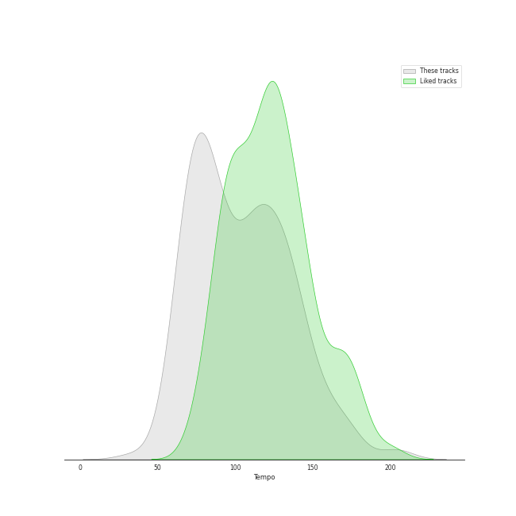

# Audio Features for Decca Music Group Ltd.

## Danceability

| ​ | 10 most Danceable tracks | ​​ | 10 least Danceable tracks |
|:---|:---|:---|:---|
|  | 24 Préludes, Op. 28: No. 20 in C Minor: Largo (0.753) |  | La Mer, L.109: 1. From Dawn Till Noon On The Sea (De l'aube à midi sur la mer) (0.0633) |
|  | Brandenburg Concerto No. 2 in F, BWV 1047: 3. Allegro assai (0.691) |  | Vespers, Op. 37: XII. "Slava v vyshnikh Bogu" (0.0636) |
|  | Brandenburg Concerto No. 2 in F, BWV 1047: 1. (Allegro) (0.687) |  | Requiem in D Minor, Op. 48: II. Offertorium. Domine Jesu Christe (0.0668) |
|  | 24 Préludes, Op. 28: No. 10 in C-Sharp Minor: Molto allegro (0.629) |  | Vespers, Op. 37: V. "Nyne otpushchayeshi" (0.0806) |
|  | Brandenburg Concerto No. 3 in G, BWV 1048: 3. Allegro (0.594) |  | La Mer, L.109: 3. Dialogue Of The Wind And The Sea (0.0986) |
|  | Piano Sonata No. 12 in A flat, Op. 26: 3. Marcia funebre sulla morte d'un Eroe (0.584) |  | Vespers, Op. 37: IV. "Svete tikhyi" (0.103) |
|  | 24 Préludes, Op. 28: No. 7 in A Major: Andantino (0.58) |  | Vespers, Op. 37: XIV. "Voskrez iz groba" (0.104) |
|  | Piano Sonata No. 11 in A Major, K. 331: 3. Alla Turca. Allegretto (0.55) |  | Vespers, Op. 37: II. "Blagoslovi dushe moya" (0.108) |
|  | Brandenburg Concerto No. 1 in F, BWV 1046: 5. Polacca; Trio II (0.534) |  | Brandenburg Concerto No. 6 in B flat, BWV 1051: 2. Adagio ma non tanto (0.115) |
|  | Brandenburg Concerto No. 6 in B flat, BWV 1051: 3. Allegro (0.528) |  | 24 Préludes, Op. 28: No. 13 in F-Sharp Major: Lento (0.124) |

## Energy

| ​ | 10 most Energetic tracks | ​​ | 10 least Energetic tracks |
|:---|:---|:---|:---|
|  | Vespers, Op. 37: XV. "Vzbrannoy voevode" (0.488) |  | Piano Sonata No. 21 in C Major, Op. 53 "Waldstein": II. Introduzione (Adagio molto) (0.00157) |
|  | Brandenburg Concerto No. 2 in F, BWV 1047: 3. Allegro assai (0.441) |  | Piano Sonata No. 31 in A flat, Op. 110: 3. Adagio ma non troppo (0.00168) |
|  | Brandenburg Concerto No. 3 in G, BWV 1048: 3. Allegro (0.426) |  | 24 Préludes, Op. 28: No. 7 in A Major: Andantino (0.00174) |
|  | Brandenburg Concerto No. 2 in F, BWV 1047: 1. (Allegro) (0.398) |  | 24 Préludes, Op. 28: No. 13 in F-Sharp Major: Lento (0.0019) |
|  | 24 Préludes, Op. 28: No. 22 in G Minor: Molto agitato (0.392) |  | 24 Préludes, Op. 28: No. 2 in A Minor: Lento (0.00223) |
|  | Galop Marquis (0.389) |  | Piano Sonata No. 14 in C-Sharp Minor, Op. 27 No. 2 "Moonlight": I. Adagio sostenuto (0.0025) |
|  | Piano Sonata No. 6 in F, Op. 10 No. 2: 3. Presto (0.351) |  | Piano Sonata No. 2 in A, Op. 2 No. 2: 2. Largo appassionato (0.00343) |
|  | 24 Préludes, Op. 28: No. 24 in D Minor: Allegro appassionato (0.307) |  | Piano Sonata No. 4 in E flat, Op. 7: 2. Largo, con gran espressione (0.00362) |
|  | Vespers, Op. 37: VIII. "Kvalite imya Gospodne" (0.296) |  | 24 Préludes, Op. 28: No. 6 in B Minor: Lento assai (0.00399) |
|  | Brandenburg Concerto No. 4 in G, BWV 1049: 3. Presto (0.286) |  | Piano Sonata No. 25 in G, Op. 79: 2. Andante (0.00446) |

## Speechiness

| ​ | 10 most Speechy tracks | ​​ | 10 least Speechy tracks |
|:---|:---|:---|:---|
|  | 24 Préludes, Op. 28: No. 20 in C Minor: Largo (0.592) |  | Polonaise No. 6 in A flat, Op. 53 -"Heroic" (0.0308) |
|  | Piano Sonata No. 21 in C Major, Op. 53 "Waldstein": II. Introduzione (Adagio molto) (0.0974) |  | Piano Sonata No. 25 in G, Op. 79: 3. Vivace (0.0322) |
|  | Piano Sonata No. 19 in G minor, Op. 49 No. 1: 2. Rondo (Allegro) (0.0889) |  | Piano Sonata No. 12 in A flat, Op. 26: 4. Allegro (0.0323) |
|  | 24 Préludes, Op. 28: No. 10 in C-Sharp Minor: Molto allegro (0.081) |  | 24 Préludes, Op. 28: No. 24 in D Minor: Allegro appassionato (0.0325) |
|  | Piano Sonata No. 12 in A flat, Op. 26: 3. Marcia funebre sulla morte d'un Eroe (0.075) |  | Berceuse in D-Flat Major, Op. 57 (0.0327) |
|  | 24 Préludes, Op. 28: No. 7 in A Major: Andantino (0.0694) |  | Piano Concerto No. 2 in C Minor, Op. 18: 3. Allegro scherzando (0.0336) |
|  | Piano Sonata No. 22 in F, Op. 54: 1. In Tempo d'un Menuetto (0.066) |  | Nocturne No. 16 in E-Flat Major, Op. 55 No. 2 (0.0338) |
|  | Piano Sonata No. 4 in E flat, Op. 7: 2. Largo, con gran espressione (0.0615) |  | Piano Sonata No. 22 in F, Op. 54: 2. Allegretto (0.034) |
|  | 24 Préludes, Op. 28: No. 4 in E Minor: Largo (0.0613) |  | 24 Préludes, Op. 28: No. 19 in E-Flat Major: Vivace (0.034) |
|  | 24 Préludes, Op. 28: No. 6 in B Minor: Lento assai (0.0605) |  | Piano Sonata No. 9 in E, Op. 14 No. 1: 3. Rondo (Allegro comodo) (0.0342) |

## Acousticness

| ​ | 10 most Acoustic tracks | ​​ | 10 least Acoustic tracks |
|:---|:---|:---|:---|
|  | Wiosna, B117 (arr. from Op. 74/2) (0.996) |  | Brandenburg Concerto No. 1 in F, BWV 1046: 2. Adagio (0.78) |
|  | Feuille d'album in E, Op. posth. (0.995) |  | Brandenburg Concerto No. 6 in B flat, BWV 1051: 2. Adagio ma non tanto (0.788) |
|  | Piano Sonata No. 25 in G, Op. 79: 2. Andante (0.995) |  | Brandenburg Concerto No. 5 in D, BWV 1050: 1. Allegro (0.828) |
|  | Vespers, Op. 37: VIII. "Kvalite imya Gospodne" (0.995) |  | Brandenburg Concerto No. 5 in D, BWV 1050: 3. Allegro (0.845) |
|  | Piano Sonata No. 19 in G minor, Op. 49 No. 1: 1. Andante (0.995) |  | Brandenburg Concerto No. 3 in G, BWV 1048: 3. Allegro (0.859) |
|  | Piano Sonata No. 9 in E, Op. 14 No. 1: 2. Allegretto (0.995) |  | Brandenburg Concerto No. 2 in F, BWV 1047: 2. Andante (0.86) |
|  | 24 Préludes, Op. 28: No. 6 in B Minor: Lento assai (0.995) |  | Brandenburg Concerto No. 3 in G, BWV 1048: 1. (Allegro) (0.885) |
|  | Vespers, Op. 37: XV. "Vzbrannoy voevode" (0.995) |  | La Mer, L.109: 3. Dialogue Of The Wind And The Sea (0.886) |
|  | Nocturne No. 11 in G minor, Op. 37 No. 1 (0.995) |  | Brandenburg Concerto No. 2 in F, BWV 1047: 1. (Allegro) (0.888) |
|  | Nocturne No. 6 in G Minor, Op. 15 No. 3 (0.995) |  | Brandenburg Concerto No. 2 in F, BWV 1047: 3. Allegro assai (0.89) |

## Instrumentalness

| ​ | 10 most Instrumental tracks | ​​ | 10 least Instrumental tracks |
|:---|:---|:---|:---|
|  | Vespers, Op. 37: XIV. "Voskrez iz groba" (0.98) |  | Brandenburg Concerto No. 5 in D, BWV 1050: 1. Allegro (0.0047) |
|  | Vespers, Op. 37: VI. "Bogoroditse Devo" (0.979) |  | Brandenburg Concerto No. 5 in D, BWV 1050: 3. Allegro (0.0126) |
|  | Requiem in D Minor, Op. 48: VII. In Paradisum (0.971) |  | Brandenburg Concerto No. 3 in G, BWV 1048: 1. (Allegro) (0.0333) |
|  | 24 Préludes, Op. 28: No. 7 in A Major: Andantino (0.956) |  | Vespers, Op. 37: II. "Blagoslovi dushe moya" (0.0731) |
|  | 24 Préludes, Op. 28: No. 10 in C-Sharp Minor: Molto allegro (0.955) |  | Brandenburg Concerto No. 4 in G, BWV 1049: 1. Allegro (0.116) |
|  | Requiem in D Minor, Op. 48: III. Sanctus (0.953) |  | Vespers, Op. 37: XV. "Vzbrannoy voevode" (0.26) |
|  | Nocturne No. 6 in G Minor, Op. 15 No. 3 (0.952) |  | Brandenburg Concerto No. 3 in G, BWV 1048: 3. Allegro (0.295) |
|  | Piano Sonata No. 16 in C, K.545 "Sonata facile": 1. Allegro (0.949) |  | Brandenburg Concerto No. 4 in G, BWV 1049: 3. Presto (0.321) |
|  | Waltz No. 15 in E Major, Op. posth. (0.949) |  | Vespers, Op. 37: VIII. "Kvalite imya Gospodne" (0.352) |
|  | Prélude No.26 in A Flat, Op.posth. (0.949) |  | Vespers, Op. 37: IX. "Blagosloven esi, Gospodi" (0.379) |

## Liveness

| ​ | 10 most Live tracks | ​​ | 10 least Live tracks |
|:---|:---|:---|:---|
|  | Piano Sonata No. 30 in E, Op. 109: 1. Vivace, ma non troppo - Adagio espressivo - Tempo I (0.362) |  | 24 Préludes, Op. 28: No. 7 in A Major: Andantino (0.0504) |
|  | Brandenburg Concerto No. 4 in G, BWV 1049: 1. Allegro (0.354) |  | Piano Sonata No. 32 in C minor, Op. 111: 2. Arietta (Adagio molto semplice e cantabile) (0.0511) |
|  | Piano Sonata No. 25 in G, Op. 79: 3. Vivace (0.353) |  | Piano Concerto No. 2 in C Minor, Op. 18: 2. Adagio sostenuto (0.0551) |
|  | Piano Sonata No. 11 in B flat, Op. 22: 4. Rondo (Allegretto) (0.289) |  | Requiem in D Minor, Op. 48: VII. In Paradisum (0.0565) |
|  | Piano Sonata No. 13 in E flat, Op. 27 No. 1: 3. Adagio con espressione (0.244) |  | Scherzo No. 1 In B Minor, Op. 20 (0.0569) |
|  | Brandenburg Concerto No. 4 in G, BWV 1049: 3. Presto (0.241) |  | Piano Sonata No. 8 in C Minor, Op. 13 "Pathétique": III. Rondo (Allegro) (0.0575) |
|  | Waltz No. 8 in A-Flat Major, Op. 64 No. 3 (0.24) |  | Nocturne No. 15 in F Minor, Op. 55 No. 1 (0.0584) |
|  | Piano Sonata No. 17 in D minor, Op. 31 No. 2 -"Tempest": 1. Largo - Allegro (0.227) |  | Piano Sonata No. 31 in A flat, Op. 110: 1. Moderato cantabile molto espressivo (0.0588) |
|  | 24 Préludes, Op. 28: No. 16 in B-Flat Minor: Presto con fuoco (0.208) |  | Piano Sonata No. 3 in C, Op. 2 No. 3: 4. Allegro assai (0.0615) |
|  | Polonaise in B flat, Op. posth. (0.201) |  | Piano Sonata No. 29 in B flat, Op. 106 -"Hammerklavier": 3. Adagio sostenuto (0.0616) |

## Valence

| ​ | 10 most Happy tracks | ​​ | 10 least Happy tracks |
|:---|:---|:---|:---|
|  | Brandenburg Concerto No. 2 in F, BWV 1047: 3. Allegro assai (0.931) |  | 24 Préludes, Op. 28: No. 7 in A Major: Andantino (0.0) |
|  | Galop Marquis (0.893) |  | 24 Préludes, Op. 28: No. 9 in E Major: Largo (0.0292) |
|  | Waltz No. 16 in A flat, Op. posth. (0.89) |  | Requiem in D Minor, Op. 48: I. Introitus. Requiem aeternam - Kyrie (0.0321) |
|  | Piano Sonata No. 6 in F, Op. 10 No. 2: 3. Presto (0.814) |  | Requiem in D Minor, Op. 48: IV. Pie Jesu (0.0329) |
|  | Brandenburg Concerto No. 3 in G, BWV 1048: 3. Allegro (0.809) |  | Vespers, Op. 37: IV. "Svete tikhyi" (0.0331) |
|  | Piano Sonata No. 25 in G, Op. 79: 3. Vivace (0.791) |  | Requiem in D Minor, Op. 48: V. Agnus Dei (0.0339) |
|  | Brandenburg Concerto No. 2 in F, BWV 1047: 1. (Allegro) (0.79) |  | Vespers, Op. 37: VI. "Bogoroditse Devo" (0.035) |
|  | Brandenburg Concerto No. 1 in F, BWV 1046: 3. Allegro (0.786) |  | La Mer, L.109: 3. Dialogue Of The Wind And The Sea (0.0351) |
|  | Brandenburg Concerto No. 1 in F, BWV 1046: 1. (Allegro) (0.755) |  | 24 Préludes, Op. 28: No. 4 in E Minor: Largo (0.0354) |
|  | Brandenburg Concerto No. 4 in G, BWV 1049: 3. Presto (0.752) |  | Requiem in D Minor, Op. 48: VII. In Paradisum (0.0354) |

## Tempo

| ​ | 10 most Fast tracks | ​​ | 10 least Fast tracks |
|:---|:---|:---|:---|
|  | 24 Préludes, Op. 28: No. 6 in B Minor: Lento assai (203.905) |  | 24 Préludes, Op. 28: No. 20 in C Minor: Largo (34.105) |
|  | Piano Sonata No. 29 in B flat, Op. 106 -"Hammerklavier": 2. Scherzo (Assai vivace - Presto - Prestissimo - Tempo I) (203.867) |  | 24 Préludes, Op. 28: No. 8 in F-Sharp Minor: Molto agitato (53.925) |
|  | Brandenburg Concerto No. 2 in F, BWV 1047: 2. Andante (177.194) |  | Piano Concerto No. 2 in C Minor, Op. 18: 1. Moderato (54.898) |
|  | Brandenburg Concerto No. 4 in G, BWV 1049: 1. Allegro (175.012) |  | Waltz No. 11 in G-Flat Major, Op. 70 No. 1 (58.131) |
|  | 24 Préludes, Op. 28: No. 19 in E-Flat Major: Vivace (174.421) |  | 24 Préludes, Op. 28: No. 7 in A Major: Andantino (59.272) |
|  | Brandenburg Concerto No. 1 in F, BWV 1046: 3. Allegro (172.615) |  | Vespers, Op. 37: XII. "Slava v vyshnikh Bogu" (59.288) |
|  | Piano Sonata No. 9 in E, Op. 14 No. 1: 1. Allegro (172.047) |  | 24 Préludes, Op. 28: No. 18 in F Minor: Molto allegro (59.67) |
|  | Waltz No. 12 in F Minor, Op. 70 No. 2 (170.339) |  | Piano Sonata No. 13 in E flat, Op. 27 No. 1: 3. Adagio con espressione (60.671) |
|  | Waltz No. 3 in A Minor, Op. 34 No. 2 (169.24) |  | La Mer, L.109: 1. From Dawn Till Noon On The Sea (De l'aube à midi sur la mer) (61.399) |
|  | Piano Sonata No. 19 in G minor, Op. 49 No. 1: 2. Rondo (Allegro) (167.389) |  | Requiem in D Minor, Op. 48: III. Sanctus (62.242) |
