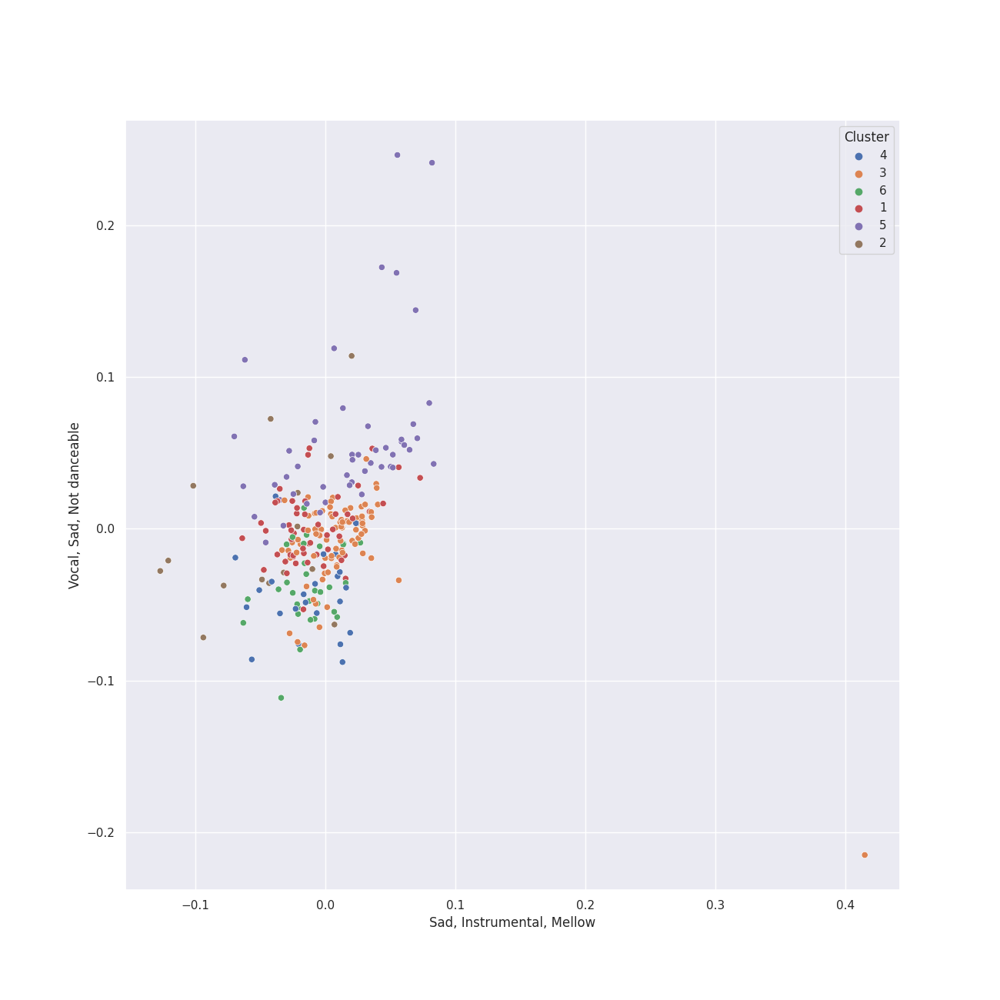

# Clusters in Decca Music Group Ltd.

## Cluster #1

52 tracks

| Art | Track | Album | Artists | Label | Score | 💚 | 🔗 |
|:---|:---|:---|:---|:---|---:|:---|:---|
|  | Waltz No. 5 in A-Flat Major, Op. 42 | Chopin: Waltzes; 4 Scherzos; 26 Preludes | [Frédéric Chopin](../../../../artists/frédéric_chopin/overview.md), [Vladimir Ashkenazy](../../../../artists/vladimir_ashkenazy/overview.md) | [Decca Music Group Ltd.](../..) | 0 | | [🔗](https://open.spotify.com/track/0GxccwYQdYlL6dtaIjQZbk) |
|  | Waltz No. 14 in E Minor, Op. posth. | Chopin: Waltzes; 4 Scherzos; 26 Preludes | [Frédéric Chopin](../../../../artists/frédéric_chopin/overview.md), [Vladimir Ashkenazy](../../../../artists/vladimir_ashkenazy/overview.md) | [Decca Music Group Ltd.](../..) | 0 | | [🔗](https://open.spotify.com/track/6tr9C1mh55dkKIXRjhpa5p) |
|  | Piano Sonata No. 28 in A, Op. 101: 3. Langsam und sehnsuchtsvoll (Adagio ma non troppo, con affetto) | Beethoven: The Piano Sonatas | [Ludwig van Beethoven](../../../../artists/ludwig_van_beethoven/overview.md), [Vladimir Ashkenazy](../../../../artists/vladimir_ashkenazy/overview.md) | [Decca Music Group Ltd.](../..) | 0 | | [🔗](https://open.spotify.com/track/0Enb2uwLWzhszdFVvXR9GN) |
|  | Piano Sonata No. 2 in A, Op. 2 No. 2: 4. Rondo (Grazioso) | Beethoven: The Piano Sonatas | [Ludwig van Beethoven](../../../../artists/ludwig_van_beethoven/overview.md), [Vladimir Ashkenazy](../../../../artists/vladimir_ashkenazy/overview.md) | [Decca Music Group Ltd.](../..) | 0 | | [🔗](https://open.spotify.com/track/1Lv1DwrC0wphiUnlhDczkK) |
|  | Piano Sonata No. 4 in E flat, Op. 7: 4. Rondo (Poco allegretto e grazioso) | Beethoven: The Piano Sonatas | [Ludwig van Beethoven](../../../../artists/ludwig_van_beethoven/overview.md), [Vladimir Ashkenazy](../../../../artists/vladimir_ashkenazy/overview.md) | [Decca Music Group Ltd.](../..) | 0 | | [🔗](https://open.spotify.com/track/1f64W90KNdGhGzoElkVy3G) |
|  | Piano Sonata No. 1 in F minor, Op. 2 No. 1: 1. Allegro | Beethoven: The Piano Sonatas | [Ludwig van Beethoven](../../../../artists/ludwig_van_beethoven/overview.md), [Vladimir Ashkenazy](../../../../artists/vladimir_ashkenazy/overview.md) | [Decca Music Group Ltd.](../..) | 0 | | [🔗](https://open.spotify.com/track/2E0Q7KZ2b6wTMsuDA8lRhz) |
|  | Piano Sonata No. 9 in E, Op. 14 No. 1: 3. Rondo (Allegro comodo) | Beethoven: The Piano Sonatas | [Ludwig van Beethoven](../../../../artists/ludwig_van_beethoven/overview.md), [Vladimir Ashkenazy](../../../../artists/vladimir_ashkenazy/overview.md) | [Decca Music Group Ltd.](../..) | 0 | | [🔗](https://open.spotify.com/track/2xIQfni4ohls4aDybQLdWn) |
|  | Piano Sonata No. 9 in E, Op. 14 No. 1: 1. Allegro | Beethoven: The Piano Sonatas | [Ludwig van Beethoven](../../../../artists/ludwig_van_beethoven/overview.md), [Vladimir Ashkenazy](../../../../artists/vladimir_ashkenazy/overview.md) | [Decca Music Group Ltd.](../..) | 0 | | [🔗](https://open.spotify.com/track/3dijT40beX4KWeV7rUqLOP) |
|  | Piano Sonata No. 7 in D, Op. 10 No. 3: 4. Rondo (Allegro) | Beethoven: The Piano Sonatas | [Ludwig van Beethoven](../../../../artists/ludwig_van_beethoven/overview.md), [Vladimir Ashkenazy](../../../../artists/vladimir_ashkenazy/overview.md) | [Decca Music Group Ltd.](../..) | 0 | | [🔗](https://open.spotify.com/track/6Dhas016rdWQd49cGPeeor) |
|  | Piano Sonata No. 4 in E flat, Op. 7: 3. Allegro | Beethoven: The Piano Sonatas | [Ludwig van Beethoven](../../../../artists/ludwig_van_beethoven/overview.md), [Vladimir Ashkenazy](../../../../artists/vladimir_ashkenazy/overview.md) | [Decca Music Group Ltd.](../..) | 0 | | [🔗](https://open.spotify.com/track/7mjP1zIbYt98zXkL5HUIBs) |
## Cluster #2

15 tracks

| Art | Track | Album | Artists | Label | Score | 💚 | 🔗 |
|:---|:---|:---|:---|:---|---:|:---|:---|
|  | Waltz No. 16 in A flat, Op. posth. | Chopin: Waltzes; 4 Scherzos; 26 Preludes | [Frédéric Chopin](../../../../artists/frédéric_chopin/overview.md), [Vladimir Ashkenazy](../../../../artists/vladimir_ashkenazy/overview.md) | [Decca Music Group Ltd.](../..) | 0 | | [🔗](https://open.spotify.com/track/4bjAq5Ve39zaErDRO0rhsH) |
|  | Fugue in A minor | Chopin: Polonaises | [Frédéric Chopin](../../../../artists/frédéric_chopin/overview.md), [Vladimir Ashkenazy](../../../../artists/vladimir_ashkenazy/overview.md) | [Decca Music Group Ltd.](../..) | 0 | | [🔗](https://open.spotify.com/track/31dHappgsBbViaFb5O26AD) |
|  | Brandenburg Concerto No. 1 in F, BWV 1046: 1. (Allegro) | Bach, J.S.: Brandenburg Concertos etc. | [Johann Sebastian Bach](../../../../artists/johann_sebastian_bach/overview.md), English Chamber Orchestra, Benjamin Britten | [Decca Music Group Ltd.](../..) | 0 | | [🔗](https://open.spotify.com/track/0df320Pc1ZK0050luSGVHt) |
|  | Brandenburg Concerto No. 3 in G, BWV 1048: 3. Allegro | Bach, J.S.: Brandenburg Concertos etc. | [Johann Sebastian Bach](../../../../artists/johann_sebastian_bach/overview.md), English Chamber Orchestra, Benjamin Britten | [Decca Music Group Ltd.](../..) | 0 | | [🔗](https://open.spotify.com/track/4HuoLeflqbsdeBUDvoD6An) |
|  | Brandenburg Concerto No. 2 in F, BWV 1047: 1. (Allegro) | Bach, J.S.: Brandenburg Concertos etc. | [Johann Sebastian Bach](../../../../artists/johann_sebastian_bach/overview.md), English Chamber Orchestra, Benjamin Britten | [Decca Music Group Ltd.](../..) | 0 | | [🔗](https://open.spotify.com/track/4PXwvtEMVB4Q3LV5H6eW7x) |
|  | Brandenburg Concerto No. 1 in F, BWV 1046: 3. Allegro | Bach, J.S.: Brandenburg Concertos etc. | [Johann Sebastian Bach](../../../../artists/johann_sebastian_bach/overview.md), English Chamber Orchestra, Benjamin Britten | [Decca Music Group Ltd.](../..) | 0 | | [🔗](https://open.spotify.com/track/4fXffigCHnDRCpkBLLPvG8) |
|  | Brandenburg Concerto No. 5 in D, BWV 1050: 3. Allegro | Bach, J.S.: Brandenburg Concertos etc. | [Johann Sebastian Bach](../../../../artists/johann_sebastian_bach/overview.md), English Chamber Orchestra, Benjamin Britten | [Decca Music Group Ltd.](../..) | 0 | | [🔗](https://open.spotify.com/track/5hoRPHTX8zSHCyPIGejvZj) |
|  | Brandenburg Concerto No. 4 in G, BWV 1049: 3. Presto | Bach, J.S.: Brandenburg Concertos etc. | [Johann Sebastian Bach](../../../../artists/johann_sebastian_bach/overview.md), English Chamber Orchestra, Benjamin Britten | [Decca Music Group Ltd.](../..) | 0 | | [🔗](https://open.spotify.com/track/6PtzKhvAY9xejeJIrwxZGQ) |
|  | Brandenburg Concerto No. 5 in D, BWV 1050: 1. Allegro | Bach, J.S.: Brandenburg Concertos etc. | [Johann Sebastian Bach](../../../../artists/johann_sebastian_bach/overview.md), English Chamber Orchestra, Benjamin Britten | [Decca Music Group Ltd.](../..) | 0 | | [🔗](https://open.spotify.com/track/7ImuASnzYk9YHn3isFjZ0j) |
|  | Piano Sonata No. 6 in F, Op. 10 No. 2: 3. Presto | Beethoven: The Piano Sonatas | [Ludwig van Beethoven](../../../../artists/ludwig_van_beethoven/overview.md), [Vladimir Ashkenazy](../../../../artists/vladimir_ashkenazy/overview.md) | [Decca Music Group Ltd.](../..) | 0 | | [🔗](https://open.spotify.com/track/5QjudrRTfGuFlouT4LcV2j) |
## Cluster #3

86 tracks

| Art | Track | Album | Artists | Label | Score | 💚 | 🔗 |
|:---|:---|:---|:---|:---|---:|:---|:---|
|  | 24 Préludes, Op. 28: No. 21 in B-Flat Major: Cantabile | Chopin: Waltzes; 4 Scherzos; 26 Preludes | [Frédéric Chopin](../../../../artists/frédéric_chopin/overview.md), [Vladimir Ashkenazy](../../../../artists/vladimir_ashkenazy/overview.md) | [Decca Music Group Ltd.](../..) | 0 | | [🔗](https://open.spotify.com/track/3WCamrmSMc9lwnY7GygErR) |
|  | Nocturne No. 9 in B Major, Op. 32 No. 1 | Chopin: Nocturnes; Four Ballades | [Frédéric Chopin](../../../../artists/frédéric_chopin/overview.md), [Vladimir Ashkenazy](../../../../artists/vladimir_ashkenazy/overview.md) | [Decca Music Group Ltd.](../..) | 0 | | [🔗](https://open.spotify.com/track/08GWfq6GjYQ63lPKTrTMOb) |
|  | Nocturne No. 14 in F sharp minor, Op. 48 No. 2 | Chopin: Nocturnes; Four Ballades | [Frédéric Chopin](../../../../artists/frédéric_chopin/overview.md), [Vladimir Ashkenazy](../../../../artists/vladimir_ashkenazy/overview.md) | [Decca Music Group Ltd.](../..) | 0 | | [🔗](https://open.spotify.com/track/21V4PYCwr3bPUQ3g2MRiVi) |
|  | Nocturne No. 5 in F-Sharp Major, Op. 15 No. 2 | Chopin: Nocturnes; Four Ballades | [Frédéric Chopin](../../../../artists/frédéric_chopin/overview.md), [Vladimir Ashkenazy](../../../../artists/vladimir_ashkenazy/overview.md) | [Decca Music Group Ltd.](../..) | 0 | | [🔗](https://open.spotify.com/track/3pMMV07c8cnoEq4cCPwZnV) |
|  | Nocturne No. 10 in A-Flat Major, Op. 32 No. 2 | Chopin: Nocturnes; Four Ballades | [Frédéric Chopin](../../../../artists/frédéric_chopin/overview.md), [Vladimir Ashkenazy](../../../../artists/vladimir_ashkenazy/overview.md) | [Decca Music Group Ltd.](../..) | 0 | | [🔗](https://open.spotify.com/track/48yLOxQazsbzSdz3Rq8qev) |
|  | Nocturne No. 6 in G Minor, Op. 15 No. 3 | Chopin: Nocturnes; Four Ballades | [Frédéric Chopin](../../../../artists/frédéric_chopin/overview.md), [Vladimir Ashkenazy](../../../../artists/vladimir_ashkenazy/overview.md) | [Decca Music Group Ltd.](../..) | 0 | | [🔗](https://open.spotify.com/track/4oJ0kJqH0cxo6KA9aUu6O7) |
|  | Nocturne No. 18 in E Major, Op. 62 No. 2 | Chopin: Nocturnes; Four Ballades | [Frédéric Chopin](../../../../artists/frédéric_chopin/overview.md), [Vladimir Ashkenazy](../../../../artists/vladimir_ashkenazy/overview.md) | [Decca Music Group Ltd.](../..) | 0 | | [🔗](https://open.spotify.com/track/6la3MMpUCkvxN2HgoQWvf3) |
|  | Piano Sonata No. 15 in D, Op. 28 -"Pastorale": 1. Allegro | Beethoven: The Piano Sonatas | [Ludwig van Beethoven](../../../../artists/ludwig_van_beethoven/overview.md), [Vladimir Ashkenazy](../../../../artists/vladimir_ashkenazy/overview.md) | [Decca Music Group Ltd.](../..) | 0 | | [🔗](https://open.spotify.com/track/3eiAUStWjc93DBuEPlEBSP) |
|  | Piano Sonata No. 13 in E flat, Op. 27 No. 1: 1. Andante - Allegro - Tempo I | Beethoven: The Piano Sonatas | [Ludwig van Beethoven](../../../../artists/ludwig_van_beethoven/overview.md), [Vladimir Ashkenazy](../../../../artists/vladimir_ashkenazy/overview.md) | [Decca Music Group Ltd.](../..) | 0 | | [🔗](https://open.spotify.com/track/3sEMnEwMLitPryhuGxgQpV) |
|  | Piano Sonata No. 6 in F, Op. 10 No. 2: 2. Allegretto | Beethoven: The Piano Sonatas | [Ludwig van Beethoven](../../../../artists/ludwig_van_beethoven/overview.md), [Vladimir Ashkenazy](../../../../artists/vladimir_ashkenazy/overview.md) | [Decca Music Group Ltd.](../..) | 0 | | [🔗](https://open.spotify.com/track/4gThvgaLCcABLJIFFKTlig) |
## Cluster #4

23 tracks

| Art | Track | Album | Artists | Label | Score | 💚 | 🔗 |
|:---|:---|:---|:---|:---|---:|:---|:---|
|  | Piano Sonata No. 11 in A Major, K. 331: 3. Alla Turca. Allegretto | Mozart: The Piano Sonatas | [Wolfgang Amadeus Mozart](../../../../artists/wolfgang_amadeus_mozart/overview.md), András Schiff | [Decca Music Group Ltd.](../..) | 0 | | [🔗](https://open.spotify.com/track/1iR34ZbPs3eFniMpnrHI6s) |
|  | Piano Sonata No. 16 in C, K.545 "Sonata facile": 3. Rondo (Allegro) | Mozart: The Piano Sonatas | [Wolfgang Amadeus Mozart](../../../../artists/wolfgang_amadeus_mozart/overview.md), András Schiff | [Decca Music Group Ltd.](../..) | 0 | | [🔗](https://open.spotify.com/track/3qa2ofUV5Dex4LA4RRu5RJ) |
|  | Prélude No.26 in A Flat, Op.posth. | Chopin: Waltzes; 4 Scherzos; 26 Preludes | [Frédéric Chopin](../../../../artists/frédéric_chopin/overview.md), [Vladimir Ashkenazy](../../../../artists/vladimir_ashkenazy/overview.md) | [Decca Music Group Ltd.](../..) | 0 | | [🔗](https://open.spotify.com/track/0TQZ0MQ7DBUD1am9Hm9xqZ) |
|  | Etude in D flat, Op. posth. " Méthode des méthodes " | Chopin: Polonaises | [Frédéric Chopin](../../../../artists/frédéric_chopin/overview.md), [Vladimir Ashkenazy](../../../../artists/vladimir_ashkenazy/overview.md) | [Decca Music Group Ltd.](../..) | 0 | | [🔗](https://open.spotify.com/track/0banlptk443bq1tLPFcy0f) |
|  | Polonaise in A flat, Op. posth. | Chopin: Polonaises | [Frédéric Chopin](../../../../artists/frédéric_chopin/overview.md), [Vladimir Ashkenazy](../../../../artists/vladimir_ashkenazy/overview.md) | [Decca Music Group Ltd.](../..) | 0 | | [🔗](https://open.spotify.com/track/5ggAFuPO4UTnwTyQvsXKrH) |
|  | Piano Sonata No. 10 in G Major, Op. 14 No. 2: 3. Scherzo. Allegro assai | Beethoven: The Piano Sonatas | [Ludwig van Beethoven](../../../../artists/ludwig_van_beethoven/overview.md), [Vladimir Ashkenazy](../../../../artists/vladimir_ashkenazy/overview.md) | [Decca Music Group Ltd.](../..) | 0 | | [🔗](https://open.spotify.com/track/0VEufDhQQQvz863wJ7unXm) |
|  | Piano Sonata No. 3 in C, Op. 2 No. 3: 3. Scherzo (Allegro) | Beethoven: The Piano Sonatas | [Ludwig van Beethoven](../../../../artists/ludwig_van_beethoven/overview.md), [Vladimir Ashkenazy](../../../../artists/vladimir_ashkenazy/overview.md) | [Decca Music Group Ltd.](../..) | 0 | | [🔗](https://open.spotify.com/track/0cG1eHAxX9qgBoHkmJMEhl) |
|  | Piano Sonata No. 12 in A flat, Op. 26: 2. Scherzo (Allegro molto) | Beethoven: The Piano Sonatas | [Ludwig van Beethoven](../../../../artists/ludwig_van_beethoven/overview.md), [Vladimir Ashkenazy](../../../../artists/vladimir_ashkenazy/overview.md) | [Decca Music Group Ltd.](../..) | 0 | | [🔗](https://open.spotify.com/track/1ceRZjxysooUhNqjsvetIF) |
|  | Piano Sonata No. 19 in G minor, Op. 49 No. 1: 2. Rondo (Allegro) | Beethoven: The Piano Sonatas | [Ludwig van Beethoven](../../../../artists/ludwig_van_beethoven/overview.md), [Vladimir Ashkenazy](../../../../artists/vladimir_ashkenazy/overview.md) | [Decca Music Group Ltd.](../..) | 0 | | [🔗](https://open.spotify.com/track/2yYoMpdah6zLxZakpCFs9I) |
|  | Piano Sonata No. 20 in G, Op. 49 No. 2: 1. Allegro ma non troppo | Beethoven: The Piano Sonatas | [Ludwig van Beethoven](../../../../artists/ludwig_van_beethoven/overview.md), [Vladimir Ashkenazy](../../../../artists/vladimir_ashkenazy/overview.md) | [Decca Music Group Ltd.](../..) | 0 | | [🔗](https://open.spotify.com/track/7onetNzttpXOktzvYhHjEE) |
## Cluster #5

49 tracks

| Art | Track | Album | Artists | Label | Score | 💚 | 🔗 |
|:---|:---|:---|:---|:---|---:|:---|:---|
|  | Ballade No. 1 in G Minor, Op. 23 | Chopin: Nocturnes; Four Ballades | [Frédéric Chopin](../../../../artists/frédéric_chopin/overview.md), [Vladimir Ashkenazy](../../../../artists/vladimir_ashkenazy/overview.md) | [Decca Music Group Ltd.](../..) | 0 | | [🔗](https://open.spotify.com/track/1r2DD0vabJ1pnNHIIizopr) |
|  | Etude in A flat, Op. posth. " Méthode des méthodes " | Chopin: Polonaises | [Frédéric Chopin](../../../../artists/frédéric_chopin/overview.md), [Vladimir Ashkenazy](../../../../artists/vladimir_ashkenazy/overview.md) | [Decca Music Group Ltd.](../..) | 0 | | [🔗](https://open.spotify.com/track/13F1AunNkOPDFNx4qU45Yi) |
|  | Etude in F minor, Op. posth. " Méthode des méthodes " | Chopin: Polonaises | [Frédéric Chopin](../../../../artists/frédéric_chopin/overview.md), [Vladimir Ashkenazy](../../../../artists/vladimir_ashkenazy/overview.md) | [Decca Music Group Ltd.](../..) | 0 | | [🔗](https://open.spotify.com/track/32nPG1lcFo1yMLAvxkqJMI) |
|  | Piano Sonata No. 21 in C Major, Op. 53 "Waldstein": I. Allegro con brio | Beethoven: The Piano Sonatas | [Ludwig van Beethoven](../../../../artists/ludwig_van_beethoven/overview.md), [Vladimir Ashkenazy](../../../../artists/vladimir_ashkenazy/overview.md) | [Decca Music Group Ltd.](../..) | 0 | | [🔗](https://open.spotify.com/track/6mhZMduiw9NIIRk75k9WVy) |
|  | Vespers, Op. 37: XIII. "Dnes spaseniye" | Rachmaninov: Vespers - All Night Vigil | Sergei Rachmaninoff, St.Petersburg Chamber Choir, Nikolai Korniev | [Decca Music Group Ltd.](../..) | 0 | | [🔗](https://open.spotify.com/track/07rzxAXZHLhV0kGR0zNDIn) |
|  | Vespers, Op. 37: XIV. "Voskrez iz groba" | Rachmaninov: Vespers - All Night Vigil | Sergei Rachmaninoff, St.Petersburg Chamber Choir, Nikolai Korniev | [Decca Music Group Ltd.](../..) | 0 | | [🔗](https://open.spotify.com/track/1kTERqTjsxeq3RNjtunq1u) |
|  | Vespers, Op. 37: I. "Priidite, poklonimsya" | Rachmaninov: Vespers - All Night Vigil | Sergei Rachmaninoff, St.Petersburg Chamber Choir, Nikolai Korniev | [Decca Music Group Ltd.](../..) | 0 | | [🔗](https://open.spotify.com/track/4evlPDUET2zxmrSffIopYk) |
|  | Piano Concerto No. 2 in C Minor, Op. 18: 1. Moderato | Rachmaninov: Piano Concerto No.2 | Sergei Rachmaninoff, Valentina Lisitsa, [London Symphony Orchestra](../../../../artists/london_symphony_orchestra/overview.md), Michael Francis | [Decca Music Group Ltd.](../..) | 0 | | [🔗](https://open.spotify.com/track/6B1RtXteyMp3mJZTeuFRmE) |
|  | Requiem in D Minor, Op. 48: VI. Libera Me | Fauré: Requiem; Pavane | Gabriel Fauré, Thomas Allen, Academy of St Martin in the Fields Chorus, Academy of St. Martin in the Fields, John Birch, Sir Neville Marriner | [Decca Music Group Ltd.](../..) | 0 | | [🔗](https://open.spotify.com/track/6nJrXbauUQtCV5TqIFrg0i) |
|  | La Mer, L.109: 2. Play of the Waves (Jeux de vagues) | Debussy: La Mer; Jeux; Prélude à l'après-midi d'un faune; Le Martyre de Saint Sébastien (Symphonic Fragments) | Claude Debussy, Orchestre Symphonique de Montréal, Charles Dutoit | [Decca Music Group Ltd.](../..) | 0 | | [🔗](https://open.spotify.com/track/55lmbVc4FLYlbHaPqiVjv2) |
## Cluster #6

33 tracks

| Art | Track | Album | Artists | Label | Score | 💚 | 🔗 |
|:---|:---|:---|:---|:---|---:|:---|:---|
|  | Waltz No. 10 in B Minor, Op. 69 No. 2 | Chopin: Waltzes; 4 Scherzos; 26 Preludes | [Frédéric Chopin](../../../../artists/frédéric_chopin/overview.md), [Vladimir Ashkenazy](../../../../artists/vladimir_ashkenazy/overview.md) | [Decca Music Group Ltd.](../..) | 0 | | [🔗](https://open.spotify.com/track/0r97HhdPS2gmxlC8VlY40s) |
|  | Waltz No. 1 in E-Flat Major, Op. 18 "Grande valse brillante" | Chopin: Waltzes; 4 Scherzos; 26 Preludes | [Frédéric Chopin](../../../../artists/frédéric_chopin/overview.md), [Vladimir Ashkenazy](../../../../artists/vladimir_ashkenazy/overview.md) | [Decca Music Group Ltd.](../..) | 0 | | [🔗](https://open.spotify.com/track/1vWAWChbVffjnpl6PPzUA4) |
|  | Waltz No. 17 in E flat, Op. posth. | Chopin: Waltzes; 4 Scherzos; 26 Preludes | [Frédéric Chopin](../../../../artists/frédéric_chopin/overview.md), [Vladimir Ashkenazy](../../../../artists/vladimir_ashkenazy/overview.md) | [Decca Music Group Ltd.](../..) | 0 | | [🔗](https://open.spotify.com/track/4Mly8lJA2TBdN10JDgMCZm) |
|  | Waltz No. 13 in D-Flat Major, Op. 70 No. 3 | Chopin: Waltzes; 4 Scherzos; 26 Preludes | [Frédéric Chopin](../../../../artists/frédéric_chopin/overview.md), [Vladimir Ashkenazy](../../../../artists/vladimir_ashkenazy/overview.md) | [Decca Music Group Ltd.](../..) | 0 | | [🔗](https://open.spotify.com/track/581cgS1NDR4ccoyJ8Mlumr) |
|  | Piano Sonata No. 2 in A, Op. 2 No. 2: 3. Scherzo (Allegretto) | Beethoven: The Piano Sonatas | [Ludwig van Beethoven](../../../../artists/ludwig_van_beethoven/overview.md), [Vladimir Ashkenazy](../../../../artists/vladimir_ashkenazy/overview.md) | [Decca Music Group Ltd.](../..) | 0 | | [🔗](https://open.spotify.com/track/0cN0dCON1MqFJmDG2TYD07) |
|  | Piano Sonata No. 1 in F minor, Op. 2 No. 1: 4. Prestissimo | Beethoven: The Piano Sonatas | [Ludwig van Beethoven](../../../../artists/ludwig_van_beethoven/overview.md), [Vladimir Ashkenazy](../../../../artists/vladimir_ashkenazy/overview.md) | [Decca Music Group Ltd.](../..) | 0 | | [🔗](https://open.spotify.com/track/1Wrn95wC9svYqRRPovuW8x) |
|  | Piano Sonata No. 5 in C minor, Op. 10 No. 1: 1. Allegro molto e con brio | Beethoven: The Piano Sonatas | [Ludwig van Beethoven](../../../../artists/ludwig_van_beethoven/overview.md), [Vladimir Ashkenazy](../../../../artists/vladimir_ashkenazy/overview.md) | [Decca Music Group Ltd.](../..) | 0 | | [🔗](https://open.spotify.com/track/23esxSOldUXZFyucgRXauX) |
|  | Piano Sonata No. 11 in B flat, Op. 22: 3. Menuetto | Beethoven: The Piano Sonatas | [Ludwig van Beethoven](../../../../artists/ludwig_van_beethoven/overview.md), [Vladimir Ashkenazy](../../../../artists/vladimir_ashkenazy/overview.md) | [Decca Music Group Ltd.](../..) | 0 | | [🔗](https://open.spotify.com/track/6Cf92UVZEP2X4IVG96Rxlx) |
|  | Piano Sonata No. 10 in G Major, Op. 14 No. 2: 2. Andante | Beethoven: The Piano Sonatas | [Ludwig van Beethoven](../../../../artists/ludwig_van_beethoven/overview.md), [Vladimir Ashkenazy](../../../../artists/vladimir_ashkenazy/overview.md) | [Decca Music Group Ltd.](../..) | 0 | | [🔗](https://open.spotify.com/track/6F6k480dc0Xm5VAsdotoGp) |
|  | Piano Sonata No. 19 in G minor, Op. 49 No. 1: 1. Andante | Beethoven: The Piano Sonatas | [Ludwig van Beethoven](../../../../artists/ludwig_van_beethoven/overview.md), [Vladimir Ashkenazy](../../../../artists/vladimir_ashkenazy/overview.md) | [Decca Music Group Ltd.](../..) | 0 | | [🔗](https://open.spotify.com/track/6fnnJxQzSmNrgZubGxEfoR) |