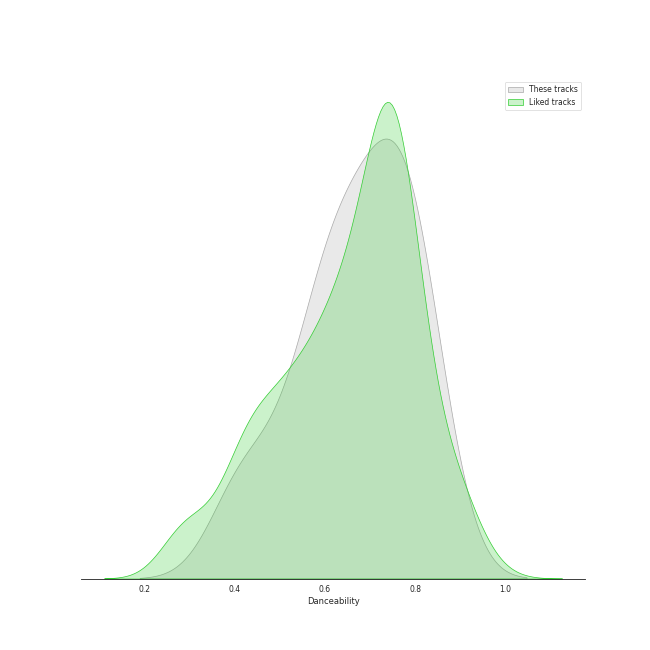
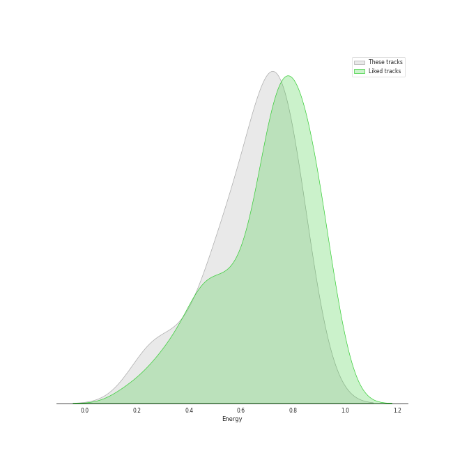
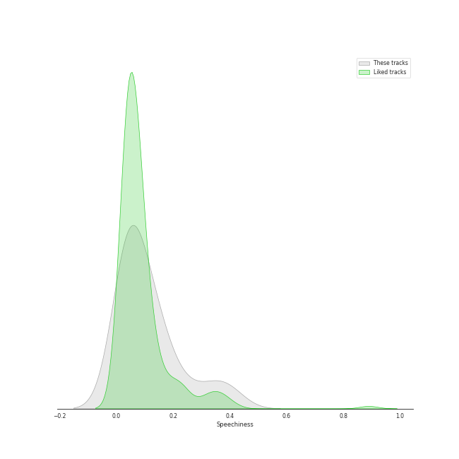
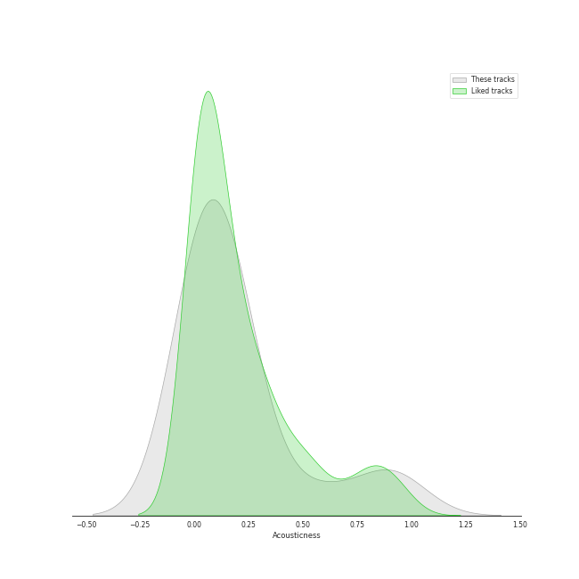
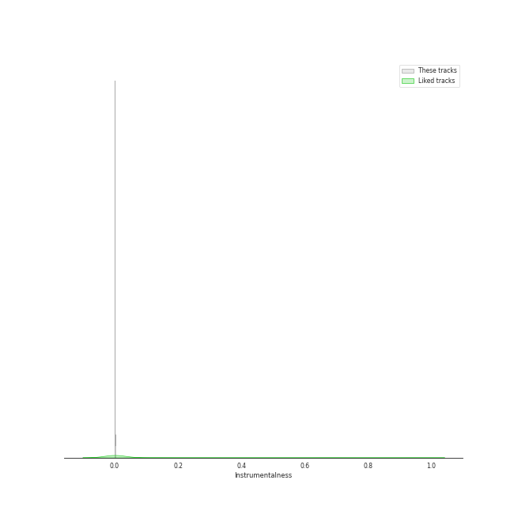

# Audio Features for Def Jam Recordings

## Danceability

| 10 most Danceable tracks | 10 least Danceable tracks |
|:---|:---|
| Don't Stop The Music (0.835) | Half Of Me (0.391) |
| Cravin (feat. G-Eazy) (0.834) | What Now (0.402) |
| Momma I Hit A Lick (feat. Kendrick Lamar) (0.796) | Rude Boy (0.563) |
| Only Girl (In The World) (0.788) | Umbrella (0.583) |
| Pon de Replay (0.779) | 1-800-273-8255 (0.62) |
| S&M (0.766) | Stay (0.621) |
| Watch n' Learn (0.741) | Lonely (with benny blanco) (0.631) |
| We Found Love (0.735) | Everyday (0.667) |
| Disturbia (0.707) | Homicide (feat. Eminem) (0.694) |
| Take A Bow (0.697) | Take A Bow (0.697) |

## Energy

| 10 most Energetic tracks | 10 least Energetic tracks |
|:---|:---|
| Umbrella (0.829) | Lonely (with benny blanco) (0.239) |
| Disturbia (0.813) | Stay (0.31) |
| Watch n' Learn (0.798) | Take A Bow (0.467) |
| We Found Love (0.766) | Momma I Hit A Lick (feat. Kendrick Lamar) (0.467) |
| Homicide (feat. Eminem) (0.759) | Cravin (feat. G-Eazy) (0.538) |
| Rude Boy (0.75) | Half Of Me (0.574) |
| Everyday (0.741) | 1-800-273-8255 (0.574) |
| Only Girl (In The World) (0.71) | Pon de Replay (0.64) |
| What Now (0.696) | Don't Stop The Music (0.669) |
| S&M (0.682) | S&M (0.682) |

## Speechiness

| 10 most Speechy tracks | 10 least Speechy tracks |
|:---|:---|
| Homicide (feat. Eminem) (0.398) | Stay (0.0283) |
| Momma I Hit A Lick (feat. Kendrick Lamar) (0.34) | Everyday (0.0378) |
| Cravin (feat. G-Eazy) (0.246) | We Found Love (0.0383) |
| Pon de Replay (0.159) | Half Of Me (0.0397) |
| Umbrella (0.134) | Lonely (with benny blanco) (0.0398) |
| Rude Boy (0.127) | S&M (0.0419) |
| Watch n' Learn (0.122) | Only Girl (In The World) (0.0426) |
| Take A Bow (0.0715) | What Now (0.0448) |
| Don't Stop The Music (0.0643) | 1-800-273-8255 (0.0479) |
| Disturbia (0.0571) | Disturbia (0.0571) |

## Acousticness

| 10 most Acoustic tracks | 10 least Acoustic tracks |
|:---|:---|
| Stay (0.945) | Pon de Replay (0.000155) |
| Lonely (with benny blanco) (0.864) | Watch n' Learn (0.00304) |
| 1-800-273-8255 (0.569) | Umbrella (0.00864) |
| Take A Bow (0.248) | S&M (0.0113) |
| Half Of Me (0.214) | We Found Love (0.025) |
| Momma I Hit A Lick (feat. Kendrick Lamar) (0.202) | Don't Stop The Music (0.0336) |
| Cravin (feat. G-Eazy) (0.191) | Everyday (0.0425) |
| Homicide (feat. Eminem) (0.137) | What Now (0.0476) |
| Rude Boy (0.113) | Disturbia (0.0863) |
| Only Girl (In The World) (0.113) | Only Girl (In The World) (0.113) |

## Instrumentalness

| 10 most Instrumental tracks | 10 least Instrumental tracks |
|:---|:---|
| We Found Love (0.00138) | What Now (0.0) |
| Pon de Replay (0.00077) | Disturbia (0.0) |
| S&M (0.00016) | Take A Bow (0.0) |
| Watch n' Learn (0.000134) | Umbrella (0.0) |
| Don't Stop The Music (6.92e-05) | Everyday (0.0) |
| Stay (6.12e-05) | Half Of Me (0.0) |
| Momma I Hit A Lick (feat. Kendrick Lamar) (3.32e-05) | Lonely (with benny blanco) (0.0) |
| Only Girl (In The World) (1.22e-05) | 1-800-273-8255 (0.0) |
| Homicide (feat. Eminem) (0.0) | Rude Boy (0.0) |
| Cravin (feat. G-Eazy) (0.0) | Cravin (feat. G-Eazy) (0.0) |

## Liveness

| 10 most Live tracks | 10 least Live tracks |
|:---|:---|
| What Now (0.628) | Umbrella (0.0426) |
| Half Of Me (0.36) | Don't Stop The Music (0.0535) |
| Watch n' Learn (0.282) | Only Girl (In The World) (0.0638) |
| Momma I Hit A Lick (feat. Kendrick Lamar) (0.206) | Everyday (0.0761) |
| 1-800-273-8255 (0.19) | Rude Boy (0.0788) |
| Disturbia (0.168) | Take A Bow (0.0941) |
| Homicide (feat. Eminem) (0.167) | Pon de Replay (0.101) |
| Stay (0.117) | S&M (0.104) |
| Lonely (with benny blanco) (0.116) | We Found Love (0.108) |
| Cravin (feat. G-Eazy) (0.113) | Cravin (feat. G-Eazy) (0.113) |

## Valence

| 10 most Happy tracks | 10 least Happy tracks |
|:---|:---|
| S&M (0.833) | Lonely (with benny blanco) (0.0927) |
| Watch n' Learn (0.823) | Stay (0.125) |
| Rude Boy (0.812) | What Now (0.227) |
| Homicide (feat. Eminem) (0.77) | Half Of Me (0.308) |
| Disturbia (0.722) | 1-800-273-8255 (0.357) |
| Only Girl (In The World) (0.632) | Momma I Hit A Lick (feat. Kendrick Lamar) (0.4) |
| We Found Love (0.6) | Everyday (0.422) |
| Umbrella (0.575) | Pon de Replay (0.498) |
| Take A Bow (0.572) | Cravin (feat. G-Eazy) (0.536) |
| Don't Stop The Music (0.542) | Don't Stop The Music (0.542) |

## Tempo

| 10 most Fast tracks | 10 least Fast tracks |
|:---|:---|
| What Now (180.158) | Lonely (with benny blanco) (79.859) |
| Momma I Hit A Lick (feat. Kendrick Lamar) (179.974) | Take A Bow (82.082) |
| Umbrella (174.028) | Cravin (feat. G-Eazy) (97.025) |
| Rude Boy (173.906) | Pon de Replay (99.019) |
| Watch n' Learn (168.01) | 1-800-273-8255 (100.023) |
| Everyday (149.908) | Stay (111.893) |
| Half Of Me (147.435) | Don't Stop The Music (122.668) |
| Homicide (feat. Eminem) (140.055) | Disturbia (124.921) |
| We Found Love (127.985) | Only Girl (In The World) (125.919) |
| S&M (127.966) | S&M (127.966) |
