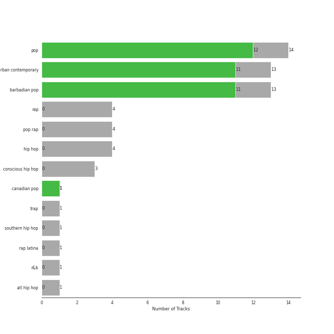
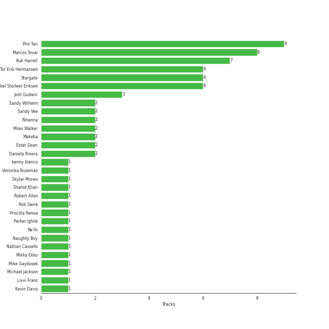

# Def Jam Recordings

19 songs

[See Track Features](audio_features.md)

[See Clusters](clusters/overview.md)

Appears as:
- Def Jam Recordings (17 tracks)
- Friends Keep Secrets/Def Jam Recordings/Interscope Records (1 tracks)
- Gamebread, LLC / Def Jam Recordings (1 tracks)

## Top Artists

| Art | Tracks | 💚 | Artist | 🔗 |
|:---|---:|---:|:---|:---|
|  | 13 | 11 | [Rihanna](../../artists/rihanna/overview.md) | [🔗](https://open.spotify.com/artist/5pKCCKE2ajJHZ9KAiaK11H) |
|  | 1 | 1 | Calvin Harris | [🔗](https://open.spotify.com/artist/7CajNmpbOovFoOoasH2HaY) |
|  | 1 | 1 | benny blanco | [🔗](https://open.spotify.com/artist/5CiGnKThu5ctn9pBxv7DGa) |
|  | 1 | 1 | [Justin Bieber](../../artists/justin_bieber/overview.md) | [🔗](https://open.spotify.com/artist/1uNFoZAHBGtllmzznpCI3s) |
|  | 1 | 1 | Mikky Ekko | [🔗](https://open.spotify.com/artist/1buzCmyYZE4kcdLRudsb8V) |
|  | 3 | 0 | Logic | [🔗](https://open.spotify.com/artist/4xRYI6VqpkE3UwrDrAZL8L) |
|  | 1 | 0 | [Eminem](../../artists/eminem/overview.md) | [🔗](https://open.spotify.com/artist/7dGJo4pcD2V6oG8kP0tJRR) |
|  | 1 | 0 | Khalid | [🔗](https://open.spotify.com/artist/6LuN9FCkKOj5PcnpouEgny) |
|  | 1 | 0 | Marshmello | [🔗](https://open.spotify.com/artist/64KEffDW9EtZ1y2vBYgq8T) |
|  | 1 | 0 | JAY-Z | [🔗](https://open.spotify.com/artist/3nFkdlSjzX9mRTtwJOzDYB) |

See all 15 artists

| Art | Tracks | 💚 | Artist | 🔗 |
|:---|---:|---:|:---|:---|
|  | 1 | 0 | Alessia Cara | [🔗](https://open.spotify.com/artist/2wUjUUtkb5lvLKcGKsKqsR) |
|  | 1 | 0 | [Kendrick Lamar](../../artists/kendrick_lamar/overview.md) | [🔗](https://open.spotify.com/artist/2YZyLoL8N0Wb9xBt1NhZWg) |
|  | 1 | 0 | 2 Chainz | [🔗](https://open.spotify.com/artist/17lzZA2AlOHwCwFALHttmp) |
|  | 1 | 0 | DaniLeigh | [🔗](https://open.spotify.com/artist/0XIKGBo9PnK1ApI5tZA60d) |
|  | 1 | 0 | G-Eazy | [🔗](https://open.spotify.com/artist/02kJSzxNuaWGqwubyUba0Z) |

## Top Albums

| Art | Tracks | 💚 | Album | Release Date | 🔗 |
|:---|---:|---:|:---|:---|:---|
|  | 4 | 3 | Good Girl Gone Bad: Reloaded | 2008-06-02 | [🔗](https://open.spotify.com/album/3JSWZWeTHF4HDGt5Eozdy7) |
|  | 3 | 3 | Unapologetic (Deluxe) | 2012-12-11 | [🔗](https://open.spotify.com/album/4eddbruVtOqw8khwxSH6H2) |
|  | 2 | 2 | Talk That Talk | 2011-11-19 | [🔗](https://open.spotify.com/album/1Kw1bVd07oRqcjrcjQKC8T) |
|  | 2 | 2 | Loud | 2010-11-16 | [🔗](https://open.spotify.com/album/6UHhmTLl9T1scRYLmpHcDX) |
|  | 1 | 1 | Rated R | 2009-11-20 | [🔗](https://open.spotify.com/album/7uGmyYwDFJbSc1xs4hkEs2) |
|  | 1 | 1 | Lonely (with benny blanco) | 2020-10-16 | [🔗](https://open.spotify.com/album/3P5WIUJO0Ots1lQx09TOxk) |
|  | 1 | 0 | Rap Or Go To The League | 2019-03-01 | [🔗](https://open.spotify.com/album/1BR69wIifGZUSimcuTjWVg) |
|  | 1 | 0 | Music Of The Sun | 2005-08-29 | [🔗](https://open.spotify.com/album/4FyGpObwABjn0o8Tdp7AZz) |
|  | 1 | 0 | Everybody | 2017-05-05 | [🔗](https://open.spotify.com/album/1HiN2YXZcc3EjmVZ4WjfBk) |
|  | 1 | 0 | Cravin | 2019-10-18 | [🔗](https://open.spotify.com/album/6c66PBJdg7EWPcFUvLyFFu) |

See all 12 albums

| Art | Tracks | 💚 | Album | Release Date | 🔗 |
|:---|---:|---:|:---|:---|:---|
|  | 1 | 0 | Confessions of a Dangerous Mind | 2019-05-10 | [🔗](https://open.spotify.com/album/0XLwImzaZEtqHE4NHAepDz) |
|  | 1 | 0 | Bobby Tarantino II | 2018-03-09 | [🔗](https://open.spotify.com/album/4F87p1aiFwHeU4uu65MaPV) |

## Genres

| Tracks | 💚 | Genre |
|---:|---:|:---|
| 14 | 12 | [pop](../../genres/pop/overview.md) |
| 13 | 11 | [urban contemporary](../../genres/urban_contemporary/overview.md) |
| 13 | 11 | barbadian pop |
| 1 | 1 | [canadian pop](../../genres/canadian_pop/overview.md) |
| 4 | 0 | [rap](../../genres/rap/overview.md) |
| 4 | 0 | pop rap |
| 4 | 0 | [hip hop](../../genres/hip_hop/overview.md) |
| 3 | 0 | conscious hip hop |
| 1 | 0 | trap |
| 1 | 0 | southern hip hop |

See all 13 genres

| Tracks | 💚 | Genre |
|---:|---:|:---|
| 1 | 0 | rap latina |
| 1 | 0 | [r&b](../../genres/r_b/overview.md) |
| 1 | 0 | atl hip hop |

## Top Producers

| Art | Producer | Tracks | Credit Types |
|:---|:---|---:|:---|
| | [Phil Tan](../../producers/phil_tan/overview.md) | 9 | Producer |
| | [Marcos Tovar](../../producers/marcos_tovar/overview.md) | 8 | Producer |
| | Kuk Harrell | 7 | Producer |
| | Tor Erik Hermansen | 6 | Songwriter |
| | [Mikkel Storleer Eriksen](../../producers/mikkel_storleer_eriksen/overview.md) | 6 | Songwriter, Producer |
| | Stargate | 6 | Producer |
| | [Josh Gudwin](../../producers/josh_gudwin/overview.md) | 3 | Producer |
| | Sandy Vee | 2 | Producer |
| | Sandy Wilhelm | 2 | Songwriter |
|  | [Rihanna](../../artists/rihanna/overview.md) | 2 | Songwriter |

View all

| Art | Producer | Tracks | Credit Types |
|:---|:---|---:|:---|
| | Makeba | 2 | Producer, Songwriter |
| | Miles Walker | 2 | Producer |
| | Daniela Rivera | 2 | Producer |
| | Ester Dean | 2 | Songwriter |
| | Parker Ighile | 1 | Producer, Songwriter |
| | Hit-Boy | 1 | Producer, Songwriter |
|  | [Justin Bieber](../../artists/justin_bieber/overview.md) | 1 | Songwriter |
| | Crystal Nicole | 1 | Songwriter |
| | Justin Parker | 1 | Arranger, Producer, Songwriter |
| | Elof Loelv | 1 | Producer, Songwriter |
|  | [Michael Jackson](../../artists/michael_jackson/overview.md) | 1 | Songwriter |
| | Frankie Storm | 1 | Songwriter |
| | Rob Swire | 1 | Producer, Songwriter |
| | Mike Gaydusek | 1 | Producer |
| | Al Hemberger | 1 | Producer |
| | Shahid Khan | 1 | Songwriter |
| | Kevin Davis | 1 | Producer |
|  | Chris Brown | 1 | Songwriter |
| | Robert Allen | 1 | Songwriter |
| | Veronika Bozeman | 1 | Producer |
| | Brian Kennedy | 1 | Producer, Songwriter |
| | Andrew Vastola | 1 | Producer |
| | Nathan Cassells | 1 | Producer, Songwriter |
| | [FINNEAS](../../producers/finneas/overview.md) | 1 | Producer, Songwriter |
| | Naughty Boy | 1 | Producer |
| | Skylar Mones | 1 | Producer |
| | Livvi Franc | 1 | Songwriter |
|  | benny blanco | 1 | Producer, Songwriter |
|  | Ne-Yo | 1 | Producer, Songwriter |
| | Josh Houghkirk | 1 | Producer |
| | Alju Jackson | 1 | Songwriter |
| | Emeli Sandé (Sandé, Emeli) | 1 | Songwriter |
|  | Calvin Harris | 1 | Producer, Songwriter |
| | Priscilla Renea | 1 | Songwriter |
| | Andre Merritt | 1 | Songwriter |
|  | Mikky Ekko | 1 | Arranger, Producer, Songwriter |

## Tracks released under Def Jam Recordings

| Art | Track | Album | Artists | Label | Rank | 💚 | 🔗 |
|:---|:---|:---|:---|:---|---:|:---|:---|
|  | What Now | Unapologetic (Deluxe) | [Rihanna](../../artists/rihanna/overview.md) | [Def Jam Recordings](.) | 320 | 💚 | [🔗](https://open.spotify.com/track/0aUWfpD3PlSv3FTTKcT2rN) |
|  | Stay | Unapologetic (Deluxe) | [Rihanna](../../artists/rihanna/overview.md), Mikky Ekko | [Def Jam Recordings](.) | 746 | 💚 | [🔗](https://open.spotify.com/track/1dEy9Pl81QopSxNsPxXQxv) |
|  | Pon de Replay | Music Of The Sun | [Rihanna](../../artists/rihanna/overview.md) | [Def Jam Recordings](.) | 868 | | [🔗](https://open.spotify.com/track/4TsmezEQVSZNNPv5RJ65Ov) |
|  | Disturbia | Good Girl Gone Bad: Reloaded | [Rihanna](../../artists/rihanna/overview.md) | [Def Jam Recordings](.) | 868 | 💚 | [🔗](https://open.spotify.com/track/2VOomzT6VavJOGBeySqaMc) |
|  | Don't Stop The Music | Good Girl Gone Bad: Reloaded | [Rihanna](../../artists/rihanna/overview.md) | [Def Jam Recordings](.) | 868 | 💚 | [🔗](https://open.spotify.com/track/0ByMNEPAPpOR5H69DVrTNy) |
|  | Take A Bow | Good Girl Gone Bad: Reloaded | [Rihanna](../../artists/rihanna/overview.md) | [Def Jam Recordings](.) | 868 | 💚 | [🔗](https://open.spotify.com/track/3goSVuTt3fDYDP6kRnFwuL) |
|  | Umbrella | Good Girl Gone Bad: Reloaded | [Rihanna](../../artists/rihanna/overview.md), JAY-Z | [Def Jam Recordings](.) | 868 | | [🔗](https://open.spotify.com/track/49FYlytm3dAAraYgpoJZux) |
|  | Rude Boy | Rated R | [Rihanna](../../artists/rihanna/overview.md) | [Def Jam Recordings](.) | 868 | 💚 | [🔗](https://open.spotify.com/track/60jzFy6Nn4M0iD1d94oteF) |
|  | Only Girl (In The World) | Loud | [Rihanna](../../artists/rihanna/overview.md) | [Def Jam Recordings](.) | 868 | 💚 | [🔗](https://open.spotify.com/track/1VDXQhu7YGdbM6UeEIfsaX) |
|  | S&M | Loud | [Rihanna](../../artists/rihanna/overview.md) | [Def Jam Recordings](.) | 868 | 💚 | [🔗](https://open.spotify.com/track/08Bfk5Y2S5fCxgxk371Eel) |

See all tracks

| Art | Track | Album | Artists | Label | Rank | 💚 | 🔗 |
|:---|:---|:---|:---|:---|---:|:---|:---|
|  | Watch n' Learn | Talk That Talk | [Rihanna](../../artists/rihanna/overview.md) | [Def Jam Recordings](.) | 868 | 💚 | [🔗](https://open.spotify.com/track/1ROCX1nquOZ5i05YfGysu0) |
|  | We Found Love | Talk That Talk | [Rihanna](../../artists/rihanna/overview.md), Calvin Harris | [Def Jam Recordings](.) | 868 | 💚 | [🔗](https://open.spotify.com/track/0U10zFw4GlBacOy9VDGfGL) |
|  | Half Of Me | Unapologetic (Deluxe) | [Rihanna](../../artists/rihanna/overview.md) | [Def Jam Recordings](.) | 868 | 💚 | [🔗](https://open.spotify.com/track/4bXImuY3OhNXhbQbVLFHKp) |
|  | 1-800-273-8255 | Everybody | Logic, Alessia Cara, Khalid | [Def Jam Recordings](.) | 868 | | [🔗](https://open.spotify.com/track/5tz69p7tJuGPeMGwNTxYuV) |
|  | Everyday | Bobby Tarantino II | Logic, Marshmello | [Def Jam Recordings](.) | 868 | | [🔗](https://open.spotify.com/track/4EAV2cKiqKP5UPZmY6dejk) |
|  | Momma I Hit A Lick (feat. Kendrick Lamar) | Rap Or Go To The League | 2 Chainz, [Kendrick Lamar](../../artists/kendrick_lamar/overview.md) | [Gamebread, LLC / Def Jam Recordings](.) | 868 | | [🔗](https://open.spotify.com/track/7jKUnzzOGhAlPjr7LkIUlE) |
|  | Homicide (feat. Eminem) | Confessions of a Dangerous Mind | Logic, [Eminem](../../artists/eminem/overview.md) | [Def Jam Recordings](.) | 868 | | [🔗](https://open.spotify.com/track/7M2tXmeS15NAzEn7ABFeBg) |
|  | Cravin (feat. G-Eazy) | Cravin | DaniLeigh, G-Eazy | [Def Jam Recordings](.) | 868 | | [🔗](https://open.spotify.com/track/69eXHDgEEQ6itzt03E7fKz) |
|  | Lonely (with benny blanco) | Lonely (with benny blanco) | [Justin Bieber](../../artists/justin_bieber/overview.md), benny blanco | Friends Keep Secrets, [Def Jam Recordings](.), [Interscope Records](../interscope_records) | 868 | 💚 | [🔗](https://open.spotify.com/track/4y4spB9m0Q6026KfkAvy9Q) |

