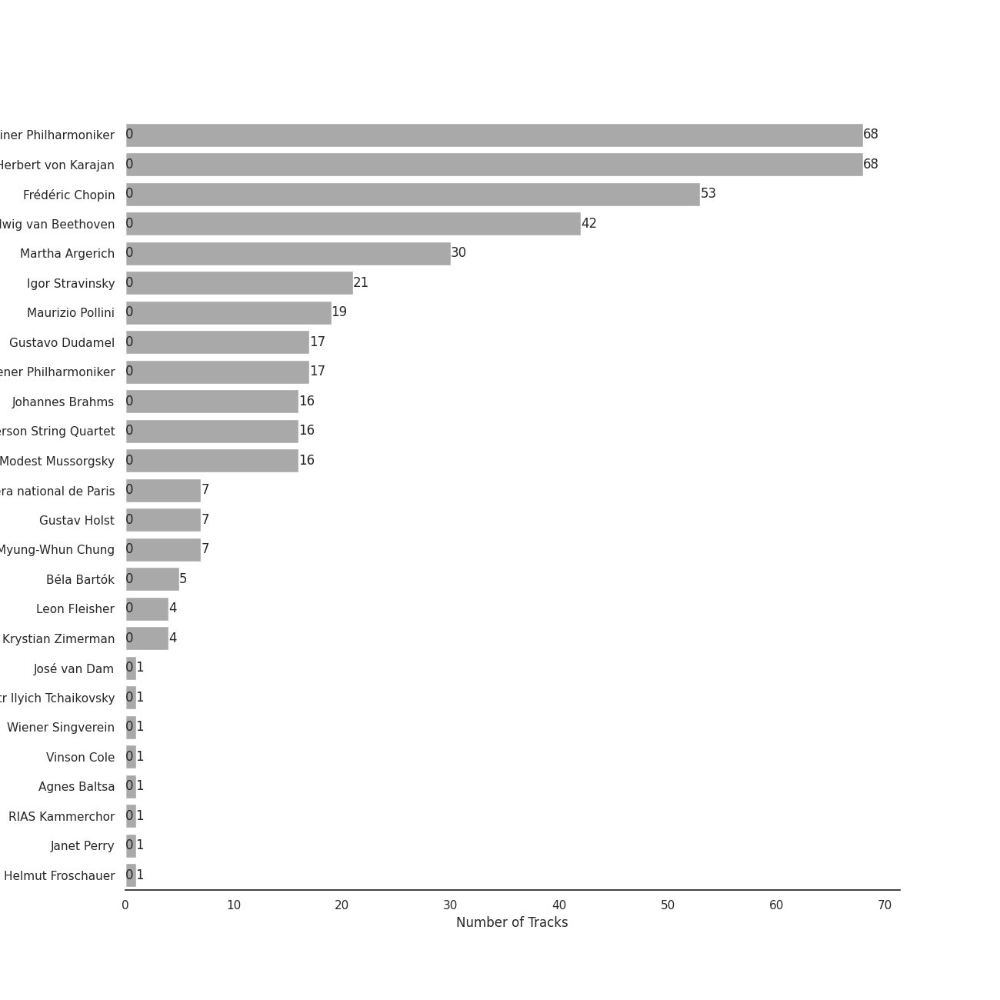
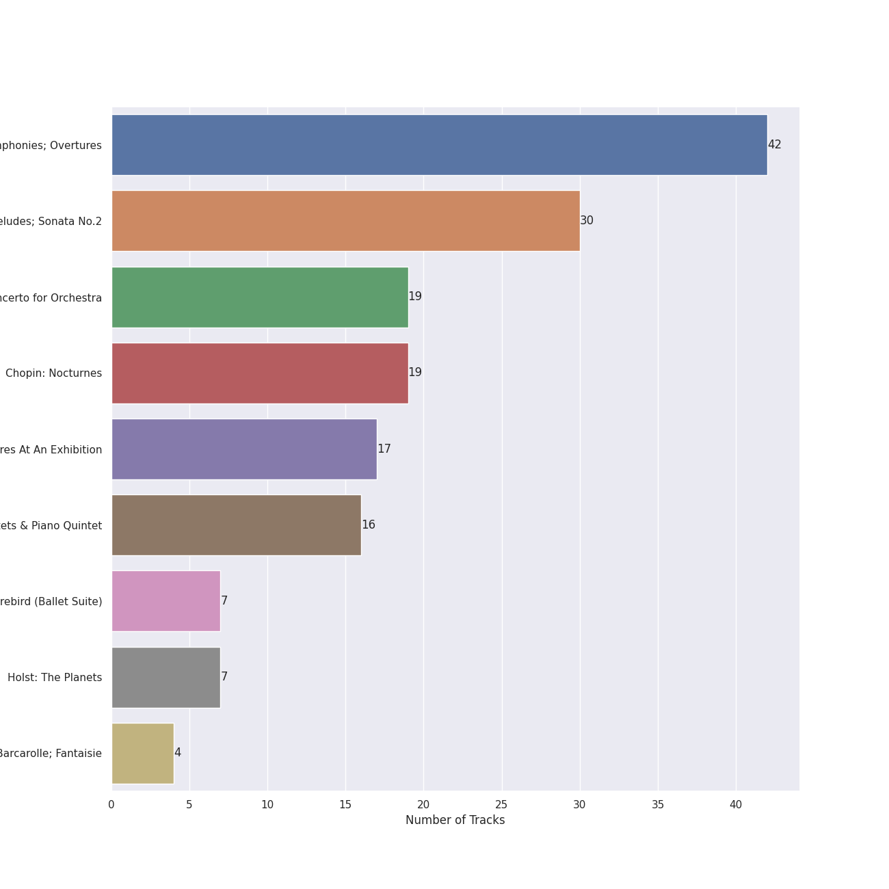
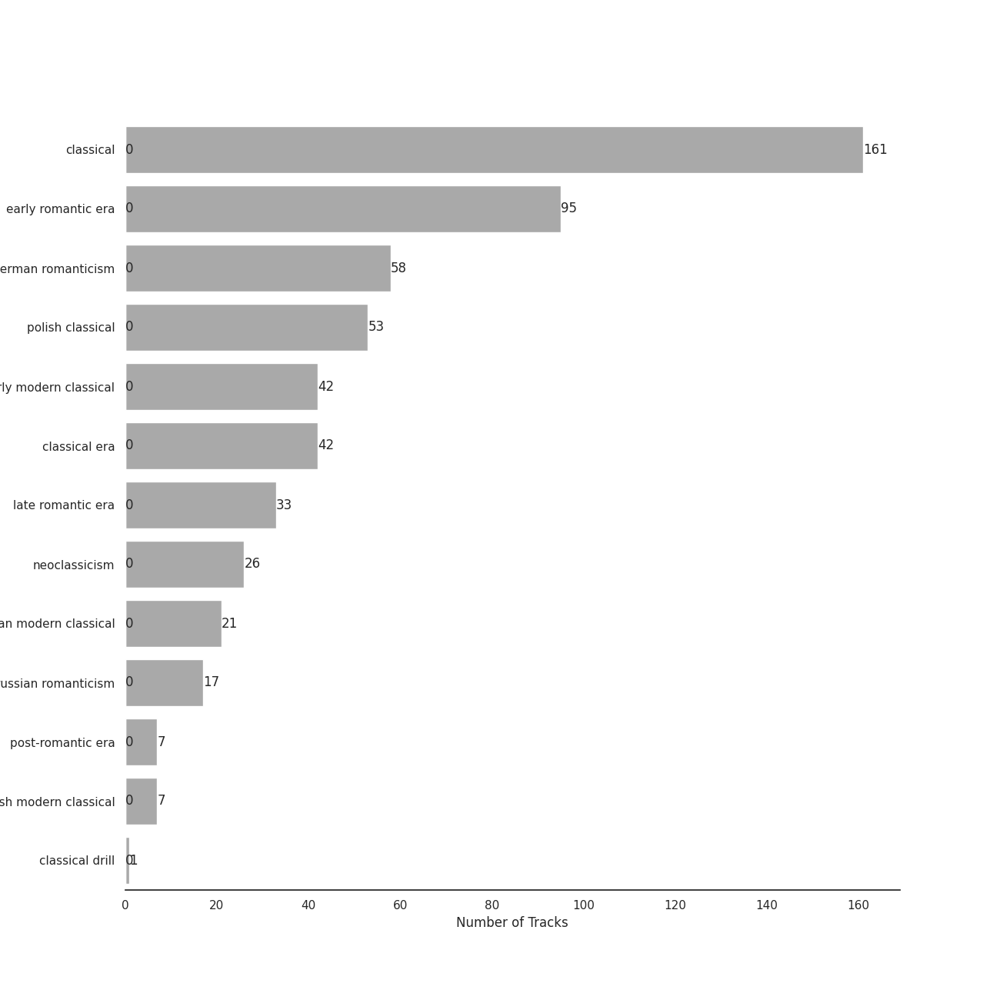

# Deutsche Grammophon (DG)

207 songs

Appears as:
- Deutsche Grammophon (DG) (207 tracks)

## Top Artists

See all 48 artists

|   Number of Tracks | Art                                                                                              | Artist                                                             | 🔗                                                           |
|-------------------:|:-------------------------------------------------------------------------------------------------|:-------------------------------------------------------------------|:------------------------------------------------------------|
|                 98 |  | [Berliner Philharmoniker](../artists/berliner_philharmoniker.md)   | [🔗](https://open.spotify.com/artist/6uRJnvQ3f8whVnmeoecv5Z) |
|                 68 |  | [Herbert von Karajan](../artists/herbert_von_karajan.md)           | [🔗](https://open.spotify.com/artist/5zCaQxjl110XTrm4LQ1CxY) |
|                 53 |  | [Frédéric Chopin](../artists/fr_d_ric_chopin.md)                   | [🔗](https://open.spotify.com/artist/7y97mc3bZRFXzT2szRM4L4) |
|                 46 |  | [Wolfgang Amadeus Mozart](../artists/wolfgang_amadeus_mozart.md)   | [🔗](https://open.spotify.com/artist/4NJhFmfw43RLBLjQvxDuRS) |
|                 42 |  | [Ludwig van Beethoven](../artists/ludwig_van_beethoven.md)         | [🔗](https://open.spotify.com/artist/2wOqMjp9TyABvtHdOSOTUS) |
|                 30 |  | [Martha Argerich](../artists/martha_argerich.md)                   | [🔗](https://open.spotify.com/artist/66MvLAvLznk5UOvASVGjk4) |
|                 30 |  | [Karl Böhm](../artists/karl_b_hm.md)                               | [🔗](https://open.spotify.com/artist/3fyr5uksidSlLzsUjRIz5A) |
|                 21 |  | [Igor Stravinsky](../artists/igor_stravinsky.md)                   | [🔗](https://open.spotify.com/artist/7ie36YytMoKtPiL7tUvmoE) |
|                 19 |  | [Fritz Wunderlich](../artists/fritz_wunderlich.md)                 | [🔗](https://open.spotify.com/artist/3jp4zawfeVYVpSzO2Yujbv) |
|                 19 |  | [Maurizio Pollini](../artists/maurizio_pollini.md)                 | [🔗](https://open.spotify.com/artist/2VIdKQmRHnWofsR4odfFOh) |
|                 19 |  | [Dietrich Fischer-Dieskau](../artists/dietrich_fischer_dieskau.md) | [🔗](https://open.spotify.com/artist/10CN8N2O3FlGlPVJWBiu5D) |
|                 17 |  | [Gustavo Dudamel](../artists/gustavo_dudamel.md)                   | [🔗](https://open.spotify.com/artist/0cxXnDhpgxcMMkKddhORHY) |
|                 17 |  | [Wiener Philharmoniker](../artists/wiener_philharmoniker.md)       | [🔗](https://open.spotify.com/artist/003f4bk13c6Q3gAUXv7dGJ) |
|                 16 |  | [Johannes Brahms](../artists/johannes_brahms.md)                   | [🔗](https://open.spotify.com/artist/5wTAi7QkpP6kp8a54lmTOq) |
|                 16 |  | [Emerson String Quartet](../artists/emerson_string_quartet.md)     | [🔗](https://open.spotify.com/artist/4IBl8k6ZsBagsI5zRjyXH7) |
|                 16 |  | [Modest Mussorgsky](../artists/modest_mussorgsky.md)               | [🔗](https://open.spotify.com/artist/284mnx33IWcymQEpMxyfHl) |
|                 14 |  | [Evelyn Lear](../artists/evelyn_lear.md)                           | [🔗](https://open.spotify.com/artist/7cqPRCrwbsqYEw0RurLb6x) |
|                  8 |  | RIAS Kammerchor                                                    | [🔗](https://open.spotify.com/artist/2UVXU77knJMYOM6Avvw6Yx) |
|                  8 |  | Franz Crass                                                        | [🔗](https://open.spotify.com/artist/0Ui6BXSgrOvh070lh0X2bb) |
|                  7 |                                                               | Hubert Hilten                                                      | [🔗](https://open.spotify.com/artist/5JAmiZygpQIvPCQNl5naru) |
|                  7 |  | Gustav Holst                                                       | [🔗](https://open.spotify.com/artist/5B7uXBeLc2TkR5Jk23qKIZ) |
|                  7 |  | Orchestre de l'Opéra Bastille                                      | [🔗](https://open.spotify.com/artist/4w8yzPixoCNwxRpUZYpWpP) |
|                  7 |  | Myung-Whun Chung                                                   | [🔗](https://open.spotify.com/artist/4hdiwtmc6OEFFxpSlwwmby) |
|                  7 |  | Friedrich Lenz                                                     | [🔗](https://open.spotify.com/artist/1XozF2JdqU39QPR4PMdYWJ) |
|                  6 |  | Cvetka Ahlin                                                       | [🔗](https://open.spotify.com/artist/665SZgKrQ5WNGAeOnd2Mqa) |
|                  6 |  | Sieglinde Wagner                                                   | [🔗](https://open.spotify.com/artist/3oArooECbeEKu2VGqJyOfT) |
|                  6 |  | Hildegard Hillebrecht                                              | [🔗](https://open.spotify.com/artist/1Txb4H69qwYQj2ZysUnIPW) |
|                  5 |  | Béla Bartók                                                        | [🔗](https://open.spotify.com/artist/5zyNXVd952fWOjkdGHCvPd) |
|                  5 |  | Martin Vantin                                                      | [🔗](https://open.spotify.com/artist/1BUsqeIGNbX2bDvT0J57lD) |
|                  4 |  | Leon Fleisher                                                      | [🔗](https://open.spotify.com/artist/6ncNdxBc8zVWMOF7nJ5Pgy) |
|                  4 |  | Roberta Peters                                                     | [🔗](https://open.spotify.com/artist/5o0oA0zUboLb96PDSSbD3a) |
|                  4 |  | Raili Kostia                                                       | [🔗](https://open.spotify.com/artist/5Myeb4y6YvIGBd8mWuIl4h) |
|                  4 |  | Rosl Schwaiger                                                     | [🔗](https://open.spotify.com/artist/4D24idOvS0AphoBqEIoEeq) |
|                  4 |  | Krystian Zimerman                                                  | [🔗](https://open.spotify.com/artist/43wuPaPcZVMJQWLRaPR4Yz) |
|                  4 |  | Antonia Fahberg                                                    | [🔗](https://open.spotify.com/artist/3JConBfkkv5Dj3dVeSTWgG) |
|                  3 |  | Manfred Röhrl                                                      | [🔗](https://open.spotify.com/artist/6JrRgsrEjhUOe6XHFigwTZ) |
|                  2 |  | Lisa Otto                                                          | [🔗](https://open.spotify.com/artist/5cvZb3jwCrUtVIobHPa1cu) |
|                  1 |  | [José van Dam](../artists/jos__van_dam.md)                         | [🔗](https://open.spotify.com/artist/5qNUHMEhszyeXNYMn4sswd) |
|                  1 |  | James King                                                         | [🔗](https://open.spotify.com/artist/5I2cYLH1KGi4ezFJ9X7JTI) |
|                  1 |  | Günther Arndt                                                      | [🔗](https://open.spotify.com/artist/4wZu08TMxqUmPqi5qHe31j) |
|                  1 |  | Martti Talvela                                                     | [🔗](https://open.spotify.com/artist/4vwjX6wY3JStfrFdnahxaR) |
|                  1 |  | [Pyotr Ilyich Tchaikovsky](../artists/pyotr_ilyich_tchaikovsky.md) | [🔗](https://open.spotify.com/artist/3MKCzCnpzw3TjUYs2v7vDA) |
|                  1 |  | Hans Hotter                                                        | [🔗](https://open.spotify.com/artist/3GtU1O2V8snd7EP5ySYLqN) |
|                  1 |  | [Wiener Singverein](../artists/wiener_singverein.md)               | [🔗](https://open.spotify.com/artist/35QSympF887CO8h5eZHme2) |
|                  1 |  | Vinson Cole                                                        | [🔗](https://open.spotify.com/artist/2j6cP3f3TxyHzcKdWYSm6h) |
|                  1 |  | [Agnes Baltsa](../artists/agnes_baltsa.md)                         | [🔗](https://open.spotify.com/artist/2amF56vDuTTbZJQsqUgbuC) |
|                  1 |  | Janet Perry                                                        | [🔗](https://open.spotify.com/artist/1bV3KjOPs1AI3OolJiYogN) |
|                  1 |  | Helmut Froschauer                                                  | [🔗](https://open.spotify.com/artist/172Encqfd2ZhWAleNg1gbO) |

## Top Albums

See all 10 albums

|   Number of Tracks | Art                                                                                              | Album                                                           | 🔗                                                          |
|-------------------:|:-------------------------------------------------------------------------------------------------|:----------------------------------------------------------------|:-----------------------------------------------------------|
|                 46 |  | Mozart: Die Zauberflöte                                         | [🔗](https://open.spotify.com/album/45QGB3unppoM0c5CoRobJK) |
|                 42 |  | Beethoven: 9 Symphonies; Overtures                              | [🔗](https://open.spotify.com/album/2DQTNTznsteIZciZdyeWdj) |
|                 30 |  | Chopin: Preludes; Sonata No.2                                   | [🔗](https://open.spotify.com/album/33YXJqoFV5AQwbo4yfk22n) |
|                 19 |  | Stravinsky: The Rite of Spring / Bartók: Concerto for Orchestra | [🔗](https://open.spotify.com/album/317b74rpNBO2uhaJFyMaxJ) |
|                 19 |  | Chopin: Nocturnes                                               | [🔗](https://open.spotify.com/album/2aoSpTAjFaMvaZeruqnCVv) |
|                 17 |  | Mussorgsky: Pictures At An Exhibition                           | [🔗](https://open.spotify.com/album/1b2aoeaYZZBWmJoavOQhnd) |
|                 16 |  | Brahms: String Quartets & Piano Quintet                         | [🔗](https://open.spotify.com/album/5nZ5ePGoQZGt1MbGphwqph) |
|                  7 |  | Stravinsky: The Firebird (Ballet Suite)                         | [🔗](https://open.spotify.com/album/2q1xMRl4AcA7rI8GfGnmvD) |
|                  7 |  | Holst: The Planets                                              | [🔗](https://open.spotify.com/album/4v0Xyz0LVToUsSTGdsvKSK) |
|                  4 |  | Chopin: Ballades; Barcarolle; Fantaisie                         | [🔗](https://open.spotify.com/album/5c9v5oU43Oo22MSG8EKFp2) |

## Genres

See all 12 genres

|   Number of Tracks | Genre                                                             |
|-------------------:|:------------------------------------------------------------------|
|                191 | [classical](../genres/classical.md)                               |
|                 95 | [early romantic era](../genres/early_romantic_era.md)             |
|                 88 | [classical era](../genres/classical_era.md)                       |
|                 58 | [german romanticism](../genres/german_romanticism.md)             |
|                 53 | [polish classical](../genres/polish_classical.md)                 |
|                 33 | [late romantic era](../genres/late_romantic_era.md)               |
|                 26 | [neoclassicism](../genres/neoclassicism.md)                       |
|                 26 | [early modern classical](../genres/early_modern_classical.md)     |
|                 21 | [russian modern classical](../genres/russian_modern_classical.md) |
|                 17 | [russian romanticism](../genres/russian_romanticism.md)           |
|                  7 | [post-romantic era](../genres/post_romantic_era.md)               |
|                  7 | british modern classical                                          |

## Tracks released under Deutsche Grammophon (DG)

| Art                                                                                              | Track                                                                                                                                                        | Album                                                           | Artists                                                                                                                                                                                                                                                                                                                                                                                  | Label                                                   | 💚   | 🔗                                                          |
|:-------------------------------------------------------------------------------------------------|:-------------------------------------------------------------------------------------------------------------------------------------------------------------|:----------------------------------------------------------------|:-----------------------------------------------------------------------------------------------------------------------------------------------------------------------------------------------------------------------------------------------------------------------------------------------------------------------------------------------------------------------------------------|:--------------------------------------------------------|:----|:-----------------------------------------------------------|
|  | Concerto for Orchestra, Sz. 116: 1. Introduzione (Andante non troppo - Allegro vivace                                                                        | Stravinsky: The Rite of Spring / Bartók: Concerto for Orchestra | Béla Bartók, [Berliner Philharmoniker](../artists/berliner_philharmoniker.md), [Herbert von Karajan](../artists/herbert_von_karajan.md)                                                                                                                                                                                                                                                  | [Deutsche Grammophon (DG)](deutsche_grammophon__dg_.md) |     | [🔗](https://open.spotify.com/track/2xGEjbQPRhl8fiECYoLSr6) |
|  | Concerto for Orchestra, Sz. 116: 2. Giuoco della coppie (Allegretto scherzando)                                                                              | Stravinsky: The Rite of Spring / Bartók: Concerto for Orchestra | Béla Bartók, [Berliner Philharmoniker](../artists/berliner_philharmoniker.md), [Herbert von Karajan](../artists/herbert_von_karajan.md)                                                                                                                                                                                                                                                  | [Deutsche Grammophon (DG)](deutsche_grammophon__dg_.md) |     | [🔗](https://open.spotify.com/track/6Mc9Vhvj1ViMOLQsuz3tBi) |
|  | Concerto for Orchestra, Sz. 116: 3. Elegia (Andante, non troppo)                                                                                             | Stravinsky: The Rite of Spring / Bartók: Concerto for Orchestra | Béla Bartók, [Berliner Philharmoniker](../artists/berliner_philharmoniker.md), [Herbert von Karajan](../artists/herbert_von_karajan.md)                                                                                                                                                                                                                                                  | [Deutsche Grammophon (DG)](deutsche_grammophon__dg_.md) |     | [🔗](https://open.spotify.com/track/3WEuXrfUf7meRWvdklzN8I) |
|  | Concerto for Orchestra, Sz. 116: 4. Intermezzo interrotto (Allegretto)                                                                                       | Stravinsky: The Rite of Spring / Bartók: Concerto for Orchestra | Béla Bartók, [Berliner Philharmoniker](../artists/berliner_philharmoniker.md), [Herbert von Karajan](../artists/herbert_von_karajan.md)                                                                                                                                                                                                                                                  | [Deutsche Grammophon (DG)](deutsche_grammophon__dg_.md) |     | [🔗](https://open.spotify.com/track/4TeyuG0hb7uqGvOVwWvWas) |
|  | Concerto for Orchestra, Sz. 116: 5. Finale (Pesante - Presto)                                                                                                | Stravinsky: The Rite of Spring / Bartók: Concerto for Orchestra | Béla Bartók, [Berliner Philharmoniker](../artists/berliner_philharmoniker.md), [Herbert von Karajan](../artists/herbert_von_karajan.md)                                                                                                                                                                                                                                                  | [Deutsche Grammophon (DG)](deutsche_grammophon__dg_.md) |     | [🔗](https://open.spotify.com/track/6pTDV5wsqZaCNlgnWLhfoF) |
|  | Ballade No. 1 in G Minor, Op. 23                                                                                                                             | Chopin: Ballades; Barcarolle; Fantaisie                         | [Frédéric Chopin](../artists/fr_d_ric_chopin.md), Krystian Zimerman                                                                                                                                                                                                                                                                                                                      | [Deutsche Grammophon (DG)](deutsche_grammophon__dg_.md) |     | [🔗](https://open.spotify.com/track/5Ks5ENUFNQDfaqxjZnCkVJ) |
|  | Ballade No. 2 in F Major, Op. 38                                                                                                                             | Chopin: Ballades; Barcarolle; Fantaisie                         | [Frédéric Chopin](../artists/fr_d_ric_chopin.md), Krystian Zimerman                                                                                                                                                                                                                                                                                                                      | [Deutsche Grammophon (DG)](deutsche_grammophon__dg_.md) |     | [🔗](https://open.spotify.com/track/5R6Xhutodh7bhDGVY71V3O) |
|  | Ballade No. 3 In A-Flat Major, Op. 47                                                                                                                        | Chopin: Ballades; Barcarolle; Fantaisie                         | [Frédéric Chopin](../artists/fr_d_ric_chopin.md), Krystian Zimerman                                                                                                                                                                                                                                                                                                                      | [Deutsche Grammophon (DG)](deutsche_grammophon__dg_.md) |     | [🔗](https://open.spotify.com/track/0FBJ5Ctk5r4wlVJsFoV8Ta) |
|  | Ballade No. 4 in F Minor, Op. 52                                                                                                                             | Chopin: Ballades; Barcarolle; Fantaisie                         | [Frédéric Chopin](../artists/fr_d_ric_chopin.md), Krystian Zimerman                                                                                                                                                                                                                                                                                                                      | [Deutsche Grammophon (DG)](deutsche_grammophon__dg_.md) |     | [🔗](https://open.spotify.com/track/1kVoL8Qst9UP3X902NWMo7) |
|  | 24 Préludes, Op. 28: No. 1 in C Major                                                                                                                        | Chopin: Preludes; Sonata No.2                                   | [Frédéric Chopin](../artists/fr_d_ric_chopin.md), [Martha Argerich](../artists/martha_argerich.md)                                                                                                                                                                                                                                                                                       | [Deutsche Grammophon (DG)](deutsche_grammophon__dg_.md) |     | [🔗](https://open.spotify.com/track/5lBrZri8OR3UMqWjdof0E8) |
|  | 24 Préludes, Op. 28: No. 10 in C-Sharp Minor                                                                                                                 | Chopin: Preludes; Sonata No.2                                   | [Frédéric Chopin](../artists/fr_d_ric_chopin.md), [Martha Argerich](../artists/martha_argerich.md)                                                                                                                                                                                                                                                                                       | [Deutsche Grammophon (DG)](deutsche_grammophon__dg_.md) |     | [🔗](https://open.spotify.com/track/1QxIoxeq8WGmyiN8ZcbZGB) |
|  | 24 Préludes, Op. 28: No. 11 in B Major                                                                                                                       | Chopin: Preludes; Sonata No.2                                   | [Frédéric Chopin](../artists/fr_d_ric_chopin.md), [Martha Argerich](../artists/martha_argerich.md)                                                                                                                                                                                                                                                                                       | [Deutsche Grammophon (DG)](deutsche_grammophon__dg_.md) |     | [🔗](https://open.spotify.com/track/7ctTTNs8nDbWRgd8j8vnck) |
|  | 24 Préludes, Op. 28: No. 12. in G-Sharp Minor                                                                                                                | Chopin: Preludes; Sonata No.2                                   | [Frédéric Chopin](../artists/fr_d_ric_chopin.md), [Martha Argerich](../artists/martha_argerich.md)                                                                                                                                                                                                                                                                                       | [Deutsche Grammophon (DG)](deutsche_grammophon__dg_.md) |     | [🔗](https://open.spotify.com/track/0SB6a6YMfoGPVLD1Jgc1rn) |
|  | 24 Préludes, Op. 28: No. 13 in F-Sharp Major                                                                                                                 | Chopin: Preludes; Sonata No.2                                   | [Frédéric Chopin](../artists/fr_d_ric_chopin.md), [Martha Argerich](../artists/martha_argerich.md)                                                                                                                                                                                                                                                                                       | [Deutsche Grammophon (DG)](deutsche_grammophon__dg_.md) |     | [🔗](https://open.spotify.com/track/7iwxvsVwIWgEevvuz4yleS) |
|  | 24 Préludes, Op. 28: No. 14 in E-Flat Minor                                                                                                                  | Chopin: Preludes; Sonata No.2                                   | [Frédéric Chopin](../artists/fr_d_ric_chopin.md), [Martha Argerich](../artists/martha_argerich.md)                                                                                                                                                                                                                                                                                       | [Deutsche Grammophon (DG)](deutsche_grammophon__dg_.md) |     | [🔗](https://open.spotify.com/track/4jUcWucEDO7rf1KA9lIi8A) |
|  | 24 Préludes, Op. 28: No. 15 in D-Flat Major: Sostenuto                                                                                                       | Chopin: Preludes; Sonata No.2                                   | [Frédéric Chopin](../artists/fr_d_ric_chopin.md), [Martha Argerich](../artists/martha_argerich.md)                                                                                                                                                                                                                                                                                       | [Deutsche Grammophon (DG)](deutsche_grammophon__dg_.md) |     | [🔗](https://open.spotify.com/track/5wDBBKEIiDYwPQj4SpbBPI) |
|  | 24 Préludes, Op. 28: No. 16 in B-Flat Minor                                                                                                                  | Chopin: Preludes; Sonata No.2                                   | [Frédéric Chopin](../artists/fr_d_ric_chopin.md), [Martha Argerich](../artists/martha_argerich.md)                                                                                                                                                                                                                                                                                       | [Deutsche Grammophon (DG)](deutsche_grammophon__dg_.md) |     | [🔗](https://open.spotify.com/track/1qgyEAoSHWfXjFu00ttsZn) |
|  | 24 Préludes, Op. 28: No. 17 in A-Flat Major: Allegretto                                                                                                      | Chopin: Preludes; Sonata No.2                                   | [Frédéric Chopin](../artists/fr_d_ric_chopin.md), [Martha Argerich](../artists/martha_argerich.md)                                                                                                                                                                                                                                                                                       | [Deutsche Grammophon (DG)](deutsche_grammophon__dg_.md) |     | [🔗](https://open.spotify.com/track/2vRgcveY6WFFyyKdjRmJRO) |
|  | 24 Préludes, Op. 28: No. 18 in F Minor                                                                                                                       | Chopin: Preludes; Sonata No.2                                   | [Frédéric Chopin](../artists/fr_d_ric_chopin.md), [Martha Argerich](../artists/martha_argerich.md)                                                                                                                                                                                                                                                                                       | [Deutsche Grammophon (DG)](deutsche_grammophon__dg_.md) |     | [🔗](https://open.spotify.com/track/3DdmRDwJQhq5fvV0GMk2Zx) |
|  | 24 Préludes, Op. 28: No. 19 in E-Flat Major                                                                                                                  | Chopin: Preludes; Sonata No.2                                   | [Frédéric Chopin](../artists/fr_d_ric_chopin.md), [Martha Argerich](../artists/martha_argerich.md)                                                                                                                                                                                                                                                                                       | [Deutsche Grammophon (DG)](deutsche_grammophon__dg_.md) |     | [🔗](https://open.spotify.com/track/6oIaRMOhokqQWfM5mqpJrb) |
|  | 24 Préludes, Op. 28: No. 2 in A Minor                                                                                                                        | Chopin: Preludes; Sonata No.2                                   | [Frédéric Chopin](../artists/fr_d_ric_chopin.md), [Martha Argerich](../artists/martha_argerich.md)                                                                                                                                                                                                                                                                                       | [Deutsche Grammophon (DG)](deutsche_grammophon__dg_.md) |     | [🔗](https://open.spotify.com/track/50uHFlRGf69DM79HQ5iPNu) |
|  | 24 Préludes, Op. 28: No. 20 in C Minor: Largo                                                                                                                | Chopin: Preludes; Sonata No.2                                   | [Frédéric Chopin](../artists/fr_d_ric_chopin.md), [Martha Argerich](../artists/martha_argerich.md)                                                                                                                                                                                                                                                                                       | [Deutsche Grammophon (DG)](deutsche_grammophon__dg_.md) |     | [🔗](https://open.spotify.com/track/3APv0XbJ5jltSic9M1NtNH) |
|  | 24 Préludes, Op. 28: No. 21 in B-Flat Major                                                                                                                  | Chopin: Preludes; Sonata No.2                                   | [Frédéric Chopin](../artists/fr_d_ric_chopin.md), [Martha Argerich](../artists/martha_argerich.md)                                                                                                                                                                                                                                                                                       | [Deutsche Grammophon (DG)](deutsche_grammophon__dg_.md) |     | [🔗](https://open.spotify.com/track/7IOQW4DHliCO1l7xG9dL80) |
|  | 24 Préludes, Op. 28: No. 22 in G Minor                                                                                                                       | Chopin: Preludes; Sonata No.2                                   | [Frédéric Chopin](../artists/fr_d_ric_chopin.md), [Martha Argerich](../artists/martha_argerich.md)                                                                                                                                                                                                                                                                                       | [Deutsche Grammophon (DG)](deutsche_grammophon__dg_.md) |     | [🔗](https://open.spotify.com/track/1gAg5ruoZuoy1rF8fwGggX) |
|  | 24 Préludes, Op. 28: No. 23 in F Major                                                                                                                       | Chopin: Preludes; Sonata No.2                                   | [Frédéric Chopin](../artists/fr_d_ric_chopin.md), [Martha Argerich](../artists/martha_argerich.md)                                                                                                                                                                                                                                                                                       | [Deutsche Grammophon (DG)](deutsche_grammophon__dg_.md) |     | [🔗](https://open.spotify.com/track/5SdOHEgN9vaJ79loXY16qr) |
|  | 24 Préludes, Op. 28: No. 24 in D Minor: Allegro appassionato                                                                                                 | Chopin: Preludes; Sonata No.2                                   | [Frédéric Chopin](../artists/fr_d_ric_chopin.md), [Martha Argerich](../artists/martha_argerich.md)                                                                                                                                                                                                                                                                                       | [Deutsche Grammophon (DG)](deutsche_grammophon__dg_.md) |     | [🔗](https://open.spotify.com/track/5aaUfeU0Qb60MHFO1UzIad) |
|  | 24 Préludes, Op. 28: No. 3 in G Major: Vivace                                                                                                                | Chopin: Preludes; Sonata No.2                                   | [Frédéric Chopin](../artists/fr_d_ric_chopin.md), [Martha Argerich](../artists/martha_argerich.md)                                                                                                                                                                                                                                                                                       | [Deutsche Grammophon (DG)](deutsche_grammophon__dg_.md) |     | [🔗](https://open.spotify.com/track/311IxmgtMaxDvMe8S4zE9J) |
|  | 24 Préludes, Op. 28: No. 4 in E Minor                                                                                                                        | Chopin: Preludes; Sonata No.2                                   | [Frédéric Chopin](../artists/fr_d_ric_chopin.md), [Martha Argerich](../artists/martha_argerich.md)                                                                                                                                                                                                                                                                                       | [Deutsche Grammophon (DG)](deutsche_grammophon__dg_.md) |     | [🔗](https://open.spotify.com/track/0zrjEWxi3hGYEjUEFeB40V) |
|  | 24 Préludes, Op. 28: No. 5 in D Major                                                                                                                        | Chopin: Preludes; Sonata No.2                                   | [Frédéric Chopin](../artists/fr_d_ric_chopin.md), [Martha Argerich](../artists/martha_argerich.md)                                                                                                                                                                                                                                                                                       | [Deutsche Grammophon (DG)](deutsche_grammophon__dg_.md) |     | [🔗](https://open.spotify.com/track/43FjZOHoblMG4f7yQkJdC3) |
|  | 24 Préludes, Op. 28: No. 6 in B Minor: Lento assai                                                                                                           | Chopin: Preludes; Sonata No.2                                   | [Frédéric Chopin](../artists/fr_d_ric_chopin.md), [Martha Argerich](../artists/martha_argerich.md)                                                                                                                                                                                                                                                                                       | [Deutsche Grammophon (DG)](deutsche_grammophon__dg_.md) |     | [🔗](https://open.spotify.com/track/1MHkrzApuTiaDNJqY4m9IW) |
|  | 24 Préludes, Op. 28: No. 7 in A Major                                                                                                                        | Chopin: Preludes; Sonata No.2                                   | [Frédéric Chopin](../artists/fr_d_ric_chopin.md), [Martha Argerich](../artists/martha_argerich.md)                                                                                                                                                                                                                                                                                       | [Deutsche Grammophon (DG)](deutsche_grammophon__dg_.md) |     | [🔗](https://open.spotify.com/track/1t0Ymd079THxpBWALXe4gX) |
|  | 24 Préludes, Op. 28: No. 8 in F-Sharp Minor                                                                                                                  | Chopin: Preludes; Sonata No.2                                   | [Frédéric Chopin](../artists/fr_d_ric_chopin.md), [Martha Argerich](../artists/martha_argerich.md)                                                                                                                                                                                                                                                                                       | [Deutsche Grammophon (DG)](deutsche_grammophon__dg_.md) |     | [🔗](https://open.spotify.com/track/0sP8fj4sT8bIsKP5mWYU1q) |
|  | 24 Préludes, Op. 28: No. 9 in E Major                                                                                                                        | Chopin: Preludes; Sonata No.2                                   | [Frédéric Chopin](../artists/fr_d_ric_chopin.md), [Martha Argerich](../artists/martha_argerich.md)                                                                                                                                                                                                                                                                                       | [Deutsche Grammophon (DG)](deutsche_grammophon__dg_.md) |     | [🔗](https://open.spotify.com/track/6fgEUIlr65HIamKwCTMieC) |
|  | Piano Sonata No. 2 in B-Flat Minor, Op. 35: I. Grave - Doppio movimento                                                                                      | Chopin: Preludes; Sonata No.2                                   | [Frédéric Chopin](../artists/fr_d_ric_chopin.md), [Martha Argerich](../artists/martha_argerich.md)                                                                                                                                                                                                                                                                                       | [Deutsche Grammophon (DG)](deutsche_grammophon__dg_.md) |     | [🔗](https://open.spotify.com/track/6D5tACZAB9ExufhWDXAyax) |
|  | Piano Sonata No. 2 in B-Flat Minor, Op. 35: II. Scherzo - Più lento - Tempo I                                                                                | Chopin: Preludes; Sonata No.2                                   | [Frédéric Chopin](../artists/fr_d_ric_chopin.md), [Martha Argerich](../artists/martha_argerich.md)                                                                                                                                                                                                                                                                                       | [Deutsche Grammophon (DG)](deutsche_grammophon__dg_.md) |     | [🔗](https://open.spotify.com/track/71gcI9CPfuKg5MCKqw06Zi) |
|  | Piano Sonata No. 2 in B-Flat Minor, Op. 35: III. Marche funèbre                                                                                              | Chopin: Preludes; Sonata No.2                                   | [Frédéric Chopin](../artists/fr_d_ric_chopin.md), [Martha Argerich](../artists/martha_argerich.md)                                                                                                                                                                                                                                                                                       | [Deutsche Grammophon (DG)](deutsche_grammophon__dg_.md) |     | [🔗](https://open.spotify.com/track/4lzHRas2lq1WbTksxpOvdH) |
|  | Piano Sonata No. 2 in B-Flat Minor, Op. 35: IV. Finale                                                                                                       | Chopin: Preludes; Sonata No.2                                   | [Frédéric Chopin](../artists/fr_d_ric_chopin.md), [Martha Argerich](../artists/martha_argerich.md)                                                                                                                                                                                                                                                                                       | [Deutsche Grammophon (DG)](deutsche_grammophon__dg_.md) |     | [🔗](https://open.spotify.com/track/4pZlFVRaX15abFOQlIVgjL) |
|  | Prélude in A-Flat Major, B. 86                                                                                                                               | Chopin: Preludes; Sonata No.2                                   | [Frédéric Chopin](../artists/fr_d_ric_chopin.md), [Martha Argerich](../artists/martha_argerich.md)                                                                                                                                                                                                                                                                                       | [Deutsche Grammophon (DG)](deutsche_grammophon__dg_.md) |     | [🔗](https://open.spotify.com/track/2rR3nvTMEymDUU9HlU94Gx) |
|  | Prélude in C-Sharp Minor, Op. 45                                                                                                                             | Chopin: Preludes; Sonata No.2                                   | [Frédéric Chopin](../artists/fr_d_ric_chopin.md), [Martha Argerich](../artists/martha_argerich.md)                                                                                                                                                                                                                                                                                       | [Deutsche Grammophon (DG)](deutsche_grammophon__dg_.md) |     | [🔗](https://open.spotify.com/track/1RvTfoN03GvpUpTdz5zpHz) |
|  | Nocturne No. 1 In B Flat Minor, Op. 9 No. 1                                                                                                                  | Chopin: Nocturnes                                               | [Frédéric Chopin](../artists/fr_d_ric_chopin.md), [Maurizio Pollini](../artists/maurizio_pollini.md)                                                                                                                                                                                                                                                                                     | [Deutsche Grammophon (DG)](deutsche_grammophon__dg_.md) |     | [🔗](https://open.spotify.com/track/2d6ml9Qkx8r4EjuUyrdpRV) |
|  | Nocturne No. 10 In A Flat, Op. 32 No. 2                                                                                                                      | Chopin: Nocturnes                                               | [Frédéric Chopin](../artists/fr_d_ric_chopin.md), [Maurizio Pollini](../artists/maurizio_pollini.md)                                                                                                                                                                                                                                                                                     | [Deutsche Grammophon (DG)](deutsche_grammophon__dg_.md) |     | [🔗](https://open.spotify.com/track/4KrOzPa98JgmFJVaOwLvdJ) |
|  | Nocturne No. 11 In G Minor, Op. 37 No. 1                                                                                                                     | Chopin: Nocturnes                                               | [Frédéric Chopin](../artists/fr_d_ric_chopin.md), [Maurizio Pollini](../artists/maurizio_pollini.md)                                                                                                                                                                                                                                                                                     | [Deutsche Grammophon (DG)](deutsche_grammophon__dg_.md) |     | [🔗](https://open.spotify.com/track/6saqyONsKCCJw0gWh95LCi) |
|  | Nocturne No. 12 In G, Op. 37 No. 2                                                                                                                           | Chopin: Nocturnes                                               | [Frédéric Chopin](../artists/fr_d_ric_chopin.md), [Maurizio Pollini](../artists/maurizio_pollini.md)                                                                                                                                                                                                                                                                                     | [Deutsche Grammophon (DG)](deutsche_grammophon__dg_.md) |     | [🔗](https://open.spotify.com/track/48QFWf03hb7Er4NHodAi82) |
|  | Nocturne No. 13 In C Minor, Op. 48 No. 1                                                                                                                     | Chopin: Nocturnes                                               | [Frédéric Chopin](../artists/fr_d_ric_chopin.md), [Maurizio Pollini](../artists/maurizio_pollini.md)                                                                                                                                                                                                                                                                                     | [Deutsche Grammophon (DG)](deutsche_grammophon__dg_.md) |     | [🔗](https://open.spotify.com/track/4qOccDLi9YIkBJpN7gQDkn) |
|  | Nocturne No. 14 In F Sharp Minor, Op. 48 No. 2                                                                                                               | Chopin: Nocturnes                                               | [Frédéric Chopin](../artists/fr_d_ric_chopin.md), [Maurizio Pollini](../artists/maurizio_pollini.md)                                                                                                                                                                                                                                                                                     | [Deutsche Grammophon (DG)](deutsche_grammophon__dg_.md) |     | [🔗](https://open.spotify.com/track/5z7VyrtLbDCV3YgomB2JD6) |
|  | Nocturne No. 15 In F Minor, Op. 55 No. 1                                                                                                                     | Chopin: Nocturnes                                               | [Frédéric Chopin](../artists/fr_d_ric_chopin.md), [Maurizio Pollini](../artists/maurizio_pollini.md)                                                                                                                                                                                                                                                                                     | [Deutsche Grammophon (DG)](deutsche_grammophon__dg_.md) |     | [🔗](https://open.spotify.com/track/0XFiaEw6H4rIuuhNFbnP9F) |
|  | Nocturne No. 16 In E Flat, Op. 55 No. 2                                                                                                                      | Chopin: Nocturnes                                               | [Frédéric Chopin](../artists/fr_d_ric_chopin.md), [Maurizio Pollini](../artists/maurizio_pollini.md)                                                                                                                                                                                                                                                                                     | [Deutsche Grammophon (DG)](deutsche_grammophon__dg_.md) |     | [🔗](https://open.spotify.com/track/7r9DH7AvvijvMXFMGMsdqK) |
|  | Nocturne No. 17 In B, Op. 62 No. 1                                                                                                                           | Chopin: Nocturnes                                               | [Frédéric Chopin](../artists/fr_d_ric_chopin.md), [Maurizio Pollini](../artists/maurizio_pollini.md)                                                                                                                                                                                                                                                                                     | [Deutsche Grammophon (DG)](deutsche_grammophon__dg_.md) |     | [🔗](https://open.spotify.com/track/3UhDV3GnefK0y3CUjRBim9) |
|  | Nocturne No. 18 In E, Op. 62 No. 2                                                                                                                           | Chopin: Nocturnes                                               | [Frédéric Chopin](../artists/fr_d_ric_chopin.md), [Maurizio Pollini](../artists/maurizio_pollini.md)                                                                                                                                                                                                                                                                                     | [Deutsche Grammophon (DG)](deutsche_grammophon__dg_.md) |     | [🔗](https://open.spotify.com/track/4PKNFBtURS8wuOyJoA5I1S) |
|  | Nocturne No. 19 In E Minor, Op. 72 No. 1                                                                                                                     | Chopin: Nocturnes                                               | [Frédéric Chopin](../artists/fr_d_ric_chopin.md), [Maurizio Pollini](../artists/maurizio_pollini.md)                                                                                                                                                                                                                                                                                     | [Deutsche Grammophon (DG)](deutsche_grammophon__dg_.md) |     | [🔗](https://open.spotify.com/track/068BPNYklLpBX6VhMCKsUX) |
|  | Nocturne No. 2 In E Flat, Op. 9 No. 2                                                                                                                        | Chopin: Nocturnes                                               | [Frédéric Chopin](../artists/fr_d_ric_chopin.md), [Maurizio Pollini](../artists/maurizio_pollini.md)                                                                                                                                                                                                                                                                                     | [Deutsche Grammophon (DG)](deutsche_grammophon__dg_.md) |     | [🔗](https://open.spotify.com/track/503fwzlbWHx5g0CqlU9Giu) |
|  | Nocturne No. 3 In B, Op. 9 No. 3                                                                                                                             | Chopin: Nocturnes                                               | [Frédéric Chopin](../artists/fr_d_ric_chopin.md), [Maurizio Pollini](../artists/maurizio_pollini.md)                                                                                                                                                                                                                                                                                     | [Deutsche Grammophon (DG)](deutsche_grammophon__dg_.md) |     | [🔗](https://open.spotify.com/track/5WfsSJH86qH4fOhsTu03nT) |
|  | Nocturne No. 4 In F, Op. 15 No. 1                                                                                                                            | Chopin: Nocturnes                                               | [Frédéric Chopin](../artists/fr_d_ric_chopin.md), [Maurizio Pollini](../artists/maurizio_pollini.md)                                                                                                                                                                                                                                                                                     | [Deutsche Grammophon (DG)](deutsche_grammophon__dg_.md) |     | [🔗](https://open.spotify.com/track/2HGPwnDkObM0QxHduiQQf7) |
|  | Nocturne No. 5 In F Sharp, Op. 15 No. 2                                                                                                                      | Chopin: Nocturnes                                               | [Frédéric Chopin](../artists/fr_d_ric_chopin.md), [Maurizio Pollini](../artists/maurizio_pollini.md)                                                                                                                                                                                                                                                                                     | [Deutsche Grammophon (DG)](deutsche_grammophon__dg_.md) |     | [🔗](https://open.spotify.com/track/2hRx649mlo5boO1jfDe03O) |
|  | Nocturne No. 6 In G Minor, Op. 15 No. 3                                                                                                                      | Chopin: Nocturnes                                               | [Frédéric Chopin](../artists/fr_d_ric_chopin.md), [Maurizio Pollini](../artists/maurizio_pollini.md)                                                                                                                                                                                                                                                                                     | [Deutsche Grammophon (DG)](deutsche_grammophon__dg_.md) |     | [🔗](https://open.spotify.com/track/5PHajk1v9B4z9ubkhDrFj6) |
|  | Nocturne No. 7 In C Sharp Minor, Op. 27 No. 1 - 2005 Recording                                                                                               | Chopin: Nocturnes                                               | [Frédéric Chopin](../artists/fr_d_ric_chopin.md), [Maurizio Pollini](../artists/maurizio_pollini.md)                                                                                                                                                                                                                                                                                     | [Deutsche Grammophon (DG)](deutsche_grammophon__dg_.md) |     | [🔗](https://open.spotify.com/track/4FFaOQHk9j1QknVLyIPUxl) |
|  | Nocturne No. 8 In D Flat, Op. 27 No. 2 - 2005 Recording                                                                                                      | Chopin: Nocturnes                                               | [Frédéric Chopin](../artists/fr_d_ric_chopin.md), [Maurizio Pollini](../artists/maurizio_pollini.md)                                                                                                                                                                                                                                                                                     | [Deutsche Grammophon (DG)](deutsche_grammophon__dg_.md) |     | [🔗](https://open.spotify.com/track/3G98iZXs933j4EkqACWfka) |
|  | Nocturne No. 9 In B, Op. 32 No. 1                                                                                                                            | Chopin: Nocturnes                                               | [Frédéric Chopin](../artists/fr_d_ric_chopin.md), [Maurizio Pollini](../artists/maurizio_pollini.md)                                                                                                                                                                                                                                                                                     | [Deutsche Grammophon (DG)](deutsche_grammophon__dg_.md) |     | [🔗](https://open.spotify.com/track/5cNbz1TcuzndymBqUNyBC7) |
|  | The Planets, Op. 32: 1. Mars, the Bringer of War                                                                                                             | Holst: The Planets                                              | Gustav Holst, [Berliner Philharmoniker](../artists/berliner_philharmoniker.md), [Herbert von Karajan](../artists/herbert_von_karajan.md)                                                                                                                                                                                                                                                 | [Deutsche Grammophon (DG)](deutsche_grammophon__dg_.md) |     | [🔗](https://open.spotify.com/track/1C3RIRKQZhSk5d2iioIhkg) |
|  | The Planets, Op. 32: 2. Venus, the Bringer of Peace                                                                                                          | Holst: The Planets                                              | Gustav Holst, [Berliner Philharmoniker](../artists/berliner_philharmoniker.md), [Herbert von Karajan](../artists/herbert_von_karajan.md)                                                                                                                                                                                                                                                 | [Deutsche Grammophon (DG)](deutsche_grammophon__dg_.md) |     | [🔗](https://open.spotify.com/track/0kEBYD0sMCPtsfpwFLG9aj) |
|  | The Planets, Op. 32: 3. Mercury, the Winged Messenger                                                                                                        | Holst: The Planets                                              | Gustav Holst, [Berliner Philharmoniker](../artists/berliner_philharmoniker.md), [Herbert von Karajan](../artists/herbert_von_karajan.md)                                                                                                                                                                                                                                                 | [Deutsche Grammophon (DG)](deutsche_grammophon__dg_.md) |     | [🔗](https://open.spotify.com/track/4rehJ6QJSNLQCK3Rav7pAe) |
|  | The Planets, Op. 32: 4. Jupiter, the Bringer of Jollity                                                                                                      | Holst: The Planets                                              | Gustav Holst, [Berliner Philharmoniker](../artists/berliner_philharmoniker.md), [Herbert von Karajan](../artists/herbert_von_karajan.md)                                                                                                                                                                                                                                                 | [Deutsche Grammophon (DG)](deutsche_grammophon__dg_.md) |     | [🔗](https://open.spotify.com/track/59Id4KrBWiizuq53doxWtp) |
|  | The Planets, Op. 32: 5. Saturn, the Bringer of Old Age                                                                                                       | Holst: The Planets                                              | Gustav Holst, [Berliner Philharmoniker](../artists/berliner_philharmoniker.md), [Herbert von Karajan](../artists/herbert_von_karajan.md)                                                                                                                                                                                                                                                 | [Deutsche Grammophon (DG)](deutsche_grammophon__dg_.md) |     | [🔗](https://open.spotify.com/track/6JN1TOTbij0lynXvKNUlFw) |
|  | The Planets, Op. 32: 6. Uranus, the Magician                                                                                                                 | Holst: The Planets                                              | Gustav Holst, [Berliner Philharmoniker](../artists/berliner_philharmoniker.md), [Herbert von Karajan](../artists/herbert_von_karajan.md)                                                                                                                                                                                                                                                 | [Deutsche Grammophon (DG)](deutsche_grammophon__dg_.md) |     | [🔗](https://open.spotify.com/track/47fxroOKrDiF1KGNnuUFqr) |
|  | The Planets, Op. 32: 7. Neptune, the Mystic                                                                                                                  | Holst: The Planets                                              | Gustav Holst, [Berliner Philharmoniker](../artists/berliner_philharmoniker.md), [Herbert von Karajan](../artists/herbert_von_karajan.md), RIAS Kammerchor                                                                                                                                                                                                                                | [Deutsche Grammophon (DG)](deutsche_grammophon__dg_.md) |     | [🔗](https://open.spotify.com/track/1MUMbwhbg0ym7jt6nTeXk8) |
|  | Le Sacre du Printemps - Revised version for Orchestra (published 1947) / Part 1: The Adoration of the Earth: Dance of the Earth                              | Stravinsky: The Rite of Spring / Bartók: Concerto for Orchestra | [Igor Stravinsky](../artists/igor_stravinsky.md), [Berliner Philharmoniker](../artists/berliner_philharmoniker.md), [Herbert von Karajan](../artists/herbert_von_karajan.md)                                                                                                                                                                                                             | [Deutsche Grammophon (DG)](deutsche_grammophon__dg_.md) |     | [🔗](https://open.spotify.com/track/6HUV5tASl0q9ObIJfYbYjl) |
|  | Le Sacre du Printemps - Revised version for Orchestra (published 1947) / Part 1: The Adoration of the Earth: Introduction                                    | Stravinsky: The Rite of Spring / Bartók: Concerto for Orchestra | [Igor Stravinsky](../artists/igor_stravinsky.md), [Berliner Philharmoniker](../artists/berliner_philharmoniker.md), [Herbert von Karajan](../artists/herbert_von_karajan.md)                                                                                                                                                                                                             | [Deutsche Grammophon (DG)](deutsche_grammophon__dg_.md) |     | [🔗](https://open.spotify.com/track/1tETD10MgBqYpqjlFdgH2W) |
|  | Le Sacre du Printemps - Revised version for Orchestra (published 1947) / Part 1: The Adoration of the Earth: Procession of the Sage                          | Stravinsky: The Rite of Spring / Bartók: Concerto for Orchestra | [Igor Stravinsky](../artists/igor_stravinsky.md), [Berliner Philharmoniker](../artists/berliner_philharmoniker.md), [Herbert von Karajan](../artists/herbert_von_karajan.md)                                                                                                                                                                                                             | [Deutsche Grammophon (DG)](deutsche_grammophon__dg_.md) |     | [🔗](https://open.spotify.com/track/2QvLnMMENk5ynysBiOlAWj) |
|  | Le Sacre du Printemps - Revised version for Orchestra (published 1947) / Part 1: The Adoration of the Earth: Ritual of Abduction                             | Stravinsky: The Rite of Spring / Bartók: Concerto for Orchestra | [Igor Stravinsky](../artists/igor_stravinsky.md), [Berliner Philharmoniker](../artists/berliner_philharmoniker.md), [Herbert von Karajan](../artists/herbert_von_karajan.md)                                                                                                                                                                                                             | [Deutsche Grammophon (DG)](deutsche_grammophon__dg_.md) |     | [🔗](https://open.spotify.com/track/5oEcuGFmXXSI3mJSXDUZVL) |
|  | Le Sacre du Printemps - Revised version for Orchestra (published 1947) / Part 1: The Adoration of the Earth: Ritual of the Rival Tribes                      | Stravinsky: The Rite of Spring / Bartók: Concerto for Orchestra | [Igor Stravinsky](../artists/igor_stravinsky.md), [Berliner Philharmoniker](../artists/berliner_philharmoniker.md), [Herbert von Karajan](../artists/herbert_von_karajan.md)                                                                                                                                                                                                             | [Deutsche Grammophon (DG)](deutsche_grammophon__dg_.md) |     | [🔗](https://open.spotify.com/track/6DmCs7oYITGEnfX7lsOe2O) |
|  | Le Sacre du Printemps - Revised version for Orchestra (published 1947) / Part 1: The Adoration of the Earth: Spring Rounds                                   | Stravinsky: The Rite of Spring / Bartók: Concerto for Orchestra | [Igor Stravinsky](../artists/igor_stravinsky.md), [Berliner Philharmoniker](../artists/berliner_philharmoniker.md), [Herbert von Karajan](../artists/herbert_von_karajan.md)                                                                                                                                                                                                             | [Deutsche Grammophon (DG)](deutsche_grammophon__dg_.md) |     | [🔗](https://open.spotify.com/track/04l27PkpdTLSNXE1ZHtlkA) |
|  | Le Sacre du Printemps - Revised version for Orchestra (published 1947) / Part 1: The Adoration of the Earth: The Augurs of Spring: Dances of the Young Girls | Stravinsky: The Rite of Spring / Bartók: Concerto for Orchestra | [Igor Stravinsky](../artists/igor_stravinsky.md), [Berliner Philharmoniker](../artists/berliner_philharmoniker.md), [Herbert von Karajan](../artists/herbert_von_karajan.md)                                                                                                                                                                                                             | [Deutsche Grammophon (DG)](deutsche_grammophon__dg_.md) |     | [🔗](https://open.spotify.com/track/4odlTAKrvaQ4UUJqatxAHt) |
|  | Le Sacre du Printemps - Revised version for Orchestra (published 1947) / Part 1: The Adoration of the Earth: The Sage                                        | Stravinsky: The Rite of Spring / Bartók: Concerto for Orchestra | [Igor Stravinsky](../artists/igor_stravinsky.md), [Berliner Philharmoniker](../artists/berliner_philharmoniker.md), [Herbert von Karajan](../artists/herbert_von_karajan.md)                                                                                                                                                                                                             | [Deutsche Grammophon (DG)](deutsche_grammophon__dg_.md) |     | [🔗](https://open.spotify.com/track/4VH5yqdpZBV07hlvvjZm2u) |
|  | Le Sacre du Printemps - Revised version for Orchestra (published 1947) / Part 2: The Sacrifice: Evocation of the Ancestors                                   | Stravinsky: The Rite of Spring / Bartók: Concerto for Orchestra | [Igor Stravinsky](../artists/igor_stravinsky.md), [Berliner Philharmoniker](../artists/berliner_philharmoniker.md), [Herbert von Karajan](../artists/herbert_von_karajan.md)                                                                                                                                                                                                             | [Deutsche Grammophon (DG)](deutsche_grammophon__dg_.md) |     | [🔗](https://open.spotify.com/track/20cmBhpXi3RNKav9UCBfBH) |
|  | Le Sacre du Printemps - Revised version for Orchestra (published 1947) / Part 2: The Sacrifice: Glorification of the Chosen One                              | Stravinsky: The Rite of Spring / Bartók: Concerto for Orchestra | [Igor Stravinsky](../artists/igor_stravinsky.md), [Berliner Philharmoniker](../artists/berliner_philharmoniker.md), [Herbert von Karajan](../artists/herbert_von_karajan.md)                                                                                                                                                                                                             | [Deutsche Grammophon (DG)](deutsche_grammophon__dg_.md) |     | [🔗](https://open.spotify.com/track/2l5yd2V024l1u6bJ2vmOFM) |
|  | Le Sacre du Printemps - Revised version for Orchestra (published 1947) / Part 2: The Sacrifice: Introduction                                                 | Stravinsky: The Rite of Spring / Bartók: Concerto for Orchestra | [Igor Stravinsky](../artists/igor_stravinsky.md), [Berliner Philharmoniker](../artists/berliner_philharmoniker.md), [Herbert von Karajan](../artists/herbert_von_karajan.md)                                                                                                                                                                                                             | [Deutsche Grammophon (DG)](deutsche_grammophon__dg_.md) |     | [🔗](https://open.spotify.com/track/6GS9MQgfnbFp3yPL2uNAF8) |
|  | Le Sacre du Printemps - Revised version for Orchestra (published 1947) / Part 2: The Sacrifice: Mystic Circles of the Young Girls                            | Stravinsky: The Rite of Spring / Bartók: Concerto for Orchestra | [Igor Stravinsky](../artists/igor_stravinsky.md), [Berliner Philharmoniker](../artists/berliner_philharmoniker.md), [Herbert von Karajan](../artists/herbert_von_karajan.md)                                                                                                                                                                                                             | [Deutsche Grammophon (DG)](deutsche_grammophon__dg_.md) |     | [🔗](https://open.spotify.com/track/30LIFgb6kM5icx1eOCG8pS) |
|  | Le Sacre du Printemps - Revised version for Orchestra (published 1947) / Part 2: The Sacrifice: Ritual Action of the Ancestors                               | Stravinsky: The Rite of Spring / Bartók: Concerto for Orchestra | [Igor Stravinsky](../artists/igor_stravinsky.md), [Berliner Philharmoniker](../artists/berliner_philharmoniker.md), [Herbert von Karajan](../artists/herbert_von_karajan.md)                                                                                                                                                                                                             | [Deutsche Grammophon (DG)](deutsche_grammophon__dg_.md) |     | [🔗](https://open.spotify.com/track/41g1p1wDLuNnZNDLa13QIR) |
|  | Le Sacre du Printemps - Revised version for Orchestra (published 1947) / Part 2: The Sacrifice: Sacrificial Dance (The Chosen One)                           | Stravinsky: The Rite of Spring / Bartók: Concerto for Orchestra | [Igor Stravinsky](../artists/igor_stravinsky.md), [Berliner Philharmoniker](../artists/berliner_philharmoniker.md), [Herbert von Karajan](../artists/herbert_von_karajan.md)                                                                                                                                                                                                             | [Deutsche Grammophon (DG)](deutsche_grammophon__dg_.md) |     | [🔗](https://open.spotify.com/track/5fZRthQhoZNiVDN8Sb6iIy) |
|  | The Firebird (L'oiseau De Feu) - Suite (1919): 3. Variation Of The Firebird                                                                                  | Stravinsky: The Firebird (Ballet Suite)                         | [Igor Stravinsky](../artists/igor_stravinsky.md), Orchestre de l'Opéra Bastille, Myung-Whun Chung                                                                                                                                                                                                                                                                                        | [Deutsche Grammophon (DG)](deutsche_grammophon__dg_.md) |     | [🔗](https://open.spotify.com/track/2U4SpGB3Rphe3YIddZuHW3) |
|  | The Firebird (L'oiseau De Feu) - Suite (1919): Berceuse                                                                                                      | Stravinsky: The Firebird (Ballet Suite)                         | [Igor Stravinsky](../artists/igor_stravinsky.md), Orchestre de l'Opéra Bastille, Myung-Whun Chung                                                                                                                                                                                                                                                                                        | [Deutsche Grammophon (DG)](deutsche_grammophon__dg_.md) |     | [🔗](https://open.spotify.com/track/6agLQb3hx6ATw3161GTuwZ) |
|  | The Firebird (L'oiseau De Feu) - Suite (1919): Dance Of The Firebird                                                                                         | Stravinsky: The Firebird (Ballet Suite)                         | [Igor Stravinsky](../artists/igor_stravinsky.md), Orchestre de l'Opéra Bastille, Myung-Whun Chung                                                                                                                                                                                                                                                                                        | [Deutsche Grammophon (DG)](deutsche_grammophon__dg_.md) |     | [🔗](https://open.spotify.com/track/5cwHWB1ybRy5yLX6pddpRo) |
|  | The Firebird (L'oiseau De Feu) - Suite (1919): Finale                                                                                                        | Stravinsky: The Firebird (Ballet Suite)                         | [Igor Stravinsky](../artists/igor_stravinsky.md), Orchestre de l'Opéra Bastille, Myung-Whun Chung                                                                                                                                                                                                                                                                                        | [Deutsche Grammophon (DG)](deutsche_grammophon__dg_.md) |     | [🔗](https://open.spotify.com/track/0mTUTkFQ2MxmUHFL8EdfeR) |
|  | The Firebird (L'oiseau De Feu) - Suite (1919): Infernal Dance Of King Kaschei                                                                                | Stravinsky: The Firebird (Ballet Suite)                         | [Igor Stravinsky](../artists/igor_stravinsky.md), Orchestre de l'Opéra Bastille, Myung-Whun Chung                                                                                                                                                                                                                                                                                        | [Deutsche Grammophon (DG)](deutsche_grammophon__dg_.md) |     | [🔗](https://open.spotify.com/track/0s2MfCDScTP72VvdNy99dy) |
|  | The Firebird (L'oiseau De Feu) - Suite (1919): Introduction                                                                                                  | Stravinsky: The Firebird (Ballet Suite)                         | [Igor Stravinsky](../artists/igor_stravinsky.md), Orchestre de l'Opéra Bastille, Myung-Whun Chung                                                                                                                                                                                                                                                                                        | [Deutsche Grammophon (DG)](deutsche_grammophon__dg_.md) |     | [🔗](https://open.spotify.com/track/2UWqLhazLDNaSK6PlgMhXc) |
|  | The Firebird (L'oiseau De Feu) - Suite (1919): Round Dance Of The Princesses                                                                                 | Stravinsky: The Firebird (Ballet Suite)                         | [Igor Stravinsky](../artists/igor_stravinsky.md), Orchestre de l'Opéra Bastille, Myung-Whun Chung                                                                                                                                                                                                                                                                                        | [Deutsche Grammophon (DG)](deutsche_grammophon__dg_.md) |     | [🔗](https://open.spotify.com/track/1Rw7bVTccLKHQyqlqqmRLx) |
|  | Piano Quintet in F minor, Op. 34: 1. Allegro non troppo                                                                                                      | Brahms: String Quartets & Piano Quintet                         | [Johannes Brahms](../artists/johannes_brahms.md), [Emerson String Quartet](../artists/emerson_string_quartet.md), Leon Fleisher                                                                                                                                                                                                                                                          | [Deutsche Grammophon (DG)](deutsche_grammophon__dg_.md) |     | [🔗](https://open.spotify.com/track/2x4OmAe9Fx3kHqYxWaQVhB) |
|  | Piano Quintet in F minor, Op. 34: 2. Andante, un poco adagio                                                                                                 | Brahms: String Quartets & Piano Quintet                         | [Johannes Brahms](../artists/johannes_brahms.md), [Emerson String Quartet](../artists/emerson_string_quartet.md), Leon Fleisher                                                                                                                                                                                                                                                          | [Deutsche Grammophon (DG)](deutsche_grammophon__dg_.md) |     | [🔗](https://open.spotify.com/track/2g3LioD9kfD4mqBmdfeLQE) |
|  | Piano Quintet in F minor, Op. 34: 3. Scherzo (Allegro)                                                                                                       | Brahms: String Quartets & Piano Quintet                         | [Johannes Brahms](../artists/johannes_brahms.md), [Emerson String Quartet](../artists/emerson_string_quartet.md), Leon Fleisher                                                                                                                                                                                                                                                          | [Deutsche Grammophon (DG)](deutsche_grammophon__dg_.md) |     | [🔗](https://open.spotify.com/track/2MyRikj06G0oWicSQdpEXm) |
|  | Piano Quintet in F minor, Op. 34: 4. Finale (poco sostenuto - Allegro non troppo)                                                                            | Brahms: String Quartets & Piano Quintet                         | [Johannes Brahms](../artists/johannes_brahms.md), [Emerson String Quartet](../artists/emerson_string_quartet.md), Leon Fleisher                                                                                                                                                                                                                                                          | [Deutsche Grammophon (DG)](deutsche_grammophon__dg_.md) |     | [🔗](https://open.spotify.com/track/3dhKbOCzyqYX0K9iJ0Vq5M) |
|  | String Quartet No. 1 In C Minor, Op. 51 No. 1: 1. Allegro - 2007 Recording                                                                                   | Brahms: String Quartets & Piano Quintet                         | [Johannes Brahms](../artists/johannes_brahms.md), [Emerson String Quartet](../artists/emerson_string_quartet.md)                                                                                                                                                                                                                                                                         | [Deutsche Grammophon (DG)](deutsche_grammophon__dg_.md) |     | [🔗](https://open.spotify.com/track/5LWy0KcUSnOSPXJKLlgfiL) |
|  | String Quartet No. 1 In C Minor, Op. 51 No. 1: 2. Romanze (Poco adagio) - 2007 Recording                                                                     | Brahms: String Quartets & Piano Quintet                         | [Johannes Brahms](../artists/johannes_brahms.md), [Emerson String Quartet](../artists/emerson_string_quartet.md)                                                                                                                                                                                                                                                                         | [Deutsche Grammophon (DG)](deutsche_grammophon__dg_.md) |     | [🔗](https://open.spotify.com/track/1OpzuiZWIrKjNaqQ3efTUL) |
|  | String Quartet No. 1 In C Minor, Op. 51 No. 1: 3. Allegretto molto moderato e comodo - Un poco più animato - 2007 Recording                                  | Brahms: String Quartets & Piano Quintet                         | [Johannes Brahms](../artists/johannes_brahms.md), [Emerson String Quartet](../artists/emerson_string_quartet.md)                                                                                                                                                                                                                                                                         | [Deutsche Grammophon (DG)](deutsche_grammophon__dg_.md) |     | [🔗](https://open.spotify.com/track/4qo3CFhFGuAOUbvxk4L9Ou) |
|  | String Quartet No. 1 In C Minor, Op. 51 No. 1: 4. Allegro - 2007 Recording                                                                                   | Brahms: String Quartets & Piano Quintet                         | [Johannes Brahms](../artists/johannes_brahms.md), [Emerson String Quartet](../artists/emerson_string_quartet.md)                                                                                                                                                                                                                                                                         | [Deutsche Grammophon (DG)](deutsche_grammophon__dg_.md) |     | [🔗](https://open.spotify.com/track/3w1g36ou0iVyxgddtFZOuY) |
|  | String Quartet No. 2 In A Minor, Op. 51 No. 2: 1. Allegro non troppo                                                                                         | Brahms: String Quartets & Piano Quintet                         | [Johannes Brahms](../artists/johannes_brahms.md), [Emerson String Quartet](../artists/emerson_string_quartet.md)                                                                                                                                                                                                                                                                         | [Deutsche Grammophon (DG)](deutsche_grammophon__dg_.md) |     | [🔗](https://open.spotify.com/track/0dn5JlmuEtBAEQ79fQUiLK) |
|  | String Quartet No. 2 In A Minor, Op. 51 No. 2: 2. Andante moderato                                                                                           | Brahms: String Quartets & Piano Quintet                         | [Johannes Brahms](../artists/johannes_brahms.md), [Emerson String Quartet](../artists/emerson_string_quartet.md)                                                                                                                                                                                                                                                                         | [Deutsche Grammophon (DG)](deutsche_grammophon__dg_.md) |     | [🔗](https://open.spotify.com/track/1WoXiu07Xzld9f9pz3jb6z) |
|  | String Quartet No. 2 In A Minor, Op. 51 No. 2: 3. Quasi minuetto, moderato - Allegretto vivace                                                               | Brahms: String Quartets & Piano Quintet                         | [Johannes Brahms](../artists/johannes_brahms.md), [Emerson String Quartet](../artists/emerson_string_quartet.md)                                                                                                                                                                                                                                                                         | [Deutsche Grammophon (DG)](deutsche_grammophon__dg_.md) |     | [🔗](https://open.spotify.com/track/2kEmbDBmgjnst4cfA4Ev3e) |
|  | String Quartet No. 2 In A Minor, Op. 51 No. 2: 4. Finale (Allegro non assai - Più vivace)                                                                    | Brahms: String Quartets & Piano Quintet                         | [Johannes Brahms](../artists/johannes_brahms.md), [Emerson String Quartet](../artists/emerson_string_quartet.md)                                                                                                                                                                                                                                                                         | [Deutsche Grammophon (DG)](deutsche_grammophon__dg_.md) |     | [🔗](https://open.spotify.com/track/0vYV5hep1Ybn1fUhFsamys) |
|  | String Quartet No. 3 In B Flat, Op. 67: 1. Vivace                                                                                                            | Brahms: String Quartets & Piano Quintet                         | [Johannes Brahms](../artists/johannes_brahms.md), [Emerson String Quartet](../artists/emerson_string_quartet.md)                                                                                                                                                                                                                                                                         | [Deutsche Grammophon (DG)](deutsche_grammophon__dg_.md) |     | [🔗](https://open.spotify.com/track/6TwpLdRD1SpmO7PhrtPFWI) |
|  | String Quartet No. 3 In B Flat, Op. 67: 2. Andante                                                                                                           | Brahms: String Quartets & Piano Quintet                         | [Johannes Brahms](../artists/johannes_brahms.md), [Emerson String Quartet](../artists/emerson_string_quartet.md)                                                                                                                                                                                                                                                                         | [Deutsche Grammophon (DG)](deutsche_grammophon__dg_.md) |     | [🔗](https://open.spotify.com/track/7xnwMGTClM3uyaUfJBGAH3) |
|  | String Quartet No. 3 In B Flat, Op. 67: 3. Agitato (Allegretto non troppo)                                                                                   | Brahms: String Quartets & Piano Quintet                         | [Johannes Brahms](../artists/johannes_brahms.md), [Emerson String Quartet](../artists/emerson_string_quartet.md)                                                                                                                                                                                                                                                                         | [Deutsche Grammophon (DG)](deutsche_grammophon__dg_.md) |     | [🔗](https://open.spotify.com/track/4yov0qWul11O0z923FhtK5) |
|  | String Quartet No. 3 In B Flat, Op. 67: 4. Poco allegretto con variazioni - Doppio movimento                                                                 | Brahms: String Quartets & Piano Quintet                         | [Johannes Brahms](../artists/johannes_brahms.md), [Emerson String Quartet](../artists/emerson_string_quartet.md)                                                                                                                                                                                                                                                                         | [Deutsche Grammophon (DG)](deutsche_grammophon__dg_.md) |     | [🔗](https://open.spotify.com/track/4ez3iXBRQ8NjZThbTmcxHn) |
|  | Fidelio Op. 72: Overture                                                                                                                                     | Beethoven: 9 Symphonies; Overtures                              | [Ludwig van Beethoven](../artists/ludwig_van_beethoven.md), [Berliner Philharmoniker](../artists/berliner_philharmoniker.md), [Herbert von Karajan](../artists/herbert_von_karajan.md)                                                                                                                                                                                                   | [Deutsche Grammophon (DG)](deutsche_grammophon__dg_.md) |     | [🔗](https://open.spotify.com/track/72Gj2PlP6eI1IsZwwxQfGR) |
|  | Music To Goethe's Tragedy "Egmont" Op. 84: Ouverture - Sostenuto, ma non troppo - Allegro                                                                    | Beethoven: 9 Symphonies; Overtures                              | [Ludwig van Beethoven](../artists/ludwig_van_beethoven.md), [Berliner Philharmoniker](../artists/berliner_philharmoniker.md), [Herbert von Karajan](../artists/herbert_von_karajan.md)                                                                                                                                                                                                   | [Deutsche Grammophon (DG)](deutsche_grammophon__dg_.md) |     | [🔗](https://open.spotify.com/track/6qvHVRS4Uzyw0a9Dz4fDVn) |
|  | Overture "Coriolan", Op. 62                                                                                                                                  | Beethoven: 9 Symphonies; Overtures                              | [Ludwig van Beethoven](../artists/ludwig_van_beethoven.md), [Berliner Philharmoniker](../artists/berliner_philharmoniker.md), [Herbert von Karajan](../artists/herbert_von_karajan.md)                                                                                                                                                                                                   | [Deutsche Grammophon (DG)](deutsche_grammophon__dg_.md) |     | [🔗](https://open.spotify.com/track/3JMmtvBklNEhWY9TfhKTw9) |
|  | Overture "Leonore No. 3", Op. 72b                                                                                                                            | Beethoven: 9 Symphonies; Overtures                              | [Ludwig van Beethoven](../artists/ludwig_van_beethoven.md), [Berliner Philharmoniker](../artists/berliner_philharmoniker.md), [Herbert von Karajan](../artists/herbert_von_karajan.md)                                                                                                                                                                                                   | [Deutsche Grammophon (DG)](deutsche_grammophon__dg_.md) |     | [🔗](https://open.spotify.com/track/1qP4L90ZORZad6pqdLMyci) |
|  | Symphony No. 1 In C, Op. 21: 1. Adagio molto - Allegro con brio                                                                                              | Beethoven: 9 Symphonies; Overtures                              | [Ludwig van Beethoven](../artists/ludwig_van_beethoven.md), [Berliner Philharmoniker](../artists/berliner_philharmoniker.md), [Herbert von Karajan](../artists/herbert_von_karajan.md)                                                                                                                                                                                                   | [Deutsche Grammophon (DG)](deutsche_grammophon__dg_.md) |     | [🔗](https://open.spotify.com/track/4LQOZVTTZ6JA46dM2RUc71) |
|  | Symphony No. 1 In C, Op. 21: 2. Andante cantabile con moto                                                                                                   | Beethoven: 9 Symphonies; Overtures                              | [Ludwig van Beethoven](../artists/ludwig_van_beethoven.md), [Berliner Philharmoniker](../artists/berliner_philharmoniker.md), [Herbert von Karajan](../artists/herbert_von_karajan.md)                                                                                                                                                                                                   | [Deutsche Grammophon (DG)](deutsche_grammophon__dg_.md) |     | [🔗](https://open.spotify.com/track/0WpOlyr0nL5LL8Tc3c3Yln) |
|  | Symphony No. 1 In C, Op. 21: 3. Menuetto (Allegro molto e vivace)                                                                                            | Beethoven: 9 Symphonies; Overtures                              | [Ludwig van Beethoven](../artists/ludwig_van_beethoven.md), [Berliner Philharmoniker](../artists/berliner_philharmoniker.md), [Herbert von Karajan](../artists/herbert_von_karajan.md)                                                                                                                                                                                                   | [Deutsche Grammophon (DG)](deutsche_grammophon__dg_.md) |     | [🔗](https://open.spotify.com/track/6B9oYZx13PGDv4QmLlzrYh) |
|  | Symphony No. 1 In C, Op. 21: 4. Finale (Adagio - Allegro molto e vivace)                                                                                     | Beethoven: 9 Symphonies; Overtures                              | [Ludwig van Beethoven](../artists/ludwig_van_beethoven.md), [Berliner Philharmoniker](../artists/berliner_philharmoniker.md), [Herbert von Karajan](../artists/herbert_von_karajan.md)                                                                                                                                                                                                   | [Deutsche Grammophon (DG)](deutsche_grammophon__dg_.md) |     | [🔗](https://open.spotify.com/track/1p1AWD40l0YPpMQbHcncPX) |
|  | Symphony No. 2 In D, Op. 36: 1. Adagio molto - Allegro con brio                                                                                              | Beethoven: 9 Symphonies; Overtures                              | [Ludwig van Beethoven](../artists/ludwig_van_beethoven.md), [Berliner Philharmoniker](../artists/berliner_philharmoniker.md), [Herbert von Karajan](../artists/herbert_von_karajan.md)                                                                                                                                                                                                   | [Deutsche Grammophon (DG)](deutsche_grammophon__dg_.md) |     | [🔗](https://open.spotify.com/track/2MgGw7gvj5tOSIjp1LrkIl) |
|  | Symphony No. 2 In D, Op. 36: 2. Larghetto                                                                                                                    | Beethoven: 9 Symphonies; Overtures                              | [Ludwig van Beethoven](../artists/ludwig_van_beethoven.md), [Berliner Philharmoniker](../artists/berliner_philharmoniker.md), [Herbert von Karajan](../artists/herbert_von_karajan.md)                                                                                                                                                                                                   | [Deutsche Grammophon (DG)](deutsche_grammophon__dg_.md) |     | [🔗](https://open.spotify.com/track/6mecmuj3ZX7Ux9ff52x4Y4) |
|  | Symphony No. 2 In D, Op. 36: 3. Scherzo (Allegro)                                                                                                            | Beethoven: 9 Symphonies; Overtures                              | [Ludwig van Beethoven](../artists/ludwig_van_beethoven.md), [Berliner Philharmoniker](../artists/berliner_philharmoniker.md), [Herbert von Karajan](../artists/herbert_von_karajan.md)                                                                                                                                                                                                   | [Deutsche Grammophon (DG)](deutsche_grammophon__dg_.md) |     | [🔗](https://open.spotify.com/track/64v8YQdGgHATztGNTmtAP8) |
|  | Symphony No. 2 In D, Op. 36: 4. Allegro molto                                                                                                                | Beethoven: 9 Symphonies; Overtures                              | [Ludwig van Beethoven](../artists/ludwig_van_beethoven.md), [Berliner Philharmoniker](../artists/berliner_philharmoniker.md), [Herbert von Karajan](../artists/herbert_von_karajan.md)                                                                                                                                                                                                   | [Deutsche Grammophon (DG)](deutsche_grammophon__dg_.md) |     | [🔗](https://open.spotify.com/track/4MH1pSRa3UjoubxDXDU8zc) |
|  | Symphony No. 3 In E Flat, Op. 55 -"Eroica": 1. Allegro con brio                                                                                              | Beethoven: 9 Symphonies; Overtures                              | [Ludwig van Beethoven](../artists/ludwig_van_beethoven.md), [Berliner Philharmoniker](../artists/berliner_philharmoniker.md), [Herbert von Karajan](../artists/herbert_von_karajan.md)                                                                                                                                                                                                   | [Deutsche Grammophon (DG)](deutsche_grammophon__dg_.md) |     | [🔗](https://open.spotify.com/track/71VJtbfu5Emrknn8dBVybx) |
|  | Symphony No. 3 In E Flat, Op. 55 -"Eroica": 2. Marcia funebre (Adagio assai)                                                                                 | Beethoven: 9 Symphonies; Overtures                              | [Ludwig van Beethoven](../artists/ludwig_van_beethoven.md), [Berliner Philharmoniker](../artists/berliner_philharmoniker.md), [Herbert von Karajan](../artists/herbert_von_karajan.md)                                                                                                                                                                                                   | [Deutsche Grammophon (DG)](deutsche_grammophon__dg_.md) |     | [🔗](https://open.spotify.com/track/6AH3o4xbryOw23hw0fZrI1) |
|  | Symphony No. 3 In E Flat, Op. 55 -"Eroica": 3. Scherzo (Allegro vivace)                                                                                      | Beethoven: 9 Symphonies; Overtures                              | [Ludwig van Beethoven](../artists/ludwig_van_beethoven.md), [Berliner Philharmoniker](../artists/berliner_philharmoniker.md), [Herbert von Karajan](../artists/herbert_von_karajan.md)                                                                                                                                                                                                   | [Deutsche Grammophon (DG)](deutsche_grammophon__dg_.md) |     | [🔗](https://open.spotify.com/track/5b3322i4oAchfQQfcwZcxV) |
|  | Symphony No. 3 In E Flat, Op. 55 -"Eroica": 4. Finale (Allegro molto)                                                                                        | Beethoven: 9 Symphonies; Overtures                              | [Ludwig van Beethoven](../artists/ludwig_van_beethoven.md), [Berliner Philharmoniker](../artists/berliner_philharmoniker.md), [Herbert von Karajan](../artists/herbert_von_karajan.md)                                                                                                                                                                                                   | [Deutsche Grammophon (DG)](deutsche_grammophon__dg_.md) |     | [🔗](https://open.spotify.com/track/2OjI1SmN65FdQ1wEBkuo4v) |
|  | Symphony No. 4 In B Flat, Op. 60: 1. Adagio - Allegro vivace                                                                                                 | Beethoven: 9 Symphonies; Overtures                              | [Ludwig van Beethoven](../artists/ludwig_van_beethoven.md), [Berliner Philharmoniker](../artists/berliner_philharmoniker.md), [Herbert von Karajan](../artists/herbert_von_karajan.md)                                                                                                                                                                                                   | [Deutsche Grammophon (DG)](deutsche_grammophon__dg_.md) |     | [🔗](https://open.spotify.com/track/7h3gKAftaUcgjzQbprBaUq) |
|  | Symphony No. 4 In B Flat, Op. 60: 2. Adagio                                                                                                                  | Beethoven: 9 Symphonies; Overtures                              | [Ludwig van Beethoven](../artists/ludwig_van_beethoven.md), [Berliner Philharmoniker](../artists/berliner_philharmoniker.md), [Herbert von Karajan](../artists/herbert_von_karajan.md)                                                                                                                                                                                                   | [Deutsche Grammophon (DG)](deutsche_grammophon__dg_.md) |     | [🔗](https://open.spotify.com/track/1XDpz7n5qYqT8B3qo0bYN3) |
|  | Symphony No. 4 In B Flat, Op. 60: 3. Allegro vivace                                                                                                          | Beethoven: 9 Symphonies; Overtures                              | [Ludwig van Beethoven](../artists/ludwig_van_beethoven.md), [Berliner Philharmoniker](../artists/berliner_philharmoniker.md), [Herbert von Karajan](../artists/herbert_von_karajan.md)                                                                                                                                                                                                   | [Deutsche Grammophon (DG)](deutsche_grammophon__dg_.md) |     | [🔗](https://open.spotify.com/track/7a7kRoZbf61WJgqA2CMCfP) |
|  | Symphony No. 4 In B Flat, Op. 60: 4. Allegro ma non troppo                                                                                                   | Beethoven: 9 Symphonies; Overtures                              | [Ludwig van Beethoven](../artists/ludwig_van_beethoven.md), [Berliner Philharmoniker](../artists/berliner_philharmoniker.md), [Herbert von Karajan](../artists/herbert_von_karajan.md)                                                                                                                                                                                                   | [Deutsche Grammophon (DG)](deutsche_grammophon__dg_.md) |     | [🔗](https://open.spotify.com/track/62RfH6r3t6Yj90IgiQhHn4) |
|  | Symphony No. 5 In C Minor, Op. 67: 2. Andante con moto                                                                                                       | Beethoven: 9 Symphonies; Overtures                              | [Ludwig van Beethoven](../artists/ludwig_van_beethoven.md), [Berliner Philharmoniker](../artists/berliner_philharmoniker.md), [Herbert von Karajan](../artists/herbert_von_karajan.md)                                                                                                                                                                                                   | [Deutsche Grammophon (DG)](deutsche_grammophon__dg_.md) |     | [🔗](https://open.spotify.com/track/7lNSupuMY9kaW8j9zrJ9TG) |
|  | Symphony No. 5 In C Minor, Op. 67: 3. Allegro                                                                                                                | Beethoven: 9 Symphonies; Overtures                              | [Ludwig van Beethoven](../artists/ludwig_van_beethoven.md), [Berliner Philharmoniker](../artists/berliner_philharmoniker.md), [Herbert von Karajan](../artists/herbert_von_karajan.md)                                                                                                                                                                                                   | [Deutsche Grammophon (DG)](deutsche_grammophon__dg_.md) |     | [🔗](https://open.spotify.com/track/7b6fj5YM0hfPCCxrfursps) |
|  | Symphony No. 5 In C Minor, Op. 67: 4. Allegro                                                                                                                | Beethoven: 9 Symphonies; Overtures                              | [Ludwig van Beethoven](../artists/ludwig_van_beethoven.md), [Berliner Philharmoniker](../artists/berliner_philharmoniker.md), [Herbert von Karajan](../artists/herbert_von_karajan.md)                                                                                                                                                                                                   | [Deutsche Grammophon (DG)](deutsche_grammophon__dg_.md) |     | [🔗](https://open.spotify.com/track/3HyePLZIEdQQSmJnGuTxNP) |
|  | Symphony No. 5 in C Minor, Op. 67: 1. Allegro con brio                                                                                                       | Beethoven: 9 Symphonies; Overtures                              | [Ludwig van Beethoven](../artists/ludwig_van_beethoven.md), [Berliner Philharmoniker](../artists/berliner_philharmoniker.md), [Herbert von Karajan](../artists/herbert_von_karajan.md)                                                                                                                                                                                                   | [Deutsche Grammophon (DG)](deutsche_grammophon__dg_.md) |     | [🔗](https://open.spotify.com/track/0TpTKpg8LnwZROTYMBYVM3) |
|  | Symphony No. 6 In F, Op. 68 -"Pastoral": 1. Erwachen heiterer Empfindungen bei der Ankunft auf dem Lande: Allegro ma non troppo                              | Beethoven: 9 Symphonies; Overtures                              | [Ludwig van Beethoven](../artists/ludwig_van_beethoven.md), [Berliner Philharmoniker](../artists/berliner_philharmoniker.md), [Herbert von Karajan](../artists/herbert_von_karajan.md)                                                                                                                                                                                                   | [Deutsche Grammophon (DG)](deutsche_grammophon__dg_.md) |     | [🔗](https://open.spotify.com/track/11YigXaFNjzST4L0HAaFv3) |
|  | Symphony No. 6 In F, Op. 68 -"Pastoral": 2. Szene am Bach: (Andante molto mosso)                                                                             | Beethoven: 9 Symphonies; Overtures                              | [Ludwig van Beethoven](../artists/ludwig_van_beethoven.md), [Berliner Philharmoniker](../artists/berliner_philharmoniker.md), [Herbert von Karajan](../artists/herbert_von_karajan.md)                                                                                                                                                                                                   | [Deutsche Grammophon (DG)](deutsche_grammophon__dg_.md) |     | [🔗](https://open.spotify.com/track/2P5PmKydDbarUmTWqnyfCy) |
|  | Symphony No. 6 In F, Op. 68 -"Pastoral": 3. Lustiges Zusammensein der Landleute (Allegro)                                                                    | Beethoven: 9 Symphonies; Overtures                              | [Ludwig van Beethoven](../artists/ludwig_van_beethoven.md), [Berliner Philharmoniker](../artists/berliner_philharmoniker.md), [Herbert von Karajan](../artists/herbert_von_karajan.md)                                                                                                                                                                                                   | [Deutsche Grammophon (DG)](deutsche_grammophon__dg_.md) |     | [🔗](https://open.spotify.com/track/1rClQ3viDyCkJVC2yealEp) |
|  | Symphony No. 6 In F, Op. 68 -"Pastoral": 4. Gewitter, Sturm (Allegro)                                                                                        | Beethoven: 9 Symphonies; Overtures                              | [Ludwig van Beethoven](../artists/ludwig_van_beethoven.md), [Berliner Philharmoniker](../artists/berliner_philharmoniker.md), [Herbert von Karajan](../artists/herbert_von_karajan.md)                                                                                                                                                                                                   | [Deutsche Grammophon (DG)](deutsche_grammophon__dg_.md) |     | [🔗](https://open.spotify.com/track/2ApZ6x9XISWdn9eIu8SDCO) |
|  | Symphony No. 6 In F, Op. 68 -"Pastoral": 5. Hirtengesang. Frohe und dankbare Gefühle nach dem Sturm: Allegretto                                              | Beethoven: 9 Symphonies; Overtures                              | [Ludwig van Beethoven](../artists/ludwig_van_beethoven.md), [Berliner Philharmoniker](../artists/berliner_philharmoniker.md), [Herbert von Karajan](../artists/herbert_von_karajan.md)                                                                                                                                                                                                   | [Deutsche Grammophon (DG)](deutsche_grammophon__dg_.md) |     | [🔗](https://open.spotify.com/track/70E993QEzhQSWILEzDliaV) |
|  | Symphony No. 7 In A, Op. 92: 1. Poco sostenuto - Vivace                                                                                                      | Beethoven: 9 Symphonies; Overtures                              | [Ludwig van Beethoven](../artists/ludwig_van_beethoven.md), [Berliner Philharmoniker](../artists/berliner_philharmoniker.md), [Herbert von Karajan](../artists/herbert_von_karajan.md)                                                                                                                                                                                                   | [Deutsche Grammophon (DG)](deutsche_grammophon__dg_.md) |     | [🔗](https://open.spotify.com/track/5qPk5Rcw6iA9DQCtCkhhz7) |
|  | Symphony No. 7 In A, Op. 92: 2. Allegretto                                                                                                                   | Beethoven: 9 Symphonies; Overtures                              | [Ludwig van Beethoven](../artists/ludwig_van_beethoven.md), [Berliner Philharmoniker](../artists/berliner_philharmoniker.md), [Herbert von Karajan](../artists/herbert_von_karajan.md)                                                                                                                                                                                                   | [Deutsche Grammophon (DG)](deutsche_grammophon__dg_.md) |     | [🔗](https://open.spotify.com/track/0ADhD2DsEi5OTt21ljNUBz) |
|  | Symphony No. 7 In A, Op. 92: 3. Presto - Assai meno presto                                                                                                   | Beethoven: 9 Symphonies; Overtures                              | [Ludwig van Beethoven](../artists/ludwig_van_beethoven.md), [Berliner Philharmoniker](../artists/berliner_philharmoniker.md), [Herbert von Karajan](../artists/herbert_von_karajan.md)                                                                                                                                                                                                   | [Deutsche Grammophon (DG)](deutsche_grammophon__dg_.md) |     | [🔗](https://open.spotify.com/track/0YypnyxCRg754qkH5oN2sT) |
|  | Symphony No. 7 In A, Op. 92: 4. Allegro con brio                                                                                                             | Beethoven: 9 Symphonies; Overtures                              | [Ludwig van Beethoven](../artists/ludwig_van_beethoven.md), [Berliner Philharmoniker](../artists/berliner_philharmoniker.md), [Herbert von Karajan](../artists/herbert_von_karajan.md)                                                                                                                                                                                                   | [Deutsche Grammophon (DG)](deutsche_grammophon__dg_.md) |     | [🔗](https://open.spotify.com/track/79QutbaGC0FPOvsXB5Mslb) |
|  | Symphony No. 8 in F Major, Op. 93: I. Allegro vivace e con brio                                                                                              | Beethoven: 9 Symphonies; Overtures                              | [Ludwig van Beethoven](../artists/ludwig_van_beethoven.md), [Berliner Philharmoniker](../artists/berliner_philharmoniker.md), [Herbert von Karajan](../artists/herbert_von_karajan.md)                                                                                                                                                                                                   | [Deutsche Grammophon (DG)](deutsche_grammophon__dg_.md) |     | [🔗](https://open.spotify.com/track/3pmLgmjUUe2iCzNIYN0ail) |
|  | Symphony No. 8 in F Major, Op. 93: II. Allegretto scherzando                                                                                                 | Beethoven: 9 Symphonies; Overtures                              | [Ludwig van Beethoven](../artists/ludwig_van_beethoven.md), [Berliner Philharmoniker](../artists/berliner_philharmoniker.md), [Herbert von Karajan](../artists/herbert_von_karajan.md)                                                                                                                                                                                                   | [Deutsche Grammophon (DG)](deutsche_grammophon__dg_.md) |     | [🔗](https://open.spotify.com/track/43Hdy71dNjipvXh86dEPFR) |
|  | Symphony No. 8 in F Major, Op. 93: III. Tempo di menuetto                                                                                                    | Beethoven: 9 Symphonies; Overtures                              | [Ludwig van Beethoven](../artists/ludwig_van_beethoven.md), [Berliner Philharmoniker](../artists/berliner_philharmoniker.md), [Herbert von Karajan](../artists/herbert_von_karajan.md)                                                                                                                                                                                                   | [Deutsche Grammophon (DG)](deutsche_grammophon__dg_.md) |     | [🔗](https://open.spotify.com/track/6uzMnXC03KNeSqxEmmKOmG) |
|  | Symphony No. 8 in F Major, Op. 93: IV. Allegro vivace                                                                                                        | Beethoven: 9 Symphonies; Overtures                              | [Ludwig van Beethoven](../artists/ludwig_van_beethoven.md), [Berliner Philharmoniker](../artists/berliner_philharmoniker.md), [Herbert von Karajan](../artists/herbert_von_karajan.md)                                                                                                                                                                                                   | [Deutsche Grammophon (DG)](deutsche_grammophon__dg_.md) |     | [🔗](https://open.spotify.com/track/3O6dAml6F7qYuvCSgfepoZ) |
|  | Symphony No. 9 In D Minor, Op. 125 - "Choral" - Excerpt From 4th Movement: 4. Presto                                                                         | Beethoven: 9 Symphonies; Overtures                              | [Ludwig van Beethoven](../artists/ludwig_van_beethoven.md), [Berliner Philharmoniker](../artists/berliner_philharmoniker.md), [Herbert von Karajan](../artists/herbert_von_karajan.md)                                                                                                                                                                                                   | [Deutsche Grammophon (DG)](deutsche_grammophon__dg_.md) |     | [🔗](https://open.spotify.com/track/33cuLlR86g8PBmyFXLgVV1) |
|  | Symphony No. 9 In D Minor, Op. 125 - "Choral" / 4.: "O Freunde nicht diese Töne" -                                                                           | Beethoven: 9 Symphonies; Overtures                              | [Ludwig van Beethoven](../artists/ludwig_van_beethoven.md), Janet Perry, [Agnes Baltsa](../artists/agnes_baltsa.md), Vinson Cole, [José van Dam](../artists/jos__van_dam.md), [Berliner Philharmoniker](../artists/berliner_philharmoniker.md), [Herbert von Karajan](../artists/herbert_von_karajan.md), [Wiener Singverein](../artists/wiener_singverein.md), Helmut Froschauer        | [Deutsche Grammophon (DG)](deutsche_grammophon__dg_.md) |     | [🔗](https://open.spotify.com/track/3vanPPXeHjJ6QJ1Sgie8g3) |
|  | Symphony No. 9 In D Minor, Op. 125 - "Choral": 1. Allegro ma non troppo, un poco maestoso                                                                    | Beethoven: 9 Symphonies; Overtures                              | [Ludwig van Beethoven](../artists/ludwig_van_beethoven.md), [Berliner Philharmoniker](../artists/berliner_philharmoniker.md), [Herbert von Karajan](../artists/herbert_von_karajan.md)                                                                                                                                                                                                   | [Deutsche Grammophon (DG)](deutsche_grammophon__dg_.md) |     | [🔗](https://open.spotify.com/track/2YSyPAFezzPL0ySmQA9g7W) |
|  | Symphony No. 9 In D Minor, Op. 125 - "Choral": 2. Molto vivace                                                                                               | Beethoven: 9 Symphonies; Overtures                              | [Ludwig van Beethoven](../artists/ludwig_van_beethoven.md), [Berliner Philharmoniker](../artists/berliner_philharmoniker.md), [Herbert von Karajan](../artists/herbert_von_karajan.md)                                                                                                                                                                                                   | [Deutsche Grammophon (DG)](deutsche_grammophon__dg_.md) |     | [🔗](https://open.spotify.com/track/44VQKnAYvxuknvhI0i93Hf) |
|  | Symphony No. 9 In D Minor, Op. 125 - "Choral": 3. Adagio molto e cantabile                                                                                   | Beethoven: 9 Symphonies; Overtures                              | [Ludwig van Beethoven](../artists/ludwig_van_beethoven.md), [Berliner Philharmoniker](../artists/berliner_philharmoniker.md), [Herbert von Karajan](../artists/herbert_von_karajan.md)                                                                                                                                                                                                   | [Deutsche Grammophon (DG)](deutsche_grammophon__dg_.md) |     | [🔗](https://open.spotify.com/track/40B0GnYt2DIhhKESOtFFjH) |
|  | Night on Bald Mountain                                                                                                                                       | Mussorgsky: Pictures At An Exhibition                           | [Modest Mussorgsky](../artists/modest_mussorgsky.md), [Wiener Philharmoniker](../artists/wiener_philharmoniker.md), [Gustavo Dudamel](../artists/gustavo_dudamel.md)                                                                                                                                                                                                                     | [Deutsche Grammophon (DG)](deutsche_grammophon__dg_.md) |     | [🔗](https://open.spotify.com/track/6ejFaLGH7F4J5tnaYirs2G) |
|  | Pictures at an Exhibition (Orch. Ravel): I. Gnomus                                                                                                           | Mussorgsky: Pictures At An Exhibition                           | [Modest Mussorgsky](../artists/modest_mussorgsky.md), [Wiener Philharmoniker](../artists/wiener_philharmoniker.md), [Gustavo Dudamel](../artists/gustavo_dudamel.md)                                                                                                                                                                                                                     | [Deutsche Grammophon (DG)](deutsche_grammophon__dg_.md) |     | [🔗](https://open.spotify.com/track/4gKrD45pSLOwGndDsmtisn) |
|  | Pictures at an Exhibition (Orch. Ravel): II. The Old Castle                                                                                                  | Mussorgsky: Pictures At An Exhibition                           | [Modest Mussorgsky](../artists/modest_mussorgsky.md), [Wiener Philharmoniker](../artists/wiener_philharmoniker.md), [Gustavo Dudamel](../artists/gustavo_dudamel.md)                                                                                                                                                                                                                     | [Deutsche Grammophon (DG)](deutsche_grammophon__dg_.md) |     | [🔗](https://open.spotify.com/track/7B6kLePNk9ySaaPMXCGysA) |
|  | Pictures at an Exhibition (Orch. Ravel): III. Tuileries Gardens                                                                                              | Mussorgsky: Pictures At An Exhibition                           | [Modest Mussorgsky](../artists/modest_mussorgsky.md), [Wiener Philharmoniker](../artists/wiener_philharmoniker.md), [Gustavo Dudamel](../artists/gustavo_dudamel.md)                                                                                                                                                                                                                     | [Deutsche Grammophon (DG)](deutsche_grammophon__dg_.md) |     | [🔗](https://open.spotify.com/track/5ePWR9SYDsADEMLyAcCcJU) |
|  | Pictures at an Exhibition (Orch. Ravel): IV. Bydlo                                                                                                           | Mussorgsky: Pictures At An Exhibition                           | [Modest Mussorgsky](../artists/modest_mussorgsky.md), [Wiener Philharmoniker](../artists/wiener_philharmoniker.md), [Gustavo Dudamel](../artists/gustavo_dudamel.md)                                                                                                                                                                                                                     | [Deutsche Grammophon (DG)](deutsche_grammophon__dg_.md) |     | [🔗](https://open.spotify.com/track/1TZ9VIzwoQcSBQbJlbHOrH) |
|  | Pictures at an Exhibition (Orch. Ravel): IX. The Hut on Chicken's Legs                                                                                       | Mussorgsky: Pictures At An Exhibition                           | [Modest Mussorgsky](../artists/modest_mussorgsky.md), [Wiener Philharmoniker](../artists/wiener_philharmoniker.md), [Gustavo Dudamel](../artists/gustavo_dudamel.md)                                                                                                                                                                                                                     | [Deutsche Grammophon (DG)](deutsche_grammophon__dg_.md) |     | [🔗](https://open.spotify.com/track/4Eev1NK5U0fm4ZADOu9KKq) |
|  | Pictures at an Exhibition (Orch. Ravel): Promenade I                                                                                                         | Mussorgsky: Pictures At An Exhibition                           | [Modest Mussorgsky](../artists/modest_mussorgsky.md), [Wiener Philharmoniker](../artists/wiener_philharmoniker.md), [Gustavo Dudamel](../artists/gustavo_dudamel.md)                                                                                                                                                                                                                     | [Deutsche Grammophon (DG)](deutsche_grammophon__dg_.md) |     | [🔗](https://open.spotify.com/track/4edX8xopbaXGJN8n1rW7Vk) |
|  | Pictures at an Exhibition (Orch. Ravel): Promenade II                                                                                                        | Mussorgsky: Pictures At An Exhibition                           | [Modest Mussorgsky](../artists/modest_mussorgsky.md), [Wiener Philharmoniker](../artists/wiener_philharmoniker.md), [Gustavo Dudamel](../artists/gustavo_dudamel.md)                                                                                                                                                                                                                     | [Deutsche Grammophon (DG)](deutsche_grammophon__dg_.md) |     | [🔗](https://open.spotify.com/track/7etkHCIevRXLnNIg0bvxKi) |
|  | Pictures at an Exhibition (Orch. Ravel): Promenade III                                                                                                       | Mussorgsky: Pictures At An Exhibition                           | [Modest Mussorgsky](../artists/modest_mussorgsky.md), [Wiener Philharmoniker](../artists/wiener_philharmoniker.md), [Gustavo Dudamel](../artists/gustavo_dudamel.md)                                                                                                                                                                                                                     | [Deutsche Grammophon (DG)](deutsche_grammophon__dg_.md) |     | [🔗](https://open.spotify.com/track/09lmHgk6RgtzK2uszcrSVM) |
|  | Pictures at an Exhibition (Orch. Ravel): Promenade IV                                                                                                        | Mussorgsky: Pictures At An Exhibition                           | [Modest Mussorgsky](../artists/modest_mussorgsky.md), [Wiener Philharmoniker](../artists/wiener_philharmoniker.md), [Gustavo Dudamel](../artists/gustavo_dudamel.md)                                                                                                                                                                                                                     | [Deutsche Grammophon (DG)](deutsche_grammophon__dg_.md) |     | [🔗](https://open.spotify.com/track/76T40WZcGyMDp187cQoWv1) |
|  | Pictures at an Exhibition (Orch. Ravel): V. Ballet of the Unhatched Chicks                                                                                   | Mussorgsky: Pictures At An Exhibition                           | [Modest Mussorgsky](../artists/modest_mussorgsky.md), [Wiener Philharmoniker](../artists/wiener_philharmoniker.md), [Gustavo Dudamel](../artists/gustavo_dudamel.md)                                                                                                                                                                                                                     | [Deutsche Grammophon (DG)](deutsche_grammophon__dg_.md) |     | [🔗](https://open.spotify.com/track/6vbjbDunJDJLot3rhHB0Lx) |
|  | Pictures at an Exhibition (Orch. Ravel): VI. Samuel Goldenberg und Schmuÿle                                                                                  | Mussorgsky: Pictures At An Exhibition                           | [Modest Mussorgsky](../artists/modest_mussorgsky.md), [Wiener Philharmoniker](../artists/wiener_philharmoniker.md), [Gustavo Dudamel](../artists/gustavo_dudamel.md)                                                                                                                                                                                                                     | [Deutsche Grammophon (DG)](deutsche_grammophon__dg_.md) |     | [🔗](https://open.spotify.com/track/0z8qN0Tn05N5wzFjDaHmMJ) |
|  | Pictures at an Exhibition (Orch. Ravel): VII. The Market at Limoges                                                                                          | Mussorgsky: Pictures At An Exhibition                           | [Modest Mussorgsky](../artists/modest_mussorgsky.md), [Wiener Philharmoniker](../artists/wiener_philharmoniker.md), [Gustavo Dudamel](../artists/gustavo_dudamel.md)                                                                                                                                                                                                                     | [Deutsche Grammophon (DG)](deutsche_grammophon__dg_.md) |     | [🔗](https://open.spotify.com/track/5mWkqRpS1V5DHMW9VGJ4Dr) |
|  | Pictures at an Exhibition (Orch. Ravel): VIIIa. Catacombae (Sepulchrum Romanum)                                                                              | Mussorgsky: Pictures At An Exhibition                           | [Modest Mussorgsky](../artists/modest_mussorgsky.md), [Wiener Philharmoniker](../artists/wiener_philharmoniker.md), [Gustavo Dudamel](../artists/gustavo_dudamel.md)                                                                                                                                                                                                                     | [Deutsche Grammophon (DG)](deutsche_grammophon__dg_.md) |     | [🔗](https://open.spotify.com/track/6kXCQVQ1B0i7SqxF9cFAd7) |
|  | Pictures at an Exhibition (Orch. Ravel): VIIIb. Cum mortuis in lingua mortua                                                                                 | Mussorgsky: Pictures At An Exhibition                           | [Modest Mussorgsky](../artists/modest_mussorgsky.md), [Wiener Philharmoniker](../artists/wiener_philharmoniker.md), [Gustavo Dudamel](../artists/gustavo_dudamel.md)                                                                                                                                                                                                                     | [Deutsche Grammophon (DG)](deutsche_grammophon__dg_.md) |     | [🔗](https://open.spotify.com/track/3vUKiu1KUSA0a790dw8l2o) |
|  | Pictures at an Exhibition (Orch. Ravel): X. The Great Gate of Kiev                                                                                           | Mussorgsky: Pictures At An Exhibition                           | [Modest Mussorgsky](../artists/modest_mussorgsky.md), [Wiener Philharmoniker](../artists/wiener_philharmoniker.md), [Gustavo Dudamel](../artists/gustavo_dudamel.md)                                                                                                                                                                                                                     | [Deutsche Grammophon (DG)](deutsche_grammophon__dg_.md) |     | [🔗](https://open.spotify.com/track/0LA9d83t4o38aoXfFRIwJz) |
|  | Swan Lake Suite, Op. 20a: II. Waltz                                                                                                                          | Mussorgsky: Pictures At An Exhibition                           | [Pyotr Ilyich Tchaikovsky](../artists/pyotr_ilyich_tchaikovsky.md), [Wiener Philharmoniker](../artists/wiener_philharmoniker.md), [Gustavo Dudamel](../artists/gustavo_dudamel.md)                                                                                                                                                                                                       | [Deutsche Grammophon (DG)](deutsche_grammophon__dg_.md) |     | [🔗](https://open.spotify.com/track/0NOiSayyUFYnLllkTdFa1k) |
|  | Die Zauberflöte, K. 620 / Act I: "Es lebe Sarastro! Sarastro lebe!"                                                                                          | Mozart: Die Zauberflöte                                         | [Wolfgang Amadeus Mozart](../artists/wolfgang_amadeus_mozart.md), [Dietrich Fischer-Dieskau](../artists/dietrich_fischer_dieskau.md), [Evelyn Lear](../artists/evelyn_lear.md), Franz Crass, Friedrich Lenz, [Fritz Wunderlich](../artists/fritz_wunderlich.md), [Berliner Philharmoniker](../artists/berliner_philharmoniker.md), RIAS Kammerchor, [Karl Böhm](../artists/karl_b_hm.md) | [Deutsche Grammophon (DG)](deutsche_grammophon__dg_.md) |     | [🔗](https://open.spotify.com/track/6fCXQlDMadHCMIGWZE1Qti) |
|  | Die Zauberflöte, K. 620 / Erster Aufzug: "Bei Männern, welche Liebe fühlen"                                                                                  | Mozart: Die Zauberflöte                                         | [Wolfgang Amadeus Mozart](../artists/wolfgang_amadeus_mozart.md), [Evelyn Lear](../artists/evelyn_lear.md), [Dietrich Fischer-Dieskau](../artists/dietrich_fischer_dieskau.md), [Berliner Philharmoniker](../artists/berliner_philharmoniker.md), [Karl Böhm](../artists/karl_b_hm.md)                                                                                                   | [Deutsche Grammophon (DG)](deutsche_grammophon__dg_.md) |     | [🔗](https://open.spotify.com/track/6NbyFaSCg0qYJmpKe2jFcB) |
|  | Die Zauberflöte, K. 620 / Erster Aufzug: "Bin ich nicht ein Narr"                                                                                            | Mozart: Die Zauberflöte                                         | [Wolfgang Amadeus Mozart](../artists/wolfgang_amadeus_mozart.md), [Dietrich Fischer-Dieskau](../artists/dietrich_fischer_dieskau.md), [Evelyn Lear](../artists/evelyn_lear.md)                                                                                                                                                                                                           | [Deutsche Grammophon (DG)](deutsche_grammophon__dg_.md) |     | [🔗](https://open.spotify.com/track/5AFVoBrUEyKfs6xEx3olBz) |
|  | Die Zauberflöte, K. 620 / Erster Aufzug: "Der Vogelfänger bin ich ja"                                                                                        | Mozart: Die Zauberflöte                                         | [Wolfgang Amadeus Mozart](../artists/wolfgang_amadeus_mozart.md), [Dietrich Fischer-Dieskau](../artists/dietrich_fischer_dieskau.md), [Berliner Philharmoniker](../artists/berliner_philharmoniker.md), [Karl Böhm](../artists/karl_b_hm.md)                                                                                                                                             | [Deutsche Grammophon (DG)](deutsche_grammophon__dg_.md) |     | [🔗](https://open.spotify.com/track/0SIQqyYw4AVS9HoQ4lcoSi) |
|  | Die Zauberflöte, K. 620 / Erster Aufzug: "Dies Bildnis ist bezaubernd schön"                                                                                 | Mozart: Die Zauberflöte                                         | [Wolfgang Amadeus Mozart](../artists/wolfgang_amadeus_mozart.md), [Fritz Wunderlich](../artists/fritz_wunderlich.md), [Berliner Philharmoniker](../artists/berliner_philharmoniker.md), [Karl Böhm](../artists/karl_b_hm.md)                                                                                                                                                             | [Deutsche Grammophon (DG)](deutsche_grammophon__dg_.md) |     | [🔗](https://open.spotify.com/track/5vcAqOGGWFecAnMLG4iSAL) |
|  | Die Zauberflöte, K. 620 / Erster Aufzug: "Du feines Täubchen, nur herein!"                                                                                   | Mozart: Die Zauberflöte                                         | [Wolfgang Amadeus Mozart](../artists/wolfgang_amadeus_mozart.md), Friedrich Lenz, [Evelyn Lear](../artists/evelyn_lear.md), [Dietrich Fischer-Dieskau](../artists/dietrich_fischer_dieskau.md), [Berliner Philharmoniker](../artists/berliner_philharmoniker.md), [Karl Böhm](../artists/karl_b_hm.md)                                                                                   | [Deutsche Grammophon (DG)](deutsche_grammophon__dg_.md) |     | [🔗](https://open.spotify.com/track/2Ygtr4evH1mv8yg8Pmzd4U) |
|  | Die Zauberflöte, K. 620 / Erster Aufzug: "He da! ... Was da?"                                                                                                | Mozart: Die Zauberflöte                                         | [Wolfgang Amadeus Mozart](../artists/wolfgang_amadeus_mozart.md), [Fritz Wunderlich](../artists/fritz_wunderlich.md), [Dietrich Fischer-Dieskau](../artists/dietrich_fischer_dieskau.md), Hildegard Hillebrecht, Cvetka Ahlin, Sieglinde Wagner                                                                                                                                          | [Deutsche Grammophon (DG)](deutsche_grammophon__dg_.md) |     | [🔗](https://open.spotify.com/track/25O8NvnptQOa32UVgXQAbF) |
|  | Die Zauberflöte, K. 620 / Erster Aufzug: "Hm, hm, hm"                                                                                                        | Mozart: Die Zauberflöte                                         | [Wolfgang Amadeus Mozart](../artists/wolfgang_amadeus_mozart.md), [Dietrich Fischer-Dieskau](../artists/dietrich_fischer_dieskau.md), [Fritz Wunderlich](../artists/fritz_wunderlich.md), Hildegard Hillebrecht, Cvetka Ahlin, Sieglinde Wagner, [Berliner Philharmoniker](../artists/berliner_philharmoniker.md), [Karl Böhm](../artists/karl_b_hm.md)                                  | [Deutsche Grammophon (DG)](deutsche_grammophon__dg_.md) |     | [🔗](https://open.spotify.com/track/5vBgZaLHpiZ1Y6K0wGqbG5) |
|  | Die Zauberflöte, K. 620 / Erster Aufzug: "Ist es denn Wirklichkeit, was ich sah?"                                                                            | Mozart: Die Zauberflöte                                         | [Wolfgang Amadeus Mozart](../artists/wolfgang_amadeus_mozart.md), [Fritz Wunderlich](../artists/fritz_wunderlich.md)                                                                                                                                                                                                                                                                     | [Deutsche Grammophon (DG)](deutsche_grammophon__dg_.md) |     | [🔗](https://open.spotify.com/track/7MrHE8IdJu5j4yTMLL8l54) |
|  | Die Zauberflöte, K. 620 / Erster Aufzug: "O zittre nicht, mein lieber Sohn!"                                                                                 | Mozart: Die Zauberflöte                                         | [Wolfgang Amadeus Mozart](../artists/wolfgang_amadeus_mozart.md), Roberta Peters, [Berliner Philharmoniker](../artists/berliner_philharmoniker.md), [Karl Böhm](../artists/karl_b_hm.md)                                                                                                                                                                                                 | [Deutsche Grammophon (DG)](deutsche_grammophon__dg_.md) |     | [🔗](https://open.spotify.com/track/0cuvXJyzmfEL5oYeVIIhYn) |
|  | Die Zauberflöte, K. 620 / Erster Aufzug: "Rüste dich mit Mut und Standhaftigkeit"                                                                            | Mozart: Die Zauberflöte                                         | [Wolfgang Amadeus Mozart](../artists/wolfgang_amadeus_mozart.md), Hildegard Hillebrecht, Cvetka Ahlin, Sieglinde Wagner, [Fritz Wunderlich](../artists/fritz_wunderlich.md)                                                                                                                                                                                                              | [Deutsche Grammophon (DG)](deutsche_grammophon__dg_.md) |     | [🔗](https://open.spotify.com/track/2D1BkQ4gBD46s9v2KEeoHQ) |
|  | Die Zauberflöte, K. 620 / Erster Aufzug: "Schnelle Füße, rascher Mut"                                                                                        | Mozart: Die Zauberflöte                                         | [Wolfgang Amadeus Mozart](../artists/wolfgang_amadeus_mozart.md), [Evelyn Lear](../artists/evelyn_lear.md), [Dietrich Fischer-Dieskau](../artists/dietrich_fischer_dieskau.md), Friedrich Lenz, [Berliner Philharmoniker](../artists/berliner_philharmoniker.md), RIAS Kammerchor, [Karl Böhm](../artists/karl_b_hm.md)                                                                  | [Deutsche Grammophon (DG)](deutsche_grammophon__dg_.md) |     | [🔗](https://open.spotify.com/track/3mP5AFNt4j2eTpqC7LhqE9) |
|  | Die Zauberflöte, K. 620 / Erster Aufzug: "Wie stark ist nicht dein Zauberton"                                                                                | Mozart: Die Zauberflöte                                         | [Wolfgang Amadeus Mozart](../artists/wolfgang_amadeus_mozart.md), [Fritz Wunderlich](../artists/fritz_wunderlich.md), [Dietrich Fischer-Dieskau](../artists/dietrich_fischer_dieskau.md), [Berliner Philharmoniker](../artists/berliner_philharmoniker.md), [Karl Böhm](../artists/karl_b_hm.md)                                                                                         | [Deutsche Grammophon (DG)](deutsche_grammophon__dg_.md) |     | [🔗](https://open.spotify.com/track/0c5cFfthI3A1WVt2g4wHPo) |
|  | Die Zauberflöte, K. 620 / Erster Aufzug: "Wo bin ich?"                                                                                                       | Mozart: Die Zauberflöte                                         | [Wolfgang Amadeus Mozart](../artists/wolfgang_amadeus_mozart.md), [Fritz Wunderlich](../artists/fritz_wunderlich.md)                                                                                                                                                                                                                                                                     | [Deutsche Grammophon (DG)](deutsche_grammophon__dg_.md) |     | [🔗](https://open.spotify.com/track/46dUnH7GuIQj6ZMFfezlf3) |
|  | Die Zauberflöte, K. 620 / Erster Aufzug: "Zu Hilfe! Zu Hilfe!"                                                                                               | Mozart: Die Zauberflöte                                         | [Wolfgang Amadeus Mozart](../artists/wolfgang_amadeus_mozart.md), Hildegard Hillebrecht, Cvetka Ahlin, Sieglinde Wagner, [Fritz Wunderlich](../artists/fritz_wunderlich.md), [Berliner Philharmoniker](../artists/berliner_philharmoniker.md), [Karl Böhm](../artists/karl_b_hm.md)                                                                                                      | [Deutsche Grammophon (DG)](deutsche_grammophon__dg_.md) |     | [🔗](https://open.spotify.com/track/5ijxe1APYtFABu83t5Iw98) |
|  | Die Zauberflöte, K. 620 / Erster Aufzug: "Zum Ziele führt dich diese Bahn"                                                                                   | Mozart: Die Zauberflöte                                         | [Wolfgang Amadeus Mozart](../artists/wolfgang_amadeus_mozart.md), Rosl Schwaiger, Antonia Fahberg, Raili Kostia, [Fritz Wunderlich](../artists/fritz_wunderlich.md), Hubert Hilten, Martin Vantin, Manfred Röhrl, Hans Hotter, [Berliner Philharmoniker](../artists/berliner_philharmoniker.md), [Karl Böhm](../artists/karl_b_hm.md), RIAS Kammerchor, Günther Arndt                    | [Deutsche Grammophon (DG)](deutsche_grammophon__dg_.md) |     | [🔗](https://open.spotify.com/track/4DcBaNOP0VbbWKxVWjWNQh) |
|  | Die Zauberflöte, K. 620 / Zweiter Aufzug: "Ach, ich fühl's, es ist verschwunden"                                                                             | Mozart: Die Zauberflöte                                         | [Wolfgang Amadeus Mozart](../artists/wolfgang_amadeus_mozart.md), [Evelyn Lear](../artists/evelyn_lear.md), [Berliner Philharmoniker](../artists/berliner_philharmoniker.md), [Karl Böhm](../artists/karl_b_hm.md)                                                                                                                                                                       | [Deutsche Grammophon (DG)](deutsche_grammophon__dg_.md) |     | [🔗](https://open.spotify.com/track/0UyzTButLUd9RfdT4KVwDA) |
|  | Die Zauberflöte, K. 620 / Zweiter Aufzug: "Alles fühlt der Liebe Freuden"                                                                                    | Mozart: Die Zauberflöte                                         | [Wolfgang Amadeus Mozart](../artists/wolfgang_amadeus_mozart.md), Friedrich Lenz, [Berliner Philharmoniker](../artists/berliner_philharmoniker.md), [Karl Böhm](../artists/karl_b_hm.md)                                                                                                                                                                                                 | [Deutsche Grammophon (DG)](deutsche_grammophon__dg_.md) |     | [🔗](https://open.spotify.com/track/2YBTdkB3eSfBtwAi5F5YpD) |
|  | Die Zauberflöte, K. 620 / Zweiter Aufzug: "Bald prangt, den Morgen zu verkünden"                                                                             | Mozart: Die Zauberflöte                                         | [Wolfgang Amadeus Mozart](../artists/wolfgang_amadeus_mozart.md), Rosl Schwaiger, Antonia Fahberg, [Evelyn Lear](../artists/evelyn_lear.md), Raili Kostia, [Berliner Philharmoniker](../artists/berliner_philharmoniker.md), [Karl Böhm](../artists/karl_b_hm.md)                                                                                                                        | [Deutsche Grammophon (DG)](deutsche_grammophon__dg_.md) |     | [🔗](https://open.spotify.com/track/4nNFH3qkAKqKu4onL0WfdA) |
|  | Die Zauberflöte, K. 620 / Zweiter Aufzug: "Bewahret euch vor Weibertücken"                                                                                   | Mozart: Die Zauberflöte                                         | [Wolfgang Amadeus Mozart](../artists/wolfgang_amadeus_mozart.md), Manfred Röhrl, Martin Vantin, [Berliner Philharmoniker](../artists/berliner_philharmoniker.md), [Karl Böhm](../artists/karl_b_hm.md)                                                                                                                                                                                   | [Deutsche Grammophon (DG)](deutsche_grammophon__dg_.md) |     | [🔗](https://open.spotify.com/track/4RP8Iu7v7emwmHVJZwBNY8) |
|  | Die Zauberflöte, K. 620 / Zweiter Aufzug: "Da bin ich schon, mein Engel"                                                                                     | Mozart: Die Zauberflöte                                         | [Wolfgang Amadeus Mozart](../artists/wolfgang_amadeus_mozart.md), Hubert Hilten, Lisa Otto, [Dietrich Fischer-Dieskau](../artists/dietrich_fischer_dieskau.md)                                                                                                                                                                                                                           | [Deutsche Grammophon (DG)](deutsche_grammophon__dg_.md) |     | [🔗](https://open.spotify.com/track/2jYuCO6u0WSvsBp6MB6MVM) |
|  | Die Zauberflöte, K. 620 / Zweiter Aufzug: "Der Hölle Rache kocht in meinem Herzen"                                                                           | Mozart: Die Zauberflöte                                         | [Wolfgang Amadeus Mozart](../artists/wolfgang_amadeus_mozart.md), Roberta Peters, [Berliner Philharmoniker](../artists/berliner_philharmoniker.md), [Karl Böhm](../artists/karl_b_hm.md)                                                                                                                                                                                                 | [Deutsche Grammophon (DG)](deutsche_grammophon__dg_.md) |     | [🔗](https://open.spotify.com/track/7IKkoho2FSgEoRTQvIHUJL) |
|  | Die Zauberflöte, K. 620 / Zweiter Aufzug: "Der, welcher wandelt diese Straße voll Beschwerden"                                                               | Mozart: Die Zauberflöte                                         | [Wolfgang Amadeus Mozart](../artists/wolfgang_amadeus_mozart.md), [Evelyn Lear](../artists/evelyn_lear.md), James King, [Fritz Wunderlich](../artists/fritz_wunderlich.md), Martti Talvela, [Berliner Philharmoniker](../artists/berliner_philharmoniker.md), [Karl Böhm](../artists/karl_b_hm.md)                                                                                       | [Deutsche Grammophon (DG)](deutsche_grammophon__dg_.md) |     | [🔗](https://open.spotify.com/track/2LmbFYhGstRgUTBLdwhUJb) |
|  | Die Zauberflöte, K. 620 / Zweiter Aufzug: "Die Strahlen der Sonne vertreiben die Nacht"                                                                      | Mozart: Die Zauberflöte                                         | [Wolfgang Amadeus Mozart](../artists/wolfgang_amadeus_mozart.md), Franz Crass, RIAS Kammerchor, [Berliner Philharmoniker](../artists/berliner_philharmoniker.md), [Karl Böhm](../artists/karl_b_hm.md)                                                                                                                                                                                   | [Deutsche Grammophon (DG)](deutsche_grammophon__dg_.md) |     | [🔗](https://open.spotify.com/track/51gG0tGb9LL9W12zung0sm) |
|  | Die Zauberflöte, K. 620 / Zweiter Aufzug: "Ein Mädchen oder Weibchen wünscht Papageno sich"                                                                  | Mozart: Die Zauberflöte                                         | [Wolfgang Amadeus Mozart](../artists/wolfgang_amadeus_mozart.md), [Dietrich Fischer-Dieskau](../artists/dietrich_fischer_dieskau.md), [Berliner Philharmoniker](../artists/berliner_philharmoniker.md), [Karl Böhm](../artists/karl_b_hm.md)                                                                                                                                             | [Deutsche Grammophon (DG)](deutsche_grammophon__dg_.md) |     | [🔗](https://open.spotify.com/track/6ebf1pJtFZKgRIlbh7NiwF) |
|  | Die Zauberflöte, K. 620 / Zweiter Aufzug: "Eine schreckliche Nacht!"                                                                                         | Mozart: Die Zauberflöte                                         | [Wolfgang Amadeus Mozart](../artists/wolfgang_amadeus_mozart.md), [Fritz Wunderlich](../artists/fritz_wunderlich.md), [Dietrich Fischer-Dieskau](../artists/dietrich_fischer_dieskau.md), Hubert Hilten, Martin Vantin                                                                                                                                                                   | [Deutsche Grammophon (DG)](deutsche_grammophon__dg_.md) |     | [🔗](https://open.spotify.com/track/6YGCYcqfFL1Gl8NSOwgfxx) |
|  | Die Zauberflöte, K. 620 / Zweiter Aufzug: "He, Lichter her!"                                                                                                 | Mozart: Die Zauberflöte                                         | [Wolfgang Amadeus Mozart](../artists/wolfgang_amadeus_mozart.md), [Fritz Wunderlich](../artists/fritz_wunderlich.md), [Dietrich Fischer-Dieskau](../artists/dietrich_fischer_dieskau.md)                                                                                                                                                                                                 | [Deutsche Grammophon (DG)](deutsche_grammophon__dg_.md) |     | [🔗](https://open.spotify.com/track/1pDMF9szJB8q0h1OZ8JSlP) |
|  | Die Zauberflöte, K. 620 / Zweiter Aufzug: "Hier seid ihr beide euch allein überlassen"                                                                       | Mozart: Die Zauberflöte                                         | [Wolfgang Amadeus Mozart](../artists/wolfgang_amadeus_mozart.md), Hubert Hilten, [Fritz Wunderlich](../artists/fritz_wunderlich.md), [Dietrich Fischer-Dieskau](../artists/dietrich_fischer_dieskau.md)                                                                                                                                                                                  | [Deutsche Grammophon (DG)](deutsche_grammophon__dg_.md) |     | [🔗](https://open.spotify.com/track/1nrG83eJBXYYCjZnb2Wzv8) |
|  | Die Zauberflöte, K. 620 / Zweiter Aufzug: "Ihr eingeweihten Diener der Götter Osiris..."                                                                     | Mozart: Die Zauberflöte                                         | [Wolfgang Amadeus Mozart](../artists/wolfgang_amadeus_mozart.md), Franz Crass, Hubert Hilten, Martin Vantin, Manfred Röhrl                                                                                                                                                                                                                                                               | [Deutsche Grammophon (DG)](deutsche_grammophon__dg_.md) |     | [🔗](https://open.spotify.com/track/7zd7p4m9IXuTymHVshj6m3) |
|  | Die Zauberflöte, K. 620 / Zweiter Aufzug: "In diesen heil'gen Hallen"                                                                                        | Mozart: Die Zauberflöte                                         | [Wolfgang Amadeus Mozart](../artists/wolfgang_amadeus_mozart.md), Franz Crass, [Berliner Philharmoniker](../artists/berliner_philharmoniker.md), [Karl Böhm](../artists/karl_b_hm.md)                                                                                                                                                                                                    | [Deutsche Grammophon (DG)](deutsche_grammophon__dg_.md) |     | [🔗](https://open.spotify.com/track/5RF1PZfYZ66G7QV9MjGSTY) |
|  | Die Zauberflöte, K. 620 / Zweiter Aufzug: "Morden soll ich?"                                                                                                 | Mozart: Die Zauberflöte                                         | [Wolfgang Amadeus Mozart](../artists/wolfgang_amadeus_mozart.md), [Evelyn Lear](../artists/evelyn_lear.md), Friedrich Lenz, Franz Crass                                                                                                                                                                                                                                                  | [Deutsche Grammophon (DG)](deutsche_grammophon__dg_.md) |     | [🔗](https://open.spotify.com/track/6wBhnj5NAWJRdQfVXYVjqC) |
|  | Die Zauberflöte, K. 620 / Zweiter Aufzug: "Mutter!"                                                                                                          | Mozart: Die Zauberflöte                                         | [Wolfgang Amadeus Mozart](../artists/wolfgang_amadeus_mozart.md), [Evelyn Lear](../artists/evelyn_lear.md), Roberta Peters, Friedrich Lenz                                                                                                                                                                                                                                               | [Deutsche Grammophon (DG)](deutsche_grammophon__dg_.md) |     | [🔗](https://open.spotify.com/track/7pRsXVObC51fgF4JxhodNn) |
|  | Die Zauberflöte, K. 620 / Zweiter Aufzug: "Nur stille, stille, stille, stille!"                                                                              | Mozart: Die Zauberflöte                                         | [Wolfgang Amadeus Mozart](../artists/wolfgang_amadeus_mozart.md), Roberta Peters, Hildegard Hillebrecht, Cvetka Ahlin, Sieglinde Wagner, Friedrich Lenz, [Berliner Philharmoniker](../artists/berliner_philharmoniker.md), [Karl Böhm](../artists/karl_b_hm.md)                                                                                                                          | [Deutsche Grammophon (DG)](deutsche_grammophon__dg_.md) |     | [🔗](https://open.spotify.com/track/6q7zy5SoZWMybhPW0GULkn) |
|  | Die Zauberflöte, K. 620 / Zweiter Aufzug: "O Isis und Osiris"                                                                                                | Mozart: Die Zauberflöte                                         | [Wolfgang Amadeus Mozart](../artists/wolfgang_amadeus_mozart.md), Franz Crass, [Berliner Philharmoniker](../artists/berliner_philharmoniker.md), [Karl Böhm](../artists/karl_b_hm.md), RIAS Kammerchor                                                                                                                                                                                   | [Deutsche Grammophon (DG)](deutsche_grammophon__dg_.md) |     | [🔗](https://open.spotify.com/track/3pkSBhERLdC6HUltpLSLE0) |
|  | Die Zauberflöte, K. 620 / Zweiter Aufzug: "O Isis und Osiris"                                                                                                | Mozart: Die Zauberflöte                                         | [Wolfgang Amadeus Mozart](../artists/wolfgang_amadeus_mozart.md), RIAS Kammerchor, [Berliner Philharmoniker](../artists/berliner_philharmoniker.md), [Karl Böhm](../artists/karl_b_hm.md)                                                                                                                                                                                                | [Deutsche Grammophon (DG)](deutsche_grammophon__dg_.md) |     | [🔗](https://open.spotify.com/track/56tmQFwqNBTPaa4SHSGAkj) |
|  | Die Zauberflöte, K. 620 / Zweiter Aufzug: "Papagena, Papagena, Papagena! Weibchen, Täubchen"                                                                 | Mozart: Die Zauberflöte                                         | [Wolfgang Amadeus Mozart](../artists/wolfgang_amadeus_mozart.md), Rosl Schwaiger, Antonia Fahberg, Lisa Otto, Raili Kostia, [Dietrich Fischer-Dieskau](../artists/dietrich_fischer_dieskau.md), [Berliner Philharmoniker](../artists/berliner_philharmoniker.md), [Karl Böhm](../artists/karl_b_hm.md)                                                                                   | [Deutsche Grammophon (DG)](deutsche_grammophon__dg_.md) |     | [🔗](https://open.spotify.com/track/3PwBUYcJN1t9YF9I6xVSVW) |
|  | Die Zauberflöte, K. 620 / Zweiter Aufzug: "Seid uns zum zweitenmal willkommen"                                                                               | Mozart: Die Zauberflöte                                         | [Wolfgang Amadeus Mozart](../artists/wolfgang_amadeus_mozart.md), Rosl Schwaiger, Antonia Fahberg, Raili Kostia, [Berliner Philharmoniker](../artists/berliner_philharmoniker.md), [Karl Böhm](../artists/karl_b_hm.md)                                                                                                                                                                  | [Deutsche Grammophon (DG)](deutsche_grammophon__dg_.md) |     | [🔗](https://open.spotify.com/track/4UfO7PLny99DhYK6g6X7hE) |
|  | Die Zauberflöte, K. 620 / Zweiter Aufzug: "Soll ich dich, Teurer, nicht mehr sehn?"                                                                          | Mozart: Die Zauberflöte                                         | [Wolfgang Amadeus Mozart](../artists/wolfgang_amadeus_mozart.md), [Evelyn Lear](../artists/evelyn_lear.md), [Fritz Wunderlich](../artists/fritz_wunderlich.md), Franz Crass, [Berliner Philharmoniker](../artists/berliner_philharmoniker.md), [Karl Böhm](../artists/karl_b_hm.md)                                                                                                      | [Deutsche Grammophon (DG)](deutsche_grammophon__dg_.md) |     | [🔗](https://open.spotify.com/track/08a6XBrd5fYUMAiQie6zf0) |
|  | Die Zauberflöte, K. 620 / Zweiter Aufzug: "Tamino mein! O welch ein Glück!"                                                                                  | Mozart: Die Zauberflöte                                         | [Wolfgang Amadeus Mozart](../artists/wolfgang_amadeus_mozart.md), [Evelyn Lear](../artists/evelyn_lear.md), [Fritz Wunderlich](../artists/fritz_wunderlich.md), RIAS Kammerchor, [Berliner Philharmoniker](../artists/berliner_philharmoniker.md), [Karl Böhm](../artists/karl_b_hm.md)                                                                                                  | [Deutsche Grammophon (DG)](deutsche_grammophon__dg_.md) |     | [🔗](https://open.spotify.com/track/3jgBs8lMydQX82yg76OPpi) |
|  | Die Zauberflöte, K. 620 / Zweiter Aufzug: "Tamino! Dein standhaft männliches Betragen hat gesiegt"                                                           | Mozart: Die Zauberflöte                                         | [Wolfgang Amadeus Mozart](../artists/wolfgang_amadeus_mozart.md), Hubert Hilten, Martin Vantin, [Dietrich Fischer-Dieskau](../artists/dietrich_fischer_dieskau.md)                                                                                                                                                                                                                       | [Deutsche Grammophon (DG)](deutsche_grammophon__dg_.md) |     | [🔗](https://open.spotify.com/track/2w3euJUD1YyTbxRZgfm51d) |
|  | Die Zauberflöte, K. 620 / Zweiter Aufzug: "Tamino! Tamino!"                                                                                                  | Mozart: Die Zauberflöte                                         | [Wolfgang Amadeus Mozart](../artists/wolfgang_amadeus_mozart.md), [Dietrich Fischer-Dieskau](../artists/dietrich_fischer_dieskau.md), Hubert Hilten                                                                                                                                                                                                                                      | [Deutsche Grammophon (DG)](deutsche_grammophon__dg_.md) |     | [🔗](https://open.spotify.com/track/1t6GmFRCuMhiUIdzOzflkj) |
|  | Die Zauberflöte, K. 620 / Zweiter Aufzug: "Tamino, deine Haltung war bisher männlich"                                                                        | Mozart: Die Zauberflöte                                         | [Wolfgang Amadeus Mozart](../artists/wolfgang_amadeus_mozart.md), [Evelyn Lear](../artists/evelyn_lear.md), [Fritz Wunderlich](../artists/fritz_wunderlich.md), Franz Crass                                                                                                                                                                                                              | [Deutsche Grammophon (DG)](deutsche_grammophon__dg_.md) |     | [🔗](https://open.spotify.com/track/5D4eLp0aeytUbQJQFqeOfg) |
|  | Die Zauberflöte, K. 620 / Zweiter Aufzug: "Tamino, wollen wir nicht speisen?"                                                                                | Mozart: Die Zauberflöte                                         | [Wolfgang Amadeus Mozart](../artists/wolfgang_amadeus_mozart.md), [Evelyn Lear](../artists/evelyn_lear.md), [Fritz Wunderlich](../artists/fritz_wunderlich.md), [Dietrich Fischer-Dieskau](../artists/dietrich_fischer_dieskau.md)                                                                                                                                                       | [Deutsche Grammophon (DG)](deutsche_grammophon__dg_.md) |     | [🔗](https://open.spotify.com/track/3daj67eRJgFmyrKaRXiODy) |
|  | Die Zauberflöte, K. 620 / Zweiter Aufzug: "Wie? Wie? Wie? Ihr an diesem Schreckensort?"                                                                      | Mozart: Die Zauberflöte                                         | [Wolfgang Amadeus Mozart](../artists/wolfgang_amadeus_mozart.md), Hildegard Hillebrecht, Cvetka Ahlin, Sieglinde Wagner, [Fritz Wunderlich](../artists/fritz_wunderlich.md), [Dietrich Fischer-Dieskau](../artists/dietrich_fischer_dieskau.md), [Berliner Philharmoniker](../artists/berliner_philharmoniker.md), [Karl Böhm](../artists/karl_b_hm.md)                                  | [Deutsche Grammophon (DG)](deutsche_grammophon__dg_.md) |     | [🔗](https://open.spotify.com/track/5EHPUvWLUSkcSm6WOXe1xg) |
|  | Die Zauberflöte, K. 620 / Zweiter Aufzug: Marsch der Priester                                                                                                | Mozart: Die Zauberflöte                                         | [Wolfgang Amadeus Mozart](../artists/wolfgang_amadeus_mozart.md), [Berliner Philharmoniker](../artists/berliner_philharmoniker.md), [Karl Böhm](../artists/karl_b_hm.md)                                                                                                                                                                                                                 | [Deutsche Grammophon (DG)](deutsche_grammophon__dg_.md) |     | [🔗](https://open.spotify.com/track/63ecspUmuSqlW10gPYQQ7V) |
|  | Die Zauberflöte, K. 620: Overture                                                                                                                            | Mozart: Die Zauberflöte                                         | [Wolfgang Amadeus Mozart](../artists/wolfgang_amadeus_mozart.md), [Berliner Philharmoniker](../artists/berliner_philharmoniker.md), [Karl Böhm](../artists/karl_b_hm.md)                                                                                                                                                                                                                 | [Deutsche Grammophon (DG)](deutsche_grammophon__dg_.md) |     | [🔗](https://open.spotify.com/track/3IjKEeUSy3pGjnDTtlxWnE) |
