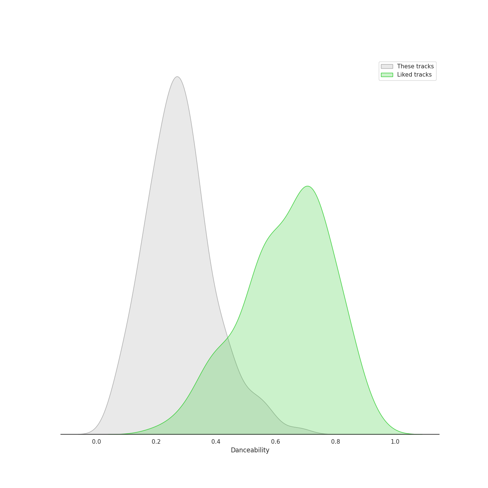
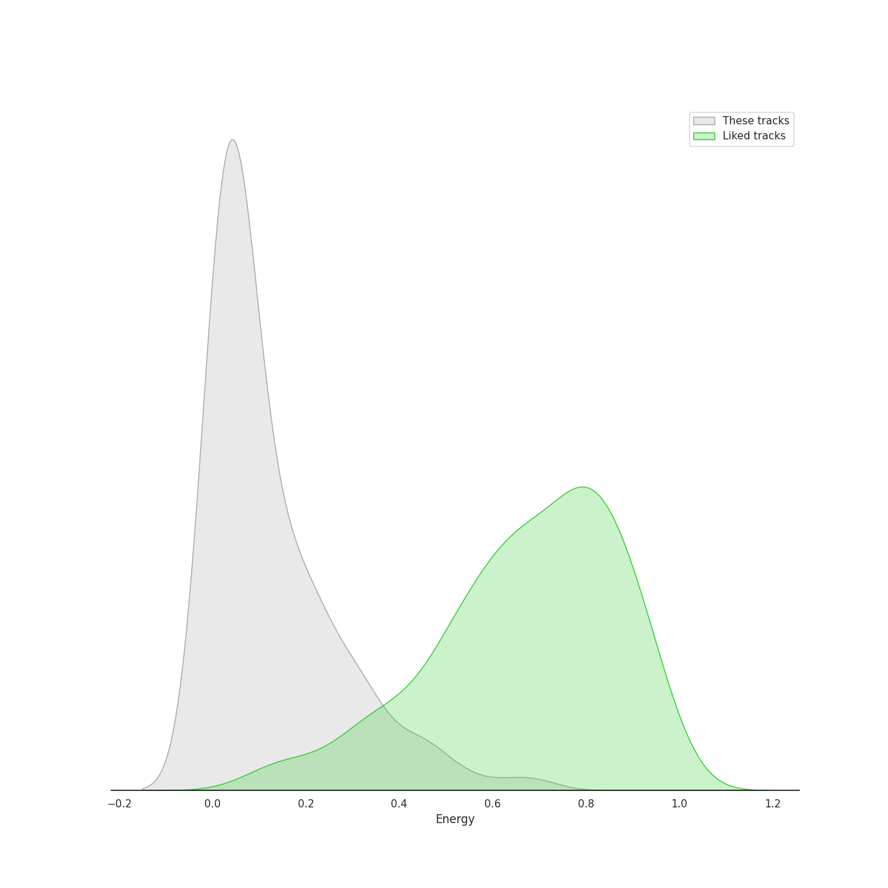
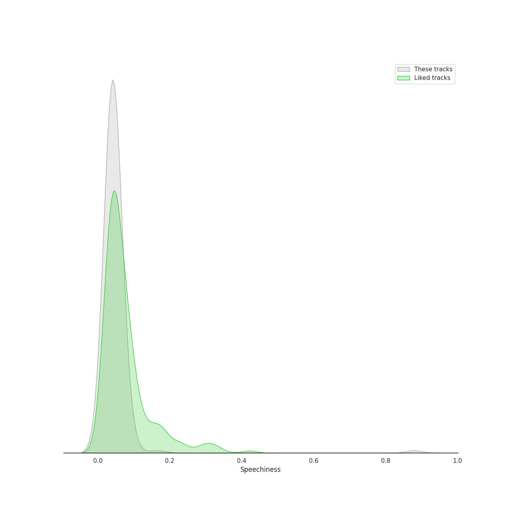
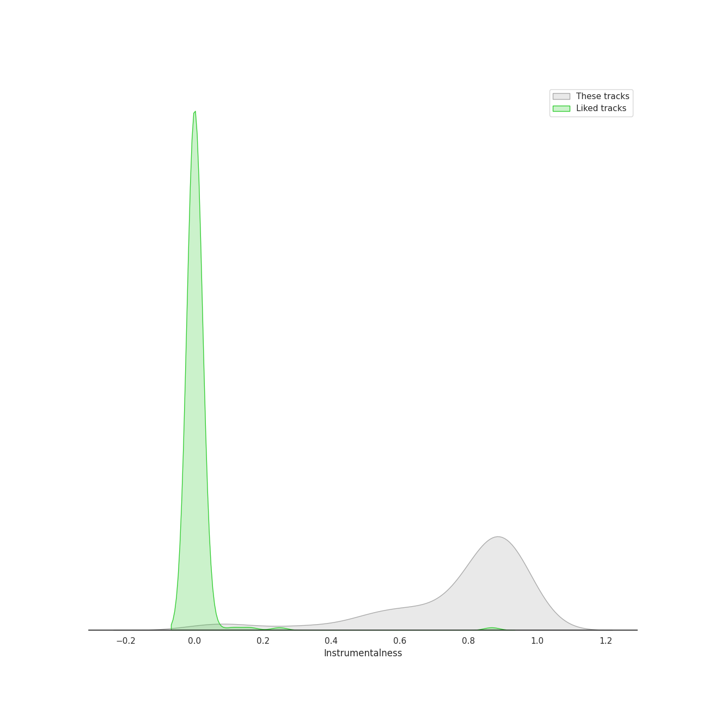
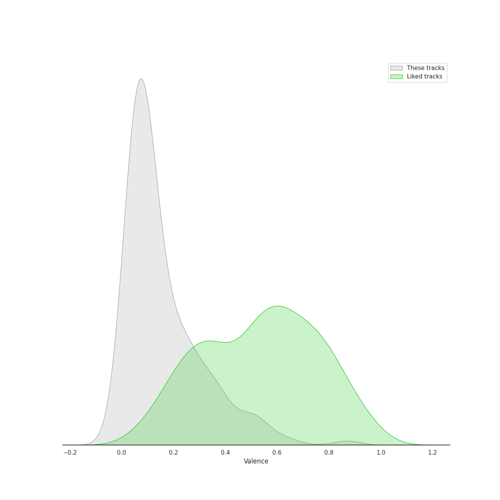
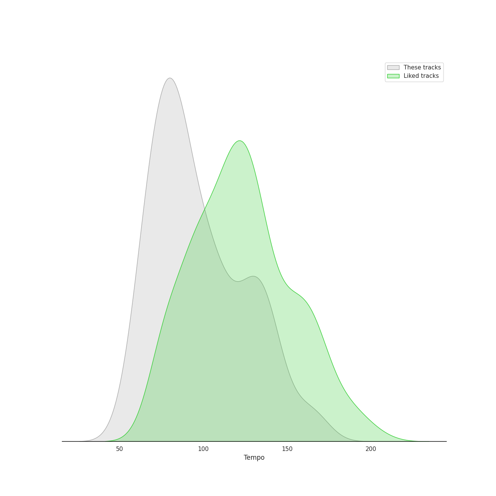

# Audio Features for Deutsche Grammophon (DG)

## Danceability

| 10 most Danceable tracks | 10 least Danceable tracks |
|:---|:---|
| 24 Préludes, Op. 28: No. 20 in C Minor: Largo (0.677) | The Planets, Op. 32: 7. Neptune, the Mystic (0.0601) |
| Le Sacre du Printemps - Revised version for Orchestra (published 1947) / Part 2: The Sacrifice: Sacrificial Dance (The Chosen One) (0.59) | Symphony No. 9 In D Minor, Op. 125 - "Choral": 3. Adagio molto e cantabile (0.062) |
| Pictures at an Exhibition (Orch. Ravel): V. Ballet of the Unhatched Chicks (0.571) | The Firebird (L'oiseau De Feu) - Suite (1919): Round Dance Of The Princesses (0.0797) |
| 24 Préludes, Op. 28: No. 7 in A Major (0.547) | Pictures at an Exhibition (Orch. Ravel): II. The Old Castle (0.0799) |
| Pictures at an Exhibition (Orch. Ravel): Promenade III (0.543) | The Firebird (L'oiseau De Feu) - Suite (1919): Introduction (0.083) |
| Le Sacre du Printemps - Revised version for Orchestra (published 1947) / Part 2: The Sacrifice: Evocation of the Ancestors (0.539) | The Planets, Op. 32: 2. Venus, the Bringer of Peace (0.0864) |
| Le Sacre du Printemps - Revised version for Orchestra (published 1947) / Part 1: The Adoration of the Earth: The Augurs of Spring: Dances of the Young Girls (0.508) | Symphony No. 3 In E Flat, Op. 55 -"Eroica": 2. Marcia funebre (Adagio assai) (0.0871) |
| Le Sacre du Printemps - Revised version for Orchestra (published 1947) / Part 2: The Sacrifice: Glorification of the Chosen One (0.507) | Symphony No. 6 In F, Op. 68 -"Pastoral": 2. Szene am Bach: (Andante molto mosso) (0.103) |
| Pictures at an Exhibition (Orch. Ravel): VII. The Market at Limoges (0.48) | Le Sacre du Printemps - Revised version for Orchestra (published 1947) / Part 2: The Sacrifice: Mystic Circles of the Young Girls (0.108) |
| The Firebird (L'oiseau De Feu) - Suite (1919): 3. Variation Of The Firebird (0.458) | Concerto for Orchestra, Sz. 116: 3. Elegia (Andante, non troppo) (0.112) |

## Energy

| 10 most Energetic tracks | 10 least Energetic tracks |
|:---|:---|
| Le Sacre du Printemps - Revised version for Orchestra (published 1947) / Part 1: The Adoration of the Earth: Procession of the Sage (0.7) | Le Sacre du Printemps - Revised version for Orchestra (published 1947) / Part 1: The Adoration of the Earth: The Sage (0.000239) |
| 24 Préludes, Op. 28: No. 22 in G Minor (0.641) | Pictures at an Exhibition (Orch. Ravel): VIIIa. Catacombae (Sepulchrum Romanum) (0.000845) |
| Le Sacre du Printemps - Revised version for Orchestra (published 1947) / Part 1: The Adoration of the Earth: Ritual of Abduction (0.555) | The Firebird (L'oiseau De Feu) - Suite (1919): Introduction (0.00108) |
| Le Sacre du Printemps - Revised version for Orchestra (published 1947) / Part 1: The Adoration of the Earth: Dance of the Earth (0.509) | 24 Préludes, Op. 28: No. 7 in A Major (0.00168) |
| The Planets, Op. 32: 1. Mars, the Bringer of War (0.478) | 24 Préludes, Op. 28: No. 2 in A Minor (0.00189) |
| Le Sacre du Printemps - Revised version for Orchestra (published 1947) / Part 2: The Sacrifice: Sacrificial Dance (The Chosen One) (0.46) | Pictures at an Exhibition (Orch. Ravel): Promenade II (0.00371) |
| Le Sacre du Printemps - Revised version for Orchestra (published 1947) / Part 2: The Sacrifice: Glorification of the Chosen One (0.447) | The Firebird (L'oiseau De Feu) - Suite (1919): Berceuse (0.00403) |
| 24 Préludes, Op. 28: No. 14 in E-Flat Minor (0.44) | Piano Sonata No. 2 in B-Flat Minor, Op. 35: III. Marche funèbre (0.00428) |
| Le Sacre du Printemps - Revised version for Orchestra (published 1947) / Part 1: The Adoration of the Earth: Ritual of the Rival Tribes (0.435) | 24 Préludes, Op. 28: No. 6 in B Minor: Lento assai (0.00464) |
| 24 Préludes, Op. 28: No. 24 in D Minor: Allegro appassionato (0.399) | 24 Préludes, Op. 28: No. 4 in E Minor (0.00572) |

## Speechiness

| 10 most Speechy tracks | 10 least Speechy tracks |
|:---|:---|
| 24 Préludes, Op. 28: No. 20 in C Minor: Largo (0.879) | Le Sacre du Printemps - Revised version for Orchestra (published 1947) / Part 1: The Adoration of the Earth: Dance of the Earth (0.0292) |
| The Firebird (L'oiseau De Feu) - Suite (1919): Dance Of The Firebird (0.167) | Le Sacre du Printemps - Revised version for Orchestra (published 1947) / Part 1: The Adoration of the Earth: The Augurs of Spring: Dances of the Young Girls (0.0293) |
| Le Sacre du Printemps - Revised version for Orchestra (published 1947) / Part 2: The Sacrifice: Glorification of the Chosen One (0.0935) | 24 Préludes, Op. 28: No. 24 in D Minor: Allegro appassionato (0.0298) |
| 24 Préludes, Op. 28: No. 7 in A Major (0.0802) | 24 Préludes, Op. 28: No. 12. in G-Sharp Minor (0.03) |
| Symphony No. 1 In C, Op. 21: 3. Menuetto (Allegro molto e vivace) (0.0779) | 24 Préludes, Op. 28: No. 3 in G Major: Vivace (0.0303) |
| Le Sacre du Printemps - Revised version for Orchestra (published 1947) / Part 2: The Sacrifice: Sacrificial Dance (The Chosen One) (0.0741) | Pictures at an Exhibition (Orch. Ravel): IV. Bydlo (0.0311) |
| Symphony No. 9 In D Minor, Op. 125 - "Choral" / 4.: "O Freunde nicht diese Töne" - (0.0736) | 24 Préludes, Op. 28: No. 8 in F-Sharp Minor (0.0314) |
| The Firebird (L'oiseau De Feu) - Suite (1919): Infernal Dance Of King Kaschei (0.0689) | Le Sacre du Printemps - Revised version for Orchestra (published 1947) / Part 2: The Sacrifice: Ritual Action of the Ancestors (0.0319) |
| Symphony No. 3 In E Flat, Op. 55 -"Eroica": 3. Scherzo (Allegro vivace) (0.0634) | 24 Préludes, Op. 28: No. 22 in G Minor (0.0324) |
| The Planets, Op. 32: 6. Uranus, the Magician (0.0633) | Symphony No. 8 in F Major, Op. 93: III. Tempo di menuetto (0.0332) |

## Acousticness

| 10 most Acoustic tracks | 10 least Acoustic tracks |
|:---|:---|
| Nocturne No. 11 In G Minor, Op. 37 No. 1 (0.996) | Le Sacre du Printemps - Revised version for Orchestra (published 1947) / Part 1: The Adoration of the Earth: The Sage (0.591) |
| Nocturne No. 12 In G, Op. 37 No. 2 (0.996) | Le Sacre du Printemps - Revised version for Orchestra (published 1947) / Part 1: The Adoration of the Earth: Procession of the Sage (0.612) |
| 24 Préludes, Op. 28: No. 13 in F-Sharp Major (0.995) | Le Sacre du Printemps - Revised version for Orchestra (published 1947) / Part 1: The Adoration of the Earth: Dance of the Earth (0.712) |
| Nocturne No. 9 In B, Op. 32 No. 1 (0.995) | The Firebird (L'oiseau De Feu) - Suite (1919): Finale (0.73) |
| Nocturne No. 6 In G Minor, Op. 15 No. 3 (0.995) | Symphony No. 6 In F, Op. 68 -"Pastoral": 4. Gewitter, Sturm (Allegro) (0.792) |
| Piano Sonata No. 2 in B-Flat Minor, Op. 35: IV. Finale (0.995) | Le Sacre du Printemps - Revised version for Orchestra (published 1947) / Part 2: The Sacrifice: Sacrificial Dance (The Chosen One) (0.802) |
| Nocturne No. 10 In A Flat, Op. 32 No. 2 (0.995) | The Planets, Op. 32: 1. Mars, the Bringer of War (0.83) |
| 24 Préludes, Op. 28: No. 6 in B Minor: Lento assai (0.995) | Symphony No. 7 In A, Op. 92: 4. Allegro con brio (0.847) |
| 24 Préludes, Op. 28: No. 4 in E Minor (0.995) | Le Sacre du Printemps - Revised version for Orchestra (published 1947) / Part 2: The Sacrifice: Introduction (0.861) |
| Pictures at an Exhibition (Orch. Ravel): Promenade II (0.994) | The Firebird (L'oiseau De Feu) - Suite (1919): Berceuse (0.868) |

## Instrumentalness

| 10 most Instrumental tracks | 10 least Instrumental tracks |
|:---|:---|
| Pictures at an Exhibition (Orch. Ravel): IV. Bydlo (0.983) | Le Sacre du Printemps - Revised version for Orchestra (published 1947) / Part 1: The Adoration of the Earth: The Sage (0.000308) |
| Le Sacre du Printemps - Revised version for Orchestra (published 1947) / Part 1: The Adoration of the Earth: Introduction (0.972) | The Firebird (L'oiseau De Feu) - Suite (1919): 3. Variation Of The Firebird (0.054) |
| 24 Préludes, Op. 28: No. 10 in C-Sharp Minor (0.964) | Pictures at an Exhibition (Orch. Ravel): VIIIa. Catacombae (Sepulchrum Romanum) (0.0557) |
| Pictures at an Exhibition (Orch. Ravel): Promenade I (0.962) | Le Sacre du Printemps - Revised version for Orchestra (published 1947) / Part 2: The Sacrifice: Introduction (0.0623) |
| Nocturne No. 8 In D Flat, Op. 27 No. 2 - 2005 Recording (0.959) | Symphony No. 9 In D Minor, Op. 125 - "Choral" / 4.: "O Freunde nicht diese Töne" - (0.0625) |
| 24 Préludes, Op. 28: No. 11 in B Major (0.956) | Symphony No. 6 In F, Op. 68 -"Pastoral": 3. Lustiges Zusammensein der Landleute (Allegro) (0.132) |
| Nocturne No. 2 In E Flat, Op. 9 No. 2 (0.953) | Symphony No. 8 in F Major, Op. 93: II. Allegretto scherzando (0.138) |
| The Firebird (L'oiseau De Feu) - Suite (1919): Dance Of The Firebird (0.951) | Symphony No. 3 In E Flat, Op. 55 -"Eroica": 3. Scherzo (Allegro vivace) (0.181) |
| Pictures at an Exhibition (Orch. Ravel): VIIIb. Cum mortuis in lingua mortua (0.95) | String Quartet No. 1 In C Minor, Op. 51 No. 1: 4. Allegro - 2007 Recording (0.267) |
| 24 Préludes, Op. 28: No. 3 in G Major: Vivace (0.949) | Symphony No. 1 In C, Op. 21: 2. Andante cantabile con moto (0.317) |

## Liveness

| 10 most Live tracks | 10 least Live tracks |
|:---|:---|
| Pictures at an Exhibition (Orch. Ravel): VIIIb. Cum mortuis in lingua mortua (0.767) | String Quartet No. 2 In A Minor, Op. 51 No. 2: 4. Finale (Allegro non assai - Più vivace) (0.0439) |
| The Firebird (L'oiseau De Feu) - Suite (1919): 3. Variation Of The Firebird (0.743) | Ballade No. 2 in F Major, Op. 38 (0.0494) |
| Pictures at an Exhibition (Orch. Ravel): IX. The Hut on Chicken's Legs (0.689) | Symphony No. 1 In C, Op. 21: 3. Menuetto (Allegro molto e vivace) (0.0554) |
| Le Sacre du Printemps - Revised version for Orchestra (published 1947) / Part 1: The Adoration of the Earth: The Augurs of Spring: Dances of the Young Girls (0.669) | Piano Quintet in F minor, Op. 34: 4. Finale (poco sostenuto - Allegro non troppo) (0.0572) |
| Pictures at an Exhibition (Orch. Ravel): VII. The Market at Limoges (0.65) | The Planets, Op. 32: 7. Neptune, the Mystic (0.0614) |
| Pictures at an Exhibition (Orch. Ravel): I. Gnomus (0.648) | Nocturne No. 15 In F Minor, Op. 55 No. 1 (0.0616) |
| Night on Bald Mountain (0.628) | Nocturne No. 11 In G Minor, Op. 37 No. 1 (0.0617) |
| Symphony No. 5 In C Minor, Op. 67: 3. Allegro (0.614) | 24 Préludes, Op. 28: No. 4 in E Minor (0.0619) |
| Symphony No. 9 In D Minor, Op. 125 - "Choral" - Excerpt From 4th Movement: 4. Presto (0.535) | 24 Préludes, Op. 28: No. 7 in A Major (0.062) |
| Pictures at an Exhibition (Orch. Ravel): VI. Samuel Goldenberg und Schmuÿle (0.386) | Pictures at an Exhibition (Orch. Ravel): Promenade IV (0.0644) |

## Valence

| 10 most Happy tracks | 10 least Happy tracks |
|:---|:---|
| Pictures at an Exhibition (Orch. Ravel): V. Ballet of the Unhatched Chicks (0.869) | Le Sacre du Printemps - Revised version for Orchestra (published 1947) / Part 1: The Adoration of the Earth: The Sage (0.0) |
| 24 Préludes, Op. 28: No. 22 in G Minor (0.645) | The Firebird (L'oiseau De Feu) - Suite (1919): Dance Of The Firebird (0.0) |
| Le Sacre du Printemps - Revised version for Orchestra (published 1947) / Part 1: The Adoration of the Earth: The Augurs of Spring: Dances of the Young Girls (0.587) | The Planets, Op. 32: 2. Venus, the Bringer of Peace (0.0301) |
| Pictures at an Exhibition (Orch. Ravel): VII. The Market at Limoges (0.536) | The Planets, Op. 32: 7. Neptune, the Mystic (0.0305) |
| 24 Préludes, Op. 28: No. 12. in G-Sharp Minor (0.524) | Concerto for Orchestra, Sz. 116: 3. Elegia (Andante, non troppo) (0.0312) |
| Symphony No. 2 In D, Op. 36: 3. Scherzo (Allegro) (0.522) | The Planets, Op. 32: 5. Saturn, the Bringer of Old Age (0.0316) |
| 24 Préludes, Op. 28: No. 10 in C-Sharp Minor (0.506) | 24 Préludes, Op. 28: No. 9 in E Major (0.0329) |
| 24 Préludes, Op. 28: No. 16 in B-Flat Minor (0.495) | Pictures at an Exhibition (Orch. Ravel): II. The Old Castle (0.0345) |
| Symphony No. 8 in F Major, Op. 93: II. Allegretto scherzando (0.484) | Symphony No. 3 In E Flat, Op. 55 -"Eroica": 2. Marcia funebre (Adagio assai) (0.0366) |
| Le Sacre du Printemps - Revised version for Orchestra (published 1947) / Part 1: The Adoration of the Earth: Ritual of Abduction (0.453) | Ballade No. 4 in F Minor, Op. 52 (0.037) |

## Tempo

| 10 most Fast tracks | 10 least Fast tracks |
|:---|:---|
| Nocturne No. 13 In C Minor, Op. 48 No. 1 (169.266) | Nocturne No. 8 In D Flat, Op. 27 No. 2 - 2005 Recording (55.543) |
| Pictures at an Exhibition (Orch. Ravel): IX. The Hut on Chicken's Legs (165.944) | Piano Sonata No. 2 in B-Flat Minor, Op. 35: III. Marche funèbre (56.814) |
| Symphony No. 8 in F Major, Op. 93: II. Allegretto scherzando (164.384) | The Planets, Op. 32: 7. Neptune, the Mystic (57.624) |
| Symphony No. 3 In E Flat, Op. 55 -"Eroica": 3. Scherzo (Allegro vivace) (163.062) | Symphony No. 7 In A, Op. 92: 3. Presto - Assai meno presto (59.821) |
| The Firebird (L'oiseau De Feu) - Suite (1919): Infernal Dance Of King Kaschei (162.033) | Pictures at an Exhibition (Orch. Ravel): I. Gnomus (60.214) |
| Symphony No. 3 In E Flat, Op. 55 -"Eroica": 1. Allegro con brio (149.615) | Music To Goethe's Tragedy "Egmont" Op. 84: Ouverture - Sostenuto, ma non troppo - Allegro (62.227) |
| The Planets, Op. 32: 1. Mars, the Bringer of War (148.689) | Symphony No. 3 In E Flat, Op. 55 -"Eroica": 2. Marcia funebre (Adagio assai) (62.976) |
| Symphony No. 1 In C, Op. 21: 4. Finale (Adagio - Allegro molto e vivace) (148.485) | Piano Sonata No. 2 in B-Flat Minor, Op. 35: IV. Finale (63.671) |
| Symphony No. 6 In F, Op. 68 -"Pastoral": 3. Lustiges Zusammensein der Landleute (Allegro) (141.916) | Symphony No. 4 In B Flat, Op. 60: 2. Adagio (63.776) |
| Symphony No. 2 In D, Op. 36: 4. Allegro molto (141.272) | Le Sacre du Printemps - Revised version for Orchestra (published 1947) / Part 1: The Adoration of the Earth: Spring Rounds (64.022) |
