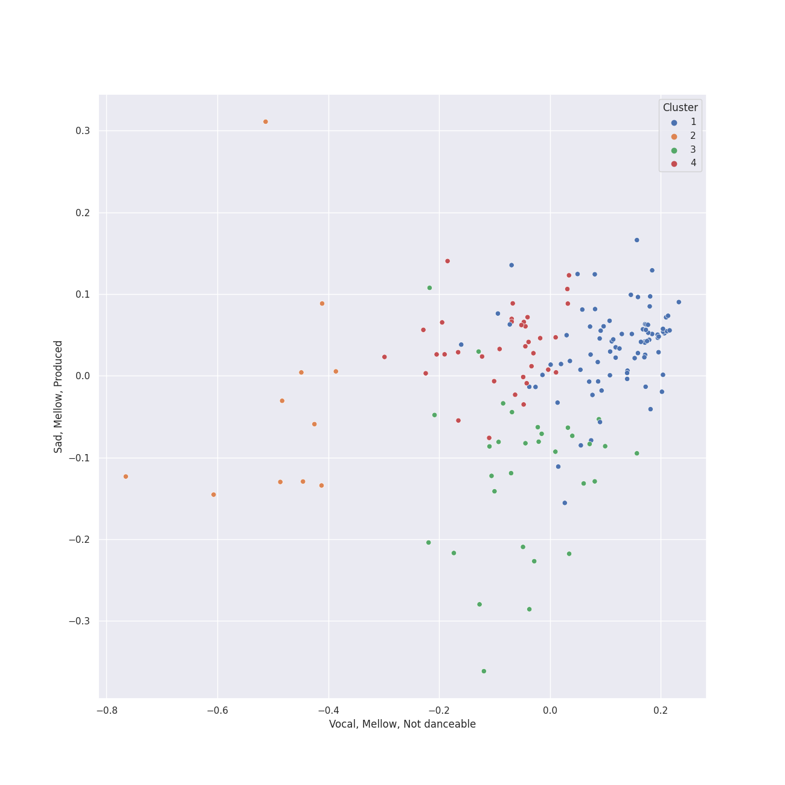

# Clusters in Deutsche Grammophon (DG)

## Cluster #1

84 tracks

| Art | Track | Album | Artists | Label | 💚 | 🔗 |
|:---|:---|:---|:---|:---|:---|:---|
|  | Concerto for Orchestra, Sz. 116: 5. Finale (Pesante - Presto) | Stravinsky: The Rite of Spring / Bartók: Concerto for Orchestra | Béla Bartók, [Berliner Philharmoniker](../../../../artists/berliner_philharmoniker/overview.md), [Herbert von Karajan](../../../../artists/herbert_von_karajan/overview.md) | [Deutsche Grammophon (DG)](../..) | | [🔗](https://open.spotify.com/track/6pTDV5wsqZaCNlgnWLhfoF) |
|  | Ballade No. 1 in G Minor, Op. 23 | Chopin: Ballades; Barcarolle; Fantaisie | [Frédéric Chopin](../../../../artists/fr_d_ric_chopin/overview.md), Krystian Zimerman | [Deutsche Grammophon (DG)](../..) | | [🔗](https://open.spotify.com/track/5Ks5ENUFNQDfaqxjZnCkVJ) |
|  | 24 Préludes, Op. 28: No. 17 in A-Flat Major: Allegretto | Chopin: Preludes; Sonata No.2 | [Frédéric Chopin](../../../../artists/fr_d_ric_chopin/overview.md), Martha Argerich | [Deutsche Grammophon (DG)](../..) | | [🔗](https://open.spotify.com/track/2vRgcveY6WFFyyKdjRmJRO) |
|  | 24 Préludes, Op. 28: No. 21 in B-Flat Major | Chopin: Preludes; Sonata No.2 | [Frédéric Chopin](../../../../artists/fr_d_ric_chopin/overview.md), Martha Argerich | [Deutsche Grammophon (DG)](../..) | | [🔗](https://open.spotify.com/track/7IOQW4DHliCO1l7xG9dL80) |
|  | Piano Sonata No. 2 in B-Flat Minor, Op. 35: II. Scherzo - Più lento - Tempo I | Chopin: Preludes; Sonata No.2 | [Frédéric Chopin](../../../../artists/fr_d_ric_chopin/overview.md), Martha Argerich | [Deutsche Grammophon (DG)](../..) | | [🔗](https://open.spotify.com/track/71gcI9CPfuKg5MCKqw06Zi) |
|  | Nocturne No. 16 In E Flat, Op. 55 No. 2 | Chopin: Nocturnes | [Frédéric Chopin](../../../../artists/fr_d_ric_chopin/overview.md), Maurizio Pollini | [Deutsche Grammophon (DG)](../..) | | [🔗](https://open.spotify.com/track/7r9DH7AvvijvMXFMGMsdqK) |
|  | Nocturne No. 18 In E, Op. 62 No. 2 | Chopin: Nocturnes | [Frédéric Chopin](../../../../artists/fr_d_ric_chopin/overview.md), Maurizio Pollini | [Deutsche Grammophon (DG)](../..) | | [🔗](https://open.spotify.com/track/4PKNFBtURS8wuOyJoA5I1S) |
|  | Nocturne No. 5 In F Sharp, Op. 15 No. 2 | Chopin: Nocturnes | [Frédéric Chopin](../../../../artists/fr_d_ric_chopin/overview.md), Maurizio Pollini | [Deutsche Grammophon (DG)](../..) | | [🔗](https://open.spotify.com/track/2hRx649mlo5boO1jfDe03O) |
|  | The Planets, Op. 32: 3. Mercury, the Winged Messenger | Holst: The Planets | Gustav Holst, [Berliner Philharmoniker](../../../../artists/berliner_philharmoniker/overview.md), [Herbert von Karajan](../../../../artists/herbert_von_karajan/overview.md) | [Deutsche Grammophon (DG)](../..) | | [🔗](https://open.spotify.com/track/4rehJ6QJSNLQCK3Rav7pAe) |
|  | Symphony No. 6 In F, Op. 68 -"Pastoral": 5. Hirtengesang. Frohe und dankbare Gefühle nach dem Sturm: Allegretto | Beethoven: 9 Symphonies; Overtures | [Ludwig van Beethoven](../../../../artists/ludwig_van_beethoven/overview.md), [Berliner Philharmoniker](../../../../artists/berliner_philharmoniker/overview.md), [Herbert von Karajan](../../../../artists/herbert_von_karajan/overview.md) | [Deutsche Grammophon (DG)](../..) | | [🔗](https://open.spotify.com/track/70E993QEzhQSWILEzDliaV) |
## Cluster #2

11 tracks

| Art | Track | Album | Artists | Label | 💚 | 🔗 |
|:---|:---|:---|:---|:---|:---|:---|
|  | Le Sacre du Printemps - Revised version for Orchestra (published 1947) / Part 1: The Adoration of the Earth: Procession of the Sage | Stravinsky: The Rite of Spring / Bartók: Concerto for Orchestra | Igor Stravinsky, [Berliner Philharmoniker](../../../../artists/berliner_philharmoniker/overview.md), [Herbert von Karajan](../../../../artists/herbert_von_karajan/overview.md) | [Deutsche Grammophon (DG)](../..) | | [🔗](https://open.spotify.com/track/2QvLnMMENk5ynysBiOlAWj) |
|  | Le Sacre du Printemps - Revised version for Orchestra (published 1947) / Part 1: The Adoration of the Earth: The Sage | Stravinsky: The Rite of Spring / Bartók: Concerto for Orchestra | Igor Stravinsky, [Berliner Philharmoniker](../../../../artists/berliner_philharmoniker/overview.md), [Herbert von Karajan](../../../../artists/herbert_von_karajan/overview.md) | [Deutsche Grammophon (DG)](../..) | | [🔗](https://open.spotify.com/track/4VH5yqdpZBV07hlvvjZm2u) |
|  | Le Sacre du Printemps - Revised version for Orchestra (published 1947) / Part 2: The Sacrifice: Introduction | Stravinsky: The Rite of Spring / Bartók: Concerto for Orchestra | Igor Stravinsky, [Berliner Philharmoniker](../../../../artists/berliner_philharmoniker/overview.md), [Herbert von Karajan](../../../../artists/herbert_von_karajan/overview.md) | [Deutsche Grammophon (DG)](../..) | | [🔗](https://open.spotify.com/track/6GS9MQgfnbFp3yPL2uNAF8) |
|  | String Quartet No. 1 In C Minor, Op. 51 No. 1: 4. Allegro - 2007 Recording | Brahms: String Quartets & Piano Quintet | Johannes Brahms, Emerson String Quartet | [Deutsche Grammophon (DG)](../..) | | [🔗](https://open.spotify.com/track/3w1g36ou0iVyxgddtFZOuY) |
|  | Symphony No. 3 In E Flat, Op. 55 -"Eroica": 3. Scherzo (Allegro vivace) | Beethoven: 9 Symphonies; Overtures | [Ludwig van Beethoven](../../../../artists/ludwig_van_beethoven/overview.md), [Berliner Philharmoniker](../../../../artists/berliner_philharmoniker/overview.md), [Herbert von Karajan](../../../../artists/herbert_von_karajan/overview.md) | [Deutsche Grammophon (DG)](../..) | | [🔗](https://open.spotify.com/track/5b3322i4oAchfQQfcwZcxV) |
|  | Symphony No. 5 In C Minor, Op. 67: 3. Allegro | Beethoven: 9 Symphonies; Overtures | [Ludwig van Beethoven](../../../../artists/ludwig_van_beethoven/overview.md), [Berliner Philharmoniker](../../../../artists/berliner_philharmoniker/overview.md), [Herbert von Karajan](../../../../artists/herbert_von_karajan/overview.md) | [Deutsche Grammophon (DG)](../..) | | [🔗](https://open.spotify.com/track/7b6fj5YM0hfPCCxrfursps) |
|  | Symphony No. 6 In F, Op. 68 -"Pastoral": 3. Lustiges Zusammensein der Landleute (Allegro) | Beethoven: 9 Symphonies; Overtures | [Ludwig van Beethoven](../../../../artists/ludwig_van_beethoven/overview.md), [Berliner Philharmoniker](../../../../artists/berliner_philharmoniker/overview.md), [Herbert von Karajan](../../../../artists/herbert_von_karajan/overview.md) | [Deutsche Grammophon (DG)](../..) | | [🔗](https://open.spotify.com/track/1rClQ3viDyCkJVC2yealEp) |
|  | Symphony No. 8 in F Major, Op. 93: II. Allegretto scherzando | Beethoven: 9 Symphonies; Overtures | [Ludwig van Beethoven](../../../../artists/ludwig_van_beethoven/overview.md), [Berliner Philharmoniker](../../../../artists/berliner_philharmoniker/overview.md), [Herbert von Karajan](../../../../artists/herbert_von_karajan/overview.md) | [Deutsche Grammophon (DG)](../..) | | [🔗](https://open.spotify.com/track/43Hdy71dNjipvXh86dEPFR) |
|  | Symphony No. 9 In D Minor, Op. 125 - "Choral" / 4.: "O Freunde nicht diese Töne" - - Live At Philharmonie, Berlin / 1983 | Beethoven: 9 Symphonies; Overtures | [Ludwig van Beethoven](../../../../artists/ludwig_van_beethoven/overview.md), Janet Perry, Agnes Baltsa, Vinson Cole, José van Dam, [Berliner Philharmoniker](../../../../artists/berliner_philharmoniker/overview.md), [Herbert von Karajan](../../../../artists/herbert_von_karajan/overview.md), Wiener Singverein, Helmut Froschauer | [Deutsche Grammophon (DG)](../..) | | [🔗](https://open.spotify.com/track/3vanPPXeHjJ6QJ1Sgie8g3) |
|  | Pictures at an Exhibition (Orch. Ravel): VIIIa. Catacombae (Sepulchrum Romanum) | Mussorgsky: Pictures At An Exhibition | Modest Mussorgsky, Wiener Philharmoniker, Gustavo Dudamel | [Deutsche Grammophon (DG)](../..) | | [🔗](https://open.spotify.com/track/6kXCQVQ1B0i7SqxF9cFAd7) |
## Cluster #3

31 tracks

| Art | Track | Album | Artists | Label | 💚 | 🔗 |
|:---|:---|:---|:---|:---|:---|:---|
|  | 24 Préludes, Op. 28: No. 16 in B-Flat Minor | Chopin: Preludes; Sonata No.2 | [Frédéric Chopin](../../../../artists/fr_d_ric_chopin/overview.md), Martha Argerich | [Deutsche Grammophon (DG)](../..) | | [🔗](https://open.spotify.com/track/1qgyEAoSHWfXjFu00ttsZn) |
|  | 24 Préludes, Op. 28: No. 18 in F Minor | Chopin: Preludes; Sonata No.2 | [Frédéric Chopin](../../../../artists/fr_d_ric_chopin/overview.md), Martha Argerich | [Deutsche Grammophon (DG)](../..) | | [🔗](https://open.spotify.com/track/3DdmRDwJQhq5fvV0GMk2Zx) |
|  | 24 Préludes, Op. 28: No. 5 in D Major | Chopin: Preludes; Sonata No.2 | [Frédéric Chopin](../../../../artists/fr_d_ric_chopin/overview.md), Martha Argerich | [Deutsche Grammophon (DG)](../..) | | [🔗](https://open.spotify.com/track/43FjZOHoblMG4f7yQkJdC3) |
|  | The Planets, Op. 32: 4. Jupiter, the Bringer of Jollity | Holst: The Planets | Gustav Holst, [Berliner Philharmoniker](../../../../artists/berliner_philharmoniker/overview.md), [Herbert von Karajan](../../../../artists/herbert_von_karajan/overview.md) | [Deutsche Grammophon (DG)](../..) | | [🔗](https://open.spotify.com/track/59Id4KrBWiizuq53doxWtp) |
|  | Le Sacre du Printemps - Revised version for Orchestra (published 1947) / Part 1: The Adoration of the Earth: Ritual of the Rival Tribes | Stravinsky: The Rite of Spring / Bartók: Concerto for Orchestra | Igor Stravinsky, [Berliner Philharmoniker](../../../../artists/berliner_philharmoniker/overview.md), [Herbert von Karajan](../../../../artists/herbert_von_karajan/overview.md) | [Deutsche Grammophon (DG)](../..) | | [🔗](https://open.spotify.com/track/6DmCs7oYITGEnfX7lsOe2O) |
|  | Piano Quintet in F minor, Op. 34: 3. Scherzo (Allegro) | Brahms: String Quartets & Piano Quintet | Johannes Brahms, Emerson String Quartet, Leon Fleisher | [Deutsche Grammophon (DG)](../..) | | [🔗](https://open.spotify.com/track/2MyRikj06G0oWicSQdpEXm) |
|  | Symphony No. 2 In D, Op. 36: 4. Allegro molto | Beethoven: 9 Symphonies; Overtures | [Ludwig van Beethoven](../../../../artists/ludwig_van_beethoven/overview.md), [Berliner Philharmoniker](../../../../artists/berliner_philharmoniker/overview.md), [Herbert von Karajan](../../../../artists/herbert_von_karajan/overview.md) | [Deutsche Grammophon (DG)](../..) | | [🔗](https://open.spotify.com/track/4MH1pSRa3UjoubxDXDU8zc) |
|  | Symphony No. 4 In B Flat, Op. 60: 4. Allegro ma non troppo | Beethoven: 9 Symphonies; Overtures | [Ludwig van Beethoven](../../../../artists/ludwig_van_beethoven/overview.md), [Berliner Philharmoniker](../../../../artists/berliner_philharmoniker/overview.md), [Herbert von Karajan](../../../../artists/herbert_von_karajan/overview.md) | [Deutsche Grammophon (DG)](../..) | | [🔗](https://open.spotify.com/track/62RfH6r3t6Yj90IgiQhHn4) |
|  | Symphony No. 7 In A, Op. 92: 4. Allegro con brio | Beethoven: 9 Symphonies; Overtures | [Ludwig van Beethoven](../../../../artists/ludwig_van_beethoven/overview.md), [Berliner Philharmoniker](../../../../artists/berliner_philharmoniker/overview.md), [Herbert von Karajan](../../../../artists/herbert_von_karajan/overview.md) | [Deutsche Grammophon (DG)](../..) | | [🔗](https://open.spotify.com/track/79QutbaGC0FPOvsXB5Mslb) |
|  | Symphony No. 9 In D Minor, Op. 125 - "Choral": 2. Molto vivace - Live At Philharmonie, Berlin / 1983 | Beethoven: 9 Symphonies; Overtures | [Ludwig van Beethoven](../../../../artists/ludwig_van_beethoven/overview.md), [Berliner Philharmoniker](../../../../artists/berliner_philharmoniker/overview.md), [Herbert von Karajan](../../../../artists/herbert_von_karajan/overview.md) | [Deutsche Grammophon (DG)](../..) | | [🔗](https://open.spotify.com/track/44VQKnAYvxuknvhI0i93Hf) |
## Cluster #4

35 tracks

| Art | Track | Album | Artists | Label | 💚 | 🔗 |
|:---|:---|:---|:---|:---|:---|:---|
|  | Le Sacre du Printemps - Revised version for Orchestra (published 1947) / Part 2: The Sacrifice: Ritual Action of the Ancestors | Stravinsky: The Rite of Spring / Bartók: Concerto for Orchestra | Igor Stravinsky, [Berliner Philharmoniker](../../../../artists/berliner_philharmoniker/overview.md), [Herbert von Karajan](../../../../artists/herbert_von_karajan/overview.md) | [Deutsche Grammophon (DG)](../..) | | [🔗](https://open.spotify.com/track/41g1p1wDLuNnZNDLa13QIR) |
|  | Piano Quintet in F minor, Op. 34: 1. Allegro non troppo | Brahms: String Quartets & Piano Quintet | Johannes Brahms, Emerson String Quartet, Leon Fleisher | [Deutsche Grammophon (DG)](../..) | | [🔗](https://open.spotify.com/track/2x4OmAe9Fx3kHqYxWaQVhB) |
|  | Piano Quintet in F minor, Op. 34: 2. Andante, un poco adagio | Brahms: String Quartets & Piano Quintet | Johannes Brahms, Emerson String Quartet, Leon Fleisher | [Deutsche Grammophon (DG)](../..) | | [🔗](https://open.spotify.com/track/2g3LioD9kfD4mqBmdfeLQE) |
|  | String Quartet No. 2 In A Minor, Op. 51 No. 2: 1. Allegro non troppo | Brahms: String Quartets & Piano Quintet | Johannes Brahms, Emerson String Quartet | [Deutsche Grammophon (DG)](../..) | | [🔗](https://open.spotify.com/track/0dn5JlmuEtBAEQ79fQUiLK) |
|  | String Quartet No. 3 In B Flat, Op. 67: 4. Poco allegretto con variazioni - Doppio movimento | Brahms: String Quartets & Piano Quintet | Johannes Brahms, Emerson String Quartet | [Deutsche Grammophon (DG)](../..) | | [🔗](https://open.spotify.com/track/4ez3iXBRQ8NjZThbTmcxHn) |
|  | Overture "Coriolan", Op. 62 | Beethoven: 9 Symphonies; Overtures | [Ludwig van Beethoven](../../../../artists/ludwig_van_beethoven/overview.md), [Berliner Philharmoniker](../../../../artists/berliner_philharmoniker/overview.md), [Herbert von Karajan](../../../../artists/herbert_von_karajan/overview.md) | [Deutsche Grammophon (DG)](../..) | | [🔗](https://open.spotify.com/track/3JMmtvBklNEhWY9TfhKTw9) |
|  | Overture "Leonore No. 3", Op. 72b | Beethoven: 9 Symphonies; Overtures | [Ludwig van Beethoven](../../../../artists/ludwig_van_beethoven/overview.md), [Berliner Philharmoniker](../../../../artists/berliner_philharmoniker/overview.md), [Herbert von Karajan](../../../../artists/herbert_von_karajan/overview.md) | [Deutsche Grammophon (DG)](../..) | | [🔗](https://open.spotify.com/track/1qP4L90ZORZad6pqdLMyci) |
|  | Symphony No. 4 In B Flat, Op. 60: 2. Adagio | Beethoven: 9 Symphonies; Overtures | [Ludwig van Beethoven](../../../../artists/ludwig_van_beethoven/overview.md), [Berliner Philharmoniker](../../../../artists/berliner_philharmoniker/overview.md), [Herbert von Karajan](../../../../artists/herbert_von_karajan/overview.md) | [Deutsche Grammophon (DG)](../..) | | [🔗](https://open.spotify.com/track/1XDpz7n5qYqT8B3qo0bYN3) |
|  | Symphony No. 6 In F, Op. 68 -"Pastoral": 2. Szene am Bach: (Andante molto mosso) | Beethoven: 9 Symphonies; Overtures | [Ludwig van Beethoven](../../../../artists/ludwig_van_beethoven/overview.md), [Berliner Philharmoniker](../../../../artists/berliner_philharmoniker/overview.md), [Herbert von Karajan](../../../../artists/herbert_von_karajan/overview.md) | [Deutsche Grammophon (DG)](../..) | | [🔗](https://open.spotify.com/track/2P5PmKydDbarUmTWqnyfCy) |
|  | Symphony No. 7 In A, Op. 92: 1. Poco sostenuto - Vivace | Beethoven: 9 Symphonies; Overtures | [Ludwig van Beethoven](../../../../artists/ludwig_van_beethoven/overview.md), [Berliner Philharmoniker](../../../../artists/berliner_philharmoniker/overview.md), [Herbert von Karajan](../../../../artists/herbert_von_karajan/overview.md) | [Deutsche Grammophon (DG)](../..) | | [🔗](https://open.spotify.com/track/5qPk5Rcw6iA9DQCtCkhhz7) |