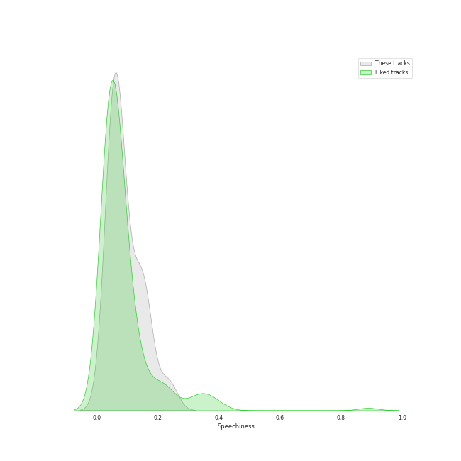
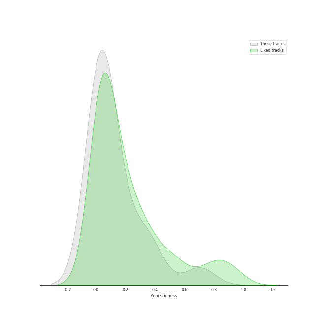
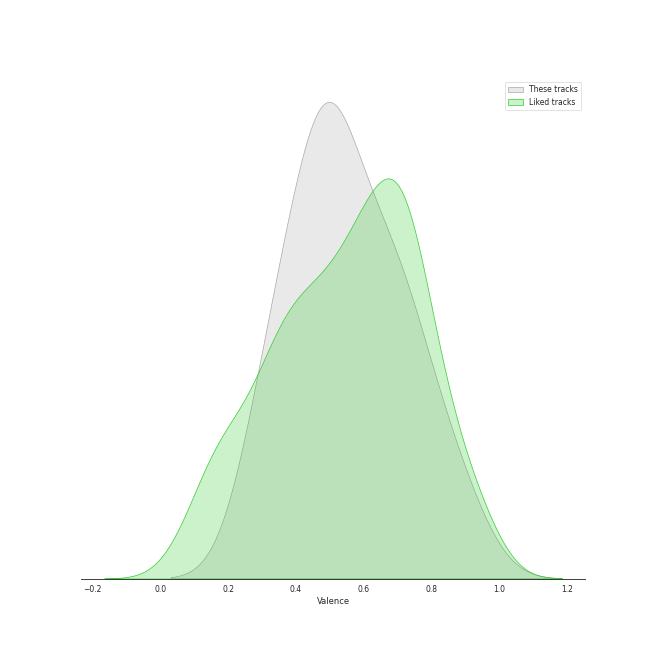

# Track Features for DREAMCATCHER COMPANY

## Danceability

| ​ | 10 most Danceable tracks | ​​ | 10 least Danceable tracks |
|:---|:---|:---|:---|
|  | Locked Inside A Door (0.757) |  | REASON (0.474) |
|  | Black Or White (0.746) |  | PIRI (0.507) |
|  | Scream (0.704) |  | Odd Eye (0.534) |
|  | Red Sun (0.701) |  | Odd Eye (0.537) |
|  | MAISON (0.686) |  | Starlight (0.548) |
|  | Jazz Bar (0.683) |  | BEcause (0.55) |
|  | Jazz Bar (0.669) |  | BEcause (0.551) |
|  | DEMIAN (0.621) |  | VISION (0.582) |
|  | 데자부 (Deja Vu) (0.613) |  | Silent Night (0.594) |
|  | Silent Night (0.594) |  | 데자부 (Deja Vu) (0.613) |

## Energy

| ​ | 10 most Energetic tracks | ​​ | 10 least Energetic tracks |
|:---|:---|:---|:---|
|  | MAISON (0.955) |  | Locked Inside A Door (0.661) |
|  | Scream (0.94) |  | 데자부 (Deja Vu) (0.667) |
|  | BEcause (0.94) |  | Jazz Bar (0.707) |
|  | Odd Eye (0.933) |  | Jazz Bar (0.708) |
|  | BEcause (0.932) |  | Black Or White (0.793) |
|  | Odd Eye (0.932) |  | VISION (0.855) |
|  | Red Sun (0.92) |  | PIRI (0.869) |
|  | DEMIAN (0.918) |  | Silent Night (0.875) |
|  | REASON (0.901) |  | Starlight (0.898) |
|  | Starlight (0.898) |  | REASON (0.901) |

## Speechiness

| ​ | 10 most Speechy tracks | ​​ | 10 least Speechy tracks |
|:---|:---|:---|:---|
|  | REASON (0.254) |  | 데자부 (Deja Vu) (0.0394) |
|  | MAISON (0.159) |  | Starlight (0.0484) |
|  | Scream (0.158) |  | Locked Inside A Door (0.0518) |
|  | Red Sun (0.157) |  | VISION (0.0561) |
|  | Jazz Bar (0.142) |  | Silent Night (0.0584) |
|  | Jazz Bar (0.128) |  | PIRI (0.0594) |
|  | Odd Eye (0.11) |  | DEMIAN (0.0656) |
|  | BEcause (0.0871) |  | Black Or White (0.0794) |
|  | Odd Eye (0.0869) |  | BEcause (0.0855) |
|  | BEcause (0.0855) |  | Odd Eye (0.0869) |

## Acousticness

| ​ | 10 most Acoustic tracks | ​​ | 10 least Acoustic tracks |
|:---|:---|:---|:---|
|  | Jazz Bar (0.704) |  | DEMIAN (0.00122) |
|  | Jazz Bar (0.704) |  | Starlight (0.00244) |
|  | Red Sun (0.351) |  | REASON (0.00513) |
|  | Locked Inside A Door (0.276) |  | BEcause (0.0182) |
|  | PIRI (0.18) |  | BEcause (0.0183) |
|  | MAISON (0.129) |  | VISION (0.0308) |
|  | Black Or White (0.125) |  | Scream (0.0312) |
|  | 데자부 (Deja Vu) (0.0627) |  | Odd Eye (0.0487) |
|  | Silent Night (0.0552) |  | Odd Eye (0.049) |
|  | Odd Eye (0.049) |  | Silent Night (0.0552) |

## Instrumentalness

| ​ | 10 most Instrumental tracks | ​​ | 10 least Instrumental tracks |
|:---|:---|:---|:---|
|  | Silent Night (0.000148) |  | BEcause (0.0) |
|  | 데자부 (Deja Vu) (0.0) |  | Black Or White (0.0) |
|  | PIRI (0.0) |  | Odd Eye (0.0) |
|  | Red Sun (0.0) |  | MAISON (0.0) |
|  | Starlight (0.0) |  | VISION (0.0) |
|  | Jazz Bar (0.0) |  | Odd Eye (0.0) |
|  | Jazz Bar (0.0) |  | REASON (0.0) |
|  | Scream (0.0) |  | DEMIAN (0.0) |
|  | Locked Inside A Door (0.0) |  | BEcause (0.0) |
|  | BEcause (0.0) |  | Locked Inside A Door (0.0) |

## Liveness

| ​ | 10 most Live tracks | ​​ | 10 least Live tracks |
|:---|:---|:---|:---|
|  | PIRI (0.474) |  | Locked Inside A Door (0.0717) |
|  | BEcause (0.344) |  | MAISON (0.0782) |
|  | DEMIAN (0.344) |  | Black Or White (0.0839) |
|  | REASON (0.343) |  | VISION (0.144) |
|  | Jazz Bar (0.335) |  | Red Sun (0.149) |
|  | Jazz Bar (0.335) |  | Silent Night (0.149) |
|  | BEcause (0.316) |  | Starlight (0.165) |
|  | Scream (0.29) |  | 데자부 (Deja Vu) (0.169) |
|  | Odd Eye (0.197) |  | Odd Eye (0.195) |
|  | Odd Eye (0.195) |  | Odd Eye (0.197) |

## Valence

| ​ | 10 most Happy tracks | ​​ | 10 least Happy tracks |
|:---|:---|:---|:---|
|  | Locked Inside A Door (0.815) |  | Scream (0.311) |
|  | Jazz Bar (0.725) |  | Starlight (0.346) |
|  | Jazz Bar (0.72) |  | VISION (0.355) |
|  | Black Or White (0.686) |  | REASON (0.404) |
|  | DEMIAN (0.646) |  | BEcause (0.45) |
|  | Red Sun (0.567) |  | BEcause (0.458) |
|  | Odd Eye (0.556) |  | Silent Night (0.477) |
|  | Odd Eye (0.529) |  | 데자부 (Deja Vu) (0.486) |
|  | PIRI (0.507) |  | MAISON (0.496) |
|  | MAISON (0.496) |  | PIRI (0.507) |

## Tempo

| ​ | 10 most Fast tracks | ​​ | 10 least Fast tracks |
|:---|:---|:---|:---|
|  | REASON (176.083) |  | Red Sun (79.454) |
|  | PIRI (170.043) |  | 데자부 (Deja Vu) (89.946) |
|  | BEcause (170.018) |  | Jazz Bar (93.767) |
|  | BEcause (170.012) |  | Jazz Bar (93.936) |
|  | Odd Eye (160.061) |  | VISION (94.958) |
|  | Odd Eye (160.058) |  | Locked Inside A Door (97.968) |
|  | Silent Night (160.008) |  | Black Or White (99.983) |
|  | Starlight (149.97) |  | DEMIAN (110.116) |
|  | Scream (137.909) |  | MAISON (120.007) |
|  | MAISON (120.007) |  | Scream (137.909) |
