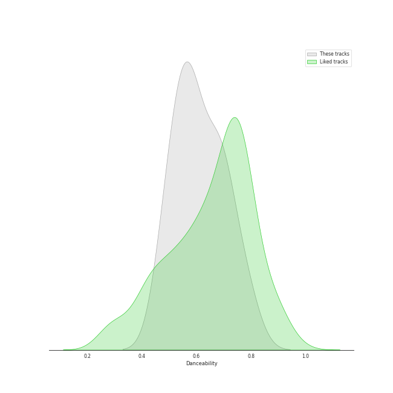

# Track Features for DREAMCATCHER COMPANY

## Danceability

| ​ | 10 most Danceable tracks | ​​ | 10 least Danceable tracks |
|:---|:---|:---|:---|
|  | JOKER (0.791) |  | REASON (0.481) |
|  | Locked Inside A Door (0.757) |  | Deja Vu (0.482) |
|  | Scream (0.703) |  | PIRI (0.506) |
|  | Red Sun (0.7) |  | Odd Eye (0.537) |
|  | MAISON (0.686) |  | The curse of the Spider (0.546) |
|  | BOCA (0.684) |  | Starlight (0.548) |
|  | Jazz Bar (0.669) |  | BEcause (0.551) |
|  | DEMIAN (0.621) |  | Chase Me (0.572) |
|  | 2 Rings (0.609) |  | VISION (0.582) |
|  | Silent Night (0.598) |  | Silent Night (0.598) |

## Energy

| ​ | 10 most Energetic tracks | ​​ | 10 least Energetic tracks |
|:---|:---|:---|:---|
|  | Chase Me (0.975) |  | Locked Inside A Door (0.661) |
|  | MAISON (0.955) |  | Deja Vu (0.675) |
|  | BOCA (0.948) |  | Jazz Bar (0.708) |
|  | Scream (0.94) |  | 2 Rings (0.713) |
|  | BEcause (0.94) |  | VISION (0.852) |
|  | Odd Eye (0.932) |  | Silent Night (0.867) |
|  | DEMIAN (0.918) |  | PIRI (0.869) |
|  | Red Sun (0.918) |  | The curse of the Spider (0.878) |
|  | REASON (0.901) |  | JOKER (0.889) |
|  | Starlight (0.898) |  | Starlight (0.898) |

## Speechiness

| ​ | 10 most Speechy tracks | ​​ | 10 least Speechy tracks |
|:---|:---|:---|:---|
|  | REASON (0.234) |  | 2 Rings (0.0341) |
|  | Scream (0.161) |  | Starlight (0.0484) |
|  | MAISON (0.159) |  | Locked Inside A Door (0.0518) |
|  | Red Sun (0.152) |  | JOKER (0.0552) |
|  | Jazz Bar (0.142) |  | VISION (0.0553) |
|  | The curse of the Spider (0.12) |  | Silent Night (0.0568) |
|  | BEcause (0.0871) |  | BOCA (0.0576) |
|  | Odd Eye (0.0869) |  | PIRI (0.0597) |
|  | Chase Me (0.0848) |  | Deja Vu (0.0653) |
|  | DEMIAN (0.0656) |  | DEMIAN (0.0656) |

## Acousticness

| ​ | 10 most Acoustic tracks | ​​ | 10 least Acoustic tracks |
|:---|:---|:---|:---|
|  | Jazz Bar (0.704) |  | DEMIAN (0.00122) |
|  | JOKER (0.386) |  | Starlight (0.00244) |
|  | Red Sun (0.344) |  | REASON (0.00494) |
|  | Locked Inside A Door (0.276) |  | BOCA (0.00676) |
|  | PIRI (0.194) |  | Chase Me (0.00776) |
|  | MAISON (0.129) |  | BEcause (0.0182) |
|  | 2 Rings (0.0761) |  | Scream (0.0311) |
|  | The curse of the Spider (0.0735) |  | VISION (0.0332) |
|  | Deja Vu (0.0631) |  | Odd Eye (0.0487) |
|  | Silent Night (0.0497) |  | Silent Night (0.0497) |

## Instrumentalness

| ​ | 10 most Instrumental tracks | ​​ | 10 least Instrumental tracks |
|:---|:---|:---|:---|
|  | Silent Night (0.000238) |  | Chase Me (0.0) |
|  | BOCA (4.7e-05) |  | Red Sun (0.0) |
|  | Scream (0.0) |  | BEcause (0.0) |
|  | Locked Inside A Door (0.0) |  | Odd Eye (0.0) |
|  | Jazz Bar (0.0) |  | MAISON (0.0) |
|  | Starlight (0.0) |  | The curse of the Spider (0.0) |
|  | JOKER (0.0) |  | 2 Rings (0.0) |
|  | Deja Vu (0.0) |  | DEMIAN (0.0) |
|  | PIRI (0.0) |  | REASON (0.0) |
|  | VISION (0.0) |  | VISION (0.0) |

## Liveness

| ​ | 10 most Live tracks | ​​ | 10 least Live tracks |
|:---|:---|:---|:---|
|  | PIRI (0.572) |  | JOKER (0.065) |
|  | 2 Rings (0.498) |  | Locked Inside A Door (0.0717) |
|  | The curse of the Spider (0.379) |  | MAISON (0.0782) |
|  | REASON (0.346) |  | BOCA (0.125) |
|  | DEMIAN (0.344) |  | Chase Me (0.142) |
|  | Jazz Bar (0.335) |  | VISION (0.145) |
|  | Scream (0.331) |  | Red Sun (0.152) |
|  | BEcause (0.316) |  | Silent Night (0.155) |
|  | Odd Eye (0.197) |  | Starlight (0.165) |
|  | Deja Vu (0.177) |  | Deja Vu (0.177) |

## Valence

| ​ | 10 most Happy tracks | ​​ | 10 least Happy tracks |
|:---|:---|:---|:---|
|  | JOKER (0.894) |  | Scream (0.308) |
|  | Locked Inside A Door (0.815) |  | VISION (0.31) |
|  | 2 Rings (0.735) |  | Starlight (0.346) |
|  | Jazz Bar (0.725) |  | Silent Night (0.424) |
|  | The curse of the Spider (0.694) |  | REASON (0.427) |
|  | DEMIAN (0.646) |  | BEcause (0.458) |
|  | BOCA (0.643) |  | Chase Me (0.481) |
|  | Red Sun (0.562) |  | PIRI (0.492) |
|  | Odd Eye (0.556) |  | MAISON (0.496) |
|  | Deja Vu (0.532) |  | Deja Vu (0.532) |

## Tempo

| ​ | 10 most Fast tracks | ​​ | 10 least Fast tracks |
|:---|:---|:---|:---|
|  | The curse of the Spider (195.277) |  | Red Sun (79.441) |
|  | Deja Vu (179.69) |  | 2 Rings (81.049) |
|  | REASON (176.061) |  | Jazz Bar (93.767) |
|  | PIRI (170.034) |  | VISION (94.968) |
|  | BEcause (170.018) |  | Locked Inside A Door (97.968) |
|  | Odd Eye (160.058) |  | BOCA (99.981) |
|  | Silent Night (160.031) |  | Chase Me (100.021) |
|  | Starlight (149.97) |  | DEMIAN (110.116) |
|  | Scream (137.901) |  | MAISON (120.007) |
|  | JOKER (125.999) |  | JOKER (125.999) |
