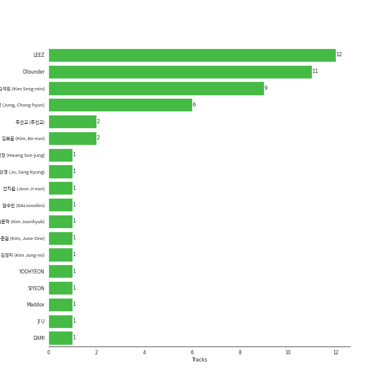

# DREAMCATCHER COMPANY

18 songs

[See Track Features](audio_features.md)

[See Clusters](clusters/overview.md)

Appears as:
- DREAMCATCHER COMPANY (13 tracks)
- Dreamcatcher Company (5 tracks)

## Top Artists

| Art | Tracks | 💚 | Artist | 🔗 |
|:---|---:|---:|:---|:---|
|  | 18 | 11 | [Dreamcatcher](../../artists/dreamcatcher/overview.md) | [🔗](https://open.spotify.com/artist/5V1qsQHdXNm4ZEZHWvFnqQ) |

## Top Albums

| Art | Tracks | 💚 | Album | Release Date | 🔗 |
|:---|---:|---:|:---|:---|:---|
|  | 4 | 4 | 1st Album [Dystopia : The Tree of Language] | 2020-02-18 | [🔗](https://open.spotify.com/album/7no7EZnKgoRWBbGMjZo9gB) |
|  | 3 | 2 | [Apocalypse : Save us] | 2022-04-12 | [🔗](https://open.spotify.com/album/1ONjVRtxAqiTivu0EiEBm5) |
|  | 2 | 2 | Raid of Dream | 2019-09-18 | [🔗](https://open.spotify.com/album/4Y5YucmQPgaCJOkmRshYGs) |
|  | 1 | 1 | ［Dystopia : Road to Utopia］ | 2021-01-26 | [🔗](https://open.spotify.com/album/6ECUAXThxlRHQ1JPUQJQJG) |
|  | 1 | 1 | [Summer Holiday] | 2021-07-30 | [🔗](https://open.spotify.com/album/1JOpx5eL6Rb3vRC9epERQD) |
|  | 1 | 1 | [Apocalypse : Follow us] | 2022-10-11 | [🔗](https://open.spotify.com/album/7MQXcfzHmWjQAAIFhdy1mY) |
|  | 1 | 0 | [Summer Holiday] | 2021-07-30 | [🔗](https://open.spotify.com/album/3dD0qCBPe7eYeaftyIKwa5) |
|  | 1 | 0 | [REASON] | 2023-01-13 | [🔗](https://open.spotify.com/album/0VZzJkiIK51ygHS5n1qRnZ) |
|  | 1 | 0 | [Apocalypse : From us] | 2023-05-24 | [🔗](https://open.spotify.com/album/7D2DrBRs922elDgsyNrqjA) |
|  | 1 | 0 | The End of Nightmare | 2019-02-13 | [🔗](https://open.spotify.com/album/02YL02Pjk6moxi5iuYsIPC) |

See all 12 albums

| Art | Tracks | 💚 | Album | Release Date | 🔗 |
|:---|---:|---:|:---|:---|:---|
|  | 1 | 0 | Raid of Dream | 2019-09-18 | [🔗](https://open.spotify.com/album/7jvAjSM0NOSwJYsLzHQ9KZ) |
|  | 1 | 0 | 1st Album [Dystopia : The Tree of Language] | 2020-02-18 | [🔗](https://open.spotify.com/album/6m5pDOafdvIKxNRxx5hVbr) |

## Genres

| Tracks | 💚 | Genre |
|---:|---:|:---|
| 18 | 11 | [k-pop girl group](../../genres/k-pop_girl_group/overview.md) |
| 18 | 11 | [k-pop](../../genres/k-pop/overview.md) |

## Top Producers

| Art | Producer | Tracks | Credit Types |
|:---|:---|---:|:---|
| | [Ollounder](../../producers/ollounder/overview.md) | 11 | Arranger, Lyricist, Songwriter |
| | [LEEZ](../../producers/leez/overview.md) | 11 | Arranger, Lyricist, Songwriter, Producer |
| | 김석민 (Kim Seog-min) | 9 | Producer |
| | 정창현 (Jung, Chang-hyun) | 6 | Producer |
| | 주선교 (주선교) | 2 | Producer |
| | JI U | 2 | Lyricist |
| | SIYEON | 2 | Lyricist |
| | 김준혁 (Kim Joonhyuk) | 2 | Songwriter, Lyricist, Producer |
| | 김보은 (Kim, Bo-eun) | 2 | Lyricist |
| | DAMI | 2 | Lyricist |

View all

| Art | Producer | Tracks | Credit Types |
|:---|:---|---:|:---|
| | 주상경 (Ju, Sang-kyung) | 1 | Producer |
| | 황선정 (Hwang Sun-jung) | 1 | Lyricist |
| | YOOHYEON | 1 | Lyricist |
| | 김준원 (Kim, June-One) | 1 | Arranger, Songwriter |
| | 전지은 (Jeon Ji-eun) | 1 | Lyricist |
| | 0to1 | 1 | Songwriter |
| | Maddox | 1 | Lyricist |
| | 김정미 (Kim Jung-mi) | 1 | Lyricist |

## Tracks released under DREAMCATCHER COMPANY

| Art | Track | Album | Artists | Label | Score | 💚 | 🔗 |
|:---|:---|:---|:---|:---|---:|:---|:---|
|  | Silent Night | Raid of Dream | [Dreamcatcher](../../artists/dreamcatcher/overview.md) | [DREAMCATCHER COMPANY](.) | 412 | | [🔗](https://open.spotify.com/track/6OrYF7BHkbsfhxEMQfwBvV) |
|  | Odd Eye | ［Dystopia : Road to Utopia］ | [Dreamcatcher](../../artists/dreamcatcher/overview.md) | [DREAMCATCHER COMPANY](.) | 263 | 💚 | [🔗](https://open.spotify.com/track/28Jwll1H52Hr4JzQ6vMoul) |
|  | BEcause | [Summer Holiday] | [Dreamcatcher](../../artists/dreamcatcher/overview.md) | [DREAMCATCHER COMPANY](.) | 129 | | [🔗](https://open.spotify.com/track/0ufYP4HLjzVSLUsGKCIQJH) |
|  | PIRI | The End of Nightmare | [Dreamcatcher](../../artists/dreamcatcher/overview.md) | [DREAMCATCHER COMPANY](.) | 0 | | [🔗](https://open.spotify.com/track/6vHyPhg8fgclBiY8QN68wp) |
|  | Silent Night | Raid of Dream | [Dreamcatcher](../../artists/dreamcatcher/overview.md) | [DREAMCATCHER COMPANY](.) | 0 | 💚 | [🔗](https://open.spotify.com/track/6WtBCTeMrTC9oKQ8dgSWcM) |
|  | 데자부 (Deja Vu) | Raid of Dream | [Dreamcatcher](../../artists/dreamcatcher/overview.md) | [DREAMCATCHER COMPANY](.) | 0 | 💚 | [🔗](https://open.spotify.com/track/7uvW1F97LfVbOF6bzHs3nO) |
|  | Black Or White | 1st Album [Dystopia : The Tree of Language] | [Dreamcatcher](../../artists/dreamcatcher/overview.md) | [Dreamcatcher Company](.) | 0 | 💚 | [🔗](https://open.spotify.com/track/11wbEfF8uFBY6T2gNH7cI5) |
|  | Jazz Bar | 1st Album [Dystopia : The Tree of Language] | [Dreamcatcher](../../artists/dreamcatcher/overview.md) | [Dreamcatcher Company](.) | 0 | 💚 | [🔗](https://open.spotify.com/track/4dIZBPtKfOvo8YuundgcwH) |
|  | Jazz Bar | 1st Album [Dystopia : The Tree of Language] | [Dreamcatcher](../../artists/dreamcatcher/overview.md) | [Dreamcatcher Company](.) | 0 | | [🔗](https://open.spotify.com/track/5XVjj6hJTWgYiDx72Wo5QS) |
|  | Red Sun | 1st Album [Dystopia : The Tree of Language] | [Dreamcatcher](../../artists/dreamcatcher/overview.md) | [Dreamcatcher Company](.) | 0 | 💚 | [🔗](https://open.spotify.com/track/5lwWpQ71GKN3sWmk8zZr9g) |

See all tracks

| Art | Track | Album | Artists | Label | Score | 💚 | 🔗 |
|:---|:---|:---|:---|:---|---:|:---|:---|
|  | Scream | 1st Album [Dystopia : The Tree of Language] | [Dreamcatcher](../../artists/dreamcatcher/overview.md) | [Dreamcatcher Company](.) | 0 | 💚 | [🔗](https://open.spotify.com/track/3vPHCKu5UhbGLe9rs8dBGr) |
|  | BEcause | [Summer Holiday] | [Dreamcatcher](../../artists/dreamcatcher/overview.md) | [DREAMCATCHER COMPANY](.) | 0 | 💚 | [🔗](https://open.spotify.com/track/3L74uwShK0JqEUZ5Y2JoDW) |
|  | Locked Inside A Door | [Apocalypse : Save us] | [Dreamcatcher](../../artists/dreamcatcher/overview.md) | [DREAMCATCHER COMPANY](.) | 0 | | [🔗](https://open.spotify.com/track/3MIXS3voZb2QFTnjKeYVT6) |
|  | MAISON | [Apocalypse : Save us] | [Dreamcatcher](../../artists/dreamcatcher/overview.md) | [DREAMCATCHER COMPANY](.) | 0 | 💚 | [🔗](https://open.spotify.com/track/1fdlTXD7obDyqOpx96BEL9) |
|  | Starlight | [Apocalypse : Save us] | [Dreamcatcher](../../artists/dreamcatcher/overview.md) | [DREAMCATCHER COMPANY](.) | 0 | 💚 | [🔗](https://open.spotify.com/track/5i5WNh302rkoveunUdZwG2) |
|  | VISION | [Apocalypse : Follow us] | [Dreamcatcher](../../artists/dreamcatcher/overview.md) | [DREAMCATCHER COMPANY](.) | 0 | 💚 | [🔗](https://open.spotify.com/track/1nmc8ngLcvccw7Lay5v5SP) |
|  | REASON | [REASON] | [Dreamcatcher](../../artists/dreamcatcher/overview.md) | [DREAMCATCHER COMPANY](.) | 0 | | [🔗](https://open.spotify.com/track/2RqjrPwWWk6MOo6YzqYJ6U) |
|  | DEMIAN | [Apocalypse : From us] | [Dreamcatcher](../../artists/dreamcatcher/overview.md) | [DREAMCATCHER COMPANY](.) | 0 | | [🔗](https://open.spotify.com/track/2k2stGWMSU85UayvEGlm5W) |

