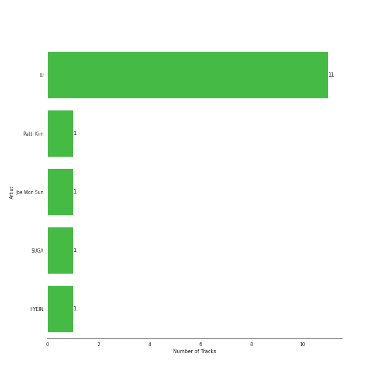
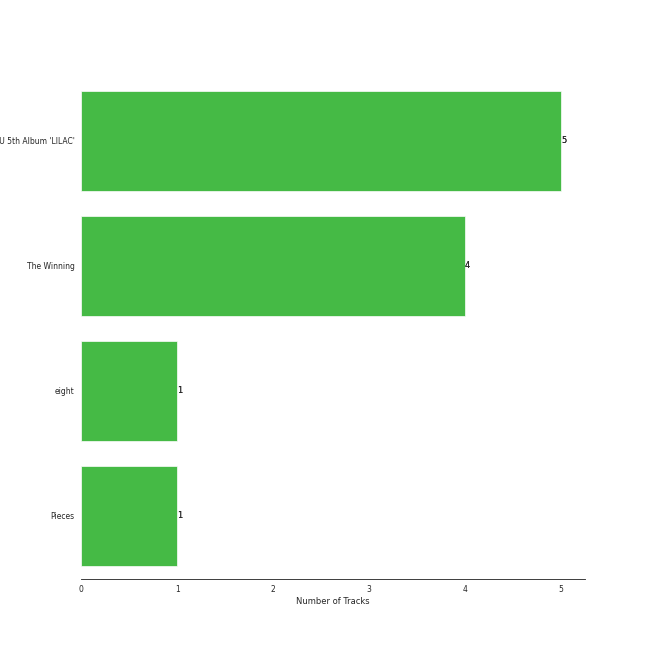
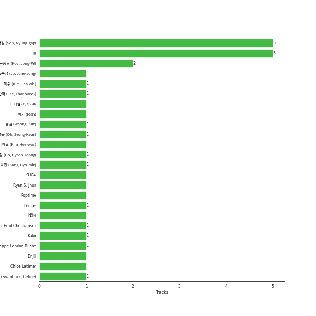

# EDAM Entertainment

11 songs

[See Track Features](audio_features.md)

[See Clusters](clusters/overview.md)

Appears as:
- EDAM Entertainment (11 tracks)

## Top Artists

| Art | Tracks | 💚 | Artist | 🔗 |
|:---|---:|---:|:---|:---|
|  | 11 | 10 | [IU](../../artists/iu/overview.md) | [🔗](https://open.spotify.com/artist/3HqSLMAZ3g3d5poNaI7GOU) |
|  | 1 | 1 | SUGA | [🔗](https://open.spotify.com/artist/0ebNdVaOfp6N0oZ1guIxM8) |
|  | 1 | 0 | Patti Kim | [🔗](https://open.spotify.com/artist/3YLoKDj5EXsg3AorXDgLlz) |
|  | 1 | 0 | Joe Won Sun | [🔗](https://open.spotify.com/artist/2rbcCyEKbnxdEukZHHGnby) |
|  | 1 | 0 | HYEIN | [🔗](https://open.spotify.com/artist/01BBFQPvi8ywBqHPzWzoyU) |

## Top Albums

| Art | Tracks | 💚 | Album | Release Date | 🔗 |
|:---|---:|---:|:---|:---|:---|
|  | 5 | 5 | IU 5th Album 'LILAC' | 2021-03-25 | [🔗](https://open.spotify.com/album/01dPJcwyht77brL4JQiR8R) |
|  | 4 | 3 | The Winning | 2024-02-20 | [🔗](https://open.spotify.com/album/08CvAj58nVMpq1Nw7T6maj) |
|  | 1 | 1 | eight | 2020-05-06 | [🔗](https://open.spotify.com/album/5vJNAlQeTf9lsulO1YlmSt) |
|  | 1 | 1 | Pieces | 2021-12-29 | [🔗](https://open.spotify.com/album/3ivhPVStd9RrtczBFwjkMQ) |

## Genres

| Tracks | 💚 | Genre |
|---:|---:|:---|
| 11 | 10 | [pop](../../genres/pop/overview.md) |
| 11 | 10 | [k-pop](../../genres/k-pop/overview.md) |

## Top Producers

| Art | Producer | Tracks | Credit Types |
|:---|:---|---:|:---|
| | 손명갑 (Son, Myung-gap) | 5 | Producer |
|  | [IU](../../artists/iu/overview.md) | 5 | Lyricist, Songwriter |
| | [구종필 (Koo, Jong-Pil)](../../producers/구종필_(koo,_jong-pil)/overview.md) | 2 | Producer |
| | Jeppe London Bilsby | 1 | Arranger, Songwriter |
|  | SUGA | 1 | Producer |
| | 오성근 (Oh, Seong-Keun) | 1 | Producer |
| | N!ko | 1 | Arranger, Songwriter |
| | 고현정 (Go, Hyeon-Jeong) | 1 | Producer |
| | Celine Svanbäck (Svanbäck, Celine) | 1 | Songwriter |
| | Kako | 1 | Songwriter |

View all

| Art | Producer | Tracks | Credit Types |
|:---|:---|---:|:---|
| | 김희원 (Kim, Hee-won) | 1 | Songwriter |
| | 강효민 (Kang, Hyo-min) | 1 | Producer |
| | 제휘 (Kim, Jea Whi) | 1 | Arranger, Songwriter |
| | 이기 (IGGY) | 1 | Arranger, Songwriter |
| | 이나일 (E, Na-Il) | 1 | Arranger |
| | 이찬혁 (Lee, Chanhyeok) | 1 | Lyricist, Songwriter |
| | Peejay | 1 | Arranger, Songwriter |
| | [Ryan S. Jhun](../../producers/ryan_s__jhun/overview.md) | 1 | Arranger, Songwriter |
| | 웅킴 (Woong, Kim) | 1 | Arranger, Songwriter |
| | Lauritz Emil Christiansen | 1 | Arranger, Songwriter |
| | 조준성 (Jo, June-sung) | 1 | Producer |
| | Dr.JO | 1 | Songwriter |
| | Chloe Latimer | 1 | Songwriter |
| | Poptime | 1 | Arranger, Songwriter |

## Tracks released under EDAM Entertainment

| Art | Track | Album | Artists | Label | Score | 💚 | 🔗 |
|:---|:---|:---|:---|:---|---:|:---|:---|
|  | My sea | IU 5th Album 'LILAC' | [IU](../../artists/iu/overview.md) | [EDAM Entertainment](.) | 42609 | 💚 | [🔗](https://open.spotify.com/track/46wDG6evLn2iPoQ0F8CUWk) |
|  | Coin | IU 5th Album 'LILAC' | [IU](../../artists/iu/overview.md) | [EDAM Entertainment](.) | 37021 | 💚 | [🔗](https://open.spotify.com/track/7CZRguMolNqIobnXxpV735) |
|  | LILAC | IU 5th Album 'LILAC' | [IU](../../artists/iu/overview.md) | [EDAM Entertainment](.) | 29531 | 💚 | [🔗](https://open.spotify.com/track/5xrtzzzikpG3BLbo4q1Yul) |
|  | Holssi | The Winning | [IU](../../artists/iu/overview.md) | [EDAM Entertainment](.) | 1672 | 💚 | [🔗](https://open.spotify.com/track/0UTtK6hregIBOsefavRI26) |
|  | Love wins all | The Winning | [IU](../../artists/iu/overview.md) | [EDAM Entertainment](.) | 246 | 💚 | [🔗](https://open.spotify.com/track/53g7ZIvZE47H9pwXPFYMCH) |
|  | Shh.. (Feat. HYEIN, WONSUN JOE & Special Narr. Patti Kim) | The Winning | [IU](../../artists/iu/overview.md), HYEIN, Joe Won Sun, Patti Kim | [EDAM Entertainment](.) | 193 | | [🔗](https://open.spotify.com/track/20uUaRkfRJZG15mXfn7LaU) |
|  | Shopper | The Winning | [IU](../../artists/iu/overview.md) | [EDAM Entertainment](.) | 36 | 💚 | [🔗](https://open.spotify.com/track/1c6kkrWnpy68eYDfBdxNtF) |
|  | Winter Sleep | Pieces | [IU](../../artists/iu/overview.md) | [EDAM Entertainment](.) | 3 | 💚 | [🔗](https://open.spotify.com/track/2y4hHM6c48Qzk0bqh33XfB) |
|  | eight(Prod.&Feat. SUGA of BTS) | eight | [IU](../../artists/iu/overview.md), SUGA | [EDAM Entertainment](.) | 1 | 💚 | [🔗](https://open.spotify.com/track/0pYacDCZuRhcrwGUA5nTBe) |
|  | Ah puh | IU 5th Album 'LILAC' | [IU](../../artists/iu/overview.md) | [EDAM Entertainment](.) | 0 | 💚 | [🔗](https://open.spotify.com/track/1IJxbEXfgiKuRx6oXMX87e) |

See all tracks

| Art | Track | Album | Artists | Label | Score | 💚 | 🔗 |
|:---|:---|:---|:---|:---|---:|:---|:---|
|  | Celebrity | IU 5th Album 'LILAC' | [IU](../../artists/iu/overview.md) | [EDAM Entertainment](.) | 0 | 💚 | [🔗](https://open.spotify.com/track/5nCwjUUsmBuNZKn9Xu10Os) |

