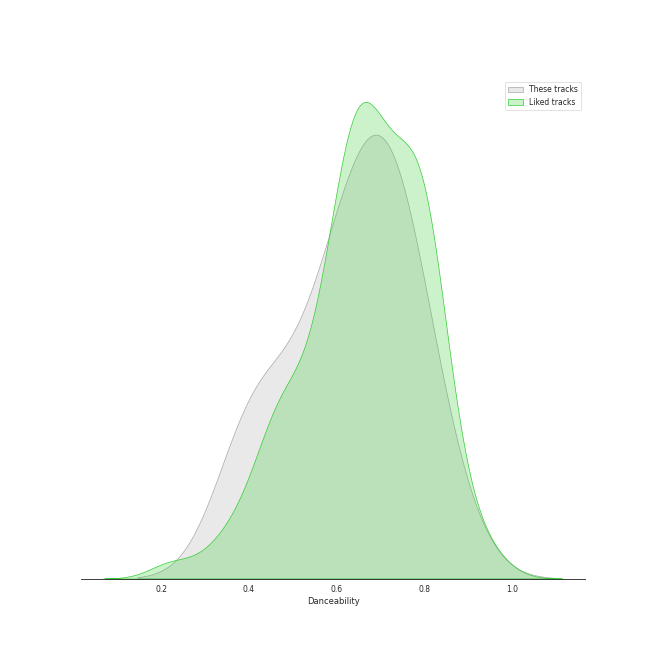
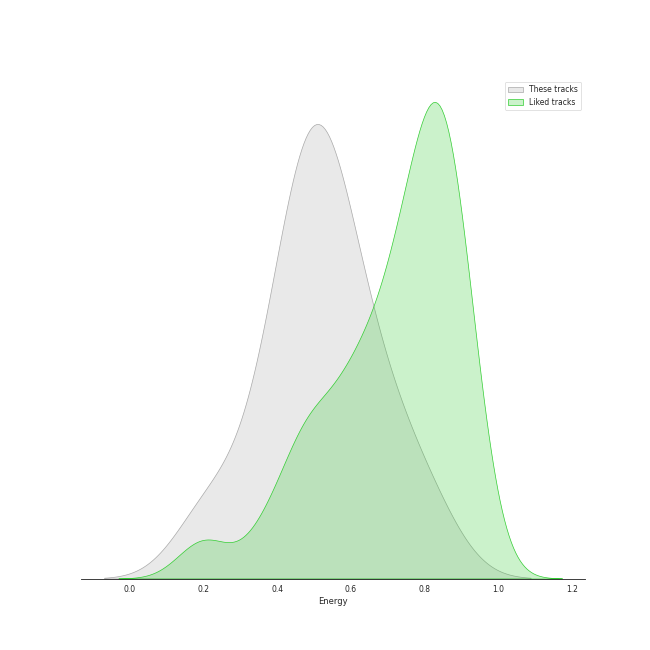
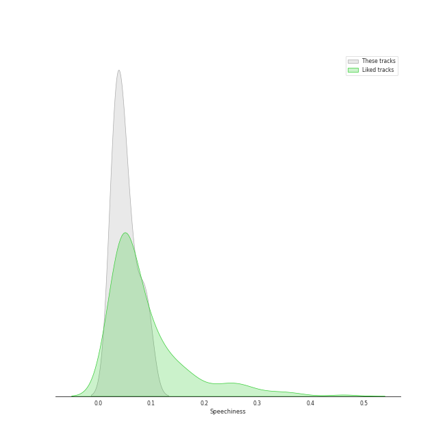
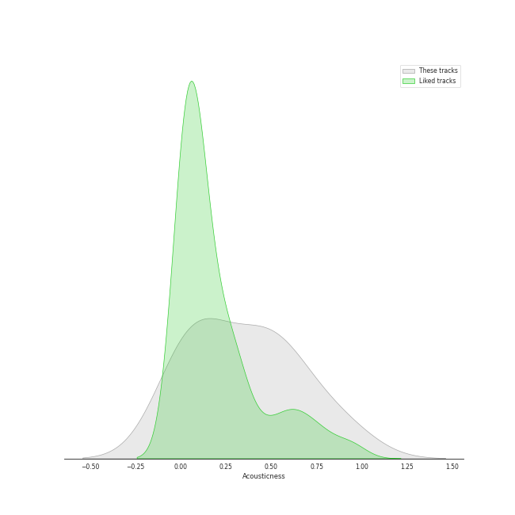
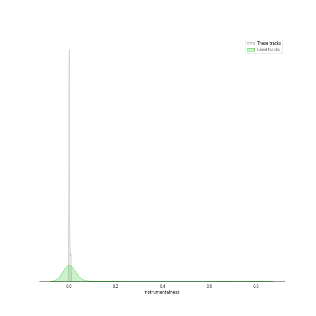
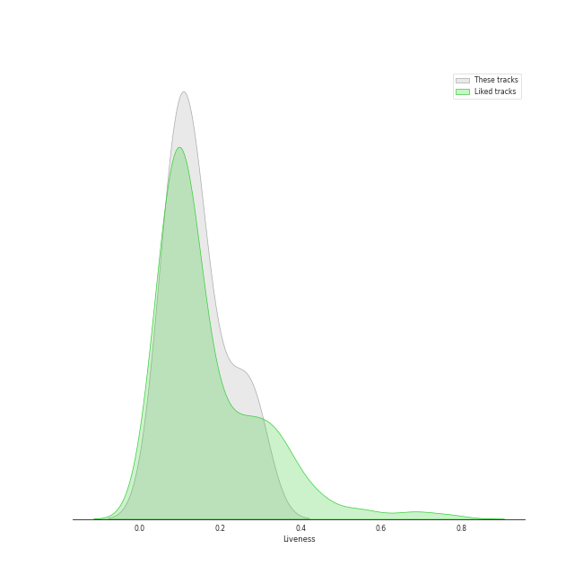
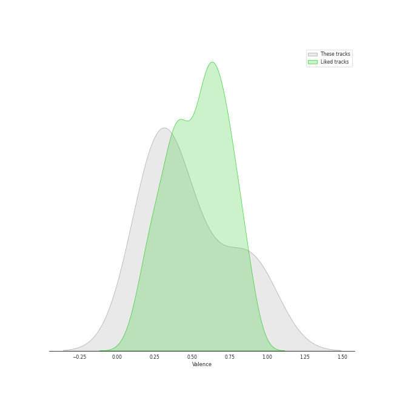

# Track Features for EMI

## Danceability

| ​ | 10 most Danceable tracks | ​​ | 10 least Danceable tracks |
|:---|:---|:---|:---|
|  | Dreadlock Holiday (0.837) |  | I'm Not In Love (0.404) |
|  | Put Your Records On (0.739) |  | Tiny Dancer (0.414) |
|  | Good Morning Judge (0.737) |  | Just The Way You Are (0.525) |
|  | Hunger (0.729) |  | Rocket Man (I Think It's Going To Be A Long, Long Time) (0.601) |
|  | Unholy (feat. Kim Petras) (0.714) |  | Crocodile Rock (0.621) |
|  | The Things We Do For Love (0.637) |  | The Things We Do For Love (0.637) |
|  | Crocodile Rock (0.621) |  | Unholy (feat. Kim Petras) (0.714) |
|  | Rocket Man (I Think It's Going To Be A Long, Long Time) (0.601) |  | Hunger (0.729) |
|  | Just The Way You Are (0.525) |  | Good Morning Judge (0.737) |
|  | Tiny Dancer (0.414) |  | Put Your Records On (0.739) |

## Energy

| ​ | 10 most Energetic tracks | ​​ | 10 least Energetic tracks |
|:---|:---|:---|:---|
|  | Crocodile Rock (0.8) |  | Just The Way You Are (0.218) |
|  | Hunger (0.675) |  | Dreadlock Holiday (0.38) |
|  | Good Morning Judge (0.642) |  | Tiny Dancer (0.428) |
|  | Rocket Man (I Think It's Going To Be A Long, Long Time) (0.532) |  | Unholy (feat. Kim Petras) (0.472) |
|  | The Things We Do For Love (0.528) |  | Put Your Records On (0.511) |
|  | I'm Not In Love (0.523) |  | I'm Not In Love (0.523) |
|  | Put Your Records On (0.511) |  | The Things We Do For Love (0.528) |
|  | Unholy (feat. Kim Petras) (0.472) |  | Rocket Man (I Think It's Going To Be A Long, Long Time) (0.532) |
|  | Tiny Dancer (0.428) |  | Good Morning Judge (0.642) |
|  | Dreadlock Holiday (0.38) |  | Hunger (0.675) |

## Speechiness

| ​ | 10 most Speechy tracks | ​​ | 10 least Speechy tracks |
|:---|:---|:---|:---|
|  | Good Morning Judge (0.0916) |  | Tiny Dancer (0.0278) |
|  | Unholy (feat. Kim Petras) (0.0864) |  | Rocket Man (I Think It's Going To Be A Long, Long Time) (0.0286) |
|  | Dreadlock Holiday (0.064) |  | Crocodile Rock (0.0344) |
|  | I'm Not In Love (0.0575) |  | Put Your Records On (0.0362) |
|  | Just The Way You Are (0.0483) |  | The Things We Do For Love (0.0394) |
|  | Hunger (0.0415) |  | Hunger (0.0415) |
|  | The Things We Do For Love (0.0394) |  | Just The Way You Are (0.0483) |
|  | Put Your Records On (0.0362) |  | I'm Not In Love (0.0575) |
|  | Crocodile Rock (0.0344) |  | Dreadlock Holiday (0.064) |
|  | Rocket Man (I Think It's Going To Be A Long, Long Time) (0.0286) |  | Unholy (feat. Kim Petras) (0.0864) |

## Acousticness

| ​ | 10 most Acoustic tracks | ​​ | 10 least Acoustic tracks |
|:---|:---|:---|:---|
|  | Just The Way You Are (0.906) |  | Unholy (feat. Kim Petras) (0.013) |
|  | I'm Not In Love (0.685) |  | Good Morning Judge (0.0185) |
|  | Dreadlock Holiday (0.541) |  | Crocodile Rock (0.0263) |
|  | Hunger (0.53) |  | The Things We Do For Love (0.163) |
|  | Rocket Man (I Think It's Going To Be A Long, Long Time) (0.432) |  | Put Your Records On (0.167) |
|  | Tiny Dancer (0.382) |  | Tiny Dancer (0.382) |
|  | Put Your Records On (0.167) |  | Rocket Man (I Think It's Going To Be A Long, Long Time) (0.432) |
|  | The Things We Do For Love (0.163) |  | Hunger (0.53) |
|  | Crocodile Rock (0.0263) |  | Dreadlock Holiday (0.541) |
|  | Good Morning Judge (0.0185) |  | I'm Not In Love (0.685) |

## Instrumentalness

| ​ | 10 most Instrumental tracks | ​​ | 10 least Instrumental tracks |
|:---|:---|:---|:---|
|  | Dreadlock Holiday (0.00789) |  | Hunger (0.0) |
|  | Good Morning Judge (0.00415) |  | The Things We Do For Love (0.0) |
|  | Just The Way You Are (0.000563) |  | Put Your Records On (1.34e-06) |
|  | I'm Not In Love (0.000498) |  | Unholy (feat. Kim Petras) (4.51e-06) |
|  | Tiny Dancer (0.000243) |  | Rocket Man (I Think It's Going To Be A Long, Long Time) (6.25e-06) |
|  | Crocodile Rock (1.51e-05) |  | Crocodile Rock (1.51e-05) |
|  | Rocket Man (I Think It's Going To Be A Long, Long Time) (6.25e-06) |  | Tiny Dancer (0.000243) |
|  | Unholy (feat. Kim Petras) (4.51e-06) |  | I'm Not In Love (0.000498) |
|  | Put Your Records On (1.34e-06) |  | Just The Way You Are (0.000563) |
|  | The Things We Do For Love (0.0) |  | Good Morning Judge (0.00415) |

## Liveness

| ​ | 10 most Live tracks | ​​ | 10 least Live tracks |
|:---|:---|:---|:---|
|  | I'm Not In Love (0.282) |  | Crocodile Rock (0.0591) |
|  | Unholy (feat. Kim Petras) (0.266) |  | Good Morning Judge (0.0726) |
|  | Dreadlock Holiday (0.198) |  | Rocket Man (I Think It's Going To Be A Long, Long Time) (0.0925) |
|  | Tiny Dancer (0.148) |  | Hunger (0.0985) |
|  | Put Your Records On (0.133) |  | Just The Way You Are (0.11) |
|  | The Things We Do For Love (0.122) |  | The Things We Do For Love (0.122) |
|  | Just The Way You Are (0.11) |  | Put Your Records On (0.133) |
|  | Hunger (0.0985) |  | Tiny Dancer (0.148) |
|  | Rocket Man (I Think It's Going To Be A Long, Long Time) (0.0925) |  | Dreadlock Holiday (0.198) |
|  | Good Morning Judge (0.0726) |  | Unholy (feat. Kim Petras) (0.266) |

## Valence

| ​ | 10 most Happy tracks | ​​ | 10 least Happy tracks |
|:---|:---|:---|:---|
|  | Crocodile Rock (0.968) |  | I'm Not In Love (0.164) |
|  | Dreadlock Holiday (0.892) |  | Unholy (feat. Kim Petras) (0.238) |
|  | The Things We Do For Love (0.781) |  | Just The Way You Are (0.251) |
|  | Put Your Records On (0.542) |  | Tiny Dancer (0.282) |
|  | Good Morning Judge (0.467) |  | Hunger (0.332) |
|  | Rocket Man (I Think It's Going To Be A Long, Long Time) (0.341) |  | Rocket Man (I Think It's Going To Be A Long, Long Time) (0.341) |
|  | Hunger (0.332) |  | Good Morning Judge (0.467) |
|  | Tiny Dancer (0.282) |  | Put Your Records On (0.542) |
|  | Just The Way You Are (0.251) |  | The Things We Do For Love (0.781) |
|  | Unholy (feat. Kim Petras) (0.238) |  | Dreadlock Holiday (0.892) |

## Tempo

| ​ | 10 most Fast tracks | ​​ | 10 least Fast tracks |
|:---|:---|:---|:---|
|  | Crocodile Rock (149.91) |  | Put Your Records On (96.038) |
|  | Tiny Dancer (145.075) |  | Dreadlock Holiday (104.995) |
|  | Rocket Man (I Think It's Going To Be A Long, Long Time) (136.571) |  | Good Morning Judge (106.742) |
|  | I'm Not In Love (133.738) |  | The Things We Do For Love (106.949) |
|  | Unholy (feat. Kim Petras) (131.121) |  | Hunger (116.016) |
|  | Just The Way You Are (130.309) |  | Just The Way You Are (130.309) |
|  | Hunger (116.016) |  | Unholy (feat. Kim Petras) (131.121) |
|  | The Things We Do For Love (106.949) |  | I'm Not In Love (133.738) |
|  | Good Morning Judge (106.742) |  | Rocket Man (I Think It's Going To Be A Long, Long Time) (136.571) |
|  | Dreadlock Holiday (104.995) |  | Tiny Dancer (145.075) |
