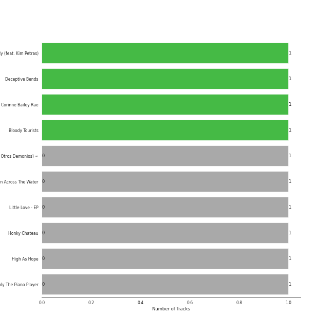
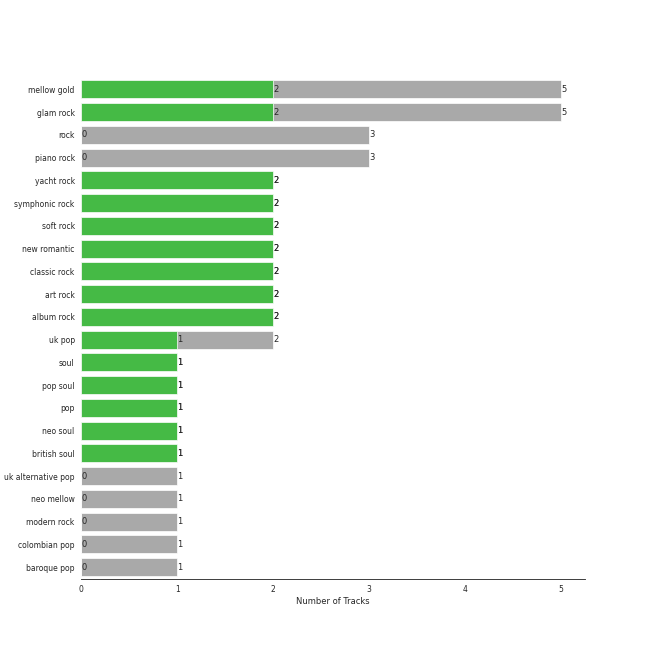
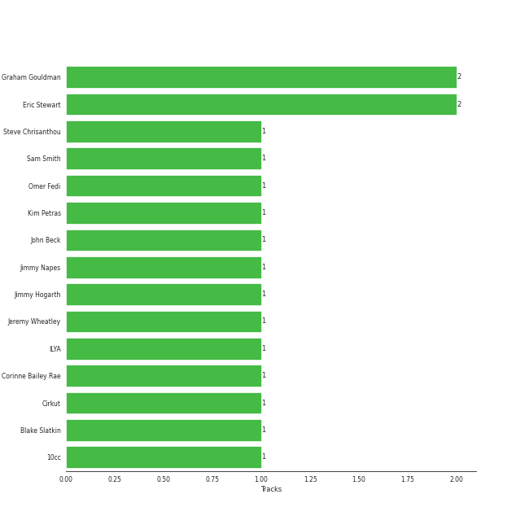

# EMI

11 songs

[See Track Features](audio_features.md)

[See Clusters](clusters/overview.md)

Appears as:
- EMI (9 tracks)
- Capitol Records UK / EMI (1 tracks)
- EMI Records (1 tracks)

## Top Artists

| Art | Tracks | 💚 | Artist | 🔗 |
|:---|---:|---:|:---|:---|
|  | 1 | 1 | Kim Petras | [🔗](https://open.spotify.com/artist/3Xt3RrJMFv5SZkCfUE8C1J) |
|  | 1 | 1 | Sam Smith | [🔗](https://open.spotify.com/artist/2wY79sveU1sp5g7SokKOiI) |
|  | 1 | 1 | Corinne Bailey Rae | [🔗](https://open.spotify.com/artist/29WzbAQtDnBJF09es0uddn) |
|  | 4 | 0 | 10cc | [🔗](https://open.spotify.com/artist/6i6WlGzQtXtz7GcC5H5st5) |
|  | 3 | 0 | Elton John | [🔗](https://open.spotify.com/artist/3PhoLpVuITZKcymswpck5b) |
|  | 1 | 0 | James Smith | [🔗](https://open.spotify.com/artist/543ccHFPnZfJMD8tRGPtu7) |
|  | 1 | 0 | [Florence + The Machine](../../artists/florence_+_the_machine/overview.md) | [🔗](https://open.spotify.com/artist/1moxjboGR7GNWYIMWsRjgG) |

## Top Albums

| Art | Tracks | 💚 | Album | Release Date | 🔗 |
|:---|---:|---:|:---|:---|:---|
|  | 2 | 0 | Deceptive Bends | 1977 | [🔗](https://open.spotify.com/album/6D3RQD5AQZ4P2aDzsZmBI4) |
|  | 1 | 1 | Unholy (feat. Kim Petras) | 2022-09-22 | [🔗](https://open.spotify.com/album/0gX9tkL5njRax8ymWcXARi) |
|  | 1 | 1 | Corinne Bailey Rae | 2006-01-01 | [🔗](https://open.spotify.com/album/141Mp3P2VKHQMhtkW1DyQg) |
|  | 1 | 0 | The Original Soundtrack | 1975 | [🔗](https://open.spotify.com/album/1CMgmJjMFskwwmK8h8j1Oj) |
|  | 1 | 0 | Madman Across The Water | 1971-11-05 | [🔗](https://open.spotify.com/album/2OZbaW9tgO62ndm375lFZr) |
|  | 1 | 0 | Little Love - EP | 2018-06-01 | [🔗](https://open.spotify.com/album/2PLM1yTphJeFZg01Xiaumc) |
|  | 1 | 0 | Honky Chateau | 1972-05-19 | [🔗](https://open.spotify.com/album/2ei2X6ghPnw7YRwQtAH075) |
|  | 1 | 0 | High As Hope | 2018-06-29 | [🔗](https://open.spotify.com/album/0pKZJj9GzcKPCS8r4IaksA) |
|  | 1 | 0 | Don't Shoot Me I'm Only The Piano Player | 1973-01-22 | [🔗](https://open.spotify.com/album/1reJ8DttK5EGwdyf7y9FBR) |
|  | 1 | 0 | Bloody Tourists | 1978 | [🔗](https://open.spotify.com/album/3MecVG0PeBObAhjwEAczFG) |

## Genres

| Tracks | 💚 | Genre |
|---:|---:|:---|
| 2 | 1 | [uk pop](../../genres/uk_pop/overview.md) |
| 1 | 1 | [soul](../../genres/soul/overview.md) |
| 1 | 1 | pop soul |
| 1 | 1 | [pop](../../genres/pop/overview.md) |
| 1 | 1 | neo soul |
| 1 | 1 | british soul |
| 7 | 0 | [mellow gold](../../genres/mellow_gold/overview.md) |
| 7 | 0 | [glam rock](../../genres/glam_rock/overview.md) |
| 4 | 0 | yacht rock |
| 4 | 0 | symphonic rock |

See all 21 genres

| Tracks | 💚 | Genre |
|---:|---:|:---|
| 4 | 0 | [soft rock](../../genres/soft_rock/overview.md) |
| 4 | 0 | new romantic |
| 4 | 0 | [classic rock](../../genres/classic_rock/overview.md) |
| 4 | 0 | [art rock](../../genres/art_rock/overview.md) |
| 4 | 0 | [album rock](../../genres/album_rock/overview.md) |
| 3 | 0 | [rock](../../genres/rock/overview.md) |
| 3 | 0 | [piano rock](../../genres/piano_rock/overview.md) |
| 1 | 0 | [uk alternative pop](../../genres/uk_alternative_pop/overview.md) |
| 1 | 0 | [modern rock](../../genres/modern_rock/overview.md) |
| 1 | 0 | [electropop](../../genres/electropop/overview.md) |
| 1 | 0 | baroque pop |

## Top Producers

| Art | Producer | Tracks | Credit Types |
|:---|:---|---:|:---|
| | Cirkut | 1 | Songwriter |
| | Steve Chrisanthou | 1 | Producer, Songwriter |
| | Blake Slatkin | 1 | Songwriter |
|  | Kim Petras | 1 | Songwriter |
|  | Sam Smith | 1 | Songwriter |
| | Jimmy Hogarth | 1 | Producer |
| | ILYA | 1 | Songwriter |
| | Jeremy Wheatley | 1 | Producer |
| | Jimmy Napes | 1 | Songwriter |
|  | Corinne Bailey Rae | 1 | Songwriter |

View all

| Art | Producer | Tracks | Credit Types |
|:---|:---|---:|:---|
| | Omer Fedi | 1 | Songwriter |
| | John Beck | 1 | Songwriter |

## Tracks released under EMI

| Art | Track | Album | Artists | Label | 💚 | 🔗 |
|:---|:---|:---|:---|:---|:---|:---|
|  | I'm Not In Love | The Original Soundtrack | 10cc | [EMI](.) | | [🔗](https://open.spotify.com/track/5HQEmiV2lKnSO6qa2fsR7x) |
|  | Good Morning Judge | Deceptive Bends | 10cc | [EMI](.) | | [🔗](https://open.spotify.com/track/1fMGRxKRtIKNyaMMGrzInM) |
|  | The Things We Do For Love | Deceptive Bends | 10cc | [EMI](.) | | [🔗](https://open.spotify.com/track/6KEWtSOGKpIXGw6l1uJgsR) |
|  | Dreadlock Holiday | Bloody Tourists | 10cc | [EMI](.) | | [🔗](https://open.spotify.com/track/1LOZMYF5s8qhW7Rv4w2gun) |
|  | Put Your Records On | Corinne Bailey Rae | Corinne Bailey Rae | [EMI Records](.) | 💚 | [🔗](https://open.spotify.com/track/2nGFzvICaeEWjIrBrL2RAx) |
|  | Tiny Dancer | Madman Across The Water | Elton John | [EMI](.) | | [🔗](https://open.spotify.com/track/2TVxnKdb3tqe1nhQWwwZCO) |
|  | Rocket Man (I Think It's Going To Be A Long, Long Time) | Honky Chateau | Elton John | [EMI](.) | | [🔗](https://open.spotify.com/track/3gdewACMIVMEWVbyb8O9sY) |
|  | Crocodile Rock | Don't Shoot Me I'm Only The Piano Player | Elton John | [EMI](.) | | [🔗](https://open.spotify.com/track/6WCeFNVAXUtNczb7lqLiZU) |
|  | Hunger | High As Hope | [Florence + The Machine](../../artists/florence_+_the_machine/overview.md) | [EMI](.) | | [🔗](https://open.spotify.com/track/6Ju28M6P8Y8sLjBgWjyUUD) |
|  | Just The Way You Are | Little Love - EP | James Smith | [EMI](.) | | [🔗](https://open.spotify.com/track/1YwbObIsxLhBTjSI5lwJz6) |

See all tracks

| Art | Track | Album | Artists | Label | 💚 | 🔗 |
|:---|:---|:---|:---|:---|:---|:---|
|  | Unholy (feat. Kim Petras) | Unholy (feat. Kim Petras) | Sam Smith, Kim Petras | [Capitol Records UK / EMI](.) | 💚 | [🔗](https://open.spotify.com/track/3nqQXoyQOWXiESFLlDF1hG) |

