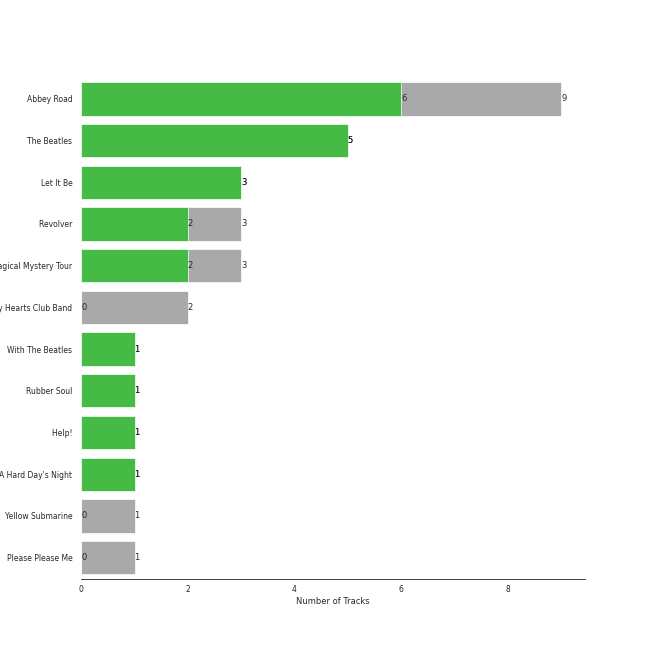
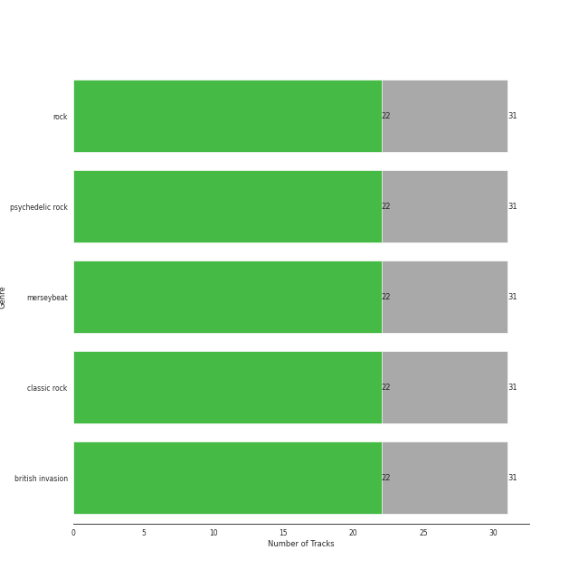

# EMI Catalogue

30 songs

Appears as:
- EMI Catalogue (30 tracks)

## Top Artists

See all 1 artists

| Number of Tracks | Art | Artist | 🔗 |
|---:|:---|:---|:---|
| 30 |  | [The Beatles](../artists/the_beatles.md) | [🔗](https://open.spotify.com/artist/3WrFJ7ztbogyGnTHbHJFl2) |

## Top Albums

See all 12 albums

| Number of Tracks | Art | Album | Release Date | 🔗 |
|---:|:---|:---|:---|:---|
| 9 |  | Abbey Road (Remastered) | 1969-09-26 | [🔗](https://open.spotify.com/album/0ETFjACtuP2ADo6LFhL6HN) |
| 5 |  | The Beatles (Remastered) | 1968-11-22 | [🔗](https://open.spotify.com/album/1klALx0u4AavZNEvC4LrTL) |
| 3 |  | Revolver (Remastered) | 1966-08-05 | [🔗](https://open.spotify.com/album/3PRoXYsngSwjEQWR5PsHWR) |
| 3 |  | Magical Mystery Tour (Remastered) | 1967-11-27 | [🔗](https://open.spotify.com/album/2BtE7qm1qzM80p9vLSiXkj) |
| 3 |  | Let It Be (Remastered) | 1970-05-08 | [🔗](https://open.spotify.com/album/0jTGHV5xqHPvEcwL8f6YU5) |
| 1 |  | Yellow Submarine (Remastered) | 1969-01-17 | [🔗](https://open.spotify.com/album/1gKZ5A1ndFqbcrWtW85cCy) |
| 1 |  | With The Beatles (Remastered) | 1963-11-22 | [🔗](https://open.spotify.com/album/1aYdiJk6XKeHWGO3FzHHTr) |
| 1 |  | Sgt. Pepper's Lonely Hearts Club Band (Remastered) | 1967-06-01 | [🔗](https://open.spotify.com/album/6QaVfG1pHYl1z15ZxkvVDW) |
| 1 |  | Rubber Soul (Remastered) | 1965-12-03 | [🔗](https://open.spotify.com/album/50o7kf2wLwVmOTVYJOTplm) |
| 1 |  | Please Please Me (Remastered) | 1963-03-22 | [🔗](https://open.spotify.com/album/3KzAvEXcqJKBF97HrXwlgf) |
| 1 |  | Help! (Remastered) | 1965-08-06 | [🔗](https://open.spotify.com/album/0PT5m6hwPRrpBwIHVnvbFX) |
| 1 |  | A Hard Day's Night (Remastered) | 1964-07-10 | [🔗](https://open.spotify.com/album/6wCttLq0ADzkPgtRnUihLV) |

## Genres

See all 6 genres

| Number of Tracks | Genre |
|---:|:---|
| 30 | [rock](../genres/rock.md) |
| 30 | [psychedelic rock](../genres/psychedelic_rock.md) |
| 30 | merseybeat |
| 30 | [classic rock](../genres/classic_rock.md) |
| 30 | british invasion |
| 30 | beatlesque |

## Tracks released under EMI Catalogue

| Art | Track | Album | Artists | Label | 💚 | 🔗 |
|:---|:---|:---|:---|:---|:---|:---|
|  | Love Me Do - Remastered 2009 | Please Please Me (Remastered) | [The Beatles](../artists/the_beatles.md) | [EMI Catalogue](emi_catalogue.md) | | [🔗](https://open.spotify.com/track/3VbGCXWRiouAq8VyMYN2MI) |
|  | All My Loving - Remastered 2009 | With The Beatles (Remastered) | [The Beatles](../artists/the_beatles.md) | [EMI Catalogue](emi_catalogue.md) | 💚 | [🔗](https://open.spotify.com/track/4joiWvli4qJVEW6qZV2i2J) |
|  | A Hard Day's Night - Remastered 2009 | A Hard Day's Night (Remastered) | [The Beatles](../artists/the_beatles.md) | [EMI Catalogue](emi_catalogue.md) | 💚 | [🔗](https://open.spotify.com/track/5J2CHimS7dWYMImCHkEFaJ) |
|  | Yesterday - Remastered 2009 | Help! (Remastered) | [The Beatles](../artists/the_beatles.md) | [EMI Catalogue](emi_catalogue.md) | 💚 | [🔗](https://open.spotify.com/track/3BQHpFgAp4l80e1XslIjNI) |
|  | Norwegian Wood (This Bird Has Flown) - Remastered 2009 | Rubber Soul (Remastered) | [The Beatles](../artists/the_beatles.md) | [EMI Catalogue](emi_catalogue.md) | 💚 | [🔗](https://open.spotify.com/track/1H7gMYGykdtwZOV6s1N0by) |
|  | Eleanor Rigby - Remastered 2009 | Revolver (Remastered) | [The Beatles](../artists/the_beatles.md) | [EMI Catalogue](emi_catalogue.md) | 💚 | [🔗](https://open.spotify.com/track/5GjPQ0eI7AgmOnADn1EO6Q) |
|  | Got To Get You Into My Life - Remastered 2009 | Revolver (Remastered) | [The Beatles](../artists/the_beatles.md) | [EMI Catalogue](emi_catalogue.md) | 💚 | [🔗](https://open.spotify.com/track/3tGhRLgcCP6SIZU3tbGl7l) |
|  | Yellow Submarine - Remastered 2009 | Revolver (Remastered) | [The Beatles](../artists/the_beatles.md) | [EMI Catalogue](emi_catalogue.md) | | [🔗](https://open.spotify.com/track/50xwQXPtfNZFKFeZ0XePWc) |
|  | When I'm Sixty Four - Remastered 2009 | Sgt. Pepper's Lonely Hearts Club Band (Remastered) | [The Beatles](../artists/the_beatles.md) | [EMI Catalogue](emi_catalogue.md) | | [🔗](https://open.spotify.com/track/1NrbnHlR2BFREcyWXHIHip) |
|  | I Am The Walrus - Remastered 2009 | Magical Mystery Tour (Remastered) | [The Beatles](../artists/the_beatles.md) | [EMI Catalogue](emi_catalogue.md) | 💚 | [🔗](https://open.spotify.com/track/6Pq9MmkDQYZiiCDpxnvrf6) |
|  | Penny Lane - Remastered 2009 | Magical Mystery Tour (Remastered) | [The Beatles](../artists/the_beatles.md) | [EMI Catalogue](emi_catalogue.md) | 💚 | [🔗](https://open.spotify.com/track/1h04XMpzGzmAudoI6VHBgA) |
|  | Strawberry Fields Forever - Remastered 2009 | Magical Mystery Tour (Remastered) | [The Beatles](../artists/the_beatles.md) | [EMI Catalogue](emi_catalogue.md) | | [🔗](https://open.spotify.com/track/3Am0IbOxmvlSXro7N5iSfZ) |
|  | Blackbird - Remastered 2009 | The Beatles (Remastered) | [The Beatles](../artists/the_beatles.md) | [EMI Catalogue](emi_catalogue.md) | 💚 | [🔗](https://open.spotify.com/track/5jgFfDIR6FR0gvlA56Nakr) |
|  | Dear Prudence - Remastered 2009 | The Beatles (Remastered) | [The Beatles](../artists/the_beatles.md) | [EMI Catalogue](emi_catalogue.md) | 💚 | [🔗](https://open.spotify.com/track/5NQYyej46WQkgCbnzGD21W) |
|  | Revolution 1 - Remastered 2009 | The Beatles (Remastered) | [The Beatles](../artists/the_beatles.md) | [EMI Catalogue](emi_catalogue.md) | 💚 | [🔗](https://open.spotify.com/track/1aOzDhi5a1RWWRy5dmYA8I) |
|  | Sexy Sadie - Remastered 2009 | The Beatles (Remastered) | [The Beatles](../artists/the_beatles.md) | [EMI Catalogue](emi_catalogue.md) | 💚 | [🔗](https://open.spotify.com/track/2tBv9tAdqEbLNDi5smSjbg) |
|  | While My Guitar Gently Weeps - Remastered 2009 | The Beatles (Remastered) | [The Beatles](../artists/the_beatles.md) | [EMI Catalogue](emi_catalogue.md) | 💚 | [🔗](https://open.spotify.com/track/389QX9Q1eUOEZ19vtzzI9O) |
|  | All You Need Is Love - Remastered 2009 | Yellow Submarine (Remastered) | [The Beatles](../artists/the_beatles.md) | [EMI Catalogue](emi_catalogue.md) | | [🔗](https://open.spotify.com/track/2Z8cY4QpZTFUZxCQCpvNe1) |
|  | Because - Remastered 2009 | Abbey Road (Remastered) | [The Beatles](../artists/the_beatles.md) | [EMI Catalogue](emi_catalogue.md) | 💚 | [🔗](https://open.spotify.com/track/1rxoyGj1QuPoVi8fOft1Kt) |
|  | Carry That Weight - Remastered 2009 | Abbey Road (Remastered) | [The Beatles](../artists/the_beatles.md) | [EMI Catalogue](emi_catalogue.md) | | [🔗](https://open.spotify.com/track/5eZrW59C3UgBhkqNlowEID) |
|  | Come Together - Remastered 2009 | Abbey Road (Remastered) | [The Beatles](../artists/the_beatles.md) | [EMI Catalogue](emi_catalogue.md) | 💚 | [🔗](https://open.spotify.com/track/2EqlS6tkEnglzr7tkKAAYD) |
|  | Golden Slumbers - Remastered 2009 | Abbey Road (Remastered) | [The Beatles](../artists/the_beatles.md) | [EMI Catalogue](emi_catalogue.md) | 💚 | [🔗](https://open.spotify.com/track/01SfTM5nfCou5gQL70r6gs) |
|  | I Want You (She's So Heavy) - Remastered 2009 | Abbey Road (Remastered) | [The Beatles](../artists/the_beatles.md) | [EMI Catalogue](emi_catalogue.md) | 💚 | [🔗](https://open.spotify.com/track/3Z25k4ZF6QENy2d9YatsM5) |
|  | Octopus's Garden - Remastered 2009 | Abbey Road (Remastered) | [The Beatles](../artists/the_beatles.md) | [EMI Catalogue](emi_catalogue.md) | | [🔗](https://open.spotify.com/track/0suLngfo7rJoetk7Ub6N8l) |
|  | Oh! Darling - Remastered 2009 | Abbey Road (Remastered) | [The Beatles](../artists/the_beatles.md) | [EMI Catalogue](emi_catalogue.md) | 💚 | [🔗](https://open.spotify.com/track/2mxByJWOajjiVsLWjNXvDJ) |
|  | Something - Remastered 2009 | Abbey Road (Remastered) | [The Beatles](../artists/the_beatles.md) | [EMI Catalogue](emi_catalogue.md) | 💚 | [🔗](https://open.spotify.com/track/0pNeVovbiZHkulpGeOx1Gj) |
|  | You Never Give Me Your Money - Remastered 2009 | Abbey Road (Remastered) | [The Beatles](../artists/the_beatles.md) | [EMI Catalogue](emi_catalogue.md) | | [🔗](https://open.spotify.com/track/1jOLTO379yIu9aMnCkpMQl) |
|  | Across The Universe - Remastered 2009 | Let It Be (Remastered) | [The Beatles](../artists/the_beatles.md) | [EMI Catalogue](emi_catalogue.md) | | [🔗](https://open.spotify.com/track/4dkoqJrP0L8FXftrMZongF) |
|  | Get Back - Remastered 2009 | Let It Be (Remastered) | [The Beatles](../artists/the_beatles.md) | [EMI Catalogue](emi_catalogue.md) | 💚 | [🔗](https://open.spotify.com/track/4MLBqAEzNN89o2M9h92Z26) |
|  | Let It Be - Remastered 2009 | Let It Be (Remastered) | [The Beatles](../artists/the_beatles.md) | [EMI Catalogue](emi_catalogue.md) | 💚 | [🔗](https://open.spotify.com/track/7iN1s7xHE4ifF5povM6A48) |
