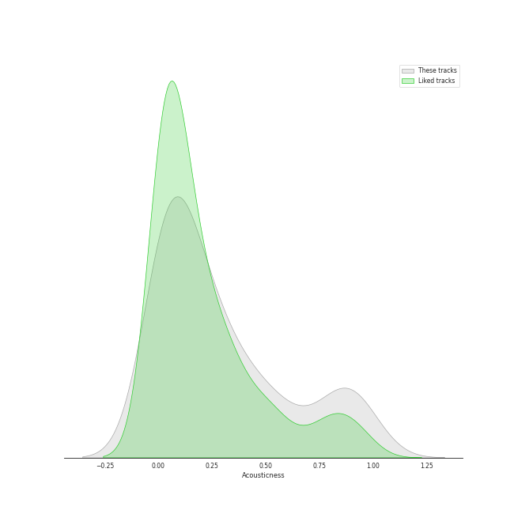
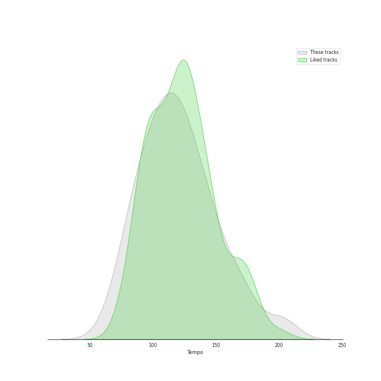

# Audio Features for Epic

## Danceability

| 10 most Danceable tracks | 10 least Danceable tracks |
|:---|:---|
| Billie Jean (0.932) | Stay (0.262) |
| P.Y.T. (Pretty Young Thing) (0.894) | Gravity (0.27) |
| Faith - Remastered (0.887) | Once Upon Another Time (0.275) |
| Worth It (feat. Kid Ink) (0.884) | City (0.319) |
| Don't Stop 'Til You Get Enough (0.878) | Come Round Soon (0.338) |
| Smooth Criminal - 2012 Remaster (0.853) | Bluebird (0.34) |
| Wanna Be Startin' Somethin' (0.842) | Bright Lights and Cityscapes (0.343) |
| Man in the Mirror - 2012 Remaster (0.808) | Everything Changes (0.348) |
| Little Black Dress (0.787) | Breathe Again (0.366) |
| Grandma Got Run over by a Reindeer (0.781) | She Used To Be Mine (0.397) |

## Energy

| 10 most Energetic tracks | 10 least Energetic tracks |
|:---|:---|
| Smooth Criminal - 2012 Remaster (0.981) | Kaleidoscope Heart (0.0516) |
| Bad Idea (feat. Jason Mraz) (0.889) | Goodbye Yellow Brick Road - Live at the Variety Playhouse, Atlanta, GA - May 2013 (0.114) |
| Morningside (0.88) | Say Something (0.147) |
| Let The Rain (0.873) | Manhattan (0.168) |
| Waka Waka (This Time for Africa) [The Official 2010 FIFA World Cup (TM) Song] (feat. Freshlyground) (0.873) | So Far Away (0.172) |
| Wanna Be Startin' Somethin' (0.872) | Bright Lights and Cityscapes (0.184) |
| Fairytale (0.857) | Bluebird (0.203) |
| That's My Girl (0.851) | Once Upon Another Time (0.216) |
| Brave (0.836) | What's Inside (0.242) |
| Hips Don't Lie (feat. Wyclef Jean) (0.824) | Basket Case (0.273) |

## Speechiness

| 10 most Speechy tracks | 10 least Speechy tracks |
|:---|:---|
| Waka Waka (This Time for Africa) [The Official 2010 FIFA World Cup (TM) Song] (feat. Freshlyground) (0.143) | Satellite Call (0.0241) |
| That's My Girl (0.121) | Breakeven (0.0242) |
| Faith - Remastered (0.117) | Machine Gun (0.0268) |
| Opening Up (0.0936) | Orpheus (0.0269) |
| Cry for Me (0.0927) | Sweet As Whole (0.0275) |
| Kaleidoscope Heart (0.0927) | Breathe Again (0.0278) |
| Don't Stop 'Til You Get Enough (0.089) | The Man Who Can't Be Moved (0.0279) |
| Worth It (feat. Kid Ink) (0.0882) | Dust in the Wind (0.0283) |
| Living Proof (0.082) | Islands (0.0284) |
| Heartbreak Anniversary (0.0791) | Señorita (0.0287) |

## Acousticness

| 10 most Acoustic tracks | 10 least Acoustic tracks |
|:---|:---|
| Bright Lights and Cityscapes (0.977) | Carry on Wayward Son (0.00321) |
| Manhattan (0.972) | Brave (0.00502) |
| Goodbye Yellow Brick Road - Live at the Variety Playhouse, Atlanta, GA - May 2013 (0.959) | Waka Waka (This Time for Africa) [The Official 2010 FIFA World Cup (TM) Song] (feat. Freshlyground) (0.00627) |
| Bluebird (0.933) | Many the Miles (0.00796) |
| What's Inside (0.919) | Vegas (0.00881) |
| So Far Away (0.897) | Faith - Remastered (0.0094) |
| Once Upon Another Time (0.896) | Yoga (0.0159) |
| Consequences (0.889) | Bad Idea (feat. Jason Mraz) (0.0168) |
| Miss Simone (0.859) | Billie Jean (0.0173) |
| Say Something (0.857) | Wicked Love (0.0178) |

## Instrumentalness

| 10 most Instrumental tracks | 10 least Instrumental tracks |
|:---|:---|
| Smooth Criminal - 2012 Remaster (0.468) | Say You're Sorry (0.0) |
| Wanna Be Startin' Somethin' (0.419) | Sweet As Whole (0.0) |
| Don't Stop 'Til You Get Enough (0.0461) | Come Round Soon (0.0) |
| Billie Jean (0.0436) | Kaleidoscope Heart (0.0) |
| Satellite Call (0.0318) | Everything Changes (0.0) |
| Islands (0.0261) | Vegas (0.0) |
| Armor (0.0145) | Hercules (0.0) |
| Breathe Again (0.00655) | Fairytale (0.0) |
| Miss Simone (0.00407) | Bad Idea (feat. Jason Mraz) (0.0) |
| The Light (0.00375) | Opening Up (0.0) |

## Liveness

| 10 most Live tracks | 10 least Live tracks |
|:---|:---|
| Thriller (0.89) | Uncharted (0.0343) |
| Goodbye Yellow Brick Road - Live at the Variety Playhouse, Atlanta, GA - May 2013 (0.781) | Billie Jean (0.0414) |
| Carry on Wayward Son (0.446) | Brave (0.0425) |
| Hips Don't Lie (feat. Wyclef Jean) (0.405) | Eden (0.0456) |
| That's My Girl (0.365) | Chasing The Sun (0.0497) |
| Fire (0.363) | I Feel the Earth Move (0.0528) |
| Living Proof (0.359) | Wanna Be Startin' Somethin' (0.0573) |
| Last Christmas (0.355) | King of Anything (0.0574) |
| Smooth Criminal - 2012 Remaster (0.306) | Faith - Remastered (0.0662) |
| Heartbreak Anniversary (0.303) | P.Y.T. (Pretty Young Thing) (0.0691) |

## Valence

| 10 most Happy tracks | 10 least Happy tracks |
|:---|:---|
| P.Y.T. (Pretty Young Thing) (0.961) | Once Upon Another Time (0.0551) |
| I Choose You (0.947) | Say Something (0.0765) |
| Don't Stop 'Til You Get Enough (0.947) | Islands (0.0863) |
| Last Christmas (0.947) | Everything Changes (0.0983) |
| Wanna Be Startin' Somethin' (0.906) | Bluebird (0.161) |
| Beat It (0.9) | What's Inside (0.162) |
| Billie Jean (0.884) | Goodbye Yellow Brick Road - Live at the Variety Playhouse, Atlanta, GA - May 2013 (0.168) |
| Say You're Sorry (0.846) | She Used To Be Mine (0.172) |
| Grandma Got Run over by a Reindeer (0.817) | Stay (0.181) |
| La Tortura (feat. Alejandro Sanz) (0.812) | City (0.192) |

## Tempo

| 10 most Fast tracks | 10 least Fast tracks |
|:---|:---|
| Uncharted (203.962) | What's Inside (63.218) |
| That's My Girl (202.049) | Bright Lights and Cityscapes (66.509) |
| Brave (185.063) | Come Round Soon (74.751) |
| Wicked Love (179.894) | Basket Case (76.196) |
| Say You're Sorry (170.016) | Living Proof (77.566) |
| Breathe Again (169.677) | Armor (78.784) |
| Gravity (168.964) | Vegas (79.999) |
| Bad Idea (feat. Jason Mraz) (167.936) | Islands (80.023) |
| Eyes on You (165.97) | Orpheus (80.365) |
| Chasing The Sun (164.989) | She Used To Be Mine (81.05) |
