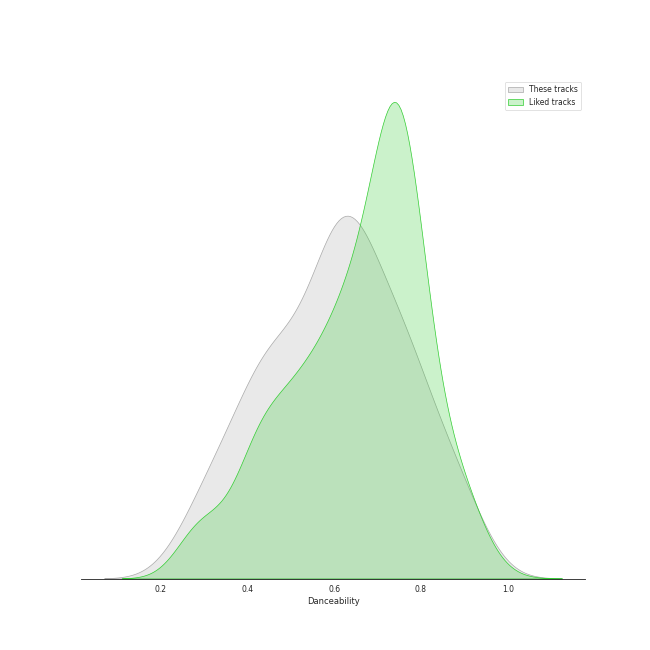
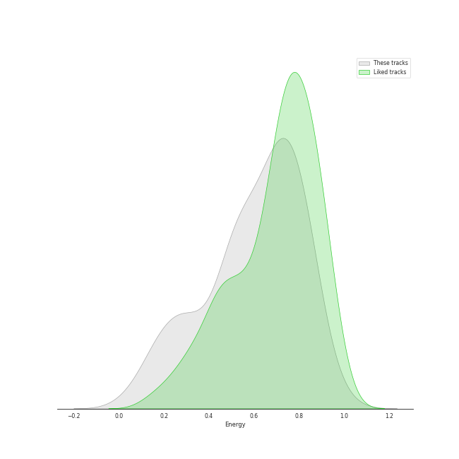
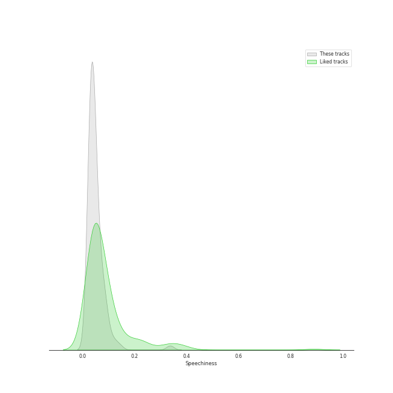
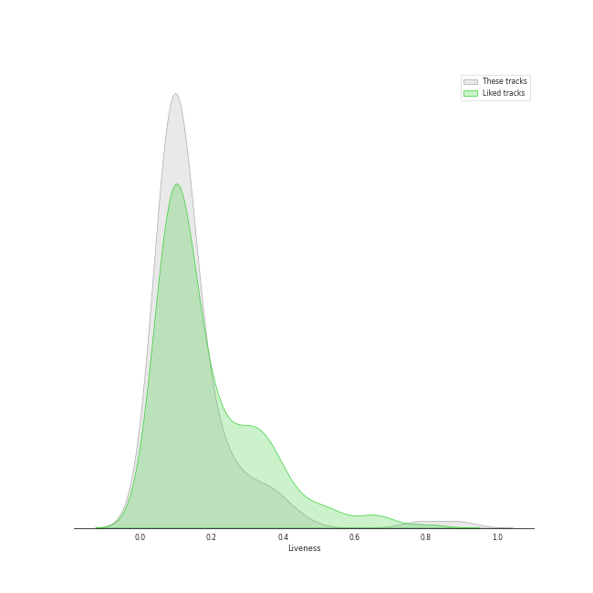
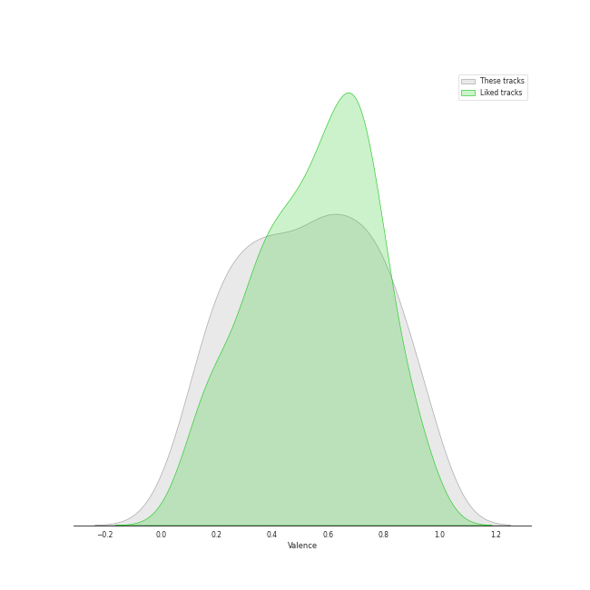

# Track Features for Epic

## Danceability

| ​ | 10 most Danceable tracks | ​​ | 10 least Danceable tracks |
|:---|:---|:---|:---|
|  | Billie Jean (0.932) |  | Stay (0.262) |
|  | P.Y.T. (Pretty Young Thing) (0.894) |  | Gravity (0.27) |
|  | Faith - Remastered (0.887) |  | Once Upon Another Time (0.275) |
|  | Worth It (feat. Kid Ink) (0.884) |  | City (0.319) |
|  | Don't Stop 'Til You Get Enough (0.878) |  | Little Voice (0.321) |
|  | Smooth Criminal - 2012 Remaster (0.853) |  | Come Round Soon (0.338) |
|  | City Of Dreams (feat. Chris Brown) (0.844) |  | Bluebird (0.34) |
|  | Wanna Be Startin' Somethin' (0.842) |  | Bright Lights and Cityscapes (0.343) |
|  | Man in the Mirror - 2012 Remaster (0.808) |  | Everything Changes (0.348) |
|  | Little Black Dress (0.787) |  | Breathe Again (0.366) |

## Energy

| ​ | 10 most Energetic tracks | ​​ | 10 least Energetic tracks |
|:---|:---|:---|:---|
|  | Smooth Criminal - 2012 Remaster (0.981) |  | Kaleidoscope Heart (0.0516) |
|  | Bad Idea (feat. Jason Mraz) (0.889) |  | Goodbye Yellow Brick Road - Live at the Variety Playhouse, Atlanta, GA - May 2013 (0.114) |
|  | Morningside (0.88) |  | Say Something (0.147) |
|  | Let The Rain (0.873) |  | Manhattan (0.168) |
|  | Waka Waka (This Time for Africa) [The Official 2010 FIFA World Cup (TM) Song] (feat. Freshlyground) (0.873) |  | So Far Away (0.172) |
|  | Wanna Be Startin' Somethin' (0.872) |  | Bright Lights and Cityscapes (0.184) |
|  | Fairytale (0.857) |  | Bluebird (0.203) |
|  | That's My Girl (0.851) |  | Little Voice (0.208) |
|  | Brave (0.836) |  | Once Upon Another Time (0.216) |
|  | Hips Don't Lie (feat. Wyclef Jean) (0.824) |  | What's Inside (0.242) |

## Speechiness

| ​ | 10 most Speechy tracks | ​​ | 10 least Speechy tracks |
|:---|:---|:---|:---|
|  | Waka Waka (This Time for Africa) [The Official 2010 FIFA World Cup (TM) Song] (feat. Freshlyground) (0.143) |  | Satellite Call (0.0241) |
|  | That's My Girl (0.121) |  | Breakeven (0.0242) |
|  | Faith - Remastered (0.117) |  | Machine Gun (0.0268) |
|  | Opening Up (0.0936) |  | Orpheus (0.0269) |
|  | Cry for Me (0.0927) |  | Sweet As Whole (0.0275) |
|  | Kaleidoscope Heart (0.0927) |  | Breathe Again (0.0278) |
|  | Don't Stop 'Til You Get Enough (0.089) |  | The Man Who Can't Be Moved (0.0279) |
|  | Worth It (feat. Kid Ink) (0.0882) |  | Dust in the Wind (0.0283) |
|  | Living Proof (0.082) |  | Islands (0.0284) |
|  | Heartbreak Anniversary (0.0791) |  | Señorita (0.0287) |

## Acousticness

| ​ | 10 most Acoustic tracks | ​​ | 10 least Acoustic tracks |
|:---|:---|:---|:---|
|  | Bright Lights and Cityscapes (0.977) |  | Carry on Wayward Son (0.00321) |
|  | Manhattan (0.972) |  | Brave (0.00502) |
|  | Goodbye Yellow Brick Road - Live at the Variety Playhouse, Atlanta, GA - May 2013 (0.959) |  | Waka Waka (This Time for Africa) [The Official 2010 FIFA World Cup (TM) Song] (feat. Freshlyground) (0.00627) |
|  | Bluebird (0.933) |  | Many the Miles (0.00796) |
|  | What's Inside (0.919) |  | Vegas (0.00881) |
|  | So Far Away (0.897) |  | Faith - Remastered (0.0094) |
|  | Once Upon Another Time (0.896) |  | Yoga (0.0159) |
|  | Little Voice (0.89) |  | Bad Idea (feat. Jason Mraz) (0.0168) |
|  | Consequences (0.889) |  | Billie Jean (0.0173) |
|  | Miss Simone (0.859) |  | Wicked Love (0.0178) |

## Instrumentalness

| ​ | 10 most Instrumental tracks | ​​ | 10 least Instrumental tracks |
|:---|:---|:---|:---|
|  | Smooth Criminal - 2012 Remaster (0.468) |  | Say You're Sorry (0.0) |
|  | Wanna Be Startin' Somethin' (0.419) |  | Sweet As Whole (0.0) |
|  | Don't Stop 'Til You Get Enough (0.0461) |  | Come Round Soon (0.0) |
|  | Billie Jean (0.0436) |  | Kaleidoscope Heart (0.0) |
|  | Satellite Call (0.0318) |  | Everything Changes (0.0) |
|  | Islands (0.0261) |  | Vegas (0.0) |
|  | Armor (0.0145) |  | Hercules (0.0) |
|  | Breathe Again (0.00655) |  | Fairytale (0.0) |
|  | Miss Simone (0.00407) |  | Bad Idea (feat. Jason Mraz) (0.0) |
|  | The Light (0.00375) |  | Opening Up (0.0) |

## Liveness

| ​ | 10 most Live tracks | ​​ | 10 least Live tracks |
|:---|:---|:---|:---|
|  | Thriller (0.89) |  | Uncharted (0.0343) |
|  | Goodbye Yellow Brick Road - Live at the Variety Playhouse, Atlanta, GA - May 2013 (0.781) |  | Billie Jean (0.0414) |
|  | Carry on Wayward Son (0.446) |  | Brave (0.0425) |
|  | Hips Don't Lie (feat. Wyclef Jean) (0.405) |  | Eden (0.0456) |
|  | That's My Girl (0.365) |  | Chasing The Sun (0.0497) |
|  | Fire (0.363) |  | I Feel the Earth Move (0.0528) |
|  | Living Proof (0.359) |  | Wanna Be Startin' Somethin' (0.0573) |
|  | Last Christmas (0.355) |  | King of Anything (0.0574) |
|  | Smooth Criminal - 2012 Remaster (0.306) |  | Faith - Remastered (0.0662) |
|  | Heartbreak Anniversary (0.303) |  | P.Y.T. (Pretty Young Thing) (0.0691) |

## Valence

| ​ | 10 most Happy tracks | ​​ | 10 least Happy tracks |
|:---|:---|:---|:---|
|  | P.Y.T. (Pretty Young Thing) (0.961) |  | Once Upon Another Time (0.0551) |
|  | I Choose You (0.947) |  | Say Something (0.0765) |
|  | Don't Stop 'Til You Get Enough (0.947) |  | Islands (0.0863) |
|  | Last Christmas (0.947) |  | Everything Changes (0.0983) |
|  | Wanna Be Startin' Somethin' (0.906) |  | Little Voice (0.134) |
|  | Beat It (0.9) |  | Bluebird (0.161) |
|  | Billie Jean (0.884) |  | What's Inside (0.162) |
|  | Say You're Sorry (0.846) |  | Goodbye Yellow Brick Road - Live at the Variety Playhouse, Atlanta, GA - May 2013 (0.168) |
|  | Grandma Got Run over by a Reindeer (0.817) |  | She Used To Be Mine (0.172) |
|  | La Tortura (feat. Alejandro Sanz) (0.812) |  | Stay (0.181) |

## Tempo

| ​ | 10 most Fast tracks | ​​ | 10 least Fast tracks |
|:---|:---|:---|:---|
|  | Uncharted (203.962) |  | What's Inside (63.218) |
|  | Little Voice (203.518) |  | Bright Lights and Cityscapes (66.509) |
|  | That's My Girl (202.049) |  | Come Round Soon (74.751) |
|  | Brave (185.063) |  | Basket Case (76.196) |
|  | Wicked Love (179.894) |  | Living Proof (77.566) |
|  | Say You're Sorry (170.016) |  | Armor (78.784) |
|  | Breathe Again (169.677) |  | Vegas (79.999) |
|  | Gravity (168.964) |  | Islands (80.023) |
|  | Bad Idea (feat. Jason Mraz) (167.936) |  | Orpheus (80.365) |
|  | Eyes on You (165.97) |  | She Used To Be Mine (81.05) |
