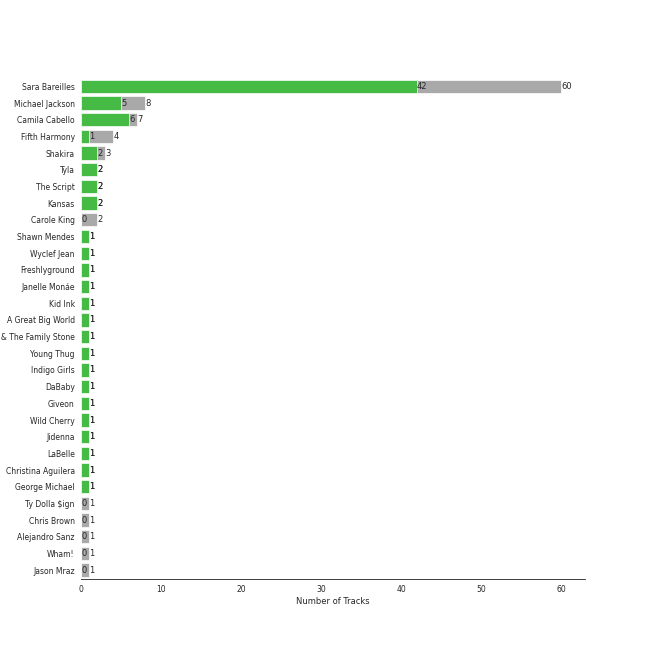
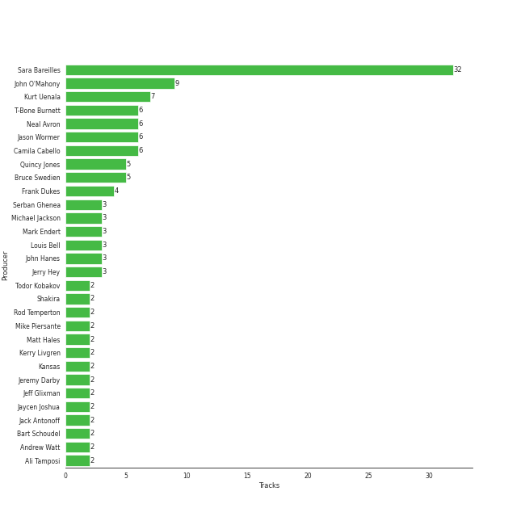

# Epic

96 songs

[See Track Features](audio_features.md)

[See Clusters](clusters/overview.md)

Appears as:
- Epic (74 tracks)
- Syco Music/Epic (10 tracks)
- Epic/Legacy (4 tracks)
- Epic/Not So Fast (2 tracks)
- Epic/Phonogenic (2 tracks)
- Ode/Epic/Legacy (2 tracks)
- Epic/London Ent. (1 tracks)
- Wondaland Records/Epic (1 tracks)

## Top Artists

| Art | Tracks | 💚 | Artist | 🔗 |
|:---|---:|---:|:---|:---|
|  | 60 | 39 | [Sara Bareilles](../../artists/sara_bareilles/overview.md) |  |
|  | 7 | 6 | [Camila Cabello](../../artists/camila_cabello/overview.md) |  |
|  | 8 | 5 | [Michael Jackson](../../artists/michael_jackson/overview.md) |  |
|  | 3 | 2 | Shakira |  |
|  | 2 | 2 | The Script |  |
|  | 3 | 1 | Fifth Harmony |  |
|  | 2 | 1 | Giveon |  |
|  | 2 | 1 | Kansas |  |
|  | 1 | 1 | Shawn Mendes |  |
|  | 1 | 1 | Wyclef Jean |  |

See all 27 artists

| Art | Tracks | 💚 | Artist | 🔗 |
|:---|---:|---:|:---|:---|
|  | 1 | 1 | Freshlyground |  |
|  | 1 | 1 | [Janelle Mon谩e](../../artists/janelle_mon谩e/overview.md) |  |
|  | 1 | 1 | Kid Ink |  |
|  | 1 | 1 | A Great Big World |  |
|  | 1 | 1 | Young Thug |  |
|  | 1 | 1 | Indigo Girls |  |
|  | 1 | 1 | DaBaby |  |
|  | 1 | 1 | Jidenna |  |
|  | 1 | 1 | Christina Aguilera |  |
|  | 1 | 1 | George Michael |  |
|  | 2 | 0 | Carole King |  |
|  | 1 | 0 | Chris Brown |  |
|  | 1 | 0 | Alejandro Sanz |  |
|  | 1 | 0 | Wham! |  |
|  | 1 | 0 | Jason Mraz |  |
|  | 1 | 0 | Elmo & Patsy |  |
|  | 1 | 0 | Tyla Yaweh |  |

## Top Albums

| Art | Tracks | 💚 | Album | Release Date | 🔗 |
|:---|---:|---:|:---|:---|:---|
|  | 13 | 10 | Kaleidoscope Heart | 2010-09-07 |  |
|  | 12 | 11 | The Blessed Unrest | 2013-07-16 |  |
|  | 12 | 8 | Little Voice | 2007-07-03 |  |
|  | 10 | 5 | Amidst the Chaos (Bonus Version) | 2019-05-10 |  |
|  | 6 | 1 | What's Inside: Songs from Waitress | 2015-11-06 |  |
|  | 5 | 4 | Once Upon Another Time | 2012-05-22 |  |
|  | 4 | 3 | Thriller | 1982-11-30 |  |
|  | 3 | 3 | Camila | 2018-01-12 |  |
|  | 3 | 2 | Romance | 2019-12-06 |  |
|  | 2 | 2 | The Script | 2008-07-14 |  |

See all 34 albums

| Art | Tracks | 💚 | Album | Release Date | 🔗 |
|:---|---:|---:|:---|:---|:---|
|  | 2 | 1 | Bad (Remastered) | 1987-08-31 |  |
|  | 2 | 0 | Tapestry | 1971 |  |
|  | 1 | 1 | Yoga | 2015-03-31 |  |
|  | 1 | 1 | Waka Waka (This Time for Africa) [The Official 2010 FIFA World Cup (TM) Song] (feat. Freshlyground) | 2010-05-07 |  |
|  | 1 | 1 | Reflection (Deluxe) | 2015-01-30 |  |
|  | 1 | 1 | Point Of Know Return (Expanded Edition) | 1977 |  |
|  | 1 | 1 | Oral Fixation, Vol. 2 (Expanded Edition) | 2005-11-28 |  |
|  | 1 | 1 | Nomads 路 Indians 路 Saints (Expanded Edition) | 1990-09-21 |  |
|  | 1 | 1 | Is There Anybody Out There? | 2014-01-20 |  |
|  | 1 | 1 | Heartbreak Anniversary | 2020-02-21 |  |
|  | 1 | 1 | HIStory - PAST, PRESENT AND FUTURE - BOOK I | 1995-06-16 |  |
|  | 1 | 1 | Faith | 1987-10-30 |  |
|  | 1 | 1 | Cry for Me | 2019-10-04 |  |
|  | 1 | 0 | TAKE TIME | 2020-03-27 |  |
|  | 1 | 0 | Off the Wall | 1979-08-10 |  |
|  | 1 | 0 | More Love - Songs from Little Voice Season One | 2020-09-04 |  |
|  | 1 | 0 | Leftoverture (Expanded Edition) | 1976 |  |
|  | 1 | 0 | LAST CHRISTMAS | 1984-11-29 |  |
|  | 1 | 0 | Heart Full of Rage 2 | 2023-08-04 |  |
|  | 1 | 0 | Grandma Got Run Over By A Reindeer | 1984 |  |
|  | 1 | 0 | Fijaci贸n Oral, Vol. 1 | 2005-06-03 |  |
|  | 1 | 0 | Brave Enough: Live at the Variety Playhouse | 2013-10-22 |  |
|  | 1 | 0 | All I Want for Christmas Is You | 2014-11-17 |  |
|  | 1 | 0 | 7/27 (Deluxe) | 2016-05-27 |  |

## Genres

| Tracks | 💚 | Genre |
|---:|---:|:---|
| 62 | 41 | [viral pop](../../genres/viral_pop/overview.md) |
| 61 | 40 | [pop rock](../../genres/pop_rock/overview.md) |
| 61 | 40 | [neo mellow](../../genres/neo_mellow/overview.md) |
| 61 | 40 | [lilith](../../genres/lilith/overview.md) |
| 61 | 40 | [ectofolk](../../genres/ectofolk/overview.md) |
| 60 | 39 | [post-teen pop](../../genres/post-teen_pop/overview.md) |
| 60 | 39 | [acoustic pop](../../genres/acoustic_pop/overview.md) |
| 15 | 11 | [pop](../../genres/pop/overview.md) |
| 11 | 7 | [r&b](../../genres/r_b/overview.md) |
| 9 | 7 | [dance pop](../../genres/dance_pop/overview.md) |

See all 40 genres

| Tracks | 💚 | Genre |
|---:|---:|:---|
| 8 | 5 | [soul](../../genres/soul/overview.md) |
| 3 | 2 | latin pop |
| 3 | 2 | colombian pop |
| 2 | 2 | celtic rock |
| 5 | 1 | [soft rock](../../genres/soft_rock/overview.md) |
| 4 | 1 | [mellow gold](../../genres/mellow_gold/overview.md) |
| 4 | 1 | [classic rock](../../genres/classic_rock/overview.md) |
| 3 | 1 | talent show |
| 3 | 1 | [singer-songwriter](../../genres/singer-songwriter/overview.md) |
| 3 | 1 | girl group |
| 3 | 1 | folk |
| 2 | 1 | [rock](../../genres/rock/overview.md) |
| 2 | 1 | progressive rock |
| 2 | 1 | new wave pop |
| 2 | 1 | [heartland rock](../../genres/heartland_rock/overview.md) |
| 2 | 1 | [hard rock](../../genres/hard_rock/overview.md) |
| 2 | 1 | [album rock](../../genres/album_rock/overview.md) |
| 1 | 1 | women's music |
| 1 | 1 | [piano rock](../../genres/piano_rock/overview.md) |
| 1 | 1 | neo soul |
| 1 | 1 | [canadian pop](../../genres/canadian_pop/overview.md) |
| 1 | 1 | atl hip hop |
| 1 | 1 | alternative r&b |
| 1 | 1 | afrofuturism |
| 2 | 0 | folk rock |
| 2 | 0 | brill building pop |
| 1 | 0 | novelty |
| 1 | 0 | new romantic |
| 1 | 0 | melodic rap |
| 1 | 0 | cali rap |

## Top Producers

| Art | Producer | Tracks | Credit Types |
|:---|:---|---:|:---|
|  | [Sara Bareilles](../../artists/sara_bareilles/overview.md) | 30 | Lyricist, Songwriter, Producer |
| | John O'Mahony | 8 | Producer |
|  | [Camila Cabello](../../artists/camila_cabello/overview.md) | 6 | Songwriter |
| | Kurt Uenala | 6 | Producer |
| | Neal Avron | 6 | Arranger, Producer |
| | T-Bone Burnett | 5 | Producer |
| | Jason Wormer | 5 | Producer |
| | Quincy Jones | 5 | Producer, Arranger, Songwriter |
| | Bruce Swedien | 5 | Producer |
| | Frank Dukes | 4 | Songwriter, Producer |

View all

| Art | Producer | Tracks | Credit Types |
|:---|:---|---:|:---|
| | Jerry Hey | 3 | Arranger |
| | Mark Endert | 3 | Producer |
| | John Hanes | 3 | Producer |
| | Louis Bell | 3 | Songwriter, Producer |
| | Serban Ghenea | 3 | Producer |
|  | [Michael Jackson](../../artists/michael_jackson/overview.md) | 3 | Lyricist, Producer, Songwriter, Arranger |
|  | Shakira | 2 | Songwriter |
| | Bart Schoudel | 2 | Producer |
| | Rod Temperton | 2 | Arranger, Lyricist, Songwriter |
| | Matt Hales | 2 | Songwriter |
| | Jaycen Joshua | 2 | Producer |
| | Jeremy Darby | 2 | Producer |
| | Todor Kobakov | 2 | Arranger |
| | Andrew Watt | 2 | Producer, Songwriter |
| | Mike Piersante | 2 | Producer |
| | Ali Tamposi | 2 | Songwriter |
| | Jack Antonoff | 2 | Songwriter |
| | Justin Tranter | 1 | Songwriter |
| | Anthony Marinelli | 1 | Producer |
| | Javier Dunn | 1 | Songwriter |
| | Luis Diaz | 1 | Songwriter |
| | Savan Kotecha | 1 | Songwriter |
| | Mike Gaydusek | 1 | Producer |
| | Mike Campbell | 1 | Songwriter |
| | Alejandro Guillermo Marambio Altamirano | 1 | Songwriter |
| | Patrick Benson | 1 | Producer |
|  | Emily King | 1 | Songwriter |
|  | Pharrell Williams | 1 | Songwriter |
| | Matt Beckley | 1 | Producer |
| | James Ingram | 1 | Arranger, Songwriter |
| | Kyle Mann | 1 | Producer |
|  | Shawn Mendes | 1 | Songwriter |
| | Ori Kaplan | 1 | Producer, Songwriter |
| | Suzie Katayama | 1 | Arranger |
| | Eric Rosse | 1 | Producer |
|  | George Michael | 1 | Arranger, Lyricist, Producer, Songwriter |
| | John Hill | 1 | Songwriter |
| | Scott Litt | 1 | Producer |
| | Ryan Tedder | 1 | Songwriter |
| | Sam Farrar | 1 | Songwriter |
| | Terry Becker | 1 | Producer |
| | Danny O'Donoghue | 1 | Songwriter |
| | Steve Kipner | 1 | Songwriter |
| | Jason Blynn | 1 | Songwriter |
| | Tor Erik Hermansen | 1 | Songwriter |
| | Ant Clemons | 1 | Songwriter |
| | Starrah | 1 | Songwriter |
| | Tommy Walter | 1 | Producer |
| | Amy Wadge | 1 | Songwriter |
| | Bill Wolfer | 1 | Producer |
| | Chad Vaccarino | 1 | Songwriter |
| | Emily Weisband | 1 | Songwriter |
| | Noonie Bao | 1 | Songwriter |
| | Aaron Sterling | 1 | Songwriter |
| | Pete Harper | 1 | Songwriter |
| | Danny D | 1 | Producer |
| | Omar Alfanno | 1 | Songwriter |
| | Jack Patterson | 1 | Songwriter |
| | Jerry Duplessis | 1 | Songwriter |
| | LaTabia Parker | 1 | Songwriter |
| | Ian Axel | 1 | Songwriter |
|  | Kansas | 1 | Arranger |
| | Mark Sheehan | 1 | Songwriter |
| | Nathaniel Alford | 1 | Producer |
| | Tim Blacksmith | 1 | Producer |
| | Mikkel Storleer Eriksen | 1 | Producer, Songwriter |
|  | benny blanco | 1 | Producer, Songwriter |
| | Paul LaMalfa | 1 | Producer |
| | Zachary Dawes | 1 | Producer |
| | Emily Saliers | 1 | Lyricist, Songwriter |
| | Rami Dawod | 1 | Songwriter |
| | Manny Marroquin | 1 | Producer |
| | Miles Walker | 1 | Producer |
| | Andrew Frampton | 1 | Songwriter |
| | Stargate | 1 | Producer |
|  | Wyclef Jean | 1 | Songwriter |
| | Joseph Lorge | 1 | Producer |
| | Brian Lee | 1 | Songwriter |
| | Steve Porcaro | 1 | Producer |
|  | Young Thug | 1 | Songwriter |
| | Carl Lieberman, RPT | 1 | Producer |
| | Jacob Olofsson | 1 | Songwriter |
| | Jarami | 1 | Producer |
| | Robbie Soukiasyan | 1 | Producer |
| | Sasha Yatchenko | 1 | Songwriter |
| | Kaan Gunesberk | 1 | Songwriter |
|  | Charli XCX | 1 | Songwriter |
| | Mike Anderson | 1 | Producer |
| | Cashmere Cat | 1 | Producer, Songwriter |
| | Jeff Glixman | 1 | Producer |

## Tracks released under Epic

| Art | Track | Album | Artists | Label | 💚 | 🔗 |
|:---|:---|:---|:---|:---|:---|:---|
|  | Say Something | Is There Anybody Out There? | A Great Big World, Christina Aguilera | [Epic](.) |  |  |
|  | Consequences | Camila | [Camila Cabello](../../artists/camila_cabello/overview.md) | [Epic](.), [Syco Music](../syco_music) |  |  |
|  | Havana (feat. Young Thug) | Camila | [Camila Cabello](../../artists/camila_cabello/overview.md), Young Thug | [Epic](.), [Syco Music](../syco_music) |  |  |
|  | Never Be the Same | Camila | [Camila Cabello](../../artists/camila_cabello/overview.md) | [Epic](.), [Syco Music](../syco_music) |  |  |
|  | Cry for Me | Cry for Me | [Camila Cabello](../../artists/camila_cabello/overview.md) | [Epic](.), [Syco Music](../syco_music) |  |  |
|  | Living Proof | Romance | [Camila Cabello](../../artists/camila_cabello/overview.md) | [Epic](.), [Syco Music](../syco_music) | |  |
|  | My Oh My (feat. DaBaby) | Romance | [Camila Cabello](../../artists/camila_cabello/overview.md), DaBaby | [Epic](.), [Syco Music](../syco_music) |  |  |
|  | I Feel the Earth Move | Tapestry | Carole King | Ode, [Epic](.), [Legacy](../legacy) | |  |
|  | So Far Away | Tapestry | Carole King | Ode, [Epic](.), [Legacy](../legacy) | |  |
|  | Grandma Got Run over by a Reindeer | Grandma Got Run Over By A Reindeer | Elmo & Patsy | [Epic](.) | |  |

See all tracks

| Art | Track | Album | Artists | Label | 💚 | 🔗 |
|:---|:---|:---|:---|:---|:---|:---|
|  | All I Want for Christmas Is You | All I Want for Christmas Is You | Fifth Harmony | [Epic](.), [Syco Music](../syco_music) | |  |
|  | Worth It (feat. Kid Ink) | Reflection (Deluxe) | Fifth Harmony, Kid Ink | [Epic](.), [Syco Music](../syco_music) |  |  |
|  | That's My Girl | 7/27 (Deluxe) | Fifth Harmony | [Epic](.), [Syco Music](../syco_music) | |  |
|  | Faith - Remastered | Faith | George Michael | [Epic](.) |  |  |
|  | Heartbreak Anniversary | Heartbreak Anniversary | Giveon | [Epic/Not So Fast](.) |  |  |
|  | Heartbreak Anniversary | TAKE TIME | Giveon | [Epic/Not So Fast](.) | |  |
|  | Hammer And A Nail | Nomads 路 Indians 路 Saints (Expanded Edition) | Indigo Girls | [Epic](.) |  |  |
|  | Yoga | Yoga | [Janelle Mon谩e](../../artists/janelle_mon谩e/overview.md), Jidenna | [Wondaland Records/Epic](.) |  |  |
|  | Carry on Wayward Son | Leftoverture (Expanded Edition) | Kansas | [Epic](.), [Legacy](../legacy) | |  |
|  | Dust in the Wind | Point Of Know Return (Expanded Edition) | Kansas | [Epic](.), [Legacy](../legacy) |  |  |
|  | Don't Stop 'Til You Get Enough | Off the Wall | [Michael Jackson](../../artists/michael_jackson/overview.md) | [Epic](.) | |  |
|  | Billie Jean | Thriller | [Michael Jackson](../../artists/michael_jackson/overview.md) | [Epic](.) |  |  |
|  | P.Y.T. (Pretty Young Thing) | Thriller | [Michael Jackson](../../artists/michael_jackson/overview.md) | [Epic](.) |  |  |
|  | Thriller | Thriller | [Michael Jackson](../../artists/michael_jackson/overview.md) | [Epic](.) |  |  |
|  | Wanna Be Startin' Somethin' | Thriller | [Michael Jackson](../../artists/michael_jackson/overview.md) | [Epic](.) | |  |
|  | Man in the Mirror - 2012 Remaster | Bad (Remastered) | [Michael Jackson](../../artists/michael_jackson/overview.md) | [Epic](.), [Legacy](../legacy) | |  |
|  | Smooth Criminal - 2012 Remaster | Bad (Remastered) | [Michael Jackson](../../artists/michael_jackson/overview.md) | [Epic](.), [Legacy](../legacy) |  |  |
|  | Beat It | HIStory - PAST, PRESENT AND FUTURE - BOOK I | [Michael Jackson](../../artists/michael_jackson/overview.md) | [Epic](.) |  |  |
|  | Between the Lines | Little Voice | [Sara Bareilles](../../artists/sara_bareilles/overview.md) | [Epic](.) |  |  |
|  | Bottle It Up | Little Voice | [Sara Bareilles](../../artists/sara_bareilles/overview.md) | [Epic](.) |  |  |
|  | City | Little Voice | [Sara Bareilles](../../artists/sara_bareilles/overview.md) | [Epic](.) | |  |
|  | Come Round Soon | Little Voice | [Sara Bareilles](../../artists/sara_bareilles/overview.md) | [Epic](.) |  |  |
|  | Fairytale | Little Voice | [Sara Bareilles](../../artists/sara_bareilles/overview.md) | [Epic](.) |  |  |
|  | Gravity | Little Voice | [Sara Bareilles](../../artists/sara_bareilles/overview.md) | [Epic](.) |  |  |
|  | Love On the Rocks | Little Voice | [Sara Bareilles](../../artists/sara_bareilles/overview.md) | [Epic](.) |  |  |
|  | Love Song | Little Voice | [Sara Bareilles](../../artists/sara_bareilles/overview.md) | [Epic](.) |  |  |
|  | Many the Miles | Little Voice | [Sara Bareilles](../../artists/sara_bareilles/overview.md) | [Epic](.) |  |  |
|  | Morningside | Little Voice | [Sara Bareilles](../../artists/sara_bareilles/overview.md) | [Epic](.) | |  |
|  | One Sweet Love | Little Voice | [Sara Bareilles](../../artists/sara_bareilles/overview.md) | [Epic](.) | |  |
|  | Vegas | Little Voice | [Sara Bareilles](../../artists/sara_bareilles/overview.md) | [Epic](.) | |  |
|  | Basket Case | Kaleidoscope Heart | [Sara Bareilles](../../artists/sara_bareilles/overview.md) | [Epic](.) | |  |
|  | Bluebird | Kaleidoscope Heart | [Sara Bareilles](../../artists/sara_bareilles/overview.md) | [Epic](.) |  |  |
|  | Breathe Again | Kaleidoscope Heart | [Sara Bareilles](../../artists/sara_bareilles/overview.md) | [Epic](.) |  |  |
|  | Gonna Get Over You | Kaleidoscope Heart | [Sara Bareilles](../../artists/sara_bareilles/overview.md) | [Epic](.) |  |  |
|  | Hold My Heart | Kaleidoscope Heart | [Sara Bareilles](../../artists/sara_bareilles/overview.md) | [Epic](.) | |  |
|  | Kaleidoscope Heart | Kaleidoscope Heart | [Sara Bareilles](../../artists/sara_bareilles/overview.md) | [Epic](.) |  |  |
|  | King of Anything | Kaleidoscope Heart | [Sara Bareilles](../../artists/sara_bareilles/overview.md) | [Epic](.) |  |  |
|  | Let The Rain | Kaleidoscope Heart | [Sara Bareilles](../../artists/sara_bareilles/overview.md) | [Epic](.) |  |  |
|  | Machine Gun | Kaleidoscope Heart | [Sara Bareilles](../../artists/sara_bareilles/overview.md) | [Epic](.) |  |  |
|  | Not Alone | Kaleidoscope Heart | [Sara Bareilles](../../artists/sara_bareilles/overview.md) | [Epic](.) |  |  |
|  | Say You're Sorry | Kaleidoscope Heart | [Sara Bareilles](../../artists/sara_bareilles/overview.md) | [Epic](.) | |  |
|  | The Light | Kaleidoscope Heart | [Sara Bareilles](../../artists/sara_bareilles/overview.md) | [Epic](.) |  |  |
|  | Uncharted | Kaleidoscope Heart | [Sara Bareilles](../../artists/sara_bareilles/overview.md) | [Epic](.) |  |  |
|  | Bright Lights and Cityscapes | Once Upon Another Time | [Sara Bareilles](../../artists/sara_bareilles/overview.md) | [Epic](.) | |  |
|  | Lie To Me | Once Upon Another Time | [Sara Bareilles](../../artists/sara_bareilles/overview.md) | [Epic](.) |  |  |
|  | Once Upon Another Time | Once Upon Another Time | [Sara Bareilles](../../artists/sara_bareilles/overview.md) | [Epic](.) |  |  |
|  | Stay | Once Upon Another Time | [Sara Bareilles](../../artists/sara_bareilles/overview.md) | [Epic](.) |  |  |
|  | Sweet As Whole | Once Upon Another Time | [Sara Bareilles](../../artists/sara_bareilles/overview.md) | [Epic](.) |  |  |
|  | 1000 Times | The Blessed Unrest | [Sara Bareilles](../../artists/sara_bareilles/overview.md) | [Epic](.) |  |  |
|  | Brave | The Blessed Unrest | [Sara Bareilles](../../artists/sara_bareilles/overview.md) | [Epic](.) |  |  |
|  | Cassiopeia | The Blessed Unrest | [Sara Bareilles](../../artists/sara_bareilles/overview.md) | [Epic](.) |  |  |
|  | Chasing The Sun | The Blessed Unrest | [Sara Bareilles](../../artists/sara_bareilles/overview.md) | [Epic](.) |  |  |
|  | December | The Blessed Unrest | [Sara Bareilles](../../artists/sara_bareilles/overview.md) | [Epic](.) | |  |
|  | Eden | The Blessed Unrest | [Sara Bareilles](../../artists/sara_bareilles/overview.md) | [Epic](.) |  |  |
|  | Hercules | The Blessed Unrest | [Sara Bareilles](../../artists/sara_bareilles/overview.md) | [Epic](.) |  |  |
|  | I Choose You | The Blessed Unrest | [Sara Bareilles](../../artists/sara_bareilles/overview.md) | [Epic](.) |  |  |
|  | Islands | The Blessed Unrest | [Sara Bareilles](../../artists/sara_bareilles/overview.md) | [Epic](.) |  |  |
|  | Little Black Dress | The Blessed Unrest | [Sara Bareilles](../../artists/sara_bareilles/overview.md) | [Epic](.) |  |  |
|  | Manhattan | The Blessed Unrest | [Sara Bareilles](../../artists/sara_bareilles/overview.md) | [Epic](.) |  |  |
|  | Satellite Call | The Blessed Unrest | [Sara Bareilles](../../artists/sara_bareilles/overview.md) | [Epic](.) |  |  |
|  | Goodbye Yellow Brick Road - Live at the Variety Playhouse, Atlanta, GA - May 2013 | Brave Enough: Live at the Variety Playhouse | [Sara Bareilles](../../artists/sara_bareilles/overview.md) | [Epic](.) | |  |
|  | Bad Idea (feat. Jason Mraz) | What's Inside: Songs from Waitress | [Sara Bareilles](../../artists/sara_bareilles/overview.md), Jason Mraz | [Epic](.) | |  |
|  | Everything Changes | What's Inside: Songs from Waitress | [Sara Bareilles](../../artists/sara_bareilles/overview.md) | [Epic](.) | |  |
|  | I Didn't Plan It | What's Inside: Songs from Waitress | [Sara Bareilles](../../artists/sara_bareilles/overview.md) | [Epic](.) | |  |
|  | Opening Up | What's Inside: Songs from Waitress | [Sara Bareilles](../../artists/sara_bareilles/overview.md) | [Epic](.) | |  |
|  | She Used To Be Mine | What's Inside: Songs from Waitress | [Sara Bareilles](../../artists/sara_bareilles/overview.md) | [Epic](.) |  |  |
|  | What's Inside | What's Inside: Songs from Waitress | [Sara Bareilles](../../artists/sara_bareilles/overview.md) | [Epic](.) | |  |
|  | Armor | Amidst the Chaos (Bonus Version) | [Sara Bareilles](../../artists/sara_bareilles/overview.md) | [Epic](.) |  |  |
|  | Eyes on You | Amidst the Chaos (Bonus Version) | [Sara Bareilles](../../artists/sara_bareilles/overview.md) | [Epic](.) | |  |
|  | Fire | Amidst the Chaos (Bonus Version) | [Sara Bareilles](../../artists/sara_bareilles/overview.md) | [Epic](.) |  |  |
|  | If I Can't Have You | Amidst the Chaos (Bonus Version) | [Sara Bareilles](../../artists/sara_bareilles/overview.md) | [Epic](.) |  |  |
|  | Miss Simone | Amidst the Chaos (Bonus Version) | [Sara Bareilles](../../artists/sara_bareilles/overview.md) | [Epic](.) |  |  |
|  | No Such Thing | Amidst the Chaos (Bonus Version) | [Sara Bareilles](../../artists/sara_bareilles/overview.md) | [Epic](.) |  |  |
|  | Orpheus | Amidst the Chaos (Bonus Version) | [Sara Bareilles](../../artists/sara_bareilles/overview.md) | [Epic](.) | |  |
|  | Poetry by Dead Men | Amidst the Chaos (Bonus Version) | [Sara Bareilles](../../artists/sara_bareilles/overview.md) | [Epic](.) | |  |
|  | Someone Who Loves Me | Amidst the Chaos (Bonus Version) | [Sara Bareilles](../../artists/sara_bareilles/overview.md) | [Epic](.) | |  |
|  | Wicked Love | Amidst the Chaos (Bonus Version) | [Sara Bareilles](../../artists/sara_bareilles/overview.md) | [Epic](.) | |  |
|  | Little Voice | More Love - Songs from Little Voice Season One | [Sara Bareilles](../../artists/sara_bareilles/overview.md) | [Epic](.) | |  |
|  | La Tortura (feat. Alejandro Sanz) | Fijaci贸n Oral, Vol. 1 | Shakira, Alejandro Sanz | [Epic](.) | |  |
|  | Hips Don't Lie (feat. Wyclef Jean) | Oral Fixation, Vol. 2 (Expanded Edition) | Shakira, Wyclef Jean | [Epic](.) |  |  |
|  | Waka Waka (This Time for Africa) [The Official 2010 FIFA World Cup (TM) Song] (feat. Freshlyground) | Waka Waka (This Time for Africa) [The Official 2010 FIFA World Cup (TM) Song] (feat. Freshlyground) | Shakira, Freshlyground | [Epic](.) |  |  |
|  | Se帽orita | Romance | Shawn Mendes, [Camila Cabello](../../artists/camila_cabello/overview.md) | [Epic](.), [Syco Music](../syco_music) |  |  |
|  | Breakeven | The Script | The Script | [Epic/Phonogenic](.) |  |  |
|  | The Man Who Can't Be Moved | The Script | The Script | [Epic/Phonogenic](.) |  |  |
|  | City Of Dreams (feat. Chris Brown) | Heart Full of Rage 2 | Tyla Yaweh, Chris Brown | [Epic/London Ent.](.) | |  |
|  | Last Christmas | LAST CHRISTMAS | Wham! | [Epic](.) | |  |

